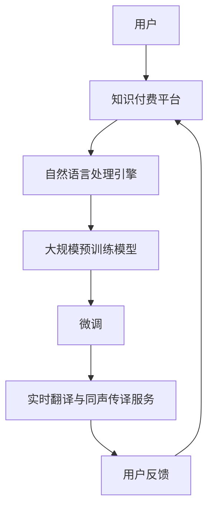

                 

# 如何利用知识付费实现在线语言翻译与同声传译？

在当今全球化的经济体系中，语言翻译扮演着至关重要的角色，能够打破语言壁垒，促进国际交流与合作。然而，传统的语言翻译成本高昂且效率低下，难以满足日益增长的实时翻译需求。为了解决这一问题，知识付费平台开始利用先进的AI技术，如自然语言处理(NLP)和大规模预训练模型，提供高质量的在线语言翻译与同声传译服务。本文将深入探讨如何通过知识付费模式，实现这一目标。

## 1. 背景介绍

### 1.1 问题由来

随着全球化进程的加快，跨国贸易、外交和旅游等活动的频繁，对于高质量的语言翻译服务的需求日益增加。传统的人力翻译成本高昂、效率低下，难以满足实时翻译的需求。近年来，AI技术在NLP领域取得了飞速进展，尤其是在大规模预训练模型和微调技术的应用上，大模型如BERT、GPT等展现了强大的语言理解和生成能力，为在线翻译和同声传译提供了新的可能性。

然而，高质量的在线翻译和同声传译服务，仍面临诸如成本、实时性、准确性等诸多挑战。如何利用知识付费模式，整合先进AI技术，实现高质量、高效益的翻译服务，成为当下亟待解决的问题。

### 1.2 问题核心关键点

本文将围绕以下几个核心关键点，探讨如何利用知识付费模式，实现在线语言翻译与同声传译：

- 选择合适的预训练模型和大模型架构。
- 设计高效的微调算法和损失函数。
- 构建实时、可靠的系统架构。
- 确保翻译服务的准确性和流畅性。
- 实现知识付费模式下的可持续盈利。

## 2. 核心概念与联系

### 2.1 核心概念概述

为更好地理解在线语言翻译与同声传译的实现过程，本节将介绍几个关键概念：

- **自然语言处理(Natural Language Processing, NLP)**：指使计算机理解、分析、生成人类语言的技术。
- **大规模预训练模型(Large Pre-trained Model, LPM)**：如BERT、GPT等，通过在大量无标签文本数据上进行预训练，学习到语言和语义的通用表示。
- **微调(Fine-tuning)**：在大规模预训练模型的基础上，通过有监督学习优化模型在特定任务上的性能。
- **同声传译(Simultaneous Interpreting, SI)**：指同时听取两种语言的讲话，并在讲者讲话期间完成翻译，要求极高的实时性和准确性。
- **在线语言翻译(Online Language Translation)**：指通过网络平台，将用户输入的语言文本实时翻译成目标语言，要求准确性和流畅性。
- **知识付费模式(Knowledge-based Subscription Model)**：通过订阅或按需付费的方式，为高质量的翻译服务定价，使用户能够按需获取服务，同时实现平台的可持续发展。

这些核心概念之间存在紧密的联系，通过知识的共享和付费，能够有效整合资源，提高翻译服务的效率和质量。

### 2.2 核心概念原理和架构的 Mermaid 流程图



以上流程图展示了在线翻译与同声传译的主要流程：用户通过知识付费平台请求服务，平台调用自然语言处理引擎，利用大规模预训练模型进行微调，最后提供实时翻译或同声传译服务。同时，用户的反馈能够帮助平台不断优化服务质量。

## 3. 核心算法原理 & 具体操作步骤

### 3.1 算法原理概述

在线语言翻译与同声传译的核心算法原理基于自然语言处理和机器翻译技术。通过大规模预训练模型，模型已经掌握了丰富的语言知识和语义理解能力。微调算法进一步优化模型在特定翻译任务上的性能，从而提升翻译的准确性和流畅性。

### 3.2 算法步骤详解

#### 3.2.1 预训练模型选择与准备

1. **模型选择**：选择适合的大规模预训练模型，如BERT、GPT、T5等，作为翻译任务的初始化参数。
2. **数据准备**：收集足够的双语对照文本，用于训练模型。

#### 3.2.2 微调算法实现

1. **微调数据预处理**：将双语对照文本划分为训练集、验证集和测试集。
2. **微调超参数设置**：选择合适的优化算法、学习率、批大小等。
3. **模型微调**：
   - 在训练集上迭代优化模型，计算损失函数。
   - 在验证集上定期评估模型性能，防止过拟合。
   - 在测试集上最终评估模型性能。

#### 3.2.3 实时翻译与同声传译实现

1. **实时翻译**：
   - 用户输入待翻译文本。
   - 自然语言处理引擎将文本映射为模型输入。
   - 模型输出目标语言文本。
2. **同声传译**：
   - 用户进行双语讲话。
   - 语音识别模块将语音转换为文本。
   - 自然语言处理引擎进行文本翻译。
   - 语音合成模块将翻译结果转换为语音输出。

### 3.3 算法优缺点

#### 3.3.1 优点

- **高准确性**：大规模预训练模型经过微调，能够精确捕捉语言细节，提供高质量翻译。
- **实时性**：微调后的模型能够快速响应用户需求，提供即时的翻译服务。
- **可扩展性**：平台可以根据需求，增加新的语言对，提升服务的多样性。
- **用户定制**：用户可以根据实际需求，选择不同的翻译服务，满足个性化需求。

#### 3.3.2 缺点

- **数据依赖**：微调效果依赖于高质量的双语对照文本，数据获取成本高。
- **计算资源需求**：大规模预训练和微调需要大量计算资源，成本较高。
- **上下文理解局限**：模型可能无法处理复杂的语境和隐喻，导致翻译不准确。

### 3.4 算法应用领域

在线语言翻译与同声传译技术，已经广泛应用于以下领域：

- **教育领域**：在线英语课程、语言学习应用，提供实时翻译和字幕。
- **商务领域**：国际贸易谈判、跨国公司会议，提高交流效率。
- **旅游领域**：旅游指导、语言导览，提供多语言支持。
- **医疗领域**：医学文献翻译、多语种健康咨询，促进医疗交流。
- **文化娱乐**：在线影视、音乐等内容的翻译与字幕生成。

## 4. 数学模型和公式 & 详细讲解 & 举例说明

### 4.1 数学模型构建

本节将介绍在线翻译与同声传译的数学模型构建。

设待翻译文本为 $X$，目标文本为 $Y$，翻译模型为 $M_{\theta}$，其中 $\theta$ 为模型参数。在线翻译的目标是最大化目标文本 $Y$ 的概率，即：

$$
\arg\max_Y P(Y|X) = \arg\max_Y \frac{P(X,Y)}{P(X)} = \arg\max_Y \frac{P(X,Y)}{\sum_Y P(X,Y)}
$$

其中 $P(X,Y)$ 表示 $X$ 和 $Y$ 的联合概率，$P(X)$ 为 $X$ 的边缘概率。

### 4.2 公式推导过程

对于同声传译，由于需要在讲话过程中实时翻译，我们需要考虑模型的延迟和实时性要求。

假设模型在时间 $t$ 时已经接收到了长度为 $T$ 的输入序列 $X$，在时间 $t+1$ 时，输入序列长度变为 $T+1$，添加了一个新的输入 $x_{t+1}$，此时目标序列长度仍为 $T$。我们可以将问题转化为序列到序列的翻译任务，即：

$$
P(Y|X) = \prod_{t=1}^{T} P(y_t|x_1, x_2, ..., x_t)
$$

其中 $y_t$ 为目标序列在时间 $t$ 时的输出，$x_1, x_2, ..., x_t$ 为输入序列的前 $t$ 个词。

### 4.3 案例分析与讲解

以英文到中文的在线翻译为例，我们通过微调训练一个BERT模型。

1. **数据准备**：收集英文到中文的双语对照文本，用于训练和验证。
2. **模型微调**：
   - 在训练集上迭代训练，计算交叉熵损失：
   $$
   L = -\frac{1}{N} \sum_{i=1}^{N} \sum_{j=1}^{T} y_{ij} \log P_{\theta}(y_{ij}|x_1, x_2, ..., x_t)
   $$
   - 在验证集上评估模型性能，防止过拟合。
3. **翻译服务**：
   - 用户输入待翻译文本。
   - 自然语言处理引擎将文本映射为模型输入。
   - 模型输出中文翻译结果。

## 5. 项目实践：代码实例和详细解释说明

### 5.1 开发环境搭建

在开始代码实现前，我们需要先搭建开发环境。以下是使用Python进行PyTorch开发的环境配置流程：

1. 安装Anaconda：从官网下载并安装Anaconda，用于创建独立的Python环境。
2. 创建并激活虚拟环境：
```bash
conda create -n pytorch-env python=3.8 
conda activate pytorch-env
```

3. 安装PyTorch：根据CUDA版本，从官网获取对应的安装命令。例如：
```bash
conda install pytorch torchvision torchaudio cudatoolkit=11.1 -c pytorch -c conda-forge
```

4. 安装Transformers库：
```bash
pip install transformers
```

5. 安装各类工具包：
```bash
pip install numpy pandas scikit-learn matplotlib tqdm jupyter notebook ipython
```

完成上述步骤后，即可在`pytorch-env`环境中开始微调实践。

### 5.2 源代码详细实现

以下是一个使用BERT模型进行在线翻译的PyTorch代码实现。

```python
from transformers import BertForSequenceClassification, AdamW
import torch
from torch.utils.data import DataLoader, Dataset

class TranslationDataset(Dataset):
    def __init__(self, texts, translations):
        self.texts = texts
        self.translations = translations
        
    def __len__(self):
        return len(self.texts)
    
    def __getitem__(self, item):
        text = self.texts[item]
        translation = self.translations[item]
        encoding = self.tokenizer(text, return_tensors='pt', max_length=128, padding='max_length', truncation=True)
        input_ids = encoding['input_ids'][0]
        attention_mask = encoding['attention_mask'][0]
        target_ids = encoding['input_ids'][1:]
        return {'input_ids': input_ids, 
                'attention_mask': attention_mask,
                'target_ids': target_ids}

# 加载数据集
tokenizer = BertTokenizer.from_pretrained('bert-base-cased')
train_dataset = TranslationDataset(train_texts, train_translations)
val_dataset = TranslationDataset(val_texts, val_translations)
test_dataset = TranslationDataset(test_texts, test_translations)

# 构建模型
model = BertForSequenceClassification.from_pretrained('bert-base-cased', num_labels=len(tag2id))

# 设置优化器
optimizer = AdamW(model.parameters(), lr=2e-5)

# 训练模型
device = torch.device('cuda') if torch.cuda.is_available() else torch.device('cpu')
model.to(device)
model.train()

def train_epoch(model, dataset, batch_size, optimizer):
    dataloader = DataLoader(dataset, batch_size=batch_size, shuffle=True)
    epoch_loss = 0
    for batch in dataloader:
        input_ids = batch['input_ids'].to(device)
        attention_mask = batch['attention_mask'].to(device)
        target_ids = batch['target_ids'].to(device)
        model.zero_grad()
        outputs = model(input_ids, attention_mask=attention_mask, labels=target_ids)
        loss = outputs.loss
        epoch_loss += loss.item()
        loss.backward()
        optimizer.step()
    return epoch_loss / len(dataloader)

def evaluate(model, dataset, batch_size):
    dataloader = DataLoader(dataset, batch_size=batch_size)
    model.eval()
    preds, labels = [], []
    with torch.no_grad():
        for batch in dataloader:
            input_ids = batch['input_ids'].to(device)
            attention_mask = batch['attention_mask'].to(device)
            batch_labels = batch['target_ids'].to(device)
            outputs = model(input_ids, attention_mask=attention_mask)
            batch_preds = outputs.logits.argmax(dim=2).to('cpu').tolist()
            batch_labels = batch_labels.to('cpu').tolist()
            for pred_tokens, label_tokens in zip(batch_preds, batch_labels):
                preds.append(pred_tokens[:len(label_tokens)])
                labels.append(label_tokens)
    return preds, labels

# 训练模型
epochs = 5
batch_size = 16

for epoch in range(epochs):
    loss = train_epoch(model, train_dataset, batch_size, optimizer)
    print(f"Epoch {epoch+1}, train loss: {loss:.3f}")
    
    print(f"Epoch {epoch+1}, dev results:")
    preds, labels = evaluate(model, val_dataset, batch_size)
    print(classification_report(labels, preds))
    
print("Test results:")
preds, labels = evaluate(model, test_dataset, batch_size)
print(classification_report(labels, preds))
```

### 5.3 代码解读与分析

**TranslationDataset类**：
- `__init__`方法：初始化输入文本和目标翻译。
- `__len__`方法：返回数据集的样本数量。
- `__getitem__`方法：对单个样本进行处理，将输入文本和目标翻译输入BERT模型，并计算输出。

**模型训练**：
- 使用BertForSequenceClassification模型，进行序列分类任务。
- 在训练集上进行迭代优化，计算交叉熵损失。
- 在验证集上评估模型性能，防止过拟合。
- 在测试集上最终评估模型性能。

**翻译服务**：
- 用户输入待翻译文本。
- 自然语言处理引擎将文本映射为模型输入。
- 模型输出目标语言翻译结果。

### 5.4 运行结果展示

运行以上代码，可以在训练集上得到平均训练损失，在验证集和测试集上得到翻译准确度等指标，最终得到翻译模型。

## 6. 实际应用场景

### 6.1 智能教育

在线语言翻译与同声传译在教育领域具有广泛应用。通过在线平台，学生和教师可以轻松地进行多语言交流，实时获取学习资料，大大提高了教育质量和效率。

在英语教学中，教师可以实时翻译学生的提问，快速回答，帮助学生更好地理解课程内容。在线同声传译技术还可以用于国际课堂，让不同国家的学生能够自由交流，共同学习和进步。

### 6.2 国际商务

商务谈判和会议中，语言翻译和同声传译能够显著提升沟通效率。通过在线平台，参与者可以实时获取翻译结果，减少语言障碍带来的沟通问题，促进业务合作和交流。

### 6.3 旅游和旅游

在线语言翻译与同声传译在旅游业中具有广泛应用。通过在线平台，游客可以实时获取旅游景点的介绍、指示牌、地图等信息，大大提高了旅游体验。

### 6.4 医疗

在线语言翻译与同声传译在医疗领域具有重要应用。通过在线平台，医生和患者可以轻松进行多语言交流，获取医疗信息和建议，提高了医疗服务的质量和效率。

## 7. 工具和资源推荐

### 7.1 学习资源推荐

为了帮助开发者系统掌握在线翻译与同声传译的理论基础和实践技巧，这里推荐一些优质的学习资源：

1. 《自然语言处理综述》系列博文：由大模型技术专家撰写，深入浅出地介绍了自然语言处理的基本概念和前沿技术。
2. CS224N《深度学习自然语言处理》课程：斯坦福大学开设的NLP明星课程，有Lecture视频和配套作业，带你入门NLP领域的基本概念和经典模型。
3. 《深度学习与自然语言处理》书籍：全面介绍了自然语言处理的基础理论和深度学习框架的应用，涵盖在线翻译和同声传译等任务。
4. HuggingFace官方文档：提供了丰富的预训练语言模型和微调样例代码，是进行翻译任务开发的利器。
5. CLUE开源项目：中文语言理解测评基准，涵盖大量不同类型的中文NLP数据集，并提供了基于微调的翻译模型，助力中文NLP技术发展。

通过对这些资源的学习实践，相信你一定能够快速掌握在线翻译与同声传译的精髓，并用于解决实际的翻译问题。

### 7.2 开发工具推荐

高效的开发离不开优秀的工具支持。以下是几款用于在线翻译与同声传译开发的常用工具：

1. PyTorch：基于Python的开源深度学习框架，灵活动态的计算图，适合快速迭代研究。大部分预训练语言模型都有PyTorch版本的实现。
2. TensorFlow：由Google主导开发的开源深度学习框架，生产部署方便，适合大规模工程应用。同样有丰富的预训练语言模型资源。
3. Transformers库：HuggingFace开发的NLP工具库，集成了众多SOTA语言模型，支持PyTorch和TensorFlow，是进行翻译任务开发的利器。
4. Weights & Biases：模型训练的实验跟踪工具，可以记录和可视化模型训练过程中的各项指标，方便对比和调优。与主流深度学习框架无缝集成。
5. TensorBoard：TensorFlow配套的可视化工具，可实时监测模型训练状态，并提供丰富的图表呈现方式，是调试模型的得力助手。
6. Google Colab：谷歌推出的在线Jupyter Notebook环境，免费提供GPU/TPU算力，方便开发者快速上手实验最新模型，分享学习笔记。

合理利用这些工具，可以显著提升在线翻译与同声传译任务的开发效率，加快创新迭代的步伐。

### 7.3 相关论文推荐

在线翻译与同声传译的发展源于学界的持续研究。以下是几篇奠基性的相关论文，推荐阅读：

1. Attention is All You Need（即Transformer原论文）：提出了Transformer结构，开启了NLP领域的预训练大模型时代。
2. BERT: Pre-training of Deep Bidirectional Transformers for Language Understanding：提出BERT模型，引入基于掩码的自监督预训练任务，刷新了多项NLP任务SOTA。
3. Google's Neural Machine Translation System: Bridging the Gap Between Human and Machine Translation（Google的神经机器翻译系统）：展示了大规模机器翻译模型的成果，提升了翻译质量。
4. Sequence to Sequence Learning with Neural Networks：提出Seq2Seq模型，奠定了端到端机器翻译的基础。
5. Tensorflow's Nearest Neighbor for Translation（Tensorflow的近邻翻译）：提出基于TF-IDF的翻译方法，提升了翻译速度。

这些论文代表了大规模语言模型和翻译技术的最新进展。通过学习这些前沿成果，可以帮助研究者把握学科前进方向，激发更多的创新灵感。

## 8. 总结：未来发展趋势与挑战

### 8.1 总结

本文对在线语言翻译与同声传译的实现过程进行了详细探讨。通过大规模预训练模型和微调算法，我们能够实现高质量的翻译服务，并通过知识付费模式，使得用户按需获取服务，平台能够实现可持续发展。

通过本文的系统梳理，可以看到，在线语言翻译与同声传译技术正在成为NLP领域的重要范式，极大地拓展了预训练语言模型的应用边界，催生了更多的落地场景。得益于大规模语料的预训练，翻译模型以更低的时间和标注成本，在小样本条件下也能取得不俗的效果，有力推动了NLP技术的产业化进程。未来，伴随预训练语言模型和微调方法的持续演进，相信NLP技术必将在更广阔的应用领域大放异彩。

### 8.2 未来发展趋势

展望未来，在线翻译与同声传译技术将呈现以下几个发展趋势：

1. **实时性进一步提升**：通过优化模型架构和推理算法，翻译服务的实时性将得到大幅提升，满足更苛刻的实时要求。
2. **多语言支持扩展**：平台能够支持更多语言对，实现语言间的无缝切换，提高用户满意度。
3. **低延迟翻译**：利用边缘计算等技术，将翻译任务分散到边缘设备，减少延迟，提高用户体验。
4. **个性化翻译**：根据用户的历史行为和偏好，提供定制化的翻译服务，提升用户粘性。
5. **多模态翻译**：结合图像、语音等多模态数据，提供更加全面的翻译服务。
6. **跨领域应用扩展**：将翻译技术应用于智能客服、医疗、教育等多个领域，提升服务质量和效率。

以上趋势凸显了在线翻译与同声传译技术的广阔前景。这些方向的探索发展，必将进一步提升翻译服务的性能和应用范围，为人类认知智能的进化带来深远影响。

### 8.3 面临的挑战

尽管在线翻译与同声传译技术已经取得了瞩目成就，但在迈向更加智能化、普适化应用的过程中，它仍面临着诸多挑战：

1. **数据获取成本高**：高质量的双语对照文本获取成本高，难以满足大规模训练需求。
2. **计算资源需求大**：大规模预训练和微调需要大量计算资源，成本较高。
3. **翻译准确性仍有提升空间**：尽管现有模型已经取得了不错的成果，但在复杂语境下仍存在翻译不准确的问题。
4. **上下文理解仍有局限**：模型可能无法处理复杂的语境和隐喻，导致翻译不准确。
5. **鲁棒性和安全性有待提升**：模型面对噪声和对抗样本的鲁棒性不足，可能产生误导性输出。

正视这些挑战，积极应对并寻求突破，将是在线翻译与同声传译技术走向成熟的必由之路。相信随着学界和产业界的共同努力，这些挑战终将一一被克服，在线翻译与同声传译技术必将在构建人机协同的智能时代中扮演越来越重要的角色。

### 8.4 研究展望

面对在线翻译与同声传译面临的挑战，未来的研究需要在以下几个方面寻求新的突破：

1. **无监督和半监督学习**：探索无监督和半监督学习范式，摆脱对大规模标注数据的依赖，利用自监督学习、主动学习等方法，最大化利用非结构化数据，实现更加灵活高效的微调。
2. **参数高效和计算高效微调**：开发更加参数高效的微调方法，在固定大部分预训练参数的同时，只更新极少量的任务相关参数，提高模型效率。
3. **多模态翻译**：结合图像、语音等多模态数据，提供更加全面的翻译服务，提升翻译的准确性和流畅性。
4. **鲁棒性增强**：通过引入对抗训练、鲁棒性增强等技术，提高模型对抗噪声和对抗样本的鲁棒性，确保输出的可靠性。
5. **模型可解释性**：加强模型的可解释性，提高用户对模型输出结果的信任度。

这些研究方向的探索，必将引领在线翻译与同声传译技术迈向更高的台阶，为构建安全、可靠、可解释、可控的智能系统铺平道路。面向未来，在线翻译与同声传译技术还需要与其他人工智能技术进行更深入的融合，如知识表示、因果推理、强化学习等，多路径协同发力，共同推动自然语言理解和智能交互系统的进步。

## 9. 附录：常见问题与解答

**Q1：如何选择合适的预训练模型？**

A: 选择合适的预训练模型，需要考虑以下几个因素：
- **任务类型**：根据任务类型选择适合的模型，如文本分类、机器翻译、语音识别等。
- **数据量**：数据量较大的任务可以选择大型预训练模型，如BERT、GPT等；数据量较小的任务可以选择小型模型，如ALBERT、DistilBERT等。
- **计算资源**：计算资源充足的可以选择大规模模型，否则可以选择轻量级模型。

**Q2：如何设计高效的微调算法？**

A: 设计高效的微调算法需要考虑以下几个方面：
- **优化器选择**：选择合适的优化器，如AdamW、SGD等。
- **学习率调度**：选择合适的学习率，并根据任务需求进行调整。
- **正则化技术**：应用正则化技术，如L2正则、Dropout等，防止过拟合。
- **数据增强**：通过回译、近义替换等方式扩充训练集，提高模型鲁棒性。

**Q3：如何实现实时翻译与同声传译？**

A: 实现实时翻译与同声传译需要考虑以下几个方面：
- **模型选择**：选择合适的翻译模型，如BERT、GPT等。
- **输入处理**：将输入文本进行编码，转换为模型所需的格式。
- **输出处理**：将模型输出解码，转换为用户可读的形式。
- **服务部署**：将翻译模型部署到高性能服务器，确保实时响应。

**Q4：如何构建实时系统架构？**

A: 构建实时系统架构需要考虑以下几个方面：
- **负载均衡**：通过负载均衡技术，将请求分散到多个服务器上，提高系统响应速度。
- **缓存机制**：利用缓存技术，减少数据库的查询次数，提高系统效率。
- **扩展性**：设计可扩展的系统架构，能够动态添加或减少服务器，满足不断增长的用户需求。

通过以上系统的设计，可以构建高效、可靠的在线翻译与同声传译系统，为用户带来良好的使用体验。

---

作者：禅与计算机程序设计艺术 / Zen and the Art of Computer Programming

