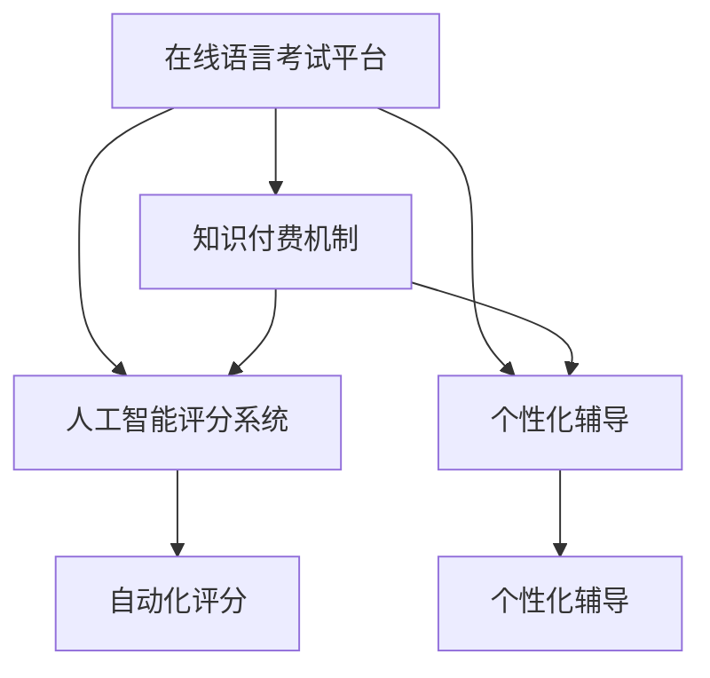

                 

# 如何利用知识付费实现在线语言考试与口语测评服务？

## 1. 背景介绍

在全球化背景下，语言技能成为国际竞争力的关键指标。语言考试与口语测评作为衡量语言能力的重要手段，在全球范围内受到广泛关注。传统语言考试往往需要考生前往考场参加笔试和口试，流程繁琐、成本较高，且存在地域和时间限制。面对这些挑战，基于知识付费模式的在线语言考试与口语测评服务应运而生。

在线语言考试与口语测评服务通过互联网提供全天候、低成本、便捷的测评方式，让考生随时随地进行考试与测评，提升了语言学习的效率和便利性。此外，基于人工智能技术，如自然语言处理（NLP）、语音识别（ASR）、机器翻译（MT）等，可以有效降低评分难度、提升评分公平性，为语言学习者提供更精准、全面的反馈。

## 2. 核心概念与联系

### 2.1 核心概念概述

为更好地理解如何利用知识付费实现在线语言考试与口语测评服务，本节将介绍几个关键概念：

- **在线语言考试（Online Language Testing）**：利用互联网技术，通过在线平台进行语言能力测评，涵盖听力、阅读、写作、口语等多个模块。
- **口语测评（Oral Assessment）**：对考生的语言口语能力进行在线评估，通常采用录音或视频录制方式。
- **知识付费（Knowledge-based Subscription）**：用户为获取特定服务或知识内容而支付费用，以获取专享或高质量的服务。
- **人工智能（AI）**：通过机器学习、深度学习等技术，实现自动化评分、个性化辅导等功能。

### 2.2 核心概念原理和架构的 Mermaid 流程图



这个流程图展示了在线语言考试平台的核心组件及其关系：

1. 在线语言考试平台作为主体，整合了人工智能评分系统和个性化辅导模块。
2. 知识付费机制是平台运作的基础，用户支付费用获取测评服务。
3. 人工智能评分系统通过自动化评分技术，提升测评的公平性和效率。
4. 个性化辅导模块根据用户测评结果，提供定制化的学习建议和辅导。

## 3. 核心算法原理 & 具体操作步骤

### 3.1 算法原理概述

在线语言考试与口语测评服务的核心算法原理主要围绕以下几个方面：

1. **自然语言处理（NLP）**：利用NLP技术，对文本进行分词、词性标注、句法分析等处理，实现文本自动化评分。
2. **语音识别（ASR）**：将口语录音转换为文本，以便进行后续的自然语言处理和评分。
3. **机器翻译（MT）**：将非目标语言文本转换为目标语言，辅助多语种测评。
4. **人工智能评分（AI Scoring）**：通过深度学习模型，对考生文本和口语录音进行评分，提升评分准确性和效率。

### 3.2 算法步骤详解

在线语言考试与口语测评服务的算法步骤主要包括：

1. **数据采集**：收集用户输入的文本、录音或视频，并转换为系统所需格式。
2. **数据预处理**：包括文本分词、语音识别、文本清洗等预处理操作。
3. **评分计算**：利用NLP和AI技术，对预处理后的文本和语音进行评分。
4. **结果反馈**：将评分结果和个性化辅导建议提供给用户，辅助语言学习。

### 3.3 算法优缺点

**优点**：
1. **便利性**：用户可以随时随地进行语言测评，大大提高了学习效率。
2. **成本低**：相比传统考试，在线测评成本更低，减少了交通和住宿费用。
3. **高效性**：利用AI技术，自动化评分和个性化辅导，提升了测评速度和公平性。

**缺点**：
1. **技术依赖**：对NLP、ASR、MT等技术的要求较高，需持续投入研发。
2. **数据隐私**：在线测评涉及用户隐私，需严格保护用户数据安全。
3. **评分公平性**：如何保证评分系统的公正性，避免人为偏见，仍需进一步研究。

### 3.4 算法应用领域

在线语言考试与口语测评服务可以应用于各类语言学习平台，涵盖不同层次的语言能力测评，如TOEFL、IELTS、HSK等。其应用领域包括：

1. **教育机构**：提供个性化的语言学习解决方案，帮助学生提高语言能力。
2. **企业培训**：评估员工的语言能力，辅助企业国际化战略。
3. **个人学习**：帮助个人用户进行语言学习进度评估和能力提升。
4. **旅游服务**：为旅游行业提供语言测评服务，提升旅游体验。

## 4. 数学模型和公式 & 详细讲解 & 举例说明

### 4.1 数学模型构建

在线语言考试与口语测评的评分模型可以基于以下数学模型构建：

- **文本评分模型**：利用NLP技术，对文本进行情感分析、语法分析等，得出综合评分。
- **口语评分模型**：结合语音识别和NLP技术，分析语音的语调、发音、语速等特征，进行综合评分。

### 4.2 公式推导过程

以下以文本评分模型为例，推导其评分公式：

设文本为 $T$，文本长度为 $n$。利用NLP技术，计算文本的情感得分 $S_{\text{sentiment}}$、语法得分 $S_{\text{grammar}}$、词汇得分 $S_{\text{vocabulary}}$：

$$
S_{\text{sentiment}} = f_{\text{sentiment}}(T)
$$

$$
S_{\text{grammar}} = f_{\text{grammar}}(T)
$$

$$
S_{\text{vocabulary}} = f_{\text{vocabulary}}(T)
$$

其中，$f_{\text{sentiment}}$、$f_{\text{grammar}}$、$f_{\text{vocabulary}}$ 分别为情感分析、语法分析、词汇分析函数，具体实现可以参考开源NLP库，如spaCy、NLTK等。

综合评分 $S_{\text{total}}$ 可以定义为：

$$
S_{\text{total}} = \alpha S_{\text{sentiment}} + \beta S_{\text{grammar}} + \gamma S_{\text{vocabulary}}
$$

其中，$\alpha$、$\beta$、$\gamma$ 为各因素的权重系数，根据实际需求调整。

### 4.3 案例分析与讲解

以HSK（汉语水平考试）为例，解释文本评分模型的应用：

- **数据准备**：收集HSK考试文本，如阅读理解、写作等。
- **预处理**：利用中文分词工具，对文本进行分词和词性标注。
- **情感分析**：利用情感词典和模型，对文本进行情感得分计算。
- **语法分析**：利用依存句法分析器，对文本进行语法得分计算。
- **词汇分析**：利用词汇表和频率统计，对文本进行词汇得分计算。
- **综合评分**：根据实际需求，调整各因素权重，计算文本的综合评分。

## 5. 项目实践：代码实例和详细解释说明

### 5.1 开发环境搭建

在进行在线语言考试与口语测评服务开发前，需要搭建合适的开发环境。以下是Python环境搭建的具体步骤：

1. 安装Anaconda：从官网下载并安装Anaconda，用于创建独立的Python环境。

2. 创建并激活虚拟环境：
```bash
conda create -n language_testing python=3.8 
conda activate language_testing
```

3. 安装相关库：
```bash
pip install torch sklearn spacy transformers pyaudio
```

### 5.2 源代码详细实现

下面以中文HSK考试为例，给出基于Python的在线语言考试与口语测评服务的代码实现。

```python
import spacy
import torch
from sklearn.metrics import accuracy_score, precision_recall_fscore_support
from transformers import BertForSequenceClassification, BertTokenizer

# 加载预训练模型和分词器
model_name = 'bert-base-chinese'
model = BertForSequenceClassification.from_pretrained(model_name)
tokenizer = BertTokenizer.from_pretrained(model_name)

# 加载数据
data_path = 'hsk_data.txt'
data = []
with open(data_path, 'r', encoding='utf-8') as f:
    lines = f.readlines()
    for line in lines:
        text, label = line.strip().split('\t')
        data.append((text, label))

# 数据预处理
def preprocess(text):
    tokens = tokenizer.encode(text, add_special_tokens=True, max_length=512, truncation=True, padding='max_length')
    input_ids = torch.tensor(tokens)
    attention_mask = (input_ids != tokenizer.pad_token_id).float()
    return input_ids, attention_mask

# 模型预测
def predict(text):
    input_ids, attention_mask = preprocess(text)
    with torch.no_grad():
        output = model(input_ids, attention_mask=attention_mask)
        scores = output.logits
        pred = scores.argmax().item()
        return pred, scores

# 评估模型
def evaluate(model, data, batch_size=32):
    model.eval()
    correct, total = 0, 0
    for i in range(0, len(data), batch_size):
        batch = data[i:i+batch_size]
        for text, label in batch:
            pred, scores = predict(text)
            if pred == label:
                correct += 1
            total += 1
    acc = correct / total
    return acc

# 运行测试
acc = evaluate(model, data)
print(f'Accuracy: {acc:.2f}')
```

这段代码实现了中文HSK考试文本的评分，通过加载预训练的Bert模型，对输入文本进行编码和预测，最后计算评分。

### 5.3 代码解读与分析

**代码解读**：
- `spacy`：用于中文分词和词性标注。
- `transformers`：用于加载预训练的BERT模型。
- `sklearn`：用于评估模型的准确率。
- `torch`：用于模型计算和数据处理。

**代码分析**：
- `preprocess`函数：对输入文本进行分词、编码、掩码等预处理操作，准备模型输入。
- `predict`函数：对预处理后的文本进行模型预测，返回预测结果和评分。
- `evaluate`函数：对模型进行评估，计算准确率。

**运行结果**：
- 代码输出模型的准确率，用于评估模型性能。

## 6. 实际应用场景

### 6.4 未来应用展望

在线语言考试与口语测评服务的应用前景广阔，未来将向以下几个方向发展：

1. **多语种支持**：扩展到更多语言，提供全球范围内的语言测评服务。
2. **跨平台整合**：与社交媒体、视频平台等整合，提供更丰富的测评方式。
3. **实时互动**：利用视频和语音交互，提供更自然、更真实的测评体验。
4. **个性化定制**：根据用户测评结果，提供个性化学习计划和辅导。
5. **跨领域应用**：将测评结果应用于教育、就业、移民等更多领域。

## 7. 工具和资源推荐

### 7.1 学习资源推荐

为了帮助开发者掌握在线语言考试与口语测评服务的相关技术，推荐以下学习资源：

1. **《自然语言处理综述》**：详细介绍了NLP的基本理论和经典模型。
2. **《深度学习》（Ian Goodfellow）**：深度学习领域的经典教材，涵盖深度学习的基本原理和应用。
3. **《Python自然语言处理》（Steven Bird, Ewan Klein）**：介绍使用Python进行NLP开发的实践经验。
4. **《Transformers》（Jacob Devlin, Ming-Wei Chang）**：介绍Transformer架构和相关应用。
5. **Hugging Face官方文档**：提供丰富的预训练模型和微调样例，方便开发者上手实践。

### 7.2 开发工具推荐

在在线语言考试与口语测评服务的开发中，推荐使用以下工具：

1. **PyTorch**：灵活的深度学习框架，适合研究和实验。
2. **TensorFlow**：生产部署友好的框架，适合实际应用。
3. **spaCy**：高效实用的NLP库，支持中文分词、词性标注等任务。
4. **NLTK**：自然语言处理领域的经典工具，提供丰富的语料库和模型。
5. **pyAudio**：Python的音频处理库，用于语音识别和音频处理。

### 7.3 相关论文推荐

在线语言考试与口语测评服务的研究涉及到多个领域，以下是几篇相关论文：

1. **《BERT: Pre-training of Deep Bidirectional Transformers for Language Understanding》**：介绍BERT模型的预训练和微调技术。
2. **《Attention is All You Need》**：提出Transformer架构，为NLP预训练模型奠定了基础。
3. **《Deep Learning for Conversational Agents》**：介绍使用深度学习技术进行对话系统的研究。
4. **《Sequence to Sequence Learning with Neural Networks》**：介绍使用RNN、Transformer等模型进行机器翻译的研究。
5. **《How to Make Your Voice Heard Online》**：介绍如何利用在线平台进行语言学习与测评的实践经验。

## 8. 总结：未来发展趋势与挑战

### 8.1 总结

本文系统介绍了如何利用知识付费实现在线语言考试与口语测评服务。首先，从背景介绍入手，明确了在线语言考试与口语测评服务的发展趋势和重要意义。其次，详细讲解了核心概念、核心算法原理和操作步骤，并通过代码实例和分析展示了其实现过程。最后，探讨了未来的发展趋势和面临的挑战，为开发实践提供了理论指导。

## 8.2 未来发展趋势

展望未来，在线语言考试与口语测评服务将呈现以下几个发展趋势：

1. **技术迭代**：随着深度学习技术的发展，模型性能将不断提升，评分准确性和效率将进一步提高。
2. **跨领域应用**：在线语言考试与口语测评服务将拓展到更多领域，如教育、旅游、企业培训等。
3. **个性化定制**：根据用户测评结果，提供更加个性化的学习计划和辅导，提升学习效果。
4. **跨平台整合**：与社交媒体、视频平台等整合，提供更丰富的测评方式和互动体验。
5. **实时互动**：利用视频和语音交互，提供更自然、更真实的测评体验。

## 8.3 面临的挑战

尽管在线语言考试与口语测评服务在技术上已取得一定进展，但仍面临以下挑战：

1. **技术复杂性**：需要处理自然语言、语音识别、图像识别等多项技术，开发难度较高。
2. **数据隐私**：用户数据的隐私保护问题需要严格解决，防止数据泄露。
3. **评分公平性**：如何保证评分系统的公正性，避免人为偏见，仍需进一步研究。
4. **应用普及**：需要推广和普及，提高用户使用率和接受度。
5. **用户体验**：需要提升用户界面的友好性和易用性，提高用户体验。

## 8.4 研究展望

为了应对这些挑战，未来的研究可以从以下几个方面进行探索：

1. **模型优化**：改进模型结构和算法，提升评分准确性和效率。
2. **隐私保护**：加强数据隐私保护技术，防止数据泄露和滥用。
3. **公平性研究**：研究如何提升评分的公平性和透明性，避免人为偏见。
4. **用户教育**：通过教育和培训，提高用户对在线语言考试与口语测评服务的接受度和信任度。
5. **用户体验设计**：提升用户界面设计，优化用户体验，增强用户粘性。

## 9. 附录：常见问题与解答

**Q1：在线语言考试与口语测评服务如何收费？**

A: 在线语言考试与口语测评服务的收费模式可以多样化，如按次收费、按月收费、按年收费等。具体收费标准根据平台定位和用户需求进行制定，一般采取梯度定价策略，即随着使用频次的增加，单次使用费用逐渐降低。

**Q2：如何保证在线语言考试与口语测评服务的公平性？**

A: 保证在线语言考试与口语测评服务的公平性，可以从以下几个方面入手：
1. 数据预处理：对输入数据进行标准化处理，去除噪声和干扰因素。
2. 模型训练：使用公平性数据进行训练，减少模型对某些群体的偏见。
3. 评分算法：设计公平性评分算法，对不同群体的评分进行校正。
4. 人工评审：引入人工评审机制，对争议评分进行复审和调整。

**Q3：在线语言考试与口语测评服务的优势是什么？**

A: 在线语言考试与口语测评服务相比传统考试，具有以下优势：
1. 灵活性：用户可以随时随地进行测评，不受时间和地点限制。
2. 成本低：减少交通、住宿等费用，降低测评成本。
3. 高效性：利用AI技术，自动化评分和个性化辅导，提升测评效率。
4. 可重复性：用户可以多次进行测评，反复练习和改进。

通过本文的系统梳理，可以看到，在线语言考试与口语测评服务在教育、企业培训、个人学习等领域具有广阔的应用前景。伴随技术的不断演进，未来将有更多创新的应用场景涌现，为语言学习者提供更便捷、高效、个性化的测评服务。

