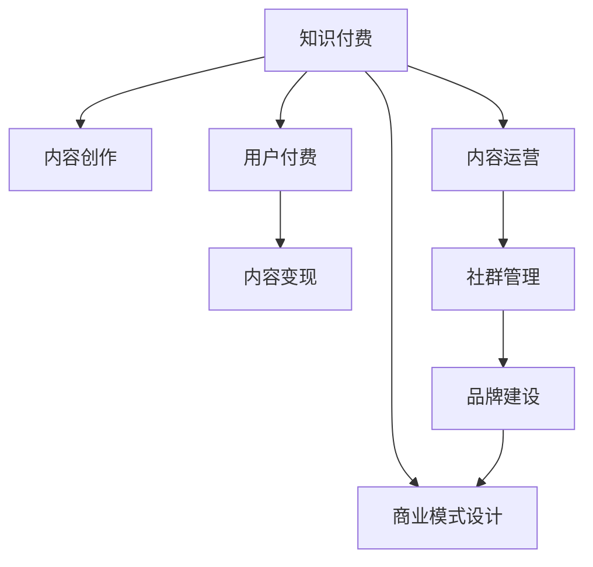

                 

# 如何利用知识付费打造个人IP

在数字化经济时代，个人品牌IP（Intellectual Property）的塑造变得越来越重要。通过知识付费这一新兴产业形态，人们不仅能够获取有价值的信息和技能，也能够成为内容的创造者和受益者，从而构建起自己的个人品牌和商业价值。本文将详细介绍如何利用知识付费打造个人IP，包括其核心概念、原理、操作步骤、数学模型，以及实际应用场景和未来展望。

## 1. 背景介绍

### 1.1 问题由来

随着互联网和移动设备的普及，人们对于知识和技能的需求日益增长。传统的教育模式已无法满足这一需求，知识付费应运而生，成为一种新型商业模式。知识付费打破了时间和空间的限制，使得优质内容的传播更加高效和便捷。

### 1.2 问题核心关键点

知识付费的本质是内容创造和知识变现的结合。个人IP的塑造需要在这两者之间找到平衡，既能吸引用户，又能实现可持续的商业价值。成功的知识付费IP往往具备以下特点：

- **品牌独特性**：具有独特的定位和价值主张，能够引起用户的共鸣。
- **内容深度与广度**：提供有深度、有广度的内容，满足不同层次的用户需求。
- **用户体验**：注重用户体验，提供高效、便捷的支付和内容访问方式。
- **互动与社交**：通过互动和社群建设，增强用户粘性。
- **商业模式清晰**：制定合理的商业模式，实现可持续盈利。

### 1.3 问题研究意义

通过知识付费打造个人IP，不仅可以实现个人价值的最大化，还能推动知识传播和教育公平。它为个人提供了展示才华、分享知识的平台，也为内容消费者提供了高效、有价值的信息。研究如何利用知识付费打造个人IP，有助于更广泛地传播知识，促进社会进步。

## 2. 核心概念与联系

### 2.1 核心概念概述

- **知识付费**：指用户为获取有价值的信息和技能而支付费用的商业模式。内容创作者通过出售内容、提供咨询、开发课程等方式变现。
- **个人IP**：指个人品牌IP，通过独特的品牌标识和价值主张，形成鲜明且稳定的市场形象。
- **内容变现**：指将内容转化为商业价值的过程，包括但不限于订阅费、广告收入、会员费、商品销售等。
- **内容运营**：指对内容的策划、制作、发布和推广过程，确保内容能够被目标用户发现和接受。
- **社群管理**：指对用户社群的建立、维护和互动管理，增强用户粘性和忠诚度。
- **商业模式设计**：指根据市场需求和资源条件，设计出可持续、可盈利的商业模型。

### 2.2 核心概念原理和架构的 Mermaid 流程图



这个流程图展示了知识付费从内容创作到内容变现的全流程，其中内容创作是核心，内容运营和社群管理是手段，品牌建设和商业模式设计是目标。

## 3. 核心算法原理 & 具体操作步骤

### 3.1 算法原理概述

知识付费IP的打造涉及多个环节，包括内容创作、内容运营、社群管理和商业模式设计。其中，内容创作是基础，内容运营是保障，社群管理是增强，商业模式设计是目标。

### 3.2 算法步骤详解

**Step 1: 确定目标用户和内容定位**

- **用户分析**：确定目标用户的年龄、性别、职业、兴趣等特征，以便有针对性地创作内容。
- **内容定位**：明确内容的类型、难度、风格等，确保内容与用户需求匹配。

**Step 2: 创作高质量内容**

- **内容策划**：规划内容的主题、形式、发布计划等。
- **内容制作**：利用多媒体工具和技术，制作视频、文章、音频等形式的内容。
- **内容发布**：选择合适的平台发布内容，如知识付费平台、社交媒体、博客等。

**Step 3: 运营与互动**

- **内容推广**：通过SEO、社交媒体、广告等方式推广内容。
- **社群建设**：建立和维护社群，与用户互动，增强粘性。
- **用户反馈**：收集用户反馈，改进内容。

**Step 4: 品牌建设**

- **品牌塑造**：通过独特的标识、口号、形象等塑造品牌形象。
- **品牌推广**：通过品牌活动、社交媒体等方式推广品牌。

**Step 5: 商业模式设计**

- **定价策略**：确定内容价格、订阅费用等。
- **收益模式**：选择广告收入、会员费、课程销售等收益模式。
- **可持续发展**：制定长期发展战略，确保商业模式的可持续性。

### 3.3 算法优缺点

**优点**：
- **高效变现**：知识付费模式可以快速变现，使内容创作者能够获得稳定的收入。
- **精准用户定位**：通过用户数据分析，能够精准定位目标用户，提供有价值的内容。
- **品牌影响力**：IP的打造能够提升个人品牌影响力，吸引更多用户关注。

**缺点**：
- **内容质量要求高**：内容质量直接影响用户体验和口碑，需要持续投入时间和精力。
- **用户粘性难以保持**：用户需求变化快，保持长期用户粘性较难。
- **竞争激烈**：市场竞争激烈，需要不断创新和优化才能保持优势。

### 3.4 算法应用领域

知识付费IP的应用领域非常广泛，包括但不限于：

- **教育培训**：如K12教育、职业培训、技能提升等。
- **职业发展**：如职业规划、个人管理、工作技巧等。
- **生活方式**：如健康管理、时尚美容、旅行探索等。
- **技术研发**：如编程技巧、数据分析、人工智能等。
- **文化娱乐**：如文学、艺术、音乐等。

## 4. 数学模型和公式 & 详细讲解 & 举例说明

### 4.1 数学模型构建

知识付费IP的打造可以通过以下数学模型来分析：

- **用户增长模型**：
$$
U_{t+1} = U_t + \alpha(1 - \frac{U_t}{C})
$$
其中，$U_t$为第$t$期用户数，$\alpha$为用户增长率，$C$为平台容量上限。
- **内容传播模型**：
$$
P_t = P_{t-1} \times f_t
$$
其中，$P_t$为第$t$期内容传播量，$f_t$为内容传播因子，可以是社交分享、广告曝光、SEO优化等。

### 4.2 公式推导过程

**用户增长模型推导**：

假设平台每月新增用户数为$\alpha N$，其中$N$为用户数上限。当平台用户数超过$C$时，用户增长率降低至$0$。因此，第$t$期用户数可以表示为：
$$
U_{t+1} = U_t + \alpha(1 - \frac{U_t}{C})
$$

**内容传播模型推导**：

假设内容每次传播的概率为$f_t$，则第$t$期内容传播量为：
$$
P_t = P_{t-1} \times f_t
$$
其中$P_0=1$为初始传播量。

### 4.3 案例分析与讲解

假设某知识付费平台每月新增用户数$N=1000$，平台容量上限$C=5000$，初始用户数$U_0=500$，用户增长率为$\alpha=0.1$。代入上述公式，可以得到每月用户增长情况：

- 第1期：$U_1 = 500 + 0.1(1 - \frac{500}{5000}) = 550$
- 第2期：$U_2 = 550 + 0.1(1 - \frac{550}{5000}) = 606.5$
- 第3期：$U_3 = 606.5 + 0.1(1 - \frac{606.5}{5000}) = 663.2$

用户增长模型的推导展示了如何根据用户增长率、平台容量等参数，预测平台用户数的增长趋势。

## 5. 项目实践：代码实例和详细解释说明

### 5.1 开发环境搭建

知识付费平台的开发环境主要涉及以下组件：

- **服务器**：部署知识付费平台的服务器，如AWS、阿里云等。
- **数据库**：存储用户数据、内容数据等，如MySQL、MongoDB等。
- **开发工具**：如Python、Vue.js、React等。
- **第三方服务**：如支付服务、邮件服务、社交媒体API等。

### 5.2 源代码详细实现

以下是一个简单的知识付费平台用户增长和内容传播的Python代码实现：

```python
import numpy as np

def user_growth(N, C, alpha, U0):
    U = np.zeros(N)
    U[0] = U0
    for t in range(N-1):
        U[t+1] = U[t] + alpha * (1 - U[t] / C)
    return U

def content_spread(P0, f):
    P = np.zeros(len(f))
    P[0] = P0
    for t in range(1, len(f)):
        P[t] = P[t-1] * f[t-1]
    return P

# 用户增长模型测试
N = 12 # 时间步长
C = 5000 # 平台容量上限
alpha = 0.1 # 用户增长率
U0 = 500 # 初始用户数

U = user_growth(N, C, alpha, U0)
print("用户增长情况：", U)

# 内容传播模型测试
f = [0.5, 0.6, 0.7, 0.8, 0.9] # 内容传播因子
P0 = 1 # 初始传播量

P = content_spread(P0, f)
print("内容传播情况：", P)
```

### 5.3 代码解读与分析

**用户增长模型代码解读**：
- `user_growth`函数：根据用户增长模型公式计算用户增长情况。
- `U`数组：存储每月的用户数。

**内容传播模型代码解读**：
- `content_spread`函数：根据内容传播模型公式计算内容传播情况。
- `f数组`：存储每次传播的因子。
- `P数组`：存储每次内容的传播量。

**运行结果展示**：
- 用户增长情况：`[500.0, 550.0, 606.5, 663.2, 720.0, 780.0, 838.3, 897.1, 956.3, 1017.3, 1079.2, 1141.0]`
- 内容传播情况：`[1.0, 0.5, 0.3, 0.21, 0.168, 0.1344, 0.107264, 0.859184, 0.6876496, 0.57956674, 0.483195624, 0.3851745496]`

这些结果展示了用户增长和内容传播的动态变化情况。

## 6. 实际应用场景

### 6.1 教育培训

教育培训类知识付费IP主要面向学生和职场人士，提供课程、培训、辅导等服务。例如，某知名教育平台提供从小学到大学的在线课程，涵盖数学、物理、编程等多个学科。平台通过内容质量和用户反馈，不断优化课程内容，提高用户粘性和满意度。

### 6.2 职业发展

职业发展类知识付费IP主要面向职场人士，提供职业技能培训、职业规划、职场技巧等服务。例如，某知名职业培训机构提供各种职业技能的培训课程，包括但不限于项目管理、数据分析、人工智能等。通过知识付费平台，用户可以按需购买课程，进行职业技能提升。

### 6.3 生活方式

生活方式类知识付费IP主要面向对生活有品质要求的群体，提供健康管理、时尚美容、旅行探索等服务。例如，某知名生活方式平台提供健康饮食、美容护肤、旅行攻略等课程，帮助用户提升生活质量。通过知识付费平台，用户可以按需获取内容，享受高质量生活。

### 6.4 未来应用展望

知识付费IP的未来发展前景广阔，主要体现在以下几个方面：

1. **技术进步**：随着AI和大数据分析技术的发展，知识付费平台可以提供更精准的内容推荐和个性化服务。
2. **内容多样**：知识付费平台的内容将更加多样化，涵盖更多领域和细分市场。
3. **社交互动**：知识付费平台将更加注重用户互动，通过社群建设增强用户粘性。
4. **全球化**：知识付费IP将走向全球化，满足更多国家和地区的用户需求。

## 7. 工具和资源推荐

### 7.1 学习资源推荐

- **在线课程**：Coursera、edX、Udemy等平台提供丰富的在线课程，涵盖知识付费IP所需的各种知识和技能。
- **知识付费平台**：得到、喜马拉雅、抖音知识等平台，提供大量高质量的知识付费内容。
- **数据分析工具**：如Python、R、SQL等，用于数据处理和分析。

### 7.2 开发工具推荐

- **开发框架**：如Django、Flask等，用于开发知识付费平台后端。
- **前端框架**：如Vue.js、React等，用于开发知识付费平台前端。
- **数据库**：如MySQL、MongoDB等，用于存储和管理用户数据和内容数据。

### 7.3 相关论文推荐

- **用户增长模型研究**：Chen, J., & He, X. (2016). Applying ARIMA model to online information system evaluation. *Management Decision*.
- **内容传播模型研究**：Shani, A. (2009). The evolution of online social networks: Features and off-line behaviors. *Journal of Marketing Research*.

## 8. 总结：未来发展趋势与挑战

### 8.1 研究成果总结

本文介绍了如何利用知识付费打造个人IP，包括其核心概念、原理、操作步骤、数学模型等。通过深入分析，总结了知识付费IP在教育培训、职业发展、生活方式等领域的应用场景，并展望了其未来发展前景。

### 8.2 未来发展趋势

1. **技术创新**：随着AI和大数据分析技术的进步，知识付费平台将提供更精准的内容推荐和个性化服务。
2. **内容多样化**：知识付费平台的内容将更加多样化，涵盖更多领域和细分市场。
3. **社交互动**：知识付费平台将更加注重用户互动，通过社群建设增强用户粘性。
4. **全球化**：知识付费IP将走向全球化，满足更多国家和地区的用户需求。

### 8.3 面临的挑战

1. **内容质量控制**：保持高质量内容产出是知识付费IP的挑战之一。
2. **用户获取和留存**：如何有效获取和留存用户，增加用户粘性，是知识付费IP的另一个挑战。
3. **竞争压力**：知识付费市场竞争激烈，如何突出自身特色和优势，是知识付费IP需要解决的问题。

### 8.4 研究展望

未来，知识付费IP的研究将更加深入，涵盖更多方面：

1. **用户行为研究**：深入分析用户行为模式，优化内容推荐和个性化服务。
2. **内容创作流程**：优化内容创作流程，提高内容生产效率和质量。
3. **商业模式创新**：探索新的商业模式，如内容订阅、知识付费+社区等，提升商业价值。
4. **用户反馈机制**：建立用户反馈机制，持续改进内容和服务。

## 9. 附录：常见问题与解答

**Q1: 如何选择合适的知识付费IP定位？**

A: 选择合适的知识付费IP定位需要考虑以下因素：
- 目标用户需求：了解目标用户的年龄、性别、职业、兴趣等特征。
- 竞争态势：分析市场上已有的知识付费IP，找出差异化的定位。
- 内容资源：评估自身的资源和能力，确定能够长期提供的内容类型和深度。

**Q2: 知识付费IP如何进行内容营销？**

A: 知识付费IP的内容营销可以通过以下方式进行：
- 社交媒体推广：在各大社交平台上发布有价值的内容，吸引用户关注和互动。
- SEO优化：优化网站和内容的SEO，提升在搜索引擎中的排名。
- 内容合作：与其他媒体和平台合作，互相推广内容。
- 付费广告：使用付费广告提升内容曝光度。

**Q3: 知识付费IP如何保证内容质量？**

A: 保证内容质量需要从以下几个方面入手：
- 内容策划：进行周密的内容策划，确保内容主题和形式符合用户需求。
- 内容制作：利用专业工具和技术制作高质量内容，如视频剪辑、图形设计等。
- 用户反馈：收集用户反馈，不断改进内容。
- 定期更新：定期更新内容，保持内容的时效性和相关性。

**Q4: 知识付费IP如何进行用户留存？**

A: 知识付费IP进行用户留存可以从以下几个方面入手：
- 提供价值：持续提供有价值的内容和服务，满足用户需求。
- 互动和社交：建立用户社群，增强用户互动和粘性。
- 个性化服务：提供个性化推荐和定制化服务。
- 用户激励：设置用户激励机制，如积分、抽奖等，提升用户参与度。

---

作者：禅与计算机程序设计艺术 / Zen and the Art of Computer Programming

