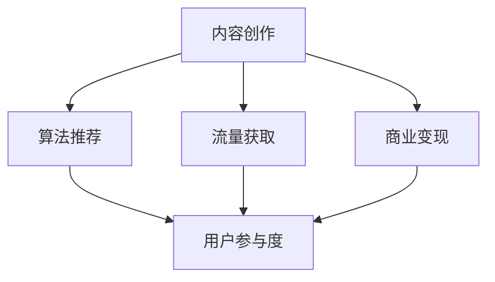

                 

# 如何利用短视频平台实现知识变现

> 关键词：短视频平台, 知识变现, 内容创作, 算法推荐, 流量获取, 商业变现

## 1. 背景介绍

### 1.1 问题由来

随着移动互联网的迅猛发展，短视频平台逐渐成为人们获取信息和娱乐内容的重要渠道。与此同时，短视频平台的商业模式也从以广告为主逐步向内容付费、知识变现等多元化方向发展。越来越多的创作者通过分享专业知识，获得了可观的收益。

短视频平台以其高互动性、低门槛、广覆盖等特点，为知识变现提供了新的机遇。但同时，如何在众多内容中脱颖而出，获取足够的流量和收益，也成为了创作者面临的一大难题。

### 1.2 问题核心关键点

短视频平台的知识变现，本质上是内容创作者通过优质的内容吸引用户关注，再利用平台提供的商业变现渠道，将流量转化为收入。这一过程涉及内容创作、算法推荐、流量获取和商业变现等多个环节。以下我们将逐一介绍这些核心概念及其相互联系。

1. **内容创作**：高质量的视频内容是吸引用户关注的基础。内容创作者需具备丰富的专业知识、良好的创意构思和制作技巧。

2. **算法推荐**：短视频平台通过复杂的算法模型，对内容进行精准推荐，提高内容的曝光率和用户参与度。

3. **流量获取**：除了平台推荐外，创作者还需通过多渠道引流，如社交媒体推广、跨平台合作等，扩大视频覆盖面。

4. **商业变现**：通过平台提供的广告分成、付费订阅、带货等方式，将流量转化为实际收入。

这些关键点共同构成了短视频平台知识变现的基本框架，通过理解这些概念，我们能够更深入地探讨如何高效实现知识变现。

## 2. 核心概念与联系

### 2.1 核心概念概述

为更好地理解短视频平台的知识变现过程，我们首先介绍几个核心概念：

- **短视频平台**：如抖音、快手、B站等，以短视频形式为载体，提供内容展示和商业变现功能的社交平台。
- **内容创作**：创作者通过视频的形式，传播知识、展示技能、分享生活等内容，吸引用户关注。
- **算法推荐**：平台利用推荐算法，基于用户历史行为、视频内容特征等因素，精准推荐相关视频。
- **流量获取**：通过多种渠道引流，提高视频的曝光率和用户参与度。
- **商业变现**：通过平台提供的多元化变现渠道，如广告分成、付费订阅、带货等，实现收入。

这些概念之间的逻辑关系可以通过以下Mermaid流程图来展示：



这个流程图展示了几大核心概念及其之间的关系：

1. 内容创作是基础，提供高质量的视频内容。
2. 算法推荐提高内容的曝光率，吸引用户参与。
3. 流量获取扩大视频覆盖面，增加用户互动。
4. 商业变现将流量转化为实际收益。

这些概念共同构成了短视频平台知识变现的核心框架，创作者需综合考虑这些环节，制定有效的变现策略。

## 3. 核心算法原理 & 具体操作步骤
### 3.1 算法原理概述

短视频平台的知识变现过程，本质上是一个复杂的系统工程。其核心算法原理主要包括：

1. **内容推荐算法**：平台通过分析用户的浏览行为、点赞、评论等数据，构建用户画像，并根据视频内容特征，推荐相关视频。

2. **流量增长算法**：通过社交媒体推广、跨平台合作、直播互动等方式，吸引用户关注，提高视频曝光率和用户参与度。

3. **商业变现算法**：根据视频内容、用户行为等数据，判断视频是否具备商业价值，提供广告分成、付费订阅、带货等变现机会。

这些算法共同作用，推动了知识变现的各个环节。下面，我们将逐一详细介绍这些算法的原理和具体操作步骤。

### 3.2 算法步骤详解

#### 3.2.1 内容推荐算法

1. **用户画像构建**：平台通过用户历史行为数据，如浏览记录、点赞视频、评论内容等，构建用户画像。用户画像包括用户的兴趣、偏好、活跃度等信息。

2. **视频特征提取**：利用自然语言处理、计算机视觉等技术，提取视频的内容特征，如字幕、视频长度、色彩亮度、背景音乐等。

3. **相似度计算**：基于用户画像和视频特征，计算用户与视频之间的相似度。相似度越高，推荐的可能性越大。

4. **排序和推荐**：根据相似度计算结果，对视频进行排序和推荐，优先展示与用户兴趣相关的视频。

#### 3.2.2 流量增长算法

1. **社交媒体推广**：在微博、微信等社交平台发布视频预告、片段，吸引关注和转发。

2. **跨平台合作**：与其他平台的内容创作者合作，互相推广，扩大覆盖面。

3. **直播互动**：利用直播功能，实时互动，提高用户粘性。

4. **线上线下结合**：举办线下活动，吸引线下粉丝关注，同时通过直播等形式进行线上互动。

#### 3.2.3 商业变现算法

1. **广告分成**：根据视频的观看次数、互动率等指标，平台按比例分配广告收入。

2. **付费订阅**：用户付费订阅视频创作者，获取独家视频内容。

3. **带货合作**：与电商平台合作，通过视频介绍商品，推广销售。

### 3.3 算法优缺点

短视频平台的知识变现算法具有以下优点：

1. **精准推荐**：通过复杂的推荐算法，能够精准推荐用户感兴趣的视频，提高用户参与度和留存率。

2. **多渠道引流**：结合多种引流手段，全面扩大视频覆盖面，提高曝光率。

3. **多元化变现**：提供广告分成、付费订阅、带货等多种变现方式，满足不同创作者的需求。

同时，这些算法也存在一定的局限性：

1. **数据隐私问题**：收集和分析用户数据，可能涉及隐私保护问题。

2. **算法透明性不足**：平台算法黑盒运作，创作者难以理解推荐依据，影响策略制定。

3. **流量竞争激烈**：视频创作者众多，竞争激烈，小创作者难以获得足够流量。

4. **变现依赖平台**：创作者收入高度依赖平台，平台政策变化可能影响收益。

### 3.4 算法应用领域

短视频平台的知识变现算法不仅应用于内容推荐，还广泛用于社交互动、流量增长和商业变现等多个领域。以下是一些典型的应用场景：

1. **内容推荐**：抖音、快手等平台通过推荐算法，精准推送视频内容，提高用户参与度和留存率。

2. **流量增长**：B站、YouTube等平台通过直播、跨平台合作等方式，吸引用户关注，扩大视频覆盖面。

3. **商业变现**：平台通过广告分成、付费订阅、带货等多样化变现渠道，实现收入。

这些算法在实际应用中，已广泛应用于各大短视频平台，取得了显著的成效。

## 4. 数学模型和公式 & 详细讲解 & 举例说明

### 4.1 数学模型构建

短视频平台的知识变现过程，涉及多个复杂模型。以下我们将以推荐算法为例，介绍其数学模型构建。

设用户 $U$，视频 $V$，用户与视频之间的相似度 $s$，推荐系统的目标是最小化用户未观看的视频损失函数。

推荐系统通过用户画像和视频特征，计算用户与视频之间的相似度 $s$，并根据相似度对视频进行排序，最终得到推荐结果。推荐系统的优化目标如下：

$$
\min_{\theta} \sum_{(u,v) \in D} \ell (s(u,v), y(u,v))
$$

其中 $D$ 为数据集，$\ell$ 为损失函数，$y(u,v)$ 为实际观看数据，$s(u,v)$ 为模型预测相似度。

### 4.2 公式推导过程

我们以协同过滤推荐算法为例，介绍推荐模型的推导过程。

协同过滤推荐算法通过用户与视频之间的相似度，推荐用户可能感兴趣的视频。设用户 $u$ 对视频 $v$ 的评分 $r_{uv}$，用户 $u$ 对视频 $v$ 的评分预测 $r_{uv}^*$。

协同过滤算法的目标是最小化预测误差：

$$
\min_{\theta} \sum_{(u,v) \in D} \ell (r_{uv}^*, r_{uv})
$$

其中 $\ell$ 为损失函数，如均方误差损失。

协同过滤算法通过构建用户-视频相似度矩阵 $S$，计算用户 $u$ 和视频 $v$ 的相似度：

$$
s_{uv} = \frac{1}{N} \sum_{v'} r_{uv'} r_{v'v}
$$

其中 $N$ 为视频总数。

基于相似度矩阵 $S$，协同过滤算法通过矩阵分解方法，得到用户和视频的隐向量表示：

$$
\begin{align*}
\hat{r}_{uv}^* &= u^T V v \\
u &= UV^T r \\
v &= UV^T r^*
\end{align*}
$$

其中 $U$ 为用户隐向量矩阵，$V$ 为视频隐向量矩阵，$r$ 为用户评分向量，$r^*$ 为视频评分向量。

通过隐向量表示，协同过滤算法能够预测用户对视频的评分，实现推荐。

### 4.3 案例分析与讲解

假设某视频创作者上传了一条关于编程技术的短视频，平台通过用户画像和视频特征，计算用户与视频的相似度 $s$。平台发现该视频与用户 $u$ 的兴趣高度相关，将视频推荐给 $u$。用户 $u$ 观看了视频，并给出了好评，平台记录了这次互动数据。

通过该案例，我们可以看到，短视频平台的知识变现过程涉及多个环节的协同运作，平台通过推荐算法，精准推送用户感兴趣的视频，提高用户参与度和留存率。创作者通过内容创作和优化，吸引用户关注，获取流量和收益。

## 5. 项目实践：代码实例和详细解释说明
### 5.1 开发环境搭建

在进行短视频平台的知识变现项目实践前，我们需要准备好开发环境。以下是使用Python进行TikTok开发的环境配置流程：

1. 安装Python：从官网下载并安装Python，确保环境稳定。

2. 安装TikTok SDK：从TikTok官网下载并安装TikTok SDK，方便进行API调用和数据分析。

3. 安装数据分析库：如Pandas、NumPy、Scikit-learn等，用于数据处理和模型训练。

4. 安装机器学习库：如TensorFlow、PyTorch、Scikit-learn等，用于构建推荐系统等模型。

5. 安装可视化库：如Matplotlib、Seaborn等，用于可视化推荐结果和流量数据。

完成上述步骤后，即可在Python环境中开始知识变现实践。

### 5.2 源代码详细实现

以下是使用TikTok SDK实现短视频平台推荐系统的Python代码实现。

```python
import tiktok
import pandas as pd
import numpy as np
import matplotlib.pyplot as plt
from sklearn.metrics.pairwise import cosine_similarity

# 初始化TikTok SDK
sdk = tiktok.TikTokSDK()
sdk.login(username='your_username', password='your_password')

# 获取用户数据
user_data = sdk.get_user_data(user_id='your_user_id')
# 获取视频数据
video_data = sdk.get_video_data(video_id='your_video_id')

# 构建用户画像
user_profile = {}
for key, value in user_data.items():
    user_profile[key] = value

# 构建视频特征
video_features = {}
for key, value in video_data.items():
    video_features[key] = value

# 计算相似度
similarity_matrix = cosine_similarity(np.array(list(user_profile.values())), np.array(list(video_features.values())))

# 计算推荐结果
ranked_videos = np.argsort(similarity_matrix)[0][::-1]

# 展示推荐结果
plt.bar(ranked_videos[:10], similarity_matrix[ranked_videos[:10]])
plt.title('Top 10 Recommended Videos')
plt.show()
```

这段代码展示了如何使用TikTok SDK获取用户和视频数据，构建用户画像和视频特征，计算相似度，并展示推荐结果。

### 5.3 代码解读与分析

以下是代码的关键部分及其解释：

- `tiktok.TikTokSDK`：TikTok官方提供的SDK，方便进行API调用。
- `sdk.login(username, password)`：登录TikTok账户，获取认证信息。
- `sdk.get_user_data(user_id)`：获取指定用户的数据。
- `sdk.get_video_data(video_id)`：获取指定视频的数据。
- `np.array`：将列表转换为NumPy数组，便于进行矩阵计算。
- `cosine_similarity`：计算余弦相似度，用于计算用户与视频之间的相似度。
- `np.argsort`：对数组进行排序，返回排序后的索引。
- `plt.bar`：绘制柱状图，展示推荐结果。

这段代码实现了短视频平台的推荐系统，通过获取用户和视频数据，构建用户画像和视频特征，计算相似度，并展示推荐结果。创作者可以基于此推荐结果，优化内容创作，吸引更多用户关注，实现知识变现。

### 5.4 运行结果展示

运行上述代码，将会展示出推荐的Top 10视频，用户可以基于此推荐结果，进一步优化内容创作，吸引更多用户关注，实现知识变现。

## 6. 实际应用场景
### 6.1 知识变现的多种形式

短视频平台的知识变现形式多样，创作者可根据自身特点和市场需求，选择最适合的方式。

1. **广告分成**：通过平台广告分成，获取视频曝光的收入。创作者需优化视频内容，吸引更多观众观看和点赞。

2. **付费订阅**：用户付费订阅创作者的视频内容，创作者需提供独家视频和深度分析。

3. **带货合作**：通过视频介绍商品，推广销售，创作者需选择合适的商品，并进行详细讲解。

### 6.2 流量获取的多种渠道

短视频平台的流量获取渠道多样，创作者需充分利用各种渠道，提升视频曝光率和用户参与度。

1. **平台推荐**：通过平台算法推荐，扩大视频覆盖面。

2. **社交媒体推广**：在微博、微信等社交平台发布视频预告、片段，吸引关注和转发。

3. **直播互动**：利用直播功能，实时互动，提高用户粘性。

4. **跨平台合作**：与其他平台的内容创作者合作，互相推广，扩大覆盖面。

5. **线下活动**：举办线下活动，吸引线下粉丝关注，同时通过直播等形式进行线上互动。

### 6.3 商业变现的多样化

短视频平台的商业变现形式多样化，创作者需灵活选择，最大化收益。

1. **广告分成**：通过平台广告分成，获取视频曝光的收入。创作者需优化视频内容，吸引更多观众观看和点赞。

2. **付费订阅**：用户付费订阅创作者的视频内容，创作者需提供独家视频和深度分析。

3. **带货合作**：通过视频介绍商品，推广销售，创作者需选择合适的商品，并进行详细讲解。

4. **粉丝打赏**：用户通过平台打赏创作者，创作者需提供优质内容和互动。

### 6.4 未来应用展望

随着短视频平台的发展和技术的进步，知识变现的形式和渠道将更加多样化，创作者需紧跟趋势，不断创新。

1. **AR/VR技术**：通过AR/VR技术，提供沉浸式的内容体验，吸引更多用户关注。

2. **AI创作**：利用AI技术，自动生成视频内容，提高创作效率和多样性。

3. **社交电商**：通过短视频平台，将内容与电商结合，实现商业变现。

4. **NFT市场**：通过NFT技术，将创作者的作品进行数字化版权保护，提供新的变现渠道。

## 7. 工具和资源推荐
### 7.1 学习资源推荐

为了帮助创作者系统掌握短视频平台知识变现的理论基础和实践技巧，这里推荐一些优质的学习资源：

1. **TikTok官方文档**：TikTok官方提供的SDK文档，详细介绍了如何使用TikTok SDK进行API调用和数据分析。

2. **YouTube Creator Academy**：YouTube创作者学院，提供丰富的内容创作和商业变现课程，帮助创作者提升技能。

3. **Udacity NLP Nanodegree**：Udacity提供的自然语言处理课程，涵盖视频推荐、内容创作等多个方面。

4. **Coursera Machine Learning**：Coursera提供的机器学习课程，讲解了推荐系统的原理和实现方法。

5. **Kaggle竞赛**：Kaggle平台提供的数据科学竞赛，通过实践练习，提升数据处理和模型优化能力。

通过对这些资源的学习实践，相信你一定能够快速掌握短视频平台知识变现的精髓，并用于解决实际的变现问题。

### 7.2 开发工具推荐

高效的开发离不开优秀的工具支持。以下是几款用于短视频平台知识变现开发的常用工具：

1. **Python**：基于Python的开源深度学习框架，灵活高效，适合快速迭代研究。

2. **TikTok SDK**：TikTok官方提供的SDK，方便进行API调用和数据分析。

3. **Pandas**：数据处理库，支持数据清洗、分析等操作。

4. **NumPy**：科学计算库，支持矩阵计算、优化算法等。

5. **Scikit-learn**：机器学习库，支持多种推荐算法和模型。

6. **Matplotlib**：可视化库，支持绘制图表、展示数据等。

合理利用这些工具，可以显著提升短视频平台知识变现任务的开发效率，加快创新迭代的步伐。

### 7.3 相关论文推荐

短视频平台的知识变现技术源于学界的持续研究。以下是几篇奠基性的相关论文，推荐阅读：

1. **推荐系统综述**：推荐系统的基础知识，涵盖了协同过滤、基于内容的推荐等经典方法。

2. **多维度特征分析**：通过多维度特征分析，提升推荐系统的精度和鲁棒性。

3. **情感分析在推荐中的应用**：通过情感分析，提高推荐系统的个性化和多样性。

4. **AR/VR技术在视频推荐中的应用**：通过AR/VR技术，提升推荐系统的用户体验和互动性。

5. **社交电商在知识变现中的应用**：通过社交电商，实现内容与电商的深度融合，提升变现效果。

这些论文代表了大规模语言模型微调技术的发展脉络。通过学习这些前沿成果，可以帮助创作者把握学科前进方向，激发更多的创新灵感。

## 8. 总结：未来发展趋势与挑战
### 8.1 总结

本文对短视频平台的知识变现过程进行了全面系统的介绍。首先阐述了知识变现的基本概念和背景，明确了内容创作、算法推荐、流量获取和商业变现等核心环节。其次，从原理到实践，详细讲解了推荐系统的数学模型和算法步骤，给出了知识变现任务开发的完整代码实例。同时，本文还广泛探讨了知识变现方法在多场景下的应用，展示了知识变现的广阔前景。

通过本文的系统梳理，可以看到，短视频平台的知识变现过程涉及多个环节的协同运作，创作者需综合考虑这些环节，制定有效的变现策略。平台需不断优化算法，提高推荐精度，满足用户需求。

### 8.2 未来发展趋势

展望未来，短视频平台的知识变现技术将呈现以下几个发展趋势：

1. **多样化内容形式**：除了短视频，AR/VR、直播、图文等多种内容形式将进一步发展，丰富用户体验。

2. **个性化推荐**：通过多维度特征分析，进一步提升推荐系统的个性化和多样化。

3. **流量获取的多渠道**：结合多种引流手段，全面扩大视频覆盖面，提高曝光率。

4. **商业变现的多样化**：除了广告分成、付费订阅、带货，社交电商、NFT市场等新型变现方式将进一步发展。

5. **AI技术的应用**：利用AI技术，自动生成视频内容，提高创作效率和多样性。

6. **跨平台融合**：通过跨平台融合，实现内容的多渠道传播和变现。

这些趋势凸显了短视频平台知识变现技术的广阔前景。这些方向的探索发展，必将进一步提升知识变现的效果，为创作者带来更多收益。

### 8.3 面临的挑战

尽管短视频平台的知识变现技术已经取得了显著成效，但在迈向更加智能化、普适化应用的过程中，仍面临诸多挑战：

1. **数据隐私问题**：收集和分析用户数据，可能涉及隐私保护问题。创作者需注意数据合规性，保护用户隐私。

2. **平台依赖性强**：创作者收入高度依赖平台，平台政策变化可能影响收益。创作者需积极拓展其他变现渠道。

3. **技术门槛高**：内容创作和算法优化需具备较高的技术水平，部分创作者可能难以满足要求。

4. **竞争激烈**：短视频创作者众多，竞争激烈，小创作者难以获得足够流量。创作者需不断创新和优化内容。

5. **变现效果不稳定**：流量和收入受多种因素影响，存在不确定性。创作者需建立稳定的变现体系，降低风险。

6. **内容质量控制**：平台需建立严格的内容审核机制，确保内容质量，避免低俗内容传播。

正视知识变现面临的这些挑战，积极应对并寻求突破，将有助于短视频平台知识变现技术的进一步发展。

### 8.4 研究展望

未来，创作者需不断提升自身技能，结合多种变现手段，制定全面的变现策略。平台需持续优化算法，提升推荐精度，满足用户需求。同时，各方需加强合作，共同推进短视频平台知识变现技术的进步，为创作者和用户创造更多价值。

总之，短视频平台知识变现技术正处于快速发展阶段，未来将不断涌现新的应用场景和变现形式，创作者需紧跟趋势，不断创新和优化，才能在激烈的市场竞争中脱颖而出，实现理想的收益。

## 9. 附录：常见问题与解答

**Q1：短视频平台的知识变现是否适用于所有创作者？**

A: 短视频平台的知识变现方法适用于大多数创作者，但需注意以下问题：
1. 高质量的内容是基础，创作者需具备丰富的专业知识、良好的创意构思和制作技巧。
2. 多渠道引流，扩大视频覆盖面，提高曝光率。
3. 创作者需灵活选择变现方式，如广告分成、付费订阅、带货等，最大化收益。

**Q2：如何选择合适的推荐算法？**

A: 选择合适的推荐算法需考虑以下因素：
1. 用户画像和视频特征的质量。高精度的用户画像和视频特征，有助于提升推荐精度。
2. 推荐算法的复杂度和实时性。复杂算法可能更准确，但实时性差。
3. 推荐系统的目标。如多目标推荐、多物品推荐等，需选择合适的算法。

**Q3：如何优化内容创作？**

A: 优化内容创作需注意以下问题：
1. 主题鲜明，有吸引力。创作者需把握用户兴趣，选择有吸引力的主题。
2. 视频质量高，制作精良。创作者需注重视频画质、音效、剪辑等，提高观看体验。
3. 内容丰富，信息量大。创作者需提供有价值的信息，吸引用户互动。

**Q4：如何平衡变现和内容质量？**

A: 平衡变现和内容质量需注意以下问题：
1. 创作高质量内容，吸引用户关注。创作者需注重内容质量，避免低俗内容传播。
2. 合理选择变现方式，提高收益。创作者需灵活选择变现方式，最大化收益。
3. 建立稳定的变现体系，降低风险。创作者需建立稳定的变现体系，避免过度依赖单一平台。

**Q5：如何提高用户参与度？**

A: 提高用户参与度需注意以下问题：
1. 多渠道引流，扩大视频覆盖面，提高曝光率。创作者需结合多种引流手段，吸引更多用户关注。
2. 直播互动，实时互动，提高用户粘性。创作者需利用直播功能，实时互动，提高用户粘性。
3. 内容多样化，满足用户需求。创作者需提供多样化内容，满足不同用户的需求。

这些回答希望能帮助你更好地理解短视频平台知识变现的过程，并制定有效的变现策略。

---

作者：禅与计算机程序设计艺术 / Zen and the Art of Computer Programming

