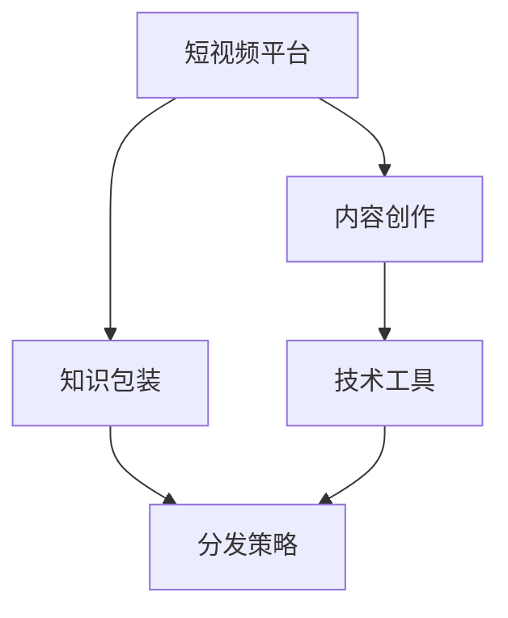

                 

# 如何利用短视频平台进行知识包装

## 1. 背景介绍

### 1.1 问题由来
在数字化时代，信息过载已经成为一种常态，用户对内容消费的偏好也发生了显著变化。短视频以其内容丰富、形式新颖、互动性强等优势，迅速崛起并成为新兴的媒体形态。

在短视频平台上，知识包装和传播变得尤为重要。知识内容不仅要符合平台的用户需求，还要利用短视频特性，通过生动有趣的形式，吸引用户注意，提升传播效果。

### 1.2 问题核心关键点
短视频平台知识包装的核心关键点在于：
1. **内容选题与创意**：如何从海量信息中筛选出有价值的内容，并设计出引人入胜的创意。
2. **技术实现与工具**：利用现有技术手段，如剪辑、特效、合成等，实现内容的高度包装。
3. **分发策略与推广**：如何在平台上进行有效的分发和推广，提高内容曝光率。
4. **用户互动与反馈**：如何设计互动环节，收集用户反馈，不断优化内容质量。

## 2. 核心概念与联系

### 2.1 核心概念概述

为更好地理解短视频平台知识包装的方法，本节将介绍几个关键概念：

- **短视频平台**：以抖音、快手、B站等平台为代表，利用算法推荐技术，实现内容分发的社交媒体平台。
- **知识包装**：将知识内容以短视频形式，通过剪辑、特效、合成等手段，进行高度包装，提升内容的吸引力和传播效果。
- **内容创作**：涉及选题、文案编写、素材收集、拍摄制作等环节，是知识包装的基础。
- **技术工具**：包括剪辑软件、特效插件、合成工具等，用于实现视频内容的包装。
- **分发策略**：包括标题、标签、关键词优化、用户互动等策略，用于提升内容曝光率。

这些核心概念之间的逻辑关系可以通过以下Mermaid流程图来展示：



这个流程图展示了这个知识包装过程的关键步骤：

1. 从短视频平台开始，对内容进行创作和包装。
2. 使用技术工具对创作内容进行高度包装。
3. 设计有效的分发策略，提升内容的曝光率。
4. 根据用户互动和反馈，不断优化和调整内容。

## 3. 核心算法原理 & 具体操作步骤
### 3.1 算法原理概述

短视频平台知识包装的本质是一种内容营销策略，其核心在于将知识内容通过创意和技术手段，进行高度包装，提升用户的吸引力和传播效果。

形式化地，假设知识内容为 $X$，其原始形式为文字、图片、音频等。知识包装的目标是通过一系列技术手段，将 $X$ 转换为适合短视频平台传播的形式 $Y$，使得 $Y$ 在平台上的点击率、点赞率、评论率等指标最大化。

知识包装可以分为以下几个步骤：

1. **选题与创意**：根据平台用户兴趣和需求，选择适合的知识内容，并进行创意设计。
2. **技术实现**：利用剪辑、特效、合成等技术手段，对内容进行高度包装。
3. **分发策略**：设计合适的标题、标签、关键词，利用平台推荐算法，提升内容曝光率。
4. **用户互动**：设计互动环节，如提问、评论、点赞等，收集用户反馈，不断优化内容。

### 3.2 算法步骤详解

以下是短视频平台知识包装的具体操作步骤：

**Step 1: 选题与创意**

1. **用户需求分析**：利用平台数据分析工具，了解用户兴趣和需求。
2. **选题策划**：根据用户需求，策划出具有吸引力的内容选题。
3. **创意设计**：设计吸引人的标题、封面图、开头和结尾，提升内容的吸引力。

**Step 2: 技术实现**

1. **素材收集**：收集与内容相关的图片、视频、音频等素材。
2. **剪辑**：利用剪辑软件，将素材按照创意进行剪辑，形成符合短视频平台规范的视频。
3. **特效**：添加特效、动画、字幕等元素，提升视频的视觉和听觉效果。
4. **合成**：使用合成工具，将不同的素材和特效进行组合，形成最终的视频。

**Step 3: 分发策略**

1. **标题和标签优化**：设计有吸引力的标题和关键词，优化标签，提升搜索排名。
2. **互动设计**：设计互动环节，鼓励用户点赞、评论和分享。
3. **推广和测试**：利用平台广告工具进行推广，并定期测试和优化分发策略。

**Step 4: 用户互动与反馈**

1. **互动环节设计**：设计有趣的问题、问卷调查等，引导用户互动。
2. **反馈收集**：收集用户评论、点赞等信息，了解用户对内容的反馈。
3. **内容优化**：根据反馈，优化内容形式和分发策略，提升用户满意度。

### 3.3 算法优缺点

短视频平台知识包装的优点包括：

1. **高效传播**：通过技术手段，将知识内容高度包装，提升内容的吸引力，实现快速传播。
2. **互动性强**：设计互动环节，增强用户参与感，提升用户粘性。
3. **成本低廉**：相比于传统的知识传播方式，短视频平台的知识包装成本相对较低。
4. **实时更新**：内容可以快速更新，保持时效性和相关性。

缺点包括：

1. **质量参差不齐**：部分内容可能质量较低，影响整体传播效果。
2. **容易被忽视**：大量内容中，优质内容可能被淹没，难以被用户发现。
3. **技术门槛高**：需要一定的技术水平和创意能力，对部分创作者来说门槛较高。
4. **算法依赖**：过度依赖平台算法推荐，内容分发效果可能受平台算法变化影响。

### 3.4 算法应用领域

短视频平台知识包装的应用领域非常广泛，包括但不限于：

- **教育培训**：将知识内容通过短视频形式包装，实现知识传播和教育培训。
- **品牌推广**：利用短视频平台进行品牌推广，提升品牌知名度和影响力。
- **娱乐文化**：创作有趣、有创意的短视频内容，吸引用户关注和互动。
- **科普宣传**：将科普知识通过短视频包装，提升公众对科普知识的兴趣和认知。
- **商业广告**：利用短视频平台进行商业广告的创意制作和分发，提高广告效果。

## 4. 数学模型和公式 & 详细讲解 & 举例说明

### 4.1 数学模型构建

本节将使用数学语言对短视频平台知识包装的模型进行更加严格的刻画。

假设短视频平台的内容流量为 $F$，内容曝光率为 $E$，用户互动率为 $I$，点击率为 $C$，转化率为 $T$，用户满意度为 $S$。内容 $X$ 在平台上的最终流量 $Y$ 可以通过以下模型表示：

$$
Y = f(X, E, I, C, T, S)
$$

其中 $f$ 为内容包装和分发的复杂函数。

### 4.2 公式推导过程

以下我们以教育培训视频为例，推导内容流量的计算公式。

假设一个教育培训视频 $X$ 在平台上的最终流量 $Y$，可以通过以下模型计算：

1. **选题与创意优化**：假设选题和创意优化对内容流量提升的影响为 $\alpha_1$。
2. **技术实现优化**：假设技术实现优化对内容流量提升的影响为 $\alpha_2$。
3. **分发策略优化**：假设分发策略优化对内容流量提升的影响为 $\alpha_3$。
4. **用户互动优化**：假设用户互动优化对内容流量提升的影响为 $\alpha_4$。

则：

$$
Y = X \times \alpha_1 \times \alpha_2 \times \alpha_3 \times \alpha_4
$$

通过分析 $\alpha_1, \alpha_2, \alpha_3, \alpha_4$ 的变化，可以调整内容创作和包装的策略，从而最大化内容流量。

### 4.3 案例分析与讲解

以B站（哔哩哔哩）为例，分析其知识包装的策略和效果：

1. **选题与创意**：B站通过大数据分析，了解用户对不同主题视频的需求。其选题主要集中在科技、游戏、影视、教育等热门领域。
2. **技术实现**：B站利用Aegisub、Adobe Premiere等专业软件，对内容进行高质量包装。通过剪辑、特效、合成等手段，提升视频吸引力。
3. **分发策略**：B站通过精准标签、推荐算法，将内容推荐给目标用户。同时，利用B站UP主的影响力，通过跨平台推广，提升内容曝光率。
4. **用户互动**：B站设计了弹幕、点赞、分享等互动环节，鼓励用户参与和反馈。根据用户互动数据，不断优化内容和分发策略。

通过这些策略，B站成为知识包装和传播的重要平台，吸引了大量用户和创作者，实现了内容的快速传播和有效推广。

## 5. 项目实践：代码实例和详细解释说明

### 5.1 开发环境搭建

在进行知识包装项目实践前，我们需要准备好开发环境。以下是使用Python进行视频剪辑和特效处理的环境配置流程：

1. 安装Anaconda：从官网下载并安装Anaconda，用于创建独立的Python环境。

2. 创建并激活虚拟环境：
```bash
conda create -n video-editing python=3.8 
conda activate video-editing
```

3. 安装必要的Python库：
```bash
conda install ffmpeg pyav opencv-python
pip install moviepy opencv-contrib-python
```

4. 安装视频剪辑和特效工具：
```bash
sudo apt-get install gstreamer1.0-tools
sudo apt-get install gstreamer1.0-plugins-bad
sudo apt-get install gstreamer1.0-plugins-good
sudo apt-get install gstreamer1.0-plugins-bad
```

完成上述步骤后，即可在`video-editing`环境中开始知识包装实践。

### 5.2 源代码详细实现

以下是一个简单的视频剪辑和特效处理Python代码实现，使用MoviePy库进行视频编辑：

```python
from moviepy.editor import VideoFileClip, concatenate_videoclips, TextImageClip, draw_text
from moviepy.video.io.ffmpeg_tools import ffmpeg_extract_subclip
import numpy as np
import cv2

# 加载视频
video = VideoFileClip('input.mp4')

# 提取视频帧
frame = video.get_frame(0)

# 显示视频帧
cv2.imshow('frame', frame)
cv2.waitKey(0)
cv2.destroyAllWindows()

# 添加文本水印
text = 'This is a sample video'
text_position = (100, 100)
watermark = TextImageClip(text, size=(640, 480), color='white', pos=text_position)
watermark = watermark.set_duration(video.duration)

# 合并视频和水印
final = concatenate_videoclips([video, watermark])
final.write_videofile('output.mp4')

# 添加特效
final = final.fx(vignette=100, opacity=0.5, vignette_color='white')
final.write_videofile('output_effect.mp4')
```

### 5.3 代码解读与分析

让我们再详细解读一下关键代码的实现细节：

**VideoFileClip**：
- 用于加载视频文件，支持多种格式，如MP4、AVI等。

**concatenate_videoclips**：
- 用于将多个视频剪辑拼接成一个完整的视频。

**TextImageClip**：
- 用于添加文本水印，支持设置文本大小、颜色、位置等属性。

**draw_text**：
- 用于在视频帧上绘制文本。

**ffmpeg_extract_subclip**：
- 用于提取视频中的特定片段，支持指定起始和结束时间点。

**numpy和cv2**：
- 用于处理视频帧，如显示、提取、添加特效等。

**extract_subclip**：
- 用于提取视频中的特定片段，支持指定起始和结束时间点。

**concatenate_videoclips**：
- 用于将多个视频剪辑拼接成一个完整的视频。

**watermark**：
- 用于添加文本水印，支持设置文本大小、颜色、位置等属性。

**final**：
- 用于存储最终的视频剪辑，支持添加各种特效和滤镜。

通过这些代码，可以完成视频剪辑、添加水印、特效处理等基础操作。在实际应用中，还需要结合具体的项目需求，进一步扩展和优化代码。

## 6. 实际应用场景
### 6.1 教育培训平台

教育培训平台可以通过短视频平台进行知识包装，实现高效的知识传播和教学互动。例如，Khan Academy、Coursera等在线教育平台，利用短视频进行课程讲解、习题演示等，显著提升了学习体验。

在技术实现上，可以收集课程内容和习题数据，利用剪辑、特效等手段进行包装，形成有吸引力的视频。同时设计互动环节，鼓励用户提问、评论和点赞，收集用户反馈，不断优化课程内容。

### 6.2 企业培训系统

企业培训系统可以利用短视频平台进行员工培训，提升培训效果和员工满意度。例如，华为通过短视频平台进行员工技术培训，发布实用的技术讲解和演示视频，实现了快速、高效的知识传播。

在技术实现上，可以收集员工培训需求和内容，利用剪辑、特效等手段进行包装，形成有吸引力的视频。同时设计互动环节，鼓励员工提问、评论和点赞，收集员工反馈，不断优化培训内容。

### 6.3 科普宣传平台

科普宣传平台可以利用短视频平台进行科普知识传播，提升公众对科普知识的兴趣和认知。例如，NASA通过短视频平台发布天文科普视频，吸引了大量观众。

在技术实现上，可以收集科普知识和素材，利用剪辑、特效等手段进行包装，形成有吸引力的视频。同时设计互动环节，鼓励观众提问、评论和点赞，收集观众反馈，不断优化科普内容。

### 6.4 未来应用展望

随着短视频平台的普及和技术的不断进步，基于短视频平台的知识包装将在更多领域得到应用，为知识传播和教育培训带来新的机遇和挑战。

在智慧城市建设中，短视频平台可以用于宣传城市规划、公共服务等内容，提升市民对公共服务的认知和参与度。

在农业科技推广中，短视频平台可以用于介绍农业技术、农业知识等内容，提升农民的技术水平和生产效率。

在医疗健康领域，短视频平台可以用于健康知识普及、疾病预防等内容，提升公众的健康意识和健康水平。

此外，在商业广告、媒体宣传、娱乐文化等众多领域，短视频平台的知识包装也将不断涌现，为知识传播和内容创作带来新的活力。

## 7. 工具和资源推荐
### 7.1 学习资源推荐

为了帮助开发者系统掌握短视频平台知识包装的理论基础和实践技巧，这里推荐一些优质的学习资源：

1. 《短视频制作与包装》系列博文：由视频编辑专家撰写，深入浅出地介绍了短视频的制作流程和包装技巧。

2. 《视频剪辑与特效》课程：Udemy平台上开设的优质课程，涵盖剪辑软件、特效工具等基础操作，适合初学者入门。

3. 《视频包装与动画设计》书籍：讲解视频剪辑、特效、合成等技术，是视频编辑学习的必备书籍。

4. 《短视频运营策略》书籍：讲述短视频平台的运营策略，包括选题策划、分发策略、用户互动等，适合内容创作者参考。

5. 《短视频平台数据分析》课程：学习如何使用短视频平台的数据分析工具，优化内容创作和分发策略。

通过对这些资源的学习实践，相信你一定能够快速掌握短视频平台知识包装的精髓，并用于解决实际的NLP问题。

### 7.2 开发工具推荐

高效的开发离不开优秀的工具支持。以下是几款用于视频编辑和特效处理的工具：

1. Adobe Premiere：行业领先的非线性编辑软件，支持多摄像机剪辑、特效、合成等操作。

2. Final Cut Pro：苹果公司开发的非线性编辑软件，支持高质量剪辑、特效、合成等操作。

3. DaVinci Resolve：Blackmagic公司开发的视频剪辑和后期处理软件，支持剪辑、特效、合成、调色等操作。

4. Filmora：EZ Video开发的入门级视频剪辑和特效处理软件，适合初学者使用。

5. VSDC Free Video Editor：免费的视频编辑软件，支持剪辑、特效、合成等操作。

合理利用这些工具，可以显著提升短视频内容的制作效率和效果，更好地实现知识包装和传播。

### 7.3 相关论文推荐

短视频平台知识包装的研究方向涉及到多个领域，以下是几篇奠基性的相关论文，推荐阅读：

1. "Deep Learning for Video Analysis"：深度学习在视频分析中的应用，包括剪辑、特效、合成等技术。

2. "Video Scene Understanding with Convolutional Neural Networks"：利用CNN进行视频场景理解，提升视频剪辑和特效处理的效果。

3. "Visual Word Embeddings for Unsupervised Learning of Video Representations"：基于视觉词嵌入的方法，实现无监督的视频表示学习，提升内容创作和分发策略。

4. "Top-Down Attention for Multi-View Action Recognition"：引入Top-Down注意力机制，提升视频的理解效果，优化内容创作和分发策略。

5. "Interactive Video Editing with Attention-Based Edit Planning"：利用注意力机制进行交互式视频编辑，提升用户互动体验和内容创作效率。

这些论文代表了大语言模型微调技术的发展脉络。通过学习这些前沿成果，可以帮助研究者把握学科前进方向，激发更多的创新灵感。

## 8. 总结：未来发展趋势与挑战

### 8.1 总结

本文对短视频平台知识包装的方法进行了全面系统的介绍。首先阐述了知识包装在短视频平台的应用背景和意义，明确了知识包装在内容创作和传播中的重要性。其次，从原理到实践，详细讲解了知识包装的数学模型和操作步骤，给出了知识包装任务开发的完整代码实例。同时，本文还广泛探讨了知识包装方法在教育培训、企业培训、科普宣传等众多领域的应用前景，展示了知识包装范式的巨大潜力。此外，本文精选了知识包装技术的各类学习资源，力求为读者提供全方位的技术指引。

通过本文的系统梳理，可以看到，短视频平台知识包装正成为内容创作和传播的重要手段，显著提升了知识内容的吸引力、传播速度和用户互动。未来，伴随短视频平台技术的不断进步和用户需求的不断变化，知识包装还将拓展到更多应用领域，为内容创作者提供更多创作灵感和技术支持。

### 8.2 未来发展趋势

展望未来，短视频平台知识包装技术将呈现以下几个发展趋势：

1. **内容多样化**：随着用户需求的不断变化，内容将更加多样化，包括科普、娱乐、教育、医疗等多个领域。

2. **技术自动化**：随着AI技术的发展，内容创作和包装将逐步自动化，减少人工干预，提高生产效率。

3. **用户个性化**：利用数据分析和推荐算法，实现个性化内容推荐，提升用户满意度。

4. **跨平台融合**：短视频平台与其他社交媒体、电商平台等融合，形成更完整的内容生态。

5. **全球化传播**：短视频平台内容将跨越语言和文化障碍，实现全球传播和互动。

以上趋势凸显了短视频平台知识包装技术的广阔前景。这些方向的探索发展，必将进一步提升内容创作的效率和质量，为知识传播带来新的机遇。

### 8.3 面临的挑战

尽管短视频平台知识包装技术已经取得了显著成果，但在迈向更加智能化、普适化应用的过程中，仍面临诸多挑战：

1. **内容质量参差不齐**：部分内容可能质量较低，影响整体传播效果。

2. **技术门槛较高**：需要一定的技术水平和创意能力，对部分创作者来说门槛较高。

3. **算法依赖性强**：过度依赖平台算法推荐，内容分发效果可能受平台算法变化影响。

4. **版权问题**：内容创作涉及版权问题，需要合理处理和规避。

5. **用户互动不足**：设计互动环节，增强用户参与感，提升用户粘性。

6. **市场竞争激烈**：短视频平台竞争激烈，需要持续创新，保持竞争优势。

面对这些挑战，内容创作者和平台运营商需要共同努力，不断优化和调整内容创作和分发策略，提升内容质量，增强用户互动，才能实现短视频平台的长期可持续发展。

### 8.4 研究展望

面对短视频平台知识包装所面临的种种挑战，未来的研究需要在以下几个方面寻求新的突破：

1. **自动化创作工具**：开发自动化的内容创作工具，提升创作效率和质量。

2. **智能推荐算法**：利用深度学习和推荐算法，实现更精准的内容推荐。

3. **跨平台内容分发**：实现短视频平台与其他平台的内容同步和分发，拓展内容传播渠道。

4. **用户互动技术**：设计更多的用户互动环节，提升用户参与感和粘性。

5. **版权保护技术**：开发版权保护技术，保护内容创作者的权益。

6. **国际传播技术**：开发支持多语言和跨文化的内容创作和分发技术，实现全球传播。

这些研究方向的探索，必将引领短视频平台知识包装技术迈向更高的台阶，为内容创作者提供更多创作灵感和技术支持，实现短视频平台的长期可持续发展。

## 9. 附录：常见问题与解答

**Q1：短视频平台知识包装是否适用于所有内容创作？**

A: 短视频平台知识包装适用于大部分内容创作，特别是短视频、教育培训、娱乐文化等领域。但对于需要深度讲解和分析的内容，如学术论文、长篇文章等，可能不适合。

**Q2：如何进行选题与创意设计？**

A: 选题与创意设计是内容创作的关键步骤，主要包括以下几个方面：
1. 利用平台数据分析工具，了解用户兴趣和需求。
2. 策划具有吸引力的选题和创意，设计有吸引力的标题和封面图。
3. 利用视频编辑软件，实现内容的高质量包装。

**Q3：如何设计有效的分发策略？**

A: 分发策略设计主要包括以下几个方面：
1. 选择合适的关键词和标签，优化搜索排名。
2. 设计有吸引力的标题和封面图，提高点击率。
3. 利用平台广告工具进行推广，提升曝光率。
4. 设计互动环节，鼓励用户点赞、评论和分享。

**Q4：如何设计互动环节？**

A: 互动环节设计主要包括以下几个方面：
1. 设计有趣的问题、问卷调查等，引导用户互动。
2. 设计创意的开头和结尾，吸引用户注意力。
3. 设计简洁的流程和操作界面，方便用户操作。

**Q5：如何优化内容创作和分发策略？**

A: 内容创作和分发策略优化主要包括以下几个方面：
1. 利用数据分析工具，了解用户反馈和互动数据。
2. 根据反馈和数据，优化内容形式和分发策略。
3. 利用视频编辑工具，提升视频质量和吸引力。
4. 利用平台推荐算法，提升内容曝光率和点击率。

通过这些策略，可以不断优化内容创作和分发，提升用户满意度和互动率，实现短视频平台的长期可持续发展。

---

作者：禅与计算机程序设计艺术 / Zen and the Art of Computer Programming

