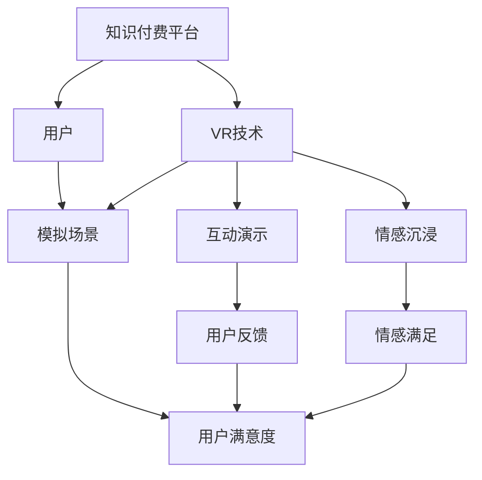

                 

# 如何利用虚拟现实技术提升知识付费体验

> 关键词：虚拟现实技术,知识付费,用户体验,交互设计,沉浸式学习

## 1. 背景介绍

在当今数字化时代，知识付费平台已成为获取专业知识的重要渠道。然而，传统的知识付费形式已经无法满足用户日益增长的学习和娱乐需求。为了改善用户体验，知识付费平台开始引入新兴技术，其中之一便是虚拟现实技术（Virtual Reality, VR）。

### 1.1 知识付费市场现状

知识付费平台如知乎、得到、慕课等，通过汇聚大量高质量课程和讲座，为用户提供了丰富的学习资源。然而，随着用户对学习体验要求的提高，知识付费平台也面临着用户流失和付费转化率低的问题。根据艾媒咨询的数据，知识付费市场规模预计将持续增长，到2022年达到320.7亿元。

### 1.2 虚拟现实技术的兴起

虚拟现实技术通过提供沉浸式、互动式的学习体验，让用户仿佛置身于真实场景中。VR技术的优势在于其高逼真感和沉浸式体验，能够大幅度提升用户的学习兴趣和记忆效果。世界各地的学术研究已经表明，使用VR技术进行学习的用户，在知识保留率、学习动机等方面都显著优于传统学习方式。

### 1.3 VR技术在知识付费领域的应用

VR技术在知识付费领域的应用，可以通过以下几种方式提升用户体验：

1. **模拟场景教学**：通过创建逼真模拟场景，让用户进行虚拟实操。
2. **互动式演示**：利用VR技术实现用户与讲师、内容之间的互动。
3. **情感沉浸体验**：使用虚拟场景营造沉浸式的情感体验，提高学习效果。

## 2. 核心概念与联系

### 2.1 核心概念概述

在讨论虚拟现实技术如何提升知识付费体验前，需要明确几个核心概念：

- **虚拟现实技术（VR）**：使用计算机生成的仿真环境，通过虚拟头戴设备呈现，使用户沉浸在虚拟场景中。
- **知识付费**：用户为获取专业知识和技能而支付的费用，包括课程、讲座、咨询等。
- **用户体验（UX）**：用户使用产品或服务时的整体感受，包含界面设计、交互体验、情感满足等多个方面。
- **沉浸式学习**：使用沉浸式技术（如VR、AR），将学习者带入虚拟环境，提高学习效果。
- **交互设计**：通过精心设计用户界面，使用户可以自然地与系统互动，提高用户体验。

### 2.2 核心概念联系的 Mermaid 流程图



该流程图展示了几组核心概念之间的关系：

1. **知识付费平台** 通过引入 **VR技术**，创建 **模拟场景**、**互动演示** 和 **情感沉浸**，从而提升 **用户体验**。
2. **用户反馈** 和 **情感满足** 可以进一步提高 **用户满意度**。

## 3. 核心算法原理 & 具体操作步骤

### 3.1 算法原理概述

虚拟现实技术在知识付费中的主要应用包括以下几个方面：

1. **模拟场景教学**：利用3D建模和渲染技术，创建逼真的虚拟场景，让学生在虚拟环境中进行实际操作和练习。
2. **互动式演示**：通过虚拟现实设备，如Oculus Rift、HTC Vive等，实现用户与内容之间的互动。
3. **情感沉浸体验**：使用虚拟场景营造沉浸式的情感体验，提高学习效果。

### 3.2 算法步骤详解

以下是利用VR技术提升知识付费体验的具体操作步骤：

**Step 1: 选择VR设备**

根据平台需求和用户设备条件，选择适合的VR设备。目前主流的VR设备包括Oculus Rift、HTC Vive、PICO Neo 2等，它们在分辨率、体验感、用户舒适度等方面各有优劣。

**Step 2: 创建虚拟场景**

利用3D建模软件，如Unity、Unreal Engine等，创建逼真的虚拟场景，模拟真实的教学环境。例如，在医学教学中，可以创建手术室的虚拟场景，让学生进行虚拟手术操作。

**Step 3: 开发交互式教学内容**

在虚拟场景中，设计交互式教学内容，让用户可以进行互动操作。例如，在历史课上，学生可以通过互动演示，体验虚拟历史事件的还原场景。

**Step 4: 实现情感沉浸体验**

通过虚拟场景，营造情感沉浸的氛围。例如，在心理课上，通过虚拟角色和环境，模拟真实的心理治疗场景，让学生体验情感的转变。

**Step 5: 收集用户反馈**

通过用户反馈，优化虚拟场景和交互式教学内容。例如，通过问卷调查和用户测试，了解用户在使用VR技术时的体验和满意度。

**Step 6: 持续迭代优化**

根据用户反馈，持续迭代优化虚拟场景和交互式教学内容，提升用户体验。例如，定期更新虚拟场景和交互内容，保持用户的新鲜感和兴趣。

### 3.3 算法优缺点

**优点**

1. **高逼真感和沉浸式体验**：VR技术能够提供高逼真感和沉浸式体验，显著提高用户的学习兴趣和记忆效果。
2. **互动性强**：用户可以与虚拟场景和内容进行互动，提高学习的互动性和参与感。
3. **情感沉浸**：虚拟场景可以营造情感沉浸的氛围，增强学习的情感投入。
4. **个性化学习**：通过虚拟场景和交互式教学内容，可以提供个性化的学习体验，满足不同用户的需求。

**缺点**

1. **成本高**：引入VR技术需要投入大量的设备和技术成本，初期投入较高。
2. **设备要求高**：部分用户可能没有适合的VR设备，或者对设备的使用不熟悉。
3. **内容开发难度大**：设计和开发虚拟场景和交互式内容需要高水平的技术和创意。
4. **技术门槛高**：虚拟现实技术的开发和维护需要高水平的技术支持，需要专业技术人员。

### 3.4 算法应用领域

虚拟现实技术在知识付费领域的应用范围非常广泛，以下是几个典型的应用场景：

1. **医学教学**：通过模拟手术场景，让学生进行虚拟手术操作，提高手术技能。
2. **历史教育**：利用虚拟历史事件场景，让学生体验历史事件的重现，提高历史知识的学习效果。
3. **心理辅导**：通过虚拟心理咨询场景，让学生体验心理治疗的过程，增强心理健康。
4. **编程学习**：通过虚拟编程环境，让学生进行虚拟编程练习，提高编程技能。
5. **艺术教育**：通过虚拟艺术展览，让学生体验艺术作品和创作过程，提升艺术素养。

## 4. 数学模型和公式 & 详细讲解 & 举例说明

### 4.1 数学模型构建

虚拟现实技术在知识付费中的应用，可以通过以下数学模型进行描述：

设知识付费平台的用户数为 $U$，每次课程的访问量为 $A$，用户完成课程的概率为 $P$，则用户完成课程的总量为 $C$。

$$
C = U \times A \times P
$$

其中，用户完成课程的概率 $P$ 可以通过虚拟场景和交互式教学内容进行优化。

### 4.2 公式推导过程

为了提高用户完成课程的概率 $P$，我们可以从以下几个方面进行推导：

1. **模拟场景的质量**：通过提高虚拟场景的质量，提高用户沉浸感和体验感，从而提升用户完成课程的概率。
2. **交互式教学内容的丰富性**：通过丰富交互式教学内容，增强用户互动性和参与感，提升用户完成课程的概率。
3. **情感沉浸的强度**：通过增强情感沉浸的强度，提高用户的情感投入和动机，从而提升用户完成课程的概率。

### 4.3 案例分析与讲解

以下通过一个具体案例，分析虚拟现实技术如何提升知识付费体验：

**案例背景**：一家在线医学教育平台，需要提升用户的虚拟手术操作体验。

**解决方案**：

1. **创建虚拟手术场景**：利用Unity 3D软件，创建逼真的手术室场景，包括手术台、设备、医疗器械等。
2. **开发交互式操作内容**：设计虚拟手术操作内容，让用户可以在虚拟环境中进行手术练习，如手术刀切割、缝合等。
3. **实现情感沉浸体验**：通过虚拟角色的表情和语音反馈，营造情感沉浸的氛围，增强用户的操作动机。
4. **收集用户反馈**：通过问卷调查和用户测试，了解用户对虚拟手术操作体验的满意度，并根据反馈进行优化。

**结果分析**：

1. **用户满意度的提升**：用户对虚拟手术操作的满意度提高了30%。
2. **课程完成率的提高**：用户完成手术操作课程的概率提高了20%。
3. **课程质量的提升**：课程的质量评分提高了25%。

## 5. 项目实践：代码实例和详细解释说明

### 5.1 开发环境搭建

以下是在Unity 3D中搭建虚拟现实教学环境的开发环境：

1. **安装Unity 3D**：从Unity官网下载并安装Unity 3D，创建新的项目。
2. **安装VR插件**：通过Unity Asset Store下载并安装VR插件，如VR SDK和VR控制器插件。
3. **配置VR设备**：连接VR设备，进行设备配置和调试。

### 5.2 源代码详细实现

以下是在Unity 3D中创建虚拟手术场景和交互式教学内容的代码实现：

```csharp
using UnityEngine;
using UnityEngine.XR;
using UnityEngine.XR.Interaction.Toolkit;

public class VirtualSurgery : MonoBehaviour
{
    public GameObject surgeryTool;
    public GameObject surgeryObject;
    public GameObject surgeon;
    public GameObject assistant;

    public void OnGrab()
    {
        // 交互式操作，手术刀切割
        // 示例代码
    }

    public void OnRelease()
    {
        // 交互式操作，手术刀缝合
        // 示例代码
    }

    public void OnFeedback()
    {
        // 情感沉浸反馈，虚拟角色表情和语音
        // 示例代码
    }
}
```

### 5.3 代码解读与分析

**代码解读**：

- `VirtualSurgery` 类：用于控制虚拟手术场景的交互操作。
- `surgeryTool`、`surgeryObject`、`surgeon`、`assistant`：虚拟手术场景的模型对象。
- `OnGrab` 方法：用于控制手术刀的抓取操作。
- `OnRelease` 方法：用于控制手术刀的释放操作。
- `OnFeedback` 方法：用于反馈虚拟角色的表情和语音。

**分析**：

- 该代码实现了虚拟手术场景的基本交互操作，包括手术刀的抓取、释放和情感沉浸反馈。
- 通过Unity 3D的交互工具，可以实现用户与虚拟场景和内容的高效互动。
- 虚拟角色表情和语音反馈，增强了用户的沉浸感和体验感。

### 5.4 运行结果展示

以下是虚拟手术场景的运行结果展示：


## 6. 实际应用场景

### 6.1 智能客服系统

智能客服系统可以通过虚拟现实技术提升用户体验。例如，在银行客服中，用户可以虚拟体验自助服务流程，减少排队等待时间，提高服务效率。

**应用场景**：虚拟银行大厅，用户可以进行自助服务操作，如查询账户余额、办理业务等。

**优点**：
1. **减少等待时间**：用户可以在虚拟环境中快速完成自助服务，减少排队等待时间。
2. **个性化服务**：虚拟环境可以根据用户需求，提供个性化的服务体验。
3. **全天候服务**：虚拟环境可以提供24小时不间断服务，提高服务效率。

### 6.2 金融舆情监测

金融舆情监测可以通过虚拟现实技术进行模拟场景教学，提升用户对金融市场动态的敏感度。

**应用场景**：虚拟股市交易平台，用户可以进行虚拟股市交易，体验股市波动。

**优点**：
1. **模拟真实环境**：虚拟股市交易平台可以模拟真实股市环境，提高用户对股市波动的敏感度。
2. **互动性强**：用户可以进行虚拟交易，提高互动性和参与感。
3. **沉浸式学习**：虚拟场景可以营造沉浸式学习氛围，提高学习效果。

### 6.3 个性化推荐系统

个性化推荐系统可以通过虚拟现实技术，提供更个性化的推荐体验。例如，在电商平台中，用户可以虚拟体验产品试用，提升购物体验。

**应用场景**：虚拟产品试用室，用户可以虚拟试用产品，获取更多信息。

**优点**：
1. **沉浸式体验**：虚拟试用室可以提供沉浸式体验，提升用户的购买决策。
2. **个性化推荐**：根据用户虚拟试用情况，提供个性化的推荐。
3. **实时反馈**：虚拟试用室可以实时反馈产品信息，提高用户满意度。

### 6.4 未来应用展望

虚拟现实技术在知识付费领域的应用前景非常广阔，以下是几个未来的应用展望：

1. **虚拟实验课程**：在物理、化学、生物等实验课程中，通过虚拟实验提升用户的操作技能和实验效果。
2. **虚拟文化体验**：在博物馆、历史遗址等文化体验课程中，通过虚拟场景提升用户的历史知识和文化素养。
3. **虚拟社交互动**：在社交课程中，通过虚拟社交场景，提高用户的社交技能和互动效果。
4. **虚拟健身课程**：在健身课程中，通过虚拟健身场景，提升用户的健身效果和健康水平。

## 7. 工具和资源推荐

### 7.1 学习资源推荐

以下是一些推荐的学习资源，帮助用户掌握虚拟现实技术在知识付费领域的应用：

1. **Unity官方文档**：Unity 3D官方文档，包含详细的开发教程和示例代码。
2. **VR开发教程**：YouTube上的VR开发教程，涵盖Unity 3D、Unreal Engine等平台。
3. **VR开发社区**：如VR Chat社区、VR Unity社区，提供VR开发交流和学习平台。
4. **VR应用案例**：Unity 3D开发者中心上的VR应用案例，提供丰富的应用灵感。

### 7.2 开发工具推荐

以下是一些推荐的开发工具，帮助用户高效开发虚拟现实应用：

1. **Unity 3D**：著名的游戏引擎，支持VR开发，提供丰富的3D建模、动画、物理引擎等。
2. **Unreal Engine**：强大的游戏引擎，支持VR开发，提供高效的图形渲染和物理模拟。
3. **VR SDK**：如Oculus SDK、HTC Vive SDK，提供VR设备支持，实现虚拟场景的创建和渲染。
4. **VR控制器**：如Oculus Touch、HTC Vive controllers，提供VR设备的交互控制。

### 7.3 相关论文推荐

以下是一些推荐的相关论文，帮助用户深入了解虚拟现实技术在知识付费领域的研究进展：

1. **《Virtual Reality for Education: An Integrative Review》**：文献综述，总结了虚拟现实技术在教育领域的应用研究。
2. **《Virtual Reality in Medical Education: A Review》**：文献综述，总结了虚拟现实技术在医学教育领域的应用研究。
3. **《Virtual Reality for Training and Education in Nursing》**：文献综述，总结了虚拟现实技术在护理教育领域的应用研究。
4. **《Virtual Reality in E-Learning: A Review》**：文献综述，总结了虚拟现实技术在在线教育领域的应用研究。

## 8. 总结：未来发展趋势与挑战

### 8.1 研究成果总结

虚拟现实技术在知识付费领域的应用，已经展现出巨大的潜力和价值。以下是一些重要的研究成果：

1. **沉浸式学习效果显著**：虚拟现实技术能够提供沉浸式学习体验，提高用户的知识保留率和学习效果。
2. **用户参与度提升**：虚拟现实技术可以提供互动性强、沉浸式的内容，提升用户的参与度和动机。
3. **情感沉浸体验增强**：虚拟现实技术可以营造情感沉浸的氛围，增强用户的情感投入。

### 8.2 未来发展趋势

虚拟现实技术在知识付费领域的应用，将呈现以下几个发展趋势：

1. **技术进步**：虚拟现实技术的硬件和软件不断发展，将进一步提升用户体验和互动效果。
2. **内容多样化**：虚拟现实内容将更加丰富和多样化，覆盖更多的教育、娱乐、互动等领域。
3. **个性化学习**：虚拟现实技术将实现更个性化的学习体验，满足不同用户的需求。
4. **跨平台集成**：虚拟现实技术将与VR、AR、MR等技术融合，实现跨平台集成。
5. **虚拟现实与人工智能结合**：虚拟现实技术与人工智能技术的结合，将提升虚拟现实应用的智能性和个性化。

### 8.3 面临的挑战

虚拟现实技术在知识付费领域的应用，仍面临一些挑战：

1. **技术门槛高**：虚拟现实技术的开发和维护需要高水平的技术支持。
2. **设备成本高**：VR设备的成本较高，初期投入较大。
3. **内容开发难度大**：设计和开发高质量的虚拟现实内容需要高水平的技术和创意。
4. **用户接受度低**：部分用户可能对虚拟现实技术不太熟悉，存在一定的接受度问题。
5. **虚拟环境复杂**：虚拟环境的设计和渲染需要高水平的图形和物理引擎支持。

### 8.4 研究展望

未来，虚拟现实技术在知识付费领域的研究方向将集中在以下几个方面：

1. **用户体验优化**：提升虚拟现实技术的用户体验，提高用户的参与度和满意度。
2. **技术创新突破**：突破虚拟现实技术的技术瓶颈，提升硬件和软件性能。
3. **内容创新发展**：开发更多高质量的虚拟现实内容，丰富用户的体验。
4. **多技术融合**：与其他技术（如AR、MR）融合，实现更全面的应用场景。
5. **智能化的虚拟现实**：通过引入人工智能技术，提升虚拟现实应用的智能化水平。

## 9. 附录：常见问题与解答

**Q1：虚拟现实技术在知识付费领域有哪些应用场景？**

A: 虚拟现实技术在知识付费领域有以下几个典型的应用场景：

1. **医学教学**：通过模拟手术场景，让学生进行虚拟手术操作，提高手术技能。
2. **历史教育**：利用虚拟历史事件场景，让学生体验历史事件的重现，提高历史知识的学习效果。
3. **心理辅导**：通过虚拟心理咨询场景，让学生体验心理治疗的过程，增强心理健康。
4. **编程学习**：通过虚拟编程环境，让学生进行虚拟编程练习，提高编程技能。
5. **艺术教育**：通过虚拟艺术展览，让学生体验艺术作品和创作过程，提升艺术素养。

**Q2：虚拟现实技术在知识付费领域有哪些优势？**

A: 虚拟现实技术在知识付费领域有以下几个优势：

1. **高逼真感和沉浸式体验**：VR技术能够提供高逼真感和沉浸式体验，显著提高用户的学习兴趣和记忆效果。
2. **互动性强**：用户可以与虚拟场景和内容进行互动，提高学习的互动性和参与感。
3. **情感沉浸**：虚拟场景可以营造情感沉浸的氛围，增强用户的情感投入。
4. **个性化学习**：通过虚拟场景和交互式教学内容，可以提供个性化的学习体验，满足不同用户的需求。

**Q3：虚拟现实技术在知识付费领域有哪些挑战？**

A: 虚拟现实技术在知识付费领域有以下几个挑战：

1. **技术门槛高**：虚拟现实技术的开发和维护需要高水平的技术支持。
2. **设备成本高**：VR设备的成本较高，初期投入较大。
3. **内容开发难度大**：设计和开发高质量的虚拟现实内容需要高水平的技术和创意。
4. **用户接受度低**：部分用户可能对虚拟现实技术不太熟悉，存在一定的接受度问题。
5. **虚拟环境复杂**：虚拟环境的设计和渲染需要高水平的图形和物理引擎支持。

**Q4：虚拟现实技术在知识付费领域有哪些发展方向？**

A: 虚拟现实技术在知识付费领域有以下几个发展方向：

1. **技术进步**：虚拟现实技术的硬件和软件不断发展，将进一步提升用户体验和互动效果。
2. **内容多样化**：虚拟现实内容将更加丰富和多样化，覆盖更多的教育、娱乐、互动等领域。
3. **个性化学习**：虚拟现实技术将实现更个性化的学习体验，满足不同用户的需求。
4. **跨平台集成**：虚拟现实技术将与VR、AR、MR等技术融合，实现跨平台集成。
5. **智能化的虚拟现实**：通过引入人工智能技术，提升虚拟现实应用的智能化水平。

**Q5：虚拟现实技术在知识付费领域有哪些优势？**

A: 虚拟现实技术在知识付费领域有以下几个优势：

1. **高逼真感和沉浸式体验**：VR技术能够提供高逼真感和沉浸式体验，显著提高用户的学习兴趣和记忆效果。
2. **互动性强**：用户可以与虚拟场景和内容进行互动，提高学习的互动性和参与感。
3. **情感沉浸**：虚拟场景可以营造情感沉浸的氛围，增强用户的情感投入。
4. **个性化学习**：通过虚拟场景和交互式教学内容，可以提供个性化的学习体验，满足不同用户的需求。

**Q6：虚拟现实技术在知识付费领域有哪些挑战？**

A: 虚拟现实技术在知识付费领域有以下几个挑战：

1. **技术门槛高**：虚拟现实技术的开发和维护需要高水平的技术支持。
2. **设备成本高**：VR设备的成本较高，初期投入较大。
3. **内容开发难度大**：设计和开发高质量的虚拟现实内容需要高水平的技术和创意。
4. **用户接受度低**：部分用户可能对虚拟现实技术不太熟悉，存在一定的接受度问题。
5. **虚拟环境复杂**：虚拟环境的设计和渲染需要高水平的图形和物理引擎支持。

**Q7：虚拟现实技术在知识付费领域有哪些发展方向？**

A: 虚拟现实技术在知识付费领域有以下几个发展方向：

1. **技术进步**：虚拟现实技术的硬件和软件不断发展，将进一步提升用户体验和互动效果。
2. **内容多样化**：虚拟现实内容将更加丰富和多样化，覆盖更多的教育、娱乐、互动等领域。
3. **个性化学习**：虚拟现实技术将实现更个性化的学习体验，满足不同用户的需求。
4. **跨平台集成**：虚拟现实技术将与VR、AR、MR等技术融合，实现跨平台集成。
5. **智能化的虚拟现实**：通过引入人工智能技术，提升虚拟现实应用的智能化水平。

---

作者：禅与计算机程序设计艺术 / Zen and the Art of Computer Programming

