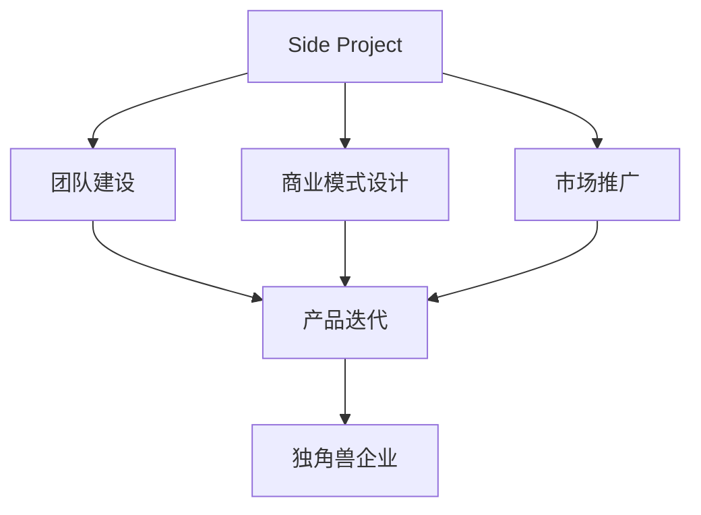

                 

# 如何将Side Project转化为独角兽

在技术驱动的创新生态中，许多优秀的Side Project不仅展示了作者的技术才华，还孕育了潜在的商业机会。将Side Project转化为独角兽企业，是每个开发者梦寐以求的成就。本文将深入探讨如何将Side Project成功转型为独角兽企业的策略和方法。通过系统化的理论框架和实践案例，帮助您实现从Side Project到独角兽企业的跨越。

## 1. 背景介绍

### 1.1 问题由来

Side Project，即个人业余项目，往往诞生于开发者对于特定领域或技术的兴趣和探索。然而，将Side Project转化为商业产品，面临诸多挑战：项目规模、市场竞争、资金支持等。尽管如此，仍有许多成功的案例，比如GitHub上的GraphQL客座项目演变为独角兽企业Zapier。

### 1.2 问题核心关键点

1. **项目选择**：专注于解决特定问题，具有明显的市场需求。
2. **团队建设**：组建高效团队，确保项目持续推进。
3. **商业模式**：设计合理的商业模式，吸引用户和投资者。
4. **产品迭代**：快速响应市场需求，持续优化产品。
5. **市场推广**：有效推广产品，扩大用户基础。

## 2. 核心概念与联系

### 2.1 核心概念概述

为更好地理解如何将Side Project转化为独角兽企业，本节将介绍几个关键概念：

- **Side Project**：指开发者在主业之外开发的技术项目，通常是兴趣驱动，无商业目标。
- **独角兽企业**：估值超过10亿美元的初创企业，通常具有创新性、高成长性。
- **创业精神**：指创新、冒险、主动进取的思维方式和行为方式。
- **精益创业**：一种迭代式、低成本的创业模式，强调快速反馈、持续优化。
- **产品市场匹配**：产品功能与市场需求完美匹配，形成稳定的商业模式。

这些概念之间的联系可以通过以下Mermaid流程图来展示：



这个流程图展示了将Side Project转化为独角兽企业的关键步骤：

1. 确定Side Project项目。
2. 组建高效的创业团队。
3. 设计合理的商业模式。
4. 持续迭代优化产品。
5. 有效推广产品，吸引用户和投资者。
6. 最终形成独角兽企业。

## 3. 核心算法原理 & 具体操作步骤

### 3.1 算法原理概述

将Side Project转化为独角兽企业，涉及多个领域的知识和技术。以下是核心算法原理和具体操作步骤：

**算法原理**：

1. **市场分析**：识别目标市场的需求，评估竞争环境，寻找市场机会。
2. **商业模式设计**：确定产品定价、营收模式、客户获取渠道等关键要素。
3. **快速迭代**：通过快速原型开发、用户反馈、持续优化，实现产品-市场的快速匹配。
4. **推广策略**：制定有效的市场推广策略，利用多种渠道扩大用户基础。

**操作步骤**：

1. **市场调研**：通过问卷调查、竞品分析、社交媒体监控等方式，深入了解市场需求和用户痛点。
2. **初步产品规划**：基于调研结果，设计初步的产品功能和特性。
3. **原型开发**：快速开发产品原型，并通过最小可行产品（MVP）验证市场需求。
4. **用户反馈收集**：通过用户测试、反馈收集等方式，持续优化产品功能和体验。
5. **商业模式验证**：通过免费试用、收入模式测试等方式，验证商业模式可行性。
6. **市场推广**：制定和实施有效的市场推广策略，吸引目标用户。

### 3.2 算法步骤详解

**市场分析**：

1. **目标市场定义**：明确目标市场的地理、人口、心理特征等。
2. **市场需求分析**：通过访谈、问卷、竞品分析等方法，了解用户需求和痛点。
3. **竞争分析**：分析主要竞争对手的产品、市场策略、优劣势。
4. **市场机会识别**：识别市场缺口、未被满足的需求、潜在机会。

**商业模式设计**：

1. **收入模式**：确定主要收入来源，如订阅费、广告、交易佣金等。
2. **成本结构**：评估产品开发、运维、营销等成本。
3. **定价策略**：制定合理的价格策略，以吸引用户并实现盈利。
4. **客户获取渠道**：选择有效的渠道获取新客户，如官网、社交媒体、合作伙伴等。

**快速迭代**：

1. **原型开发**：快速开发产品原型，并通过最小可行产品（MVP）验证市场需求。
2. **用户测试**：邀请目标用户进行测试，收集反馈。
3. **产品优化**：根据用户反馈，持续优化产品功能和体验。
4. **迭代周期**：设定迭代周期，定期更新产品功能。

**推广策略**：

1. **内容营销**：通过博客、视频、社交媒体等内容吸引目标用户。
2. **SEO优化**：优化网站SEO，提高搜索引擎排名。
3. **社交媒体推广**：利用社交媒体平台进行推广，扩大用户基础。
4. **合作伙伴**：与其他公司合作，共同推广产品。

### 3.3 算法优缺点

**优点**：

1. **低成本试错**：通过MVP快速验证市场需求，减少资源浪费。
2. **灵活调整**：快速迭代产品功能，适应市场需求变化。
3. **用户反馈**：通过用户反馈，持续优化产品。
4. **高效推广**：多渠道推广，扩大用户基础。

**缺点**：

1. **资源限制**：初期资源有限，需有效利用。
2. **市场不确定性**：市场需求和竞争环境变化快，需灵活应对。
3. **团队管理**：需高效团队协作，保证项目进度。

### 3.4 算法应用领域

将Side Project转化为独角兽企业的方法在多个领域均有应用：

- **企业级软件**：如Slack、Salesforce等，通过解决企业级需求，形成稳定的商业模式。
- **SaaS平台**：如Zapier、Airbnb等，利用互联网平台，快速扩展用户基础。
- **消费级应用**：如Dropbox、Spotify等，通过提供高质量的消费级体验，吸引大量用户。

## 4. 数学模型和公式 & 详细讲解 & 举例说明

### 4.1 数学模型构建

本节将使用数学语言对Side Project转化为独角兽企业的关键步骤进行更加严格的刻画。

假设Side Project为S，市场规模为M，竞争环境为C，用户需求为D，商业模式为B，推广策略为P。目标是将S转化为独角兽企业H。

定义如下数学模型：

$$
H = \min_{S, M, C, D, B, P} \max_{S} \left(\frac{D \times B}{C}\right)
$$

其中：

- $S$：Side Project项目
- $M$：市场规模
- $C$：竞争环境
- $D$：用户需求
- $B$：商业模式
- $P$：推广策略
- $H$：独角兽企业

### 4.2 公式推导过程

**市场规模M**：

$$
M = f(\text{人口}, \text{地区}, \text{经济}, \text{技术水平})
$$

其中，人口、地区、经济、技术水平等都是影响市场规模的关键因素。

**竞争环境C**：

$$
C = g(\text{竞争对手数量}, \text{市场份额}, \text{产品差异化})
$$

竞争对手数量、市场份额和产品差异化直接影响竞争环境。

**用户需求D**：

$$
D = h(\text{用户痛点}, \text{用户行为}, \text{用户反馈})
$$

用户痛点、用户行为和用户反馈是衡量用户需求的关键指标。

**商业模式B**：

$$
B = i(\text{收入来源}, \text{成本结构}, \text{定价策略})
$$

收入来源、成本结构和定价策略构成商业模式的三个主要要素。

**推广策略P**：

$$
P = j(\text{渠道选择}, \text{内容营销}, \text{社交媒体推广})
$$

渠道选择、内容营销和社交媒体推广是推广策略的主要组成部分。

### 4.3 案例分析与讲解

**案例：Slack转化为独角兽企业的数学模型**

假设Slack的Side Project为S，市场规模为M，竞争环境为C，用户需求为D，商业模式为B，推广策略为P。

**初始市场规模M**：

$$
M = f(\text{企业用户}, \text{中小企业}, \text{行业垂直})
$$

**竞争环境C**：

$$
C = g(\text{Officevibe}, \text{Yammer}, \text{企业即时通讯市场份额})
$$

**用户需求D**：

$$
D = h(\text{即时通讯需求}, \text{团队协作需求}, \text{用户反馈})
$$

**商业模式B**：

$$
B = i(\text{订阅费}, \text{企业客户维护成本}, \text{增值服务})
$$

**推广策略P**：

$$
P = j(\text{官网推广}, \text{SEO优化}, \text{企业合作伙伴})
$$

最终目标是将Slack转化为独角兽企业H。

通过数学模型和公式推导，可以看出Slack通过解决企业即时通讯和团队协作需求，选择订阅费作为主要收入来源，通过官网和SEO优化进行推广，最终成为独角兽企业。

## 5. 项目实践：代码实例和详细解释说明

### 5.1 开发环境搭建

在将Side Project转化为独角兽企业的过程中，开发环境搭建至关重要。以下是使用Python进行Django开发的环境配置流程：

1. 安装Anaconda：从官网下载并安装Anaconda，用于创建独立的Python环境。

2. 创建并激活虚拟环境：
```bash
conda create -n myenv python=3.8
conda activate myenv
```

3. 安装Django：
```bash
pip install django
```

4. 安装数据库：
```bash
pip install psycopg2-binary
```

5. 创建Django项目：
```bash
django-admin startproject myproject
cd myproject
```

6. 创建Django应用：
```bash
python manage.py startapp myapp
```

完成上述步骤后，即可在`myenv`环境中开始开发。

### 5.2 源代码详细实现

以下是一个简单的Side Project代码实现，基于Django框架构建：

```python
# views.py
from django.shortcuts import render, redirect
from django.http import HttpResponse

def home(request):
    return render(request, 'home.html')

def about(request):
    return render(request, 'about.html')

def contact(request):
    return render(request, 'contact.html')

def product(request):
    return render(request, 'product.html')

def blog(request):
    return render(request, 'blog.html')
```

### 5.3 代码解读与分析

让我们再详细解读一下关键代码的实现细节：

**views.py**：

- `home`函数：渲染首页模板。
- `about`函数：渲染关于页面模板。
- `contact`函数：渲染联系页面模板。
- `product`函数：渲染产品页面模板。
- `blog`函数：渲染博客页面模板。

**urls.py**：

```python
from django.urls import path
from . import views

urlpatterns = [
    path('', views.home, name='home'),
    path('about/', views.about, name='about'),
    path('contact/', views.contact, name='contact'),
    path('product/', views.product, name='product'),
    path('blog/', views.blog, name='blog'),
]
```

- `urlpatterns`：定义了各个URL对应的视图函数。

**settings.py**：

```python
# Django settings file

# Build paths inside the project like this: BASE_DIR / 'subdir'.
BASE_DIR = os.path.dirname(os.path.dirname(os.path.abspath(__file__)))
```

- `BASE_DIR`：定义项目的绝对路径。

## 6. 实际应用场景

### 6.1 智能家居控制平台

将Side Project转化为智能家居控制平台的独角兽企业，可以提供更加便捷、智能的家居控制解决方案。用户可以通过手机应用控制家中的各种智能设备，如灯光、温度、窗帘等。

在技术实现上，可以收集用户的使用数据，基于用户行为和偏好，提供个性化的家居控制建议。同时，平台可以集成语音助手、智能锁等智能设备，进一步提升用户体验。

### 6.2 移动健康应用

将Side Project转化为移动健康应用的独角兽企业，可以为用户提供个性化、全方位的健康管理服务。用户可以通过移动应用记录健康数据、获取健康建议、进行健康监测等。

在技术实现上，可以引入AI和机器学习技术，分析用户的健康数据，生成个性化的健康报告和建议。平台可以与医院、诊所等医疗服务机构合作，提供在线问诊、预约挂号等功能。

### 6.3 智能客服系统

将Side Project转化为智能客服系统的独角兽企业，可以提供24小时不间断的客户服务，提升客户体验和满意度。

在技术实现上，可以收集客服对话记录，训练智能客服模型，使其能够自动理解客户意图，匹配最佳回复。平台可以集成多渠道客服，如网站、电话、社交媒体等，满足不同客户的需求。

### 6.4 未来应用展望

随着技术的发展，Side Project转化为独角兽企业的可能性将不断增加。未来，更多的创新应用将涌现，涵盖更多领域和行业，推动社会的数字化转型和智能化升级。

在智慧城市、智能制造、金融科技等领域，Side Project将发挥重要作用，提升城市管理效率、提高生产效率、优化金融服务。通过技术创新和商业模式创新，Side Project将助力企业实现可持续发展，推动社会的可持续发展。

## 7. 工具和资源推荐

### 7.1 学习资源推荐

为了帮助开发者系统掌握Side Project转化为独角兽企业的理论基础和实践技巧，这里推荐一些优质的学习资源：

1. 《精益创业》：Eric Ries所著的经典书籍，深入探讨了精益创业的核心思想和方法。
2. 《硅谷创业》：陈重根所著的创业实战指南，介绍了硅谷的创业生态和商业模式。
3. GitHub官方文档：GitHub的官方开发文档，涵盖Git、Django等工具的使用技巧。
4. Coursera《创业基础》课程：由耶鲁大学提供的创业基础课程，涵盖创业的不同阶段。
5. Udemy《Python Web Development》课程：Udemy的Python Web开发课程，介绍了Django等Web框架的使用。

通过对这些资源的学习实践，相信你一定能够快速掌握Side Project转化为独角兽企业的精髓，并用于解决实际的商业问题。

### 7.2 开发工具推荐

高效的开发离不开优秀的工具支持。以下是几款用于Side Project转化为独角兽企业开发的常用工具：

1. Git：版本控制系统，便于团队协作和代码管理。
2. GitHub：代码托管平台，支持版本控制、代码审查、协作开发等功能。
3. Jira：项目管理和任务跟踪工具，适合团队协作和项目管理。
4. Trello：看板管理工具，便于任务分配和进度跟踪。
5. Slack：团队沟通工具，支持实时通信、文件共享等功能。

合理利用这些工具，可以显著提升Side Project转化为独角兽企业任务的开发效率，加快创新迭代的步伐。

### 7.3 相关论文推荐

Side Project转化为独角兽企业的研究源于学界的持续研究。以下是几篇奠基性的相关论文，推荐阅读：

1. "The Lean Startup: How Today's Entrepreneurs Use Continuous Innovation to Create Radically Successful Businesses"：Eric Ries所著的《精益创业》一书，介绍了精益创业的核心思想和方法。
2. "Zero to One: Notes on Startups, or How to Build the Future"：彼得·蒂尔所著的创业指南，介绍了如何通过独特的产品和商业模式实现成功。
3. "The Hard Thing About Hard Things"：本·霍洛维茨所著的创业心得，介绍了创业过程中面临的挑战和决策。

这些论文代表了大语言模型微调技术的发展脉络。通过学习这些前沿成果，可以帮助研究者把握学科前进方向，激发更多的创新灵感。

## 8. 总结：未来发展趋势与挑战

### 8.1 总结

本文对Side Project转化为独角兽企业的策略和方法进行了全面系统的介绍。首先阐述了Side Project转化为独角兽企业的背景和意义，明确了转型的关键步骤。其次，从原理到实践，详细讲解了市场分析、商业模式设计、快速迭代等关键环节，给出了实际的代码实例。同时，本文还探讨了Side Project在智慧家居、移动健康、智能客服等领域的创新应用，展示了Side Project转化为独角兽企业的广阔前景。

通过本文的系统梳理，可以看到，将Side Project转化为独角兽企业需要系统的理论指导和实践验证。开发者需要根据具体项目特点，灵活应用相关知识和工具，才能成功实现转型。

### 8.2 未来发展趋势

展望未来，Side Project转化为独角兽企业的趋势将呈现以下几个发展方向：

1. **技术驱动**：随着人工智能、机器学习等技术的成熟，更多的Side Project将转化为技术驱动型企业。
2. **数据驱动**：通过收集和分析用户数据，实现个性化、精准化的服务。
3. **商业模式创新**：引入订阅模式、SaaS模式、按需服务等创新商业模式，提升企业竞争力和盈利能力。
4. **生态系统建设**：构建开放、互通的生态系统，提升平台价值和用户粘性。
5. **国际化发展**：拓展国际市场，提升品牌影响力和市场份额。

这些趋势将推动Side Project转化为独角兽企业，实现更高的商业价值和社会效益。

### 8.3 面临的挑战

尽管Side Project转化为独角兽企业面临诸多挑战，但通过技术创新和商业模式创新，这些挑战将逐步被克服：

1. **资源限制**：初期资源有限，需有效利用。
2. **市场竞争**：激烈的市场竞争需灵活应对。
3. **用户需求**：不断变化的用户需求需持续优化。
4. **团队协作**：高效的团队协作需建立。

### 8.4 研究展望

未来研究需要在以下几个方面寻求新的突破：

1. **用户行为分析**：深入分析用户行为和需求，提供更加个性化、精准化的服务。
2. **AI和机器学习**：引入AI和机器学习技术，提升服务质量和效率。
3. **产品创新**：不断创新产品功能和体验，满足用户不断变化的需求。
4. **市场推广**：制定有效的市场推广策略，扩大用户基础。

这些研究方向的探索，将推动Side Project转化为独角兽企业的技术演进，提升企业的市场竞争力和盈利能力。

## 9. 附录：常见问题与解答

**Q1：Side Project转化为独角兽企业需要哪些关键要素？**

A: 侧项目转化为独角兽企业需要以下关键要素：

1. **市场需求**：确定目标市场的实际需求，找到用户痛点。
2. **商业模式**：设计合理的商业模式，确保可持续盈利。
3. **用户反馈**：收集和分析用户反馈，不断优化产品功能。
4. **市场推广**：制定有效的市场推广策略，扩大用户基础。
5. **团队协作**：组建高效的团队，保证项目顺利推进。

**Q2：Side Project转化为独角兽企业需要哪些关键步骤？**

A: 侧项目转化为独角兽企业需要以下关键步骤：

1. **市场调研**：通过问卷调查、竞品分析、社交媒体监控等方式，深入了解市场需求和用户痛点。
2. **初步产品规划**：基于调研结果，设计初步的产品功能和特性。
3. **原型开发**：快速开发产品原型，并通过最小可行产品（MVP）验证市场需求。
4. **用户反馈收集**：通过用户测试、反馈收集等方式，持续优化产品功能和体验。
5. **商业模式验证**：通过免费试用、收入模式测试等方式，验证商业模式可行性。
6. **市场推广**：制定和实施有效的市场推广策略，吸引目标用户。

**Q3：Side Project转化为独角兽企业有哪些成功案例？**

A: Side Project转化为独角兽企业的成功案例包括：

1. **Slack**：从一个小型即时通讯应用，发展为全球领先的团队协作平台。
2. **Airbnb**：从最初的租房信息分享网站，发展为全球最大的短期住宿平台。
3. **Dropbox**：从一个小型的文件存储应用，发展为全球领先的文件共享平台。

这些成功案例展示了Side Project转化为独角兽企业的无限可能性。

---

作者：禅与计算机程序设计艺术 / Zen and the Art of Computer Programming

