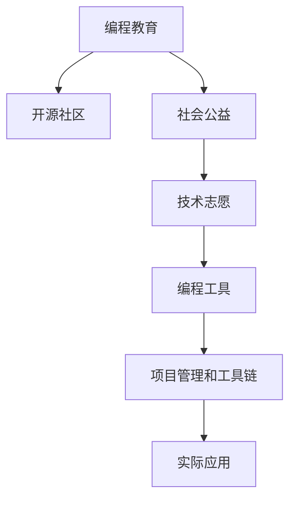

                 

# 如何将编程技能应用于社会公益

在现代社会的众多领域中，编程技能不仅是一种技术，更是一种强大的社会工具。随着计算机技术的普及和应用领域的不断扩展，编程技能正在被广泛应用于解决社会问题、推动社会公益的各个层面。本文旨在深入探讨如何将编程技能有效地应用于社会公益，通过具体的实践案例和技术分析，揭示编程如何成为推动社会进步的重要力量。

## 1. 背景介绍

### 1.1 问题由来

随着全球信息化进程的加速，计算机和互联网技术已经成为社会基础设施的重要组成部分。编程技能作为掌握这些技术的核心能力，其应用范围已经远远超出了传统的IT行业，触及到了教育、医疗、环境、社会服务等多个领域。特别是随着人工智能、大数据、区块链等前沿技术的崛起，编程技能在解决复杂社会问题、提升社会治理能力、推动社会公益等方面的潜力日益显现。

然而，编程技能的普及与应用并非一帆风顺。一方面，尽管全球范围内编程教育的推广使得越来越多的人掌握了基础的编程能力，但高水平的编程技能仍然集中在少数专业人士手中。另一方面，许多社会公益项目由于技术门槛较高，难以吸引足够的技术志愿者，导致技术资源浪费和技术能力难以充分发挥。

### 1.2 问题核心关键点

将编程技能应用于社会公益的核心问题包括：
- **技术普及与门槛**：如何在降低技术门槛的同时，提高编程技能的普及度和应用水平？
- **志愿者动员**：如何吸引更多具备编程技能的人参与到公益项目中，发挥其技术专长？
- **项目设计与实施**：如何设计有效的编程项目，确保其能够切实解决社会问题，并产生实际的社会影响？
- **持续性与影响力**：如何保证编程项目的持续运营，并确保其长期的社会影响力？

## 2. 核心概念与联系

### 2.1 核心概念概述

为更好地理解如何将编程技能应用于社会公益，本节将介绍几个密切相关的核心概念：

- **编程教育**：通过系统化的教学和学习，培养学生编程思维和实际编程能力的过程。
- **开源社区**：基于共享、协作的原则，由编程爱好者和专业人士组成的在线社区，促进编程技术的交流和创新。
- **社会公益**：以改善社会福祉、解决社会问题为目标，通过各种形式的社会服务活动，提升公众生活质量和幸福感。
- **技术志愿**：编程专业人士利用自己的技术专长，志愿参与社会公益项目，为解决社会问题贡献力量。
- **编程工具**：用于编程开发的各种软件、平台和库，如IDE、版本控制系统、协作工具等，极大地提高了编程效率和协作能力。
- **项目管理和工具链**：用于软件项目管理和开发的工具链，如项目管理软件、测试工具、部署工具等，保证项目的顺利实施和持续运营。

这些概念之间的逻辑关系可以通过以下Mermaid流程图来展示：



这个流程图展示了几大核心概念及其之间的关系：

1. 编程教育通过培养编程技能，为开源社区和技术志愿提供人才支持。
2. 开源社区提供了技术交流和协作的平台，促进了编程技能的提升和公益项目的创新。
3. 社会公益是编程技能应用的具体目标，通过技术志愿和技术工具的介入，实现社会价值的最大化。
4. 编程工具和技术管理工具链保障了公益项目的顺利实施和持续运营。
5. 实际应用是技术志愿与公益项目的结合点，是编程技能转化为社会影响力的关键环节。

这些概念共同构成了将编程技能应用于社会公益的框架，提供了从教育、协作到项目实施的全方位支持。

## 3. 核心算法原理 & 具体操作步骤
### 3.1 算法原理概述

将编程技能应用于社会公益的核心算法可以抽象为以下几个步骤：

1. **需求分析**：确定项目目标和需求，明确需要解决的实际问题。
2. **需求匹配**：将项目需求与编程技能进行匹配，确定适合的编程技术和工具。
3. **技术方案设计**：设计实现项目需求的技术方案，包括项目架构、模块划分、技术栈选择等。
4. **代码实现**：根据技术方案进行代码编写和测试，确保项目功能符合需求。
5. **项目部署与维护**：将项目部署到目标环境中，并持续维护和优化，确保项目长期稳定运行。
6. **社会影响评估**：对项目的社会影响进行评估，总结经验和教训，为未来的项目提供参考。

### 3.2 算法步骤详解

**步骤 1: 需求分析**

需求分析是项目成功的基础。在进行公益项目时，需要深入了解目标群体和社会问题，明确项目的具体目标和需求。例如，针对农村地区教育资源不足的问题，可以通过编程技能开发在线教育平台，提供丰富的学习资源和互动教学工具。

**步骤 2: 需求匹配**

根据需求分析结果，选择适合的编程技术和工具。例如，对于实时数据分析项目，可以选择Python和TensorFlow等技术；对于用户交互较多的项目，可以选择React和Node.js等前端技术。

**步骤 3: 技术方案设计**

设计详细的功能和技术方案，包括系统架构、模块划分、数据流程等。这一步骤需要结合具体的技术栈和工具，确保方案的可行性和可维护性。例如，可以使用微服务架构，提高系统的可扩展性和可靠性。

**步骤 4: 代码实现**

根据技术方案进行代码编写，确保代码质量。这一步骤需要遵循编码规范，进行单元测试和集成测试，确保代码的稳定性和可靠性。可以使用版本控制系统如Git进行代码管理和协作。

**步骤 5: 项目部署与维护**

将项目部署到目标环境中，进行上线和测试。项目上线后，需要持续维护和优化，确保系统稳定运行。可以使用CI/CD工具链，自动完成代码构建、测试和部署，提高项目实施效率。

**步骤 6: 社会影响评估**

对项目的社会影响进行评估，总结经验和教训。可以通过问卷调查、用户反馈等方式，了解项目的效果和用户满意度。根据评估结果，进行后续的优化和改进。

### 3.3 算法优缺点

将编程技能应用于社会公益的算法具有以下优点：
1. **效率高**：编程技能可以迅速解决问题，提升公益项目的实施效率。
2. **灵活性高**：编程技术具有高度灵活性，可以根据实际需求进行调整和优化。
3. **成本低**：相比于传统的公益项目，使用编程技术可以显著降低人力、时间和资金成本。
4. **可扩展性好**：编程技术易于扩展，可以在原有基础上进行功能升级和模块更新。

同时，该算法也存在一些局限性：
1. **技术门槛高**：需要具备一定的编程知识和技术能力，对技术志愿者的要求较高。
2. **项目管理复杂**：公益项目的复杂性和不确定性增加了项目管理的难度。
3. **社会影响难以评估**：公益项目的效果受到多种因素影响，难以进行全面评估。

尽管存在这些局限性，但通过合理设计和管理，这些算法能够有效地将编程技能转化为社会公益的价值。

### 3.4 算法应用领域

将编程技能应用于社会公益的方法在多个领域得到了广泛的应用，例如：

- **教育领域**：开发在线教育平台、互动教学工具、教育数据分析系统等，提升教育资源的可及性和教育质量。
- **医疗领域**：开发医疗信息管理系统、患者互动平台、医疗数据分析系统等，提高医疗服务的效率和质量。
- **环境保护**：开发环境监测系统、智能能源管理平台、环保数据分析系统等，推动环境治理和可持续发展。
- **社会服务**：开发社区服务平台、志愿者管理系统、应急响应系统等，提升社会服务的效率和覆盖范围。

除了上述这些经典领域外，编程技能还被创新性地应用到更多社会公益项目中，如灾害预警、灾难救助、文化保护等，为社会公益事业提供了新的技术和解决方案。

## 4. 数学模型和公式 & 详细讲解 & 举例说明
### 4.1 数学模型构建

假设公益项目的目标为通过编程技能提升某项社会服务的能力，记该项目为 $S$，其实施效果为 $E$，社会影响为 $I$。模型如下：

$$
E = f(S) \quad \text{和} \quad I = g(E)
$$

其中 $f$ 和 $g$ 分别为函数，分别表示项目实施效果和项目对社会的实际影响。

### 4.2 公式推导过程

对于给定的项目 $S$，其具体实施效果 $E$ 可以通过编程技能的综合应用进行计算，如：

$$
E = \sum_{i=1}^n w_i E_i
$$

其中 $w_i$ 为第 $i$ 项任务的权重，$E_i$ 为该任务的实施效果。

根据 $E$，可以进一步计算项目对社会的实际影响 $I$：

$$
I = \phi(E)
$$

其中 $\phi$ 为函数，将实施效果映射为社会影响。

### 4.3 案例分析与讲解

以“AI for Good”项目为例，该项目旨在通过AI技术解决全球性社会问题。其数学模型如下：

$$
E = f(S) = w_1 \times E_1 + w_2 \times E_2 + \cdots + w_n \times E_n
$$

其中 $S$ 包括数据分析、模型训练、系统集成等任务，$E_i$ 为每个任务的实施效果。例如，数据分析任务的效果可以通过数据处理时间、数据质量、模型准确率等指标进行评估。

根据 $E$，可以计算项目对社会的实际影响 $I$：

$$
I = g(E) = \phi(E)
$$

例如，数据分析结果可以用于改进社会服务，提升医疗服务效率、教育资源配置等。根据数据分析结果，可以进一步优化项目策略，提升项目的长期社会影响。

## 5. 项目实践：代码实例和详细解释说明
### 5.1 开发环境搭建

在进行编程技能应用于社会公益的项目实践前，我们需要准备好开发环境。以下是使用Python进行Django开发的环境配置流程：

1. 安装Anaconda：从官网下载并安装Anaconda，用于创建独立的Python环境。

2. 创建并激活虚拟环境：
```bash
conda create -n django-env python=3.8 
conda activate django-env
```

3. 安装Django：从官网获取并安装Django框架，确保版本为3.2.8。
```bash
pip install django==3.2.8
```

4. 安装各类工具包：
```bash
pip install numpy pandas scikit-learn matplotlib tqdm jupyter notebook ipython
```

完成上述步骤后，即可在`django-env`环境中开始项目实践。

### 5.2 源代码详细实现

下面我们以开发一个基于Django的在线教育平台为例，给出使用Python进行编程技能应用于教育领域的具体代码实现。

首先，定义Django项目的settings文件：

```python
# settings.py
INSTALLED_APPS = [
    'django.contrib.admin',
    'django.contrib.auth',
    'django.contrib.contenttypes',
    'django.contrib.sessions',
    'django.contrib.messages',
    'django.contrib.staticfiles',
    # 添加自定义应用
    'courses',
    'users',
]
```

然后，创建和配置Django应用：

```python
# courses/views.py
from django.shortcuts import render, redirect
from .models import Course
from .forms import CourseForm

def course_list(request):
    courses = Course.objects.all()
    return render(request, 'courses/course_list.html', {'courses': courses})

def course_detail(request, pk):
    course = get_object_or_404(Course, pk=pk)
    return render(request, 'courses/course_detail.html', {'course': course})

def create_course(request):
    if request.method == 'POST':
        form = CourseForm(request.POST)
        if form.is_valid():
            form.save()
            return redirect('course_list')
    else:
        form = CourseForm()
    return render(request, 'courses/create_course.html', {'form': form})

def update_course(request, pk):
    course = get_object_or_404(Course, pk=pk)
    if request.method == 'POST':
        form = CourseForm(request.POST, instance=course)
        if form.is_valid():
            form.save()
            return redirect('course_detail', pk=course.pk)
    else:
        form = CourseForm(instance=course)
    return render(request, 'courses/update_course.html', {'form': form})

# users/views.py
from django.shortcuts import render, redirect
from django.contrib.auth import login, authenticate
from django.contrib.auth.forms import UserCreationForm
from django.contrib.auth.decorators import login_required
from django.contrib.auth.mixins import LoginRequiredMixin

@login_required
def dashboard(request):
    courses = Course.objects.all()
    return render(request, 'users/dashboard.html', {'courses': courses})

def signup(request):
    if request.method == 'POST':
        form = UserCreationForm(request.POST)
        if form.is_valid():
            form.save()
            username = form.cleaned_data.get('username')
            raw_password = form.cleaned_data.get('password1')
            user = authenticate(username=username, password=raw_password)
            login(request, user)
            return redirect('dashboard')
    else:
        form = UserCreationForm()
    return render(request, 'users/signup.html', {'form': form})
```

接着，定义Django应用的模型和表单：

```python
# courses/models.py
from django.db import models

class Course(models.Model):
    title = models.CharField(max_length=255)
    description = models.TextField()
    start_date = models.DateField()
    end_date = models.DateField()
    instructor = models.ForeignKey('auth.User', on_delete=models.CASCADE)

# courses/forms.py
from django import forms
from .models import Course

class CourseForm(forms.ModelForm):
    class Meta:
        model = Course
        fields = ['title', 'description', 'start_date', 'end_date', 'instructor']
```

最后，启动Django项目并运行服务器：

```bash
python manage.py runserver
```

在浏览器中访问http://127.0.0.1:8000，即可访问在线教育平台的前端界面。

### 5.3 代码解读与分析

让我们再详细解读一下关键代码的实现细节：

**settings.py文件**：
- `INSTALLED_APPS`列表包含了所有应用的名称，用于Django框架的配置。

**views.py文件**：
- `course_list`、`course_detail`、`create_course`、`update_course`函数分别处理课程列表、课程详情、创建课程、更新课程的逻辑。
- `signup`和`dashboard`函数分别处理用户注册和登录功能。

**models.py文件**：
- `Course`模型定义了课程的基本信息，包括标题、描述、开始和结束日期、授课教师等属性。

**forms.py文件**：
- `CourseForm`表单用于接收用户提交的课程信息，并将其保存到数据库中。

**启动服务器命令**：
- 使用`python manage.py runserver`命令启动Django开发服务器，在默认端口8000上运行。

通过上述代码实现，我们可以看到，使用Django框架可以快速构建一个基于编程技能的在线教育平台。Django提供了强大的模型-视图-控制器(MVC)框架，简化了Web应用的开发过程。

## 6. 实际应用场景
### 6.1 教育领域

编程技能在教育领域的应用最为广泛。通过编程教育和技术工具的结合，可以提升教育资源的可及性和教育质量。例如：

- **在线教育平台**：开发在线教育平台，提供丰富的课程资源和互动教学工具，使偏远地区的学生也能享受到高质量的教育。
- **教育数据分析**：使用大数据和AI技术，分析学生的学习行为和成绩，提供个性化推荐和教学改进建议，提升教育效果。
- **虚拟实验室**：开发虚拟实验室，让学生在虚拟环境中进行实验操作，提高实验效率和安全性。

### 6.2 医疗领域

在医疗领域，编程技能也可以发挥重要作用。通过医疗信息管理系统和数据分析，可以提升医疗服务的效率和质量。例如：

- **医疗信息管理系统**：开发医疗信息管理系统，管理病人的基本信息、诊断记录、治疗方案等，提升医院的管理效率。
- **患者互动平台**：开发患者互动平台，提供在线咨询、预约挂号、远程医疗等服务，提高患者的医疗体验。
- **医疗数据分析**：使用数据分析技术，分析医疗数据，发现疾病趋势和风险因素，指导临床决策。

### 6.3 环境保护

编程技能在环境保护领域的应用同样重要。通过环境监测系统和大数据分析，可以推动环境保护和可持续发展。例如：

- **环境监测系统**：开发环境监测系统，实时监测空气质量、水质、土壤污染等指标，提供环境保护预警。
- **智能能源管理**：开发智能能源管理系统，优化能源使用，降低能耗和碳排放。
- **环保数据分析**：使用数据分析技术，分析环境数据，发现环境问题，制定环境保护策略。

### 6.4 未来应用展望

随着编程技能的普及和技术的不断进步，基于编程技能的社会公益项目将在更多领域得到应用。未来的应用方向包括：

- **智能城市治理**：开发智能城市治理平台，提升城市管理的自动化和智能化水平。
- **社会问题预测**：使用机器学习和数据分析技术，预测社会问题，制定预防措施，提升社会治理能力。
- **灾害预警**：开发灾害预警系统，提供实时灾害监测和预警服务，保障公共安全。

## 7. 工具和资源推荐
### 7.1 学习资源推荐

为了帮助开发者系统掌握编程技能在社会公益中的应用，这里推荐一些优质的学习资源：

1. **Django官方文档**：Django官方文档提供了详细的教程和示例，是学习Django开发的最佳资源。
2. **Python编程指南**：《Python编程：从入门到实践》一书，全面介绍了Python编程语言的基础知识和应用实例。
3. **开源社区资源**：GitHub、Stack Overflow等开源社区，提供了大量的项目代码和问题解答，是编程技能学习的宝贵资源。
4. **在线教育平台**：Coursera、Udemy等在线教育平台，提供了丰富的编程技能课程和实战项目，适合系统学习和实践。
5. **编程教育平台**：Codecademy、LeetCode等编程教育平台，提供互动式编程学习，适合初学者入门。

通过对这些资源的学习实践，相信你一定能够快速掌握编程技能在社会公益中的应用。

### 7.2 开发工具推荐

高效的开发离不开优秀的工具支持。以下是几款用于编程技能应用于社会公益开发的常用工具：

1. **Django框架**：用于开发Web应用和Web服务，提供了强大的MVC框架和丰富的插件，适合快速构建应用程序。
2. **TensorFlow和PyTorch**：用于机器学习和深度学习任务，提供了强大的计算图和模型训练功能，适合数据密集型应用。
3. **Git版本控制系统**：用于版本控制和协作开发，支持分支管理、代码合并等功能，提高了开发效率。
4. **JIRA项目管理工具**：用于项目管理，提供了任务分配、进度跟踪、问题管理等功能，适合复杂项目的协作开发。
5. **Slack通信工具**：用于团队协作，提供了实时消息、文件共享、应用集成等功能，提高了团队的沟通效率。

合理利用这些工具，可以显著提升编程技能应用于社会公益的开发效率，加快创新迭代的步伐。

### 7.3 相关论文推荐

编程技能在社会公益领域的研究源于学界的持续研究。以下是几篇奠基性的相关论文，推荐阅读：

1. **"Programming to Learn Programming"**：指出编程教育的重要性和实际应用，强调通过编程学习编程，提升学生的编程能力和思维能力。
2. **"Open Source and Collaboration in Software Development"**：研究开源社区的发展及其对软件开发的贡献，探讨开源社区的协作机制和最佳实践。
3. **"AI for Good: A Review of AI Applications in Social Impact"**：综述了AI技术在社会公益领域的应用，探讨了AI技术的社会影响和未来发展方向。
4. **"Machine Learning for Social Good"**：探讨了机器学习在社会公益领域的应用，分析了机器学习的优势和挑战。

这些论文代表了大规模语言模型微调技术的发展脉络。通过学习这些前沿成果，可以帮助研究者把握学科前进方向，激发更多的创新灵感。

## 8. 总结：未来发展趋势与挑战

### 8.1 总结

本文对如何将编程技能应用于社会公益进行了全面系统的介绍。首先阐述了编程技能在社会公益中的重要性和应用前景，明确了将编程技能转化为社会公益价值的关键步骤和方法。其次，从原理到实践，详细讲解了编程技能在教育、医疗、环境保护等领域的应用实例，展示了编程技能在解决社会问题方面的巨大潜力。最后，本文还精选了编程技能应用于社会公益的学习资源、开发工具和相关论文，力求为读者提供全方位的技术指引。

通过本文的系统梳理，可以看到，编程技能在社会公益中的应用前景广阔，有望通过技术手段解决一系列复杂社会问题，提升社会福祉和治理能力。未来，随着编程技能和技术的不断进步，基于编程技能的社会公益项目将进一步扩展，为社会进步提供强大的动力。

### 8.2 未来发展趋势

展望未来，编程技能在社会公益中的应用将呈现以下几个发展趋势：

1. **技术普及率提升**：随着编程教育的推广和技术门槛的降低，越来越多的人将掌握编程技能，编程技能在社会公益项目中的应用将更加普及。
2. **跨领域融合**：编程技能将与其他技术如AI、大数据、区块链等进行更广泛的融合，形成更强大的技术能力，解决更多社会问题。
3. **开源社区协作**：开源社区将发挥更大的作用，促进编程技能在社会公益项目中的分享和合作，提升项目实施效率和质量。
4. **社会影响力增强**：基于编程技能的社会公益项目将更具规模和影响，通过技术手段解决更多社会问题，提升公众生活质量和幸福感。
5. **持续优化和迭代**：编程技能应用于社会公益的项目将持续优化和迭代，不断提高项目的实施效果和社会影响力。

### 8.3 面临的挑战

尽管编程技能在社会公益中的应用前景广阔，但在实际操作中，还面临一些挑战：

1. **技术普及门槛**：虽然编程教育在不断普及，但仍存在技术门槛较高的问题，难以吸引更多技术志愿者参与。
2. **项目管理复杂**：公益项目的技术和管理复杂性较高，需要系统化的项目管理手段。
3. **资源和资金限制**：公益项目的技术实施需要一定的资源和资金支持，对于小规模项目尤其困难。
4. **社会影响评估**：公益项目的效果难以全面评估，需要建立有效的评估机制。
5. **伦理和安全问题**：公益项目的技术应用可能涉及隐私和数据安全问题，需要严格的伦理和安全保障。

### 8.4 研究展望

面对编程技能应用于社会公益所面临的挑战，未来的研究需要在以下几个方面寻求新的突破：

1. **降低技术门槛**：通过编程教育的推广和工具的简化，降低技术应用门槛，吸引更多技术志愿者参与。
2. **提高项目效率**：利用开源社区和协作工具，提高公益项目的实施效率，降低项目管理和实施成本。
3. **提升社会影响**：建立有效的社会影响评估机制，确保公益项目产生实际的社会价值。
4. **保障数据安全**：建立数据安全和隐私保障机制，确保公益项目的技术应用符合伦理和安全要求。
5. **持续优化和迭代**：利用数据驱动和反馈机制，持续优化和迭代公益项目，提升项目的实施效果和社会影响力。

这些研究方向和突破点，将为编程技能在社会公益领域的应用提供更广阔的空间和更坚实的保障，为构建更加公正、和谐、可持续的社会提供技术支持。

## 9. 附录：常见问题与解答

**Q1：编程技能在社会公益中的作用是什么？**

A: 编程技能在社会公益中的作用主要包括：
- **提升资源可及性**：通过在线教育平台、虚拟实验室等技术手段，提升教育、医疗、环境保护等资源的可及性。
- **优化服务效率**：使用数据分析、智能管理系统等技术，优化服务流程，提升服务效率。
- **预测和预警**：利用机器学习和数据分析技术，预测社会问题，提供实时预警，提升社会治理能力。

**Q2：如何降低编程技能在公益项目中的应用门槛？**

A: 降低编程技能在公益项目中的应用门槛，可以从以下几个方面入手：
- **编程教育普及**：推广编程教育，使更多人掌握基本的编程技能，降低技术应用门槛。
- **工具和框架简化**：使用简单易用的开发工具和框架，降低开发难度，提高项目实施效率。
- **社区协作**：利用开源社区和协作平台，分享和复用代码，降低项目开发和维护成本。
- **自动化和脚本化**：使用自动化工具和脚本化方法，减少手动操作，提高项目实施效率。

**Q3：公益项目的技术实现过程中需要注意哪些问题？**

A: 公益项目的技术实现过程中需要注意以下几个问题：
- **需求分析**：明确项目目标和需求，确保项目设计符合实际需求。
- **技术方案设计**：选择合适的技术栈和工具，设计合理的技术方案，确保项目的可行性和可维护性。
- **代码质量控制**：确保代码质量，进行单元测试和集成测试，保证项目的稳定性和可靠性。
- **持续优化和迭代**：根据项目反馈和评估结果，持续优化和迭代项目，提高项目的实施效果。

**Q4：公益项目的社会影响如何评估？**

A: 公益项目的社会影响评估可以从以下几个方面进行：
- **问卷调查**：通过问卷调查，了解用户对项目的使用体验和满意度。
- **数据分析**：利用数据分析技术，分析项目实施效果，评估项目对社会的影响。
- **专家评估**：邀请领域专家，对项目的效果和影响进行评估，提供专业意见和建议。
- **社会监督**：建立社会监督机制，公开项目的实施效果和影响，接受公众的监督和反馈。

**Q5：如何保障公益项目的数据安全和隐私？**

A: 保障公益项目的数据安全和隐私，可以从以下几个方面进行：
- **数据加密**：对敏感数据进行加密处理，保护数据安全。
- **权限控制**：严格控制数据的访问权限，确保数据仅在授权范围内使用。
- **匿名化处理**：对数据进行匿名化处理，保护用户隐私。
- **合规审查**：遵守相关法律法规，确保数据使用的合法性和合规性。

这些问题的答案，为编程技能在社会公益领域的应用提供了实用的指导，帮助开发者更好地设计和实施项目，实现技术赋能社会。

---

作者：禅与计算机程序设计艺术 / Zen and the Art of Computer Programming

