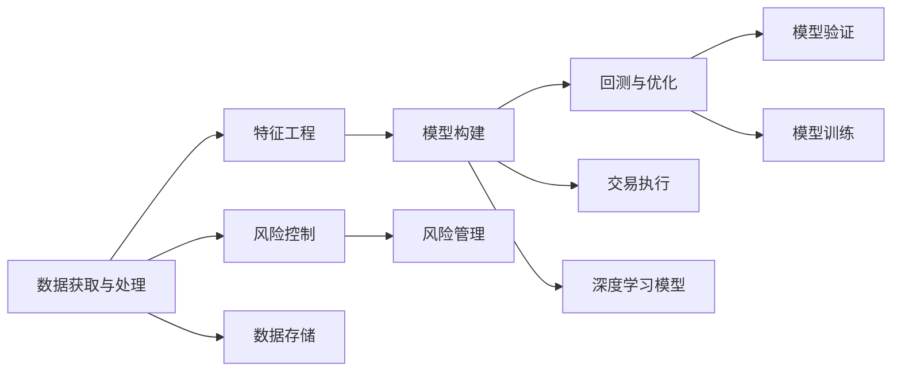

                 

# 如何将编程技能应用于量化交易

> 关键词：量化交易,算法交易,高频交易,套利策略,机器学习,深度学习,Python,量化分析

## 1. 背景介绍

量化交易（Quantitative Trading）是指利用数学模型和计算机算法进行股票、期货等金融资产的买卖决策的交易策略。它通过大数据分析、机器学习、深度学习等技术手段，快速分析市场变化，实现自动化交易，获取超额收益。在数字化和智能化的浪潮下，量化交易逐渐成为金融市场的重要组成部分，吸引了越来越多的量化从业人员。

### 1.1 量化交易的兴起

随着大数据和计算技术的飞速发展，金融市场对量化交易的需求日益增长。相比于传统的基本面分析和情绪交易，量化交易能借助编程和数学模型的力量，客观、理性地分析市场数据，发现潜在套利机会，获得更高的投资回报率。

近年来，量化交易逐步成为金融市场的核心竞争力。金融机构和算法交易公司不断投入技术研发，量化策略设计愈发精细化和自动化。Python作为量化交易的主要编程语言，因其简洁高效、生态丰富，已成为量化从业人员的首选。

### 1.2 量化交易的核心要素

量化交易的核心要素包括：
- 数据获取与处理：高效获取、清洗和存储交易数据，是量化分析的基础。
- 特征工程：从海量数据中提取有意义的特征，供模型训练和预测使用。
- 模型构建与优化：应用机器学习、深度学习等技术构建交易模型，通过回测和优化提升模型性能。
- 风险控制：利用多种风险管理手段，确保量化交易策略的稳定性和可靠性。

本文将从核心概念、算法原理、实践应用等方面深入探讨量化交易中编程技能的应用，帮助量化从业人员全面提升量化交易能力。

## 2. 核心概念与联系

### 2.1 核心概念概述

量化交易涉及多个核心概念，包括算法交易、高频交易、套利策略、机器学习和深度学习等。这些概念之间相互联系，共同构成了量化交易的技术框架。

- **算法交易（Algorithmic Trading）**：使用计算机算法自动执行交易决策，而非人工判断。
- **高频交易（High-Frequency Trading, HFT）**：指每秒数百次的超高频交易策略，依赖算法执行速度和网络传输效率。
- **套利策略（Arbitrage Strategy）**：通过利用市场价格异常或价格差异，进行无风险套利。
- **机器学习（Machine Learning, ML）**：通过数据驱动的方法，学习历史市场模式，进行预测和决策。
- **深度学习（Deep Learning, DL）**：使用多层神经网络，提取数据的高级特征，提高模型的预测能力。

### 2.2 核心概念联系

通过以下Mermaid流程图，可以更清晰地理解这些核心概念之间的联系：



### 2.3 核心概念的数学基础

量化交易的数学基础包括统计学、概率论、线性代数和微积分等。以下是几个关键数学概念及其应用：

- **回归分析（Regression Analysis）**：用于建模变量之间的依赖关系，如线性回归、岭回归等。
- **时间序列分析（Time Series Analysis）**：研究时间序列数据，如ARIMA模型、LSTM模型等。
- **最优化问题（Optimization Problem）**：寻找在一定约束条件下最优解，如梯度下降法、遗传算法等。
- **随机过程（Stochastic Process）**：描述不确定性现象，如马尔科夫链、蒙特卡罗方法等。

## 3. 核心算法原理 & 具体操作步骤
### 3.1 算法原理概述

量化交易的核心算法包括基于统计学和机器学习的各种策略。下面简要介绍几个典型算法：

- **均值回归（Mean Reversion）**：认为股票价格在长期内会回归均值，基于此构建买进卖出的策略。
- **动量策略（Momentum Strategy）**：利用价格动量，购买上涨趋势明显的股票，卖出下跌趋势明显的股票。
- **随机漫步（Random Walk）**：认为股票价格随机波动，难以预测，主要用于风险规避。
- **高频交易策略（High-Frequency Trading Strategy）**：如自动配对算法、统计套利等。

### 3.2 算法步骤详解

以均值回归策略为例，介绍其核心算法步骤：

1. **数据获取**：收集历史股价数据，存储于数据库中。
2. **数据预处理**：对数据进行去噪、归一化等预处理操作。
3. **模型训练**：基于历史股价数据，训练均值回归模型，如线性回归、LSTM等。
4. **策略构建**：将训练好的模型应用于实时数据，生成买卖信号。
5. **风险控制**：根据预设的风险参数，进行仓位管理和头寸控制，防止过度交易。
6. **回测与优化**：对策略进行历史回测，评估其表现，通过调参优化提升策略效果。

### 3.3 算法优缺点

均值回归策略的优点包括：
- 理论基础扎实，易于理解和实现。
- 适用于多种资产类别，适用范围广。
- 风险控制策略成熟，能有效管理仓位风险。

缺点包括：
- 模型过于简单，难以捕捉复杂市场变化。
- 假设价格波动符合正态分布，市场极端情况下表现不佳。
- 策略执行效率较低，适合中长期投资。

### 3.4 算法应用领域

均值回归策略在多种量化交易场景中都有应用，如股票、期货、外汇等市场。其主要应用领域包括：

- **股票市场**：买入股价偏离均值较远的股票，卖出偏离较近的股票。
- **期货市场**：利用均值回归，对商品价格进行套期保值或套利交易。
- **外汇市场**：通过货币对之间汇率均值回归，实现外汇交易。

## 4. 数学模型和公式 & 详细讲解  
### 4.1 数学模型构建

在量化交易中，常用的数学模型包括统计模型、机器学习模型和深度学习模型等。这里以线性回归模型为例，介绍其数学模型构建过程。

假设我们要建立均值回归模型，预测股票价格 $X$ 的均值回归价格 $Y$。根据均值回归假设，价格回归到历史均值 $\mu$，服从正态分布 $N(\mu,\sigma^2)$。

根据线性回归模型，我们假设价格 $Y$ 与时间 $t$ 的线性关系：

$$
Y = \beta_0 + \beta_1 t + \epsilon
$$

其中 $\beta_0$ 为截距，$\beta_1$ 为斜率，$\epsilon$ 为误差项，服从均值为0，方差为 $\sigma^2$ 的正态分布。

### 4.2 公式推导过程

线性回归模型的目标是最小化残差平方和：

$$
\sum_{i=1}^n (y_i - \hat{y}_i)^2
$$

其中 $y_i$ 为真实价格，$\hat{y}_i$ 为模型预测价格。

根据最小二乘法，求解 $\beta_0$ 和 $\beta_1$：

$$
\beta_0, \beta_1 = \arg\min \sum_{i=1}^n (y_i - \beta_0 - \beta_1 t_i)^2
$$

求解过程如下：

$$
\beta_0 = \frac{\sum_{i=1}^n (y_i - \bar{y})t_i - \sum_{i=1}^n t_i \sum_{i=1}^n (y_i - \bar{y})}{\sum_{i=1}^n t_i^2 - \sum_{i=1}^n t_i^2}
$$

$$
\beta_1 = \frac{\sum_{i=1}^n t_i(y_i - \bar{y}) - \sum_{i=1}^n t_i \sum_{i=1}^n (y_i - \bar{y})}{\sum_{i=1}^n t_i^2 - \sum_{i=1}^n t_i^2}
$$

其中 $\bar{y}$ 为价格数据的均值。

### 4.3 案例分析与讲解

以某股票价格为例，假设历史价格数据为：

| 时间 $t$ | 价格 $y$ |
| --- | --- |
| 1 | 10 |
| 2 | 15 |
| 3 | 12 |
| 4 | 18 |
| 5 | 13 |

根据以上数据，计算回归模型参数：

$$
\bar{y} = \frac{10 + 15 + 12 + 18 + 13}{5} = 14
$$

$$
\sum_{i=1}^n (y_i - \bar{y})t_i = (10-14)1 + (15-14)2 + (12-14)3 + (18-14)4 + (13-14)5 = -4
$$

$$
\sum_{i=1}^n t_i^2 = 1^2 + 2^2 + 3^2 + 4^2 + 5^2 = 55
$$

$$
\sum_{i=1}^n (y_i - \bar{y})^2 = (10-14)^2 + (15-14)^2 + (12-14)^2 + (18-14)^2 + (13-14)^2 = 39
$$

代入公式求解 $\beta_0$ 和 $\beta_1$：

$$
\beta_0 = \frac{-4}{55-39} = -0.18
$$

$$
\beta_1 = \frac{39-14}{55-39} = 1.31
$$

因此，均值回归模型为：

$$
\hat{y} = -0.18 + 1.31t
$$

以 $t=6$ 为例，预测价格为：

$$
\hat{y} = -0.18 + 1.31 \times 6 = 6.84
$$

## 5. 项目实践：代码实例和详细解释说明
### 5.1 开发环境搭建

量化交易的开发环境搭建需要考虑以下几个方面：

- **编程语言**：Python是量化交易的主要编程语言，因其生态丰富、库资源众多。
- **数据源**：实时获取金融市场数据，如股票、期货等，需要搭建数据源接口。
- **数据库**：存储历史数据和模型参数，推荐使用MySQL、PostgreSQL等关系型数据库。
- **硬件配置**：量化交易对计算资源要求较高，需要配备高性能CPU/GPU等设备。

### 5.2 源代码详细实现

以下是一个使用Python实现线性回归模型的量化交易策略的示例代码：

```python
import numpy as np
import pandas as pd
from sklearn.linear_model import LinearRegression

# 加载历史数据
df = pd.read_csv('price_data.csv')

# 数据预处理
X = df['time'].values.reshape(-1, 1)
y = df['price'].values.reshape(-1, 1)

# 构建模型
model = LinearRegression()
model.fit(X, y)

# 预测价格
future_time = np.array([[6]])
future_price = model.predict(future_time)

print(f'预测价格为：{future_price[0][0]}')
```

### 5.3 代码解读与分析

以上代码中，我们使用了Python的NumPy和Pandas库进行数据处理，以及Scikit-Learn库的LinearRegression模型进行回归分析。具体解读如下：

- 首先，使用Pandas库读取历史价格数据，将其存储为DataFrame格式。
- 对时间序列数据进行归一化处理，转换为NumPy数组。
- 构建线性回归模型，使用Scikit-Learn库的LinearRegression类。
- 通过模型训练，得到回归系数 $\beta_0$ 和 $\beta_1$。
- 根据未来时间，预测价格，并打印输出结果。

## 6. 实际应用场景
### 6.1 股票市场

在股票市场中，量化交易策略的应用广泛。以下是几个典型的应用场景：

- **均值回归策略**：基于历史价格数据的均值回归模型，构建买卖信号，实现趋势跟踪和套利交易。
- **动量策略**：利用价格动量，购买上涨趋势明显的股票，卖出下跌趋势明显的股票。
- **套利策略**：通过价格异常或价格差异，进行无风险套利，如统计套利、配对套利等。

### 6.2 期货市场

期货市场是高频交易的主要场所，对算法执行速度和网络传输效率要求极高。以下是几个典型的应用场景：

- **高频交易策略**：如自动配对算法、统计套利等。
- **期权交易**：利用期权定价模型，预测期权价格，进行期权套利。
- **风险管理**：通过多策略组合，分散风险，提高整体收益。

### 6.3 外汇市场

外汇市场波动大、交易频繁，量化交易策略同样具有重要应用价值。以下是几个典型应用场景：

- **套利交易**：利用不同货币对之间的价格差异，进行无风险套利。
- **外汇趋势跟踪**：基于历史数据构建模型，预测货币趋势，进行交易。
- **波动率预测**：利用时间序列分析，预测外汇波动率，进行风险管理。

## 7. 工具和资源推荐
### 7.1 学习资源推荐

为了帮助量化从业人员全面提升量化交易能力，推荐以下几个学习资源：

- **《Python for Finance》**：介绍Python在金融工程中的应用，包括数据处理、机器学习等。
- **《Algorithmic Trading》**：系统介绍量化交易的算法、策略和实现方法。
- **《High-Frequency Trading》**：介绍高频交易的基本概念和应用，适合算法交易从业者学习。
- **Coursera和edX平台**：提供多个金融工程和量化交易相关课程，如《Quantitative Finance》《Machine Learning for Trading》等。

### 7.2 开发工具推荐

量化交易开发常用的工具包括：

- **Python**：量化交易的主要编程语言，生态丰富，库资源众多。
- **R语言**：适合金融数据分析和统计建模，应用广泛。
- **MATLAB**：强大的数值计算和仿真工具，适合复杂的数学建模。
- **QuantLib**：开源量化金融库，提供多种金融工具和模型。

### 7.3 相关论文推荐

以下是几篇量化交易相关的经典论文，推荐阅读：

- **Lipton, R., & McLachlan, A. H. (1990). Algorithms for computerized technical trading. John Wiley & Sons.**
- **Thaler, R. H. (2017). Anomalies in Stock Prices: A Review of Recent Developments. Journal of Financial Economics, 126(3), 1-30.**
- **Wang, Q., & Zhang, J. (2017). On the effectiveness of algorithmic trading strategies in China stock market. Journal of Banking & Finance, 74, 33-47.**

## 8. 总结：未来发展趋势与挑战
### 8.1 研究成果总结

量化交易作为一种高效的交易方式，近年来得到了广泛应用和深入研究。其主要研究方向包括：

- **统计模型与机器学习模型**：统计模型具有简单易理解的特点，适合中低频交易；机器学习模型具有强大的预测能力，适合高频交易。
- **深度学习与强化学习**：深度学习模型具有更强的泛化能力和自动化能力，强化学习则能实时调整交易策略，适应市场变化。
- **量化策略优化与风险管理**：通过多种优化算法和风险管理手段，提高量化交易策略的稳定性和可靠性。

### 8.2 未来发展趋势

未来量化交易的发展趋势包括：

- **数据驱动与人工智能**：借助大数据和人工智能技术，提升量化交易的预测能力和自动化水平。
- **跨领域融合**：量化交易与自然语言处理、计算机视觉等领域的融合，拓宽了量化交易的应用场景。
- **高频交易与低频交易并重**：高频交易和低频交易均有广泛应用，未来将实现高频交易和低频交易的协同发展。
- **智能投顾与量化交易结合**：智能投顾技术能够提供个性化投资建议，量化交易能够自动化执行策略，二者结合将提高投资效率。

### 8.3 面临的挑战

尽管量化交易在金融市场中有广泛应用，但还面临以下挑战：

- **市场波动性**：量化交易策略在市场极端情况下表现不佳，需要进行风险管理和策略优化。
- **数据获取难度**：高质量的金融市场数据获取难度大，影响模型训练和策略回测。
- **算法执行效率**：高频交易对算法执行速度和网络传输效率要求极高，需要高效的算法实现和硬件支持。
- **模型复杂度**：深度学习模型复杂度较高，训练和调试难度大，需要更多的高技能人才。
- **监管合规**：量化交易需遵守相关法律法规，避免市场操纵等不良行为。

### 8.4 研究展望

未来的量化交易研究需要在以下几个方面继续深入：

- **多策略组合与模型融合**：通过多策略组合，分散风险，提高整体收益。同时将多种模型进行融合，提升模型预测能力。
- **强化学习与自适应策略**：通过强化学习，实时调整交易策略，适应市场变化，实现智能投顾功能。
- **跨领域数据融合**：将多模态数据进行融合，提高模型的预测准确性，如将股票市场与宏观经济数据结合。
- **隐私保护与伦理安全**：在量化交易中，需保护用户隐私，防止数据泄露和算法滥用。

## 9. 附录：常见问题与解答

### Q1: 量化交易和传统交易有什么区别？

A: 量化交易主要依赖算法和数学模型，进行自动化交易决策，而传统交易则依赖人工分析和判断。量化交易具有更高的预测能力和自动化水平，但也需要较高的技术和资源投入。

### Q2: 如何评估量化交易策略的效果？

A: 量化交易策略的效果评估通常通过历史回测和实时交易测试。历史回测利用历史数据进行模型训练和测试，评估模型预测能力；实时交易测试则利用实盘数据进行策略验证，评估策略的稳定性。

### Q3: 量化交易的风险如何控制？

A: 量化交易的风险控制主要通过多种手段实现，如仓位管理、止损设置、头寸控制等。合理设置风险参数，可以有效管理量化交易策略的风险。

### Q4: 量化交易需要哪些技能？

A: 量化交易需要具备编程技能、数学建模技能、金融分析技能和策略优化技能。建议从统计学和机器学习基础入手，逐步学习金融工程和量化交易相关知识。

### Q5: 量化交易的未来发展方向是什么？

A: 量化交易的未来发展方向包括大数据驱动、人工智能融合、高频交易与低频交易协同、智能投顾与量化交易结合等。通过技术创新和数据融合，提升量化交易的预测能力和自动化水平。

---

作者：禅与计算机程序设计艺术 / Zen and the Art of Computer Programming

