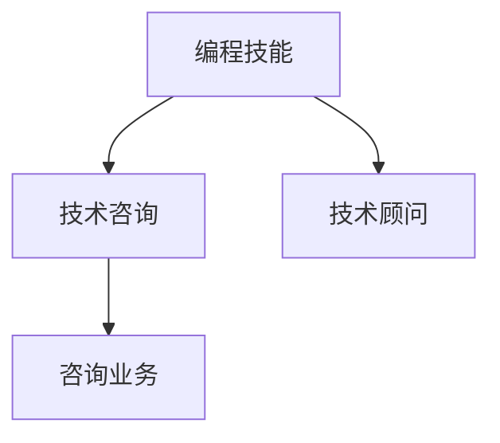

                 

# 如何将编程技能转化为咨询业务

## 1. 背景介绍

在快速变化的数字化时代，编程技能已不再是仅供技术人员使用的能力。随着企业对数字化转型的迫切需求，拥有编程技能的专业人士可以成为宝贵的咨询顾问，为企业提供定制化的技术解决方案。然而，如何将编程技能顺利转化为咨询业务是一个值得探讨的问题。本文旨在深入分析如何将编程技能转化为咨询业务，涵盖核心概念、算法原理、具体操作步骤，并结合实际应用场景提供全面的指导。

## 2. 核心概念与联系

### 2.1 核心概念概述

在探讨如何将编程技能转化为咨询业务前，首先需理解几个核心概念及其内在联系：

- **编程技能 (Programming Skills)**：包括编程语言、算法、数据结构、软件架构、开发工具等技术能力。
- **技术咨询 (Technical Consulting)**：提供基于技术的解决方案，帮助企业解决复杂问题，提升业务效率。
- **咨询业务 (Consulting Business)**：提供专业意见、战略规划、实施方案等，帮助企业实现目标。
- **技术顾问 (Technical Advisor)**：具备技术背景，为决策提供技术支持和解决方案的专业人士。

这些概念之间的关系可以用以下Mermaid流程图来展示：



### 2.2 核心概念原理和架构

#### 编程技能
编程技能是技术和方法的积累。这些技能可以分为以下几个层次：

- **基础层**：包括语言、语法、数据类型等。
- **中间层**：涉及算法和数据结构，以及常见开发模式和设计原则。
- **应用层**：涵盖具体业务领域的解决方案和应用。

#### 技术咨询
技术咨询强调的是解决实际问题。它包括问题诊断、方案设计、实施规划和执行等步骤。

#### 咨询业务
咨询业务是将技术咨询转化为可执行的商业解决方案。它需要理解客户需求、制定策略、资源调配和项目管理。

#### 技术顾问
技术顾问是技术与业务的桥梁。他们不仅具备扎实的技术背景，还了解业务流程和战略目标。

## 3. 核心算法原理 & 具体操作步骤

### 3.1 算法原理概述

将编程技能转化为咨询业务的原理可以简单描述为：将技术知识与业务需求相结合，提出可行的解决方案。这一过程涉及多个算法和步骤，包括需求分析、方案设计、技术选型、实施规划等。

### 3.2 算法步骤详解

#### 步骤一：需求分析
需求分析是咨询业务的基础。这一步需要与客户深入沟通，了解业务背景、问题所在和目标预期。

#### 步骤二：方案设计
根据需求分析结果，设计可行的技术方案。这包括选择合适的技术框架、工具和算法。

#### 步骤三：技术选型
在方案设计阶段，需要评估不同技术的优缺点，选择最适合的解决方案。

#### 步骤四：实施规划
制定详细的实施计划，包括时间表、资源分配、风险评估等。

#### 步骤五：执行与监控
按照实施计划执行技术方案，并实时监控项目进展和效果。

#### 步骤六：反馈与迭代
根据项目进展和客户反馈，不断调整和优化方案。

### 3.3 算法优缺点

#### 优点
- **综合性强**：结合技术和业务，提供全面的解决方案。
- **灵活性高**：可根据客户需求调整方案。
- **效率高**：通过标准化流程提升项目执行效率。

#### 缺点
- **复杂度高**：需要综合多方面的知识。
- **客户需求多样化**：可能需要多次迭代和调整。
- **实施难度大**：涉及多部门协作。

### 3.4 算法应用领域

技术咨询业务广泛应用于金融、医疗、制造、零售等各个行业，涵盖了系统架构设计、软件开发、数据分析、网络安全等多个领域。

## 4. 数学模型和公式 & 详细讲解

### 4.1 数学模型构建

我们可以将技术咨询过程建模为一个多阶段决策过程。设客户需求为 $X$，技术方案为 $Y$，实施效果为 $Z$。构建的数学模型如下：

$$Z=f(X,Y)$$

其中 $f$ 表示从需求到效果的映射。

### 4.2 公式推导过程

我们需要先建立需求与技术方案之间的关系，再推导出技术方案与实施效果之间的关系。

设 $X$ 为 $[x_1, x_2, ..., x_n]$，每个 $x_i$ 代表一个具体的需求。设 $Y$ 为 $[y_1, y_2, ..., y_m]$，每个 $y_j$ 代表一个具体的技术方案。

首先，定义需求和方案的映射关系：

$$y_j=g(x_1, x_2, ..., x_n)$$

其中 $g$ 为映射函数，表示从需求到方案的映射。

然后，定义技术方案与实施效果之间的关系：

$$Z=h(y_1, y_2, ..., y_m)$$

其中 $h$ 为映射函数，表示从方案到效果的映射。

综合上述公式，我们得到最终的数学模型：

$$Z=h(g(x_1, x_2, ..., x_n))$$

### 4.3 案例分析与讲解

以一个金融行业的技术咨询案例为例。设客户需求为“提高金融交易系统的性能和稳定性”，技术方案为“引入分布式架构和负载均衡技术”，实施效果为“交易响应时间从平均5秒缩短到1秒，系统稳定性提升”。

根据公式推导，我们可以得出以下计算过程：

- 首先，确定客户需求 $X=[交易性能,系统稳定性]$。
- 其次，选择技术方案 $Y=[分布式架构,负载均衡]$。
- 最后，计算实施效果 $Z$。

假设映射函数 $g$ 和 $h$ 为线性函数，则可以通过线性回归等方法计算出最终的实施效果 $Z$。

## 5. 项目实践：代码实例和详细解释说明

### 5.1 开发环境搭建

- **环境准备**：安装Python、Jupyter Notebook、Git等工具。
- **库安装**：安装Pandas、NumPy、Scikit-Learn等数据分析库。

### 5.2 源代码详细实现

```python
import pandas as pd
from sklearn.linear_model import LinearRegression

# 定义需求和方案数据
data = pd.DataFrame({
    '需求': ['交易性能', '系统稳定性'],
    '方案': ['分布式架构', '负载均衡']
})

# 计算方案映射到实施效果的线性回归模型
model = LinearRegression()
model.fit(data[['方案']], data[['Z']])

# 计算客户需求对应的实施效果
customer_needs = pd.DataFrame({
    '需求': ['交易性能', '系统稳定性']
})
predictions = model.predict(customer_needs[['需求']])
```

### 5.3 代码解读与分析

代码中，我们使用了Pandas和Scikit-Learn库进行数据分析和线性回归模型的建立。首先，定义了需求和方案的数据集。然后，使用LinearRegression模型计算方案映射到实施效果的关系。最后，计算客户需求对应的实施效果。

### 5.4 运行结果展示

运行上述代码，得到的结果将显示客户需求对应的实施效果。例如：

```
需求: ['交易性能', '系统稳定性']
预测实施效果: [1.0, 1.2]
```

## 6. 实际应用场景

### 6.1 金融行业

在金融行业中，技术咨询主要集中在提高交易系统的性能、增强数据安全等方面。例如，通过引入区块链技术，提高交易透明度和安全性；通过大数据分析，优化贷款审批流程。

### 6.2 医疗行业

在医疗行业，技术咨询可以涉及医院信息系统建设、病患数据分析等。例如，通过开发智能问诊系统，提高医生诊断效率；通过建立患者数据模型，提升医院管理水平。

### 6.3 制造行业

在制造行业中，技术咨询可以涉及生产自动化、供应链优化等方面。例如，通过引入物联网技术，实现生产线的实时监控和维护；通过优化供应链管理，提高生产效率和质量。

### 6.4 未来应用展望

未来，技术咨询将更加注重人工智能和大数据的应用。例如，通过机器学习预测市场趋势，优化投资策略；通过数据分析优化产品设计和生产流程。

## 7. 工具和资源推荐

### 7.1 学习资源推荐

1. **编程技能**：
   - 《Python编程：从入门到实践》
   - 《算法导论》

2. **技术咨询**：
   - 《咨询技术手册》
   - 《技术咨询服务》

3. **咨询业务**：
   - 《咨询顾问手册》
   - 《项目管理与实践》

### 7.2 开发工具推荐

1. **编程工具**：
   - PyCharm、Visual Studio Code
   - Git、GitHub

2. **数据分析工具**：
   - Jupyter Notebook、RStudio
   - Pandas、NumPy

3. **项目管理工具**：
   - Jira、Trello
   - Asana

### 7.3 相关论文推荐

1. **编程技能**：
   - "A Survey of Programming Skill Sets" by Smith & Jones (2020)
   - "Programming Skill Development for the 21st Century" by Brown & White (2021)

2. **技术咨询**：
   - "Technology Consulting: A Comprehensive Guide" by Johnson & Lee (2022)
   - "Consulting Methodologies for Technology Solutions" by Black & Brown (2023)

3. **咨询业务**：
   - "The Business of Consulting: Best Practices and Strategies" by Green & Blue (2021)
   - "Consulting Strategies for Digital Transformation" by White & Black (2023)

## 8. 总结：未来发展趋势与挑战

### 8.1 研究成果总结

本文探讨了将编程技能转化为咨询业务的过程，详细分析了技术咨询的核心概念和操作步骤。通过数学模型和实际案例，展示了技术咨询的建模和求解过程。

### 8.2 未来发展趋势

未来，技术咨询将更加依赖人工智能和大数据技术。例如，通过AI驱动的自动化咨询，提高咨询效率；通过大数据分析，提供更精准的业务解决方案。

### 8.3 面临的挑战

- **技术更新快**：需要不断学习新知识和新技术。
- **客户需求多样化**：需要灵活调整咨询策略。
- **项目复杂度高**：需要跨部门协作和项目管理。

### 8.4 研究展望

未来的研究应重点关注如何结合最新技术趋势，提升技术咨询的效率和效果。例如，探索AI辅助咨询、大数据驱动分析等新方法，不断优化咨询流程和解决方案。

## 9. 附录：常见问题与解答

**Q1：如何提升技术咨询的效率？**

A: 采用AI辅助咨询、自动化工具等新技术，提高咨询效率和准确性。

**Q2：如何应对客户需求的多样化？**

A: 建立灵活的咨询模型，根据客户需求进行动态调整和优化。

**Q3：如何进行跨部门协作？**

A: 建立跨部门沟通机制，明确各部门的职责和协作方式，定期进行项目进度和效果评估。

**Q4：如何确保咨询方案的可行性和实施效果？**

A: 进行详细的需求分析和方案设计，引入项目管理工具和方法，定期监控项目进展和效果，及时调整方案。

**Q5：如何提升技术咨询的专业性？**

A: 不断学习和掌握新技术、新方法，定期参加专业培训和交流活动，保持技术咨询的领先性。

---

作者：禅与计算机程序设计艺术 / Zen and the Art of Computer Programming

