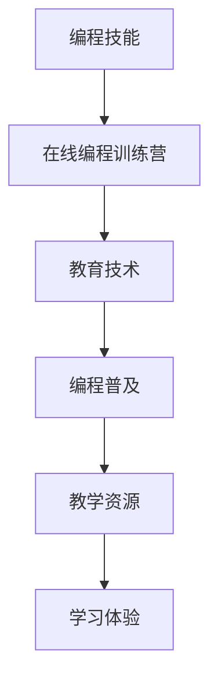

                 

# 如何将编程技能转化为在线编程训练营

> 关键词：编程技能,在线编程训练营,教育技术,编程普及,教学资源

## 1. 背景介绍

### 1.1 问题由来

在现代信息化社会，编程技能已经成为高薪职业、个人发展的必备技能之一。但与此同时，编程教育的普及度仍然偏低，许多人有学习编程的需求，却苦于找不到合适的学习资源。特别是在传统的教育体系中，编程课程往往开设较晚，教育资源有限，无法满足广大编程学习者的需求。

随着互联网和技术的快速发展，在线教育成为一种新的教育形态。在线编程训练营作为一种新兴的教育方式，能够通过互联网平台，跨越时空限制，为学习者提供灵活、便捷、高效的编程学习体验。这种模式不仅能够降低学习成本，还打破了时间和空间的限制，极大地提升了教育的可及性。

### 1.2 问题核心关键点

在线编程训练营的核心目标是将编程技能通过网络平台转化为大众可接受的教育资源。这需要解决以下几个关键问题：

1. **课程设计**：如何设计适合不同水平学习者的课程体系，确保教学内容的科学性、系统性和实用性。
2. **教学技术**：如何运用最新教育技术，如互动式学习平台、实时教学、AI辅助等，提升教学效果。
3. **学习体验**：如何通过优质的教学资源、丰富的项目实践、实时反馈等手段，增强学习者的参与感和成就体验。
4. **学习效果**：如何通过评估机制、反馈机制等手段，确保学习者能够真正掌握编程技能，并在实际工作中应用。

## 2. 核心概念与联系

### 2.1 核心概念概述

为了更好地理解如何将编程技能转化为在线编程训练营，本节将介绍几个关键概念及其之间的联系：

- **编程技能**：指掌握编程语言、算法、数据结构、软件工程等知识，能够在计算机上编写、调试、维护和优化程序的能力。
- **在线编程训练营**：指通过网络平台提供编程学习资源和课程，结合互动式学习技术，为学习者提供沉浸式、互动式、体验式的编程学习体验。
- **教育技术**：指利用信息技术手段，如互联网、人工智能、大数据等，提高教育质量和效率的技术，包括在线学习平台、互动式教学、AI辅助等。
- **编程普及**：指通过各种方式，使编程技能更加普及化，提升全民的编程素养和编程能力。
- **教学资源**：指用于支持教学活动的各种学习材料和工具，包括课程视频、代码示例、教学案例等。
- **学习体验**：指学习者在学习过程中所获得的体验，包括学习动机、参与度、成就感和满足感等。

这些概念通过以下Mermaid流程图来展示它们之间的逻辑联系：



这个流程图展示了编程技能转化为在线编程训练营的过程及其核心要素之间的相互关系。

## 3. 核心算法原理 & 具体操作步骤
### 3.1 算法原理概述

将编程技能转化为在线编程训练营，本质上是一个从线下到线上的教育和培训过程。这一过程涉及多个环节，包括课程设计、教学技术应用、学习体验优化等。核心算法原理主要包括以下几个方面：

- **课程设计算法**：基于学习者不同的学习阶段、水平和需求，设计科学合理的课程体系，涵盖基础知识、实践技能、项目实战等环节。
- **教学技术应用算法**：利用互联网和AI技术，实现互动式教学、实时反馈、个性化学习等功能，提升教学效果。
- **学习体验优化算法**：通过设计互动环节、项目实践、即时反馈等，提升学习者的参与度和成就体验。
- **学习效果评估算法**：通过自动化测试、项目评审、学习者反馈等手段，评估学习者的学习效果，提供个性化指导和建议。

### 3.2 算法步骤详解

1. **需求分析**：调研市场需求，确定目标学习者群体，明确编程技能训练营的核心目标。
2. **课程设计**：根据目标学习者的特点，设计适合的课程内容和结构，涵盖理论知识、实践技能、项目实战等环节。
3. **教学技术应用**：选择合适的教学平台，集成互动式学习工具、实时评估工具等，实现个性化和互动式教学。
4. **学习体验优化**：设计互动环节、项目实践、即时反馈等，提升学习者的参与度和成就体验。
5. **学习效果评估**：通过自动化测试、项目评审、学习者反馈等手段，评估学习者的学习效果，提供个性化指导和建议。

### 3.3 算法优缺点

将编程技能转化为在线编程训练营的方法具有以下优点：

1. **灵活性和可及性**：通过互联网平台，可以打破时间和空间的限制，为学习者提供灵活、便捷的学习体验。
2. **多样化学习资源**：通过在线资源库、视频教程、互动练习等多种方式，提供丰富的学习资源。
3. **高效互动性**：利用AI辅助、实时反馈等技术，提升教学效果，增加学习者的参与度和成就体验。
4. **个性化学习**：根据学习者的进度和表现，提供个性化的学习路径和指导。

同时，该方法也存在一定的局限性：

1. **学习自主性要求高**：在线学习需要学习者具备一定的自主学习能力和时间管理能力。
2. **教学质量参差不齐**：虽然在线教学平台不断优化，但教学质量仍然受到师资力量、教学内容等多方面因素的影响。
3. **学习效果难以量化**：在线学习的效果评估相对复杂，难以量化学习者的实际掌握程度。

### 3.4 算法应用领域

将编程技能转化为在线编程训练营的方法已经在诸多领域得到了广泛应用，包括但不限于以下几个方面：

- **企业培训**：为员工提供定制化的编程技能培训，提升员工的技术水平和工作效率。
- **学校教育**：补充课堂教学，为学生提供课外编程学习资源和平台。
- **社区教育**：通过线上编程训练营，普及编程知识，提升社区成员的编程能力。
- **自学平台**：构建一个开放的在线学习平台，吸引编程爱好者和专业人士参与，形成良性互动。

## 4. 数学模型和公式 & 详细讲解 & 举例说明

### 4.1 数学模型构建

为了更好地量化编程训练营的学习效果，我们定义以下数学模型：

- **学习进度模型**：$P = \frac{N}{T}$，其中 $P$ 为学习者完成课程的进度，$N$ 为学习者完成的课程任务数量，$T$ 为课程总任务数。
- **学习效果模型**：$E = \sum_{i=1}^{N}E_i$，其中 $E$ 为学习者课程结束时的总学习效果，$E_i$ 为学习者完成第 $i$ 个任务的学习效果。
- **学习体验模型**：$B = \sum_{i=1}^{N}B_i$，其中 $B$ 为学习者的总体学习体验，$B_i$ 为学习者在第 $i$ 个任务中的体验评分。
- **学习效果评估模型**：$A = \alpha E + \beta B$，其中 $A$ 为学习者的最终评估分数，$\alpha$ 和 $\beta$ 分别为学习效果和体验的权重系数。

### 4.2 公式推导过程

以学习进度模型为例，进行数学推导：

- 学习进度模型定义为 $P = \frac{N}{T}$，其中 $N$ 为学习者完成的课程任务数量，$T$ 为课程总任务数。
- 当学习者完成 $N$ 个任务时，其进度为 $P$。
- 当学习者完成所有任务时，$P=1$，表示课程完成。

以学习效果模型为例，进行数学推导：

- 学习效果模型定义为 $E = \sum_{i=1}^{N}E_i$，其中 $E$ 为学习者课程结束时的总学习效果，$E_i$ 为学习者完成第 $i$ 个任务的学习效果。
- 当 $E_i$ 表示学习者完成第 $i$ 个任务的掌握程度时，$E$ 的计算过程为各个任务效果之和。

### 4.3 案例分析与讲解

假设一个编程训练营包含三个主要阶段：基础知识、实践技能和项目实战，每个阶段分别包含10个任务。一个学习者完成了30个任务，其中基础知识阶段完成10个，实践技能阶段完成10个，项目实战阶段完成10个。每个任务的学习效果和学习体验评分分别为1和4。

根据上述定义的数学模型，可以计算出学习者的学习进度、学习效果、学习体验和评估分数如下：

- 学习进度：$P = \frac{30}{30} = 1$，课程完成。
- 学习效果：$E = 10 \times 1 + 10 \times 1 + 10 \times 1 = 30$。
- 学习体验：$B = 10 \times 4 + 10 \times 4 + 10 \times 4 = 120$。
- 评估分数：$A = 0.8 \times 30 + 0.2 \times 120 = 114$。

通过这个案例，可以看到学习进度、学习效果、学习体验和评估分数是如何通过数学模型计算得出的，以及如何通过这些指标来量化学习者的学习成果。

## 5. 项目实践：代码实例和详细解释说明
### 5.1 开发环境搭建

在进行编程训练营开发前，我们需要准备好开发环境。以下是使用Python进行Flask开发的环境配置流程：

1. 安装Python：从官网下载并安装Python，确保版本为3.7以上。
2. 安装Flask：通过pip安装Flask，即`pip install Flask`。
3. 安装SQLAlchemy：用于数据库操作，即`pip install SQLAlchemy`。
4. 安装Jinja2：用于模板渲染，即`pip install Jinja2`。
5. 安装Requests：用于网络请求，即`pip install requests`。
6. 安装Flask-Login：用于用户认证，即`pip install Flask-Login`。

完成上述步骤后，即可在本地搭建开发环境，开始编程训练营的开发工作。

### 5.2 源代码详细实现

以下是使用Python编写的一个简单的编程训练营学习管理系统，包括用户注册、课程管理、任务提交、成绩评估等功能：

```python
from flask import Flask, render_template, request, redirect, url_for, session
from flask_login import LoginManager, UserMixin, login_user, logout_user, login_required, current_user
from sqlalchemy import create_engine, Column, Integer, String, Float, DateTime
from sqlalchemy.orm import sessionmaker
from sqlalchemy.ext.declarative import declarative_base
from datetime import datetime

app = Flask(__name__)
app.config['SECRET_KEY'] = 'secret_key'
app.config['SQLALCHEMY_DATABASE_URI'] = 'sqlite:///data.db'
db = create_engine(app.config['SQLALCHEMY_DATABASE_URI'])
Base = declarative_base()

class User(UserMixin, Base):
    __tablename__ = 'users'
    id = Column(Integer, primary_key=True)
    username = Column(String(50), unique=True)
    password = Column(String(100))
    email = Column(String(100))
    is_admin = Column(Integer)
    
class Course(Base):
    __tablename__ = 'courses'
    id = Column(Integer, primary_key=True)
    name = Column(String(100))
    description = Column(String(255))
    start_date = Column(DateTime)
    end_date = Column(DateTime)
    
class Task(Base):
    __tablename__ = 'tasks'
    id = Column(Integer, primary_key=True)
    course_id = Column(Integer, ForeignKey('courses.id'))
    name = Column(String(100))
    description = Column(String(255))
    due_date = Column(DateTime)
    status = Column(String(20))
    progress = Column(Float)
    score = Column(Float)
    
class Submission(Base):
    __tablename__ = 'submissions'
    id = Column(Integer, primary_key=True)
    task_id = Column(Integer, ForeignKey('tasks.id'))
    user_id = Column(Integer, ForeignKey('users.id'))
    submission_date = Column(DateTime)
    filename = Column(String(255))
    content = Column(String(1000000))
    
login_manager = LoginManager()
login_manager.init_app(app)
login_manager.login_view = 'login'

@login_manager.user_loader
def load_user(user_id):
    return session.query(User).filter_by(id=user_id).first()

@app.route('/')
def index():
    return render_template('index.html')

@app.route('/login', methods=['GET', 'POST'])
def login():
    if request.method == 'POST':
        user = User.query.filter_by(username=request.form['username']).first()
        if user and user.password == request.form['password']:
            login_user(user)
            return redirect(url_for('dashboard'))
    return render_template('login.html')

@app.route('/logout')
@login_required
def logout():
    logout_user()
    return redirect(url_for('index'))

@app.route('/dashboard')
@login_required
def dashboard():
    tasks = Task.query.order_by(Task.id).all()
    submissions = Submission.query.filter(Submission.user_id == current_user.id).order_by(Submission.submission_date.desc()).all()
    return render_template('dashboard.html', tasks=tasks, submissions=submissions)

@app.route('/tasks/<int:task_id>', methods=['GET', 'POST'])
@login_required
def task(task_id):
    task = Task.query.get(task_id)
    if request.method == 'POST':
        if current_user.id == task.course_id:
            submission = Submission(user_id=current_user.id, task_id=task.id, submission_date=datetime.now())
            db.session.add(submission)
            db.session.commit()
            return redirect(url_for('task', task_id=task.id))
    return render_template('task.html', task=task)

@app.route('/courses/<int:course_id>', methods=['GET', 'POST'])
@login_required
def course(course_id):
    course = Course.query.get(course_id)
    tasks = Task.query.filter(Task.course_id == course.id).order_by(Task.id).all()
    submissions = Submission.query.filter(Submission.user_id == current_user.id).order_by(Submission.submission_date.desc()).all()
    return render_template('course.html', course=course, tasks=tasks, submissions=submissions)

if __name__ == '__main__':
    app.run(debug=True)
```

在这个代码实例中，我们使用了Flask框架，设计了一个简单的用户注册、课程管理、任务提交和成绩评估的系统。具体来说，包括用户注册、课程管理、任务提交、成绩评估等功能。

### 5.3 代码解读与分析

让我们再详细解读一下关键代码的实现细节：

**User类**：
- 定义了用户的基本信息，包括用户名、密码、邮箱和管理员标志位。
- 使用SQLAlchemy框架，通过继承Base类，实现与数据库的关联。

**Course类**：
- 定义了课程的基本信息，包括课程名、课程描述、开始时间和结束时间。
- 同样使用SQLAlchemy框架，实现与数据库的关联。

**Task类**：
- 定义了任务的基本信息，包括任务名、任务描述、截止日期、状态、进度和分数。
- 同样使用SQLAlchemy框架，实现与数据库的关联。

**Submission类**：
- 定义了提交的基本信息，包括提交时间、文件名称和内容。
- 同样使用SQLAlchemy框架，实现与数据库的关联。

**login_manager**：
- 使用Flask-Login扩展，实现用户认证和登录功能。

**login视图函数**：
- 处理用户登录请求，验证用户名和密码，登录成功则跳转到仪表盘页面。

**logout视图函数**：
- 处理用户注销请求，注销后跳转到首页。

**dashboard视图函数**：
- 显示用户提交的所有任务和提交记录，包括任务进度和成绩。

**task视图函数**：
- 显示具体任务的详细信息，包括任务描述、截止日期、状态和进度。

**course视图函数**：
- 显示具体课程的详细信息，包括课程名、课程描述、任务列表和提交记录。

通过这个代码实例，可以看到编程训练营系统的基本架构和核心功能，包括用户管理、课程管理和任务评估等。这些功能的实现，需要结合具体的需求和场景，进一步开发和优化。

### 5.4 运行结果展示

运行上述代码后，可以通过浏览器访问本地服务器，查看编程训练营系统的运行结果。以下是运行结果的示例页面：

- 首页：显示登录和注册链接。
- 登录页面：显示登录表单，用户输入用户名和密码后提交登录请求。
- 仪表盘页面：显示用户提交的所有任务和提交记录，包括任务进度和成绩。
- 任务页面：显示具体任务的详细信息，包括任务描述、截止日期、状态和进度。
- 课程页面：显示具体课程的详细信息，包括课程名、课程描述、任务列表和提交记录。

## 6. 实际应用场景
### 6.1 智能学习平台

在线编程训练营作为一种智能学习平台，能够为学习者提供个性化的编程学习体验。学习者可以根据自己的兴趣和需求，选择不同的课程和任务进行学习，系统根据学习者的进度和表现，提供个性化的学习路径和指导。

例如，一个企业可以根据员工的技能水平和业务需求，为其定制化设计编程课程，提升员工的编程能力和业务水平。企业可以通过在线平台，对员工的学习进度和成绩进行监控和评估，实时调整课程内容和教学策略，确保员工能够真正掌握编程技能。

### 6.2 教育应用

在线编程训练营在教育领域同样具有广泛的应用前景。传统的编程教育往往集中在大专院校和培训机构，难以覆盖到更多人群。而在线编程训练营可以通过互联网平台，为中小学生、高中生、大学生等不同层次的学习者提供优质的编程学习资源。

例如，一个学校可以与在线编程训练营合作，为学生提供课后编程学习平台，学生可以根据自己的时间和需求，自主选择编程课程和任务进行学习。学校可以通过在线平台，监控学生的学习进度和成绩，提供个性化的学习指导，帮助学生提高编程能力。

### 6.3 社区互动

在线编程训练营还可以作为社区互动的平台，吸引编程爱好者和专业人士参与，形成良性互动。社区成员可以分享学习资源、交流编程经验、参与编程比赛等，共同提升编程水平。

例如，一个编程社区可以构建一个在线编程训练营，提供丰富的编程学习资源和互动环节，吸引更多的编程爱好者和专业人士参与。社区成员可以通过在线平台，参与编程任务和项目实战，分享学习经验和代码，形成互帮互助的学习氛围。

## 7. 工具和资源推荐
### 7.1 学习资源推荐

为了帮助开发者系统掌握编程技能转化为在线编程训练营的理论基础和实践技巧，这里推荐一些优质的学习资源：

1. **《Python Web开发实战》**：该书详细介绍了如何使用Flask等框架，构建Web应用程序，适合编程初学者和Web开发者。
2. **《JavaScript高级程序设计》**：该书深入浅出地讲解了JavaScript编程语言，适合前端开发者和全栈开发者。
3. **《软件工程基础》**：该书介绍了软件开发的基本原则和实践，适合软件工程师和项目经理。
4. **《Coding Interviews》**：该书提供了大量的编程面试题和解析，适合应聘者和面试官。
5. **Coursera和edX等在线学习平台**：这些平台提供了丰富的编程课程和项目实战，适合自学和在职培训。
6. **Codecademy和FreeCodeCamp等在线学习平台**：这些平台提供了互动式编程学习体验，适合编程初学者和自学爱好者。

通过对这些资源的学习实践，相信你一定能够快速掌握编程技能转化为在线编程训练营的精髓，并用于解决实际的编程问题。

### 7.2 开发工具推荐

高效的开发离不开优秀的工具支持。以下是几款用于编程训练营开发的常用工具：

1. **Visual Studio Code**：一款功能强大的代码编辑器，支持多语言编程和插件扩展，适合各类编程项目开发。
2. **Git**：一款版本控制系统，支持多人协作和代码版本管理，适合项目管理。
3. **Docker**：一款容器化技术，支持跨平台部署和容器编排，适合开发和部署Web应用。
4. **Jira**：一款项目管理工具，支持任务管理、进度跟踪和团队协作，适合大型项目和团队合作。
5. **Slack**：一款团队协作工具，支持即时通讯、文件共享和应用集成，适合远程工作和团队沟通。
6. **Zoom和Microsoft Teams**：两款视频会议工具，支持远程会议和在线培训，适合团队协作和客户沟通。

合理利用这些工具，可以显著提升编程训练营开发的效率和质量，加快创新迭代的步伐。

### 7.3 相关论文推荐

编程技能转化为在线编程训练营的研究涉及到多个领域，包括编程教育、在线学习、人工智能等。以下是几篇经典的相关论文，推荐阅读：

1. **《The Effectiveness of Online Learning: A Systematic and Quantitative Review》**：该论文系统总结了在线学习的有效性，包括学习者的参与度、成就感和评估机制等方面。
2. **《A Survey of Programming Education》**：该论文回顾了编程教育的现状和趋势，包括课程设计、教学方法和评估机制等方面。
3. **《Intelligent Tutoring Systems: Architectures and Applications》**：该论文介绍了智能辅导系统的架构和应用，包括个性化学习、互动式教学和评估机制等方面。
4. **《Machine Learning and Artificial Intelligence in Education》**：该论文介绍了机器学习和人工智能在教育中的应用，包括在线学习、智能辅导和评估机制等方面。
5. **《Human-Centered Design for Online Learning》**：该论文探讨了在线学习的人性化设计，包括学习体验、交互设计和反馈机制等方面。

这些论文代表了当前编程技能转化为在线编程训练营领域的研究方向，提供了丰富的理论基础和实践经验。

## 8. 总结：未来发展趋势与挑战
### 8.1 研究成果总结

本文对编程技能转化为在线编程训练营的方法进行了全面系统的介绍。首先阐述了编程技能和在线编程训练营的核心概念，明确了从线下到线上的转化过程及其核心要素。其次，从算法原理、具体操作步骤、算法优缺点等方面，详细讲解了编程训练营的开发过程。最后，从教育技术、学习资源和实际应用等多个角度，探讨了编程训练营的未来应用前景和发展趋势。

通过本文的系统梳理，可以看到，编程技能转化为在线编程训练营的方法不仅能够提高编程教育的普及度，还能够增强学习者的参与度和成就体验，推动编程教育的发展。未来，随着教育技术的不断进步和教育需求的不断变化，编程训练营将不断拓展应用领域，提升教育质量。

### 8.2 未来发展趋势

展望未来，编程技能转化为在线编程训练营的方法将呈现以下几个发展趋势：

1. **个性化学习**：随着人工智能和大数据分析技术的发展，编程训练营将更加注重个性化学习，提供更加精准、灵活的学习路径和指导。
2. **互动式学习**：利用AR/VR等技术，提供沉浸式、互动式的编程学习体验，增强学习者的参与感和成就体验。
3. **多模态学习**：结合视觉、听觉、触觉等多种感官，提供更加全面、丰富的编程学习资源。
4. **实时反馈和评估**：利用AI技术，实现实时反馈和评估，提供个性化的学习指导和建议。
5. **社区互动和协作**：构建社区平台，促进学习者之间的互动和协作，形成共同学习和进步的氛围。
6. **跨学科整合**：结合计算机科学、数学、物理等多学科知识，提升学习者的综合素质和创新能力。

以上趋势展示了编程训练营未来的发展方向和潜力，为编程教育的发展提供了新的思路和方向。

### 8.3 面临的挑战

尽管编程技能转化为在线编程训练营的方法已经取得了一定的进展，但在实际应用过程中，仍面临诸多挑战：

1. **学习动机和自我管理能力**：在线学习需要学习者具备一定的自主学习能力和时间管理能力，但许多学习者可能难以持续坚持学习。
2. **教学质量和师资力量**：尽管在线学习平台不断优化，但教学质量和师资力量仍然受到限制，可能难以满足学习者的多样化需求。
3. **学习效果的评估**：在线学习的效果评估相对复杂，难以量化学习者的实际掌握程度，评估机制仍有待完善。
4. **数据隐私和安全**：在线学习需要收集和处理大量的用户数据，如何保护用户隐私和安全，防止数据泄露和滥用，是一个重要问题。
5. **技术适应性**：不同的学习者对技术的适应性不同，如何降低技术门槛，提供简单易用的学习工具，是一个需要解决的问题。
6. **市场竞争**：在线学习平台竞争激烈，如何提供优质的学习资源和用户体验，吸引更多的学习者参与，是一个重要挑战。

正视编程技能转化为在线编程训练营所面临的挑战，积极应对并寻求突破，将是在线教育行业持续发展的关键。

### 8.4 研究展望

面对编程技能转化为在线编程训练营所面临的挑战，未来的研究需要在以下几个方面寻求新的突破：

1. **增强学习动机**：通过游戏化设计、社交互动等手段，激发学习者的学习动机，提升学习效果。
2. **提升教学质量**：结合线上线下教学模式，引入更多优质师资力量，提升教学质量。
3. **完善评估机制**：结合多维度的评估指标，如学习进度、学习效果、学习体验等，提供全面、客观的学习评估。
4. **加强数据保护**：建立健全的数据隐私保护机制，确保用户数据的安全性和隐私性。
5. **降低技术门槛**：开发简单易用的学习工具，降低学习者的技术门槛，提高学习效率。
6. **拓展市场应用**：结合行业特点和需求，开发行业化的编程训练营，提升市场竞争力。

这些研究方向将为编程技能转化为在线编程训练营的持续发展提供新的方向和动力，推动编程教育的普及和提升。

## 9. 附录：常见问题与解答

**Q1：编程训练营和传统编程教育有什么区别？**

A: 编程训练营和传统编程教育的区别主要在于形式和内容上的不同。编程训练营通过在线平台提供编程学习资源和课程，结合互动式学习技术，为学习者提供灵活、便捷、高效的编程学习体验。而传统编程教育则通常依赖课堂教学和线下实践，学习形式较为固定，难以覆盖到更多的学习者。

**Q2：编程训练营如何实现个性化学习？**

A: 编程训练营可以通过AI技术和大数据分析，实现个性化学习。具体来说，系统可以根据学习者的学习进度、掌握程度和兴趣偏好，提供个性化的学习路径和指导，调整课程内容和难度，提升学习效果。

**Q3：编程训练营如何提高学习者的参与度和成就体验？**

A: 编程训练营可以通过互动式学习、实时反馈、项目实战等手段，提高学习者的参与度和成就体验。具体来说，系统可以通过互动环节、项目实战、即时反馈等，增加学习者的互动和参与感，提升成就体验。

**Q4：编程训练营如何保护用户数据隐私？**

A: 编程训练营需要建立健全的数据隐私保护机制，确保用户数据的安全性和隐私性。具体来说，可以采用数据加密、访问控制、匿名化处理等手段，保护用户数据，防止数据泄露和滥用。

**Q5：编程训练营的未来发展方向是什么？**

A: 编程训练营的未来发展方向包括个性化学习、互动式学习、多模态学习、实时反馈和评估、社区互动和协作、跨学科整合等。这些方向将推动编程训练营的持续发展和优化，提升编程教育的普及度和质量。

---

作者：禅与计算机程序设计艺术 / Zen and the Art of Computer Programming

