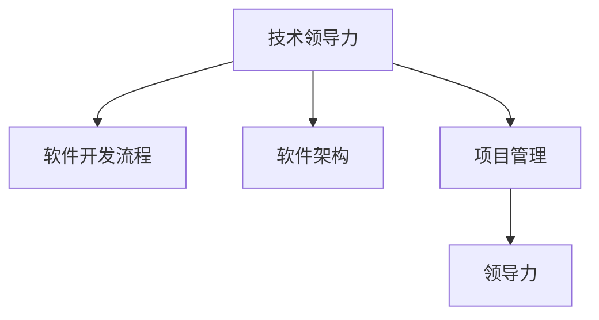

                 

# 如何将编程技能转化为管理能力

## 1. 背景介绍

### 1.1 问题由来

在快速发展的技术时代，许多优秀的程序员因为缺乏管理能力而难以胜任更高级别的职位。这一现象表明，将编程技能转化为管理能力已成为许多IT从业者的当务之急。本文旨在探讨如何将编程技能转化为管理能力，为那些有志于成为高级管理者的IT专业人士提供指导和建议。

### 1.2 问题核心关键点

在将编程技能转化为管理能力的过程中，有几个核心关键点需要注意：

- **技术理解**：理解编程技术和软件开发生命周期的各个阶段，包括需求分析、设计、编码、测试、部署和维护等。
- **项目管理**：掌握项目管理的知识和技能，包括时间管理、资源分配、风险管理和团队协作等。
- **沟通能力**：提升与团队成员、客户和利益相关者之间的沟通能力，确保项目按计划进行。
- **领导能力**：培养领导团队的能力，激励团队成员，确保项目按时、按预算完成。

## 2. 核心概念与联系

### 2.1 核心概念概述

将编程技能转化为管理能力需要理解几个关键概念：

- **技术领导力**：使用技术知识来指导团队，解决技术难题，提高团队效率。
- **软件开发流程**：理解软件开发过程，包括敏捷开发、迭代开发、测试驱动开发等。
- **软件架构**：掌握软件架构设计的基本原则和模式，确保系统可扩展、可维护。
- **项目管理**：了解项目管理的基本知识和工具，如敏捷方法、Scrum、Kanban等。
- **领导力**：培养领导团队的能力，包括激励团队、决策制定、冲突解决等。

这些概念之间的联系可以通过以下Mermaid流程图来展示：



这个流程图展示了大语言模型的核心概念及其之间的关系：

1. 技术领导力是基础，利用技术知识指导团队。
2. 软件开发流程是实现技术领导力的具体实践。
3. 软件架构是确保系统可扩展和可维护的技术基础。
4. 项目管理是实现项目成功的关键。
5. 领导力是确保团队高效协作和项目成功的核心能力。

## 3. 核心算法原理 & 具体操作步骤

### 3.1 算法原理概述

将编程技能转化为管理能力的核心算法原理是结合技术领导力和项目管理技能，利用软件开发流程和软件架构知识，最终实现团队和项目的成功。其核心思想是通过系统化的学习和实践，提升对技术和管理两方面的理解和应用能力。

### 3.2 算法步骤详解

1. **技术领导力提升**：
   - **学习技术基础知识**：深入理解编程语言、框架和工具，熟悉常用的算法和数据结构。
   - **参与实际项目**：在实际项目中应用所学知识，解决技术难题，积累经验。
   - **指导团队**：在团队中分享技术知识，解答技术问题，提高团队的技术水平。

2. **项目管理能力提升**：
   - **学习项目管理知识**：掌握敏捷开发、Scrum、Kanban等项目管理方法。
   - **实践项目管理技能**：在项目中应用项目管理知识，确保项目按时完成。
   - **提升沟通能力**：与团队成员、客户和利益相关者进行有效沟通，确保项目目标明确。

3. **领导能力培养**：
   - **提升个人领导能力**：通过阅读、培训和实践，提升领导能力。
   - **激励团队**：激励团队成员，营造积极的工作氛围。
   - **解决冲突**：处理团队内部的冲突，确保项目顺利进行。

### 3.3 算法优缺点

#### 优点：

- **技术背景**：拥有技术背景的团队领导更易于理解和解决技术问题，提高团队效率。
- **项目管理能力**：掌握项目管理知识，确保项目按时、按预算完成。
- **综合能力**：结合技术和管理能力，提升整体竞争力。

#### 缺点：

- **时间成本**：学习和实践过程中需要投入大量时间。
- **学习曲线**：管理技能的学习曲线可能较陡峭，需要时间和实践积累。
- **文化差异**：在企业文化和价值观不同的团队中，可能需要更多的时间和精力来适应。

### 3.4 算法应用领域

将编程技能转化为管理能力的方法适用于各种规模和类型的软件项目，包括：

- **大型企业项目**：在大型企业中，技术领导和项目管理能力尤为重要，可以确保项目顺利进行。
- **初创企业**：在初创企业中，技术领导力和项目管理能力可以帮助团队快速成长，应对挑战。
- **开源项目**：在开源项目中，技术领导力和项目管理能力可以确保项目的成功和社区的活跃。

## 4. 数学模型和公式 & 详细讲解 & 举例说明

### 4.1 数学模型构建

将编程技能转化为管理能力的数学模型可以表示为：

$$ M = T + P + L $$

其中：
- $M$ 表示管理能力，包括技术领导力、项目管理能力和领导能力。
- $T$ 表示技术领导力。
- $P$ 表示项目管理能力。
- $L$ 表示领导能力。

### 4.2 公式推导过程

通过理解技术领导力、项目管理能力和领导能力的公式，可以推导出整体管理能力的公式。例如：

$$ T = \text{学习} + \text{实践} + \text{指导} $$
$$ P = \text{敏捷} + \text{Scrum} + \text{Kanban} $$
$$ L = \text{激励} + \text{解决冲突} + \text{决策制定} $$

### 4.3 案例分析与讲解

以下是一个实际案例，说明如何将编程技能转化为管理能力：

1. **学习技术基础知识**：张先生是一名经验丰富的程序员，他通过参加各种技术培训和在线课程，掌握了最新的编程语言和框架。
2. **参与实际项目**：张先生加入了一个大型项目团队，承担了技术领导的职责，帮助团队解决技术难题，提高了项目效率。
3. **提升项目管理能力**：张先生学习了敏捷开发和Scrum方法，并成功应用于项目中，确保项目按时完成。
4. **提升领导能力**：张先生通过阅读领导力书籍和参与领导力培训，提升了个人领导能力，成功激励团队，解决了内部的冲突。

## 5. 项目实践：代码实例和详细解释说明

### 5.1 开发环境搭建

要进行将编程技能转化为管理能力的实践，需要以下开发环境：

1. **学习平台**：选择一个在线学习平台，如Coursera、edX、Udacity等，学习技术领导力、项目管理能力和领导力相关课程。
2. **项目管理工具**：选择一个项目管理工具，如JIRA、Trello、Confluence等，用于实践项目管理技能。
3. **沟通平台**：选择一个沟通平台，如Slack、Microsoft Teams等，用于与团队成员、客户和利益相关者进行有效沟通。

### 5.2 源代码详细实现

以下是一个简单的项目管理实践代码实现：

```python
# 导入必要的库
from trello import Trello
from time import sleep

# 创建Trello客户端
api_key = 'your_api_key'
api_secret = 'your_api_secret'
board_id = 'your_board_id'
t = Trello(api_key, api_secret)

# 获取卡片信息
cards = t.get('boards/' + board_id + '/cards')

# 打印卡片信息
for card in cards:
    print(card['name'], card['id'])
```

### 5.3 代码解读与分析

上述代码通过Trello API获取了某个看板下的所有卡片信息，并打印出来。这是一个简单的项目管理实践，可以用于跟踪项目的进度和状态。

### 5.4 运行结果展示

运行上述代码，将输出看板下的所有卡片信息，例如：

```
Card 1: ID1
Card 2: ID2
Card 3: ID3
...
```

## 6. 实际应用场景

### 6.1 软件公司管理

在软件公司中，技术领导力和项目管理能力尤为重要。技术领导可以确保技术团队高效运行，项目管理可以确保项目按时完成，而领导能力则可以激励团队，解决内部冲突。

### 6.2 创业公司

在创业公司中，技术领导力和项目管理能力可以帮助团队快速成长，应对市场变化和技术挑战。领导能力则可以确保团队在高压环境下保持积极的工作状态。

### 6.3 开源社区

在开源社区中，技术领导力和项目管理能力可以确保项目的成功和社区的活跃。领导能力则可以确保社区成员之间的协作和沟通。

## 7. 工具和资源推荐

### 7.1 学习资源推荐

为了帮助读者系统掌握将编程技能转化为管理能力的理论基础和实践技巧，推荐以下学习资源：

1. **《敏捷软件开发：原则、模式与实践》**：这本书详细介绍了敏捷开发的基本概念和实践方法，是学习项目管理技能的重要参考资料。
2. **《影响力》**：这本书讲述了影响力的五大原则，是提升领导能力的重要工具书。
3. **Coursera上的《软件工程原理》课程**：该课程涵盖了软件开发过程的各个方面，包括需求分析、设计、编码、测试、部署和维护等。
4. **edX上的《领导力与组织变革》课程**：该课程详细介绍了领导力的基本概念和应用方法，是提升领导能力的重要学习资源。
5. **Udacity上的《项目管理专业认证》课程**：该课程涵盖了项目管理的基本知识和技能，包括敏捷开发、Scrum、Kanban等。

### 7.2 开发工具推荐

为了提升将编程技能转化为管理能力的学习效率，推荐以下开发工具：

1. **JIRA**：一个流行的项目管理工具，支持敏捷开发和Scrum方法，适合进行项目管理实践。
2. **Confluence**：一个协作文档工具，支持团队成员之间的沟通和知识共享。
3. **Slack**：一个团队沟通工具，支持实时消息传递和视频会议，适合与团队成员和客户进行有效沟通。
4. **Trello**：一个看板工具，支持任务管理和进度跟踪，适合进行项目管理实践。

### 7.3 相关论文推荐

为了深入理解将编程技能转化为管理能力的理论基础，推荐以下相关论文：

1. **《软件开发生命周期中的技术领导力》**：该论文详细探讨了技术领导力在软件开发中的作用和实践方法。
2. **《敏捷项目管理：一种新的软件开发方法》**：该论文介绍了敏捷开发的基本概念和实践方法，是学习项目管理技能的重要参考资料。
3. **《领导力理论与实践》**：该论文介绍了领导力的基本概念和应用方法，是提升领导能力的重要理论基础。

## 8. 总结：未来发展趋势与挑战

### 8.1 研究成果总结

本文探讨了将编程技能转化为管理能力的基本概念和操作步骤，并通过数学模型和实际案例进行了详细讲解。通过系统的学习和实践，读者可以提升技术领导力、项目管理能力和领导能力，实现从程序员到管理者的转变。

### 8.2 未来发展趋势

未来，将编程技能转化为管理能力的方法将进一步发展，呈现以下几个趋势：

1. **自动化管理工具**：随着AI和机器学习技术的发展，自动化管理工具将进一步提升项目管理效率，降低人为错误。
2. **跨领域应用**：将编程技能转化为管理能力的方法不仅适用于软件行业，也将广泛应用于其他领域，如制造业、医疗保健等。
3. **持续学习**：终身学习和持续改进将成为常态，帮助从业者不断提升管理能力，应对不断变化的环境。

### 8.3 面临的挑战

尽管将编程技能转化为管理能力的方法在实践中已经得到了验证，但还面临以下挑战：

1. **时间和精力**：学习和实践过程中需要投入大量时间和精力，这对于繁忙的IT专业人士来说可能是一个挑战。
2. **文化差异**：在不同的企业文化和价值观下，可能需要更多的时间和精力来适应和应用所学的管理技能。
3. **跨领域应用**：将编程技能转化为管理能力的方法在不同领域的应用中，可能需要根据具体情况进行适应和调整。

### 8.4 研究展望

未来的研究将主要集中在以下几个方面：

1. **自动化管理工具**：进一步开发和优化自动化管理工具，提高项目管理效率。
2. **跨领域应用**：将编程技能转化为管理能力的方法在不同领域的应用中，进行适应和调整，推动其广泛应用。
3. **持续学习和改进**：通过持续学习和改进，帮助从业者不断提升管理能力，应对不断变化的环境。

## 9. 附录：常见问题与解答

**Q1：如何将编程技能转化为管理能力？**

A: 通过系统的学习和实践，理解技术领导力、项目管理能力和领导能力的基本概念和实践方法。

**Q2：学习项目管理技能需要多长时间？**

A: 学习项目管理技能需要时间和实践积累。通常，通过在线课程和实践项目，掌握基本概念和技能需要2-3个月的时间。

**Q3：如何提升个人领导能力？**

A: 通过阅读领导力书籍、参与领导力培训和实践，提升个人领导能力。

**Q4：如何选择合适的项目管理工具？**

A: 根据项目规模和团队规模选择合适的项目管理工具。例如，对于小型项目，可以选择Trello，对于大型项目，可以选择JIRA。

**Q5：如何与团队成员进行有效沟通？**

A: 选择合适的沟通工具，如Slack，建立良好的沟通渠道，确保信息及时传达和反馈。

---

作者：禅与计算机程序设计艺术 / Zen and the Art of Computer Programming

