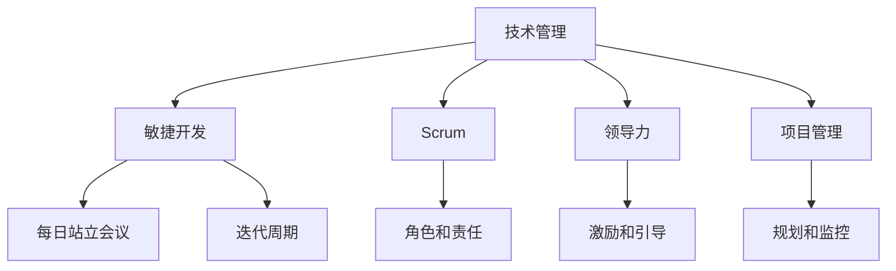

                 

# 如何将编程技能转化为管理能力

> 关键词：编程技能, 管理能力, 领导力, 软件开发, 项目管理, 技术管理

## 1. 背景介绍

### 1.1 问题由来
随着信息技术的发展，软件开发的复杂度日益增加，一个成功的软件开发项目不仅需要深厚的技术基础，还需要优秀的管理能力。如何将个人强大的编程技能转化为高效、系统的管理能力，是许多技术管理者面临的挑战。本文将从技术管理的基本原理、核心方法、实际应用和未来展望等多个角度，详细探讨如何将编程技能转化为强大的管理能力。

### 1.2 问题核心关键点
技术管理者需要掌握的核心能力包括以下几个方面：

1. **编程技能**：熟悉各种编程语言和框架，能够进行代码开发、调试和优化。
2. **项目管理**：了解项目管理的核心流程和方法，如敏捷开发、Scrum等，能够有效组织和管理团队。
3. **领导力**：具备激励和引导团队的能力，能够在复杂项目中保持团队的积极性。
4. **沟通能力**：能够清晰地传达技术和管理上的信息，与客户、利益相关者和团队成员进行有效沟通。
5. **持续学习**：不断更新知识和技术，跟上行业的发展趋势，能够应对快速变化的市场环境。

这些能力是技术管理者成功转型的基石，也是本文关注的重点。

## 2. 核心概念与联系

### 2.1 核心概念概述

为更好地理解如何将编程技能转化为管理能力，本节将介绍几个密切相关的核心概念：

- **技术管理**：将技术团队中的编程技能转化为管理能力，使得技术团队能够高效、协同地完成项目。
- **敏捷开发**：一种灵活、迭代的项目管理方法，强调团队协作、快速反馈和持续改进。
- **Scrum**：敏捷开发的一种实践框架，通过Sprint迭代和每日站立会议等方法提升团队效率。
- **领导力**：引导和激励团队，确保团队朝着共同目标努力的能力。
- **项目管理**：规划、执行和监控项目，确保项目按时、按预算和高质量完成。

这些核心概念之间的逻辑关系可以通过以下Mermaid流程图来展示：



这个流程图展示了一些核心概念及其之间的关系：

1. 技术管理通过敏捷开发、Scrum等方法提升项目管理效率。
2. 敏捷开发强调Scrum中的日常协调和迭代周期，使得项目更容易管理。
3. 领导力是技术管理的重要组成部分，能够激励和引导团队。
4. 项目管理确保项目的规划和执行，保障项目成功。

这些概念共同构成了技术管理者成功转型的关键要素，理解它们之间的关系，有助于更全面地把握如何将编程技能转化为管理能力。

## 3. 核心算法原理 & 具体操作步骤
### 3.1 算法原理概述

技术管理者将编程技能转化为管理能力，本质上是通过敏捷开发、Scrum等方法，将个人编程技能和团队协作能力结合起来，形成一个高效的项目管理框架。其核心思想是：通过持续的反馈和迭代，不断优化项目流程和团队协作，提升项目管理效率。

形式化地，假设技术管理者拥有编程技能 $P$，要将其转化为项目管理能力 $M$，目标是最小化项目管理过程中的不确定性和风险。即找到最优的管理策略 $S$，使得：

$$
\min_{S} \left( \mathbb{E}[\text{risk}(S, P, M)] \right)
$$

其中 $\mathbb{E}$ 表示期望，$risk(S, P, M)$ 为项目管理的风险，受编程技能 $P$、管理能力 $M$ 和策略 $S$ 的影响。

通过梯度下降等优化算法，不断调整管理策略 $S$，最小化风险 $risk(S, P, M)$，使得项目管理更加高效和可控。

### 3.2 算法步骤详解

技术管理者将编程技能转化为管理能力的步骤大致包括以下几个关键步骤：

**Step 1: 准备编程技能和管理框架**
- 选择适合的敏捷开发方法，如Scrum，并了解其核心原则和实践。
- 掌握Scrum中的角色和责任，如Scrum Master、产品负责人等。
- 熟悉项目管理工具和流程，如JIRA、Trello等。

**Step 2: 组建和管理团队**
- 识别团队成员的技能和兴趣，确保团队多样性和互补性。
- 设计团队架构，明确团队成员的角色和职责。
- 使用编程技能进行技术评估，确保团队的技术能力符合项目需求。

**Step 3: 制定和实施项目管理计划**
- 根据项目需求制定项目计划，明确项目目标和里程碑。
- 使用编程技能进行任务分解和估算，确保任务可管理和可执行。
- 制定每日站立会议和Sprint计划，确保团队协作和进展跟踪。

**Step 4: 持续反馈和迭代**
- 使用编程技能进行代码审查和性能优化，确保产品质量。
- 定期回顾和评估项目进展，使用编程技能进行数据分析和决策。
- 不断调整管理策略和团队协作方式，优化项目效率。

**Step 5: 评估和改进**
- 使用编程技能进行自动化测试和持续集成，确保代码稳定性和可维护性。
- 定期进行项目回顾和评估，使用编程技能进行代码重构和优化。
- 收集反馈，持续改进项目管理过程和团队协作方式。

以上是技术管理者将编程技能转化为管理能力的一般流程。在实际应用中，还需要针对具体项目的特点，对各个环节进行优化设计，如改进项目管理工具、引入新的敏捷实践、提高团队协作效率等，以进一步提升项目管理效果。

### 3.3 算法优缺点

将编程技能转化为管理能力的步骤具有以下优点：
1. 提升项目效率。通过敏捷开发和Scrum等方法，团队可以快速适应变化，提高项目进展速度。
2. 增强团队协作。明确的角色和责任分工，确保每个成员清楚自己的任务，提升团队合作效率。
3. 提高项目质量。代码审查和持续集成等技术手段，确保了代码的质量和稳定性。
4. 实现持续改进。通过每日站立会议和Sprint回顾，不断优化项目管理流程和团队协作方式。

同时，该方法也存在一定的局限性：
1. 需要投入时间学习敏捷方法和项目管理工具。
2. 需要适应敏捷开发的灵活性，可能需要调整原有的项目管理习惯。
3. 对项目团队的技术水平和沟通能力要求较高，团队成员之间需要良好的协作和理解。
4. 在项目初期可能需要一定的时间来建立规范和流程，初期效果可能不明显。

尽管存在这些局限性，但就目前而言，通过敏捷开发和Scrum等方法进行技术管理，已成为业界主流的实践范式。未来相关研究的重点在于如何进一步优化敏捷方法，提高项目管理的适应性和灵活性，同时兼顾可解释性和伦理安全性等因素。

### 3.4 算法应用领域

将编程技能转化为管理能力的方法已经在软件开发、IT基础设施管理、数据科学等多个领域得到广泛应用，效果显著：

- 软件开发：敏捷开发和Scrum在软件开发中广泛应用，有效提升了代码质量和项目交付速度。
- IT基础设施管理：使用敏捷方法和项目管理工具，提升IT基础设施的运维效率和稳定性。
- 数据科学：敏捷和Scrum方法应用于数据科学项目，帮助团队快速响应数据变化，提升模型训练和部署效率。

除了上述这些经典领域外，技术管理的方法也被创新性地应用到更多场景中，如DevOps、云计算、物联网等，为技术管理提供了新的思路和方向。随着敏捷方法和项目管理工具的不断演进，技术管理必将在更多领域大放异彩。

## 4. 数学模型和公式 & 详细讲解 & 举例说明
### 4.1 数学模型构建

本节将使用数学语言对技术管理者将编程技能转化为管理能力的过程进行更加严格的刻画。

记技术管理者的编程技能为 $P$，项目管理能力为 $M$，项目管理策略为 $S$，项目管理风险为 $risk(S, P, M)$。假设项目管理的目标是最小化风险，即：

$$
\min_{S} \left( \mathbb{E}[\text{risk}(S, P, M)] \right)
$$

在实践中，我们通常使用基于梯度的优化算法（如SGD、Adam等）来近似求解上述最优化问题。设 $\eta$ 为学习率，$\lambda$ 为正则化系数，则参数的更新公式为：

$$
S \leftarrow S - \eta \nabla_{S}\mathbb{E}[\text{risk}(S, P, M)] - \eta\lambda S
$$

其中 $\nabla_{S}\mathbb{E}[\text{risk}(S, P, M)]$ 为风险函数对策略 $S$ 的梯度，可通过反向传播算法高效计算。

### 4.2 公式推导过程

以下我们以一个简化模型为例，推导风险函数及其梯度的计算公式。

假设项目管理风险由编程技能 $P$、管理能力 $M$ 和策略 $S$ 共同决定，可以表示为：

$$
\text{risk}(S, P, M) = f(P, M) + g(S, P, M) + h(S)
$$

其中 $f(P, M)$ 表示编程技能和管理能力对项目管理的直接影响，$g(S, P, M)$ 表示策略 $S$ 对项目管理的影响，$h(S)$ 表示策略 $S$ 本身的稳定性和适应性。

对 $risk(S, P, M)$ 对 $S$ 求导，得：

$$
\frac{\partial \text{risk}(S, P, M)}{\partial S} = \frac{\partial f(P, M)}{\partial S} + \frac{\partial g(S, P, M)}{\partial S} + \frac{\partial h(S)}{\partial S}
$$

其中 $\frac{\partial f(P, M)}{\partial S}$、$\frac{\partial g(S, P, M)}{\partial S}$、$\frac{\partial h(S)}{\partial S}$ 分别表示编程技能、策略和管理策略对项目风险的影响。

在得到风险函数的梯度后，即可带入参数更新公式，完成模型的迭代优化。重复上述过程直至收敛，最终得到适应项目管理策略 $S^*$。

### 4.3 案例分析与讲解

为了更好地理解技术管理者如何将编程技能转化为管理能力，以下是几个具体案例的分析：

**案例一：敏捷开发的引入**

某技术团队以往使用瀑布式开发模式，项目进度缓慢，需求变化难以应对。引入敏捷开发方法后，团队采用Scrum进行项目管理，每周进行站立会议和Sprint回顾，快速适应变化，项目进展速度显著提升。

**案例二：项目管理工具的引入**

某公司技术团队以往依赖传统项目管理工具，信息传递和反馈不及时，导致项目周期延长。引入JIRA等项目管理工具后，团队能够实时跟踪项目进展，进行高效沟通和协作，项目交付时间显著缩短。

**案例三：编程技能在质量管理中的应用**

某技术团队以往重视开发速度，忽视代码质量，导致项目中遗留了较多Bug。引入编程技能进行代码审查和持续集成，团队在每次Sprint结束后进行代码审查，并通过自动化测试和持续集成进行代码质量控制，项目的Bug数量显著减少，代码稳定性提升。

这些案例展示了编程技能在项目管理中的重要应用，通过敏捷开发、项目管理工具和代码质量管理，技术管理者能够有效提升项目管理和执行效率，确保项目成功交付。

## 5. 项目实践：代码实例和详细解释说明
### 5.1 开发环境搭建

在进行技术管理实践前，我们需要准备好开发环境。以下是使用Python进行Scrum管理的开发环境配置流程：

1. 安装Anaconda：从官网下载并安装Anaconda，用于创建独立的Python环境。

2. 创建并激活虚拟环境：
```bash
conda create -n scrum-env python=3.8 
conda activate scrum-env
```

3. 安装Scrum开发工具：
```bash
pip install scrum
```

4. 安装各类工具包：
```bash
pip install numpy pandas scikit-learn matplotlib tqdm jupyter notebook ipython
```

完成上述步骤后，即可在`scrum-env`环境中开始Scrum管理的实践。

### 5.2 源代码详细实现

下面我们以一个简化版的Scrum管理工具为例，给出使用Scrum库进行项目管理的PyTorch代码实现。

首先，定义Scrum任务的状态枚举：

```python
from enum import Enum

class State(Enum):
    TO_DO = 1
    IN_PROGRESS = 2
    COMPLETED = 3
```

然后，定义Scrum任务类：

```python
class Task:
    def __init__(self, name, state):
        self.name = name
        self.state = state
        self.status = "Not Started"
        self.estimated_time = 0
        self.completed = 0
    
    def update_status(self, status):
        self.status = status
    
    def update_time(self, time):
        self.estimated_time += time
        self.completed += time
```

接着，定义Scrum团队类：

```python
class ScrumTeam:
    def __init__(self, members):
        self.members = members
        self.tasks = []
        self.iteration = 0
        self.burn_down_chart = []
        self.total_time_spent = 0
    
    def add_task(self, task):
        self.tasks.append(task)
    
    def start_iteration(self):
        self.iteration += 1
        self.burn_down_chart = []
    
    def end_iteration(self):
        self.calculate_burn_down_chart()
    
    def calculate_burn_down_chart(self):
        remaining = sum(task.estimated_time - task.completed for task in self.tasks)
        self.burn_down_chart.append((self.iteration, remaining))
        self.total_time_spent += remaining
    
    def update_task(self, task, status):
        task.update_status(status)
    
    def update_task_time(self, task, time):
        task.update_time(time)
```

最后，定义Scrum工具类：

```python
class ScrumTool:
    def __init__(self, team):
        self.team = team
    
    def start_sprint(self, sprint_length):
        self.team.start_iteration()
        print(f"Sprint {self.team.iteration} started.")
    
    def add_task_to_sprint(self, task):
        self.team.add_task(task)
    
    def update_task_status(self, task, status):
        self.team.update_task(task, status)
    
    def update_task_time(self, task, time):
        self.team.update_task_time(task, time)
    
    def end_sprint(self):
        self.team.end_iteration()
        self.display_burn_down_chart()
    
    def display_burn_down_chart(self):
        print("Burn Down Chart:")
        for i, remaining in self.team.burn_down_chart:
            print(f"Iteration {i}: {remaining}")
        print(f"Total Time Spent: {self.team.total_time_spent}")
```

使用上述代码，可以构建一个简单的Scrum管理工具，实现Scrum项目的启动、任务管理、进度跟踪等功能。

### 5.3 代码解读与分析

让我们再详细解读一下关键代码的实现细节：

**State类**：
- 定义了Scrum任务的状态枚举，包括待办(To-Do)、进行中(In-Progress)、已完成(Completed)。

**Task类**：
- 表示Scrum任务，包含任务名、状态、进度、完成时间等属性。
- 提供了更新任务状态和进度的方法。

**ScrumTeam类**：
- 表示Scrum团队，包含团队成员、任务列表、迭代次数、进度追踪等属性。
- 提供了添加任务、开始迭代、结束迭代、更新任务状态和进度的方法。

**ScrumTool类**：
- 表示Scrum工具，用于管理Scrum项目，包含项目启动、任务添加、任务状态更新、进度跟踪等功能。
- 使用了Python的类和面向对象设计思想，提高了代码的可维护性和可复用性。

使用这些代码，可以实现一个简单的Scrum项目管理工具，帮助技术管理者更好地管理项目，提升团队协作效率。

当然，工业级的系统实现还需考虑更多因素，如用户界面、异常处理、数据存储等。但核心的Scrum管理思想和代码实现方法，可以为我们提供宝贵的参考和借鉴。

## 6. 实际应用场景
### 6.1 软件开发

Scrum方法在软件开发中的应用非常广泛。通过Scrum，软件开发团队能够快速响应需求变化，提高代码质量和项目交付速度。常见的Scrum实践包括每日站立会议、Sprint计划、Sprint回顾等，确保团队高效协作和项目进展。

### 6.2 IT基础设施管理

IT基础设施的管理往往需要跨部门协作，使用Scrum方法可以提升项目管理效率。通过Sprint迭代和每日站立会议，IT团队能够及时沟通和反馈，确保基础设施的稳定性和可用性。

### 6.3 数据科学

数据科学项目需要快速迭代和优化，使用Scrum方法可以有效管理项目进度和资源。通过每日站立会议和Sprint回顾，数据科学家能够及时评估模型效果和进度，进行必要的调整和优化。

### 6.4 未来应用展望

随着Scrum方法不断演进，其应用范围将进一步扩展，涵盖更多行业和场景。未来，Scrum方法有望在以下领域得到更广泛的应用：

- 智能制造：通过Scrum管理生产线上的各项任务，提高生产效率和质量。
- 智慧城市：使用Scrum管理智慧城市的各个子系统，提升城市运行效率和服务水平。
- 医疗健康：通过Scrum管理医疗健康项目的各个环节，确保医疗服务的高效和协同。
- 教育培训：使用Scrum管理教育培训项目的各个任务，提高教学效果和学习体验。

这些领域的应用，将使得Scrum方法在更多场景中发挥其高效、协同的管理优势。

## 7. 工具和资源推荐
### 7.1 学习资源推荐

为了帮助开发者系统掌握Scrum方法的理论基础和实践技巧，这里推荐一些优质的学习资源：

1. 《Scrum敏捷项目管理》系列博文：由Scrum专家撰写，深入浅出地介绍了Scrum原理、实践和工具。

2. Scrum官方文档：Scrum.org官方提供的Scrum指南，详细介绍了Scrum的基本概念和核心流程。

3. 《Scrum敏捷项目管理》书籍：Scrum专家所著，全面介绍了如何使用Scrum方法进行项目管理，包括Scrum工具的开发和使用。

4. Scrum Alliance：Scrum认证机构，提供Scrum认证课程和实践经验分享，是学习Scrum的权威资源。

5. Scrum.org：Scrum认证和培训平台，提供Scrum认证课程和实践指南，帮助开发者提升Scrum管理能力。

通过对这些资源的学习实践，相信你一定能够快速掌握Scrum方法的核心思想和实践方法，提升项目管理的效率和效果。

### 7.2 开发工具推荐

高效的开发离不开优秀的工具支持。以下是几款用于Scrum管理开发的常用工具：

1. JIRA：广泛使用的项目管理工具，支持敏捷开发和Scrum管理，提供任务跟踪、进度管理等功能。

2. Trello：简单易用的看板工具，支持Scrum任务管理，通过卡片和列表展示任务进度和状态。

3. Asana：灵活的项目管理工具，支持Scrum和Kanban方法，提供任务分配、进度跟踪等功能。

4. Confluence：协作工具，支持文档管理和知识共享，提升团队协作效率。

5. Slack：即时通讯工具，支持团队沟通和协作，提供频道、通知等功能。

6. GitHub：代码托管平台，支持版本控制和代码审查，提升团队协作效率。

合理利用这些工具，可以显著提升Scrum管理任务的开发效率，加快创新迭代的步伐。

### 7.3 相关论文推荐

Scrum方法的发展源于学界的持续研究。以下是几篇奠基性的相关论文，推荐阅读：

1. Ken Schwaber, Mike Beedle. Scrum: The Art of Doing Twice the Work in Half the Time. Pragmatic Programmers, LLC, 2013.

2. Alistair Cockburn. The Scrum Guide: The Definitive Source of Scrum. Scrum.org, 2020.

3. Martin Thoma. Agile Development with Scrum: Best Practices for Mastering Scrum. KDnuggets, 2019.

4. Jeff Sutherland. Secrets of Successful Agile Teams: Applying Scrum with Product Development Using Overarching Goals and Objectives. Information Age Publishing, 2008.

5. Eric Herzog. Agile Development and Scrum. Springer Science & Business Media, 2007.

这些论文代表了大语言模型微调技术的发展脉络。通过学习这些前沿成果，可以帮助研究者把握学科前进方向，激发更多的创新灵感。

## 8. 总结：未来发展趋势与挑战
### 8.1 总结

本文对技术管理者将编程技能转化为管理能力进行了全面系统的介绍。首先阐述了敏捷开发和Scrum方法的基本原理和应用，明确了敏捷开发在提升项目管理和团队协作方面的独特价值。其次，从原理到实践，详细讲解了Scrum方法的理论基础和实际操作步骤，给出了Scrum任务管理的代码实现。同时，本文还广泛探讨了Scrum方法在软件开发、IT基础设施管理、数据科学等多个领域的应用前景，展示了Scrum方法的巨大潜力。

通过本文的系统梳理，可以看到，敏捷开发和Scrum方法已经成为了项目管理的重要范式，极大地提升了项目管理的效率和效果。未来，伴随敏捷方法和项目管理工具的不断演进，项目管理必将在更多领域大放异彩，为企业的数字化转型提供有力支持。

### 8.2 未来发展趋势

展望未来，Scrum方法和敏捷开发将继续发展，呈现以下几个趋势：

1. 更广泛的应用范围。随着敏捷开发理念的普及，Scrum方法将在更多行业和场景中得到应用，提升各行业的管理效率。

2. 更灵活的实施方式。未来，Scrum方法将进一步结合云计算、物联网等新技术，提升项目管理的灵活性和适应性。

3. 更高的标准化水平。随着Scrum认证和培训的普及，Scrum方法的标准化水平将进一步提升，为项目管理提供更一致的指导。

4. 更全面的培训和支持。Scrum认证和培训将更加注重实战经验和工具使用，提升项目管理者的实践能力。

5. 更深入的技术融合。Scrum方法将与更多新兴技术融合，提升项目管理的技术含量和创新性。

以上趋势展示了Scrum方法的广阔前景，这些方向的探索发展，将进一步提升项目管理的效率和效果，助力企业在数字化转型中取得成功。

### 8.3 面临的挑战

尽管Scrum方法在项目管理中已经取得了显著成效，但在迈向更加智能化、普适化应用的过程中，它仍面临诸多挑战：

1. 组织文化阻力。企业内部的文化惯性和抵抗心理，可能会阻碍敏捷开发和Scrum方法的引入。

2. 团队协作困难。Scrum方法要求团队高度协同，但团队成员之间可能存在沟通和理解障碍。

3. 敏捷实践复杂。Scrum方法需要全员参与和持续改进，但实施起来可能需要较高的学习成本和时间投入。

4. 项目管理工具依赖。Scrum管理依赖工具的支持，但市场上的工具质量参差不齐，难以找到适合企业的解决方案。

5. 持续改进困难。Scrum方法要求持续反馈和改进，但实际应用中可能难以落实，导致效果不明显。

6. 项目管理风险。敏捷开发和Scrum方法引入后，项目管理风险可能会增加，如进度延误、资源浪费等。

正视Scrum方法面临的这些挑战，积极应对并寻求突破，将使Scrum方法在项目管理中取得更大的成功。相信随着学界和产业界的共同努力，这些挑战终将一一被克服，Scrum方法必将在项目管理中发挥更重要的作用。

### 8.4 研究展望

面对Scrum方法面临的挑战，未来的研究需要在以下几个方面寻求新的突破：

1. 提升敏捷开发的文化适应性。通过企业文化的转变和管理层的支持，推广敏捷开发和Scrum方法，提升组织适应性。

2. 优化团队协作机制。通过培训和引导，提升团队成员的沟通和协作能力，促进团队高效协同。

3. 简化敏捷实践过程。开发更加易用和高效的Scrum工具，降低敏捷实施的学习成本，提升项目管理效率。

4. 引入更多技术手段。结合云计算、物联网、大数据等新兴技术，提升Scrum方法的技术含量和创新性。

5. 优化项目管理流程。通过持续改进和反馈，优化Scrum方法的应用流程，提升项目管理效果。

6. 降低项目管理风险。通过建立项目管理体系，提升敏捷开发的风险管理能力，确保项目成功交付。

这些研究方向的探索，将使得Scrum方法在项目管理中更加普及和高效，为企业的数字化转型提供更有力的支持。面向未来，Scrum方法和敏捷开发技术还需要与其他项目管理方法进行更深入的融合，共同推动项目管理技术的进步。只有勇于创新、敢于突破，才能不断提升项目管理的水平，确保项目成功交付。

## 9. 附录：常见问题与解答

**Q1：敏捷开发和Scrum方法是否适用于所有企业？**

A: 敏捷开发和Scrum方法在一定程度上适用于各种企业，特别是对于复杂多变的项目环境。但需要注意，敏捷开发和Scrum方法需要与企业的文化、组织结构和项目特点相匹配，才能发挥最大效用。

**Q2：Scrum方法是否需要持续改进？**

A: 是的，Scrum方法需要持续改进，以适应项目的变化和团队的成长。通过每日站立会议、Sprint回顾等机制，团队可以不断优化流程，提升项目管理效率。

**Q3：Scrum方法是否需要全员培训？**

A: 是的，Scrum方法需要全员参与和培训，以确保全员理解和支持。通过培训，团队成员可以更好地掌握Scrum方法，提升项目管理能力。

**Q4：Scrum方法是否适用于小型团队？**

A: 是的，Scrum方法同样适用于小型团队。Scrum方法强调小团队、短迭代和高效协作，能够提高小型团队的项目管理效率。

**Q5：Scrum方法是否需要依赖工具？**

A: 是的，Scrum方法依赖于工具的支持。Scrum工具可以帮助团队进行任务管理、进度跟踪、沟通协作等功能，提升项目管理效率。

这些问题的解答，帮助我们更好地理解Scrum方法和敏捷开发的核心思想，确保在实际应用中能够有效提升项目管理效率，推动企业数字化转型。

---

作者：禅与计算机程序设计艺术 / Zen and the Art of Computer Programming

