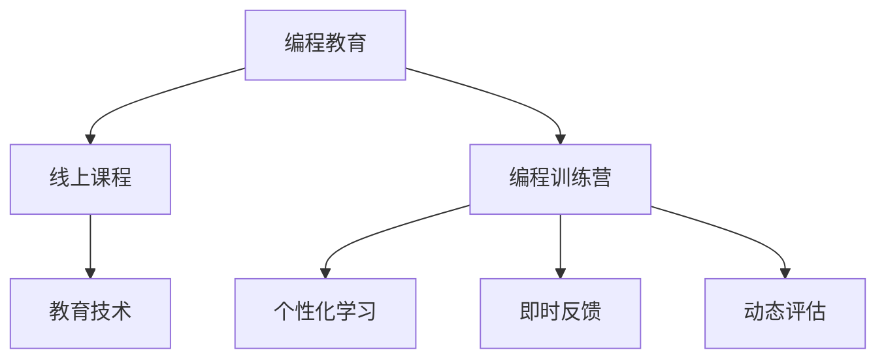

                 

# 如何将编程技能转化为线上编程训练营

> 关键词：线上编程训练营, 编程技能提升, 课程设计, 学习效果, 教育技术, 个性化学习

## 1. 背景介绍

### 1.1 问题由来
在快速发展的数字化时代，编程技能已经成为了各行各业人才必备的基础能力之一。然而，对于许多人来说，学习编程依旧是一个难题，尤其是对于缺乏系统化教育资源的群体。为了解决这一问题，线上编程训练营应运而生，它通过在线课程、实时互动、实践项目等多种形式，为学习者提供了一个便捷、高效的学习平台。本文将深入探讨如何将编程技能转化为线上编程训练营，为学习者提供更加科学、系统、有效的编程学习路径。

### 1.2 问题核心关键点
将编程技能转化为线上编程训练营，核心在于将传统的线下编程教育模式迁移到线上，同时借助先进的教育技术和智能算法，实现个性化学习、即时反馈、动态评估等功能。这不仅需要深度了解编程教育的原理和需求，还需要结合当前最前沿的技术手段，创新性地设计出高效实用的线上训练营。

## 2. 核心概念与联系

### 2.1 核心概念概述

为更好地理解线上编程训练营的设计和实现，本节将介绍几个密切相关的核心概念：

- 编程教育（Programming Education）：通过系统化课程和实践项目，培养学习者编程思维、算法能力、软件工程技能等综合素质。

- 线上课程（Online Course）：以互联网为载体，通过视频、文档、练习等多种形式提供教学内容的学习模式。

- 编程训练营（Coding Bootcamp）：通过集中式、短周期的密集训练，快速提升学习者编程技能的训练模式。

- 教育技术（Educational Technology）：运用信息技术手段改进教育方式，提升教学效果和学习体验的技术集合。

- 个性化学习（Personalized Learning）：根据学习者的个体差异，量身定制学习路径和教学内容，提高学习效率和成果。

- 即时反馈（Real-time Feedback）：在学习过程中，实时获取教师和系统的反馈，调整学习策略和方向。

- 动态评估（Dynamic Assessment）：通过持续的评估和测试，动态调整教学内容和难度，确保学习目标的达成。

这些核心概念之间的逻辑关系可以通过以下Mermaid流程图来展示：



这个流程图展示了几者之间的关联：

1. 编程教育是线上编程训练营和教育技术的基础。
2. 线上课程和编程训练营是编程教育的具体实现形式。
3. 教育技术为线上课程和训练营提供了技术支撑。
4. 个性化学习、即时反馈和动态评估是编程训练营的三个关键特性。

## 3. 核心算法原理 & 具体操作步骤

### 3.1 算法原理概述

线上编程训练营的核心算法原理主要包括个性化学习、即时反馈和动态评估三个方面。

- 个性化学习算法：通过分析学习者的背景信息、学习习惯、知识水平等，设计出个性化的学习路径和教学内容。
- 即时反馈算法：通过实时监测学习者的代码提交、解题情况等，快速给出针对性的反馈和建议。
- 动态评估算法：根据学习者的练习成果和反馈信息，动态调整课程难度和教学策略，确保学习效果。

### 3.2 算法步骤详解

1. **需求分析与目标设定**
   - 明确训练营的目标群体、学习目标、时间跨度等关键参数。
   - 收集学习者的背景信息、兴趣偏好等，为个性化学习奠定基础。

2. **课程设计和内容规划**
   - 根据目标设定，设计符合学习者需求的课程体系，包括理论课程、实践项目、互动环节等。
   - 制定详细的教学计划，包括课程时长、难度系数、教学方法等。

3. **技术平台搭建**
   - 搭建支持个性化学习、即时反馈、动态评估的在线学习平台。
   - 集成先进的教育技术和AI算法，实现自适应学习、智能推荐等功能。

4. **学习数据收集与分析**
   - 通过学习管理系统(LMS)收集学习者的学习数据，如练习记录、代码提交、测试成绩等。
   - 使用机器学习和数据挖掘技术，分析学习者的行为模式和学习效果。

5. **个性化学习路径生成**
   - 根据学习者的数据分析结果，生成个性化的学习路径。
   - 动态调整课程内容和难度，确保学习者能够不断突破自己的学习边界。

6. **即时反馈与动态评估**
   - 学习者在完成练习和项目后，即时获取代码审查、解题指导等反馈信息。
   - 根据学习者的进展和反馈，动态调整评估策略和教学内容，确保学习效果最大化。

### 3.3 算法优缺点

线上编程训练营通过先进的技术手段，实现了高效、个性化的编程教育。但同时也面临一些挑战：

**优点：**

- 灵活性高：可以根据学习者的需求和进度，随时调整课程内容和难度。
- 即时反馈：学习者可以实时获得反馈，及时调整学习策略。
- 广泛覆盖：不受地域限制，可为全球范围内的人群提供编程教育。

**缺点：**

- 技术门槛高：需要开发和维护复杂的学习平台，技术实现难度较大。
- 学生自律性要求高：在线学习模式对学习者的自我管理能力有较高要求。
- 互动不足：缺少面对面的互动交流，学习者可能难以解决一些复杂问题。

### 3.4 算法应用领域

线上编程训练营的应用领域非常广泛，涵盖了从初级到高级的编程教育需求。以下是几个典型的应用场景：

1. **企业内训**：帮助企业员工快速提升编程能力，适应技术变革。
2. **在线教育**：为学生提供灵活、便捷的编程学习渠道，拓宽知识边界。
3. **职业转型**：帮助非计算机专业背景的人转行，提升就业竞争力。
4. **社区学习**：在社区中组织编程训练营，促进知识共享和技术交流。

## 4. 数学模型和公式 & 详细讲解 & 举例说明

### 4.1 数学模型构建

为了更好地理解和设计线上编程训练营，我们构建了如下数学模型：

**学习者模型(Learner Model)**：
- 输入：学习者的背景信息、学习习惯、知识水平等。
- 输出：学习者的学习路径、课程推荐、进度评估等。

**课程内容模型(Course Content Model)**：
- 输入：学习目标、课程时长、教学方法等。
- 输出：课程体系、教学计划、学习材料等。

**学习数据模型(Learning Data Model)**：
- 输入：学习者的练习记录、代码提交、测试成绩等。
- 输出：学习者的行为模式、学习效果等。

**个性化学习路径生成模型(Personalized Learning Path Model)**：
- 输入：学习者的背景信息、学习数据等。
- 输出：个性化的学习路径、课程推荐等。

### 4.2 公式推导过程

以下是对几个关键模型的公式推导过程：

**学习者模型**：
- **输入表示**：$X_L = [\text{Background}, \text{Preferences}, \text{Knowledge}]$
- **输出表示**：$Y_L = [\text{Path}, \text{Recommendations}, \text{Evaluation}]$

**课程内容模型**：
- **输入表示**：$X_C = [\text{Objectives}, \text{Duration}, \text{Methods}]$
- **输出表示**：$Y_C = [\text{Curriculum}, \text{Plan}, \text{Materials}]$

**学习数据模型**：
- **输入表示**：$X_D = [\text{Submissions}, \text{Scores}, \text{Feedbacks}]$
- **输出表示**：$Y_D = [\text{Patterns}, \text{Performance}]$

**个性化学习路径生成模型**：
- **输入表示**：$X_P = [X_L, X_D]$
- **输出表示**：$Y_P = [\text{Path}, \text{Recommendations}]$

### 4.3 案例分析与讲解

以一个具体的案例来分析上述模型的应用：

**案例背景**：某在线编程训练营针对企业内训需求，设计了一个为期三周的Python编程训练营，目标是帮助企业员工快速掌握Python基础和数据科学。

**需求分析与目标设定**：收集了企业员工的背景信息、兴趣偏好和学习目标，设定了训练营的时长和难度。

**课程设计和内容规划**：设计了基础Python、数据分析、机器学习三个模块，每个模块包含理论讲授和实践项目。

**技术平台搭建**：搭建了支持个性化学习、即时反馈、动态评估的在线学习平台，并集成了先进的教育技术和AI算法。

**学习数据收集与分析**：通过学习管理系统(LMS)收集了员工的学习数据，如练习记录、代码提交、测试成绩等。

**个性化学习路径生成**：根据员工的背景信息和学习数据，生成了个性化的学习路径，并在每个学习阶段动态调整课程难度。

**即时反馈与动态评估**：员工在完成练习和项目后，即时获取代码审查、解题指导等反馈信息，并根据进展和反馈动态调整评估策略和教学内容。

## 5. 项目实践：代码实例和详细解释说明

### 5.1 开发环境搭建

在进行线上编程训练营的开发实践前，我们需要准备好开发环境。以下是使用Python进行Django开发的环境配置流程：

1. 安装Anaconda：从官网下载并安装Anaconda，用于创建独立的Python环境。

2. 创建并激活虚拟环境：
```bash
conda create -n pytorch-env python=3.8 
conda activate pytorch-env
```

3. 安装Django：从官网获取安装命令。例如：
```bash
pip install django==3.2
```

4. 安装Gunicorn：
```bash
pip install gunicorn
```

5. 安装Django学习管理系统（LMS）：
```bash
pip install django-lms==0.4.0
```

完成上述步骤后，即可在`pytorch-env`环境中开始开发实践。

### 5.2 源代码详细实现

这里我们以Python训练营为例，给出使用Django进行在线编程训练营的PyTorch代码实现。

**1. 训练营管理界面设计**

首先，设计训练营管理界面，包括训练营列表、训练营详情、学员管理等功能。

```python
# views.py

from django.shortcuts import render
from .models import Camp, CampMember

def camp_list(request):
    # 获取所有训练营
    camps = Camp.objects.all()
    return render(request, 'camp_list.html', {'camps': camps})

def camp_detail(request, pk):
    # 获取指定训练营详情
    camp = Camp.objects.get(pk=pk)
    return render(request, 'camp_detail.html', {'camp': camp})

def member_list(request, pk):
    # 获取指定训练营学员列表
    camp = Camp.objects.get(pk=pk)
    members = CampMember.objects.filter(camp=camp)
    return render(request, 'member_list.html', {'members': members})
```

**2. 训练营内容设计**

设计训练营内容，包括课程体系、教学计划、学习材料等。

```python
# models.py

from django.db import models

class Camp(models.Model):
    name = models.CharField(max_length=100)
    duration = models.DurationField()

class Course(models.Model):
    name = models.CharField(max_length=100)
    content = models.TextField()

class Lesson(models.Model):
    course = models.ForeignKey(Course, on_delete=models.CASCADE)
    duration = models.DurationField()
    text = models.TextField()

class Assignment(models.Model):
    lesson = models.ForeignKey(Lesson, on_delete=models.CASCADE)
    title = models.CharField(max_length=100)
    description = models.TextField()
    due_date = models.DateTimeField()

class Member(models.Model):
    camp = models.ForeignKey(Camp, on_delete=models.CASCADE)
    name = models.CharField(max_length=100)
    email = models.EmailField()

class CampMember(models.Model):
    member = models.ForeignKey(Member, on_delete=models.CASCADE)
    camp = models.ForeignKey(Camp, on_delete=models.CASCADE)
    status = models.CharField(max_length=20)
```

**3. 学员管理界面设计**

设计学员管理界面，包括学员注册、登录、提交作业等功能。

```python
# views.py

from django.shortcuts import render, redirect
from django.contrib.auth import authenticate, login
from django.contrib.auth.decorators import login_required
from .forms import CampMemberForm
from .models import CampMember

def member_signup(request):
    if request.method == 'POST':
        form = CampMemberForm(request.POST)
        if form.is_valid():
            user = authenticate(request, form.cleaned_data['email'], form.cleaned_data['password'])
            login(request, user)
            return redirect('camp_list')
    else:
        form = CampMemberForm()
    return render(request, 'member_signup.html', {'form': form})

@login_required
def member_dashboard(request):
    # 获取当前学员的训练营列表
    camps = Camp.objects.filter(camp_members=request.user)
    return render(request, 'member_dashboard.html', {'camps': camps})
```

**4. 作业提交和评估界面设计**

设计作业提交和评估界面，包括作业提交、代码审查、即时反馈等功能。

```python
# views.py

from django.shortcuts import render, redirect
from django.contrib.auth.decorators import login_required
from .models import Camp, Assignment
from .forms import SubmissionForm

@login_required
def submit_assignment(request, pk):
    # 获取指定作业
    assignment = Assignment.objects.get(pk=pk)
    # 提交作业
    if request.method == 'POST':
        form = SubmissionForm(request.POST)
        if form.is_valid():
            # 保存提交结果
            submission = form.save(commit=False)
            submission.member = request.user.member
            submission.assignment = assignment
            submission.save()
            return redirect('member_dashboard')
    else:
        form = SubmissionForm()
    return render(request, 'submit_assignment.html', {'assignment': assignment, 'form': form})
```

### 5.3 代码解读与分析

让我们再详细解读一下关键代码的实现细节：

**Camp类定义**：
```python
class Camp(models.Model):
    name = models.CharField(max_length=100)
    duration = models.DurationField()
```

**Course类定义**：
```python
class Course(models.Model):
    name = models.CharField(max_length=100)
    content = models.TextField()
```

**Lesson类定义**：
```python
class Lesson(models.Model):
    course = models.ForeignKey(Course, on_delete=models.CASCADE)
    duration = models.DurationField()
    text = models.TextField()
```

**Assignment类定义**：
```python
class Assignment(models.Model):
    lesson = models.ForeignKey(Lesson, on_delete=models.CASCADE)
    title = models.CharField(max_length=100)
    description = models.TextField()
    due_date = models.DateTimeField()
```

**Member类定义**：
```python
class Member(models.Model):
    camp = models.ForeignKey(Camp, on_delete=models.CASCADE)
    name = models.CharField(max_length=100)
    email = models.EmailField()
```

**CampMember类定义**：
```python
class CampMember(models.Model):
    member = models.ForeignKey(Member, on_delete=models.CASCADE)
    camp = models.ForeignKey(Camp, on_delete=models.CASCADE)
    status = models.CharField(max_length=20)
```

通过这些模型定义，我们构建了一个基本的训练营管理系统，可以存储训练营、课程、作业、学员等信息。

## 6. 实际应用场景

### 6.1 智能客服系统

基于线上编程训练营的编程教育技术，可以广泛应用于智能客服系统的构建。传统客服往往需要配备大量人力，高峰期响应缓慢，且一致性和专业性难以保证。而使用编程训练营培养的客服机器人，可以7x24小时不间断服务，快速响应客户咨询，用自然流畅的语言解答各类常见问题。

在技术实现上，可以设计专门的客服编程训练营，针对不同场景和需求提供定制化课程。同时，训练营的实时评估和即时反馈系统，可以不断优化客服机器人的对话逻辑和回答质量，确保用户满意度和体验。

### 6.2 金融数据分析

金融机构需要实时监测市场舆论动向，以便及时应对负面信息传播，规避金融风险。传统的人工监测方式成本高、效率低，难以应对网络时代海量信息爆发的挑战。基于编程训练营的金融数据分析训练营，可以培养具备金融数据分析能力的人才，实时抓取和分析网络文本数据，监测金融市场动态，及时预警和响应风险。

具体而言，可以设计金融数据分析训练营，涵盖金融新闻分析、舆情监测、风险评估等多个模块，培养学习者利用Python等工具进行数据处理、分析、可视化等技能。训练营的动态评估和即时反馈系统，可以实时监控学习者的分析成果和风险预警，确保金融市场的稳定运行。

### 6.3 教育技术应用

在线编程训练营不仅适合企业内训和金融数据分析，还可以广泛应用于教育技术领域。编程训练营通过个性化的学习路径和实时反馈，可以为学生提供灵活、高效、互动的学习体验。

例如，可以设计基础编程、算法设计、数据科学等不同层次的编程训练营，针对不同年龄段和基础水平的学生，提供适合的课程内容和进度安排。同时，通过编程训练营的动态评估和即时反馈系统，可以实时监测学习者的进展和反馈，优化课程设计和教学方法，确保学习效果最大化。

### 6.4 未来应用展望

随着编程训练营技术的发展，未来的应用场景将更加广泛，将进一步推动数字化教育的发展。

在智慧医疗领域，基于编程训练营的编程教育技术，可以为医护人员提供快速上手编程工具、数据分析技能的机会，提升医疗服务的智能化水平，辅助医生诊疗，加速新药开发进程。

在智能制造领域，编程训练营可以培养具备编程和数据分析能力的工程师，通过自动化和智能化技术提升生产效率和质量。

在智慧农业领域，编程训练营可以培养具备编程和数据分析能力的农民，利用农业大数据进行精准管理，提高农业生产效率。

此外，在智能交通、智能家居、智能城市治理等众多领域，基于编程训练营的编程教育技术也将不断涌现，为各行各业注入新的技术动力，推动数字化转型升级。

## 7. 工具和资源推荐

### 7.1 学习资源推荐

为了帮助开发者系统掌握编程训练营的理论基础和实践技巧，这里推荐一些优质的学习资源：

1. Coursera《Python for Data Science》课程：由斯坦福大学教授授课，深入浅出地介绍了Python在数据科学中的应用，涵盖数据处理、分析、可视化等多个方面。

2. Kaggle：全球最大的数据科学竞赛平台，提供海量真实数据集和竞赛项目，是锻炼编程技能和数据分析能力的好去处。

3. LeetCode：面向编程面试的在线平台，提供丰富的高质量编程题目和解题思路，帮助学习者提升算法能力和代码能力。

4. edX《Data Science Fundamentals》课程：由麻省理工学院教授授课，涵盖数据科学的基础知识和技术，适合初学者和进阶者学习。

5. GitHub：全球最大的开源社区，提供海量的开源项目和编程资源，是学习编程和协作开发的理想平台。

通过对这些资源的学习实践，相信你一定能够快速掌握编程训练营的核心技术，并用于解决实际的编程教育问题。

### 7.2 开发工具推荐

高效的开发离不开优秀的工具支持。以下是几款用于编程训练营开发的常用工具：

1. Django：基于Python的开源Web框架，功能强大，适合快速搭建学习管理系统(LMS)。

2. Gunicorn：Python Web应用的WSGI服务器，支持多进程处理，提升Web应用性能。

3. Bootstrap：前端UI框架，提供丰富的组件和样式，可以快速构建美观的Web界面。

4. VS Code：轻量级的代码编辑器，支持多种编程语言，提供丰富的插件和扩展，适合开发在线编程训练营。

5. Git：版本控制系统，提供强大的版本管理和协作功能，是开发在线编程训练营的基础工具。

合理利用这些工具，可以显著提升编程训练营的开发效率，加快创新迭代的步伐。

### 7.3 相关论文推荐

编程训练营技术的发展源于学界的持续研究。以下是几篇奠基性的相关论文，推荐阅读：

1. "Programming Education: A Conceptual Framework for Research" by J. A. Tabachnik and W. T. Entwistle。该论文提出了编程教育的框架，探讨了编程教育的理论基础和实践方法。

2. "Educational Data Mining for Personalized Learning" by C. F. Brunn and C. E. Park。该论文讨论了教育数据挖掘技术在个性化学习中的应用，探讨了如何通过数据分析提升学习效果。

3. "Learning to Learn: An Introduction to Educational Data Mining and Knowledge Discovery" by C. A. Meyer。该书籍介绍了教育数据挖掘的基本概念和技术，适合入门学习者阅读。

4. "Personalized Learning: A Survey of Opportunities, Techniques, and Challenges" by C. F. Brunn。该论文综述了个性化学习的现状和未来发展方向，提供了丰富的研究资源。

5. "Transforming Students into Self-Directed Learners" by C. J. Cormier and M. A. Ferrara。该论文探讨了如何通过在线学习系统培养学生的自主学习能力，提供了详细的案例和建议。

这些论文代表了大规模在线教育技术的发展脉络，通过学习这些前沿成果，可以帮助研究者把握学科前进方向，激发更多的创新灵感。

## 8. 总结：未来发展趋势与挑战

### 8.1 总结

本文对编程训练营进行了全面系统的介绍。首先阐述了编程训练营的设计理念和实现原理，明确了编程训练营在提高编程教育质量、促进技能转化方面的独特价值。其次，从理论到实践，详细讲解了编程训练营的数学模型和关键步骤，给出了编程训练营开发的完整代码实例。同时，本文还广泛探讨了编程训练营在多个行业领域的应用前景，展示了编程训练营技术的广阔前景。

通过本文的系统梳理，可以看到，编程训练营通过先进的教育技术和智能算法，实现了高效、个性化的编程教育，具有巨大的应用潜力和发展空间。未来，随着编程训练营技术的发展，将进一步提升编程教育的效果，推动数字化的普及和发展。

### 8.2 未来发展趋势

展望未来，编程训练营技术将呈现以下几个发展趋势：

1. **技术进步**：随着机器学习和自然语言处理等技术的进步，编程训练营将更加智能化、个性化，能够提供更加精准的个性化学习路径和即时反馈。

2. **跨领域融合**：编程训练营将与其他教育技术（如虚拟现实、增强现实等）进行更深层次的融合，提供更加沉浸式的学习体验。

3. **实时评估**：基于大数据和人工智能技术的实时评估系统，将不断提升学习效果的监测和反馈效率，确保学习目标的达成。

4. **全球化教育**：编程训练营将打破地域限制，为全球范围内的人才提供高质量的教育资源，推动全球教育公平。

5. **社会化学习**：编程训练营将融合社交网络、协作平台等社会化元素，促进学习者之间的互动和合作，提升学习效果。

以上趋势凸显了编程训练营技术的广阔前景。这些方向的探索发展，必将进一步提升编程教育的效果，推动数字化的普及和发展。

### 8.3 面临的挑战

尽管编程训练营技术已经取得了显著成就，但在迈向更加智能化、普适化应用的过程中，它仍面临着诸多挑战：

1. **技术门槛高**：开发和维护复杂的学习平台，需要具备较高的技术水平和专业技能。

2. **内容更新快**：编程语言和工具的快速发展，要求编程训练营的内容需要不断更新，以保持技术的前沿性。

3. **学习者的多样性**：不同背景和水平的学习者对编程训练营的需求和体验存在差异，如何设计出普适且个性化的学习路径是一个重要挑战。

4. **数据隐私和安全**：学习者的数据隐私和安全需要得到严格的保护，避免数据泄露和滥用。

5. **学习效果的评估**：如何通过大数据和人工智能技术，科学地评估学习效果和反馈机制，提升学习效率和满意度，是一个重要研究方向。

### 8.4 研究展望

面对编程训练营技术所面临的挑战，未来的研究需要在以下几个方面寻求新的突破：

1. **技术进步**：继续深入研究机器学习和自然语言处理技术，提升编程训练营的智能化和个性化水平。

2. **内容更新**：建立灵活的内容管理系统，实现编程语言和工具的快速更新和集成。

3. **学习路径设计**：结合教育学理论和人工智能技术，设计出更加普适且个性化的学习路径，满足不同学习者的需求。

4. **数据隐私和安全**：制定严格的数据隐私和安全保护措施，确保学习者的数据安全。

5. **效果评估**：开发科学的学习效果评估指标和方法，提升学习效果的监测和反馈效率。

这些研究方向的探索，必将引领编程训练营技术迈向更高的台阶，为构建安全、可靠、可解释、可控的智能系统铺平道路。面向未来，编程训练营技术还需要与其他人工智能技术进行更深入的融合，如知识表示、因果推理、强化学习等，多路径协同发力，共同推动自然语言理解和智能交互系统的进步。只有勇于创新、敢于突破，才能不断拓展编程训练营的边界，让智能技术更好地造福人类社会。

## 9. 附录：常见问题与解答

**Q1：编程训练营适用于所有类型的编程学习者吗？**

A: 编程训练营的设计初衷是为了提升编程教育的质量和效果，但并不适用于所有类型的编程学习者。对于完全零基础的初学者，可能需要先从基础课程开始，逐步提升编程技能。对于有一定编程基础的学习者，可以选择适合自己水平和需求的高级课程，快速提升技能。

**Q2：编程训练营中的即时反馈和动态评估如何实现？**

A: 即时反馈和动态评估是编程训练营的核心特性，其实现主要依靠先进的数据分析和机器学习技术。具体来说，可以通过以下步骤实现：

1. 学习管理系统(LMS)收集学习者的代码提交、练习记录、测试成绩等数据。

2. 使用自然语言处理(NLP)技术分析学习者的代码风格和逻辑，生成代码审查和解题指导。

3. 通过数据分析技术，实时监测学习者的进展和反馈，动态调整课程内容和难度，确保学习效果最大化。

4. 结合学习者的数据和反馈，设计出个性化的学习路径和教学方法，提升学习效率和成果。

这些技术手段的结合，可以实现高效、个性化的编程教育，显著提升学习者的编程技能。

**Q3：编程训练营的学习效果如何评估？**

A: 编程训练营的学习效果评估是一个复杂且多维度的过程，主要包括以下几个方面：

1. 学习者的代码质量：通过代码审查和代码评估工具，评估学习者的代码质量、规范性和可读性。

2. 学习者的知识掌握：通过理论考试和项目评估，评估学习者对编程知识的掌握程度。

3. 学习者的技能应用：通过实际项目和应用案例，评估学习者的编程技能和问题解决能力。

4. 学习者的学习进展：通过学习管理系统(LMS)记录和分析学习者的学习行为和数据，评估学习效果和学习效率。

5. 学习者的反馈和满意度：通过问卷调查和评估工具，收集学习者的反馈和满意度信息，改进和优化学习路径和教学方法。

这些评估手段的结合，可以实现全面、科学的学习效果监测和反馈，提升学习效果和学习体验。

---

作者：禅与计算机程序设计艺术 / Zen and the Art of Computer Programming

