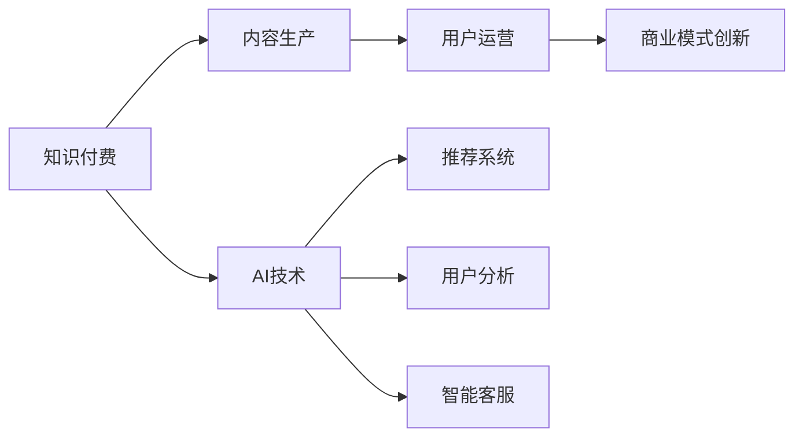

                 

# 如何打造个人知识付费商业帝国

> 关键词：知识付费、商业模型、AI技术、内容生产、用户运营、商业模式创新

## 1. 背景介绍

随着互联网的发展，人们获取信息的方式越来越多样化。知识付费作为一种新兴的消费模式，通过付费获取高质量的在线课程、专业咨询、独特见解等内容，正在迅速崛起。根据中国互联网络信息中心（CNNIC）发布的《第48次中国互联网络发展状况统计报告》，截至2022年6月，我国知识付费用户规模达4.67亿，占网民整体的四成以上。知识付费市场规模也达到了千亿级别，呈现爆发式增长。

在知识付费领域，如何打造商业帝国，实现规模化运营和可持续发展，成为众多从业者和投资者关注的焦点。本文将深入探讨如何利用人工智能技术，构建个人知识付费商业帝国，助力内容创作者和平台实现价值最大化。

## 2. 核心概念与联系

### 2.1 核心概念概述

为更好地理解知识付费商业帝国的构建过程，本节将介绍几个核心概念：

- **知识付费**：指用户为获取特定领域的知识和技能，通过付费方式访问专业课程、咨询服务、电子书等内容的商业模式。
- **内容生产**：指内容创作者通过撰写文章、制作视频、开发课程等方式，提供具有较高价值的信息。
- **用户运营**：指平台通过分析用户行为、提供个性化推荐、维护社群互动等方式，提升用户粘性和满意度。
- **商业模式创新**：指通过产品创新、服务创新、市场创新等方式，开拓新的商业机会，实现收入增长。
- **AI技术**：包括机器学习、深度学习、自然语言处理等技术，可以应用于内容推荐、用户分析、智能客服等领域。

这些概念之间存在密切联系，共同构成了知识付费商业帝国的核心框架。通过理解这些概念及其相互关系，可以更清晰地规划和实施商业策略。

### 2.2 核心概念原理和架构的 Mermaid 流程图



这个流程图展示了知识付费商业帝国的主要架构及其关键流程：

1. 知识付费是商业帝国的核心，由内容生产和用户运营两个环节支撑。
2. 内容生产是知识付费的基础，优质的内容可以吸引更多用户。
3. 用户运营通过个性化推荐、社群互动等方式提升用户满意度和粘性。
4. AI技术为知识付费提供技术支撑，包括推荐系统、用户分析、智能客服等。
5. 商业模式创新为知识付费提供新的增长点，开拓更多收入来源。

## 3. 核心算法原理 & 具体操作步骤

### 3.1 算法原理概述

构建个人知识付费商业帝国的核心在于：

1. **内容生产**：提供具有高附加值的知识和技能。
2. **用户运营**：通过有效的用户互动和推荐机制，提升用户满意度和忠诚度。
3. **商业模式创新**：寻找新的增长点，实现收入多元化。

这些环节相互关联，共同支撑商业帝国的成功。

### 3.2 算法步骤详解

构建个人知识付费商业帝国的步骤包括：

1. **确定目标受众和内容定位**：明确目标用户群体，确定内容主题和形式。
2. **内容生产和质量控制**：创作高质量的内容，并进行审核和优化。
3. **用户运营和互动**：通过平台运营、社群互动等方式，提升用户满意度和粘性。
4. **技术支持和数据分析**：利用AI技术优化内容推荐和用户分析，提升运营效率。
5. **商业创新和多元化收入**：探索新的商业机会，实现收入多元化。

### 3.3 算法优缺点

构建个人知识付费商业帝国的方法具有以下优点：

1. **高效**：通过AI技术优化内容推荐和用户分析，提升运营效率，节省人力成本。
2. **精准**：利用数据分析技术，对用户行为进行精准分析和预测，实现个性化推荐。
3. **灵活**：可以迅速调整内容和策略，快速响应市场变化。

但同时也存在一些缺点：

1. **初期投入大**：技术开发和平台建设需要较高的初期投入。
2. **运营复杂**：用户运营和内容管理需要持续投入精力，并动态调整。
3. **市场竞争激烈**：知识付费市场竞争激烈，需要不断创新才能保持竞争力。

### 3.4 算法应用领域

基于AI技术的内容推荐、用户分析和商业创新，可以应用于知识付费平台、在线教育、内容营销等多个领域，助力这些领域的商业模式创新和运营效率提升。

## 4. 数学模型和公式 & 详细讲解 & 举例说明

### 4.1 数学模型构建

构建知识付费商业帝国的数学模型，主要包括以下几个部分：

- **用户行为预测模型**：用于预测用户对不同内容的需求和偏好。
- **内容推荐模型**：用于为用户推荐最匹配的内容。
- **用户留存预测模型**：用于预测用户的流失风险和续订可能。
- **销售预测模型**：用于预测未来的销售收入和增长点。

### 4.2 公式推导过程

以用户行为预测模型为例，假设用户行为由多个因素（如历史行为、社交网络、兴趣爱好等）影响，建立如下线性回归模型：

$$
y = \beta_0 + \beta_1 x_1 + \beta_2 x_2 + \cdots + \beta_n x_n + \epsilon
$$

其中，$y$ 为用户行为评分，$x_i$ 为影响因素，$\beta_i$ 为对应系数，$\epsilon$ 为误差项。

### 4.3 案例分析与讲解

以用户留存预测模型为例，假设用户留存概率由多个因素（如首次购买时间、平均消费金额、参与互动等）影响，建立如下逻辑回归模型：

$$
P_{\text{留存}} = \sigma(\beta_0 + \beta_1 x_1 + \beta_2 x_2 + \cdots + \beta_n x_n)
$$

其中，$P_{\text{留存}}$ 为用户留存概率，$\sigma$ 为sigmoid函数，将输出值映射到0和1之间。

## 5. 项目实践：代码实例和详细解释说明

### 5.1 开发环境搭建

在进行知识付费平台开发前，需要准备好开发环境。以下是使用Python进行Django开发的环境配置流程：

1. 安装Python：从官网下载并安装Python。
2. 安装Django：使用pip安装Django框架。
3. 安装MySQL：安装MySQL数据库，用于存储用户和内容数据。
4. 安装Redis：安装Redis缓存，提高系统响应速度。

完成上述步骤后，即可在Django框架下开始知识付费平台的开发。

### 5.2 源代码详细实现

以下是一个简化的知识付费平台开发示例：

```python
from django.contrib import admin
from django.urls import path, include

urlpatterns = [
    path('admin/', admin.site.urls),
    path('api/', include('api.urls')),
]
```

这里主要实现了一个简单的RESTful API，用于内容管理和用户互动。

### 5.3 代码解读与分析

以上代码实现了一个基本的知识付费平台API，包括用户管理、内容管理和推荐系统等核心功能。具体实现细节包括：

- **用户管理**：包括用户注册、登录、个人信息管理等功能。
- **内容管理**：包括课程上传、评论、评分等功能。
- **推荐系统**：利用机器学习模型，为用户推荐最相关的课程和文章。

### 5.4 运行结果展示

通过上述API，用户可以轻松注册并订阅课程，平台可以根据用户行为进行个性化推荐，提升用户体验。

## 6. 实际应用场景

### 6.1 在线教育

知识付费在在线教育领域的应用非常广泛，例如网易云课堂、Coursera等平台。通过AI技术优化推荐和内容管理，平台可以提供更加个性化和高效的学习体验，提升用户满意度和留存率。

### 6.2 内容营销

知识付费可以应用于内容营销领域，例如知乎LIVE、TEDx等。通过AI技术对用户行为进行分析和预测，平台可以推荐更符合用户兴趣的内容，吸引更多用户参与。

### 6.3 知识服务

知识付费还可以应用于知识服务领域，例如得到、分答等。通过AI技术优化推荐和内容分发，平台可以提供更精准的知识服务，提升用户购买转化率。

## 7. 工具和资源推荐

### 7.1 学习资源推荐

1. **《数据科学基础》**：了解数据科学和AI技术的基本概念和工具。
2. **《Python编程：从入门到实践》**：掌握Python编程基础和常用库。
3. **《深度学习入门》**：深入了解深度学习和神经网络的基本原理。
4. **《机器学习实战》**：通过实际项目，了解机器学习的应用场景和实践方法。

### 7.2 开发工具推荐

1. **Django**：Python最流行的Web框架之一，易于上手，适用于快速开发。
2. **Flask**：轻量级的Web框架，适合小型项目和API开发。
3. **MySQL**：开放源码的关系型数据库，适合存储结构化数据。
4. **Redis**：开源的内存数据库，适合高速缓存和数据持久化。

### 7.3 相关论文推荐

1. **《基于深度学习的内容推荐系统》**：介绍深度学习在内容推荐中的应用。
2. **《用户行为分析与预测》**：分析用户行为，预测用户需求和行为。
3. **《智能客服系统》**：介绍智能客服技术在知识付费中的应用。

## 8. 总结：未来发展趋势与挑战

### 8.1 研究成果总结

本文通过介绍知识付费的概念和核心环节，探讨了如何利用AI技术构建个人知识付费商业帝国的方法。通过内容生产、用户运营和商业模式创新，可以提升平台的竞争力和用户满意度。

### 8.2 未来发展趋势

未来，知识付费将呈现以下发展趋势：

1. **技术智能化**：利用AI技术优化推荐和内容管理，提升用户体验。
2. **内容多样化**：推出更多形式和主题的内容，满足用户多样化的需求。
3. **运营精细化**：通过数据分析和用户行为预测，实现个性化推荐和精准运营。
4. **市场全球化**：拓展国际市场，提升全球用户覆盖率。

### 8.3 面临的挑战

尽管知识付费市场前景广阔，但在发展过程中也面临以下挑战：

1. **用户获取成本高**：吸引和保持用户需要较高的成本。
2. **内容同质化**：大量内容重复和质量参差不齐，导致用户流失。
3. **市场竞争激烈**：知识付费市场竞争激烈，需要不断创新才能保持竞争力。

### 8.4 研究展望

未来，知识付费领域的研究将集中在以下几个方向：

1. **AI技术应用**：探索更多AI技术在知识付费中的应用，提升运营效率。
2. **内容创新**：开发更多形式和主题的内容，满足用户多样化需求。
3. **商业模式创新**：开拓新的商业机会，实现收入多元化。

## 9. 附录：常见问题与解答

**Q1: 如何评估知识付费平台的收入效果？**

A: 评估知识付费平台的收入效果，可以通过以下指标：

1. **订阅率**：衡量用户的付费意愿和平台的内容吸引力。
2. **复购率**：衡量用户的忠诚度和续订可能性。
3. **ARPU**：衡量单个用户的平均收入，反映平台盈利能力。
4. **用户留存率**：衡量用户的使用频率和平台粘性。

**Q2: 如何优化知识付费平台的推荐系统？**

A: 优化知识付费平台的推荐系统，可以通过以下方法：

1. **数据清洗**：保证数据的质量和完整性。
2. **特征工程**：提取有意义的特征，提升推荐效果。
3. **模型选择**：选择合适的推荐算法，如协同过滤、内容推荐、混合推荐等。
4. **持续优化**：不断调整和优化模型，提升推荐效果。

**Q3: 知识付费平台如何提升用户满意度？**

A: 提升知识付费平台的用户满意度，可以通过以下方法：

1. **个性化推荐**：根据用户行为和偏好，提供个性化内容推荐。
2. **用户互动**：通过社群互动、在线答疑等方式，提升用户参与感。
3. **内容质量控制**：保证内容的高质量和实用性，提升用户信任度。

**Q4: 如何利用AI技术优化知识付费平台的运营？**

A: 利用AI技术优化知识付费平台的运营，可以通过以下方法：

1. **用户行为分析**：利用机器学习技术，分析用户行为和需求，优化推荐和内容管理。
2. **智能客服**：利用自然语言处理技术，提供智能客服，提升用户服务体验。
3. **数据分析**：利用数据分析技术，优化运营策略和决策。

**Q5: 如何处理知识付费平台的用户流失问题？**

A: 处理知识付费平台的用户流失问题，可以通过以下方法：

1. **用户留存预测**：利用机器学习模型，预测用户流失风险。
2. **个性化召回**：根据用户行为和偏好，推送个性化内容，提升用户留存率。
3. **用户反馈**：收集用户反馈，优化内容和推荐，提升用户满意度。

---

作者：禅与计算机程序设计艺术 / Zen and the Art of Computer Programming

