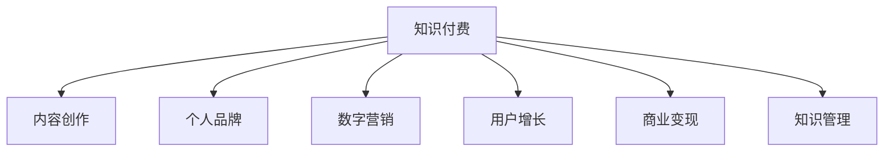

                 

# 如何打造个人知识付费商业帝国

> 关键词：知识付费, 内容创作, 个人品牌, 数字营销, 用户增长, 商业变现, 知识管理

## 1. 背景介绍

### 1.1 问题由来
在当今信息爆炸的时代，知识和技能成为了个体竞争力的关键。知识的获取渠道越来越多，个人对知识付费的需求日益增长。无论是职场人士还是学生，都希望能通过付费订阅、购买课程等方式，获取系统化、高效化的学习资源。

然而，面对海量且零散的信息，用户往往难以筛选出真正有价值的内容。这也为有价值、有深度的知识付费产品提供了巨大的市场机会。在这样一个背景下，个人知识付费成为了一个备受关注的话题。

### 1.2 问题核心关键点
个人知识付费商业帝国的打造，需要从内容创作、用户增长、商业变现等多个方面进行全面规划和执行。关键点包括：

- **内容价值**：确保提供的内容具有深度和实用性，能够真正解决用户问题。
- **用户获取**：采用有效的数字营销策略，吸引并留住大量用户。
- **商业模式**：选择合适的盈利模式，实现商业变现。
- **技术支持**：利用先进的技术工具，提升内容创作和用户体验。

### 1.3 问题研究意义
打造个人知识付费商业帝国，不仅能够实现自我价值，还能为更多人提供高质量的知识服务，推动知识传播和应用，促进社会的进步和发展。同时，这也为创作者提供了一种可持续的收入模式，激励他们创作更多有价值的内容。

## 2. 核心概念与联系

### 2.1 核心概念概述

为更好地理解个人知识付费商业帝国的构建过程，本节将介绍几个核心概念：

- **知识付费**：通过付费方式获取知识或学习资源的过程。包括订阅、购买课程、咨询等形式。
- **内容创作**：包括文章、视频、课程、播客等多种形式，旨在为用户提供有价值的信息和技能。
- **个人品牌**：通过高质量的内容和持续输出，在特定领域内建立权威和影响力。
- **数字营销**：利用互联网和数字技术进行市场推广和用户获取。
- **用户增长**：通过多种策略，如SEO、社交媒体营销、邮件营销等，不断吸引和留存新用户。
- **商业变现**：通过广告、付费订阅、商品销售等方式实现盈利。
- **知识管理**：组织和维护个人知识库，以支撑内容创作和知识传播。

这些核心概念之间的逻辑关系可以通过以下Mermaid流程图来展示：



这个流程图展示了个体知识付费商业帝国的核心概念及其之间的关系：

1. 知识付费是商业帝国的目标和核心价值。
2. 内容创作是知识付费的基础，个人品牌是影响力扩散的基石。
3. 数字营销和用户增长是用户获取和留存的重要手段。
4. 商业变现是商业模式的关键，知识管理是内容创作的支撑。

这些概念共同构成了个人知识付费商业帝国的构建框架，使其能够在市场中占据有利地位。

## 3. 核心算法原理 & 具体操作步骤
### 3.1 算法原理概述

个人知识付费商业帝国的核心在于提供高质量、有深度的内容，并通过有效的营销策略吸引和留存用户，最终实现商业变现。其核心算法原理包括：

- **内容价值最大化**：确保内容具备教育性、实用性和独特性，满足用户需求。
- **用户行为分析**：通过分析用户行为数据，优化内容推荐和营销策略。
- **定价策略优化**：根据市场和用户需求，动态调整课程价格，提高用户转化率。
- **商业模型设计**：选择合适的商业模型，如订阅制、单次购买、增值服务等，实现多样化盈利。

### 3.2 算法步骤详解

基于个人知识付费商业帝国的核心算法原理，以下是详细步骤：

**Step 1: 确定内容定位**
- 明确个人或团队的核心竞争力和兴趣领域。
- 分析目标用户群体，了解其需求和痛点。
- 设定内容系列和形式，如专栏文章、系列课程、专题讲座等。

**Step 2: 内容创作与优化**
- 基于确定的内容定位，持续输出高质量内容。
- 通过A/B测试和用户反馈，不断优化内容形式和主题。
- 引入多媒体元素，如视频、音频、PPT等，增强互动性。

**Step 3: 建立个人品牌**
- 通过博客、社交媒体等平台，持续传播内容。
- 参与行业交流，建立专业声誉。
- 与行业内的KOL合作，扩大影响力。

**Step 4: 数字营销推广**
- 利用SEO优化网站，提升搜索引擎排名。
- 通过社交媒体、邮件营销、内容营销等方式，吸引流量。
- 设计并推广个性化的内容推荐，提高用户粘性。

**Step 5: 用户增长策略**
- 引入推荐系统，扩大用户规模。
- 开发社区和论坛，增强用户互动和参与感。
- 定期举办线上活动，如直播、答疑等，提升用户参与度。

**Step 6: 商业变现模式**
- 选择适合的内容形式和用户群体，设计商业模式。
- 推出订阅服务、单次购买、会员制等盈利模式。
- 开发相关商品，如书籍、周边等，进行二次变现。

**Step 7: 知识管理与迭代**
- 建立个人知识库，整理和存储内容。
- 定期回顾和迭代内容，保持更新。
- 引入用户反馈，持续改进内容质量。

### 3.3 算法优缺点

个人知识付费商业帝国构建方法的主要优点包括：

- **价值明确**：明确的内容定位和目标用户，使得内容创作更具针对性和实效性。
- **多渠道营销**：通过多种数字营销手段，提高用户获取和留存效率。
- **多样化盈利**：采用订阅制、单次购买、商品销售等多种盈利模式，降低风险。

同时，该方法也存在一些局限性：

- **资源投入大**：高质量内容的创作和数字营销都需要大量时间和资源投入。
- **市场竞争激烈**：内容市场竞争激烈，需要不断创新和优化。
- **用户需求变化快**：用户需求和市场环境变化快，需要快速适应和调整。

尽管存在这些局限性，但整体而言，个人知识付费商业帝国构建方法在当前市场中仍然是一种高效且可持续的商业模式。

### 3.4 算法应用领域

个人知识付费商业帝国的构建方法在多个领域都有广泛应用，例如：

- **教育培训**：在线课程、辅导班、一对一咨询等。
- **职业技能**：编程、设计、写作等技能培训课程。
- **心理健康**：心理咨询、心理疏导课程。
- **财务管理**：财务规划、投资理财等课程。
- **生活技能**：烹饪、健身、时间管理等。

除了这些传统领域，个人知识付费也在向更多新兴领域扩展，如游戏开发、数据分析、AI等，为不同行业带来新的知识传播和应用方式。

## 4. 数学模型和公式 & 详细讲解 & 举例说明

### 4.1 数学模型构建

本节将使用数学语言对个人知识付费商业帝国的构建过程进行更加严格的刻画。

假设内容创作的总成本为 $C$，每篇内容的平均成本为 $c$，用户获取成本为 $U$，平均用户生命周期价值为 $V$。内容订阅费为 $P$，单次购买价格为 $p$。通过数字营销获得的流量为 $F$，转化率为 $\alpha$，用户留存率为 $\beta$。商业变现的目标是最大化总收益 $R$，数学模型为：

$$
R = P \cdot (1-\alpha) + p \cdot \alpha \cdot \beta + c \cdot \text{内容创作量}
$$

$$
R = (P-c) \cdot (1-\alpha) + p \cdot \alpha \cdot \beta + C
$$

### 4.2 公式推导过程

以下我们以内容订阅为例，推导最优定价策略。

假设用户订阅后，每月访问内容的平均价值为 $v$，订阅用户每月的平均收益为 $V$。则最优订阅价格 $P$ 满足以下条件：

$$
P \cdot (1-\alpha) = v
$$

即订阅价格需满足用户每次订阅的平均收益等于用户每次访问内容的平均价值。

### 4.3 案例分析与讲解

假设某教育平台每月获得 $10,000$ 名新用户，每名用户每月平均访问课程时长为 $10$ 小时，课程价值为 $100$ 元/小时。平台每月成本为 $50,000$ 元，其中内容创作成本为 $30,000$ 元。平台希望通过订阅服务和单次购买实现盈利。

1. **内容订阅**
   - 订阅费 $P$ 为每月 $20$ 元，转化率 $\alpha$ 为 $10\%$，用户留存率 $\beta$ 为 $90\%$。则每月订阅用户数量为 $1,000$ 人，每月的订阅收入为 $20 \times 1,000 = 20,000$ 元。
   - 订阅用户每月访问课程价值为 $10 \times 100 = 1,000$ 元，每月的订阅收益为 $1,000 \times 1,000 \times 0.1 \times 0.9 = 9,000$ 元。

2. **单次购买**
   - 单次购买价格 $p$ 为每课 $100$ 元，用户购买率为 $20\%$，购买用户留存率 $\beta$ 为 $70\%$。则每月购买用户数量为 $2,000$ 人，每月的购买收入为 $100 \times 2,000 \times 0.2 \times 0.7 = 28,000$ 元。

3. **综合收益**
   - 每月总收益 $R = 20,000 + 28,000 - 30,000 = 18,000$ 元。

通过案例分析，可以看到订阅服务和单次购买可以协同发挥作用，提升平台收益。这为我们制定定价策略提供了直观的计算依据。

## 5. 项目实践：代码实例和详细解释说明

### 5.1 开发环境搭建

在进行知识付费商业帝国构建实践前，我们需要准备好开发环境。以下是使用Python进行Flask开发的环境配置流程：

1. 安装Anaconda：从官网下载并安装Anaconda，用于创建独立的Python环境。

2. 创建并激活虚拟环境：
```bash
conda create -n myenv python=3.8 
conda activate myenv
```

3. 安装Flask：
```bash
pip install Flask
```

4. 安装Gunicorn：用于部署Flask应用。
```bash
pip install gunicorn
```

5. 安装SQLite：作为数据库，存储用户信息、订阅记录等数据。
```bash
pip install sqlite3
```

完成上述步骤后，即可在`myenv`环境中开始项目实践。

### 5.2 源代码详细实现

以下是使用Flask搭建知识付费平台的基本代码实现：

```python
from flask import Flask, render_template, request, jsonify
import sqlite3

app = Flask(__name__)

# 初始化数据库
def init_db():
    conn = sqlite3.connect('knowledge_purchase.db')
    c = conn.cursor()
    c.execute('''CREATE TABLE users
                 (id INTEGER PRIMARY KEY AUTOINCREMENT,
                 username TEXT,
                 email TEXT,
                 password TEXT,
                 created_at TEXT)''')
    c.execute('''CREATE TABLE courses
                 (id INTEGER PRIMARY KEY AUTOINCREMENT,
                 title TEXT,
                 description TEXT,
                 price REAL,
                 duration INT,
                 created_at TEXT,
                 purchased_by INT)''')
    conn.commit()
    conn.close()

# 注册用户
@app.route('/register', methods=['POST'])
def register():
    username = request.form['username']
    email = request.form['email']
    password = request.form['password']
    conn = sqlite3.connect('knowledge_purchase.db')
    c = conn.cursor()
    c.execute('INSERT INTO users (username, email, password, created_at) VALUES (?, ?, ?, datetime(\'now\'))', (username, email, password))
    conn.commit()
    conn.close()
    return jsonify({'status': 'success'})

# 登录用户
@app.route('/login', methods=['POST'])
def login():
    email = request.form['email']
    password = request.form['password']
    conn = sqlite3.connect('knowledge_purchase.db')
    c = conn.cursor()
    c.execute('SELECT * FROM users WHERE email = ? AND password = ?', (email, password))
    user = c.fetchone()
    conn.close()
    if user:
        return jsonify({'status': 'success', 'user': user[0]})
    else:
        return jsonify({'status': 'error', 'message': 'Invalid credentials'})

# 获取课程列表
@app.route('/courses', methods=['GET'])
def courses():
    conn = sqlite3.connect('knowledge_purchase.db')
    c = conn.cursor()
    c.execute('SELECT * FROM courses')
    courses = c.fetchall()
    conn.close()
    return jsonify(courses)

# 购买课程
@app.route('/purchase', methods=['POST'])
def purchase():
    user_id = request.form['user_id']
    course_id = request.form['course_id']
    conn = sqlite3.connect('knowledge_purchase.db')
    c = conn.cursor()
    c.execute('UPDATE courses SET purchased_by = ? WHERE id = ?', (user_id, course_id))
    conn.commit()
    conn.close()
    return jsonify({'status': 'success'})

if __name__ == '__main__':
    init_db()
    app.run(debug=True)
```

在这个例子中，我们使用了Flask框架，构建了一个基本的知识付费平台。用户可以在线注册、登录，查看课程列表，并购买感兴趣的视频课程。

### 5.3 代码解读与分析

让我们再详细解读一下关键代码的实现细节：

**init_db函数**：初始化SQLite数据库，创建必要的表结构。

**register路由**：处理用户注册请求，将新用户信息存储到数据库中。

**login路由**：处理用户登录请求，验证用户名和密码后返回用户ID。

**courses路由**：获取所有课程列表，供用户查看。

**purchase路由**：处理课程购买请求，更新课程的购买记录。

**Flask应用运行**：在代码的最后，通过`app.run(debug=True)`启动Flask应用，监听请求并返回响应。

这个例子展示了如何使用Flask搭建一个简单的知识付费平台，其中包含用户管理和课程购买的核心功能。开发者可以进一步扩展应用，增加更多功能，如课程推荐、评价、课程更新等。

## 6. 实际应用场景

### 6.1 教育培训

个人知识付费在教育培训领域有着广泛的应用，特别是在在线教育和职业培训中。学生和职场人士可以通过订阅或购买课程，获取系统化的学习资源和指导。例如：

- **在线课程平台**：如Coursera、Udemy、Khan Academy等，提供各领域的课程，满足不同学习需求。
- **专业技能培训**：如编程、设计、写作等技能培训课程，帮助用户提升职业技能。
- **考试辅导**：如托福、GRE、CPA等考试辅导课程，帮助用户通过考试。

### 6.2 职业技能

在职场发展中，个人知识付费同样具有重要作用。专业人士可以通过订阅或购买课程，提升自己的职业技能，从而在职场中更具竞争力。例如：

- **项目管理**：学习项目管理工具和方法，提升项目管理能力。
- **数据分析**：学习数据分析工具和技术，提升数据处理和分析能力。
- **创业指导**：学习创业知识和经验，提升创业成功率。

### 6.3 生活技能

个人知识付费同样适用于生活技能的提升。通过订阅或购买课程，用户可以学习各类生活技能，提升生活质量。例如：

- **烹饪**：学习各类烹饪技巧，提升烹饪水平。
- **健身**：学习健身知识，提升身体素质。
- **时间管理**：学习时间管理技巧，提高工作效率。

### 6.4 未来应用展望

随着技术的发展和社会的进步，个人知识付费的应用场景将不断扩展。未来的发展趋势包括：

- **多模态学习**：结合视频、音频、图文等多种形式，提供更加丰富和沉浸式的学习体验。
- **个性化推荐**：通过大数据和人工智能技术，实现个性化内容推荐，提升用户满意度。
- **实时互动**：通过直播、答疑等实时互动方式，提升用户参与度和学习效果。
- **全球化扩展**：通过本地化内容和全球化扩展，满足更多用户的个性化需求。

## 7. 工具和资源推荐

### 7.1 学习资源推荐

为了帮助开发者系统掌握个人知识付费的开发技术，这里推荐一些优质的学习资源：

1. **Flask官方文档**：Flask框架的官方文档，提供详细的安装和使用指南，是学习Flask框架的必备资源。
2. **SQLite官方文档**：SQLite数据库的官方文档，介绍SQLite的使用方法和常见问题。
3. **在线课程平台开发指南**：如Udemy的《The Complete Web Developer Course》课程，涵盖Web开发全栈技术，包括Flask、SQLite等。
4. **人工智能应用指南**：如《Python深度学习》一书，介绍人工智能技术在多个领域的应用，包括知识付费。
5. **数字营销指南**：如《Digital Marketing All-in-One》一书，涵盖数字营销的各个方面，包括SEO、社交媒体营销等。

通过对这些资源的学习实践，相信你一定能够快速掌握个人知识付费的开发技术，并用于解决实际的业务问题。

### 7.2 开发工具推荐

高效的开发离不开优秀的工具支持。以下是几款用于知识付费平台开发的常用工具：

1. **Flask**：轻量级的Web框架，适合快速开发和迭代。
2. **SQLite**：轻量级的关系型数据库，适合小型应用和快速原型开发。
3. **Gunicorn**：Python Web应用的WSGI HTTP服务器，适合部署Flask应用。
4. **Git**：版本控制系统，适合团队协作和代码管理。
5. **JIRA**：项目管理工具，适合跟踪项目进度和问题。

合理利用这些工具，可以显著提升知识付费平台开发的效率，加快创新迭代的步伐。

### 7.3 相关论文推荐

个人知识付费的发展源于学界的持续研究。以下是几篇奠基性的相关论文，推荐阅读：

1. **《The Economics of Online Education: A Survey》**：探讨在线教育市场的经济模型和用户行为。
2. **《Educational Data Mining: Data Mining, Statistical Learning, and Statistical Learning from Educational Data》**：介绍教育数据挖掘技术，提升教育决策的科学性。
3. **《Solving the Recommendation Problem with AI》**：探讨推荐系统的AI技术，提升内容推荐的效果。
4. **《A Survey on Online Learning Platforms》**：回顾在线学习平台的发展历程和现状。
5. **《Blockchain Technology for the Future of Education》**：探讨区块链技术在教育中的应用，提升教育的透明性和安全性。

这些论文代表了个体知识付费的发展脉络。通过学习这些前沿成果，可以帮助研究者把握学科前进方向，激发更多的创新灵感。

## 8. 总结：未来发展趋势与挑战

### 8.1 总结

本文对个人知识付费商业帝国的构建过程进行了全面系统的介绍。首先阐述了知识付费的商业价值和目标用户，明确了内容创作、用户增长、商业变现等多个方面的关键点。其次，从算法原理到具体步骤，详细讲解了个人知识付费的构建过程，给出了完整的代码实例和分析。同时，本文还探讨了知识付费在多个领域的应用场景，展示了其广阔的前景。

通过本文的系统梳理，可以看到，个人知识付费商业帝国构建是一个复杂且多维度的过程，需要从内容价值、用户获取、商业变现等多个角度进行全面规划和执行。只有综合考虑各个因素，不断优化和调整，才能构建起可持续发展的知识付费平台。

### 8.2 未来发展趋势

展望未来，个人知识付费商业帝国将呈现以下几个发展趋势：

- **多模态学习**：结合视频、音频、图文等多种形式，提供更加丰富和沉浸式的学习体验。
- **个性化推荐**：通过大数据和人工智能技术，实现个性化内容推荐，提升用户满意度。
- **实时互动**：通过直播、答疑等实时互动方式，提升用户参与度和学习效果。
- **全球化扩展**：通过本地化内容和全球化扩展，满足更多用户的个性化需求。

### 8.3 面临的挑战

尽管个人知识付费商业帝国构建方法在当前市场中仍然具有重要价值，但在实践中仍面临诸多挑战：

- **内容创作成本高**：高质量内容创作需要大量时间和资源投入，难以持续。
- **市场竞争激烈**：内容市场竞争激烈，需要不断创新和优化。
- **用户需求变化快**：用户需求和市场环境变化快，需要快速适应和调整。

尽管存在这些挑战，但整体而言，个人知识付费商业帝国构建方法在当前市场中仍然是一种高效且可持续的商业模式。

### 8.4 研究展望

面对个人知识付费商业帝国构建所面临的挑战，未来的研究需要在以下几个方面寻求新的突破：

- **内容创作自动化**：探索内容自动化生成技术，降低内容创作成本。
- **智能推荐系统**：开发基于AI的推荐系统，提升内容推荐效果。
- **实时互动平台**：开发实时互动平台，提升用户参与度和学习效果。
- **全球化扩展**：开发多语言版本，满足全球化市场的需求。

这些研究方向的探索，必将引领个人知识付费商业帝国构建技术迈向更高的台阶，为更多的创作者提供广阔的平台和机遇。

## 9. 附录：常见问题与解答

**Q1：个人知识付费的盈利模式有哪些？**

A: 个人知识付费的盈利模式包括：
- **订阅制**：用户每月或每年支付一定费用，获取平台提供的所有课程内容。
- **单次购买**：用户根据需求选择购买单个课程，付费后即获得课程内容。
- **增值服务**：在基础服务基础上，提供高级课程、优先答疑、专属会员等增值服务。
- **广告变现**：通过平台展示广告，获取广告收入。
- **商品销售**：开发相关周边商品，如书籍、文具等，通过商品销售获得收益。

**Q2：如何提高用户粘性？**

A: 提高用户粘性需要从多个方面入手，包括：
- **高质量内容**：提供有价值、有深度的内容，满足用户需求。
- **个性化推荐**：利用大数据和AI技术，实现个性化内容推荐，提升用户体验。
- **社区建设**：建立在线社区，增强用户互动和参与感。
- **定期更新**：保持内容定期更新，提升平台吸引力。
- **活动策划**：定期举办线上活动，如直播、答疑等，提升用户参与度。

**Q3：如何优化定价策略？**

A: 优化定价策略需要考虑多个因素，包括：
- **市场调研**：了解目标用户的需求和支付能力，制定合理的定价策略。
- **成本控制**：控制内容创作和平台运营成本，确保盈利空间。
- **动态调整**：根据市场需求和用户反馈，动态调整定价策略，保持竞争力。

通过综合考虑这些因素，可以制定出合理的定价策略，提升平台的盈利能力和用户满意度。

**Q4：如何构建多模态学习平台？**

A: 构建多模态学习平台需要引入多媒体元素，如视频、音频、图文等，通过多种形式呈现内容。具体步骤包括：
- **内容整合**：将不同形式的内容整合到同一个平台上，方便用户使用。
- **技术支持**：引入多媒体技术和工具，如视频编辑、音频处理、图文排版等。
- **用户互动**：通过互动功能，如评论、点赞、分享等，增强用户参与感。
- **用户体验**：优化平台界面和功能，提升用户体验。

通过这些步骤，可以构建起一个多模态学习平台，为用户提供更丰富的学习体验。

**Q5：如何应对市场竞争？**

A: 应对市场竞争需要从多个方面入手，包括：
- **差异化定位**：明确平台的目标用户和特色内容，形成差异化优势。
- **品牌建设**：通过高质量内容、良好用户体验和用户口碑，提升品牌影响力。
- **技术创新**：引入新技术和创新点，提升平台竞争力。
- **合作共赢**：与其他平台和机构合作，共同推广和营销。

通过综合考虑这些因素，可以构建起具有竞争力的个人知识付费平台，实现可持续发展。

---

作者：禅与计算机程序设计艺术 / Zen and the Art of Computer Programming

