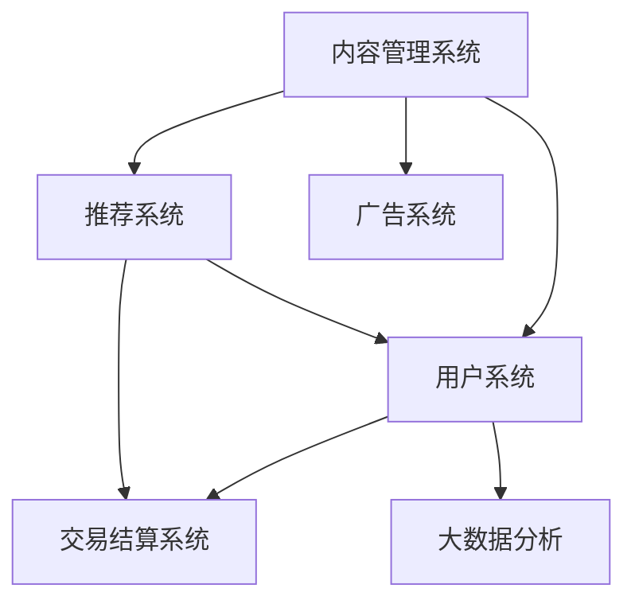

                 

# 如何打造个人知识付费平台

## 1. 背景介绍

### 1.1 问题由来
随着互联网技术的快速发展，知识付费已经逐渐成为了一种主流的网络变现方式。无论是传统知识服务机构的在线化转型，还是个人IP的变现需求，都催生了大量基于互联网的知识付费平台。例如，知乎、得到、喜马拉雅等平台，已经成为知识付费市场的重要参与者。然而，构建一个高效、可靠的知识付费平台并非易事，它需要跨越数据、算法、系统架构、商业化等多个维度，进行全面细致的设计和实现。

### 1.2 问题核心关键点
打造一个成功的知识付费平台需要解决以下几个核心问题：
- 数据采集与处理：如何高效、可靠地采集内容源数据，并对数据进行清洗和标注，构建高质量的数据库。
- 推荐算法：如何设计推荐算法，根据用户的兴趣和行为，智能推荐最适合的内容。
- 个性化体验：如何设计友好的用户界面，提供个性化的内容呈现和推荐。
- 用户管理系统：如何设计用户管理系统，保障用户数据的安全性和隐私性。
- 交易和结算系统：如何设计便捷的交易和结算系统，保障平台与用户的经济利益。
- 商业化策略：如何制定合理的商业化策略，平衡平台方和内容方的利益，确保平台的可持续发展。

这些问题不仅涉及技术层面，还涵盖了商业策略、用户运营等多个方面，因此，打造一个成功的知识付费平台需要系统的规划和精细的实施。

## 2. 核心概念与联系

### 2.1 核心概念概述

为了更好地理解知识付费平台的构建过程，本节将介绍几个关键概念：

- **知识付费平台**：基于互联网技术的知识服务体系，提供付费内容的学习、阅读、听讲等形式，帮助用户获取有价值的知识和信息。

- **内容管理系统**：用于管理内容资源的数据库系统，包括内容采集、标注、发布、更新、检索等功能。

- **推荐系统**：使用机器学习等技术，根据用户的历史行为、兴趣等特征，智能推荐适合的内容，提升用户粘性和留存率。

- **用户系统**：用于管理用户信息、交易信息、学习行为等数据的系统，包括用户注册、登录、支付、学习进度等功能。

- **交易结算系统**：用于管理内容交易的订单、支付、退款、结算等功能，保障平台和用户之间的经济利益。

- **广告系统**：用于在平台上展示广告、收集用户行为数据等，帮助平台实现盈利。

- **大数据分析**：对平台用户行为、内容消费等数据进行分析和挖掘，提供数据驱动的商业决策支持。

这些核心概念之间的逻辑关系可以通过以下Mermaid流程图来展示：



这个流程图展示了知识付费平台的核心组件及其之间的逻辑关系：

1. 内容管理系统存储并管理所有内容资源，是推荐系统的数据源。
2. 用户系统记录和管理用户信息，与推荐系统结合提供个性化内容推荐。
3. 交易结算系统处理订单支付，与推荐系统配合实现商业化变现。
4. 广告系统通过展示广告获得收益，同时收集用户行为数据支持大数据分析。
5. 大数据分析通过分析用户行为数据，为商业决策提供支持，进一步优化推荐系统。

这些概念共同构成了知识付费平台的架构框架，使得平台能够高效地运行和持续发展。

## 3. 核心算法原理 & 具体操作步骤
### 3.1 算法原理概述

知识付费平台的建设涉及多个子系统的算法设计和实现，其中最为关键的是推荐算法。推荐系统通过分析用户的历史行为和兴趣，智能推荐最适合的内容，提升用户体验和平台留存率。

推荐算法的基本思想是通过构建用户画像、内容画像和相似度矩阵，计算用户与内容的匹配程度，并根据匹配程度排序推荐。常见的推荐算法包括协同过滤、基于内容的推荐、混合推荐等。

协同过滤算法通过分析用户历史行为，构建用户间的相似度矩阵，计算用户与内容的相似度，从而推荐与用户相似的其他用户喜欢的内容。基于内容的推荐算法则通过分析内容特征，构建内容间的相似度矩阵，推荐与用户已喜欢内容相似的其他内容。混合推荐算法则是结合多种推荐方法，综合考虑用户行为和内容特征，提升推荐效果。

### 3.2 算法步骤详解

以下是推荐系统的核心算法步骤：

1. 用户画像构建：通过分析用户的历史行为、兴趣、社交关系等数据，构建用户画像。常用的特征包括浏览记录、购买记录、收藏记录、评分记录等。

2. 内容画像构建：通过分析内容的元数据、用户反馈等数据，构建内容画像。常用的特征包括标题、标签、分类、作者、时长、评分等。

3. 相似度计算：通过计算用户画像和内容画像的相似度，构建相似度矩阵。常用的相似度计算方法包括余弦相似度、皮尔逊相关系数、欧几里得距离等。

4. 推荐排序：通过计算用户与内容的匹配度，并根据匹配度排序推荐。常用的排序算法包括基于内容的排序、基于协同过滤的排序、混合排序等。

5. 反馈迭代：根据用户的反馈行为（如点击、收藏、评论等），对推荐结果进行修正和优化，提升推荐效果。

### 3.3 算法优缺点

推荐系统的主要优点在于：
1. 提升用户体验：通过智能推荐，用户可以更快地找到感兴趣的内容，提升用户体验和平台留存率。
2. 促进内容消费：推荐系统可以有效地提升内容的曝光率和点击率，促进内容消费和变现。
3. 数据分析价值：推荐系统收集和分析用户行为数据，提供有价值的商业决策支持。

推荐系统的缺点在于：
1. 冷启动问题：新用户和内容缺乏足够的历史行为数据，难以进行推荐。
2. 过拟合问题：推荐系统容易对特定内容产生过拟合，导致推荐结果过于集中。
3. 系统复杂性：推荐系统的构建和维护需要复杂的数据处理和算法实现，成本较高。

尽管存在这些缺点，推荐系统依然是知识付费平台不可或缺的重要组成部分，其核心算法设计和实现需要持续优化和改进。

### 3.4 算法应用领域

推荐算法在知识付费平台中的应用场景非常广泛，具体包括：

- 内容推荐：根据用户历史行为，推荐最相关的文章、视频、音频等内容。
- 活动推荐：根据用户兴趣，推荐适合的课程、讲座、直播等活动。
- 商品推荐：根据用户购买历史，推荐相关的课程、图书、工具等商品。
- 个性化提示：根据用户行为，提示内容更新、新课上架等信息。
- 广告推荐：根据用户行为，精准展示相关广告，提升广告效果。

这些应用场景展示了推荐系统在知识付费平台上的广泛应用和重要价值。

## 4. 数学模型和公式 & 详细讲解 & 举例说明

### 4.1 数学模型构建

推荐系统的数学模型可以通过以下公式进行描述：

设 $U$ 为用户集合，$I$ 为内容集合，$r_{ui}$ 表示用户 $u$ 对内容 $i$ 的评分，$S_{ui}$ 表示用户 $u$ 对内容 $i$ 的相似度，$t_{ui}$ 表示用户 $u$ 对内容 $i$ 的实际点击率，$p_{ui}$ 表示推荐系统推荐内容 $i$ 给用户 $u$ 的点击率，$f_{ui}$ 表示内容 $i$ 的特征向量。

设 $X$ 为内容特征矩阵，$Y$ 为用户行为矩阵，$R$ 为评分矩阵。则推荐系统可以通过以下公式进行建模：

$$
\begin{aligned}
p_{ui} &= \sigma \left( \sum_{j=1}^m \alpha_j X_{ij} r_{uj} + \beta_i f_i \right) \\
S_{ui} &= \frac{\sum_{j=1}^m \alpha_j \cos \left( \frac{r_{uj} X_{ij}}{||r_{uj}|| ||X_{ij}||} \right)}{\sqrt{\sum_{j=1}^m \alpha_j^2} ||f_i||}
\end{aligned}
$$

其中，$\sigma$ 为 sigmoid 函数，$\alpha_j$ 为内容特征的权重，$\beta_i$ 为内容的权重，$m$ 为内容特征的数量。

### 4.2 公式推导过程

公式推导过程中，我们使用了一些常见的机器学习工具，如 sigmoid 函数、cosine 相似度等。

首先，通过 sigmoid 函数将推荐模型的输出映射到 $(0,1)$ 区间，表示内容的点击率概率。然后，通过计算用户和内容的相似度，得到用户对内容的推荐概率。

### 4.3 案例分析与讲解

假设我们有 $N$ 个用户和 $M$ 个内容，每个用户对内容的评分从 $1$ 到 $5$，每个内容有 $k$ 个特征。则推荐系统的输入矩阵为 $X \in \mathbb{R}^{M \times k}$ 和 $Y \in \mathbb{R}^{N \times M}$，输出矩阵为 $R \in \mathbb{R}^{N \times M}$。

假设推荐系统通过学习得到内容的特征向量 $f \in \mathbb{R}^{M \times d}$，则推荐模型可以通过以下公式进行预测：

$$
p_{ui} = \sigma \left( \sum_{j=1}^k \alpha_j f_{ij} + \beta_i \right)
$$

其中，$\alpha_j$ 为特征 $j$ 的权重，$\beta_i$ 为内容的权重。

## 5. 项目实践：代码实例和详细解释说明
### 5.1 开发环境搭建

在进行知识付费平台的开发前，我们需要准备好开发环境。以下是使用Python进行Flask开发的环境配置流程：

1. 安装Anaconda：从官网下载并安装Anaconda，用于创建独立的Python环境。

2. 创建并激活虚拟环境：
```bash
conda create -n flask-env python=3.8 
conda activate flask-env
```

3. 安装Flask：
```bash
pip install Flask
```

4. 安装Flask-RESTful：用于处理HTTP请求和返回JSON数据。
```bash
pip install Flask-RESTful
```

5. 安装Flask-Login：用于用户认证和会话管理。
```bash
pip install Flask-Login
```

6. 安装SQLAlchemy：用于数据库操作。
```bash
pip install SQLAlchemy
```

完成上述步骤后，即可在`flask-env`环境中开始知识付费平台的开发。

### 5.2 源代码详细实现

这里我们以内容推荐系统为例，给出使用Flask进行推荐算法开发的基本代码实现。

```python
from flask import Flask, request, jsonify
from flask_login import LoginManager, login_user, logout_user, login_required
from sqlalchemy import create_engine, Column, Integer, String, Float
from sqlalchemy.orm import sessionmaker
from sqlalchemy.ext.declarative import declarative_base
from sklearn.feature_extraction.text import TfidfVectorizer
from sklearn.metrics.pairwise import cosine_similarity
import numpy as np

app = Flask(__name__)
app.config['SECRET_KEY'] = 'mysecretkey'
login_manager = LoginManager()
login_manager.init_app(app)

Base = declarative_base()

class User(Base):
    __tablename__ = 'users'
    id = Column(Integer, primary_key=True)
    username = Column(String)
    password = Column(String)

class Content(Base):
    __tablename__ = 'contents'
    id = Column(Integer, primary_key=True)
    title = Column(String)
    description = Column(String)
    keywords = Column(String)
    author = Column(String)

    def to_dict(self):
        return {
            'id': self.id,
            'title': self.title,
            'description': self.description,
            'keywords': self.keywords,
            'author': self.author,
            'feature_vector': self.feature_vector
        }

class Engine(Base):
    __tablename__ = 'engines'
    id = Column(Integer, primary_key=True)
    name = Column(String)
    user_id = Column(Integer, ForeignKey('users.id'))

class UserEngine(Base):
    __tablename__ = 'user_engines'
    id = Column(Integer, primary_key=True)
    user_id = Column(Integer, ForeignKey('users.id'))
    engine_id = Column(Integer, ForeignKey('engines.id'))

class UserEngineFeature(Base):
    __tablename__ = 'user_engine_features'
    id = Column(Integer, primary_key=True)
    user_id = Column(Integer, ForeignKey('user_engines.id'))
    engine_id = Column(Integer, ForeignKey('engines.id'))
    feature_name = Column(String)
    value = Column(Float)

def create_database():
    engine = create_engine('sqlite:///example.db')
    Base.metadata.create_all(engine)
    Session = sessionmaker(bind=engine)
    session = Session()

    # 创建用户
    user = User(username='alice', password='secret')
    session.add(user)
    session.commit()

    # 创建内容
    content = Content(title='机器学习', description='介绍机器学习的基本概念和算法', keywords='机器学习,算法,数据')
    session.add(content)
    session.commit()

    # 创建引擎
    engine = Engine(name='推荐引擎')
    session.add(engine)
    session.commit()

    # 创建用户和引擎关联
    user_engine = UserEngine(user_id=user.id, engine_id=engine.id)
    session.add(user_engine)
    session.commit()

    # 创建用户和引擎特征关联
    user_engine_feature = UserEngineFeature(user_id=user_engine.id, engine_id=engine.id, feature_name='点击率', value=0.8)
    session.add(user_engine_feature)
    session.commit()

if __name__ == '__main__':
    create_database()

@app.route('/recommend', methods=['GET'])
@login_required
def recommend():
    # 查询用户所有的引擎
    engines = session.query(Engine).filter_by(user_id=current_user.id).all()

    # 计算内容向量
    tfidf = TfidfVectorizer()
    contents = session.query(Content).all()
    tfidf_matrix = tfidf.fit_transform([c.description for c in contents])
    content_vectors = tfidf_matrix.toarray()

    # 计算相似度矩阵
    similarity_matrix = cosine_similarity(content_vectors, content_vectors)

    # 计算每个引擎的内容分数
    engine_scores = []
    for engine in engines:
        user_engine_features = session.query(UserEngineFeature).filter_by(engine_id=engine.id).all()
        engine_features = {}
        for feature in user_engine_features:
            engine_features[feature.feature_name] = feature.value

        engine_score = np.average([np.dot(similarity_matrix[i], engine_features.values()) for i in range(len(similarity_matrix))])
        engine_scores.append((engine.id, engine_score))

    # 排序引擎
    engine_scores = sorted(engine_scores, key=lambda x: x[1], reverse=True)

    # 获取前10个引擎
    top_10_engines = engine_scores[:10]

    # 获取推荐的10个内容
    top_10_contents = []
    for engine_id, _ in top_10_engines:
        content_ids = session.query(Content.id).filter_by(engine_id=engine_id).all()
        top_10_contents.extend(content_ids)

    # 返回推荐结果
    results = []
    for content_id in top_10_contents:
        content = session.query(Content).filter_by(id=content_id).first()
        results.append(content.to_dict())

    return jsonify(results)

@app.route('/login', methods=['POST'])
def login():
    username = request.form['username']
    password = request.form['password']

    # 查询用户
    user = session.query(User).filter_by(username=username).first()

    if user and user.password == password:
        login_user(user)
        return jsonify({'success': True, 'redirect_url': '/recommend'})

    return jsonify({'success': False})

@app.route('/logout')
@login_required
def logout():
    logout_user()
    return jsonify({'success': True})

if __name__ == '__main__':
    app.run(debug=True)
```

在这个代码中，我们使用SQLAlchemy框架进行数据库操作，使用Flask-RESTful处理HTTP请求，使用Flask-Login实现用户认证。我们首先创建了一个简单的数据库，包含用户、内容和推荐引擎等表，并定义了相关的模型类。在`/recommend`路由中，我们通过计算内容的TF-IDF向量和相似度矩阵，得到每个推荐引擎的分数，并根据分数排序推荐内容。

### 5.3 代码解读与分析

让我们再详细解读一下关键代码的实现细节：

**User和Content类**：
- `__tablename__` 定义了表名。
- `id` 字段为主键。
- `username` 和 `password` 字段用于用户登录认证。
- `title`、`description`、`keywords`、`author` 字段用于内容信息存储。

**Engine和UserEngine类**：
- `id` 字段为主键。
- `name` 字段用于存储引擎名称。
- `user_id` 字段用于关联用户和引擎。
- `id` 字段为外键，关联用户和引擎。

**UserEngineFeature类**：
- `id` 字段为主键。
- `user_id` 字段用于关联用户和引擎。
- `engine_id` 字段用于关联引擎。
- `feature_name` 和 `value` 字段用于存储引擎特征和值。

**create_database函数**：
- 使用SQLAlchemy创建数据库和表结构。
- 创建用户、内容、引擎等基础数据。
- 创建用户和引擎、用户和引擎特征的关联数据。

**/recommend路由**：
- 获取当前用户的引擎列表。
- 使用TF-IDF向量化内容描述，并计算相似度矩阵。
- 计算每个引擎的分数，排序得到推荐引擎列表。
- 获取推荐的10个内容。
- 将内容转换为字典，并返回JSON格式的数据。

**/login和/logout路由**：
- 处理用户登录和注销请求，使用Flask-Login库实现用户认证和会话管理。

**代码执行流程**：
- 启动Flask应用，监听路由请求。
- 用户通过`/login`路由进行登录，系统验证用户名和密码，成功登录后返回`/recommend`路由。
- `/recommend`路由计算用户推荐引擎的分数，并根据分数排序推荐内容。
- 系统将推荐内容以JSON格式返回给客户端。
- 用户通过`/logout`路由进行注销，系统结束会话。

可以看到，Flask结合SQLAlchemy和Flask-Login，使得内容推荐系统的开发变得简单高效。开发者可以根据具体需求，灵活扩展和优化功能。

## 6. 实际应用场景
### 6.1 智能推荐

在知识付费平台中，推荐系统是最为核心的功能之一，通过推荐系统，平台能够高效地推荐用户感兴趣的内容，提升用户粘性和留存率。

推荐系统的实际应用场景包括：
- 文章推荐：根据用户阅读历史，推荐感兴趣的深度文章。
- 视频推荐：根据用户观看历史，推荐感兴趣的视频课程。
- 活动推荐：根据用户行为，推荐适合的讲座、直播等活动。
- 商品推荐：根据用户购买历史，推荐相关的课程、图书、工具等商品。
- 个性化提示：根据用户行为，提示内容更新、新课上架等信息。

推荐系统的成功与否直接关系到平台的商业价值和用户体验。因此，设计推荐系统时需要考虑以下因素：
- 数据质量：推荐系统的核心在于数据，数据质量直接影响推荐效果。因此需要采集高质量的数据，并对数据进行清洗和标注。
- 算法模型：推荐算法是推荐系统的关键，需要选择合适的算法模型，并不断优化模型效果。
- 用户画像：用户画像是推荐系统的输入，需要准确地刻画用户特征，并实时更新。
- 实时计算：推荐系统需要实时计算用户行为和内容特征，才能保证推荐结果的时效性。

### 6.2 课程管理

知识付费平台的课程管理功能主要涉及课程的创建、更新、发布、分发等环节。为了实现高效的课程管理，需要构建一个功能完善的课程管理系统。

课程管理系统的实际应用场景包括：
- 课程创建：用户可以创建自己的课程，包括课程标题、描述、时长、价格等信息。
- 课程更新：用户可以更新课程内容，包括课程讲义、视频、音频等。
- 课程发布：用户可以将课程发布到平台，供用户学习和付费。
- 课程分发：用户可以分发课程链接给好友，邀请好友共同学习。

课程管理系统的主要功能包括：
- 课程数据库：用于存储和管理所有课程信息，包括课程标题、描述、时长、价格等。
- 课程发布：用户可以将课程发布到平台，并设置权限，供用户学习和付费。
- 课程分发：用户可以将课程链接分享给好友，邀请好友共同学习。
- 课程更新：用户可以更新课程内容，包括讲义、视频、音频等。

## 7. 工具和资源推荐
### 7.1 学习资源推荐

为了帮助开发者系统掌握知识付费平台的构建过程，这里推荐一些优质的学习资源：

1. **《Python Web开发框架Flask实战》**：介绍如何使用Flask进行Web应用开发，涵盖了Flask的基本用法、路由、模板、表单等知识，适合Web开发初学者。

2. **《机器学习实战》**：介绍了多种机器学习算法和工具，包括TF-IDF、协同过滤、推荐系统等，适合机器学习初学者。

3. **《Python数据科学手册》**：涵盖了Python在数据科学中的应用，包括数据处理、数据可视化、机器学习等，适合数据科学爱好者。

4. **《深度学习框架TensorFlow实战》**：介绍了TensorFlow的基本用法和高级功能，包括TensorFlow的模型构建、训练、部署等，适合深度学习初学者。

5. **《Kaggle机器学习竞赛指南》**：介绍了机器学习竞赛的流程和技巧，适合有经验的机器学习工程师。

通过这些资源的学习实践，相信你一定能够快速掌握知识付费平台的构建过程，并用于解决实际的商业问题。

### 7.2 开发工具推荐

高效的开发离不开优秀的工具支持。以下是几款用于知识付费平台开发的常用工具：

1. **Visual Studio Code**：适用于多种编程语言的代码编辑器，提供了丰富的插件和扩展，适合开发者进行项目开发。

2. **PyCharm**：适用于Python开发的IDE，提供了强大的代码补全、调试和测试功能，适合Python开发者进行项目开发。

3. **Docker**：用于容器化应用，可以在不同的环境中稳定运行，适合分布式应用开发。

4. **Kubernetes**：用于容器编排和部署，支持大规模应用部署和扩展，适合云环境应用开发。

5. **Django**：适用于Python Web应用开发，提供了丰富的ORM和模板支持，适合开发者进行Web应用开发。

6. **SQLAlchemy**：用于Python数据库操作，提供了ORM和SQL查询功能，适合开发者进行数据库操作。

合理利用这些工具，可以显著提升知识付费平台开发效率，加快创新迭代的步伐。

### 7.3 相关论文推荐

知识付费平台的构建涉及多个领域的知识，以下是几篇经典的相关论文，推荐阅读：

1. **《深度学习》**：DeepMind的深度学习教材，全面介绍了深度学习的基础知识和前沿技术，适合深度学习初学者。

2. **《机器学习》**：Tom Mitchell的机器学习教材，介绍了机器学习的基本概念和算法，适合机器学习初学者。

3. **《Python Web开发实战》**：通过实际项目，介绍了Flask、Django等Web框架的使用，适合Web开发初学者。

4. **《推荐系统》**：《推荐系统》一书介绍了推荐系统的基础知识和应用场景，适合推荐系统开发者。

这些论文代表了大数据、机器学习和Web开发等领域的研究进展，通过学习这些前沿成果，可以帮助研究者把握学科前进方向，激发更多的创新灵感。

## 8. 总结：未来发展趋势与挑战

### 8.1 总结

本文对知识付费平台的构建过程进行了全面系统的介绍。首先阐述了知识付费平台的基本概念和核心组件，明确了平台构建所需的关键技术和方法。其次，从推荐算法、课程管理、用户管理等角度，详细讲解了知识付费平台的开发流程和技术细节。最后，通过实际应用场景和未来展望，展示了知识付费平台的市场潜力和未来发展方向。

通过本文的系统梳理，可以看到，知识付费平台的建设需要涵盖数据、算法、系统架构、商业化等多个维度，涉及众多技术和工具。只有在各个环节进行全面优化，才能构建一个高效、可靠、可持续发展的知识付费平台。

### 8.2 未来发展趋势

知识付费平台的未来发展趋势主要包括以下几个方面：

1. **个性化推荐**：未来知识付费平台将更加注重个性化推荐，根据用户的历史行为和兴趣，智能推荐最适合的内容，提升用户体验和留存率。
2. **多模态内容**：未来知识付费平台将不再局限于文字和图片，更多地引入视频、音频等多模态内容，丰富用户的学习体验。
3. **社交学习**：未来知识付费平台将加强社交功能，用户可以相互交流学习心得，共同探讨学习问题，提升学习效果。
4. **在线教育**：未来知识付费平台将与在线教育结合，提供更加灵活、多样化的学习方式，如直播课、互动课、实验课等。
5. **AI辅助教学**：未来知识付费平台将引入AI辅助教学，如智能答疑、智能批改、智能推荐等，提升教学效果和学习体验。

### 8.3 面临的挑战

尽管知识付费平台在技术上已经取得了一定的进展，但在实际应用中仍面临诸多挑战：

1. **数据质量和多样性**：高质量的数据是知识付费平台的基础，但数据获取和处理成本较高，需要耗费大量的时间和资源。
2. **算法模型优化**：推荐算法是知识付费平台的核心，但如何优化模型效果、解决冷启动问题，仍是摆在面前的重要挑战。
3. **用户体验设计**：用户界面和用户体验设计是知识付费平台成功的关键，但设计复杂且需要不断优化。
4. **商业化策略**：知识付费平台的商业化策略需要平衡内容方和平台方的利益，设计合理的分成和付费机制，才能实现可持续发展。
5. **安全性保障**：用户数据和平台经济利益需要得到充分的保障，数据安全和隐私保护是平台建设的重要环节。

### 8.4 研究展望

面向未来，知识付费平台的研究需要在以下几个方面寻求新的突破：

1. **深度学习技术**：引入深度学习技术，提升推荐系统的效果和速度，优化内容创建和更新过程。
2. **多模态内容处理**：引入多模态内容处理技术，提升平台的多样化和互动性，丰富用户的学习体验。
3. **用户行为分析**：引入用户行为分析技术，提供更加精准的用户画像和推荐效果，提升用户体验。
4. **社交功能增强**：引入社交功能，提升用户之间的互动和交流，增加平台的用户粘性。
5. **AI辅助教学**：引入AI辅助教学技术，提升教学效果和学习体验，推动在线教育的普及。

这些研究方向的探索发展，必将引领知识付费平台向更高的台阶迈进，为学习者提供更加高效、丰富、个性化的学习服务。面向未来，知识付费平台需要不断创新和优化，才能真正实现其商业价值和社会价值。

## 9. 附录：常见问题与解答

**Q1：如何确保知识付费平台的安全性？**

A: 确保知识付费平台的安全性，需要从多个方面进行考虑：

1. **数据加密**：对于用户数据和支付信息，需要进行加密处理，保障数据传输和存储的安全性。
2. **访问控制**：对不同用户和角色进行权限管理，限制非法访问和操作，保障系统安全性。
3. **防火墙和入侵检测**：部署防火墙和入侵检测系统，防止恶意攻击和网络威胁。
4. **安全审计**：定期进行安全审计，发现和修复潜在的安全漏洞，保障平台安全。

**Q2：如何优化知识付费平台的推荐算法？**

A: 优化知识付费平台的推荐算法，可以从以下几个方面进行：

1. **数据质量**：提高数据采集和标注的质量，确保推荐系统的输入数据准确、可靠。
2. **算法选择**：选择合适的推荐算法，并根据实际情况进行调整和优化。
3. **特征工程**：设计合理的特征提取和编码方法，提升推荐系统的特征质量。
4. **模型训练**：采用合适的模型训练方法，如强化学习、神经网络等，提升推荐系统的效果。
5. **实时计算**：引入实时计算技术，提升推荐系统的响应速度和准确性。

**Q3：如何提升知识付费平台的商业价值？**

A: 提升知识付费平台的商业价值，可以从以下几个方面进行：

1. **用户增长**：通过各种手段提升平台用户数量，增加内容的曝光率和点击率。
2. **用户留存**：通过个性化推荐、优质内容、互动交流等方式，提升用户粘性和留存率。
3. **内容变现**：通过合理定价、分成机制、广告变现等方式，提升平台的商业收入。
4. **新业务拓展**：引入新业务，如直播、社交、在线教育等，增加平台的收入来源。
5. **品牌建设**：通过优质的内容和良好的用户体验，提升平台品牌形象，吸引更多的用户和内容创作者。

**Q4：如何提升知识付费平台的用户体验？**

A: 提升知识付费平台的用户体验，可以从以下几个方面进行：

1. **界面设计**：设计简洁、美观、易用的用户界面，提升用户的操作体验。
2. **个性化推荐**：根据用户的历史行为和兴趣，智能推荐最适合的内容，提升用户体验和留存率。
3. **互动交流**：提供用户之间的互动交流功能，提升用户的参与感和满意度。
4. **内容质量**：提供高质量的内容，吸引用户积极参与学习。
5. **服务支持**：提供及时、优质的服务支持，解决用户在使用过程中遇到的问题。

**Q5：如何降低知识付费平台的开发成本？**

A: 降低知识付费平台的开发成本，可以从以下几个方面进行：

1. **开源工具**：使用开源工具和框架，如Flask、SQLAlchemy等，降低开发成本。
2. **云平台**：利用云平台提供的资源和服务，降低硬件和基础设施的投入。
3. **自动化测试**：引入自动化测试工具，提升代码质量和开发效率。
4. **代码复用**：利用已有的代码库和模块，减少重复开发。
5. **持续集成**：引入持续集成工具，自动化测试和部署，提升开发效率和质量。

通过这些措施，可以有效降低知识付费平台的开发成本，提高开发效率，提升平台的质量和竞争力。

---

作者：禅与计算机程序设计艺术 / Zen and the Art of Computer Programming

