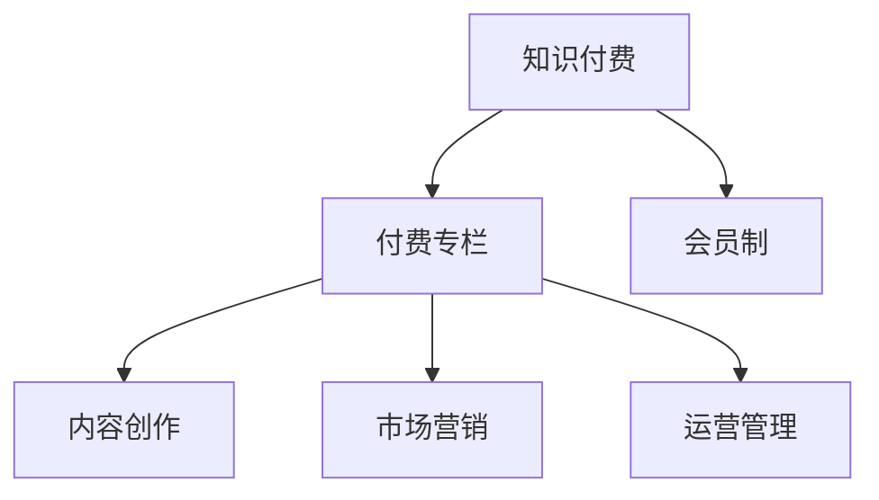

                 

# 如何打造知识付费的付费专栏

> 关键词：知识付费,付费专栏,在线教育,订阅制,会员制,用户粘性,课程定制,内容创作,市场营销,运营管理

## 1. 背景介绍

### 1.1 问题由来
在数字化时代，互联网内容生产者的机会与挑战并存。一方面，随着自媒体、短视频等新兴内容的崛起，内容创作的门槛大幅降低，人人皆可成为创作者，推动了内容产品的极大丰富；另一方面，随着信息爆炸的加剧，用户注意力愈发分散，优质内容的稀缺性和识别难度随之增加，同时，版权保护和收益机制的不完善，也在一定程度上抑制了内容创作者的积极性。

在这样的背景下，知识付费应运而生，它不仅为内容创作者提供了一种新的收入方式，也为用户获取专业、系统、优质内容开辟了新的渠道。其中，付费专栏作为知识付费的重要形式之一，因其高效、便捷、个性化强等特点，深受用户和内容创作者欢迎。本文将深入探讨如何打造高质量、高粘性、高变现能力的付费专栏，以助力内容创作者实现商业化转型，同时为用户带来真正有价值的知识服务。

### 1.2 问题核心关键点
要打造成功的付费专栏，需要从内容、平台、用户、运营等多个维度进行全面设计和优化。核心关键点包括：
1. 明确目标用户群体，并设计符合其需求的专栏内容。
2. 构建便捷、高效的订阅平台，并提供多种订阅模式，提升用户粘性和平台转化率。
3. 持续优化课程内容和形式，提升用户体验和满意度。
4. 引入有效的用户运营和社群管理策略，增强用户参与和互动。
5. 制定合理的收益分配机制，激励内容创作者，同时确保平台的可持续发展。

本文将逐一分析这些关键点，并给出系统化的策略和解决方案。

## 2. 核心概念与联系

### 2.1 核心概念概述

为更好地理解打造付费专栏的方法，本节将介绍几个密切相关的核心概念：

- **知识付费(Knowledge-Paid Content, KPC)**：指用户为获取高质量、专业化的知识和信息，愿意付费的一种内容消费模式。知识付费强调知识价值，重视内容品质和用户的学习效果。

- **付费专栏(Paid Subscription Column)**：即订阅制的知识服务产品，用户通过支付一定的费用，获取特定时间段内的独家内容访问权。付费专栏内容丰富多样，形式灵活，能够满足用户个性化的学习需求。

- **会员制(Membership Model)**：指用户通过缴纳会员费，获得一定期限内所有专栏内容的访问权限。会员制的特点是长期稳定，用户粘性高，适合深度学习、系统课程等内容的长期学习。

- **内容创作(Content Creation)**：指创作者通过撰写、拍摄、录制等方式，制作专业、有价值的内容。内容创作是付费专栏的核心，内容质量直接决定了用户的满意度和平台的用户粘性。

- **市场营销(Market Marketing)**：指通过多种渠道和手段，推广付费专栏，吸引更多用户订阅。市场营销的成功与否，直接决定了平台的流量和收益。

- **运营管理(Operation Management)**：指对付费专栏进行持续的优化和调整，提升用户体验，提高平台运营效率。运营管理的精细化程度，直接决定了平台的用户留存率和收益能力。

这些核心概念之间的逻辑关系可以通过以下Mermaid流程图来展示：



这个流程图展示的知识付费的各个关键组成要素，以及它们之间的联系和互动。

## 3. 核心算法原理 & 具体操作步骤

### 3.1 算法原理概述

打造付费专栏的核心在于如何高效、精准地匹配内容创作者和用户，以及如何通过多种订阅模式提升用户粘性和平台收益。

形式化地，假设平台用户集为 $U$，创作者集为 $C$，专栏内容集为 $S$，用户订阅专栏的方式有 $M$ 种。设用户的订阅行为为 $U^S \times M$，即用户对专栏内容的访问方式。付费专栏的成功与否，取决于以下三类决策：

1. 如何从创作者集合 $C$ 中选择高质量的内容创作者 $C^*$。
2. 如何从内容集合 $S$ 中选择合适的专栏内容 $S^*$。
3. 如何通过订阅模式 $M^*$ 满足用户需求，并最大化平台收益 $R$。

通过这些决策，可以实现对内容创作者和用户的精准匹配，提升用户粘性和平台收益。

### 3.2 算法步骤详解

基于上述决策，打造付费专栏的具体步骤如下：

**Step 1: 用户分析与细分**

- 定义目标用户群体，如职场新人、IT从业者、学生等。
- 通过问卷调查、数据分析等方式，了解用户的学习需求和偏好。
- 将用户进行细分，如按照学习阶段、专业领域等维度进行分类。

**Step 2: 创作者招募与管理**

- 制定创作者招募标准，如专业背景、内容质量等。
- 通过平台自营或与第三方机构合作，招募高质量创作者。
- 提供创作者管理工具，如内容管理系统、收益分配系统等，帮助创作者高效创作和管理内容。

**Step 3: 内容设计**

- 根据目标用户群体的需求，设计专栏内容，如技术教程、职场指南、健康生活等。
- 采用多种形式，如文字、视频、音频等，提升内容的吸引力。
- 定期更新内容，保持专栏的新鲜感和用户兴趣。

**Step 4: 订阅模式设计**

- 设计多种订阅模式，如单月订阅、季度订阅、年度订阅等。
- 根据不同订阅模式，设置不同的价格和福利，满足不同用户的需求。
- 引入限时优惠、折扣等激励机制，提升用户转化率。

**Step 5: 平台运营**

- 建立便捷的订阅系统，支持多种支付方式和用户管理。
- 提供数据分析工具，跟踪用户订阅行为和内容消费情况。
- 定期评估用户满意度，根据反馈调整内容和服务。

**Step 6: 市场营销与推广**

- 利用社交媒体、搜索引擎等渠道，推广付费专栏。
- 通过内容营销、用户体验分享等方式，提升平台的知名度和美誉度。
- 建立合作推广机制，与知名人士、品牌等合作，扩大平台影响力和用户基础。

### 3.3 算法优缺点

打造付费专栏的方法具有以下优点：
1. 精准匹配用户需求，提高用户满意度和粘性。
2. 多订阅模式设计，满足不同用户的需求和支付能力。
3. 通过创作者激励机制，促进优质内容创作。
4. 通过市场营销和数据分析，提升平台流量和收益。

同时，该方法也存在一些局限性：
1. 内容创作成本高，需要高质量的创作者和专业内容管理系统。
2. 用户需求多样，需要不断优化订阅模式和用户体验。
3. 市场竞争激烈，需要持续的推广和运营支持。
4. 数据分析和用户反馈处理复杂，需要专业的运营团队。

尽管如此，基于订阅制的付费专栏模式仍是大规模、系统化知识付费的重要形式，通过精心设计和运营，可以显著提升用户的支付意愿和学习效果。

### 3.4 算法应用领域

付费专栏的应用领域极为广泛，几乎覆盖了所有行业领域的专业知识分享。例如：

- **职场培训**：职场新人、IT从业者、管理人员等，通过订阅职场技巧、项目管理、团队协作等专栏，提升职业技能。
- **健康生活**：运动爱好者、饮食专家、心理健康专家等，通过订阅健康饮食、健身指导、心理健康等内容，提升生活质量。
- **技术开发**：软件开发人员、数据科学家、AI工程师等，通过订阅技术教程、编程技巧、开源项目等内容，提升技术水平。
- **艺术创作**：艺术家、设计师、文学爱好者等，通过订阅艺术理论、设计思路、文学鉴赏等内容，提升创作能力。
- **金融理财**：投资者、财务人员、理财顾问等，通过订阅金融分析、投资策略、理财规划等内容，提升财务素养。

除了上述这些领域，付费专栏还可以扩展到更多领域，为各行各业的知识分享和教育培训提供新途径。

## 4. 数学模型和公式 & 详细讲解 & 举例说明

### 4.1 数学模型构建

在打造付费专栏的过程中，可以构建一个简单的数学模型来描述用户与内容的关系。设用户 $u$ 订阅了 $s$ 个专栏，对专栏内容的满意程度为 $R_{u,s}$，则用户的总满意度 $U$ 可以表示为：

$$
U = \sum_{u \in U} \sum_{s \in S} R_{u,s} \times p_{u,s}
$$

其中 $p_{u,s}$ 为订阅行为的概率，可通过数据分析或问卷调查得到。目标是最小化用户不满意度，即最大化总满意度 $U$。

### 4.2 公式推导过程

为了最大化总满意度 $U$，需要优化订阅行为的概率 $p_{u,s}$。引入Lagrange乘子 $\lambda$，构建优化目标函数：

$$
\mathcal{L}(R, p, \lambda) = \sum_{u \in U} \sum_{s \in S} R_{u,s} \times p_{u,s} - \lambda \left(\sum_{u \in U} \sum_{s \in S} p_{u,s} - 1\right)
$$

根据一阶条件，求解上述优化问题，得：

$$
\frac{\partial \mathcal{L}}{\partial p_{u,s}} = R_{u,s} - \lambda = 0
$$

解得：

$$
p_{u,s} = \frac{R_{u,s}}{\sum_{s' \in S} R_{u,s'}}
$$

即用户对每个专栏的订阅概率等于其满意程度除以所有专栏满意程度的总和。

### 4.3 案例分析与讲解

假设某付费专栏平台上有两种订阅模式：单月订阅和季度订阅。设用户对单月订阅的满意程度为0.8，对季度订阅的满意程度为0.6，则用户对这两种订阅模式的期望满意度为：

$$
E[U] = 0.8 \times 0.3 + 0.6 \times 0.7 = 0.66
$$

其中0.3和0.7为用户订阅单月和季度订阅的概率。若用户满意度提升至0.85，则期望满意度提升至：

$$
E[U'] = 0.85 \times 0.3 + 0.6 \times 0.7 = 0.7
$$

这表明通过优化订阅模式和提升内容质量，可以显著提升用户满意度，进而增加平台收益。

## 5. 项目实践：代码实例和详细解释说明

### 5.1 开发环境搭建

在进行付费专栏的开发实践前，需要先准备好开发环境。以下是使用Python进行Flask框架开发的环境配置流程：

1. 安装Anaconda：从官网下载并安装Anaconda，用于创建独立的Python环境。

2. 创建并激活虚拟环境：
```bash
conda create -n flask-env python=3.8 
conda activate flask-env
```

3. 安装Flask：
```bash
pip install flask
```

4. 安装SQLite：
```bash
pip install flask_sqlalchemy
```

5. 安装Gunicorn：
```bash
pip install gunicorn
```

6. 安装Flask-Admin：
```bash
pip install flask-admin
```

完成上述步骤后，即可在`flask-env`环境中开始开发实践。

### 5.2 源代码详细实现

下面以一个简单的订阅系统为例，给出使用Flask框架进行开发实现的代码。

首先，定义Flask应用和SQLAlchemy模型：

```python
from flask import Flask, render_template, request, redirect, url_for
from flask_sqlalchemy import SQLAlchemy

app = Flask(__name__)
app.config['SQLALCHEMY_DATABASE_URI'] = 'sqlite:///database.db'
app.config['SECRET_KEY'] = 'secret_key'
db = SQLAlchemy(app)
```

然后，定义用户和专栏模型：

```python
class User(db.Model):
    id = db.Column(db.Integer, primary_key=True)
    name = db.Column(db.String(50))
    email = db.Column(db.String(120), unique=True)

class Subscription(db.Model):
    id = db.Column(db.Integer, primary_key=True)
    user_id = db.Column(db.Integer, db.ForeignKey('user.id'))
    subscription_mode = db.Column(db.String(20))
    subscription_start = db.Column(db.DateTime)
    subscription_end = db.Column(db.DateTime)

class Content(db.Model):
    id = db.Column(db.Integer, primary_key=True)
    title = db.Column(db.String(100))
    content = db.Column(db.Text)
    subscription_id = db.Column(db.Integer, db.ForeignKey('subscription.id'))
```

接下来，定义Flask路由和视图函数：

```python
@app.route('/')
def index():
    users = User.query.all()
    subscriptions = Subscription.query.all()
    contents = Content.query.all()
    return render_template('index.html', users=users, subscriptions=subscriptions, contents=contents)

@app.route('/subscribe', methods=['GET', 'POST'])
def subscribe():
    if request.method == 'POST':
        user = User.query.filter_by(email=request.form['email']).first()
        subscription_mode = request.form['subscription_mode']
        subscription_start = datetime.datetime.now()
        subscription_end = subscription_start + timedelta(days=30)
        subscription = Subscription(user_id=user.id, subscription_mode=subscription_mode, subscription_start=subscription_start, subscription_end=subscription_end)
        db.session.add(subscription)
        db.session.commit()
        return redirect(url_for('index'))
    return render_template('subscribe.html')
```

最后，运行Flask应用：

```bash
if __name__ == '__main__':
    db.create_all()
    app.run(debug=True)
```

以上就是使用Flask框架进行订阅系统开发的完整代码实现。可以看到，通过Flask框架，开发者可以相对简洁地实现用户管理、订阅管理、内容管理等功能。

### 5.3 代码解读与分析

让我们再详细解读一下关键代码的实现细节：

**SQLAlchemy模型定义**：
- `User`模型表示用户信息，包括ID、姓名、邮箱等字段。
- `Subscription`模型表示订阅信息，包括ID、用户ID、订阅模式、起始时间、结束时间等字段。
- `Content`模型表示专栏内容，包括ID、标题、内容、订阅ID等字段。

**Flask路由和视图函数**：
- `index`函数：获取所有用户、订阅和内容，渲染页面展示。
- `subscribe`函数：处理用户订阅逻辑，将订阅信息保存到数据库，并重定向回首页。

**运行Flask应用**：
- 通过`db.create_all()`创建数据库表。
- 通过`app.run(debug=True)`启动Flask应用，并开启调试模式。

在实际开发中，还需要考虑用户验证、权限控制、数据安全等高级功能。Flask框架提供了丰富的扩展库和中间件，支持开发者进行便捷的二次开发。

## 6. 实际应用场景

### 6.1 在线教育平台

在线教育平台通过付费专栏为用户提供专业、系统、个性化的学习内容。例如，某编程教育平台可以设计多门技术课程，如Python、Java、机器学习等，用户可根据自身需求选择订阅，获得视频、代码、作业、答疑等服务。平台通过定期更新课程内容，保持专栏的吸引力和用户粘性。

在技术实现上，平台需要具备用户管理、课程设计、订阅管理、内容分发等功能。用户可以通过社交媒体、搜索引擎、推荐系统等渠道了解课程信息，通过平台订阅并进行学习。平台还需要引入效果评估和反馈机制，根据用户的学习数据和满意度，进行内容优化和调整。

### 6.2 专业资讯平台

专业资讯平台通过付费专栏提供行业动态、技术趋势、市场分析等内容。例如，某科技资讯平台可以设计多个专栏，涵盖人工智能、大数据、云计算等热点领域，用户通过订阅获得深度分析和独家报道。平台通过与专家、学者、机构等合作，获取高质量的内容资源。

在技术实现上，平台需要具备内容创作、订阅管理、数据监控等功能。用户可以通过新闻推荐、热门话题、标签检索等方式获取专栏内容，参与讨论和互动。平台还需要引入算法推荐和内容审核机制，提升用户粘性和内容质量。

### 6.3 在线社区平台

在线社区平台通过付费专栏提供知识分享、经验交流、技能提升等服务。例如，某技术社区可以设计多个技术专栏，涵盖编程技巧、项目实战、技术栈等主题，用户通过订阅获得系统学习、技术支持、交流互动等资源。平台通过鼓励用户创作和分享，形成良性循环，增加用户粘性。

在技术实现上，平台需要具备用户管理、内容创作、互动交流等功能。用户可以通过论坛、博客、问答等方式参与专栏讨论，通过平台获取资源和支持。平台还需要引入社区管理、内容审核机制，维护良好的互动氛围和内容质量。

### 6.4 未来应用展望

随着技术的发展和用户需求的多样化，付费专栏的应用场景将更加广泛和深入。

- **个性化推荐系统**：通过深度学习和大数据分析，为用户推荐个性化订阅方案，提升用户体验和满意度。
- **多模态内容创作**：结合视频、音频、图文等多种形式，提升内容表现力和用户沉浸感。
- **智能内容生成**：通过自然语言处理技术，自动生成部分专栏内容，降低创作者劳动强度。
- **实时内容更新**：利用实时数据和流媒体技术，动态更新专栏内容，保持信息的时效性。
- **社交互动功能**：增加用户之间的互动和交流，提升用户粘性和社区氛围。
- **跨平台支持**：实现多终端、多设备支持，提升用户的使用便捷性和体验。

未来，付费专栏将不仅是一种内容消费模式，更将成为知识分享和社区互动的重要平台，为各行各业的知识创新和技能提升提供新的途径。

## 7. 工具和资源推荐

### 7.1 学习资源推荐

为了帮助开发者系统掌握付费专栏的开发方法和技术，这里推荐一些优质的学习资源：

1. **《Flask Web Development》**：一本经典的Flask开发指南，详细介绍了Flask框架的使用方法和最佳实践。
2. **《Python Web Development with Flask》**：一本Python Web开发教程，涵盖Flask基础、高级特性和实战项目。
3. **《Python for Data Science》**：一本Python数据科学入门书籍，涵盖数据处理、机器学习、数据分析等技术。
4. **《Natural Language Processing with Python》**：一本自然语言处理教程，涵盖文本处理、情感分析、机器翻译等技术。
5. **Coursera、Udacity等在线课程**：多个高质量的在线课程平台，提供Flask、Python、数据科学等课程，帮助开发者提升技术水平。

通过这些资源的学习，相信你一定能够快速掌握付费专栏的开发方法和技术，实现商业化转型。

### 7.2 开发工具推荐

高效的开发离不开优秀的工具支持。以下是几款用于付费专栏开发的常用工具：

1. **Flask**：基于Python的轻量级Web框架，灵活易用，适合快速迭代研究。
2. **SQLite**：轻量级数据库，适合小型应用和开发环境。
3. **Gunicorn**：基于GEVENT的Python Web服务器，支持异步I/O和长连接处理。
4. **Flask-Admin**：Flask框架的内置管理扩展，提供便捷的后台管理界面。
5. **Pandas、NumPy**：数据处理和分析库，适合数据分析和处理任务。
6. **Scikit-Learn**：机器学习库，适合构建推荐系统、效果评估等任务。
7. **TensorFlow、PyTorch**：深度学习框架，适合构建智能推荐和数据分析模型。

合理利用这些工具，可以显著提升付费专栏的开发效率，加快创新迭代的步伐。

### 7.3 相关论文推荐

付费专栏的发展源于学界的持续研究。以下是几篇奠基性的相关论文，推荐阅读：

1. **《A Survey on Recommendation Systems Based on Social Media Platforms》**：介绍了基于社交媒体的推荐系统，涵盖内容推荐、用户推荐等方向。
2. **《Natural Language Processing with PyTorch》**：介绍了PyTorch在自然语言处理中的应用，涵盖文本分类、情感分析、文本生成等任务。
3. **《Reinforcement Learning for Content Personalization》**：介绍了强化学习在内容个性化推荐中的应用，提供了一种动态调整推荐策略的方法。
4. **《Building a Recommendation System with Flask》**：介绍了如何使用Flask框架构建推荐系统，提供了一种实用的开发方法。

这些论文代表了大语言模型微调技术的发展脉络。通过学习这些前沿成果，可以帮助研究者把握学科前进方向，激发更多的创新灵感。

## 8. 总结：未来发展趋势与挑战

### 8.1 总结

本文对打造付费专栏的方法进行了全面系统的介绍。首先阐述了付费专栏在知识付费中的重要地位，明确了其目标用户群体和需求。其次，从用户分析、创作者招募、内容设计、订阅模式、平台运营等多个维度，详细讲解了付费专栏的构建步骤和关键技术。最后，探讨了付费专栏在在线教育、专业资讯、在线社区等实际应用场景中的应用前景，并展望了未来的发展趋势和挑战。

通过本文的系统梳理，可以看到，通过精心设计和运营，付费专栏不仅可以为用户带来真正有价值的知识服务，还能为内容创作者提供稳定的收入来源。未来，随着技术的发展和用户需求的多样化，付费专栏将呈现更多元、更灵活、更个性化的发展趋势，为各行各业的知识分享和教育培训提供新的途径。

### 8.2 未来发展趋势

展望未来，付费专栏将呈现以下几个发展趋势：

1. **个性化推荐系统**：基于深度学习和大数据分析，构建用户画像，提供个性化的订阅方案，提升用户体验和满意度。
2. **多模态内容创作**：结合视频、音频、图文等多种形式，提升内容表现力和用户沉浸感。
3. **智能内容生成**：通过自然语言处理技术，自动生成部分专栏内容，降低创作者劳动强度。
4. **实时内容更新**：利用实时数据和流媒体技术，动态更新专栏内容，保持信息的时效性。
5. **社交互动功能**：增加用户之间的互动和交流，提升用户粘性和社区氛围。
6. **跨平台支持**：实现多终端、多设备支持，提升用户的使用便捷性和体验。

这些趋势将推动付费专栏向更高层次的智能化、个性化、社交化发展，为内容创作者和用户提供更优质的服务和体验。

### 8.3 面临的挑战

尽管付费专栏在知识付费领域取得了显著成就，但在迈向更加智能化、普适化应用的过程中，仍面临诸多挑战：

1. **内容创作成本高**：高质量的创作者和专业内容管理系统是前提，但内容创作成本较高，需要投入大量时间和精力。
2. **用户需求多样**：不同用户的需求和支付能力各异，需要不断优化订阅模式和用户体验。
3. **市场竞争激烈**：内容同质化现象严重，平台需要持续的推广和运营支持，才能保持竞争力。
4. **数据安全和隐私保护**：平台需要严格的数据安全管理和隐私保护措施，防止用户数据泄露和滥用。
5. **算法复杂性**：深度学习和大数据分析需要高水平的算法和模型，平台需要具备相关技术和资源。

正视这些挑战，积极应对并寻求突破，将是大语言模型微调走向成熟的必由之路。相信随着学界和产业界的共同努力，这些挑战终将一一被克服，付费专栏必将在构建人机协同的智能时代中扮演越来越重要的角色。

### 8.4 研究展望

面对付费专栏面临的种种挑战，未来的研究需要在以下几个方面寻求新的突破：

1. **内容创作自动化**：通过自然语言生成、计算机视觉等技术，实现内容自动创作和优化，降低创作成本，提升创作效率。
2. **用户需求自适应**：利用用户行为数据和机器学习技术，动态调整订阅方案和内容推送，满足不同用户的需求和兴趣。
3. **市场竞争智能化**：通过推荐系统、广告投放等手段，实现精准营销，提高平台流量和用户转化率。
4. **数据安全与隐私保护**：引入区块链、加密等技术，保障用户数据的安全和隐私。
5. **算法效率优化**：优化深度学习模型的计算图和存储方式，提升模型的训练速度和推理效率。
6. **跨平台协作**：实现内容和服务在不同平台之间的无缝切换和协同，提升用户体验。

这些研究方向将引领付费专栏技术迈向更高的台阶，为内容创作者和用户提供更优质的服务和体验，推动知识付费领域的发展和进步。

## 9. 附录：常见问题与解答

**Q1：如何确保付费专栏的内容质量？**

A: 确保付费专栏的内容质量，需要从多个方面进行把控：
1. 引入高质量的创作者和内容管理系统，提升内容创作效率和质量。
2. 制定严格的内容审核机制，防止低质量、违规内容发布。
3. 引入用户评价和反馈机制，及时发现和修正内容问题。
4. 引入数据驱动的内容优化机制，根据用户反馈和数据分析，不断优化内容。

**Q2：如何提升用户的订阅粘性？**

A: 提升用户订阅粘性，可以从以下几个方面入手：
1. 提供高质量、有价值的内容，满足用户的学习需求。
2. 设计灵活的订阅模式，让用户可以根据自己的需求和支付能力选择订阅。
3. 引入智能推荐和个性化内容推送，提升用户的使用体验和满意度。
4. 增加用户互动和交流功能，增强社区氛围和用户粘性。

**Q3：如何评估付费专栏的效果？**

A: 评估付费专栏的效果，需要从多个维度进行综合评估：
1. 用户满意度：通过问卷调查、用户反馈等方式，评估用户对专栏的满意度。
2. 用户留存率：统计用户订阅和续订的情况，评估用户留存率。
3. 用户转化率：统计新用户订阅的情况，评估转化率。
4. 用户活跃度：统计用户活跃度和内容消费情况，评估用户参与度。
5. 内容质量：通过数据分析和用户评价，评估内容的质量和效果。

**Q4：如何应对市场竞争？**

A: 应对市场竞争，需要从以下几个方面进行策略优化：
1. 提供高质量、有竞争力的内容和服务，吸引更多用户订阅。
2. 引入精准的市场营销策略，通过多种渠道和手段推广付费专栏。
3. 引入广告投放和付费推荐机制，提升平台流量和收益。
4. 通过内容优化和创新，不断提升平台的核心竞争力。

这些问题的答案可以帮助你更好地理解付费专栏的构建方法和运营策略，提升平台的用户体验和收益能力。

---

作者：禅与计算机程序设计艺术 / Zen and the Art of Computer Programming

