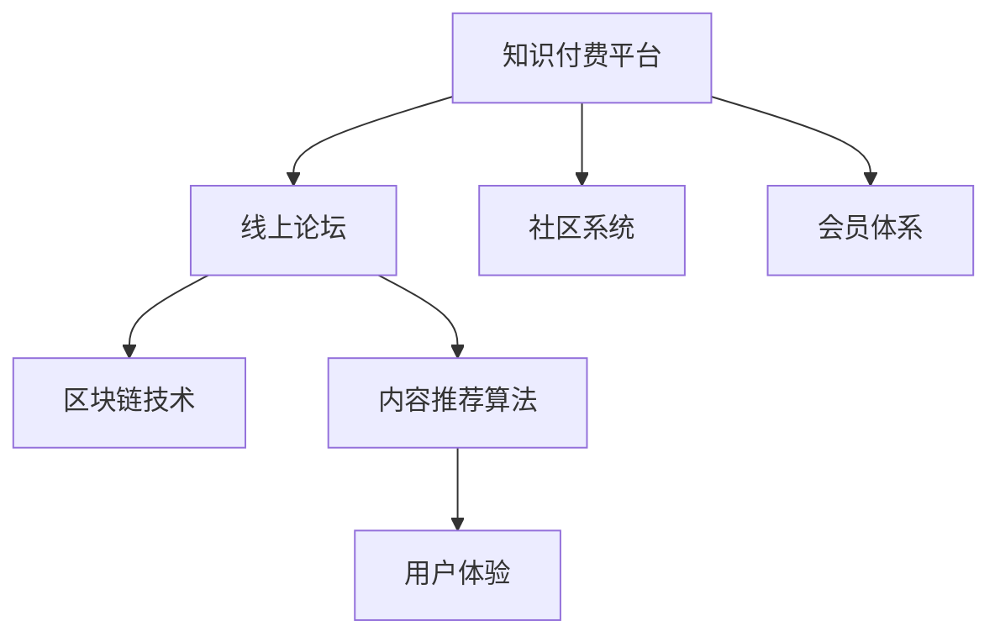

                 

# 如何打造知识付费的线上论坛

> 关键词：知识付费、线上论坛、社区系统、会员体系、区块链技术、内容推荐、用户体验

## 1. 背景介绍

在数字化时代，知识付费已经成为了一个快速成长的商业模式。随着互联网技术的不断进步，知识付费平台也逐渐从单一的线上课程销售，发展到包括直播、问答、社群等多种形式。而线上论坛作为一种灵活、互动性强的知识传播方式，正在成为知识付费领域的新宠。

在构建知识付费的线上论坛时，需要充分考虑论坛的特点和用户需求。论坛不仅仅是信息的发布平台，更是一个社区系统，需要构建完整的会员体系，提供高质量的内容，并通过推荐算法来提升用户体验。

本文章将详细介绍如何基于现有的技术和工具，打造一个高互动、高品质的知识付费线上论坛，覆盖社区搭建、会员管理、内容推荐等多个方面，为开发人员提供一份完整的技术参考。

## 2. 核心概念与联系

### 2.1 核心概念概述

为了更好地理解知识付费线上论坛的构建，本节将介绍几个核心概念及其相互联系：

- **知识付费平台**：通过售卖线上课程、知识服务等方式，将知识产品化和商业化的平台。包括线上课程、直播课程、问答服务等多种形式。

- **线上论坛**：一种通过互联网提供用户互动交流的社交平台。用户在论坛中发布帖子、评论、点赞等，形成社区。

- **社区系统**：包含用户管理、内容发布、讨论互动等功能的系统，通过构建用户关系网络，增强用户粘性。

- **会员体系**：为在线论坛提供付费会员的运营模式，通过会员等级、积分、特权等手段，提升用户忠诚度和参与度。

- **区块链技术**：通过去中心化、不可篡改的特点，提供社区信任和透明度，保障用户的权益和数据安全。

- **内容推荐算法**：通过分析用户行为、内容特征等，为每个用户推荐最相关的帖子、文章等，提升用户体验。

- **用户体验**：衡量用户对论坛的满意度，包括易用性、互动性、内容丰富度等，是论坛成功的关键因素。

这些核心概念之间有着紧密的联系，共同构成了知识付费线上论坛的基石。

### 2.2 核心概念原理和架构的 Mermaid 流程图



这个流程图展示了大语言模型的核心概念及其之间的关系：

1. 知识付费平台提供论坛的基础服务。
2. 社区系统负责论坛的运营，包含用户管理、内容发布等。
3. 会员体系为论坛提供运营收入，增强用户粘性。
4. 区块链技术保障论坛的透明性和用户权益。
5. 内容推荐算法提升用户体验，吸引用户参与。
6. 用户体验的好坏直接决定论坛的生命力和持续发展能力。

## 3. 核心算法原理 & 具体操作步骤

### 3.1 算法原理概述

知识付费的线上论坛的构建，涉及多个技术和算法的融合。核心算法原理包括以下几个方面：

1. **社区系统构建**：通过用户注册、认证、社交网络等机制，构建一个健康的在线社区。

2. **会员体系设计**：设计合理的会员等级、积分、特权体系，吸引用户加入并持续参与。

3. **区块链技术应用**：利用区块链的去中心化、透明性等特性，保障用户数据安全和交易透明。

4. **内容推荐算法**：通过分析用户行为、内容特征等，为用户推荐最相关的帖子、文章，提升用户体验。

5. **用户体验优化**：通过界面设计、交互优化等手段，提升论坛的易用性和互动性。

### 3.2 算法步骤详解

#### 3.2.1 社区系统构建

1. **用户注册与认证**：
   - 提供手机号、邮箱等多种注册方式，确保用户身份真实性。
   - 使用验证码、短信验证等方式进行身份确认。
   - 支持社交媒体账号登录，简化注册流程。

2. **用户管理**：
   - 用户信息管理：包括用户昵称、头像、简介等。
   - 用户权限管理：设置管理员、版主、普通用户等不同角色。
   - 用户行为管理：记录用户在论坛中的点赞、评论、发表等行为。

3. **社交网络构建**：
   - 好友关系管理：允许用户添加好友、关注社区。
   - 社交网络推荐：根据用户兴趣推荐好友，形成社交网络。

#### 3.2.2 会员体系设计

1. **会员等级设计**：
   - 设置会员等级，如VIP、SVIP、VVIP等。
   - 各等级会员享有不同特权，如免费文章、专属内容等。

2. **积分系统**：
   - 根据用户在论坛中的行为（如发帖、评论、点赞等）给予积分奖励。
   - 积分可用于兑换会员等级、礼品等。

3. **特权体系**：
   - 提供专属广告、限时优惠等特权，吸引用户付费升级。

#### 3.2.3 区块链技术应用

1. **用户身份认证**：
   - 利用区块链的不可篡改性，确保用户身份的真实性和不可伪造性。
   - 用户注册时，将身份信息写入区块链，供论坛验证。

2. **交易记录透明**：
   - 将用户的付费记录、积分兑换记录等写入区块链，确保交易透明。
   - 用户可以随时查看自己的交易历史。

3. **防止欺诈**：
   - 利用区块链的共识机制，防止假冒用户、恶意交易等欺诈行为。
   - 社区管理员可快速定位并处理欺诈行为。

#### 3.2.4 内容推荐算法

1. **用户画像构建**：
   - 根据用户的行为数据，构建用户画像。
   - 用户画像包括用户兴趣、活跃时间、互动行为等。

2. **内容特征分析**：
   - 分析帖子、文章等内容特征，如关键词、作者、发布时间等。
   - 利用自然语言处理技术，提取内容主题和情感等信息。

3. **推荐算法设计**：
   - 基于协同过滤、基于内容的推荐算法等，为用户推荐最相关的内容。
   - 采用矩阵分解、深度学习等方法，提升推荐精度。

#### 3.2.5 用户体验优化

1. **界面设计**：
   - 设计简洁、易用的用户界面，提升用户体验。
   - 提供搜索、筛选、分页等功能，帮助用户快速找到所需信息。

2. **交互优化**：
   - 采用异步加载、懒加载等技术，提升页面加载速度。
   - 通过轮询、WebSocket等技术，实现实时互动。

3. **内容丰富度提升**：
   - 引入专家、学者等高质量内容创作者，提升论坛内容丰富度。
   - 定期举办线上活动、话题讨论等，吸引用户参与。

### 3.3 算法优缺点

#### 3.3.1 社区系统构建

**优点**：
- 提供了完整的用户管理功能，确保社区健康有序。
- 利用区块链技术，保障用户数据安全和交易透明。

**缺点**：
- 用户注册、认证流程较为繁琐，可能影响用户参与度。
- 社区管理成本较高，需要专门人员维护。

#### 3.3.2 会员体系设计

**优点**：
- 通过会员等级和积分系统，增强用户粘性和忠诚度。
- 提供了多样化的特权，吸引用户付费升级。

**缺点**：
- 会员体系设计复杂，需要持续运营维护。
- 价格策略不当可能导致用户流失。

#### 3.3.3 区块链技术应用

**优点**：
- 利用区块链技术，保障用户数据安全和交易透明。
- 防止假冒用户、恶意交易等欺诈行为。

**缺点**：
- 区块链技术的部署和维护成本较高。
- 区块链交易速度较慢，可能影响用户体验。

#### 3.3.4 内容推荐算法

**优点**：
- 通过推荐算法，提升用户体验，吸引用户参与。
- 提升内容曝光度，扩大论坛影响力。

**缺点**：
- 算法设计复杂，需要大量数据训练和优化。
- 算法效果受数据质量影响较大。

#### 3.3.5 用户体验优化

**优点**：
- 通过界面设计、交互优化等手段，提升论坛的易用性和互动性。
- 提升用户满意度，增强社区粘性。

**缺点**：
- 用户界面设计和交互优化需要持续迭代改进。
- 内容丰富度提升需要大量资源和时间投入。

### 3.4 算法应用领域

知识付费的线上论坛在教育、培训、技术交流等多个领域有着广泛应用：

1. **教育培训**：
   - 提供线上课程、直播课程，吸引学习用户。
   - 利用会员体系和积分系统，提升用户参与度。

2. **技术交流**：
   - 构建技术社区，提供技术讨论、代码分享等。
   - 利用内容推荐算法，提高内容曝光度和互动性。

3. **创业投资**：
   - 提供创业、投资、融资等领域的讨论和分享。
   - 利用会员体系和区块链技术，保障交易透明和安全。

4. **娱乐休闲**：
   - 提供读书、观影、游戏等娱乐内容。
   - 利用推荐算法，提升用户互动和粘性。

以上应用场景展示了知识付费线上论坛的多样性和灵活性，通过合理设计和运营，可以在多个领域实现商业价值。

## 4. 数学模型和公式 & 详细讲解 & 举例说明

### 4.1 数学模型构建

在知识付费的线上论坛中，用户画像和内容推荐的构建涉及多个数学模型。以用户画像构建为例，我们可以使用向量空间模型(Vector Space Model, VSM)来表示用户和内容特征。

假设用户画像 $U$ 和内容特征 $C$ 分别表示为 $N$ 维向量，则用户画像和内容特征之间的相似度可以表示为：

$$
\cos(\theta) = \frac{U \cdot C}{||U|| \cdot ||C||}
$$

其中 $\cdot$ 表示向量点乘，$||\cdot||$ 表示向量的范数。

### 4.2 公式推导过程

**用户画像构建**：
- 首先，我们需要将用户的行为数据（如发帖、评论、点赞等）转换为向量表示。
- 然后，利用TF-IDF算法计算每个用户的行为向量。
- 最后，将用户的行为向量归一化，得到用户画像 $U$。

**内容特征分析**：
- 对于帖子、文章等文本内容，我们可以使用NLP技术提取关键词、主题、情感等信息。
- 利用TF-IDF算法计算每个内容的特征向量。
- 将内容的特征向量归一化，得到内容特征 $C$。

**推荐算法设计**：
- 利用余弦相似度计算用户和内容之间的相似度。
- 根据相似度排序，选取最相关的几个内容推荐给用户。

### 4.3 案例分析与讲解

以技术社区为例，我们可以构建一个基于内容的推荐系统。

假设社区中有10000个用户，每个用户发布了5篇技术文章。我们将每篇文章表示为一个长度为100的向量，其中第$i$个元素表示文章中包含第$i$个关键词的概率。

对于用户 $U$，假设其已阅读的前5篇文章的特征向量分别为 $C_1, C_2, C_3, C_4, C_5$。我们可以计算用户 $U$ 与每篇文章 $C$ 的相似度，选择前5篇文章进行推荐。

具体计算步骤如下：

1. 将用户已阅读的文章向量归一化，得到用户画像 $U_1, U_2, U_3, U_4, U_5$。

2. 计算用户画像与每篇文章的余弦相似度，得到 $S_1, S_2, S_3, S_4, S_5$。

3. 选择相似度最高的5篇文章进行推荐。

## 5. 项目实践：代码实例和详细解释说明

### 5.1 开发环境搭建

在开始具体开发之前，需要搭建开发环境。以下是基于Python和Flask框架搭建知识付费论坛的开发环境：

1. 安装Python：从官网下载并安装Python，选择最新版本。

2. 安装Flask：
```bash
pip install flask
```

3. 安装Flask-Login和Flask-WTF等插件：
```bash
pip install flask-login flask-wtf
```

4. 安装Flask-SocketIO：
```bash
pip install flask-socketio
```

5. 安装SQLAlchemy和Flask-Admin等辅助工具：
```bash
pip install sqlalchemy flask-admin
```

完成上述步骤后，即可开始开发知识付费论坛的后台管理系统。

### 5.2 源代码详细实现

以下是一个简单的用户管理系统示例：

**models.py**：
```python
from flask_login import UserMixin
from werkzeug.security import generate_password_hash, check_password_hash

class User(UserMixin, db.Model):
    id = db.Column(db.Integer, primary_key=True)
    username = db.Column(db.String(64), index=True, unique=True)
    password_hash = db.Column(db.String(128))
    active = db.Column(db.Boolean(), default=True)

    def __init__(self, username, password):
        self.username = username
        self.password_hash = generate_password_hash(password)

    def check_password(self, password):
        return check_password_hash(self.password_hash, password)
```

**forms.py**：
```python
from flask_wtf import FlaskForm
from wtforms import StringField, PasswordField, SubmitField
from wtforms.validators import DataRequired, Length, Email, EqualTo

class RegistrationForm(FlaskForm):
    username = StringField('Username', validators=[DataRequired(), Length(min=4, max=64)])
    email = StringField('Email', validators=[DataRequired(), Email()])
    password = PasswordField('Password', validators=[DataRequired()])
    confirm_password = PasswordField('Confirm Password', validators=[DataRequired(), EqualTo('password')])
    submit = SubmitField('Sign Up')
```

**views.py**：
```python
from flask import render_template, redirect, url_for, flash
from flask_login import login_user, logout_user, login_required
from . import auth
from .forms import RegistrationForm
from .models import User

@auth.route('/login', methods=['GET', 'POST'])
def login():
    form = LoginForm()
    if form.validate_on_submit():
        user = User.query.filter_by(username=form.username.data).first_or_404()
        if user.check_password(form.password.data):
            login_user(user)
            return redirect(url_for('index'))
        flash('Invalid password')
    return render_template('login.html', title='Login', form=form)

@auth.route('/logout')
@login_required
def logout():
    logout_user()
    return redirect(url_for('index'))
```

### 5.3 代码解读与分析

在上述代码中，我们使用了Flask、Flask-Login、Flask-WTF等框架和插件，实现了用户注册和登录功能。

**models.py**：
- 定义了User模型，包含id、username、password_hash和active属性。
- 实现了用户注册时自动生成密码哈希值和验证密码的方法。

**forms.py**：
- 定义了注册表单，包含username、email、password和confirm_password字段。
- 使用了wtforms库的验证器，确保输入数据的合法性。

**views.py**：
- 实现了登录和登出功能，使用Flask-Login提供的登录和登出函数。

### 5.4 运行结果展示

运行上述代码后，可以在浏览器中访问 `http://localhost:5000`，看到用户登录和注册页面。成功登录后，可以在主页上看到欢迎信息和菜单。

## 6. 实际应用场景

### 6.1 技术社区

技术社区是知识付费论坛的一个重要应用场景，用户可以在社区中分享技术文章、讨论技术问题、寻找合作伙伴等。技术社区需要构建完整的用户管理和内容推荐机制，以提升用户体验和社区粘性。

以一个虚拟的Python技术社区为例，社区管理员可以设置不同的用户角色，如普通用户、版主、管理员等。用户可以通过发帖、评论、点赞等方式参与社区互动。

**用户管理**：
- 管理员可以对用户进行角色管理，设置用户权限。
- 版主可以审核用户发帖，删除不良内容。

**内容推荐**：
- 利用内容推荐算法，根据用户行为和内容特征，为用户推荐最相关的内容。
- 定期举办技术交流活动、在线直播等，提升用户参与度。

### 6.2 教育平台

教育平台是将知识付费论坛应用到教育领域的一种方式。用户可以在平台上购买在线课程、参加直播讲座、与其他学员互动等。教育平台需要提供高质量的课程资源，并通过会员体系和推荐算法，提升用户满意度和参与度。

**课程管理**：
- 平台管理员可以添加、修改和删除课程资源。
- 课程资源包括视频、音频、文档等，可以按照科目、难度等分类。

**用户管理**：
- 用户可以购买课程、注册学习、参与讨论等。
- 会员体系提供积分、特权等激励措施，提升用户粘性。

### 6.3 投资社区

投资社区是知识付费论坛在金融领域的应用场景之一。用户可以在社区中交流投资心得、分享投资策略、获取最新的市场资讯等。投资社区需要构建完整的用户管理和交易安全机制，保障用户权益和数据安全。

**用户管理**：
- 平台管理员可以审核用户身份，设置交易权限。
- 用户可以参与投资讨论、分享投资心得。

**交易安全**：
- 利用区块链技术，保障交易透明和安全性。
- 社区管理员可以实时监控交易行为，防止欺诈和违规行为。

### 6.4 未来应用展望

随着人工智能和大数据技术的不断发展，知识付费论坛将具备更强的智能推荐和互动能力。未来论坛将利用自然语言处理、图像识别、语音识别等技术，提升内容的丰富度和互动性。

**智能推荐**：
- 利用自然语言处理技术，提取用户行为和内容特征，提升推荐精度。
- 引入图像识别、语音识别等技术，丰富内容形式和互动方式。

**社区智能**：
- 利用智能算法，对社区进行实时监控和分析，预测用户行为和趋势。
- 根据社区分析结果，动态调整内容推荐策略，提升用户满意度。

## 7. 工具和资源推荐

### 7.1 学习资源推荐

为了帮助开发者系统掌握知识付费线上论坛的开发技术，这里推荐一些优质的学习资源：

1. **Flask官方文档**：Flask官网提供的详细文档，涵盖从基础到高级的Flask开发指南。

2. **Flask-SocketIO官方文档**：Flask-SocketIO官网提供的详细文档，涵盖SocketIO的使用方法和API。

3. **SQLAlchemy官方文档**：SQLAlchemy官网提供的详细文档，涵盖数据库操作和ORM框架的使用方法。

4. **Flask-Admin官方文档**：Flask-Admin官网提供的详细文档，涵盖数据管理和后台管理系统的开发方法。

5. **知识付费论坛示例项目**：GitHub上的知识付费论坛示例项目，提供完整的代码和文档，帮助你快速上手。

### 7.2 开发工具推荐

高效的开发离不开优秀的工具支持。以下是几款用于知识付费论坛开发的常用工具：

1. **PyCharm**：一款功能强大的Python开发工具，提供代码高亮、调试、测试等众多功能。

2. **Git**：版本控制系统，方便多人协作开发和代码管理。

3. **Docker**：容器化技术，方便环境部署和扩展。

4. **Kubernetes**：容器编排系统，支持大规模部署和扩展。

5. **JIRA**：项目管理工具，帮助团队协作和任务跟踪。

### 7.3 相关论文推荐

知识付费线上论坛的研究涉及多个领域，以下是几篇奠基性的相关论文，推荐阅读：

1. **《用户画像构建与推荐系统设计》**：介绍用户画像构建和推荐系统设计的基本方法。

2. **《社交网络社区构建与推荐算法》**：探讨社交网络社区的构建和推荐算法的设计。

3. **《区块链技术在知识社区中的应用》**：研究区块链技术在知识社区中的实际应用。

4. **《智能推荐算法及其在知识社区中的应用》**：介绍智能推荐算法及其在知识社区中的应用。

5. **《知识社区的建设与管理》**：探讨知识社区的建设和管理方法。

这些论文代表了大语言模型微调技术的发展脉络。通过学习这些前沿成果，可以帮助研究者把握学科前进方向，激发更多的创新灵感。

## 8. 总结：未来发展趋势与挑战

### 8.1 研究成果总结

本文对知识付费线上论坛的构建进行了全面系统的介绍。首先阐述了论坛的特点和用户需求，明确了社区系统、会员体系、区块链技术等核心概念及其相互联系。其次，从原理到实践，详细讲解了社区系统构建、会员体系设计、内容推荐算法等关键步骤，给出了完整的代码实现示例。最后，本文探讨了论坛在教育、技术交流、投资等多个领域的应用前景，提供了学习资源和开发工具推荐，帮助开发者系统掌握论坛开发技术。

通过本文的系统梳理，可以看到，知识付费线上论坛的构建涉及多个技术和算法的融合，涵盖用户管理、内容推荐、交易安全等多个方面。只有在数据、算法、工程、业务等多个维度协同发力，才能真正实现论坛的成功运营。

### 8.2 未来发展趋势

展望未来，知识付费线上论坛将呈现以下几个发展趋势：

1. **社区智能**：利用人工智能和大数据技术，对社区进行实时监控和分析，提升社区管理和互动效率。

2. **内容多样化**：引入图像、语音、视频等多种内容形式，提升内容的丰富度和互动性。

3. **用户体验优化**：通过界面设计、交互优化等手段，提升论坛的易用性和互动性。

4. **去中心化治理**：利用区块链技术，实现社区的自主治理，提升用户参与度和信任度。

5. **跨平台融合**：将论坛与微信、QQ等社交平台进行融合，扩大论坛的影响力和用户覆盖面。

这些趋势将推动知识付费线上论坛的不断进化，为知识传播和社区互动带来新的突破。

### 8.3 面临的挑战

尽管知识付费线上论坛已经取得了一定的成功，但在迈向更加智能化、普适化应用的过程中，仍面临诸多挑战：

1. **数据安全和隐私保护**：用户数据安全和隐私保护始终是论坛的重大挑战，需要采取多种措施保障用户权益。

2. **算法效率和精度**：内容推荐算法需要高效准确，同时应对大规模用户和内容的动态变化，对算法效率和精度提出了更高要求。

3. **用户体验提升**：论坛的用户体验需要不断优化，确保易用性、互动性和内容丰富度。

4. **跨领域应用**：论坛需要在不同领域中取得成功，需要针对特定领域进行优化和定制。

5. **成本控制**：论坛的运营和维护需要大量成本，如何在不牺牲用户体验的前提下控制成本，是一个重要问题。

### 8.4 研究展望

面对知识付费线上论坛所面临的挑战，未来的研究需要在以下几个方面寻求新的突破：

1. **数据安全和隐私保护**：研究如何利用区块链等技术，保障用户数据安全和隐私保护。

2. **算法效率和精度**：研究如何提高内容推荐算法的效率和精度，提升推荐效果。

3. **用户体验优化**：研究如何通过界面设计、交互优化等手段，提升论坛的易用性和互动性。

4. **跨领域应用**：研究如何针对特定领域进行优化和定制，提升论坛在特定领域的应用效果。

5. **成本控制**：研究如何降低论坛的运营和维护成本，提升社区的经济效益。

这些研究方向的探索，将推动知识付费线上论坛的不断进化，为知识传播和社区互动带来新的突破。

## 9. 附录：常见问题与解答

**Q1：如何实现论坛的实时互动功能？**

A: 实时互动功能可以通过WebSocket协议实现。在前端使用Socket.IO等库，在前端和服务器之间建立WebSocket连接，实现实时消息推送。

**Q2：如何保证论坛的交易安全？**

A: 利用区块链技术，保障论坛的交易透明和安全性。用户和管理员可以实时监控交易行为，防止欺诈和违规行为。

**Q3：论坛的内容推荐算法如何选择？**

A: 选择合适的推荐算法需要根据具体场景和数据特点。常见的推荐算法包括协同过滤、基于内容的推荐、深度学习等。

**Q4：论坛的用户管理如何实现？**

A: 利用Flask-Login等插件，实现用户注册、登录、登出等功能。使用SQLAlchemy等ORM框架，实现用户数据的持久化和查询。

**Q5：论坛的数据安全和隐私保护有哪些措施？**

A: 利用HTTPS协议保障数据传输的安全性。使用Flask-Security等插件，实现用户身份验证和权限管理。

通过本文的系统梳理，可以看到，知识付费线上论坛的构建涉及多个技术和算法的融合，涵盖用户管理、内容推荐、交易安全等多个方面。只有在数据、算法、工程、业务等多个维度协同发力，才能真正实现论坛的成功运营。相信随着技术的不断进步，知识付费线上论坛将会在更多的领域中大放异彩，为知识传播和社区互动带来新的突破。

---

作者：禅与计算机程序设计艺术 / Zen and the Art of Computer Programming

