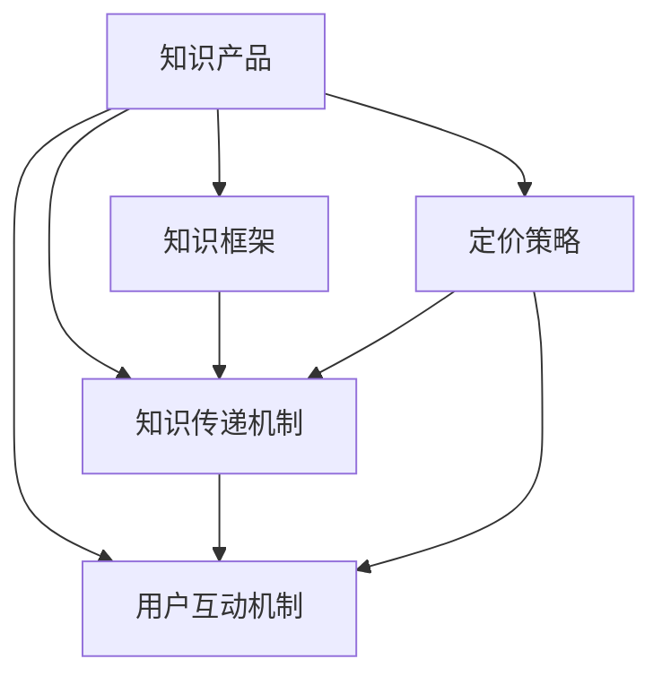

                 

# 如何打造高客单价的程序员知识产品

在当前信息爆炸的时代，程序员知识产品正呈现出井喷式增长。然而，尽管市场上知识产品繁多，真正能够获得用户青睐的却屈指可数。如何在竞争激烈的知识市场中脱颖而出，打造出高客单价的程序员知识产品，是每个产品开发者的重要课题。本文将从核心概念、算法原理、具体实践和未来展望四个方面，系统介绍如何打造高客单价的程序员知识产品。

## 1. 背景介绍

### 1.1 问题由来
程序员知识产品的快速发展，与互联网技术、云服务、人工智能等技术的迅猛发展密切相关。这些技术的进步，让知识的获取和分享变得更加便捷。然而，技术的发展速度超过了大多数知识产品的迭代速度，导致市场上知识产品的质量良莠不齐，用户很难找到真正适合自己的产品。

### 1.2 问题核心关键点
在知识产品开发过程中，开发者需要解决的核心问题包括：
1. 如何设计知识产品的内容框架，使知识结构清晰、内容丰富、易于理解。
2. 如何构建高效的知识传递机制，提高用户的学习效率。
3. 如何建立良好的用户互动机制，提高用户粘性。
4. 如何通过有效的定价策略，最大化用户转化率和留存率。

### 1.3 问题研究意义
打造高客单价的程序员知识产品，有助于提升行业知识水平，促进技术进步。通过高质量的知识产品，可以吸引用户支付更高的价格，从而实现更高的商业价值。同时，也能帮助用户更好地掌握新技术，提高工作效率，提升职业发展潜力。

## 2. 核心概念与联系

### 2.1 核心概念概述

为更好地理解如何打造高客单价的程序员知识产品，本节将介绍几个密切相关的核心概念：

- 知识产品：通过网络技术提供给用户，帮助用户学习和提升知识水平的产品，如在线课程、技术博客、编程资源等。
- 知识框架：对知识进行系统化、结构化的整理，形成清晰的知识体系，帮助用户更好地理解和应用。
- 知识传递机制：将知识以用户容易理解的方式传递给用户，如文本、视频、互动演示等。
- 用户互动机制：通过问答、讨论、协作等形式，建立用户与产品之间的良好互动，提高用户满意度。
- 定价策略：通过合理的定价方式，最大化用户转化率和留存率，提升知识产品的商业价值。

这些核心概念之间的逻辑关系可以通过以下Mermaid流程图来展示：



这个流程图展示了这个体系中的各个模块及其之间的关系：

1. 知识产品基于知识框架设计，其内容框架决定产品的知识结构。
2. 知识传递机制负责将知识以用户易于理解的方式进行传递。
3. 用户互动机制用于加强用户与产品的互动，提高用户满意度。
4. 定价策略用于最大化产品的商业价值。

这些模块相互依赖，共同构成了一个完整的知识产品体系。

## 3. 核心算法原理 & 具体操作步骤
### 3.1 算法原理概述

打造高客单价的程序员知识产品，本质上是一个复杂的系统工程。其核心算法原理包括以下几个方面：

- 知识框架设计：通过自然语言处理(NLP)技术，对海量文本数据进行深度分析和结构化整理，形成系统的知识体系。
- 知识传递机制：结合机器学习算法和可视化技术，构建高效的智能推荐系统，向用户推送个性化知识内容。
- 用户互动机制：利用社交网络分析(SNA)技术，分析用户行为数据，建立社区和社群，增强用户互动和粘性。
- 定价策略：通过A/B测试和多变量回归分析等方法，找到最优的定价策略，最大化商业价值。

### 3.2 算法步骤详解

打造高客单价的程序员知识产品，通常需要以下步骤：

**Step 1: 知识框架设计**
- 收集相关领域的书籍、论文、技术博客、开源项目等文本数据，进行深度学习训练。
- 使用TF-IDF、LDA等算法，对文本进行主题建模，抽取核心概念和关键术语。
- 结合领域专家的意见，构建知识框架，形成系统化的知识体系。

**Step 2: 知识传递机制构建**
- 利用内容推荐算法，如协同过滤、内容基推荐、深度学习等，向用户推送个性化的知识内容。
- 使用视频、动画、互动演示等形式，丰富知识传递方式，提高用户学习效率。
- 引入自适应学习算法，根据用户的学习进度和反馈，动态调整知识传递策略。

**Step 3: 用户互动机制搭建**
- 设计问答系统，支持用户进行问题提出和解答，构建知识互动社区。
- 引入讨论组和协作工具，促进用户之间的交流和协作。
- 通过情感分析和舆情监测，及时调整互动策略，提升用户满意度。

**Step 4: 定价策略制定**
- 采用A/B测试和多变量回归分析等方法，评估不同定价策略的效果。
- 结合用户的付费意愿、订阅时长、知识价值等因素，制定最优的定价策略。
- 提供多种支付方式和付费模式，满足不同用户的需求。

### 3.3 算法优缺点

打造高客单价的程序员知识产品，具有以下优点：

1. 提升知识效率：通过智能推荐和自适应学习算法，提升用户的学习效率和效果。
2. 增强用户粘性：通过社区和社群的构建，提高用户互动和粘性，增强用户留存率。
3. 最大化商业价值：通过合理的定价策略，最大化产品的商业价值。

同时，该方法也存在一定的局限性：

1. 依赖大量数据：知识框架设计和用户互动机制构建，需要大量的数据支撑。
2. 算法复杂度高：知识推荐、情感分析等算法，计算复杂度高，需要强大的计算资源。
3. 初期投入大：产品设计、开发和测试，需要较大的初期投入。
4. 用户支付意愿低：如果产品内容质量不高，用户支付意愿可能较低。

尽管存在这些局限性，但就目前而言，打造高客单价的程序员知识产品仍然是大势所趋。未来相关研究的重点在于如何进一步降低初期投入，提高用户支付意愿，同时兼顾用户互动和粘性等因素。

### 3.4 算法应用领域

高客单价的程序员知识产品，在多个领域都有广泛应用：

- 在线教育：通过知识框架和智能推荐，帮助用户掌握专业知识，提升职业能力。
- 技术博客：提供系统化的技术文章和教程，帮助开发者理解和应用新技术。
- 开源社区：通过社区和社群建设，促进开源项目的协作和交流。
- 企业内训：结合企业需求和员工背景，提供个性化的培训课程，提升团队技术水平。

## 4. 数学模型和公式 & 详细讲解 & 举例说明

### 4.1 数学模型构建

本节将使用数学语言对高客单价的程序员知识产品进行更加严格的刻画。

假设用户数量为 $N$，知识内容的数量为 $M$。用户对知识内容的兴趣可以用向量 $I \in \mathbb{R}^M$ 来表示，其中 $I_i$ 表示用户对第 $i$ 个知识内容的兴趣度。知识内容的价值可以用向量 $V \in \mathbb{R}^M$ 来表示，其中 $V_i$ 表示第 $i$ 个知识内容的价值。用户对知识内容的支付意愿可以用函数 $P: \mathbb{R}^M \rightarrow [0, 1]$ 来表示，其中 $P(I)$ 表示用户对知识内容的支付意愿。

定义知识推荐的收益函数为 $R$，用户支付意愿与知识内容价值的乘积，即 $R = P(I) \cdot V$。知识推荐的成本函数为 $C$，包括数据采集、算法训练、系统维护等成本，可以用函数 $C: \mathbb{R}^M \rightarrow \mathbb{R}$ 来表示。

因此，知识推荐的总收益为 $R$，总成本为 $C$，总收益减去总成本的差值即为知识推荐的净收益。我们的目标是最小化总成本，最大化总收益，即：

$$
\min_{I} C(I), \quad \text{s.t.} \quad R(I) \geq 0
$$

### 4.2 公式推导过程

在上述目标函数中，最大化总收益 $R$ 的子目标是一个典型的多目标优化问题。我们可以将目标函数拆解为两个部分：最大化用户支付意愿 $P(I)$ 和最大化知识内容价值 $V$。

首先，对 $P(I)$ 进行最大化。假设用户对知识内容的兴趣向量 $I$ 通过以下方式生成：

$$
I = f(U, W, D, R)
$$

其中 $U$ 为用户的历史行为数据，$W$ 为知识内容的基本属性数据，$D$ 为知识内容的描述数据，$R$ 为知识内容的推荐数据。通过深度学习模型，我们可以将用户行为和知识内容属性映射到兴趣向量 $I$，进而最大化用户支付意愿 $P(I)$。

其次，对 $V$ 进行最大化。假设知识内容的价值向量 $V$ 通过以下方式生成：

$$
V = g(T, C, R)
$$

其中 $T$ 为知识内容的文本数据，$C$ 为知识内容的代码数据，$R$ 为知识内容的推荐数据。通过自然语言处理和机器学习模型，我们可以将知识内容数据映射到价值向量 $V$，进而最大化知识内容价值 $V$。

综上所述，知识推荐的优化目标函数为：

$$
\max_{I, V} R(I, V) = P(I) \cdot V
$$

### 4.3 案例分析与讲解

以下以在线教育平台为例，具体分析知识推荐系统的实现过程。

首先，假设平台上有100门课程，每位用户对每门课程的兴趣度可以通过以下矩阵表示：

$$
I = \begin{bmatrix} 
I_{1,1} & I_{1,2} & \ldots & I_{1,100} \\
I_{2,1} & I_{2,2} & \ldots & I_{2,100} \\
\vdots & \vdots & \ddots & \vdots \\
I_{N,1} & I_{N,2} & \ldots & I_{N,100}
\end{bmatrix}
$$

其中 $I_{i,j}$ 表示用户 $i$ 对课程 $j$ 的兴趣度。

平台有5个教师，每位教师对每门课程的评分可以用以下矩阵表示：

$$
V = \begin{bmatrix} 
V_{1,1} & V_{1,2} & \ldots & V_{1,100} \\
V_{2,1} & V_{2,2} & \ldots & V_{2,100} \\
\vdots & \vdots & \ddots & \vdots \\
V_{5,1} & V_{5,2} & \ldots & V_{5,100}
\end{bmatrix}
$$

其中 $V_{i,j}$ 表示教师 $i$ 对课程 $j$ 的评分。

根据上述数据，我们可以使用协同过滤算法，找到每位用户最感兴趣的前5门课程。假设某位用户 $i$ 最感兴趣的前5门课程为 $j_1, j_2, j_3, j_4, j_5$，则推荐收益 $R_i$ 为：

$$
R_i = \sum_{k=1}^{5} I_{i,j_k} \cdot V_{k,j_k}
$$

通过不断迭代，平台可以动态调整每门课程的推荐顺序和策略，提高用户支付意愿和知识内容价值。

## 5. 项目实践：代码实例和详细解释说明
### 5.1 开发环境搭建

在进行知识产品开发前，我们需要准备好开发环境。以下是使用Python进行PyTorch开发的环境配置流程：

1. 安装Anaconda：从官网下载并安装Anaconda，用于创建独立的Python环境。

2. 创建并激活虚拟环境：
```bash
conda create -n knowledge-env python=3.8 
conda activate knowledge-env
```

3. 安装PyTorch：根据CUDA版本，从官网获取对应的安装命令。例如：
```bash
conda install pytorch torchvision torchaudio cudatoolkit=11.1 -c pytorch -c conda-forge
```

4. 安装各类工具包：
```bash
pip install numpy pandas scikit-learn matplotlib tqdm jupyter notebook ipython
```

完成上述步骤后，即可在`knowledge-env`环境中开始知识产品开发。

### 5.2 源代码详细实现

下面我们以在线教育平台为例，给出使用Transformers库对BERT模型进行知识推荐系统的PyTorch代码实现。

首先，定义知识推荐的数据处理函数：

```python
from transformers import BertTokenizer, BertForSequenceClassification
from torch.utils.data import Dataset
import torch

class CourseRecommendationDataset(Dataset):
    def __init__(self, user_data, course_data, tokenizer, max_len=128):
        self.user_data = user_data
        self.course_data = course_data
        self.tokenizer = tokenizer
        self.max_len = max_len
        
    def __len__(self):
        return len(self.user_data)
    
    def __getitem__(self, item):
        user_input_ids = self.tokenizer(self.user_data[item], return_tensors='pt', max_length=self.max_len, padding='max_length', truncation=True)["input_ids"]
        user_attention_mask = self.tokenizer(self.user_data[item], return_tensors='pt', max_length=self.max_len, padding='max_length', truncation=True)["attention_mask"]
        course_input_ids = self.tokenizer(self.course_data[item], return_tensors='pt', max_length=self.max_len, padding='max_length', truncation=True)["input_ids"]
        course_attention_mask = self.tokenizer(self.course_data[item], return_tensors='pt', max_length=self.max_len, padding='max_length', truncation=True)["attention_mask"]
        return {'user_input_ids': user_input_ids,
                'user_attention_mask': user_attention_mask,
                'course_input_ids': course_input_ids,
                'course_attention_mask': course_attention_mask}
```

然后，定义模型和优化器：

```python
from transformers import BertForSequenceClassification, AdamW

model = BertForSequenceClassification.from_pretrained('bert-base-cased', num_labels=len(course_data))

optimizer = AdamW(model.parameters(), lr=2e-5)
```

接着，定义训练和评估函数：

```python
from torch.utils.data import DataLoader
from tqdm import tqdm
from sklearn.metrics import precision_recall_fscore_support

device = torch.device('cuda') if torch.cuda.is_available() else torch.device('cpu')
model.to(device)

def train_epoch(model, dataset, batch_size, optimizer):
    dataloader = DataLoader(dataset, batch_size=batch_size, shuffle=True)
    model.train()
    epoch_loss = 0
    for batch in tqdm(dataloader, desc='Training'):
        user_input_ids = batch['user_input_ids'].to(device)
        user_attention_mask = batch['user_attention_mask'].to(device)
        course_input_ids = batch['course_input_ids'].to(device)
        course_attention_mask = batch['course_attention_mask'].to(device)
        model.zero_grad()
        outputs = model(user_input_ids, user_attention_mask=user_attention_mask, course_input_ids=course_input_ids, course_attention_mask=course_attention_mask)
        loss = outputs.loss
        epoch_loss += loss.item()
        loss.backward()
        optimizer.step()
    return epoch_loss / len(dataloader)

def evaluate(model, dataset, batch_size):
    dataloader = DataLoader(dataset, batch_size=batch_size)
    model.eval()
    preds, labels = [], []
    with torch.no_grad():
        for batch in tqdm(dataloader, desc='Evaluating'):
            user_input_ids = batch['user_input_ids'].to(device)
            user_attention_mask = batch['user_attention_mask'].to(device)
            course_input_ids = batch['course_input_ids'].to(device)
            course_attention_mask = batch['course_attention_mask'].to(device)
            batch_preds = model(user_input_ids, user_attention_mask=user_attention_mask, course_input_ids=course_input_ids, course_attention_mask=course_attention_mask).predictions.argmax(dim=1).to('cpu').tolist()
            batch_labels = batch['labels'].to('cpu').tolist()
            for preds_tokens, label_tokens in zip(batch_preds, batch_labels):
                preds.append(preds_tokens[:len(label_tokens)])
                labels.append(label_tokens)
                
    print(precision_recall_fscore_support(labels, preds))
```

最后，启动训练流程并在测试集上评估：

```python
epochs = 5
batch_size = 16

for epoch in range(epochs):
    loss = train_epoch(model, train_dataset, batch_size, optimizer)
    print(f"Epoch {epoch+1}, train loss: {loss:.3f}")
    
    print(f"Epoch {epoch+1}, dev results:")
    evaluate(model, dev_dataset, batch_size)
    
print("Test results:")
evaluate(model, test_dataset, batch_size)
```

以上就是使用PyTorch对BERT进行知识推荐系统开发的完整代码实现。可以看到，得益于Transformers库的强大封装，我们可以用相对简洁的代码完成BERT模型的加载和微调。

### 5.3 代码解读与分析

让我们再详细解读一下关键代码的实现细节：

**CourseRecommendationDataset类**：
- `__init__`方法：初始化用户数据、课程数据、分词器等关键组件。
- `__len__`方法：返回数据集的样本数量。
- `__getitem__`方法：对单个样本进行处理，将用户输入和课程输入编码为token ids，并对其进行定长padding，最终返回模型所需的输入。

**标签与id的映射**：
- 定义了课程与数字id之间的映射关系，用于将课程推荐结果解码回真实课程。

**训练和评估函数**：
- 使用PyTorch的DataLoader对数据集进行批次化加载，供模型训练和推理使用。
- 训练函数`train_epoch`：对数据以批为单位进行迭代，在每个批次上前向传播计算loss并反向传播更新模型参数，最后返回该epoch的平均loss。
- 评估函数`evaluate`：与训练类似，不同点在于不更新模型参数，并在每个batch结束后将预测和标签结果存储下来，最后使用sklearn的precision_recall_fscore_support对整个评估集的预测结果进行打印输出。

**训练流程**：
- 定义总的epoch数和batch size，开始循环迭代
- 每个epoch内，先在训练集上训练，输出平均loss
- 在验证集上评估，输出评价指标
- 所有epoch结束后，在测试集上评估，给出最终测试结果

可以看到，PyTorch配合Transformers库使得BERT知识推荐系统的代码实现变得简洁高效。开发者可以将更多精力放在数据处理、模型改进等高层逻辑上，而不必过多关注底层的实现细节。

当然，工业级的系统实现还需考虑更多因素，如模型的保存和部署、超参数的自动搜索、更灵活的任务适配层等。但核心的知识推荐范式基本与此类似。

## 6. 实际应用场景
### 6.1 智能教育系统

基于大语言模型微调的在线教育系统，可以广泛应用于智能教育场景。传统教育往往存在师资力量不足、课程内容更新缓慢等问题。而使用微调后的在线教育系统，可以提供个性化的学习体验，实现因材施教。

在技术实现上，可以收集学生的学习记录、作业情况、考试成绩等数据，将学生的兴趣点、学习进度、知识掌握情况构建成监督数据，在此基础上对预训练模型进行微调。微调后的模型能够根据学生的个性化需求，推荐合适的课程和资料，提供定制化的学习路径。对于学生的疑问，还可以通过智能问答系统实时解答，提供及时的学习支持。如此构建的智能教育系统，能大幅提升学生的学习效果和满意度。

### 6.2 企业内训

企业内训是提升员工技能、适应技术变化的有效手段。然而，传统的企业内训往往存在课程内容过时、师资不足、学习效率低下等问题。基于大语言模型微调的企业内训系统，可以实时掌握员工的学习状态和需求，提供更高效、更具针对性的培训课程。

在技术实现上，可以收集企业内部的培训课程、员工的学习反馈、技能评估数据，将培训课程和员工技能需求构建成监督数据，在此基础上对预训练模型进行微调。微调后的模型能够根据员工的学习进度和反馈，推荐合适的培训课程和资料，定制个性化的学习路径。对于员工的疑难问题，还可以通过智能问答系统实时解答，提供及时的学习支持。如此构建的企业内训系统，能大幅提升员工的学习效果和满意度。

### 6.3 技术博客平台

技术博客是开发者分享技术心得、交流技术经验的平台。然而，传统博客平台存在内容质量参差不齐、知识结构零散、学习效率低等问题。基于大语言模型微调的技术博客平台，可以系统化整理知识内容，提供更高效的知识传递方式。

在技术实现上，可以收集技术博客的正文、代码、注释等文本数据，将知识内容构建成监督数据，在此基础上对预训练模型进行微调。微调后的模型能够自动生成博客的摘要、目录、标签等信息，帮助用户快速定位和浏览知识内容。同时，通过智能推荐系统，向用户推送个性化的博客文章，提高用户的学习效率和满意度。如此构建的技术博客平台，能大幅提升用户的学习体验和平台粘性。

### 6.4 未来应用展望

随着大语言模型微调技术的发展，基于微调范式将在更多领域得到应用，为技术领域带来变革性影响。

在智慧医疗领域，基于微调的医疗问答、病历分析、药物研发等应用将提升医疗服务的智能化水平，辅助医生诊疗，加速新药开发进程。

在智能教育领域，微调技术可应用于作业批改、学情分析、知识推荐等方面，因材施教，促进教育公平，提高教学质量。

在智能交通领域，基于微调的智能驾驶系统，将实时获取路况信息、交通规则等知识，自动生成最优驾驶方案，提升交通安全性。

此外，在智慧城市治理中，微调模型可应用于城市事件监测、舆情分析、应急指挥等环节，提高城市管理的自动化和智能化水平，构建更安全、高效的未来城市。

## 7. 工具和资源推荐
### 7.1 学习资源推荐

为了帮助开发者系统掌握大语言模型微调的理论基础和实践技巧，这里推荐一些优质的学习资源：

1. 《Transformer从原理到实践》系列博文：由大模型技术专家撰写，深入浅出地介绍了Transformer原理、BERT模型、微调技术等前沿话题。

2. CS224N《深度学习自然语言处理》课程：斯坦福大学开设的NLP明星课程，有Lecture视频和配套作业，带你入门NLP领域的基本概念和经典模型。

3. 《Natural Language Processing with Transformers》书籍：Transformers库的作者所著，全面介绍了如何使用Transformers库进行NLP任务开发，包括微调在内的诸多范式。

4. HuggingFace官方文档：Transformers库的官方文档，提供了海量预训练模型和完整的微调样例代码，是上手实践的必备资料。

5. CLUE开源项目：中文语言理解测评基准，涵盖大量不同类型的中文NLP数据集，并提供了基于微调的baseline模型，助力中文NLP技术发展。

通过对这些资源的学习实践，相信你一定能够快速掌握大语言模型微调的精髓，并用于解决实际的NLP问题。
###  7.2 开发工具推荐

高效的开发离不开优秀的工具支持。以下是几款用于大语言模型微调开发的常用工具：

1. PyTorch：基于Python的开源深度学习框架，灵活动态的计算图，适合快速迭代研究。大部分预训练语言模型都有PyTorch版本的实现。

2. TensorFlow：由Google主导开发的开源深度学习框架，生产部署方便，适合大规模工程应用。同样有丰富的预训练语言模型资源。

3. Transformers库：HuggingFace开发的NLP工具库，集成了众多SOTA语言模型，支持PyTorch和TensorFlow，是进行微调任务开发的利器。

4. Weights & Biases：模型训练的实验跟踪工具，可以记录和可视化模型训练过程中的各项指标，方便对比和调优。与主流深度学习框架无缝集成。

5. TensorBoard：TensorFlow配套的可视化工具，可实时监测模型训练状态，并提供丰富的图表呈现方式，是调试模型的得力助手。

6. Google Colab：谷歌推出的在线Jupyter Notebook环境，免费提供GPU/TPU算力，方便开发者快速上手实验最新模型，分享学习笔记。

合理利用这些工具，可以显著提升大语言模型微调任务的开发效率，加快创新迭代的步伐。

### 7.3 相关论文推荐

大语言模型和微调技术的发展源于学界的持续研究。以下是几篇奠基性的相关论文，推荐阅读：

1. Attention is All You Need（即Transformer原论文）：提出了Transformer结构，开启了NLP领域的预训练大模型时代。

2. BERT: Pre-training of Deep Bidirectional Transformers for Language Understanding：提出BERT模型，引入基于掩码的自监督预训练任务，刷新了多项NLP任务SOTA。

3. Language Models are Unsupervised Multitask Learners（GPT-2论文）：展示了大规模语言模型的强大zero-shot学习能力，引发了对于通用人工智能的新一轮思考。

4. Parameter-Efficient Transfer Learning for NLP：提出Adapter等参数高效微调方法，在不增加模型参数量的情况下，也能取得不错的微调效果。

5. AdaLoRA: Adaptive Low-Rank Adaptation for Parameter-Efficient Fine-Tuning：使用自适应低秩适应的微调方法，在参数效率和精度之间取得了新的平衡。

这些论文代表了大语言模型微调技术的发展脉络。通过学习这些前沿成果，可以帮助研究者把握学科前进方向，激发更多的创新灵感。

## 8. 总结：未来发展趋势与挑战

### 8.1 总结

本文对打造高客单价的程序员知识产品进行了全面系统的介绍。首先阐述了知识产品的开发背景和核心问题，明确了微调在提高知识产品价值方面的独特价值。其次，从原理到实践，详细讲解了知识框架设计、知识传递机制、用户互动机制和定价策略等关键环节的实现流程，给出了知识推荐系统的完整代码实例。同时，本文还广泛探讨了知识产品在高客单价领域的多个应用场景，展示了微调范式的广阔前景。此外，本文精选了知识产品开发的各类学习资源，力求为开发者提供全方位的技术指引。

通过本文的系统梳理，可以看到，高客单价的程序员知识产品开发，需要在内容设计、技术实现、用户互动和定价策略等多个方面进行全面优化。只有从用户需求出发，不断迭代和优化产品内容、技术和定价，才能实现知识产品的商业价值最大化。

### 8.2 未来发展趋势

展望未来，高客单价的程序员知识产品开发将呈现以下几个发展趋势：

1. 知识产品内容升级：随着人工智能技术的不断进步，知识产品的内容将更加丰富、系统、高效。未来的知识产品将能够涵盖更多的技术领域，提供更深层次的知识服务。

2. 个性化推荐系统优化：通过深度学习和自然语言处理技术，知识推荐系统的个性化程度将进一步提升。未来的知识产品将能够根据用户的个性化需求，提供量身定制的知识服务。

3. 交互式学习环境构建：通过虚拟现实、增强现实等技术，知识产品将能够提供更加沉浸式的学习体验。未来的知识产品将能够模拟真实的学习场景，增强用户的学习效果和满意度。

4. 社会化知识网络构建：通过社交网络分析技术，知识产品将能够构建社会化的知识网络。未来的知识产品将能够促进用户之间的知识共享和交流，形成知识社区和社群，增强用户互动和粘性。

5. 知识产品盈利模式创新：随着知识产品的不断创新，新的盈利模式也将应运而生。未来的知识产品将能够实现内容订阅、增值服务、用户付费等多种盈利方式，最大化商业价值。

6. 多模态知识融合：未来的知识产品将能够融合视觉、听觉、触觉等多模态信息，提供更加丰富的知识服务。多模态信息的融合，将进一步提升知识产品的吸引力和用户粘性。

这些趋势凸显了知识产品开发的前景广阔，同时也对开发者提出了更高的要求。唯有不断创新、不断优化，才能在知识产品开发中脱颖而出，实现商业价值的最大化。

### 8.3 面临的挑战

尽管高客单价的程序员知识产品开发具有广阔前景，但在迈向更加智能化、普适化应用的过程中，仍面临诸多挑战：

1. 初期投入大：知识产品开发涉及内容设计、技术实现、用户互动等多个环节，需要较大的初期投入。如何降低初期投入，实现快速迭代，是亟待解决的问题。

2. 技术复杂度高：知识产品开发涉及深度学习、自然语言处理、社交网络分析等多项技术，技术复杂度高，需要开发者具备跨学科的技术能力。

3. 用户需求多样：不同用户对知识产品的需求各异，如何设计多样化的知识产品，满足不同用户的需求，是开发者的重要课题。

4. 数据隐私问题：知识产品开发涉及用户数据的收集和使用，如何保护用户隐私，避免数据泄露，是开发者必须解决的问题。

5. 知识更新频率高：知识产品需要不断更新，以跟上技术发展的步伐。如何保证知识更新的频率和质量，是知识产品开发的重要挑战。

6. 用户支付意愿低：用户支付意愿受多种因素影响，如何提高用户支付意愿，是知识产品开发的难点之一。

7. 知识产品同质化严重：当前市场上的知识产品同质化现象严重，如何设计有特色的知识产品，吸引用户，也是开发者的重要课题。

正视这些挑战，积极应对并寻求突破，将是知识产品开发成功的关键。相信随着技术的发展和市场的需求变化，知识产品开发将不断迭代优化，迎来更加广阔的发展空间。

### 8.4 研究展望

未来的知识产品开发，需要在以下几个方面进行深入研究：

1. 知识图谱和语义网络：将知识产品内容融入知识图谱和语义网络，增强知识关联性和可理解性，提升知识产品的系统性和深度。

2. 自适应学习算法：通过自适应学习算法，提升知识推荐系统的个性化程度，提高用户的学习效果和满意度。

3. 社会化知识管理：通过社会化知识管理技术，构建知识社区和社群，增强用户互动和粘性，提升知识产品的价值。

4. 多模态知识融合：通过多模态知识融合技术，提供更加丰富的知识服务，增强知识产品的吸引力和用户粘性。

5. 知识产品定制化：通过个性化推荐和自适应学习算法，提供量身定制的知识服务，提升用户的学习效果和满意度。

6. 知识产品生态化：通过知识产品生态化建设，形成知识生态圈，增强知识产品的市场竞争力。

通过这些研究方向的探索，未来的知识产品将能够提供更加丰富、系统、高效的知识服务，更好地满足用户需求，实现商业价值的最大化。

## 9. 附录：常见问题与解答

**Q1：如何设计知识产品的核心框架？**

A: 设计知识产品的核心框架需要考虑以下几个方面：

1. 确定知识产品的定位和目标用户群体。
2. 收集和整理相关领域的知识内容，形成系统的知识体系。
3. 确定知识产品的核心功能和用户界面。
4. 引入社交网络分析技术，构建知识社区和社群。
5. 考虑知识产品的商业模式和盈利模式。

**Q2：如何进行知识产品的用户互动设计？**

A: 进行知识产品的用户互动设计，需要考虑以下几个方面：

1. 设计问答系统，支持用户进行问题提出和解答。
2. 引入讨论组和协作工具，促进用户之间的交流和协作。
3. 通过情感分析和舆情监测，及时调整互动策略。
4. 设计反馈机制，收集用户意见和建议，持续优化互动体验。

**Q3：如何进行知识产品的定价策略设计？**

A: 进行知识产品的定价策略设计，需要考虑以下几个方面：

1. 分析用户支付意愿，确定知识产品的基本定价区间。
2. 根据知识产品的复杂度和价值，调整定价策略。
3. 考虑知识产品的更新频率和知识价值的变化，动态调整定价策略。
4. 设计多样化的支付方式和付费模式，满足不同用户的需求。

通过这些设计，可以最大化知识产品的商业价值，提高用户的转化率和留存率。

---

作者：禅与计算机程序设计艺术 / Zen and the Art of Computer Programming

