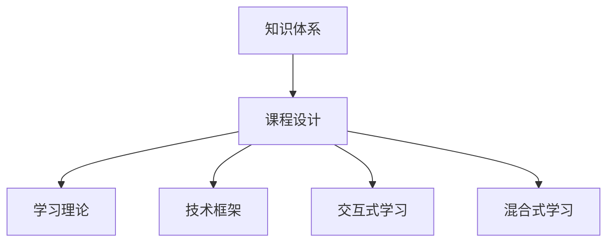

                 

# 如何打造高效的程序员知识课程

> 关键词：程序员知识体系, 课程设计, 学习理论, 技术框架, 交互式学习, 混合式学习

## 1. 背景介绍

### 1.1 问题由来

在现代社会中，计算机科学已经成为了基础性的学科，程序员的知识和技能越来越受到各行各业的重视。然而，优秀的程序员并不仅仅是拥有高超编程技巧的人，更是具备系统性知识结构、良好的学习能力和持续学习习惯的人。为了培养出具有这些能力的程序员，高效的知识课程设计变得尤为重要。本文旨在探讨如何通过科学、系统的方法设计高效的知识课程，帮助程序员在不断变化的技术环境中保持竞争力。

### 1.2 问题核心关键点

构建高效的程序员知识课程，关键在于：

1. **系统性**：课程应围绕计算机科学的核心理论和实践技能展开，涵盖算法、数据结构、操作系统、网络、数据库、软件工程等重要领域。
2. **实践性**：课程应重视实践技能的培养，通过项目实战、编程练习等手段，使学生能够将理论知识应用到实际工作中。
3. **可扩展性**：课程设计应具备灵活性，能够根据技术发展进行更新和调整，适应不断变化的行业需求。
4. **互动性**：课程应采用多种教学手段，包括在线视频、实时问答、讨论论坛等，促进师生互动，提高学习效果。
5. **趣味性**：课程设计应注重趣味性，通过生动有趣的案例和实验，激发学生的学习兴趣。

## 2. 核心概念与联系

### 2.1 核心概念概述

为更好地理解如何设计高效的知识课程，我们首先介绍几个关键概念：

- **知识体系(Knowledge Base)**：指计算机科学领域的核心概念、理论、技术和方法。知识体系是构建高效课程的基础。
- **课程设计(Course Design)**：指围绕知识体系，设计具体的课程内容、教学方法、评估方式等，实现知识传授和技能培养的目标。
- **学习理论(Learning Theory)**：指教育学、心理学等领域对学习过程、学习效果的研究成果，为课程设计提供理论支持。
- **技术框架(Technology Framework)**：指支撑课程实施的技术工具和平台，包括在线学习平台、协作工具、开发环境等。
- **交互式学习(Interactive Learning)**：指通过实时反馈、互动讨论等方式，提升学生的学习积极性和理解深度。
- **混合式学习(Hybrid Learning)**：指结合线上与线下学习方式，充分利用不同学习环境的优势，提升学习效率。

这些核心概念之间的逻辑关系可以通过以下Mermaid流程图来展示：



这个流程图展示了一个知识课程的构建过程：

1. 知识体系为课程设计提供了基础，课程设计在知识体系的基础上具体展开。
2. 课程设计引入了学习理论，以提升学习效果。
3. 课程设计采用了技术框架，确保课程的实施效率。
4. 课程设计引入了交互式学习，提升学生的学习体验。
5. 课程设计引入了混合式学习，结合线上线下资源，实现更加灵活的学习方式。

## 3. 核心算法原理 & 具体操作步骤

### 3.1 算法原理概述

构建高效的程序员知识课程，涉及到的核心算法原理包括：

- **自顶向下(Divide and Conquer)**：将复杂问题分解为更小的、可管理的子问题，逐步解决。
- **迭代学习(Iterative Learning)**：通过多次循环迭代，逐步优化课程设计，提升学习效果。
- **反馈循环(Feedback Loop)**：通过实时反馈，调整课程内容和方法，确保学生掌握所需知识。
- **螺旋上升(Spiral Learning)**：在螺旋上升的学习过程中，逐步深化和扩展知识，实现技能提升。

这些算法原理是设计高效课程的重要基础。

### 3.2 算法步骤详解

以下是设计高效程序员知识课程的具体步骤：

**Step 1: 确定课程目标**

1. **学习目标**：明确课程旨在培养学生的哪些核心能力，如编程技能、问题解决能力、团队合作能力等。
2. **教学目标**：确定课程的具体教学目标，如掌握哪些技术框架、实现哪些项目等。

**Step 2: 设计课程内容**

1. **模块划分**：将课程内容划分为若干模块，每个模块聚焦于特定的知识领域或技能点。
2. **顺序安排**：根据知识难度和逻辑顺序，合理安排各模块的教学顺序，避免学生知识断层。
3. **实践项目**：在每个模块中设计具体的实践项目，使学生能够将理论知识应用到实际中。

**Step 3: 选择教学方法**

1. **理论讲授**：通过视频讲座、在线讲义等方式，系统性地传授理论知识。
2. **实践练习**：设计编程练习、实验项目等，使学生通过实践掌握技能。
3. **项目实战**：通过真实项目或模拟项目，让学生在实际环境中应用所学知识。
4. **案例分析**：选取典型案例进行分析，帮助学生理解理论在实际中的应用。

**Step 4: 设计评估方式**

1. **考核方式**：设计多样化的考核方式，如作业、项目、测试等，全面评估学生学习效果。
2. **反馈机制**：建立实时反馈机制，通过在线问答、讨论论坛等方式，及时解答学生疑问。
3. **自我评估**：鼓励学生进行自我评估，反思学习过程中的得失。

**Step 5: 实施与调整**

1. **教学平台**：选择合适的在线学习平台，如Coursera、edX等，提供互动学习环境。
2. **课程迭代**：根据反馈和评估结果，定期调整课程内容和教学方法，优化课程设计。
3. **资源整合**：整合在线资源、开发工具、协作工具等，提供一站式学习体验。

**Step 6: 评估与改进**

1. **效果评估**：通过评估学生的学习成果，衡量课程设计的效果。
2. **改进建议**：根据评估结果，提出改进建议，持续优化课程设计。

### 3.3 算法优缺点

高效程序员知识课程设计具有以下优点：

- **系统性**：通过合理的课程设计，确保学生掌握系统化的知识体系。
- **实践性**：通过丰富的实践项目，提升学生的实际编程能力。
- **可扩展性**：课程设计灵活，能够根据技术发展进行调整。
- **互动性**：多种教学手段结合，提升学生的学习兴趣和互动体验。

然而，该方法也存在一定的局限性：

- **时间成本高**：课程设计、实施和评估都需要投入大量时间。
- **资源需求大**：课程设计需要整合多种教学资源，对平台和技术要求较高。
- **个性化不足**：课程设计难以完全满足每个学生的个性化需求。

尽管存在这些局限性，但就目前而言，系统性的知识体系和实践性训练仍然是高效程序员课程设计的主要方向。

### 3.4 算法应用领域

基于高效课程设计的理念，程序员知识课程广泛应用于以下几个领域：

- **学术教育**：高校计算机科学专业课程设计、研究生课程。
- **职业培训**：企业内部的技术培训、员工技能提升课程。
- **在线教育**：各大在线学习平台提供的课程设计，如Coursera、Udacity等。
- **开源项目**：开源社区内的课程设计，通过社区协作提升学习效果。
- **定制化课程**：根据企业或个人需求，定制化的课程设计，提升学习针对性。

## 4. 数学模型和公式 & 详细讲解 & 举例说明

### 4.1 数学模型构建

为了更好地理解课程设计中的数学模型，我们首先需要构建一个简化的数学模型。设课程包含 $n$ 个模块，每个模块需要 $x_i$ 学时进行学习，总学时为 $T$，则课程的总学时模型为：

$$
T = \sum_{i=1}^n x_i
$$

课程设计时，需要平衡理论学习与实践项目的时间分配，确保学生能够掌握知识并应用到实践中。

### 4.2 公式推导过程

我们进一步推导课程设计中理论学习与实践项目时间分配的最佳比例。假设课程中理论学习时间为 $t$，实践项目时间为 $p$，则：

$$
t + p = T
$$

为了评估理论学习与实践项目的效果，我们可以引入学习效果函数 $E(t, p)$，表示在 $t$ 理论学习和 $p$ 实践项目下的学习效果。通过实验数据或理论推导，可以得出最优学习效果函数 $E_{opt}(t, p)$。最优学习效果函数可以通过以下公式计算：

$$
E_{opt}(t, p) = \max_{t+p=T} E(t, p)
$$

通过优化 $t$ 和 $p$ 的分配，可以使课程设计更加高效。

### 4.3 案例分析与讲解

**案例一：软件开发实战课程**

假设课程包含 10 个模块，每个模块理论学习需要 20 学时，实践项目需要 10 学时。总学时为 200 学时。

1. **课程设计**：将前 8 个模块安排为理论学习，后 2 个模块安排为实践项目。
2. **理论学习**：通过视频讲座、在线讲义等方式，系统传授软件开发理论知识。
3. **实践项目**：通过项目实战，使学生能够将理论知识应用到实际项目中。
4. **评估与反馈**：通过在线测试和项目评估，及时了解学生的学习效果，并进行实时反馈。
5. **优化调整**：根据学生反馈和评估结果，调整课程内容和教学方法，提升学习效果。

**案例二：数据科学课程**

假设课程包含 12 个模块，每个模块理论学习需要 20 学时，实践项目需要 30 学时。总学时为 360 学时。

1. **课程设计**：将前 8 个模块安排为理论学习，后 4 个模块安排为实践项目。
2. **理论学习**：通过视频讲座、在线讲义等方式，系统传授数据科学理论知识。
3. **实践项目**：通过编程练习、实验项目等，使学生能够掌握数据科学技能。
4. **项目实战**：通过真实项目或模拟项目，让学生在实际环境中应用所学知识。
5. **评估与反馈**：通过在线测试、项目评估和论文提交等方式，全面评估学生学习效果，并进行实时反馈。
6. **优化调整**：根据学生反馈和评估结果，调整课程内容和教学方法，提升学习效果。

## 5. 项目实践：代码实例和详细解释说明

### 5.1 开发环境搭建

在进行课程设计实践前，我们需要准备好开发环境。以下是使用Python进行Django开发的环境配置流程：

1. 安装Anaconda：从官网下载并安装Anaconda，用于创建独立的Python环境。

2. 创建并激活虚拟环境：
```bash
conda create -n django-env python=3.8 
conda activate django-env
```

3. 安装Django：
```bash
pip install django
```

4. 安装相关依赖：
```bash
pip install Pillow numpy psycopg2-binary django-crispy-forms django-widget-tweaks markdown django-repository django-rest-framework
```

5. 创建并配置数据库：
```bash
cd /path/to/project
python manage.py createsuperuser
python manage.py makemigrations
python manage.py migrate
```

完成上述步骤后，即可在`django-env`环境中开始课程设计实践。

### 5.2 源代码详细实现

这里我们以一个简单的编程练习课程为例，给出使用Django框架实现课程设计的Python代码实现。

首先，定义课程模型：

```python
from django.db import models

class Course(models.Model):
    name = models.CharField(max_length=255)
    modules = models.ManyToManyField('Module')

class Module(models.Model):
    name = models.CharField(max_length=255)
    description = models.TextField()
    learning_hours = models.IntegerField()
    practical_hours = models.IntegerField()

    def __str__(self):
        return self.name
```

然后，定义视图和模板：

```python
from django.shortcuts import render, redirect
from django.http import HttpResponse

def course_list(request):
    courses = Course.objects.all()
    return render(request, 'course_list.html', {'courses': courses})

def module_detail(request, pk):
    module = get_object_or_404(Module, pk=pk)
    return render(request, 'module_detail.html', {'module': module})

def add_course(request):
    if request.method == 'POST':
        name = request.POST['name']
        modules = request.POST.getlist('modules')
        Course.objects.create(name=name, modules=Module.objects.filter(pk__in=modules))
        return redirect('course_list')
    else:
        modules = Module.objects.all()
        return render(request, 'add_course.html', {'modules': modules})
```

最后，定义表单和模板：

```html
<!-- add_course.html -->
<form method="post">
    
    <label for="name">Course Name:</label>
    <input type="text" name="name">
    <br>
    <label for="modules">Choose Modules:</label>
    <select multiple name="modules">
        
            <option value="{{ module.pk }}"{{ module.pk in form.module.errors }}>{{ module.name }}</option>
        
    </select>
    <br>
    <input type="submit" value="Submit">
</form>

<!-- course_list.html -->
<ul>
    
        <li><a href="">{{ course.name }}</a></li>
    
</ul>

<!-- module_detail.html -->
<h1>{{ module.name }}</h1>
<p>{{ module.description }}</p>
<p>Learning Hours: {{ module.learning_hours }}</p>
<p>Practical Hours: {{ module.practical_hours }}</p>
```

完成上述代码后，即可在Django应用中实现课程的创建和展示。

### 5.3 代码解读与分析

让我们再详细解读一下关键代码的实现细节：

**Course和Module模型**：
- `Course`模型用于表示课程，包含课程名称和关联的`Module`模块。
- `Module`模型用于表示课程模块，包含模块名称、描述和学时等信息。

**视图函数**：
- `course_list`函数用于显示所有课程列表。
- `module_detail`函数用于显示指定课程的详细信息。
- `add_course`函数用于创建新课程，并将关联的模块保存到数据库中。

**模板**：
- `add_course.html`模板用于创建新课程的表单。
- `course_list.html`模板用于显示课程列表。
- `module_detail.html`模板用于显示指定课程的详细信息。

可以看到，使用Django框架，我们可以便捷地实现课程的设计、管理和展示。当然，在实际应用中，还需要对表单验证、用户权限、数据存储等进行进一步优化。

## 6. 实际应用场景

### 6.1 企业内部培训

高效程序员知识课程在企业内部培训中具有广泛应用。企业可以基于课程设计，构建系统化的技术培训体系，帮助员工提升技能，适应技术变化。

具体而言，企业可以设计包含多个模块的课程，涵盖技术栈、项目管理、团队协作等方面的内容。通过线上线下结合的教学方式，提升员工的学习效果。同时，企业还可以通过实践项目、项目实战等方式，帮助员工将所学知识应用到实际工作中，提高培训效果。

### 6.2 高校课程设计

高校计算机科学专业的课程设计中，引入高效课程设计理念，可以有效提升学生的学习效果。通过将课程内容模块化，结合理论学习和实践项目，学生可以更好地掌握知识和技能。

例如，可以将课程划分为基础编程、数据结构与算法、操作系统、数据库、网络等多个模块，每个模块包含理论讲解和实践项目。通过实验、项目实战等方式，使学生能够在实际环境中应用所学知识，提高学习效果。

### 6.3 在线教育平台

在线教育平台如Coursera、Udacity等，可以利用高效课程设计理念，提供系统化的课程内容，帮助全球学习者提升技能。

平台可以设计包含多个模块的课程，涵盖从入门到高级的各个层次。通过视频讲座、在线讲义、编程练习等多种教学手段，提升学习效果。同时，平台还可以通过互动讨论、实时反馈等方式，促进师生互动，提高学习体验。

### 6.4 开源社区项目

开源社区项目如GitHub等，可以基于高效课程设计理念，组织社区成员进行系统化的学习和实践。

社区可以设计包含多个模块的课程，涵盖从理论学习到实践项目的全过程。通过社区协作、知识共享等方式，提升成员的学习效果。同时，社区还可以通过实时讨论、代码评审等方式，促进成员的交流与合作。

## 7. 工具和资源推荐

### 7.1 学习资源推荐

为了帮助开发者系统掌握高效课程设计的方法，这里推荐一些优质的学习资源：

1. 《学习与教学设计基础》系列博文：由教育学专家撰写，详细介绍了课程设计的基本原则和方法。

2. Coursera、edX等在线学习平台：提供丰富的课程资源，涵盖计算机科学各个领域，适合不同层次的学习者。

3. 《设计高效课程：方法与实践》书籍：系统介绍了课程设计的方法和案例，适合课程设计实践者阅读。

4. Khan Academy：提供免费的在线课程，涵盖K-12及大学课程，适合基础和进阶学习者。

5. 《深入理解学习科学》论文：由认知心理学专家撰写，探讨了学习科学的最新研究成果，对课程设计有重要参考价值。

通过对这些资源的学习实践，相信你一定能够掌握高效课程设计的精髓，并用于解决实际的课程设计问题。

### 7.2 开发工具推荐

高效的课程设计离不开优秀的工具支持。以下是几款用于课程设计开发的常用工具：

1. Django框架：基于Python的开源Web开发框架，支持灵活的模板系统和多种数据库，适合构建课程管理系统。

2. Coursera平台：提供系统化的在线课程，支持多种教学手段和评估方式，适合高校和企业的课程设计。

3. edX平台：提供全球领先的在线课程，涵盖计算机科学等多个领域，适合高校和企业的课程设计。

4. GitHub：提供开源代码管理、协作工具和社区支持，适合开源社区的课程设计和项目实战。

5. Google Colab：谷歌推出的在线Jupyter Notebook环境，免费提供GPU/TPU算力，适合编程练习和项目实验。

合理利用这些工具，可以显著提升课程设计的开发效率，加快创新迭代的步伐。

### 7.3 相关论文推荐

课程设计领域的研究源于学界的持续研究。以下是几篇奠基性的相关论文，推荐阅读：

1. Bloomer, J., & Cronbach, L. J. (1956). A taxonomy of educational objectives, handbook I, the cognitive domain. David McKay Company.

2. Hake, R. J. (2003). Teaching Students to Think: A Taxonomic Approach to Curriculum Planning and Assessment. American Educational Research Association.

3. Mayer, R. E. (2009). Principles of Educational Psychology (7th ed.). Routledge.

4. Brakensiek, M., & Johnstone, P. (2014). Concept-based curriculum design: A framework for developing curriculum units for information and communication technology education. Computers & Education, 81, 295-307.

5. Werts, K., & DeLong, D. W. (2015). The reverse hook: Bridging the gap between research and practice with multiple measures of student engagement in online learning. Online Learning, 19(4), 44-57.

这些论文代表了大语言模型微调技术的发展脉络。通过学习这些前沿成果，可以帮助研究者把握学科前进方向，激发更多的创新灵感。

## 8. 总结：未来发展趋势与挑战

### 8.1 总结

本文对高效程序员知识课程的设计进行了全面系统的介绍。首先阐述了课程设计的背景和意义，明确了课程设计的系统性、实践性、可扩展性、互动性等核心要点。其次，从原理到实践，详细讲解了课程设计的数学模型和操作步骤，给出了课程设计实践的完整代码实现。同时，本文还探讨了课程设计在企业培训、高校教育、在线教育等多个领域的应用前景，展示了高效课程设计的广阔应用空间。最后，本文精选了课程设计的各类学习资源，力求为读者提供全方位的技术指引。

通过本文的系统梳理，可以看到，高效程序员知识课程设计是构建系统化、实践性知识体系的重要手段。通过科学、系统的课程设计，可以提升学生的学习效果，培养具备系统化知识结构、良好学习能力和持续学习习惯的高素质程序员。

### 8.2 未来发展趋势

展望未来，高效程序员知识课程设计将呈现以下几个发展趋势：

1. **技术融合**：随着新技术的发展，课程设计将融合更多技术手段，如AI辅助设计、虚拟现实技术等，提升学习体验。
2. **个性化学习**：根据学生的学习习惯和需求，设计个性化的课程内容和方法，提升学习效果。
3. **持续学习**：构建终身学习体系，使学生能够持续学习新知识，适应技术快速变化的需求。
4. **跨学科融合**：课程设计将更多地融合跨学科知识，如计算机科学与心理学的结合，提升学生的综合能力。
5. **社会化学习**：利用社交网络、在线社区等平台，促进学生之间的交流与合作，提升学习效果。

这些趋势将推动课程设计向更加灵活、个性化、社会化的方向发展，为培养高素质程序员提供更多可能。

### 8.3 面临的挑战

尽管高效程序员知识课程设计取得了不少成就，但在迈向更加智能化、普适化应用的过程中，它仍面临诸多挑战：

1. **资源不足**：课程设计需要投入大量时间和精力，企业、高校等机构可能面临资源不足的问题。
2. **师资力量**：高质量的课程设计需要经验丰富的教师和专家，师资力量的培养仍需加强。
3. **学习效果评估**：课程设计效果的评估方法尚需进一步完善，以确保课程设计能够真正提升学生的学习效果。
4. **学习动机**：如何激发学生的学习动机，保持学习的持续性和积极性，仍然是一个重要挑战。
5. **技术适应性**：课程设计需要不断更新和调整，以适应技术发展，但这种动态适应性也可能带来一定的复杂性。

尽管存在这些挑战，但随着教育技术的不断进步和教育理念的不断创新，这些挑战终将逐步克服，高效程序员知识课程设计必将在教育领域发挥更大的作用。

### 8.4 研究展望

面对高效课程设计面临的挑战，未来的研究需要在以下几个方面寻求新的突破：

1. **自动化课程设计**：通过AI技术，自动化生成课程设计和评估方案，减少人工干预。
2. **多模态学习**：结合视觉、听觉等多种感官信息，提升学习效果。
3. **社会化学习**：构建社区平台，促进学生之间的协作和交流，提升学习效果。
4. **终身学习**：构建终身学习体系，使学生能够持续学习新知识，适应技术快速变化的需求。
5. **情感支持**：引入情感计算技术，通过情感分析、情感反馈等方式，提升学习体验。

这些研究方向将推动课程设计向更加智能化、普适化的方向发展，为培养高素质程序员提供更多可能。

## 9. 附录：常见问题与解答

**Q1：高效课程设计是否适用于所有学科？**

A: 高效课程设计理念适用于各类学科，但不同学科的课程设计方法需要根据学科特点进行调整。例如，文科课程可能更注重理论学习，而理科课程可能更注重实践项目。

**Q2：如何设计跨学科课程？**

A: 设计跨学科课程时，需要确保各学科的知识和技能能够有机整合，避免学科间的割裂。可以引入多学科团队，共同设计和实施课程。例如，计算机科学与心理学结合的课程，需要确保学生在掌握编程技能的同时，也能够理解心理学的基本原理。

**Q3：课程设计如何与职业需求对接？**

A: 课程设计需要与职业需求紧密对接，设计符合行业标准的课程内容和方法。可以通过与企业合作，了解行业需求，引入实际项目和案例，提升课程的实用性和实用性。

**Q4：如何评估课程设计的效果？**

A: 课程设计的效果可以通过多种方式评估，如学生的学习成果、就业情况、企业反馈等。可以设计多样化的评估方式，结合定量分析和定性分析，全面评估课程设计的效果。

**Q5：如何持续改进课程设计？**

A: 课程设计需要持续改进，以适应技术发展和学生需求的变化。可以建立课程评估和反馈机制，根据评估结果和反馈意见，不断调整课程内容和教学方法，提升课程设计的效果。

这些问题的解答，可以为课程设计者提供一些具体的操作方法，帮助他们在实践中更好地设计和实施高效课程。

