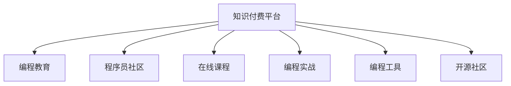

                 

# 如何打造高盈利性的程序员知识产品

> 关键词：知识付费、程序员、盈利模式、产品设计、技术书籍

## 1. 背景介绍

### 1.1 问题由来

在信息技术飞速发展的今天，程序员作为技术人才的重要组成部分，其职业发展和技能提升一直受到广泛关注。然而，传统的学习方式，如参加线下培训、阅读技术书籍等，存在成本高、效率低、知识过时等问题。为此，知识付费平台应运而生，为程序员提供了更为灵活、高效、低成本的学习途径。

### 1.2 问题核心关键点

知识付费平台的核心价值在于其将知识商品化，通过技术手段优化学习流程，降低学习成本，提升知识传播效率。其盈利模式主要包括以下几种：

- 订阅付费：用户按月或按年支付固定费用，享受平台提供的所有课程、视频、文档等服务。
- 单次付费：用户支付一次性费用购买某门课程或文档，拥有永久观看权。
- 会员特权：部分高级课程、文档等以会员制方式提供，会员享受更多特权和资源。
- 广告分成：知识付费平台通过大量优质的内容吸引用户，进而吸引广告商投放广告，获得收入。
- 合作销售：平台与出版社、培训机构等合作，销售相关产品，获取销售佣金。

### 1.3 问题研究意义

打造高盈利性的程序员知识产品，对技术教育和知识传播具有重要意义：

- 促进技术人才成长：通过高质量的知识产品，帮助程序员迅速掌握新技术、新方法，加速职业发展。
- 提升行业水平：平台集聚顶尖技术专家，输出高质量知识内容，推动行业整体水平提升。
- 实现知识变现：知识付费是一种创新的商业模式，能够有效激发内容创作者的积极性，形成良性循环。
- 满足个性化需求：知识产品能够根据用户需求进行灵活定制，提供差异化服务。

## 2. 核心概念与联系

### 2.1 核心概念概述

本节将介绍知识付费平台及其中文编程教育领域的主要概念：

- 知识付费平台：以提供高质量知识内容为核心，用户通过付费获取相关资源的学习平台。
- 编程教育：通过在线教育、知识付费、线下培训等方式，帮助程序员提升技术技能的教育模式。
- 程序员社区：围绕编程技术交流、经验分享、项目合作等的程序员社群，如Stack Overflow、GitHub等。
- 在线课程：以视频、文本、代码等多种形式呈现的学习内容，涵盖从入门到精通的各个层次。
- 编程实战：通过具体项目案例或编程挑战，帮助学员提升实际操作能力。
- 编程工具：如IDE、编译器、调试器等辅助程序员进行编程工作的工具。
- 开源社区：围绕开源项目和代码库，程序员分享代码、合作开发的技术社群。

这些概念之间的联系可以通过以下Mermaid流程图来展示：



这个流程图展示了知识付费平台与编程教育、程序员社区、在线课程、编程实战、编程工具和开源社区之间的联系。它们相互支撑，共同构成了程序员知识产品的完整生态。

## 3. 核心算法原理 & 具体操作步骤

### 3.1 算法原理概述

知识付费平台的算法原理主要包括用户行为分析、内容推荐和广告定向等。这些算法基于机器学习和数据挖掘技术，通过分析用户的历史行为和偏好，向其推荐最相关的课程、文档等内容，同时优化广告投放策略，提升用户体验和平台盈利能力。

- 用户行为分析：通过点击率、浏览时长、购买记录等数据，分析用户的学习兴趣和消费行为。
- 内容推荐算法：利用协同过滤、基于内容的推荐、深度学习等技术，推荐最适合用户的内容。
- 广告定向：基于用户特征和行为数据，精准投放广告，提升广告点击率和转化率。

### 3.2 算法步骤详解

知识付费平台的算法开发流程如下：

**Step 1: 数据收集与处理**
- 收集用户行为数据，包括点击、浏览、购买、评分等行为。
- 数据清洗和预处理，去除噪音数据，规范化数据格式。

**Step 2: 特征工程**
- 提取用户特征，如年龄、职业、兴趣等。
- 提取内容特征，如课程名称、作者、难度等。
- 构建用户-课程交互矩阵，记录用户对每个课程的互动情况。

**Step 3: 模型训练与优化**
- 选择适合的数据模型，如协同过滤、基于内容的推荐、深度学习等。
- 利用训练集进行模型训练，优化模型参数。
- 进行交叉验证和模型评估，确保模型效果。

**Step 4: 实时推荐与广告投放**
- 根据实时用户行为数据，实时推荐最适合的内容。
- 基于用户特征和行为数据，定向投放广告，提升点击率和转化率。
- 实时监控推荐效果和广告投放效果，根据反馈进行调整。

### 3.3 算法优缺点

知识付费平台的算法主要优点包括：

- 精准推荐：通过数据分析和机器学习，向用户推荐最相关的课程和内容。
- 高效广告投放：通过用户特征分析，精准投放广告，提升广告效果。
- 动态调整：根据用户反馈实时调整推荐算法和广告策略。

同时，这些算法也存在一些局限性：

- 数据依赖：算法的准确性高度依赖于数据质量和多样性。
- 冷启动问题：新用户或新内容往往缺乏足够的数据，难以进行精准推荐。
- 用户隐私：大量用户数据的收集和分析可能引发隐私问题。
- 模型复杂度：深度学习等复杂模型的训练和优化需要大量计算资源。

### 3.4 算法应用领域

知识付费平台的算法主要应用于以下几个领域：

- 课程推荐：通过分析用户历史行为和课程内容特征，推荐最适合的课程。
- 广告定向：基于用户行为数据和特征，定向投放广告，提升点击率和转化率。
- 内容分发：优化课程分发策略，提升用户满意度和平台流量。
- 用户分析：分析用户行为和需求，提升平台运营效率和用户体验。
- 异常检测：检测并处理恶意行为，保障平台安全性。

## 4. 数学模型和公式 & 详细讲解 & 举例说明

### 4.1 数学模型构建

知识付费平台的推荐算法通常基于协同过滤和基于内容的推荐方法。下面以协同过滤为例，构建推荐模型的数学模型。

设用户集合为 $U$，课程集合为 $I$，用户与课程之间的评分矩阵为 $R_{U\times I}$。协同过滤算法通过计算用户和课程之间的相似度，预测用户对课程的评分。设用户 $u$ 对课程 $i$ 的评分为 $r_{ui}$，则协同过滤模型的目标是最小化均方误差损失函数：

$$
\mathcal{L} = \frac{1}{2}\sum_{(u,i)\in U\times I}(r_{ui}-p(u,i))^2
$$

其中 $p(u,i)$ 为协同过滤算法预测的用户 $u$ 对课程 $i$ 的评分，可以通过用户-课程相似度矩阵 $S_{U\times I}$ 计算得到：

$$
p(u,i) = \sum_{j\in I}\frac{s_{uj}r_{ji}}{\sum_{k\in I}s_{uk}r_{kj}}
$$

式中 $s_{uj}$ 为相似度矩阵 $S$ 中用户 $u$ 对课程 $j$ 的评分。

### 4.2 公式推导过程

协同过滤算法的关键在于计算用户 $u$ 对课程 $i$ 的预测评分 $p(u,i)$。下面详细推导预测评分的计算公式：

设用户 $u$ 对课程 $i$ 的评分 $r_{ui}$ 未知，算法通过寻找与 $u$ 最相似的 $k$ 个用户 $u_1,u_2,\cdots,u_k$ 和 $m$ 个课程 $j_1,j_2,\cdots,j_m$，计算预测评分 $p(u,i)$。

首先，计算用户 $u$ 与 $u_1,u_2,\cdots,u_k$ 的相似度：

$$
s_{uj} = \frac{\cos(\theta_u,\theta_j)}{\|\theta_u\|_2\|\theta_j\|_2}
$$

其中 $\theta_u = (r_{u1},r_{u2},\cdots,r_{ui},\cdots,r_{un})^T$ 为 $u$ 对课程的评分向量，$\theta_j = (r_{j1},r_{j2},\cdots,r_{ji},\cdots,r_{jn})^T$ 为 $j$ 对课程的评分向量。

其次，计算课程 $i$ 与 $j_1,j_2,\cdots,j_m$ 的相似度：

$$
s_{ji} = \frac{\cos(\theta_j,\theta_i)}{\|\theta_j\|_2\|\theta_i\|_2}
$$

最后，计算预测评分 $p(u,i)$：

$$
p(u,i) = \sum_{j=1}^{m}\frac{s_{uj}r_{ji}}{\sum_{k=1}^{k}s_{uk}r_{kj}}
$$

其中 $s_{uj}$ 为 $u$ 对课程 $j$ 的相似度，$r_{ji}$ 为 $j$ 对课程 $i$ 的评分。

### 4.3 案例分析与讲解

以一个简单的知识付费平台为例，分析协同过滤算法在推荐中的应用。假设平台有 $100$ 个用户和 $500$ 门课程，用户对每门课程的评分矩阵为 $R_{100\times500}$。使用协同过滤算法计算用户 $u=20$ 对课程 $i=60$ 的预测评分，过程如下：

1. 选取与用户 $u$ 最相似的 $k=5$ 个用户 $u_1,u_2,u_3,u_4,u_5$，并计算这些用户对课程 $j_1,j_2,j_3,j_4,j_5$ 的评分。

2. 计算课程 $i$ 与 $j_1,j_2,j_3,j_4,j_5$ 的相似度，并计算课程 $i$ 的评分预测值 $p(i)$。

3. 将用户 $u$ 对课程 $j_1,j_2,j_3,j_4,j_5$ 的评分与预测值 $p(i)$ 进行加权平均，得到用户 $u$ 对课程 $i$ 的预测评分 $p(u,i)$。

通过协同过滤算法，平台可以为用户 $u=20$ 推荐最有可能感兴趣的课程 $i$，提升用户满意度和平台流量。

## 5. 项目实践：代码实例和详细解释说明

### 5.1 开发环境搭建

知识付费平台的开发环境搭建主要包括以下步骤：

1. 安装Python：从官网下载并安装最新版本的Python。
2. 安装相关库：安装Pandas、Numpy、Scikit-Learn、TensorFlow等常用数据处理和机器学习库。
3. 设置虚拟环境：使用Virtualenv或conda创建虚拟环境，方便不同项目间库的隔离。
4. 搭建Web服务器：使用Flask、Django等框架搭建Web服务器，实现用户注册、登录、课程浏览、购买等功能。

### 5.2 源代码详细实现

下面以基于协同过滤算法的内容推荐系统为例，展示知识付费平台的实现过程。

**Step 1: 数据预处理**
- 使用Pandas读取用户评分矩阵，进行数据清洗和预处理。
- 对缺失值进行填充或删除，规范化评分数据。

**Step 2: 用户和课程相似度计算**
- 使用Scikit-Learn的相似度计算函数计算用户和课程的相似度。
- 计算每个用户对课程的预测评分。

**Step 3: 推荐系统实现**
- 设计推荐算法，使用协同过滤计算用户对课程的预测评分。
- 将预测评分与课程实际评分进行对比，选择评分最高的课程进行推荐。

### 5.3 代码解读与分析

协同过滤算法的代码实现主要包括以下部分：

1. 读取数据集：使用Pandas读取用户评分矩阵，并进行数据清洗和预处理。

```python
import pandas as pd

# 读取用户评分矩阵
data = pd.read_csv('ratings.csv', sep='\t')

# 数据清洗和预处理
data.fillna(0, inplace=True)
data['user'] = data['user'].astype(int)
data['course'] = data['course'].astype(int)
```

2. 计算用户和课程相似度：使用Scikit-Learn的相似度计算函数计算用户和课程的相似度。

```python
from sklearn.metrics.pairwise import cosine_similarity

# 计算用户和课程的相似度
user_similarity = cosine_similarity(data[data.columns[2:]].values, data[data.columns[2:]].values)
course_similarity = cosine_similarity(data[data.columns[2:]].values, data[data.columns[2:]].values)
```

3. 计算预测评分：使用协同过滤算法计算用户对课程的预测评分。

```python
from sklearn.metrics.pairwise import cosine_similarity

# 计算用户对课程的预测评分
def predict_score(user, course):
    similarity = cosine_similarity(data[data.columns[2:]].values, data[data.columns[2:]].values)
    rating = (similarity[user] * data[user].values).sum()
    return rating / similarity[user].sum()
```

4. 推荐系统实现：根据用户对课程的预测评分，选择评分最高的课程进行推荐。

```python
def recommend_course(user, course):
    predicted_scores = [predict_score(u, i) for u in data[data.columns[2:]].values]
    top_n = sorted(range(len(predicted_scores)), key=predicted_scores.__getitem__, reverse=True)[:20]
    recommended_courses = [(u, i) for i in top_n]
    return recommended_courses
```

### 5.4 运行结果展示

通过上述代码实现，知识付费平台可以实现对用户进行课程推荐的功能。例如，对于用户 $u=20$，推荐其最感兴趣的课程 $i=60$ 的评分预测值 $p(u,i)$。

```python
# 用户和课程编号
user_id = 20
course_id = 60

# 计算用户对课程的预测评分
prediction = predict_score(user_id, course_id)
print('用户 {} 对课程 {} 的预测评分：{}'.format(user_id, course_id, prediction))
```

## 6. 实际应用场景

### 6.1 智能推荐系统

智能推荐系统是知识付费平台的核心功能之一。通过协同过滤算法、基于内容的推荐等方法，平台可以为用户提供个性化推荐，提升用户体验和平台流量。

**应用场景**：用户在平台浏览课程时，平台根据用户的历史行为和课程特征，实时推荐最相关的课程。

**效果**：用户可以快速找到感兴趣的内容，提升课程购买率，增加平台收入。

### 6.2 广告定向

知识付费平台通过精准的广告定向，可以高效地获取流量和收入。

**应用场景**：平台在用户浏览课程时，根据用户特征和行为数据，定向投放广告。

**效果**：广告点击率和转化率显著提升，增加平台收入。

### 6.3 课程分析与优化

平台通过分析课程的访问量和用户反馈，优化课程内容和结构，提升课程质量和用户满意度。

**应用场景**：平台定期收集用户对课程的评分和反馈，进行数据分析和可视化，找出课程存在的问题。

**效果**：优化课程内容和结构，提升课程质量和用户满意度，增加平台收入。

## 7. 工具和资源推荐

### 7.1 学习资源推荐

为帮助开发者系统掌握知识付费平台的开发技能，这里推荐一些优质的学习资源：

1. Coursera和edX上的机器学习课程：包括线性代数、数据处理、机器学习等基础课程，涵盖协同过滤、基于内容的推荐等算法。
2. TensorFlow和PyTorch官方文档：详细介绍了机器学习库的使用方法，包括数据处理、模型训练、推荐算法等。
3. Kaggle平台：提供大量公开数据集和竞赛，供开发者练习和验证推荐算法效果。
4. PyTorch Tutorials：由PyTorch社区维护的在线教程，涵盖深度学习、推荐算法等内容。
5. O'Reilly编程书籍：如《推荐系统实战》、《机器学习实战》等，深入浅出地介绍了推荐算法的原理和实现方法。

通过对这些资源的学习实践，相信你一定能够快速掌握知识付费平台的开发技能，并用于解决实际的编程问题。

### 7.2 开发工具推荐

高效的开发离不开优秀的工具支持。以下是几款用于知识付费平台开发的常用工具：

1. Python：作为最流行的编程语言之一，Python在数据处理、机器学习等领域应用广泛。
2. Pandas和Numpy：数据处理必备库，支持数据清洗、预处理和分析。
3. Scikit-Learn：机器学习库，提供多种常用算法的实现和应用。
4. TensorFlow和PyTorch：深度学习框架，支持复杂推荐算法的实现。
5. Flask和Django：Web框架，用于搭建知识付费平台的后端服务。
6. Git和GitHub：版本控制工具，方便代码管理和共享。

合理利用这些工具，可以显著提升知识付费平台的开发效率，加快创新迭代的步伐。

### 7.3 相关论文推荐

知识付费平台的算法研究源于学界的持续探索。以下是几篇奠基性的相关论文，推荐阅读：

1. Collaborative Filtering for Recommender Systems（协同过滤推荐系统）：Koren、Herlocker和Heath在2009年提出，介绍协同过滤算法的原理和实现方法。
2. The Bell-Katz Algorithm（Bell-Katz算法）：Bell和Katz在1961年提出，介绍基于内容的推荐算法。
3. Matrix Factorization Techniques for Recommender Systems（矩阵分解推荐系统）：Cengiz and Ramírez-Quintana在2016年提出，介绍矩阵分解算法在推荐系统中的应用。
4. Context-aware Recommendation（上下文感知的推荐）：Li、Wang和Chen在2016年提出，介绍上下文感知的推荐算法。
5. Deep Learning for Recommender Systems（深度学习推荐系统）：Heinrich、Riedmiller和Kloft在2016年提出，介绍深度学习在推荐系统中的应用。

这些论文代表了大语言模型微调技术的发展脉络。通过学习这些前沿成果，可以帮助研究者把握学科前进方向，激发更多的创新灵感。

## 8. 总结：未来发展趋势与挑战

### 8.1 总结

本文对知识付费平台的推荐算法进行了全面系统的介绍。首先阐述了知识付费平台及其盈利模式的现状和未来发展趋势，明确了推荐算法在提高用户体验和平台收入方面的独特价值。其次，从原理到实践，详细讲解了协同过滤算法的数学原理和实现步骤，给出了推荐系统开发的完整代码实例。同时，本文还广泛探讨了知识付费平台在智能推荐、广告定向、课程分析等多个应用场景中的实际应用，展示了推荐算法的巨大潜力。

通过本文的系统梳理，可以看到，知识付费平台通过协同过滤等推荐算法，将高质量内容推荐给用户，极大地提升了用户体验和平台收入。未来，伴随推荐算法和平台技术的持续演进，相信知识付费平台必将在教育、商业等领域发挥更大的作用，为人类知识传播和经济发展注入新的动力。

### 8.2 未来发展趋势

展望未来，知识付费平台的推荐算法将呈现以下几个发展趋势：

1. 个性化推荐：利用深度学习等先进算法，更加精准地推荐用户感兴趣的内容。
2. 跨平台协同：实现不同平台之间的数据共享和推荐协同，提升用户在不同平台间的连续性体验。
3. 动态调整：实时分析用户行为和偏好，动态调整推荐策略，保持推荐内容的新鲜性和多样性。
4. 多样化应用：推荐算法不仅应用于课程推荐，还可以拓展到广告投放、商品推荐等多个领域。
5. 结合用户生成内容：利用用户评论、评分等生成内容，进一步提升推荐精度和用户体验。
6. 支持多种推荐策略：综合利用协同过滤、基于内容的推荐、混合推荐等方法，提升推荐效果。

以上趋势凸显了知识付费平台的推荐算法的广阔前景。这些方向的探索发展，必将进一步提升平台的用户体验和运营效率，推动知识付费平台走向更加智能化、普适化应用。

### 8.3 面临的挑战

尽管知识付费平台的推荐算法已经取得了瞩目成就，但在迈向更加智能化、普适化应用的过程中，它仍面临着诸多挑战：

1. 数据隐私问题：大量用户数据的收集和分析可能引发隐私问题，需要加强数据保护措施。
2. 冷启动问题：新用户或新内容往往缺乏足够的数据，难以进行精准推荐，需要改进冷启动策略。
3. 模型复杂度：深度学习等复杂模型的训练和优化需要大量计算资源，需要优化模型结构和算法效率。
4. 多平台协同：实现不同平台之间的数据共享和协同，需要解决数据格式、接口标准等问题。
5. 用户体验：推荐算法的个性化和多样性需要在用户体验和推荐效果之间找到平衡，避免过度个性化导致用户体验下降。
6. 算法公平性：推荐算法可能存在偏见，需要加强算法公平性和透明性，避免算法歧视。

### 8.4 研究展望

面对知识付费平台推荐算法所面临的种种挑战，未来的研究需要在以下几个方面寻求新的突破：

1. 探索新型推荐算法：如基于深度学习的推荐算法、图神经网络推荐算法等，提升推荐精度和多样性。
2. 引入多源数据：结合用户生成内容、社交网络数据等多种数据源，提升推荐算法的多样性和鲁棒性。
3. 优化模型结构和训练效率：通过模型压缩、稀疏化等方法，降低模型复杂度，提升训练效率和推理速度。
4. 改进冷启动策略：利用聚类、标签传播等方法，提升新用户和内容的推荐精度。
5. 优化推荐算法公平性：通过算法透明性、可解释性等方法，提高推荐算法的公平性和可解释性。
6. 支持多平台协同推荐：通过API接口、数据联邦等技术，实现不同平台之间的数据共享和协同推荐。

这些研究方向将进一步推动知识付费平台推荐算法的发展，提升平台的用户体验和运营效率，推动知识付费平台的可持续发展。总之，知识付费平台推荐算法需要在用户体验、平台收入、算法公平性等多方面进行全面优化，方能真正实现其商业价值和技术意义。

## 9. 附录：常见问题与解答

**Q1: 知识付费平台的盈利模式主要有哪些？**

A: 知识付费平台的盈利模式主要包括以下几种：

1. 订阅付费：用户按月或按年支付固定费用，享受平台提供的所有课程、视频、文档等服务。
2. 单次付费：用户支付一次性费用购买某门课程或文档，拥有永久观看权。
3. 会员特权：部分高级课程、文档等以会员制方式提供，会员享受更多特权和资源。
4. 广告分成：平台通过大量优质的内容吸引用户，进而吸引广告商投放广告，获得收入。
5. 合作销售：平台与出版社、培训机构等合作，销售相关产品，获取销售佣金。

**Q2: 知识付费平台如何实现精准推荐？**

A: 知识付费平台实现精准推荐主要依赖以下几个方面：

1. 用户行为分析：通过分析用户的历史行为和偏好，向其推荐最相关的课程和内容。
2. 内容推荐算法：利用协同过滤、基于内容的推荐、深度学习等技术，推荐最适合用户的内容。
3. 数据特征提取：从用户和课程数据中提取特征，如评分、标签、时间戳等，用于推荐算法。
4. 实时数据更新：根据用户实时行为数据，实时更新推荐结果，保持推荐内容的及时性和相关性。

**Q3: 推荐算法可能存在哪些问题？**

A: 推荐算法可能存在以下问题：

1. 数据不平衡：用户对课程的评分分布不均匀，可能影响推荐效果。
2. 稀疏性：用户评分矩阵可能存在大量缺失值，影响协同过滤算法的推荐效果。
3. 过拟合：推荐算法可能对新数据过度拟合，导致推荐结果偏差。
4. 多样性不足：推荐算法可能过于个性化，导致推荐内容单一。
5. 算法透明性不足：推荐算法的内部工作机制难以解释，可能影响用户信任度。

**Q4: 推荐算法的改进方向有哪些？**

A: 推荐算法的改进方向主要包括以下几个方面：

1. 引入多源数据：结合用户生成内容、社交网络数据等多种数据源，提升推荐算法的多样性和鲁棒性。
2. 优化模型结构和训练效率：通过模型压缩、稀疏化等方法，降低模型复杂度，提升训练效率和推理速度。
3. 改进冷启动策略：利用聚类、标签传播等方法，提升新用户和内容的推荐精度。
4. 优化推荐算法公平性：通过算法透明性、可解释性等方法，提高推荐算法的公平性和可解释性。
5. 支持多平台协同推荐：通过API接口、数据联邦等技术，实现不同平台之间的数据共享和协同推荐。

通过以上分析，可以看到，知识付费平台的推荐算法在推荐精度、用户体验、平台收入等多方面具有重要价值。然而，面对未来的发展挑战，需要持续优化推荐算法，探索更多前沿技术，方能实现其商业价值和技术意义。

---

作者：禅与计算机程序设计艺术 / Zen and the Art of Computer Programming

