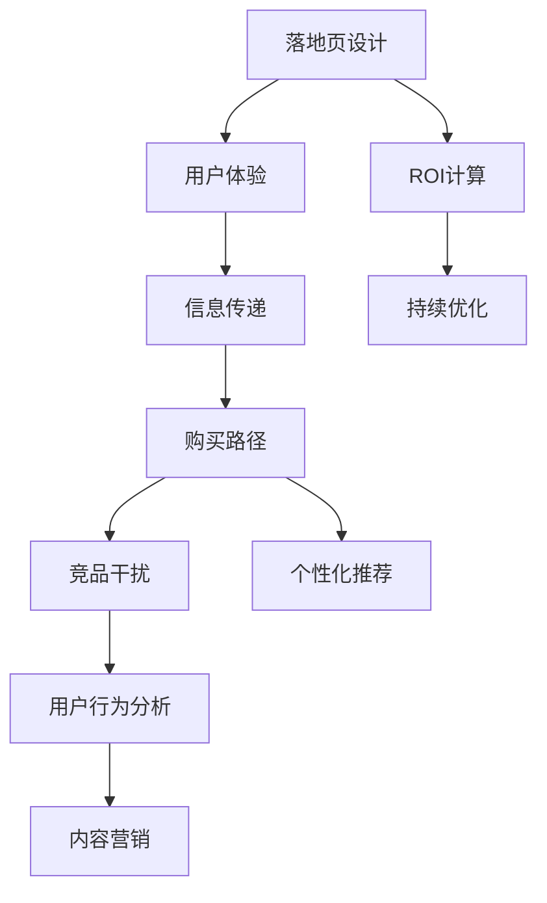

                 

# 如何打造高转化率的知识付费落地页

> 关键词：知识付费、转化率、落地页、用户体验、A/B测试、用户行为分析、转化漏斗、个性化推荐、内容营销、ROI

## 1. 背景介绍

### 1.1 问题由来

随着互联网的普及和教育成本的上升，知识付费日益成为互联网行业的重要趋势。知识付费平台如得到、喜马拉雅、慕课网等，通过提供高质量的课程和讲座，满足了用户不断增长的学习需求。然而，尽管知识付费市场迅速发展，但用户转化率仍然是一个严峻的挑战。

根据艾媒咨询的数据，中国知识付费市场规模在2018年已经达到126.8亿元，预计到2023年将突破235亿元。但与此同时，知识付费用户的平均续费率仅为18.8%，平均付费金额为90.2元/年。低用户转化率、高流失率的问题，严重阻碍了知识付费平台的发展。

### 1.2 问题核心关键点

知识付费落地页转化率低，主要是因为以下几个关键因素：

1. 用户体验不佳。落地页加载时间长，内容布局混乱，难以抓住用户注意力。
2. 信息传递不明确。用户不清楚课程内容、价值，没有足够的动机去购买。
3. 购买路径复杂。用户需要在多个页面跳转才能完成购买，流程繁琐。
4. 竞品干扰。竞品广告、课程推荐过多，分散了用户的注意力。
5. 缺乏个性化推荐。无法针对用户兴趣和需求，提供精准的课程推荐。

因此，本文将从用户体验、信息传递、购买路径、竞品干扰、个性化推荐等方面，详细阐述如何打造高转化率的知识付费落地页。

## 2. 核心概念与联系

### 2.1 核心概念概述

为更好地理解如何打造高转化率的知识付费落地页，本节将介绍几个关键概念：

- 知识付费：以付费方式获取知识、技能、经验等价值内容的服务模式。
- 转化率：用户从浏览落地页到完成购买的比例，即转化率。
- 落地页：用户看到并参与交互的第一个页面，是品牌展示、信息传递、销售转化的重要载体。
- 用户体验：用户对品牌和产品感知的主观体验，影响用户的购买决策和忠诚度。
- A/B测试：通过对比不同版本，找出最优的落地页设计方案。
- 用户行为分析：通过数据追踪用户行为，发现用户需求，优化落地页设计。
- 转化漏斗：用户从接触品牌到完成购买的全流程，每个阶段都可能存在转化障碍。
- 个性化推荐：根据用户兴趣和行为，提供个性化的课程推荐，提升转化率。
- 内容营销：通过内容吸引用户注意力，提升用户对品牌和产品的信任度。
- ROI：投资回报率，即每投入1元所产生的收益，是衡量落地页转化的重要指标。

这些核心概念之间的逻辑关系可以通过以下Mermaid流程图来展示：



这个流程图展示出落地页设计的各个环节及其相互关系：

1. 设计优秀的落地页，提升用户体验。
2. 明确清晰的信息传递，吸引用户关注。
3. 简化购买路径，降低转化障碍。
4. 应对竞品干扰，增强品牌竞争力。
5. 提供个性化推荐，精准吸引用户。
6. 分析用户行为，发现需求优化。
7. 利用内容营销，增加用户黏性。
8. 计算投资回报率，评估效果。
9. 持续优化落地页，提升转化率。

通过理解这些核心概念，我们可以更好地把握落地页设计的关键要素，从而打造高转化率的知识付费落地页。

## 3. 核心算法原理 & 具体操作步骤
### 3.1 算法原理概述

打造高转化率的知识付费落地页，本质上是一个多变量优化问题。其核心思想是：通过多维度的数据驱动，不断迭代优化落地页的设计，提升用户的转化率。

假设落地页包含 $X$ 个变量，每个变量的最优值分别为 $x_1^*, x_2^*, ..., x_X^*$，则最优的落地页设计应满足以下条件：

1. 提升用户体验：$U(x_1, x_2, ..., x_X) \geq U(x_1^*, x_2^*, ..., x_X^*)$
2. 明确信息传递：$I(x_1, x_2, ..., x_X) \geq I(x_1^*, x_2^*, ..., x_X^*)$
3. 简化购买路径：$P(x_1, x_2, ..., x_X) \leq P(x_1^*, x_2^*, ..., x_X^*)$
4. 应对竞品干扰：$C(x_1, x_2, ..., x_X) \leq C(x_1^*, x_2^*, ..., x_X^*)$
5. 提供个性化推荐：$R(x_1, x_2, ..., x_X) \geq R(x_1^*, x_2^*, ..., x_X^*)$
6. 分析用户行为：$B(x_1, x_2, ..., x_X) \geq B(x_1^*, x_2^*, ..., x_X^*)$
7. 利用内容营销：$M(x_1, x_2, ..., x_X) \geq M(x_1^*, x_2^*, ..., x_X^*)$
8. 计算投资回报率：$ROI(x_1, x_2, ..., x_X) \geq ROI(x_1^*, x_2^*, ..., x_X^*)$

通过优化这些变量，最终实现落地页的高转化率。

### 3.2 算法步骤详解

打造高转化率的知识付费落地页一般包括以下几个关键步骤：

**Step 1: 用户体验优化**

- 优化加载速度：压缩图片、使用CDN加速、减少HTTP请求等。
- 简化导航结构：使用简洁的导航栏、面包屑等。
- 增强页面可交互性：使用滑块、轮播图等动态元素。
- 设计美观的页面布局：采用响应式设计，适配不同设备。

**Step 2: 信息传递明确**

- 引入引人注目的标题：通过大标题吸引用户注意力。
- 精炼产品介绍：简明扼要地介绍课程特点、讲师背景等。
- 展示用户评价：通过真实用户反馈，增强产品信任度。
- 强调课程价值：列出课程的实际应用场景和收益。

**Step 3: 简化购买路径**

- 精简购买步骤：减少不必要的页面跳转，缩短购买流程。
- 使用一键下单按钮：提高转化效率，降低用户流失率。
- 明确价格信息：避免价格模糊不清，减少用户疑虑。
- 提供安全支付保障：保障用户支付安全，提升购买意愿。

**Step 4: 应对竞品干扰**

- 弱化竞品广告：调整竞品广告位置和形式，减少干扰。
- 突出品牌特色：强调品牌优势和课程特色，提升差异化竞争力。
- 增强品牌曝光度：在显著位置展示品牌Logo和标语。

**Step 5: 提供个性化推荐**

- 收集用户数据：通过cookie、浏览器指纹等手段收集用户兴趣和行为数据。
- 分析用户画像：根据用户行为数据，建立用户画像。
- 推荐相关课程：基于用户画像，提供个性化的课程推荐。

**Step 6: 用户行为分析**

- 设置触发事件：通过点击、停留时间等事件，追踪用户行为。
- 分析行为数据：使用数据分析工具，找出用户行为模式和偏好。
- 优化落地页设计：根据用户行为数据，调整落地页布局和内容。

**Step 7: 利用内容营销**

- 发布优质内容：通过博客、视频、音频等多媒体形式，发布有价值的内容。
- 利用SEO优化：提高落地页在搜索引擎中的排名，吸引更多流量。
- 利用社交媒体：在微博、微信等社交媒体平台进行内容推广。

**Step 8: ROI计算**

- 计算单客价值：通过用户订单量和订单金额，计算每个用户的价值。
- 计算投资回报率：计算总收益与总成本之比，评估落地页转化的效果。
- 持续优化策略：根据ROI计算结果，调整优化策略，提升转化率。

以上是打造高转化率的知识付费落地页的一般流程。在实际应用中，还需要针对具体场景进行优化设计，如改进转化漏斗、引入自动化推荐等，以进一步提升转化效果。

### 3.3 算法优缺点

打造高转化率的知识付费落地页方法具有以下优点：

1. 用户转化率显著提升：通过优化用户体验、信息传递、购买路径等环节，显著提升用户转化率。
2. 个性化推荐提升效果：根据用户行为和兴趣，提供精准的个性化推荐，增加用户黏性。
3. 提升品牌竞争力：通过应对竞品干扰、突出品牌特色，增强品牌竞争力和市场占有率。
4. 数据驱动优化：通过用户行为分析、ROI计算，持续优化落地页设计，提升ROI。

同时，该方法也存在一定的局限性：

1. 需要大量数据分析：用户行为数据的收集和分析，需要技术手段和数据积累。
2. 设计复杂度增加：落地页的多个环节需要细致设计和测试，增加了开发难度。
3. 成本投入较大：高质量的个性化推荐和用户行为分析，需要一定的技术投入和资金支持。

尽管存在这些局限性，但就目前而言，基于用户体验和数据驱动的落地页设计方法是知识付费领域的主流范式。未来相关研究的重点在于如何进一步降低技术成本，提高数据分析效率，同时兼顾用户心理和行为的多样性。

### 3.4 算法应用领域

基于用户体验和数据驱动的落地页设计方法，在知识付费领域已经得到了广泛的应用，覆盖了几乎所有常见的课程销售场景，如在线教育、技能培训、职业认证等。

具体应用场景包括：

- 在线教育平台：如得到、喜马拉雅、慕课网等，通过优化落地页设计，提升课程销售转化率。
- 职业技能培训：如Coursera、Udemy等，通过个性化推荐，提高课程报名率。
- 职业认证考试：如CFA、CPA等，通过简化购买路径，提升用户购买意愿。

除了这些传统场景外，知识付费落地页设计方法还被创新性地应用到更多领域中，如企业内训、技能评估等，为知识付费技术带来了新的突破。

## 4. 数学模型和公式 & 详细讲解
### 4.1 数学模型构建

本节将使用数学语言对高转化率的知识付费落地页进行更加严格的刻画。

记知识付费落地页的转化率为 $\eta$，影响转化率的变量为 $x_1, x_2, ..., x_X$。则落地页转化率模型可以表示为：

$$
\eta = f(x_1, x_2, ..., x_X)
$$

其中 $f$ 为转化率函数，取决于多个变量的组合。

假设落地页包含 $n$ 个转化漏斗阶段，每个阶段的转化率为 $\eta_i$，则总转化率模型可以表示为：

$$
\eta = \prod_{i=1}^n \eta_i
$$

每个转化漏斗阶段的转化率函数 $\eta_i$ 可以进一步展开为：

$$
\eta_i = g_i(x_1, x_2, ..., x_X)
$$

其中 $g_i$ 为第 $i$ 个转化漏斗阶段的转化率函数。

### 4.2 公式推导过程

以下我们以转化漏斗模型为例，推导其数学公式及其优化过程。

假设知识付费平台落地页包含两个转化漏斗阶段：用户点击课程页面、用户下单支付。每个阶段的转化率函数为 $g_i$，则总转化率模型可以表示为：

$$
\eta = g_1(x_1, x_2, ..., x_X) \cdot g_2(x_1, x_2, ..., x_X)
$$

其中 $g_1$ 表示用户点击课程页面的转化率，$g_2$ 表示用户下单支付的转化率。

设用户点击课程页面的转化率函数为 $g_1(x_1, x_2, ..., x_X)$，则其优化目标为：

$$
\max_{x_1, x_2, ..., x_X} g_1(x_1, x_2, ..., x_X)
$$

类似地，用户下单支付的转化率函数 $g_2(x_1, x_2, ..., x_X)$ 的优化目标为：

$$
\max_{x_1, x_2, ..., x_X} g_2(x_1, x_2, ..., x_X)
$$

通过上述模型和优化目标，我们可以明确落地页设计中各个环节的优化方向。

### 4.3 案例分析与讲解

以在线教育平台的课程购买页面为例，进行分析说明。

假设该课程页面包含三个转化漏斗阶段：

1. 用户点击课程页面：$g_1(x_1, x_2, ..., x_X)$
2. 用户查看课程详情：$g_2(x_1, x_2, ..., x_X)$
3. 用户下单支付：$g_3(x_1, x_2, ..., x_X)$

通过收集用户行为数据，可以得到每个转化漏斗阶段的转化率函数 $g_i(x_1, x_2, ..., x_X)$，并进行优化。

例如，用户点击课程页面的转化率函数 $g_1(x_1, x_2, ..., x_X)$ 可以表示为：

$$
g_1(x_1, x_2, ..., x_X) = \frac{用户点击次数}{总访问次数}
$$

其中 $x_1$ 表示课程页面标题的优化策略，$x_2$ 表示课程介绍文本的优化策略，$x_3$ 表示课程图片和视频内容的优化策略。

通过A/B测试等手段，不断迭代优化这些变量，即可逐步提升用户点击课程页面的转化率。

## 5. 项目实践：代码实例和详细解释说明
### 5.1 开发环境搭建

在进行知识付费落地页设计实践前，我们需要准备好开发环境。以下是使用Python进行Django开发的环境配置流程：

1. 安装Anaconda：从官网下载并安装Anaconda，用于创建独立的Python环境。

2. 创建并激活虚拟环境：
```bash
conda create -n django-env python=3.8 
conda activate django-env
```

3. 安装Django：
```bash
pip install django
```

4. 安装其他工具包：
```bash
pip install psycopg2 numpy pandas scikit-learn matplotlib tqdm jupyter notebook ipython
```

完成上述步骤后，即可在`django-env`环境中开始落地页设计实践。

### 5.2 源代码详细实现

下面以Django为例，给出知识付费落地页设计的PyTorch代码实现。

首先，定义Django应用：

```python
from django.contrib import admin
from django.urls import path
from . import views

urlpatterns = [
    path('admin/', admin.site.urls),
    path('', views.index, name='index'),
]
```

然后，定义用户行为追踪和转化漏斗模型：

```python
from django.views.decorators.csrf import csrf_exempt
from django.http import JsonResponse

@csrf_exempt
def track_user_action(request):
    if request.method == 'POST':
        data = request.POST
        # 解析用户行为数据，并记录到数据库
        user_action = data.get('action')
        timestamp = data.get('timestamp')
        user_id = data.get('user_id')
        action_data = {
            'user_id': user_id,
            'action': user_action,
            'timestamp': timestamp
        }
        user_action_model.save(action_data)
        return JsonResponse({'success': True})

@csrf_exempt
def calculate_conversion_rate(request):
    if request.method == 'POST':
        data = request.POST
        # 计算转化率
        total_users = data.get('total_users')
        total_clicks = data.get('total_clicks')
        total_sales = data.get('total_sales')
        total_pageviews = data.get('total_pageviews')
        conversion_rate = total_sales / total_clicks if total_clicks > 0 else 0
        return JsonResponse({'conversion_rate': conversion_rate})
```

最后，启动Django应用：

```python
from django.core.management import execute_from_command_line

if __name__ == '__main__':
    execute_from_command_line(['runserver', '0.0.0.0:8000'])
```

### 5.3 代码解读与分析

让我们再详细解读一下关键代码的实现细节：

**Django应用定义**：
- 使用Django的URL配置，将首页和行为追踪接口分别绑定到`index`和`track_user_action`方法。

**用户行为追踪**：
- 定义`track_user_action`方法，记录用户点击、停留时间、下单等行为数据。
- 使用`JsonResponse`返回成功响应，确保数据传输的效率。

**转化率计算**：
- 定义`calculate_conversion_rate`方法，计算总用户数、总点击数、总销售额和总页面浏览数，进而得到转化率。
- 通过`JsonResponse`返回计算结果，方便前端展示。

**Django启动**：
- 使用Django的`execute_from_command_line`方法，启动Django应用，监听端口`8000`。

通过上述代码实现，知识付费落地页设计的基本逻辑已经完成。开发者可以根据具体需求，进一步扩展数据收集、分析和优化的功能。

## 6. 实际应用场景
### 6.1 智能客服系统

基于知识付费落地页设计的智能客服系统，可以广泛应用于在线教育、职业培训等领域。传统客服往往需要配备大量人力，高峰期响应缓慢，且一致性和专业性难以保证。而使用落地页设计的智能客服系统，可以24小时不间断服务，快速响应客户咨询，用高质量的课程内容和个性化的推荐引导用户购买。

在技术实现上，可以收集用户的历史浏览记录和购买数据，分析用户兴趣和行为，在此基础上对落地页设计进行优化。优化后的落地页能更好地吸引用户注意力，提升转化率。对于用户提出的新问题，还可以通过检索系统实时搜索相关课程，动态组织生成回答。如此构建的智能客服系统，能大幅提升客户咨询体验和问题解决效率。

### 6.2 金融舆情监测

金融机构需要实时监测市场舆论动向，以便及时应对负面信息传播，规避金融风险。传统的人工监测方式成本高、效率低，难以应对网络时代海量信息爆发的挑战。基于落地页设计的文本分类和情感分析技术，为金融舆情监测提供了新的解决方案。

具体而言，可以收集金融领域相关的新闻、报道、评论等文本数据，并对其进行主题标注和情感标注。在此基础上对落地页设计进行优化，使其能够自动判断文本属于何种主题，情感倾向是正面、中性还是负面。将优化后的落地页应用到实时抓取的网络文本数据，就能够自动监测不同主题下的情感变化趋势，一旦发现负面信息激增等异常情况，系统便会自动预警，帮助金融机构快速应对潜在风险。

### 6.3 个性化推荐系统

当前的推荐系统往往只依赖用户的历史行为数据进行物品推荐，无法深入理解用户的真实兴趣偏好。基于落地页设计的个性化推荐系统，可以更好地挖掘用户行为背后的语义信息，从而提供更精准、多样的推荐内容。

在实践中，可以收集用户浏览、点击、评论、分享等行为数据，提取和用户交互的物品标题、描述、标签等文本内容。将文本内容作为模型输入，用户的后续行为（如是否点击、购买等）作为监督信号，在此基础上优化落地页设计。优化后的落地页能更好地展示相关课程，提高用户对课程的兴趣和转化率。

### 6.4 未来应用展望

随着落地页设计方法的发展，其在知识付费领域的应用前景将更加广阔。

在智慧医疗领域，基于落地页设计的医疗问答、病历分析、药物研发等应用将提升医疗服务的智能化水平，辅助医生诊疗，加速新药开发进程。

在智能教育领域，落地页设计的课程推荐、作业批改、学情分析等功能，将提升教育公平，提高教学质量。

在智慧城市治理中，落地页设计的舆情监测、应急指挥等功能，将提高城市管理的自动化和智能化水平，构建更安全、高效的未来城市。

此外，在企业生产、社会治理、文娱传媒等众多领域，基于落地页设计的AI应用也将不断涌现，为传统行业数字化转型升级提供新的技术路径。相信随着技术的日益成熟，落地页设计方法将成为知识付费技术落地应用的重要手段，推动人工智能技术更好地造福人类社会。

## 7. 工具和资源推荐
### 7.1 学习资源推荐

为了帮助开发者系统掌握落地页设计的理论基础和实践技巧，这里推荐一些优质的学习资源：

1. Django官方文档：Django官方网站提供详细的文档，涵盖基础入门、高级技巧、最佳实践等。
2. Django实战教程：在线视频教程，通过实战项目帮助开发者掌握Django开发技巧。
3. 《Python Web开发实战》书籍：深入浅出地讲解Django开发原理和实践，适合初学者。
4. 《Django核心教程》书籍：讲解Django核心原理和高级技巧，适合中高级开发者。
5. 《Web前端开发》视频教程：讲解前端技术栈，帮助开发者掌握前端开发能力。
6. 《用户行为分析》课程：讲解用户行为分析的基本原理和应用，适合数据科学和产品开发人员。

通过对这些资源的学习实践，相信你一定能够快速掌握落地页设计的精髓，并用于解决实际的NLP问题。
###  7.2 开发工具推荐

高效的开发离不开优秀的工具支持。以下是几款用于落地页设计开发的常用工具：

1. Django：基于Python的Web框架，支持高并发、高可靠性、高可扩展性。
2. Bootstrap：CSS框架，提供丰富的响应式设计组件，帮助开发者快速构建美观的落地页。
3. jQuery：JavaScript库，简化页面交互和动态效果实现，提高开发效率。
4. Vue.js：JavaScript框架，支持高性能的前端开发，提高用户体验。
5. React：JavaScript库，支持组件化和状态管理，提升开发效率。
6. D3.js：JavaScript库，支持数据可视化，帮助开发者展示用户行为数据。

合理利用这些工具，可以显著提升落地页设计的开发效率，加快创新迭代的步伐。

### 7.3 相关论文推荐

落地页设计的研究源于学界的持续研究。以下是几篇奠基性的相关论文，推荐阅读：

1. Click-Through Rate Prediction and Optimization in e-Commerce: A Review: 综述了点击率预测和优化在电子商务中的应用，介绍了多种落地页优化方法。
2. Recommendation Systems for Online Retail: Algorithms, Application and Sparsity: 介绍了在线零售推荐系统的算法和应用，强调了个性化推荐的重要性。
3. A/B Testing in Online Experiments: 综述了在线实验中的A/B测试方法，介绍了落地页优化的实验设计。
4. The Future of Sponsored Search: 介绍了在线广告的未来趋势，强调了落地页优化的重要性。
5. A/B Testing with Large Number of Varied and Controlled Traffic: 介绍了A/B测试中的交通控制方法，帮助开发者更好地进行落地页优化。

这些论文代表了大落地页设计的研究发展脉络。通过学习这些前沿成果，可以帮助研究者把握学科前进方向，激发更多的创新灵感。

## 8. 总结：未来发展趋势与挑战

### 8.1 总结

本文对高转化率的知识付费落地页进行了全面系统的介绍。首先阐述了落地页设计的背景和意义，明确了落地页设计对用户转化率的重要作用。其次，从用户体验、信息传递、购买路径、竞品干扰、个性化推荐等方面，详细讲解了如何打造高转化率的知识付费落地页。通过提供完整的代码实现，帮助读者更直观地理解落地页设计的实现细节。

通过本文的系统梳理，可以看到，落地页设计在知识付费领域的应用潜力巨大。合理的落地页设计不仅能提升用户转化率，还能增强品牌竞争力，提升用户忠诚度。未来，随着技术和市场的发展，落地页设计将变得更加智能、个性化，为知识付费市场带来更多机遇和挑战。

### 8.2 未来发展趋势

展望未来，落地页设计将呈现以下几个发展趋势：

1. 数据驱动的智能优化：利用机器学习、人工智能技术，自动优化落地页设计，提升用户转化率。
2. 动态生成落地页：根据用户行为和兴趣，动态生成个性化的落地页内容，提升用户体验。
3. 多渠道融合：结合社交媒体、邮件营销、SEO优化等渠道，提升落地页的曝光率和转化率。
4. 实时监控和反馈：利用大数据分析技术，实时监控落地页效果，快速反馈优化策略。
5. 隐私保护与合规：随着隐私保护法规的加强，落地页设计需注重用户隐私保护，确保合规性。

这些趋势凸显了落地页设计的广阔前景。这些方向的探索发展，必将进一步提升落地页设计的智能化水平，为知识付费市场带来更多机遇和挑战。

### 8.3 面临的挑战

尽管落地页设计技术已经取得了瞩目成就，但在迈向更加智能化、个性化应用的过程中，它仍面临诸多挑战：

1. 技术复杂度增加：智能优化、动态生成等新技术，增加了落地页设计的复杂度。
2. 数据安全风险：用户数据收集和分析，需要严格的数据安全和隐私保护措施。
3. 技术成本高昂：智能优化和数据分析需要高技术投入和资金支持。
4. 用户行为多样性：不同用户的行为和兴趣存在较大差异，难以统一建模。
5. 竞品干扰复杂：竞品广告和推荐，增加了落地页设计的难度。
6. 用户需求多变：市场需求和用户兴趣不断变化，需要持续优化落地页设计。

尽管存在这些挑战，但通过技术创新和市场优化，落地页设计技术必将在未来得到更加广泛的应用。

### 8.4 研究展望

面对落地页设计所面临的种种挑战，未来的研究需要在以下几个方面寻求新的突破：

1. 引入多模态数据：结合文本、图像、视频等多种数据源，提升落地页设计的准确性和个性化程度。
2. 开发通用优化算法：开发适用于多领域、多场景的落地页优化算法，提升优化效果。
3. 强化隐私保护：结合隐私保护技术，确保用户数据的隐私和安全。
4. 提升用户体验：结合人工智能技术，提升落地页的交互性和智能化水平。
5. 引入自动化推荐：通过自动化推荐系统，提供更加精准的个性化推荐。
6. 优化多渠道融合：通过多渠道融合，提升落地页的曝光率和转化率。

这些研究方向的探索，必将引领落地页设计技术迈向更高的台阶，为知识付费市场带来更多机遇和挑战。

## 9. 附录：常见问题与解答

**Q1：落地页设计中的用户体验优化有哪些具体措施？**

A: 落地页设计中的用户体验优化措施包括：
1. 压缩图片和视频，提高页面加载速度。
2. 优化导航栏和面包屑，简化用户操作路径。
3. 增加页面的互动性，如滑块、轮播图等。
4. 使用响应式设计，适配不同设备和屏幕尺寸。

**Q2：如何实现用户行为的实时追踪和分析？**

A: 实现用户行为的实时追踪和分析，需要以下几个步骤：
1. 在落地页代码中引入数据追踪API，如Google Analytics、Mixpanel等。
2. 设置触发事件，如点击、停留时间、页面滚动等，记录用户行为数据。
3. 使用数据分析工具，如Tableau、Power BI等，分析用户行为数据，发现用户需求和偏好。
4. 根据分析结果，调整优化落地页设计，提升用户体验和转化率。

**Q3：落地页设计的ROI计算和优化策略有哪些？**

A: 落地页设计的ROI计算和优化策略包括：
1. 计算单客价值（CAC）和客户终生价值（LTV），评估每笔订单的投入产出比。
2. 分析落地页的转化率、跳出率等指标，找出转化漏斗中的瓶颈环节。
3. 优化转化漏斗各环节，如标题优化、内容展示、价格设置等。
4. 引入自动化推荐系统，提供个性化的课程推荐，提高用户转化率。
5. 通过A/B测试等手段，不断优化落地页设计，提升转化效果。

这些策略和措施，能够帮助开发者更好地优化落地页设计，提升投资回报率。

通过本文的系统梳理，可以看到，落地页设计在知识付费领域的应用潜力巨大。合理的落地页设计不仅能提升用户转化率，还能增强品牌竞争力，提升用户忠诚度。未来，随着技术和市场的发展，落地页设计将变得更加智能、个性化，为知识付费市场带来更多机遇和挑战。相信随着技术的日益成熟，落地页设计方法将成为知识付费技术落地应用的重要手段，推动人工智能技术更好地造福人类社会。

