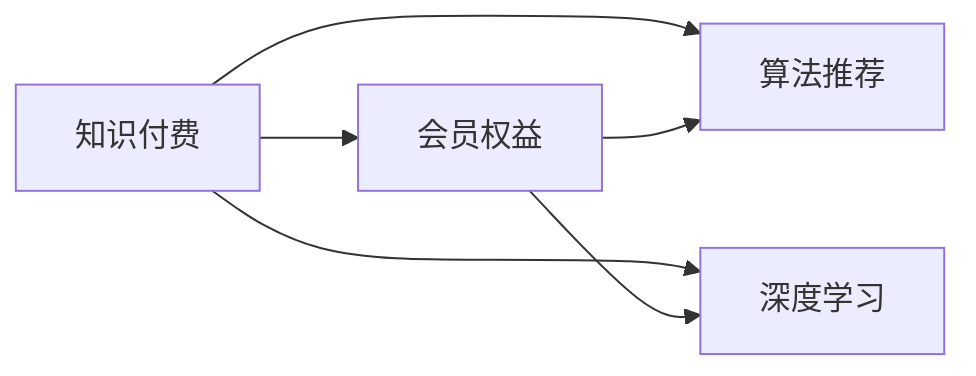

                 

# 如何设计有吸引力的知识付费会员权益

> 关键词：知识付费,会员权益,吸引用户,深度学习,算法推荐

## 1. 背景介绍

### 1.1 问题由来

随着互联网和数字技术的飞速发展，知识付费已经成为信息时代的重要趋势。越来越多的人愿意为获取高质量、系统化的知识内容支付费用，形成了新的消费模式。在这个过程中，如何设计吸引用户的知识付费会员权益，成为平台和内容创作者需要关注的核心问题。

### 1.2 问题核心关键点

在设计知识付费会员权益时，需要考虑以下几个核心关键点：

- **用户需求分析**：不同用户群体的需求各不相同，如何设计差异化的会员权益，满足不同用户的需求。
- **内容价值评估**：如何衡量内容的专业性和实用性，为会员提供更有价值的知识。
- **价格策略制定**：如何制定合理的会员订阅价格，同时保证平台的盈利。
- **激励机制设计**：如何通过激励机制，激发用户的活跃度和参与度。
- **会员权益迭代**：如何根据用户反馈和市场需求，不断优化和迭代会员权益。

这些问题涉及了用户需求、内容价值、定价策略、激励机制和权益迭代等多个方面，需要通过综合考虑和科学设计来达成目标。

## 2. 核心概念与联系

### 2.1 核心概念概述

在设计知识付费会员权益时，需要掌握以下几个关键概念：

- **知识付费**：指用户为获取知识内容而支付费用的消费模式。知识付费平台的运营依赖于高质量、专业化的内容资源。
- **会员权益**：指会员在平台内享受的特权和服务，如专属内容、优先推荐、VIP课程等。
- **算法推荐**：利用推荐算法为用户推荐个性化的内容，提升用户体验和满意度。
- **深度学习**：一种利用多层次神经网络模型进行数据学习和分析的机器学习方法，可以用于提高推荐算法的准确性。

这些概念之间的关系可以通过以下Mermaid流程图来展示：



这个流程图展示了几大核心概念及其相互关系：

1. 知识付费依赖于高质量的内容资源，会员权益和算法推荐是其重要组成部分。
2. 深度学习技术可以提升算法推荐的准确性，进而增强会员权益的价值。
3. 会员权益和算法推荐相互促进，提高用户的活跃度和满意度，从而支持平台的知识付费模式。

## 3. 核心算法原理 & 具体操作步骤

### 3.1 算法原理概述

知识付费平台的用户权益设计涉及多个方面的算法和技术，包括用户画像构建、内容推荐、用户行为分析等。其中，深度学习算法在提升会员权益的个性化和精准度方面具有重要作用。

具体而言，深度学习可以通过构建用户画像，了解用户的兴趣偏好和行为习惯，从而进行个性化的内容推荐。同时，深度学习还可以用于分析用户反馈和行为数据，优化推荐算法和会员权益设计。

### 3.2 算法步骤详解

#### 3.2.1 用户画像构建

用户画像构建是设计会员权益的基础。深度学习可以通过以下步骤构建用户画像：

1. **数据收集**：收集用户的浏览记录、购买记录、搜索行为等数据。
2. **数据预处理**：对收集到的数据进行清洗、去噪和归一化处理。
3. **特征工程**：提取和构建用户兴趣、行为等特征向量。
4. **模型训练**：使用深度学习模型（如神经网络、卷积神经网络、循环神经网络等）对用户画像进行训练。

#### 3.2.2 内容推荐

内容推荐是提升用户满意度和活跃度的关键。深度学习可以通过以下步骤进行内容推荐：

1. **数据收集**：收集用户对不同内容的评分、评论、点击等数据。
2. **特征提取**：提取内容的关键词、标签、类别等特征。
3. **模型训练**：使用深度学习模型对内容特征进行训练，构建推荐模型。
4. **推荐实践**：根据用户画像和推荐模型，为用户推荐个性化的内容。

#### 3.2.3 用户行为分析

用户行为分析是优化会员权益的重要依据。深度学习可以通过以下步骤进行用户行为分析：

1. **数据收集**：收集用户在平台上的行为数据，如搜索次数、点击次数、订阅内容等。
2. **数据预处理**：对收集到的数据进行清洗和归一化处理。
3. **特征工程**：提取和构建用户行为特征向量。
4. **模型训练**：使用深度学习模型对用户行为数据进行训练，构建用户行为模型。
5. **行为预测**：根据用户行为模型，预测用户的未来行为，优化会员权益设计。

### 3.3 算法优缺点

深度学习在构建用户画像和内容推荐方面具有显著的优势，但也存在以下缺点：

**优点：**

1. **精准度提升**：深度学习可以捕捉复杂的数据关系，提升推荐的精准度。
2. **自动化程度高**：深度学习算法可以自动化地进行特征提取和模型训练，减少人工干预。
3. **自适应性强**：深度学习算法可以根据用户反馈和行为数据进行实时调整，优化推荐结果。

**缺点：**

1. **计算资源消耗大**：深度学习模型通常需要大量的计算资源进行训练和推理，可能导致成本高昂。
2. **模型复杂度高**：深度学习模型的参数量较大，可能导致模型训练和推理速度较慢。
3. **解释性不足**：深度学习模型的决策过程复杂，难以解释和调试。

### 3.4 算法应用领域

深度学习在知识付费平台的用户权益设计中，可以应用于以下领域：

- **个性化推荐**：根据用户画像和行为数据，为用户推荐个性化的内容。
- **内容筛选和过滤**：根据用户的偏好和行为，筛选和过滤推荐内容。
- **用户行为预测**：预测用户的未来行为，优化会员权益设计。
- **会员等级和奖励机制**：根据用户的行为和消费数据，设计合理的会员等级和奖励机制。
- **平台活动和促销**：通过用户行为分析，设计有针对性的平台活动和促销策略。

## 4. 数学模型和公式 & 详细讲解 & 举例说明

### 4.1 数学模型构建

深度学习在用户画像构建和内容推荐中的应用，可以通过构建深度神经网络模型来实现。

以用户画像构建为例，假设用户画像由用户兴趣、行为等特征组成，记为 $\mathbf{x} = (x_1, x_2, ..., x_n)$。用户画像的深度学习模型可以表示为：

$$
h_\theta(\mathbf{x}) = \sigma(\mathbf{W}\mathbf{x} + \mathbf{b})
$$

其中，$\mathbf{W}$ 为权重矩阵，$\mathbf{b}$ 为偏置向量，$\sigma$ 为激活函数。

### 4.2 公式推导过程

以内容推荐为例，假设内容由特征向量 $\mathbf{c} = (c_1, c_2, ..., c_m)$ 表示，内容推荐的目标是预测用户对内容的评分 $y$。可以使用深度学习模型进行预测：

$$
y = \mathbf{W}^\top \sigma(\mathbf{W}\mathbf{x} + \mathbf{b})
$$

其中，$\mathbf{W}$ 为权重矩阵，$\mathbf{b}$ 为偏置向量，$\sigma$ 为激活函数。

### 4.3 案例分析与讲解

假设某知识付费平台的会员权益设计如下：

1. **基础会员**：每月20元，可以访问平台所有内容。
2. **高级会员**：每月50元，可以访问平台所有内容，同时享受专属课程和优先推荐服务。
3. **VIP会员**：每月100元，可以访问平台所有内容，享受专属课程和优先推荐服务，同时每月获得一次免费订阅机会。

根据用户画像和内容推荐模型，可以分析不同会员等级对用户满意度和活跃度的影响。例如，通过深度学习模型对用户画像和行为数据进行分析，发现高级会员的活跃度和满意度显著高于基础会员。因此，平台可以将高级会员的会员权益进行优化，进一步提升用户价值。

## 5. 项目实践：代码实例和详细解释说明

### 5.1 开发环境搭建

在项目实践中，我们需要准备以下开发环境：

1. **Python环境**：选择Python 3.7或以上版本，确保深度学习库的兼容性。
2. **深度学习库**：安装TensorFlow或PyTorch等深度学习库，支持深度神经网络模型的训练和推理。
3. **数据集准备**：准备用户数据、内容数据等，用于训练和测试模型。
4. **服务器配置**：选择性能较高的服务器或GPU集群，确保深度学习模型的训练和推理速度。

### 5.2 源代码详细实现

以下是一个简单的知识付费平台会员权益设计的代码实现，用于演示深度学习在用户画像构建和内容推荐中的应用。

```python
import tensorflow as tf
from tensorflow.keras.layers import Dense, Input
from tensorflow.keras.models import Model

# 定义用户画像的深度学习模型
user_input = Input(shape=(10,))
user_profiles = Dense(64, activation='relu')(user_input)
user_profiles = Dense(32, activation='relu')(user_profiles)
user_profiles = Dense(2, activation='softmax')(user_profiles)
user_profile_model = Model(inputs=user_input, outputs=user_profiles)

# 定义内容推荐的深度学习模型
content_input = Input(shape=(5,))
content_features = Dense(64, activation='relu')(content_input)
content_features = Dense(32, activation='relu')(content_features)
content_recommendation = Dense(1, activation='sigmoid')(content_features)
content_recommendation_model = Model(inputs=content_input, outputs=content_recommendation)

# 构建训练流程
user_profile_model.compile(optimizer='adam', loss='categorical_crossentropy', metrics=['accuracy'])
content_recommendation_model.compile(optimizer='adam', loss='binary_crossentropy', metrics=['accuracy'])

# 准备训练数据
user_data = ...
content_data = ...
labels = ...

# 训练用户画像模型
user_profile_model.fit(user_data, labels, epochs=10, batch_size=32)

# 训练内容推荐模型
content_recommendation_model.fit(content_data, labels, epochs=10, batch_size=32)
```

### 5.3 代码解读与分析

代码中定义了两个深度学习模型，一个用于用户画像构建，另一个用于内容推荐。用户画像模型输出一个2维的分类结果，表示用户属于两个类别中的哪一个。内容推荐模型输出一个0-1之间的值，表示用户对内容的评分。

在训练过程中，使用交叉熵损失和二元交叉熵损失进行模型训练，同时监控模型的准确率。训练数据和标签需要根据具体应用场景进行调整。

### 5.4 运行结果展示

训练完成后，可以使用模型进行用户画像和内容推荐。例如，对于一个新的用户，可以使用用户画像模型预测其兴趣偏好，然后使用内容推荐模型为其推荐个性化的内容。

## 6. 实际应用场景

### 6.1 智能学习平台

在智能学习平台上，深度学习可以用于个性化推荐和用户画像构建，提升学习效果和用户满意度。例如，基于用户的学习记录、测评成绩等数据，构建用户画像，为其推荐适合的课程和练习题。

### 6.2 商业培训

在商业培训领域，深度学习可以用于分析员工的学习行为和效果，设计有针对性的培训课程。例如，通过分析员工的培训记录和绩效数据，构建用户画像，为其推荐适合的培训课程和教材。

### 6.3 在线教育

在线教育平台可以通过深度学习算法，优化课程推荐和用户互动。例如，根据用户的观看记录和反馈，动态调整课程推荐算法，提升用户的学习体验和效果。

### 6.4 未来应用展望

未来，深度学习在知识付费平台的会员权益设计中，将有以下发展趋势：

1. **多模态学习**：结合图像、语音等多模态数据，提升用户画像的准确性和全面性。
2. **动态调整**：根据用户反馈和行为数据，实时调整推荐算法和会员权益设计，提升用户满意度。
3. **跨领域应用**：将深度学习算法应用于更多领域，如金融、医疗、教育等，扩展知识付费平台的覆盖范围。
4. **隐私保护**：在使用用户数据进行深度学习时，确保用户隐私和数据安全。

## 7. 工具和资源推荐

### 7.1 学习资源推荐

为了深入了解深度学习在知识付费平台中的应用，推荐以下学习资源：

1. **《深度学习》教材**：斯坦福大学吴恩达教授的深度学习课程，系统介绍了深度学习的原理和应用。
2. **TensorFlow官方文档**：TensorFlow的官方文档，提供了详细的API和使用示例。
3. **Keras官方文档**：Keras的官方文档，提供了简单易用的深度学习框架。
4. **Coursera《深度学习专项课程》**：由吴恩达教授主讲的深度学习专项课程，涵盖深度学习的基础知识和应用。
5. **GitHub深度学习项目**：GitHub上大量的深度学习项目和代码示例，提供了丰富的学习资源。

### 7.2 开发工具推荐

在开发知识付费平台时，可以使用以下工具：

1. **PyTorch**：一个开源的深度学习框架，支持动态图和静态图，提供了丰富的深度学习库和工具。
2. **TensorFlow**：由Google开发的深度学习框架，支持分布式计算和GPU加速。
3. **Jupyter Notebook**：一个交互式的开发环境，支持Python代码的编写和执行。
4. **Google Colab**：一个在线Jupyter Notebook环境，支持GPU加速，方便开发者进行深度学习实验。
5. **Amazon SageMaker**：AWS提供的深度学习平台，支持模型训练、部署和优化。

### 7.3 相关论文推荐

深度学习在知识付费平台中的应用，涉及多个前沿研究方向。以下是几篇代表性的相关论文：

1. **《深度学习在个性化推荐中的应用》**：介绍了深度学习在个性化推荐算法中的应用，提供了具体的实现方法和优化策略。
2. **《用户画像构建与推荐算法研究》**：探讨了用户画像的构建方法和推荐算法的设计，提供了实证研究结果。
3. **《跨领域深度学习在推荐系统中的应用》**：研究了跨领域深度学习在推荐系统中的应用，提出了新的推荐算法和优化方法。

## 8. 总结：未来发展趋势与挑战

### 8.1 总结

本文详细介绍了如何利用深度学习技术设计知识付费平台的会员权益，涵盖了用户画像构建、内容推荐、用户行为分析等多个方面。通过深度学习，平台可以构建个性化推荐模型，提升用户满意度和活跃度，实现知识付费的可持续发展。

### 8.2 未来发展趋势

深度学习在知识付费平台的会员权益设计中，将有以下发展趋势：

1. **多模态学习**：结合图像、语音等多模态数据，提升用户画像的准确性和全面性。
2. **动态调整**：根据用户反馈和行为数据，实时调整推荐算法和会员权益设计，提升用户满意度。
3. **跨领域应用**：将深度学习算法应用于更多领域，如金融、医疗、教育等，扩展知识付费平台的覆盖范围。
4. **隐私保护**：在使用用户数据进行深度学习时，确保用户隐私和数据安全。

### 8.3 面临的挑战

尽管深度学习在知识付费平台的会员权益设计中具有重要价值，但在实践中仍面临以下挑战：

1. **计算资源消耗大**：深度学习模型需要大量的计算资源进行训练和推理，可能导致成本高昂。
2. **模型复杂度高**：深度学习模型的参数量较大，可能导致模型训练和推理速度较慢。
3. **解释性不足**：深度学习模型的决策过程复杂，难以解释和调试。

### 8.4 研究展望

未来，需要解决深度学习在知识付费平台中的以下问题：

1. **高效计算**：优化深度学习模型的训练和推理过程，降低计算资源消耗。
2. **模型简化**：简化深度学习模型的结构，提高训练和推理速度。
3. **可解释性增强**：增强深度学习模型的可解释性，提高决策的透明度和可靠性。

## 9. 附录：常见问题与解答

### Q1：如何设计吸引用户的知识付费会员权益？

A：设计吸引用户的知识付费会员权益需要考虑用户需求、内容价值、价格策略、激励机制和权益迭代等多个方面。具体措施包括：

1. **用户画像构建**：通过深度学习技术构建用户画像，了解用户的兴趣偏好和行为习惯，为其推荐个性化的内容。
2. **内容推荐优化**：使用深度学习算法优化内容推荐模型，提升推荐的精准度和个性化程度。
3. **价格策略调整**：根据用户反馈和行为数据，调整会员订阅价格，确保平台盈利的同时满足用户需求。
4. **激励机制设计**：设计合理的激励机制，如积分、优惠券、专属课程等，激发用户的活跃度和参与度。
5. **权益迭代优化**：根据用户反馈和市场需求，不断优化和迭代会员权益，提升用户体验和满意度。

### Q2：如何构建用户画像？

A：构建用户画像需要经过以下步骤：

1. **数据收集**：收集用户的浏览记录、购买记录、搜索行为等数据。
2. **数据预处理**：对收集到的数据进行清洗、去噪和归一化处理。
3. **特征工程**：提取和构建用户兴趣、行为等特征向量。
4. **模型训练**：使用深度学习模型对用户画像进行训练。

### Q3：如何提升内容推荐的精准度？

A：提升内容推荐的精准度需要以下措施：

1. **数据收集**：收集用户对不同内容的评分、评论、点击等数据。
2. **特征提取**：提取内容的关键词、标签、类别等特征。
3. **模型训练**：使用深度学习模型对内容特征进行训练，构建推荐模型。
4. **推荐实践**：根据用户画像和推荐模型，为用户推荐个性化的内容。

### Q4：深度学习在知识付费平台中的应用有哪些？

A：深度学习在知识付费平台中的应用包括：

1. **用户画像构建**：通过深度学习技术构建用户画像，了解用户的兴趣偏好和行为习惯。
2. **内容推荐**：使用深度学习算法优化内容推荐模型，提升推荐的精准度和个性化程度。
3. **用户行为分析**：通过深度学习技术分析用户行为数据，预测用户的未来行为，优化会员权益设计。
4. **平台活动和促销**：通过用户行为分析，设计有针对性的平台活动和促销策略。

### Q5：如何处理深度学习模型的解释性不足问题？

A：处理深度学习模型的解释性不足问题需要以下措施：

1. **可视化**：使用可视化工具，如TensorBoard、Weights & Biases等，可视化模型的决策过程。
2. **特征重要性分析**：使用特征重要性分析方法，如SHAP、LIME等，分析模型对不同特征的依赖程度。
3. **可解释模型**：使用可解释性强的模型，如决策树、线性回归等，增强模型的解释性。

---

作者：禅与计算机程序设计艺术 / Zen and the Art of Computer Programming

