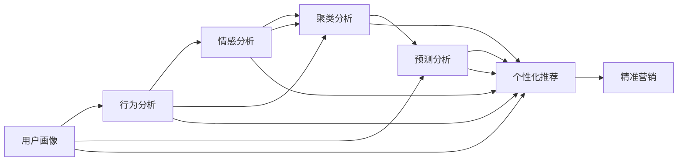

                 

# 如何进行有效的用户分层运营

> 关键词：用户细分,精准营销,数据驱动,AI技术,用户画像,多维度分析

## 1. 背景介绍

随着互联网的快速发展，企业之间的竞争愈发激烈，如何有效运营用户以提高转化率和忠诚度成为了众多企业关注的焦点。用户运营的核心在于精准化营销和个性化服务，而用户细分是实现这一目标的重要手段。通过用户细分，企业可以更准确地定位用户需求，实施差异化的营销策略，实现客户满意度和企业收益的双提升。

用户细分（User Segmentation），是指基于用户行为、属性等特征将用户划分为不同的群体。通过用户细分，企业可以更精准地了解各类用户群体的特征、需求和行为规律，从而制定更为针对性的营销策略和个性化服务，有效提升用户体验和业务价值。

## 2. 核心概念与联系

### 2.1 核心概念概述

要实现有效的用户分层运营，首先需要明确几个核心概念：

- **用户画像**：综合用户的各类特征，构建详细的用户档案，以便于精确地理解用户。
- **行为分析**：通过分析用户在平台上的行为数据，识别用户的兴趣和需求。
- **情感分析**：通过自然语言处理等技术，分析用户对产品和服务的情感倾向。
- **聚类分析**：将用户划分为不同的群体，使企业更易实施精准营销。
- **预测分析**：使用机器学习算法预测用户行为和需求，优化营销策略。

通过这些概念，我们可以构建一个覆盖用户行为、属性、情感等多维度的用户分层运营框架。

### 2.2 核心概念原理和架构的 Mermaid 流程图



该图展示了用户画像、行为分析、情感分析、聚类分析、预测分析、个性化推荐和精准营销之间的关系。从用户画像出发，通过行为分析和情感分析，构建详细的用户档案，再利用聚类分析和预测分析，将用户划分为不同的群体，最后通过个性化推荐和精准营销，实现差异化的营销策略和个性化服务。

## 3. 核心算法原理 & 具体操作步骤

### 3.1 算法原理概述

用户分层的算法原理主要基于聚类分析和机器学习模型。聚类分析通过对用户行为、属性等数据进行划分，将用户分为不同的群体，以便于进行精准营销。常用的聚类算法包括K-means、层次聚类、DBSCAN等。机器学习模型通过分析用户的历史行为、属性等数据，预测用户未来的行为和需求，以便于优化营销策略。常用的机器学习模型包括线性回归、逻辑回归、决策树、随机森林、神经网络等。

### 3.2 算法步骤详解

#### 3.2.1 数据准备

用户细分的第一步是数据准备。通常需要收集用户的行为数据（如浏览记录、购买历史等）、属性数据（如年龄、性别、地域等）、情感数据（如用户评论、情感评分等）等。此外，还需要对数据进行清洗和预处理，如去除重复记录、处理缺失值等。

#### 3.2.2 特征工程

特征工程是将原始数据转化为可供模型使用的特征的过程。用户细分中的特征工程包括特征提取、特征选择、特征缩放等。例如，可以使用TF-IDF等技术将用户的浏览记录转化为特征向量，或者使用PCA等降维技术减少数据的维度。

#### 3.2.3 聚类分析

聚类分析是用户分层的核心步骤，将用户分为不同的群体。常用的聚类算法包括K-means、层次聚类、DBSCAN等。这些算法的基本原理是通过计算用户间的相似度，将相似的用户分为一组。通过多次迭代，最终将用户划分为不同的群体。

#### 3.2.4 模型训练

模型训练是预测分析的核心步骤。使用机器学习模型对用户的历史行为、属性等数据进行训练，预测用户未来的行为和需求。常用的模型包括线性回归、逻辑回归、决策树、随机森林、神经网络等。

#### 3.2.5 模型评估

模型训练完成后，需要对模型进行评估。常用的评估指标包括准确率、召回率、F1值等。此外，还需要对模型的泛化能力进行评估，如使用交叉验证等技术。

#### 3.2.6 个性化推荐

个性化推荐是精准营销的核心步骤。通过分析用户的历史行为、属性等数据，预测用户未来的行为和需求，生成个性化的推荐结果。常用的推荐算法包括协同过滤、基于内容的推荐、混合推荐等。

#### 3.2.7 精准营销

精准营销是将用户细分的成果应用于实际营销过程。通过差异化的营销策略和个性化服务，提升用户满意度和企业收益。常用的营销策略包括邮件营销、社交媒体营销、广告投放等。

### 3.3 算法优缺点

用户细分的优点包括：

- **提高精准度**：通过用户细分，企业可以更准确地定位用户需求，实施差异化的营销策略。
- **提升用户体验**：通过个性化服务，提升用户满意度和忠诚度。
- **优化资源配置**：通过分析用户数据，优化资源配置，提高营销效果。

用户细分的缺点包括：

- **数据隐私问题**：用户数据的收集和使用涉及用户隐私，需要严格遵守法律法规。
- **数据质量问题**：数据质量直接影响用户分层的准确性和效果。
- **模型复杂性**：用户细分的模型较为复杂，需要多维度的数据分析和算法模型。

### 3.4 算法应用领域

用户细分不仅适用于电商、金融、互联网等领域，还可以应用于医疗、教育、旅游等行业。例如：

- **电商行业**：通过用户细分，电商企业可以更精准地进行商品推荐和广告投放，提高转化率和销售额。
- **金融行业**：金融企业可以通过用户细分，识别高价值客户，提供差异化的理财和贷款服务。
- **互联网行业**：互联网企业可以通过用户细分，优化网站内容和用户体验，提升用户粘性和留存率。
- **医疗行业**：医疗企业可以通过用户细分，提供个性化的医疗服务和健康管理方案。
- **教育行业**：教育企业可以通过用户细分，制定差异化的教育内容和教学策略。
- **旅游行业**：旅游企业可以通过用户细分，提供个性化的旅游推荐和服务。

## 4. 数学模型和公式 & 详细讲解 & 举例说明

### 4.1 数学模型构建

用户细分的数学模型主要基于聚类分析和机器学习模型。这里以K-means算法为例，说明用户细分的数学模型构建过程。

K-means算法通过将数据划分为K个簇来实现用户细分。其基本步骤如下：

1. 初始化K个簇的中心点。
2. 将每个样本点分配到最近的簇中心。
3. 重新计算每个簇的中心点。
4. 重复步骤2和步骤3，直到簇中心不再变化或达到预设的迭代次数。

其中，簇的中心点是代表该簇的特征向量，通常需要经过多次迭代才能收敛到最优解。

### 4.2 公式推导过程

K-means算法的核心公式包括簇中心点的更新公式和样本点分配公式。以下是K-means算法的核心公式推导过程：

设训练样本集为 $X=\{x_1, x_2, ..., x_n\}$，每个样本为 $x_i=(x_{i1}, x_{i2}, ..., x_{id})$，其中 $d$ 为样本维度。设聚类中心数为 $K$，初始化 $K$ 个聚类中心为 $\mu_1, \mu_2, ..., \mu_K$。样本点 $x_i$ 分配到第 $k$ 个簇的决策函数为：

$$
d(x_i, \mu_k) = \sqrt{\sum_{j=1}^d(x_{ij} - \mu_{kj})^2}
$$

其中 $(x_{ij}, \mu_{kj})$ 分别为样本点和簇中心的第 $j$ 维特征值。

样本点 $x_i$ 分配到距离最近的簇中心，即：

$$
k(x_i) = \mathop{\arg\min}_{1 \leq k \leq K} d(x_i, \mu_k)
$$

簇中心 $\mu_k$ 的更新公式为：

$$
\mu_k = \frac{\sum_{x_i \in C_k} x_i}{|C_k|}
$$

其中 $C_k$ 为分配到第 $k$ 个簇的样本点集合，$|C_k|$ 为该集合的大小。

通过多次迭代，直到簇中心不再变化或达到预设的迭代次数，即可得到最优的聚类结果。

### 4.3 案例分析与讲解

以电商行业为例，用户细分可以分为以下步骤：

1. **数据准备**：收集用户的浏览记录、购买历史、属性数据等。
2. **特征工程**：将浏览记录转化为特征向量，进行特征选择和特征缩放。
3. **聚类分析**：使用K-means算法将用户分为不同的群体。
4. **模型训练**：使用决策树模型预测用户的购买行为。
5. **模型评估**：使用准确率和召回率等指标评估模型的效果。
6. **个性化推荐**：根据用户的聚类结果和购买行为，生成个性化的推荐结果。
7. **精准营销**：通过邮件营销、广告投放等手段，提升用户满意度和转化率。

以某电商平台为例，通过用户细分，可以识别出以下几类用户群体：

- **高价值用户**：购买频率高、消费金额大的用户，提供专属优惠券和高级服务等。
- **新用户**：刚注册的用户，通过推荐系统引导其完成首次购买。
- **高潜力用户**：购买频率低、消费金额高的用户，通过个性化推荐和服务提升其忠诚度。
- **低活跃用户**：一段时间内未进行购买的用户，通过邮件营销和社交媒体营销唤醒其购买欲望。

通过以上用户细分策略，该电商平台实现了精准营销和个性化服务，提高了用户的转化率和忠诚度。

## 5. 项目实践：代码实例和详细解释说明

### 5.1 开发环境搭建

在进行用户细分和精准营销的实践时，需要使用Python、Pandas、NumPy、Scikit-learn等工具。以下是开发环境的搭建步骤：

1. 安装Python：从官网下载并安装Python 3.6及以上版本。
2. 安装Pandas：使用pip安装Pandas库。
3. 安装NumPy：使用pip安装NumPy库。
4. 安装Scikit-learn：使用pip安装Scikit-learn库。
5. 安装K-means算法库：使用pip安装K-means算法库，如sklearn.cluster。
6. 安装可视化工具：如matplotlib、seaborn等。

### 5.2 源代码详细实现

以下是使用Python和Scikit-learn库实现K-means聚类算法的示例代码：

```python
import numpy as np
from sklearn.cluster import KMeans
from sklearn.metrics import silhouette_score

# 假设有一个用户行为数据集X
X = np.array([[1.2, 2.3], [3.4, 4.5], [5.6, 6.7], [7.8, 8.9], [9.0, 1.0]])

# 定义K-means聚类模型
kmeans = KMeans(n_clusters=2, init='k-means++', max_iter=300)

# 训练模型
kmeans.fit(X)

# 获取聚类结果
labels = kmeans.labels_

# 计算聚类的 silhouette 系数
silhouette_score(X, labels)
```

### 5.3 代码解读与分析

以上代码展示了K-means聚类算法的实现过程。其中，`KMeans`类是Scikit-learn库中实现K-means聚类算法的类，`n_clusters`参数指定聚类的数量，`init`参数指定初始聚类中心的选择方式，`max_iter`参数指定最大迭代次数。

在训练模型时，将用户行为数据集X作为输入，使用`fit`方法进行训练。训练完成后，使用`labels_`属性获取每个样本的聚类标签。最后，使用`silhouette_score`函数计算聚类的silhouette系数，评估聚类效果。

## 6. 实际应用场景

### 6.1 智能客服系统

智能客服系统可以通过用户细分，提供个性化的服务和解答，提升用户体验。例如，智能客服系统可以根据用户的历史问题记录，将用户分为不同的群体，如新用户、高价值用户、低活跃用户等，并提供针对性的服务。

### 6.2 金融行业

金融行业可以通过用户细分，识别高价值客户和潜在风险客户，提供差异化的金融服务。例如，银行可以根据用户的购买历史和信用记录，将用户分为不同的群体，提供个性化的理财产品和贷款服务。

### 6.3 电商行业

电商行业可以通过用户细分，优化商品推荐和广告投放，提高用户转化率和销售额。例如，电商平台可以根据用户的浏览记录和购买历史，将用户分为不同的群体，提供个性化的商品推荐和优惠券。

### 6.4 在线教育

在线教育可以通过用户细分，制定差异化的教育内容和教学策略，提升学生的学习效果。例如，在线教育平台可以根据学生的学习行为和成绩，将学生分为不同的群体，提供个性化的学习资源和辅导服务。

### 6.5 医疗行业

医疗行业可以通过用户细分，提供个性化的医疗服务和健康管理方案。例如，医疗平台可以根据用户的健康记录和疾病史，将用户分为不同的群体，提供个性化的医疗咨询和健康管理方案。

### 6.6 旅游行业

旅游行业可以通过用户细分，提供个性化的旅游推荐和服务。例如，旅游平台可以根据用户的旅游历史和偏好，将用户分为不同的群体，提供个性化的旅游推荐和定制化服务。

## 7. 工具和资源推荐

### 7.1 学习资源推荐

为了深入了解用户细分的原理和实践，以下是一些推荐的学习资源：

- 《Python数据分析基础》：介绍Python数据分析的基本概念和常用库。
- 《机器学习实战》：介绍常用的机器学习算法和工具。
- 《数据科学实战》：介绍数据处理、特征工程、模型训练等实战技能。
- K-means算法的详细介绍：详细讲解K-means算法的基本原理和实现方法。

### 7.2 开发工具推荐

为了高效实现用户细分和精准营销，以下是一些推荐的开发工具：

- Python：广泛使用的编程语言，适用于数据分析和机器学习。
- Pandas：强大的数据分析库，支持数据清洗和预处理。
- NumPy：高效的多维数组计算库，支持矩阵运算和统计分析。
- Scikit-learn：常用的机器学习库，支持各种常见的机器学习算法。
- K-means算法库：如sklearn.cluster，实现K-means聚类算法。

### 7.3 相关论文推荐

为了深入了解用户细分的最新研究和应用，以下是一些推荐的论文：

- 《用户细分的数学建模与算法研究》：介绍用户细分的数学建模和算法实现。
- 《基于用户细分的精准营销研究》：介绍用户细分在精准营销中的应用。
- 《大数据背景下的用户细分技术研究》：介绍大数据背景下的用户细分技术。
- 《电商行业用户细分与精准营销的实现》：介绍电商行业用户细分的实现方法和效果评估。

## 8. 总结：未来发展趋势与挑战

### 8.1 研究成果总结

用户细分在多个领域得到了广泛应用，并取得了显著的效果。其主要成果包括：

- **提升精准度**：通过用户细分，企业可以更准确地定位用户需求，实施差异化的营销策略。
- **提升用户体验**：通过个性化服务，提升用户满意度和忠诚度。
- **优化资源配置**：通过分析用户数据，优化资源配置，提高营销效果。

### 8.2 未来发展趋势

未来用户细分的发展趋势包括：

- **数据多样化**：随着数据收集技术的不断进步，用户数据将更加多样化，涵盖更多的行为和属性特征。
- **算法智能化**：未来的用户细分算法将更加智能化，结合更多前沿技术，如深度学习、自然语言处理等，提升细分效果。
- **实时化**：用户细分需要实时处理大量数据，未来的用户细分算法将更加高效，支持实时数据处理。
- **跨领域应用**：用户细分技术将应用于更多领域，如医疗、教育、旅游等，提升各行各业的用户运营效果。

### 8.3 面临的挑战

尽管用户细分技术取得了一定的成果，但仍面临以下挑战：

- **数据隐私问题**：用户数据的收集和使用涉及用户隐私，需要严格遵守法律法规。
- **数据质量问题**：用户数据的质量直接影响用户细分的准确性和效果。
- **算法复杂性**：用户细分的算法较为复杂，需要多维度的数据分析和算法模型。
- **实时性问题**：用户细分需要实时处理大量数据，对算法的实时性要求较高。
- **跨领域应用难度**：用户细分技术在跨领域应用时，需要适应不同领域的特点，增加了应用难度。

### 8.4 研究展望

未来的用户细分研究可以关注以下几个方向：

- **数据融合技术**：将多源数据进行融合，提升用户细分的准确性和效果。
- **算法优化**：优化用户细分的算法，提高算法的效率和精度。
- **跨领域应用**：探索用户细分技术在更多领域的应用，提升各行业的数据分析和用户运营效果。
- **用户隐私保护**：结合区块链等技术，提升用户数据的安全性和隐私保护。

## 9. 附录：常见问题与解答

### 9.1 如何选择合适的聚类算法？

答：选择合适的聚类算法需要考虑数据的特点和分析目标。常用的聚类算法包括K-means、层次聚类、DBSCAN等。如果数据具有球形分布，可以使用K-means算法；如果数据具有层次结构，可以使用层次聚类算法；如果数据具有任意形状，可以使用DBSCAN算法。

### 9.2 如何评估用户细分的结果？

答：评估用户细分的结果可以使用多种指标，如准确率、召回率、F1值等。此外，还可以使用轮廓系数（Silhouette Score）评估聚类效果，使用熵值（Entropy）评估用户分群的纯度。

### 9.3 如何提高用户细分的准确性？

答：提高用户细分的准确性可以从以下几个方面入手：

- **数据质量**：保证数据的完整性和准确性，减少噪声数据和异常值。
- **特征工程**：选择合适的特征并进行有效的特征选择和特征缩放，提升模型效果。
- **算法选择**：根据数据的特点和分析目标选择合适的聚类算法。
- **参数优化**：调整算法的参数，如聚类中心数量、迭代次数等，优化聚类效果。
- **数据预处理**：对数据进行预处理，如归一化、标准化等，提升模型效果。

通过以上措施，可以提高用户细分的准确性和效果，更好地实现用户运营的目标。

---

作者：禅与计算机程序设计艺术 / Zen and the Art of Computer Programming

