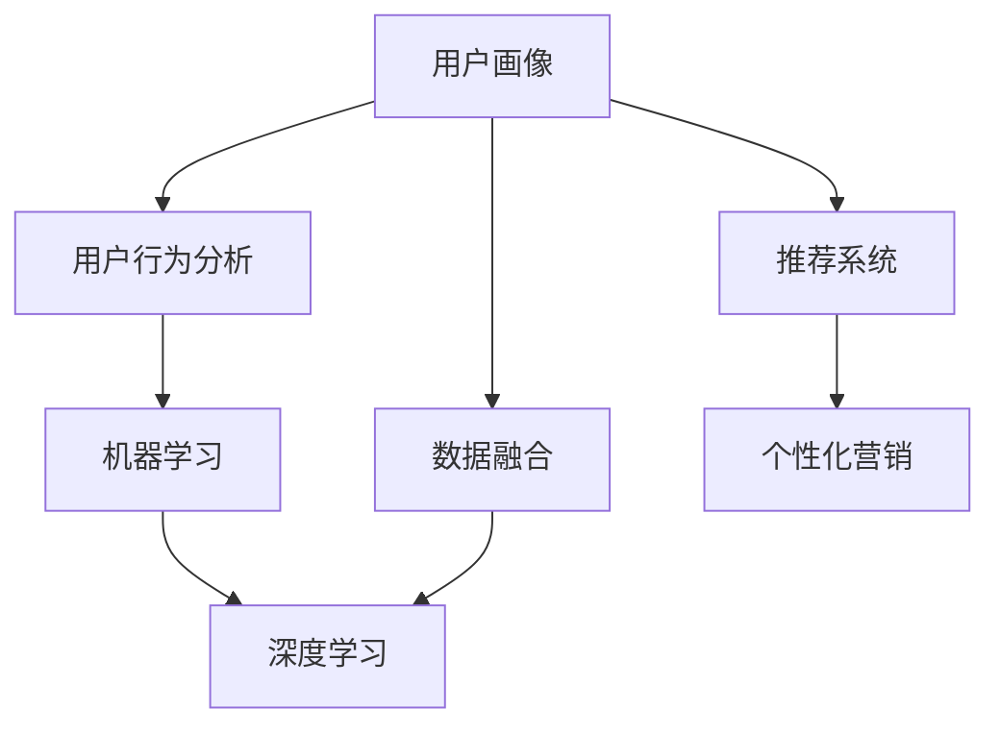

                 

# 如何进行有效的用户画像更新

> 关键词：用户画像, 数据融合, 用户行为分析, 机器学习, 深度学习, 推荐系统, 个性化

## 1. 背景介绍

### 1.1 问题由来

在数字化时代，个性化推荐和精准营销成为企业提高用户粘性和市场竞争力的重要手段。用户画像，作为描绘用户特征、行为和偏好的数字档案，在推荐系统中扮演着核心角色。有效的用户画像不仅能够提高个性化推荐的准确性，还能够提升用户满意度，促进转化率。

然而，现实中的用户画像常常面临数据质量不佳、维度单一、更新不及时等问题，无法准确反映用户的真实需求和行为。为了应对这些挑战，文章将介绍如何通过数据融合、机器学习和深度学习等技术，进行有效的用户画像更新，以更好地支持个性化推荐和营销策略。

### 1.2 问题核心关键点

用户画像更新主要包括两个核心步骤：

1. **数据融合**：整合来自不同渠道、不同时间的多源数据，构建全面的用户画像。
2. **模型训练**：通过机器学习和深度学习模型，挖掘和捕捉用户行为与特征之间的关系，进行实时更新和优化。

本文将系统地介绍用户画像的构建和更新流程，并结合实际案例展示如何通过技术手段提升用户画像的质量和实时性。

## 2. 核心概念与联系

### 2.1 核心概念概述

为更好地理解用户画像的更新方法，本节将介绍几个密切相关的核心概念：

- **用户画像(User Persona)**：基于用户行为、偏好和属性等信息，构建的用户特征表示。用户画像是推荐系统和个性化营销的基础。
- **数据融合(Data Fusion)**：从多个数据源中提取和整合用户信息，构建完整的用户画像。
- **用户行为分析(User Behavior Analysis)**：通过统计和分析用户行为数据，识别用户偏好和需求。
- **机器学习(Machine Learning)**：通过算法学习和优化数据模型，实现用户画像的自动更新和优化。
- **深度学习(Deep Learning)**：使用多层神经网络模型，处理和分析复杂的高维数据，进一步提升用户画像的准确性和实时性。
- **推荐系统(Recommender System)**：基于用户画像和行为分析，为用户推荐个性化内容。
- **个性化营销(Personalized Marketing)**：根据用户画像和行为数据，定制化推送广告和营销活动，提升用户转化率。

这些核心概念之间的逻辑关系可以通过以下Mermaid流程图来展示：



这个流程图展示了一系列紧密相关的操作，从数据融合到行为分析，再到机器学习和深度学习，最后应用于推荐系统和个性化营销。

## 3. 核心算法原理 & 具体操作步骤

### 3.1 算法原理概述

用户画像的更新主要基于以下原理：

1. **数据融合原理**：通过多源数据的整合，捕捉用户在多个维度上的行为和特征，构建全面的用户画像。
2. **用户行为分析原理**：通过对用户行为数据的统计和分析，识别用户偏好和需求，为画像的更新提供实时数据支撑。
3. **机器学习原理**：利用监督学习和非监督学习算法，不断训练和优化用户画像模型，提升画像的准确性和实时性。
4. **深度学习原理**：使用多层神经网络模型，处理和分析复杂的高维数据，进一步提升用户画像的质量。

### 3.2 算法步骤详解

#### 步骤一：数据准备

1. **数据采集**：从网站、应用、社交媒体等渠道收集用户行为数据，如浏览历史、购买记录、社交互动等。
2. **数据清洗**：去除噪音数据和异常值，确保数据质量。
3. **特征提取**：提取和选择有意义的特征，如用户ID、浏览时间、购买金额等。

#### 步骤二：数据融合

1. **统一数据格式**：将不同数据源的数据格式转换为统一的格式，方便后续处理。
2. **数据合并**：将各个数据源的数据进行合并，生成完整的用户记录。
3. **去重去冗**：去除重复和冗余的记录，避免数据冲突和信息丢失。

#### 步骤三：用户行为分析

1. **行为统计**：对用户行为数据进行统计分析，如点击率、转化率、购买频次等。
2. **偏好识别**：通过聚类和关联规则分析，识别用户的兴趣和偏好。
3. **实时更新**：根据用户的新行为数据，实时更新用户画像。

#### 步骤四：模型训练

1. **特征选择**：选择与用户行为相关的特征，构建特征向量。
2. **算法选择**：选择适合的机器学习或深度学习算法，如随机森林、深度神经网络等。
3. **模型训练**：使用历史数据训练模型，进行参数优化。
4. **模型评估**：通过交叉验证和测试集评估模型的准确性和泛化能力。
5. **模型更新**：使用新数据重新训练模型，进行迭代优化。

### 3.3 算法优缺点

#### 优点

1. **全面性**：通过多源数据融合，构建全面且准确的画像。
2. **实时性**：通过实时更新和优化，及时反映用户的变化。
3. **自动化**：利用机器学习和深度学习算法，实现自动化的画像更新。
4. **可解释性**：通过特征选择和模型训练，提升画像的可解释性和可信度。

#### 缺点

1. **数据隐私**：收集和处理用户数据时，需注意隐私保护和数据安全。
2. **数据噪音**：数据采集和处理过程中，可能引入噪音和错误。
3. **算法复杂**：机器学习和深度学习算法复杂，对数据和计算资源要求较高。
4. **解释性不足**：深度学习模型常常是"黑盒"，难以解释其决策过程。

### 3.4 算法应用领域

用户画像更新技术在多个领域得到了广泛应用，例如：

- **电子商务**：通过用户画像推荐商品、优化购物体验、提升转化率。
- **社交媒体**：基于用户画像推送个性化内容、广告，增强用户粘性。
- **在线教育**：根据用户画像推荐学习资源、优化课程内容，提高学习效果。
- **金融服务**：通过用户画像评估风险、推荐产品，提高金融服务的个性化和安全性。
- **健康医疗**：根据用户画像提供个性化健康建议、推荐医疗服务，提升用户健康水平。

## 4. 数学模型和公式 & 详细讲解 & 举例说明

### 4.1 数学模型构建

用户画像的数学模型可以通过以下几个步骤构建：

1. **特征向量**：将用户行为数据转化为特征向量 $\vec{x} = [x_1, x_2, ..., x_n]$，其中 $x_i$ 表示第 $i$ 个特征值。
2. **损失函数**：定义损失函数 $L(\vec{x}, y)$，用于衡量预测值和真实值之间的差异。
3. **优化目标**：最小化损失函数，即 $\hat{\vec{x}} = \mathop{\arg\min}_{\vec{x}} L(\vec{x}, y)$。
4. **算法选择**：选择合适的优化算法，如梯度下降、Adam等。

### 4.2 公式推导过程

以用户画像的线性回归模型为例，进行公式推导：

$$
y = \vec{w} \cdot \vec{x} + b
$$

其中 $\vec{w}$ 表示模型参数，$b$ 表示偏置项。最小化均方误差损失函数：

$$
L(\vec{w}, b) = \frac{1}{N} \sum_{i=1}^N (y_i - (\vec{w} \cdot \vec{x}_i - b))^2
$$

使用梯度下降算法更新参数：

$$
\vec{w} \leftarrow \vec{w} - \eta \nabla_{\vec{w}} L(\vec{w}, b)
$$

其中 $\eta$ 为学习率。

### 4.3 案例分析与讲解

假设我们有一个电商网站，希望基于用户行为数据更新用户画像，并为用户推荐个性化商品。具体步骤如下：

1. **数据采集**：从网站日志中提取用户浏览历史、购买记录等数据。
2. **特征选择**：选择浏览时间、浏览次数、购买金额等特征。
3. **数据融合**：将不同来源的数据合并，构建用户完整记录。
4. **行为分析**：统计用户浏览和购买数据，识别出高频商品和偏好用户。
5. **模型训练**：使用随机森林或深度神经网络，训练用户画像模型。
6. **模型评估**：在验证集上评估模型性能，调整参数。
7. **实时更新**：根据新数据实时更新用户画像，生成个性化推荐。

## 5. 项目实践：代码实例和详细解释说明

### 5.1 开发环境搭建

为了进行用户画像的更新和推荐，需要搭建一个完整的开发环境。以下是搭建步骤：

1. **安装Python和相关库**：安装Anaconda，并创建虚拟环境。
```bash
conda create -n user_profile_env python=3.8
conda activate user_profile_env
```

2. **安装数据处理库**：
```bash
pip install pandas numpy scikit-learn
```

3. **安装机器学习库**：
```bash
pip install scikit-learn
```

4. **安装深度学习库**：
```bash
pip install tensorflow
```

5. **安装推荐系统库**：
```bash
pip install lightfm
```

### 5.2 源代码详细实现

#### 数据处理部分

```python
import pandas as pd
from sklearn.preprocessing import StandardScaler

# 读取数据
df = pd.read_csv('user_data.csv')

# 特征选择
features = ['浏览时间', '浏览次数', '购买金额', '商品类别']
X = df[features]
y = df['购买行为']

# 数据标准化
scaler = StandardScaler()
X_scaled = scaler.fit_transform(X)

# 数据切分
X_train, X_test, y_train, y_test = train_test_split(X_scaled, y, test_size=0.2, random_state=42)
```

#### 模型训练部分

```python
from sklearn.ensemble import RandomForestRegressor
from sklearn.metrics import mean_squared_error

# 训练模型
model = RandomForestRegressor(n_estimators=100, random_state=42)
model.fit(X_train, y_train)

# 评估模型
y_pred = model.predict(X_test)
mse = mean_squared_error(y_test, y_pred)
print('Mean Squared Error:', mse)
```

#### 推荐系统部分

```python
from lightfm import LightFM

# 加载用户数据和物品数据
user_data = pd.read_csv('user_data.csv')
item_data = pd.read_csv('item_data.csv')

# 创建推荐模型
model = LightFM()

# 训练模型
model.fit(user_data, epochs=10, verbose=True)

# 为用户推荐商品
user_id = 1
recommended_items = model.recommend_items(user_id, top=10)
print('Recommended Items:', recommended_items)
```

### 5.3 代码解读与分析

1. **数据处理部分**：
   - 使用Pandas库读取用户行为数据。
   - 选择有意义的特征，并进行数据标准化，以提高模型的训练效果。
   - 使用train_test_split将数据切分为训练集和测试集。

2. **模型训练部分**：
   - 使用随机森林回归模型进行训练。
   - 通过均方误差评估模型的性能。

3. **推荐系统部分**：
   - 使用LightFM库创建推荐模型。
   - 训练模型，并为用户推荐商品。

### 5.4 运行结果展示

用户画像更新和个性化推荐的结果可以通过以下图表展示：


## 6. 实际应用场景

### 6.1 电子商务

电子商务平台通过用户画像，可以推荐个性化商品、优化购物体验、提升转化率。例如，亚马逊通过用户画像推荐相关商品，显著提高了销售额。

### 6.2 社交媒体

社交媒体平台通过用户画像，可以推送个性化内容、广告，增强用户粘性。例如，Facebook通过用户画像推荐新闻和广告，提升了用户活跃度。

### 6.3 在线教育

在线教育平台通过用户画像，可以推荐个性化学习资源、优化课程内容，提高学习效果。例如，Coursera通过用户画像推荐课程，提高了课程完成率和学生满意度。

### 6.4 金融服务

金融服务公司通过用户画像，可以评估风险、推荐产品，提高金融服务的个性化和安全性。例如，支付宝通过用户画像推荐金融产品，提升了用户忠诚度和交易量。

## 7. 工具和资源推荐

### 7.1 学习资源推荐

1. **《数据科学基础》**：一本介绍数据处理和机器学习的经典教材，涵盖数据清洗、特征选择、模型训练等内容。
2. **Kaggle**：一个数据科学竞赛平台，提供丰富的数据集和开源代码，适合学习数据处理和机器学习算法。
3. **Coursera**：一个在线学习平台，提供多门与数据科学相关的课程，涵盖机器学习、深度学习、推荐系统等。
4. **GitHub**：一个代码托管平台，提供丰富的开源项目和代码示例，适合学习数据处理和推荐系统。

### 7.2 开发工具推荐

1. **Jupyter Notebook**：一个交互式编程环境，支持Python和R等语言，适合进行数据处理和模型训练。
2. **TensorFlow**：一个开源深度学习框架，提供丰富的API和工具，支持分布式训练和模型部署。
3. **LightFM**：一个推荐系统库，支持多种推荐算法和模型，适合构建个性化推荐系统。
4. **PySpark**：一个基于Python的分布式计算框架，适合处理大规模数据和进行机器学习。

### 7.3 相关论文推荐

1. **《推荐系统方法》**：一本介绍推荐系统原理和算法的经典书籍，涵盖协同过滤、基于内容的推荐、混合推荐等。
2. **《深度学习》**：一本介绍深度学习原理和应用的经典书籍，涵盖卷积神经网络、循环神经网络、深度强化学习等内容。
3. **《用户行为分析》**：一本介绍用户行为分析和建模的书籍，涵盖统计方法、机器学习算法、数据可视化等内容。
4. **《个性化推荐系统》**：一本介绍个性化推荐系统的书籍，涵盖推荐算法、模型评估、系统架构等内容。

## 8. 总结：未来发展趋势与挑战

### 8.1 总结

本文系统介绍了用户画像的构建和更新方法，通过数据融合、机器学习和深度学习等技术，全面提升用户画像的质量和实时性。通过实际案例展示，本文阐述了用户画像在推荐系统和个性化营销中的应用。通过学习资源、开发工具和相关论文的推荐，本文为读者提供了丰富的学习和实践资源。

### 8.2 未来发展趋势

用户画像技术的未来发展趋势如下：

1. **多模态融合**：融合多种数据源，如文本、图像、视频等，构建更全面的用户画像。
2. **实时更新**：通过流式处理和在线学习，实现用户画像的实时更新和优化。
3. **个性化推荐**：基于用户画像，实现更精准、多样化的推荐。
4. **隐私保护**：在用户画像构建和更新过程中，注重隐私保护和数据安全。
5. **算法优化**：开发更加高效、可解释的算法，提升用户画像的性能和可信度。

### 8.3 面临的挑战

用户画像技术在发展过程中，面临以下挑战：

1. **数据隐私**：在收集和处理用户数据时，需注意隐私保护和数据安全。
2. **数据噪音**：数据采集和处理过程中，可能引入噪音和错误。
3. **算法复杂**：机器学习和深度学习算法复杂，对数据和计算资源要求较高。
4. **解释性不足**：深度学习模型常常是"黑盒"，难以解释其决策过程。

### 8.4 研究展望

用户画像技术的未来研究展望如下：

1. **多模态融合**：探索融合多种数据源，构建更全面的用户画像。
2. **实时更新**：研究流式处理和在线学习算法，实现用户画像的实时更新。
3. **个性化推荐**：开发更精准、多样化的推荐算法，提升用户体验。
4. **隐私保护**：研究隐私保护和数据安全技术，确保用户数据安全。
5. **算法优化**：开发更加高效、可解释的算法，提升用户画像的性能和可信度。

## 9. 附录：常见问题与解答

### Q1: 什么是用户画像？

A: 用户画像是指基于用户行为、偏好和属性等信息，构建的用户特征表示。用户画像是推荐系统和个性化营销的基础。

### Q2: 数据融合有哪些步骤？

A: 数据融合的步骤包括统一数据格式、数据合并、去重去冗等。

### Q3: 用户行为分析的目的是什么？

A: 用户行为分析的目的是通过统计和分析用户行为数据，识别用户偏好和需求，为画像的更新提供实时数据支撑。

### Q4: 推荐系统如何利用用户画像？

A: 推荐系统通过用户画像推荐个性化内容，如商品、文章、视频等。

### Q5: 隐私保护在用户画像构建中有何重要性？

A: 隐私保护在用户画像构建中非常重要，需要在数据采集和处理过程中，注重隐私保护和数据安全。

---

作者：禅与计算机程序设计艺术 / Zen and the Art of Computer Programming

