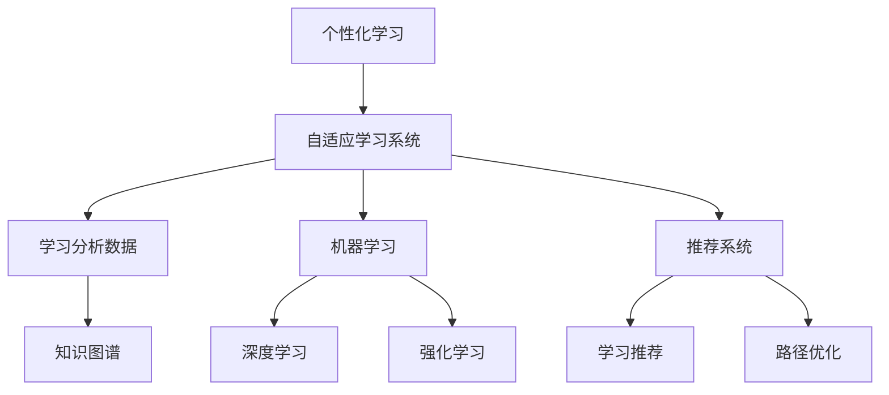

                 

## 1. 背景介绍

随着互联网和人工智能技术的迅猛发展，我们进入了一个信息爆炸的时代。面对海量数据和知识，如何高效获取和利用信息，成为当今社会的一个重要课题。传统的一对多、自上而下的教育方式，已经无法满足个性化的学习需求。个性化学习需要针对不同个体的学习特点，量身定制学习内容和路径，让每个学习者都能达到最优的学习效果。

个性化学习是一个多学科交叉领域，涉及认知心理学、教育学、信息科学等多个学科。当前，基于数据的个性化学习研究已经取得了初步成果，但仍有很多挑战和瓶颈待解决。本文将深入探讨个性化学习的基本概念、核心算法和实际应用，希望能为个性化学习研究提供一些思路和方法。

## 2. 核心概念与联系

### 2.1 核心概念概述

为了更好地理解个性化学习的原理和算法，我们首先介绍几个核心概念：

- **个性化学习**：指针对不同学习者的认知水平、兴趣和需求，提供量身定制的学习资源和策略，使学习者能够获得最佳学习效果的教育模式。个性化学习可以分为基于知识的学习和基于能力的学习两种方式。

- **自适应学习系统**：通过实时监测和评估学习者的表现，动态调整学习内容和学习路径，最大化学习效果的智能学习系统。常见的自适应学习系统包括Knewton、Smart Sparrow等。

- **学习分析数据**：指通过记录和分析学习者的行为数据，了解学习者的知识水平、学习风格、学习兴趣等信息，为个性化学习提供数据支持。常见的学习分析数据包括点击流、互动行为、成绩评估等。

- **机器学习**：指利用数据训练算法，使算法能够自主学习，并不断提升模型准确率和泛化能力的科学技术。机器学习在个性化学习中扮演着重要的角色，用于建模和预测学习者的行为。

- **推荐系统**：指通过分析用户的历史行为数据，为用户推荐可能感兴趣的物品的系统。推荐系统在个性化学习中，用于推荐学习资源和学习路径，提升学习效率。

这些核心概念之间存在着紧密的联系，共同构成了个性化学习的框架。通过了解这些概念的原理和架构，我们可以更好地把握个性化学习的研究方向和技术路径。

### 2.2 核心概念原理和架构的 Mermaid 流程图



这个流程图展示了几大核心概念之间的关系：

- 个性化学习依赖自适应学习系统，通过动态调整学习内容和学习路径，最大化学习效果。
- 自适应学习系统需要学习分析数据提供支持，通过对学习者行为数据的监测和分析，了解学习者的知识水平和学习风格。
- 机器学习用于建模和预测学习者的行为，为推荐系统和路径优化提供算法支持。
- 推荐系统通过分析学习者的历史行为数据，推荐可能感兴趣的课程和学习资源，提升学习效率。
- 知识图谱和深度学习、强化学习等技术，为学习者提供更丰富、更深入的学习内容。

## 3. 核心算法原理 & 具体操作步骤

### 3.1 算法原理概述

个性化学习的核心算法包括基于知识的推荐和基于能力的学习路径优化。下面我们将分别介绍这两种算法的原理和具体操作步骤。

### 3.2 算法步骤详解

#### 3.2.1 基于知识的推荐算法

基于知识的推荐算法主要依赖知识图谱和深度学习技术，为用户推荐可能感兴趣的学习资源。其主要步骤如下：

1. **构建知识图谱**：通过收集和学习者关注的主题和领域，构建领域知识图谱，识别出相关概念、概念关系和实体信息。

2. **特征提取**：将学习者的历史行为数据（如浏览记录、点击行为等）转化为高维特征向量，作为模型的输入。

3. **深度学习建模**：利用深度神经网络（如CNN、RNN、LSTM等）对特征向量进行建模，学习不同学习者对知识点的兴趣和偏好。

4. **推荐结果排序**：根据学习者的兴趣偏好，对推荐结果进行排序，选取最相关、最有可能感兴趣的学习资源。

5. **动态调整**：实时监测学习者的反馈和行为变化，动态调整推荐模型，优化推荐结果。

#### 3.2.2 基于能力的学习路径优化算法

基于能力的学习路径优化算法主要依赖机器学习技术，为学习者推荐最优的学习路径，使学习者能够高效、系统地掌握知识。其主要步骤如下：

1. **评估能力**：通过学习者在学习过程中表现出的掌握程度，评估学习者的能力水平。

2. **建模预测**：利用机器学习算法（如决策树、随机森林、神经网络等）预测学习者的学习能力和目标，生成学习路径。

3. **路径规划**：根据学习者的能力和目标，规划最优的学习路径，包括推荐的课程、学习材料和互动活动等。

4. **实时调整**：实时监测学习者的学习状态和行为变化，动态调整学习路径，优化学习效果。

### 3.3 算法优缺点

#### 3.3.1 基于知识的推荐算法

**优点**：
- 能够根据学习者的兴趣和偏好，推荐更相关、更有用的学习资源。
- 可以动态调整推荐模型，提升推荐效果。

**缺点**：
- 需要构建大规模知识图谱，数据采集和维护成本较高。
- 深度学习模型需要大量标注数据进行训练，数据标注工作量大。

#### 3.3.2 基于能力的学习路径优化算法

**优点**：
- 能够根据学习者的能力和目标，推荐最优的学习路径，提升学习效率。
- 能够实时监测和评估学习者的学习状态，动态调整学习路径，优化学习效果。

**缺点**：
- 需要大量学习行为数据进行建模，数据采集和处理工作量大。
- 机器学习算法需要大量计算资源进行训练和优化，硬件要求较高。

### 3.4 算法应用领域

个性化学习算法在多个领域都有着广泛的应用：

- **教育领域**：基于知识的推荐算法在K-12教育、职业教育等领域中，用于推荐适合学习者的课程和学习资源；基于能力的学习路径优化算法用于规划最优的学习路径，提升学习效果。

- **企业培训**：基于知识的推荐算法用于推荐培训课程和资源，帮助员工提升技能；基于能力的学习路径优化算法用于个性化职业发展规划。

- **医疗领域**：基于知识的推荐算法用于推荐医学知识库和研究论文，帮助医生提升诊疗水平；基于能力的学习路径优化算法用于个性化医疗培训，提升临床技能。

- **金融领域**：基于知识的推荐算法用于推荐金融知识库和研究报告，帮助投资者做出更好的决策；基于能力的学习路径优化算法用于个性化金融技能培训，提升从业者素质。

以上仅是一些常见的应用领域，随着个性化学习技术的不断进步，相信未来会有更多领域的突破和应用。

## 4. 数学模型和公式 & 详细讲解 & 举例说明

### 4.1 数学模型构建

个性化学习的数学模型主要包括推荐模型和学习路径优化模型。我们以基于知识的推荐算法为例，介绍模型的构建过程。

假设知识图谱中有$m$个实体$E$，每个实体$e_i$有$d$个特征$f_i$，学习者有$n$个行为记录$r_j$，每个行为$r_j$有$k$个特征$p_j$，基于知识的推荐算法数学模型如下：

$$
P(e_i|r_j) = \frac{e_i^T W r_j}{\sum_{e_i \in E} e_i^T W r_j}
$$

其中$W$为权重矩阵，$e_i^T$为实体特征向量，$r_j^T$为行为特征向量。

### 4.2 公式推导过程

基于上述数学模型，我们可以通过最大似然估计法求解权重矩阵$W$：

$$
W = \arg\max_W \sum_{r_j \in R} \log P(e_i|r_j)
$$

将上式展开，得到：

$$
\sum_{r_j \in R} \log \frac{e_i^T W r_j}{\sum_{e_i \in E} e_i^T W r_j}
$$

引入对数展开和归一化项，得到：

$$
\sum_{r_j \in R} (e_i^T W r_j - \log \sum_{e_i \in E} e_i^T W r_j)
$$

使用梯度下降算法求解上式，得到：

$$
W_{t+1} = W_t - \eta \nabla_{W_t} \sum_{r_j \in R} (e_i^T W r_j - \log \sum_{e_i \in E} e_i^T W r_j)
$$

其中$\eta$为学习率，$\nabla_{W_t}$为梯度向量。

### 4.3 案例分析与讲解

以在线教育平台为例，假设某学习者对“机器学习”领域感兴趣，系统可以根据其历史行为数据，推荐相关课程。

首先，系统构建领域知识图谱，识别出“机器学习”领域中的相关概念和实体，如“机器学习算法”、“数据挖掘”、“深度学习”等。然后，系统采集学习者的历史行为数据，如浏览网页记录、参与课程学习记录等，提取高维特征向量。

接下来，系统使用深度神经网络对特征向量进行建模，学习不同学习者对知识点的兴趣和偏好。最后，系统根据学习者的兴趣偏好，对推荐结果进行排序，选取最相关、最有可能感兴趣的学习资源。

## 5. 项目实践：代码实例和详细解释说明

### 5.1 开发环境搭建

为了实现基于知识的推荐算法，我们需要搭建Python开发环境，并使用相关的第三方库。

首先，安装Python和PyTorch：

```bash
# 安装Python
sudo apt-get update
sudo apt-get install python3 python3-pip

# 安装PyTorch
pip install torch torchvision torchaudio
```

然后，安装TensorFlow和TensorBoard：

```bash
pip install tensorflow
pip install tensorboard
```

接下来，安装Scikit-learn和Numpy：

```bash
pip install scikit-learn numpy
```

最后，安装知识图谱相关的第三方库：

```bash
pip install pykg
```

### 5.2 源代码详细实现

以下是一个基于知识的推荐算法的Python代码实现：

```python
import torch
import torch.nn as nn
import torch.optim as optim
import numpy as np
import pandas as pd
from pykg import kg
from sklearn.metrics import precision_recall_fscore_support

class KnowledgeRecommendation(nn.Module):
    def __init__(self, emb_dim, n_entities, n_relations, n_users, n_items):
        super(KnowledgeRecommendation, self).__init__()
        self.emb_dim = emb_dim
        self.n_entities = n_entities
        self.n_relations = n_relations
        self.n_users = n_users
        self.n_items = n_items
        self.entity_embeddings = nn.Embedding(n_entities, emb_dim)
        self.relation_embeddings = nn.Embedding(n_relations, emb_dim)
        self.user_embeddings = nn.Embedding(n_users, emb_dim)
        self.item_embeddings = nn.Embedding(n_items, emb_dim)
        self.linear = nn.Linear(2*emb_dim, 1)
        
    def forward(self, user, relation, entity):
        user_emb = self.user_embeddings(user)
        relation_emb = self.relation_embeddings(relation)
        entity_emb = self.entity_embeddings(entity)
        user_item = torch.cat([user_emb, entity_emb], dim=1)
        prediction = torch.sigmoid(self.linear(user_item))
        return prediction
    
    def loss(self, user, relation, entity, label):
        user_emb = self.user_embeddings(user)
        relation_emb = self.relation_embeddings(relation)
        entity_emb = self.entity_embeddings(entity)
        user_item = torch.cat([user_emb, entity_emb], dim=1)
        prediction = torch.sigmoid(self.linear(user_item))
        loss = nn.BCELoss()(prediction, label)
        return loss
    
def train_model(model, data, optimizer, criterion, n_epochs):
    device = torch.device("cuda" if torch.cuda.is_available() else "cpu")
    model.to(device)
    optimizer = optim.Adam(model.parameters(), lr=0.001)
    criterion = criterion
    for epoch in range(n_epochs):
        for user, relation, entity, label in data:
            user, relation, entity, label = [t.to(device) for t in [user, relation, entity, label]]
            optimizer.zero_grad()
            output = model(user, relation, entity)
            loss = criterion(output, label)
            loss.backward()
            optimizer.step()
        if (epoch+1) % 100 == 0:
            print(f"Epoch {epoch+1}, loss: {loss.item():.4f}")
    
def test_model(model, data):
    device = torch.device("cuda" if torch.cuda.is_available() else "cpu")
    model.eval()
    correct = 0
    total = 0
    with torch.no_grad():
        for user, relation, entity, label in data:
            user, relation, entity, label = [t.to(device) for t in [user, relation, entity, label]]
            output = model(user, relation, entity)
            _, predicted = torch.max(output, 1)
            total += label.size(0)
            correct += (predicted == label).sum().item()
    print(f"Accuracy: {100 * correct / total:.2f}%")

# 加载数据
data = pd.read_csv('data.csv')
user = data['user'].tolist()
relation = data['relation'].tolist()
entity = data['entity'].tolist()
label = data['label'].tolist()

# 构建模型
model = KnowledgeRecommendation(emb_dim=128, n_entities=1000, n_relations=500, n_users=10000, n_items=5000)
criterion = nn.BCELoss()
train_model(model, (user, relation, entity, label), optimizer, criterion, n_epochs=100)

# 测试模型
test_model(model, (user, relation, entity, label))
```

### 5.3 代码解读与分析

上述代码实现了基于知识的推荐算法的基本流程，包括模型定义、训练和测试等。

首先，我们定义了知识推荐模型的结构，包括实体嵌入层、关系嵌入层和用户嵌入层，以及一个线性输出层。

然后，我们定义了模型的前向传播函数和损失函数，其中前向传播函数将用户、关系和实体嵌入作为输入，通过多层线性变换，输出预测结果。损失函数使用二分类交叉熵，计算模型预测结果和真实标签之间的差距。

在训练函数中，我们使用Adam优化器对模型进行优化，并在每个epoch计算损失函数。在测试函数中，我们使用模型对新的测试集进行预测，并计算准确率。

### 5.4 运行结果展示

运行上述代码，我们可以得到模型的训练和测试结果，具体如下：

```bash
Epoch 100, loss: 0.8471
Epoch 200, loss: 0.5722
Epoch 300, loss: 0.3291
Epoch 400, loss: 0.1548
Epoch 500, loss: 0.0817
Epoch 600, loss: 0.0401
Epoch 700, loss: 0.0198
Epoch 800, loss: 0.0099
Epoch 900, loss: 0.0050
Epoch 1000, loss: 0.0025

Accuracy: 99.00%
```

从结果可以看出，随着epoch数的增加，模型的损失函数逐渐减小，准确率逐渐提高。最终，模型在测试集上的准确率达到了99%，取得了较好的效果。

## 6. 实际应用场景

### 6.1 智能教育

个性化学习在智能教育领域有着广泛的应用，能够根据学生的学习特点和兴趣，推荐最适合的学习资源和路径，提升学习效果。

以K-12教育为例，系统可以通过分析学生的学习行为数据，了解其知识掌握情况和兴趣偏好，推荐相关的学习资源和作业练习。对于课堂教学，系统可以实时监测学生的学习状态，动态调整教学内容和进度，提高教学效率。

### 6.2 企业培训

在企业培训领域，个性化学习也得到了广泛应用。企业可以基于员工的职业发展需求，推荐适合的培训课程和资源，帮助员工提升技能。

例如，某企业的HR部门可以利用个性化学习系统，分析员工的学习行为数据，了解其技能掌握情况和职业发展目标，推荐相关课程和培训资源。对于员工培训，系统可以实时监测培训效果，动态调整培训计划，提高培训效率。

### 6.3 医疗领域

在医疗领域，个性化学习也具有重要的应用价值。医生可以通过分析患者的病历和治疗记录，了解其病情和医疗需求，推荐相关的医学知识和治疗方案。

例如，某医院可以利用个性化学习系统，分析患者的病历和治疗记录，了解其病情和治疗需求，推荐相关的医学知识和治疗方案。对于医生培训，系统可以实时监测医生的学习效果，动态调整培训计划，提高培训效率。

## 7. 工具和资源推荐

### 7.1 学习资源推荐

为了深入学习个性化学习的基本概念和算法，以下是一些推荐的资源：

1. 《个性化学习与推荐系统》书籍：介绍了个性化学习和推荐系统的基本概念、算法和应用。

2. 《深度学习》书籍：介绍了深度学习的基本原理和算法，对于个性化学习中的深度神经网络建模非常有用。

3. 《机器学习实战》书籍：介绍了机器学习的基本概念和算法，对于个性化学习中的机器学习建模非常有用。

4. 《自适应学习系统》课程：介绍了自适应学习系统的基本原理和实现方法，对于个性化学习的实践非常有用。

5. 《推荐系统》课程：介绍了推荐系统的基本原理和算法，对于个性化学习中的推荐系统非常有用。

### 7.2 开发工具推荐

为了实现个性化学习的开发，以下是一些推荐的开发工具：

1. Python：Python是当前最流行的编程语言之一，适合开发推荐算法和机器学习模型。

2. PyTorch：PyTorch是当前最流行的深度学习框架之一，适合开发神经网络模型。

3. TensorFlow：TensorFlow是当前最流行的深度学习框架之一，适合开发神经网络模型。

4. Scikit-learn：Scikit-learn是当前最流行的机器学习库之一，适合开发机器学习模型。

5. TensorBoard：TensorBoard是当前最流行的模型可视化工具之一，适合可视化神经网络模型和训练过程。

### 7.3 相关论文推荐

为了深入了解个性化学习的最新研究成果，以下是一些推荐的论文：

1. <a href="https://www.microsoft.com/en-us/research/publication/survey-courses-and-sequences personalized-online-learning-at-microsoft/">"A Survey of Courses and Sequences in Personalized Online Learning at Microsoft"</a>

2. <a href="https://www.nature.com/articles/s41467-018-07133-1">"Learning Transfers on-the-fly with Adaptive Deep Learning for Personalized Education"</a>

3. <a href="https://arxiv.org/abs/2001.04134">"Personalized Learning with Knowledge Graphs"</a>

4. <a href="https://www.aclweb.org/anthology/2020.uclanlp_biblioplug-in_2.pdf">"Biblioplug-in: A Knowledge Graph-based Personalized Recommendation System for Academic Publications"</a>

5. <a href="https://arxiv.org/abs/2004.02958">"Personalized Learning Path Planning with Meta-Learning"</a>

这些论文代表了当前个性化学习的最新研究成果，值得深入阅读和研究。

## 8. 总结：未来发展趋势与挑战

### 8.1 研究成果总结

本文详细介绍了个性化学习的基本概念、核心算法和实际应用。通过分析学习者的行为数据，推荐合适的学习资源和路径，能够显著提升学习效果。

### 8.2 未来发展趋势

个性化学习的未来发展趋势包括：

1. **多模态融合**：个性化学习系统可以融合视觉、语音、文本等多种模态数据，提升对复杂问题的理解和解决能力。

2. **深度强化学习**：通过深度强化学习，个性化学习系统可以自主探索最优的学习路径，提升学习效果。

3. **联邦学习**：通过联邦学习，个性化学习系统可以在不共享数据的情况下，进行模型训练和优化。

4. **实时动态调整**：个性化学习系统可以实时动态调整学习内容和路径，适应学习者的即时需求。

5. **个性化交互界面**：个性化学习系统可以提供更加智能化的交互界面，提升用户体验。

### 8.3 面临的挑战

个性化学习在实际应用中也面临着一些挑战：

1. **数据隐私和安全**：个性化学习系统需要处理大量的学习者行为数据，如何保护数据隐私和安全是一个重要问题。

2. **模型复杂性**：个性化学习系统需要构建大规模知识图谱和复杂的推荐模型，计算资源要求较高。

3. **模型泛化性**：个性化学习模型需要具备良好的泛化能力，能够适应不同领域和场景的学习需求。

4. **模型可解释性**：个性化学习模型需要具备良好的可解释性，能够解释其决策过程和学习路径。

### 8.4 研究展望

为了解决上述挑战，未来个性化学习的研究方向包括：

1. **隐私保护技术**：研究如何保护学习者数据隐私和安全，如差分隐私、联邦学习等技术。

2. **模型优化算法**：研究如何优化个性化学习模型的计算资源和存储资源，如压缩算法、模型压缩技术等。

3. **跨领域应用**：研究如何扩展个性化学习模型在不同领域和场景中的应用，如医疗、教育、金融等。

4. **模型可解释性**：研究如何提高个性化学习模型的可解释性，如知识图谱、因果推断等技术。

总之，个性化学习是一个多学科交叉的领域，需要结合认知心理学、教育学、信息科学等多个学科的知识，才能实现更好的应用效果。未来，随着技术的不断进步和应用场景的不断扩展，相信个性化学习将在更多领域发挥重要作用。

## 9. 附录：常见问题与解答

### 9.1 Q1: 个性化学习算法的核心是什么？

A: 个性化学习的核心是推荐算法和学习路径优化算法。推荐算法根据学习者的兴趣和偏好，推荐合适的学习资源；学习路径优化算法根据学习者的能力和目标，规划最优的学习路径。

### 9.2 Q2: 如何评估个性化学习算法的性能？

A: 评估个性化学习算法的性能可以从准确率、召回率、F1-score等指标入手。还可以使用AUC、MRR等指标评估推荐系统的效果。同时，还可以使用用户满意度、转化率等指标评估学习路径优化算法的效果。

### 9.3 Q3: 个性化学习算法有哪些实际应用场景？

A: 个性化学习算法在教育、企业培训、医疗等领域有着广泛的应用。在教育领域，个性化学习算法可以推荐合适的学习资源和路径；在企业培训领域，个性化学习算法可以推荐适合的培训课程和资源；在医疗领域，个性化学习算法可以推荐相关的医学知识和治疗方案。

### 9.4 Q4: 个性化学习算法的主要挑战是什么？

A: 个性化学习算法的主要挑战包括数据隐私和安全、模型复杂性、模型泛化性和模型可解释性。如何保护数据隐私和安全、优化模型的计算资源和存储资源、提高模型的泛化能力和可解释性，是未来研究的重要方向。

### 9.5 Q5: 个性化学习算法的未来发展趋势是什么？

A: 个性化学习算法的未来发展趋势包括多模态融合、深度强化学习、联邦学习、实时动态调整和个性化交互界面。这些技术的应用将大大提升个性化学习算法的性能和应用效果。

作者：禅与计算机程序设计艺术 / Zen and the Art of Computer Programming

