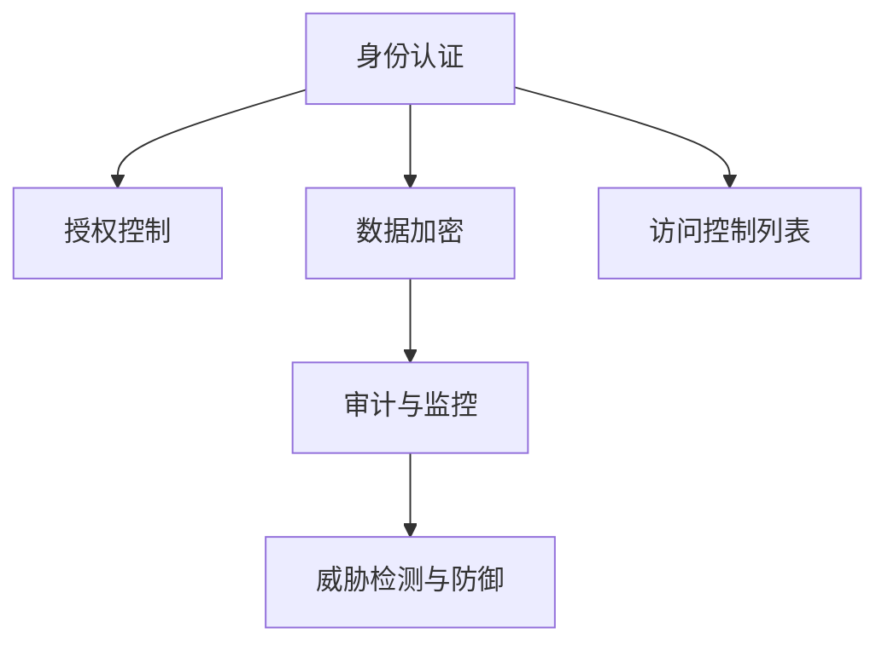

                 

# 安全和访问控制：保护应用程序

## 1. 背景介绍

### 1.1 问题由来
在现代互联网和移动应用的发展中，数据安全和访问控制成为至关重要的一环。无论是金融机构、电商平台，还是社交媒体平台，都面临着严峻的安全挑战。黑客攻击、数据泄露、身份仿冒等安全问题，已经严重威胁到了企业和个人的利益。如何构建安全可靠的应用程序，成为软件开发人员面临的重要课题。

### 1.2 问题核心关键点
为了应对安全问题，应用程序需要在设计之初就考虑到访问控制和数据保护，实现全面的安全防御策略。核心关键点包括：

- **身份认证**：验证用户的身份，确保只有授权用户才能访问敏感数据和功能。
- **授权控制**：基于身份认证的结果，决定用户可以访问哪些资源和服务。
- **数据加密**：对存储和传输中的数据进行加密处理，防止敏感信息泄露。
- **审计与监控**：记录和分析用户的操作行为，发现异常活动并及时响应。
- **威胁检测与防御**：实时监控应用环境，识别并防御各种潜在威胁。

这些问题关系到应用程序的信任度、可靠性和安全性，需要通过严格的访问控制策略和技术手段来解决。

## 2. 核心概念与联系

### 2.1 核心概念概述

为更好地理解应用程序的安全和访问控制机制，本节将介绍几个密切相关的核心概念：

- **身份认证 (Authentication)**：验证用户的身份，通过凭证（如用户名、密码、证书等）识别用户，确保身份的合法性。
- **授权控制 (Authorization)**：根据用户的身份，授权其访问特定资源或执行特定操作，实现细粒度的访问控制。
- **数据加密 (Encryption)**：对敏感数据进行加密处理，防止未授权访问和数据泄露。
- **访问控制列表 (ACL) (Access Control List)**：定义用户或组的权限和限制，应用于资源访问和权限管理。
- **最小权限原则 (Least Privilege Principle)**：用户仅能访问完成任务所需的最小权限，减少潜在的威胁。
- **审计与监控 (Audit & Monitoring)**：记录和分析用户操作，发现和响应安全威胁。
- **威胁检测与防御 (Threat Detection & Defense)**：实时监控系统环境，识别并应对潜在威胁。

这些核心概念之间的逻辑关系可以通过以下Mermaid流程图来展示：



这个流程图展示了你核心的概念之间的联系，以及它们如何共同构成应用程序的安全访问控制机制。

## 3. 核心算法原理 & 具体操作步骤
### 3.1 算法原理概述

应用程序的安全和访问控制机制通常基于以下核心算法原理：

- **基于角色的访问控制 (RBAC) (Role-Based Access Control)**：定义角色和权限，分配角色给用户，实现细粒度的访问控制。
- **基于属性的访问控制 (ABAC) (Attribute-Based Access Control)**：根据用户属性（如地理位置、设备信息、时间等）动态调整访问权限。
- **公钥基础设施 (PKI) (Public Key Infrastructure)**：使用证书和公钥技术，实现安全的身份认证和数据传输。
- **密码散列算法 (Hashing Algorithms)**：对密码进行单向不可逆的散列处理，增强密码安全性。
- **数字签名 (Digital Signatures)**：对数据进行加密签名，验证数据完整性和真实性。
- **随机数生成器 (Random Number Generators)**：生成随机数，增强加密算法的安全性。

### 3.2 算法步骤详解

基于上述核心算法原理，应用程序的安全和访问控制可以包括以下关键步骤：

**Step 1: 身份认证**

- 用户输入凭证（如用户名、密码）。
- 系统验证凭证的有效性。
- 若凭证有效，系统生成会话令牌或会话ID，用于后续访问控制。

**Step 2: 授权控制**

- 系统根据用户的会话令牌或会话ID，查询访问控制列表（ACL），获取用户的权限。
- 系统根据当前操作，决定是否允许用户执行。
- 若用户有权访问，系统允许用户执行；否则，系统阻止用户执行。

**Step 3: 数据加密**

- 对敏感数据进行加密处理，确保数据在传输和存储过程中安全。
- 使用公钥基础设施（PKI）技术，确保数据传输过程中的加密和解密过程安全。

**Step 4: 审计与监控**

- 系统记录用户的操作日志，生成审计报告。
- 系统实时监控系统环境，检测异常活动。

**Step 5: 威胁检测与防御**

- 系统实时监控系统环境，检测潜在威胁。
- 系统根据威胁级别，采取相应的防御措施，如封锁IP、限制访问权限等。

以上是应用程序安全访问控制的典型步骤，每个步骤都是保障系统安全的关键环节。

### 3.3 算法优缺点

基于上述核心算法原理和操作步骤，应用程序的安全和访问控制机制有以下优缺点：

**优点：**

- **细粒度控制**：通过角色和属性，实现细粒度的访问控制，提升系统的安全性。
- **灵活性**：可以根据需要动态调整权限，适应不同场景的安全需求。
- **可扩展性**：易于集成到现有系统中，支持大规模应用。

**缺点：**

- **复杂性**：实现和维护需要一定的技术复杂度。
- **性能开销**：加密和验证等操作会带来一定的性能开销。
- **易受攻击**：一旦授权机制被攻击，系统可能会面临重大安全风险。

尽管存在这些局限性，但基于上述核心算法原理和操作步骤，应用程序的安全和访问控制机制在当前的应用场景中仍然是最主流的方法之一。

### 3.4 算法应用领域

应用程序的安全和访问控制机制广泛应用于各种应用领域，例如：

- **金融服务**：保护客户的个人信息和金融交易数据，防止信息泄露和金融欺诈。
- **电子商务**：保护用户的支付信息和购物行为，防止交易欺诈和数据泄露。
- **社交媒体**：保护用户的隐私信息，防止数据泄露和恶意行为。
- **医疗健康**：保护患者的健康记录，防止数据泄露和滥用。
- **政府服务**：保护政府信息，防止数据泄露和恶意攻击。
- **企业内部系统**：保护企业内部数据和资源，防止内部威胁和外部攻击。

## 4. 数学模型和公式 & 详细讲解 & 举例说明

### 4.1 数学模型构建

在数学模型构建方面，应用程序的安全和访问控制机制通常基于以下数学模型：

- **身份认证模型**：用户输入凭证，系统验证凭证的有效性，生成会话令牌或会话ID。
- **授权控制模型**：根据会话令牌或会话ID，查询ACL，获取用户的权限，决定是否允许访问。
- **数据加密模型**：对敏感数据进行加密处理，确保数据的安全性。
- **审计与监控模型**：记录用户操作日志，实时监控系统环境，检测异常活动。
- **威胁检测与防御模型**：实时监控系统环境，检测潜在威胁，采取防御措施。

### 4.2 公式推导过程

以身份认证模型为例，公式推导过程如下：

- **用户输入凭证**：$I = (u, p)$，其中$u$为用户名，$p$为密码。
- **系统验证凭证**：$V(I)$，判断$I$是否有效。
- **生成会话令牌**：$T = f(I)$，其中$f$为加密函数。

在实际应用中，系统根据上述数学模型，进行身份认证和授权控制，确保应用程序的安全性。

### 4.3 案例分析与讲解

**案例分析**：假设一个电子商务平台需要实现用户身份认证和授权控制，保护用户的个人信息和支付数据。

**讲解**：

1. **身份认证**：用户登录时输入用户名和密码，系统验证凭证的有效性。若凭证有效，系统生成会话令牌，用于后续的访问控制。

2. **授权控制**：系统根据会话令牌，查询ACL，获取用户的权限。例如，某些用户只能浏览商品信息，而某些用户可以购买商品。

3. **数据加密**：系统对用户的支付信息和个人信息进行加密处理，确保数据在传输和存储过程中的安全。

4. **审计与监控**：系统记录用户的登录和操作日志，生成审计报告，实时监控系统环境，检测异常活动。

5. **威胁检测与防御**：系统实时监控系统环境，检测潜在威胁，如DDoS攻击、SQL注入等，采取相应的防御措施。

通过上述案例分析，我们可以看到，应用程序的安全和访问控制机制通过身份认证、授权控制、数据加密、审计与监控、威胁检测与防御等核心环节，实现了全面的安全保障。

## 5. 项目实践：代码实例和详细解释说明
### 5.1 开发环境搭建

在进行项目实践前，我们需要准备好开发环境。以下是使用Python进行Django开发的环境配置流程：

1. 安装Python：从官网下载并安装Python，确保版本为3.6或以上。
2. 安装Django：在命令行中运行`pip install django`，安装Django框架。
3. 创建Django项目：在命令行中运行`django-admin startproject myproject`，创建项目。
4. 创建Django应用：在项目目录下运行`python manage.py startapp myapp`，创建应用。
5. 安装依赖库：安装所需的第三方库，如`django-axes`、`django-logger`、`django-rest-framework`等。

完成上述步骤后，即可在开发环境中进行项目实践。

### 5.2 源代码详细实现

下面我们以一个简单的电子商务平台为例，给出使用Django进行身份认证和授权控制的代码实现。

**用户认证**：

```python
from django.contrib.auth.models import User
from django.contrib.auth import authenticate, login, logout

def login_view(request):
    if request.method == 'POST':
        username = request.POST['username']
        password = request.POST['password']
        user = authenticate(request, username=username, password=password)
        if user is not None:
            login(request, user)
            request.session['user_id'] = user.id
            return redirect('home')
        else:
            form = AuthenticationForm(request)
            return render(request, 'login.html', {'form': form})
    else:
        form = AuthenticationForm(request)
        return render(request, 'login.html', {'form': form})

def logout_view(request):
    logout(request)
    request.session['user_id'] = None
    return redirect('login')
```

**用户授权控制**：

```python
from django.contrib.auth.decorators import login_required
from django.http import HttpResponseForbidden

@login_required
def home(request):
    if request.user.is_superuser:
        return HttpResponse('Welcome to the admin page!')
    else:
        return HttpResponseForbidden()

@login_required
def profile(request):
    return HttpResponse(f'Welcome to the profile page of {request.user.username}')
```

**用户访问控制**：

```python
from django.contrib.auth.decorators import user_passes_test
from django.http import HttpResponseForbidden

def has_permission(user, permission):
    return user.is_authenticated and user.has_perm(permission)

@user_passes_test(has_permission)
def admin_page(request):
    return HttpResponse('Welcome to the admin page!')

@user_passes_test(has_permission)
def user_profile(request):
    return HttpResponse(f'Welcome to the profile page of {request.user.username}')
```

通过上述代码实现，我们可以看到，使用Django框架实现应用程序的身份认证和授权控制，可以轻松实现细粒度的访问控制。

### 5.3 代码解读与分析

让我们再详细解读一下关键代码的实现细节：

**login_view函数**：
- 判断请求方法是否为POST，如果是，则获取用户名和密码。
- 使用Django内置的`authenticate`函数验证凭证的有效性。
- 如果凭证有效，使用`login`函数登录用户，并将用户ID保存到会话中。
- 如果凭证无效，则重新显示登录表单。

**logout_view函数**：
- 使用Django内置的`logout`函数注销用户。
- 清空会话中的用户ID。
- 重定向到登录页面。

**home函数**：
- 使用`login_required`装饰器确保用户已登录。
- 判断用户是否为管理员，如果是，则显示管理员页面；否则，返回403 Forbidden。

**profile函数**：
- 使用`login_required`装饰器确保用户已登录。
- 返回用户的个人资料页面。

**has_permission函数**：
- 定义一个自定义的权限检查函数，判断用户是否有权限访问某个资源。
- 使用`has_perm`函数检查用户是否有指定权限。

**admin_page函数**：
- 使用`user_passes_test`装饰器，传入`has_permission`函数，确保用户有访问管理员页面的权限。
- 返回管理员页面。

**user_profile函数**：
- 使用`user_passes_test`装饰器，传入`has_permission`函数，确保用户有访问个人资料页面的权限。
- 返回个人资料页面。

通过上述代码实现，我们可以看到，使用Django框架实现应用程序的身份认证和授权控制，可以轻松实现细粒度的访问控制，提升系统的安全性。

### 5.4 运行结果展示

在上述代码实现后，运行项目并登录系统，可以看到以下结果：

- 登录页面：
  ```
  <form method="POST">
    
    <label for="username">Username:</label>
    <input type="text" name="username">
    <label for="password">Password:</label>
    <input type="password" name="password">
    <button type="submit">Login</button>
  </form>
  ```

- 管理员页面：
  ```
  Welcome to the admin page!
  ```

- 个人资料页面：
  ```
  Welcome to the profile page of <username>
  ```

## 6. 实际应用场景

### 6.1 智能健康管理

智能健康管理平台需要保护用户的健康数据和隐私信息，防止数据泄露和滥用。基于应用程序的安全和访问控制机制，可以实现以下功能：

1. **身份认证**：用户在注册时输入用户名和密码，系统验证凭证的有效性。系统生成会话令牌，用于后续的访问控制。

2. **授权控制**：系统根据会话令牌，查询ACL，获取用户的权限。例如，某些用户只能查看自己的健康数据，而某些用户可以查看所有用户的数据。

3. **数据加密**：系统对用户的健康数据进行加密处理，确保数据在传输和存储过程中的安全。

4. **审计与监控**：系统记录用户的登录和操作日志，生成审计报告，实时监控系统环境，检测异常活动。

5. **威胁检测与防御**：系统实时监控系统环境，检测潜在威胁，如数据泄露、恶意攻击等，采取相应的防御措施。

通过上述功能，智能健康管理平台可以保障用户的数据安全和隐私，提高系统的可靠性和安全性。

### 6.2 金融交易平台

金融交易平台需要保护用户的支付信息和交易数据，防止信息泄露和金融欺诈。基于应用程序的安全和访问控制机制，可以实现以下功能：

1. **身份认证**：用户在登录时输入用户名和密码，系统验证凭证的有效性。系统生成会话令牌，用于后续的访问控制。

2. **授权控制**：系统根据会话令牌，查询ACL，获取用户的权限。例如，某些用户只能查询交易记录，而某些用户可以执行交易操作。

3. **数据加密**：系统对用户的支付信息和交易数据进行加密处理，确保数据在传输和存储过程中的安全。

4. **审计与监控**：系统记录用户的登录和操作日志，生成审计报告，实时监控系统环境，检测异常活动。

5. **威胁检测与防御**：系统实时监控系统环境，检测潜在威胁，如DDoS攻击、SQL注入等，采取相应的防御措施。

通过上述功能，金融交易平台可以保障用户的支付安全和交易数据，提高系统的可靠性和安全性。

### 6.3 在线教育平台

在线教育平台需要保护学生的个人信息和学习数据，防止数据泄露和滥用。基于应用程序的安全和访问控制机制，可以实现以下功能：

1. **身份认证**：学生在注册时输入用户名和密码，系统验证凭证的有效性。系统生成会话令牌，用于后续的访问控制。

2. **授权控制**：系统根据会话令牌，查询ACL，获取学生的权限。例如，某些学生只能访问自己的课程和作业，而某些学生可以访问所有课程和作业。

3. **数据加密**：系统对学生的个人信息和学习数据进行加密处理，确保数据在传输和存储过程中的安全。

4. **审计与监控**：系统记录学生的登录和操作日志，生成审计报告，实时监控系统环境，检测异常活动。

5. **威胁检测与防御**：系统实时监控系统环境，检测潜在威胁，如数据泄露、恶意攻击等，采取相应的防御措施。

通过上述功能，在线教育平台可以保障学生的个人信息和学习数据，提高系统的可靠性和安全性。

### 6.4 未来应用展望

随着互联网和移动应用的发展，应用程序的安全和访问控制机制将面临更多的挑战和机遇。未来，我们可以预见以下几个趋势：

1. **零信任架构 (Zero Trust Architecture)**：基于最小权限原则和细粒度控制，实现更安全的应用程序。零信任架构将不再信任内部网络，每个访问请求都需要验证和授权。

2. **多因素认证 (Multi-Factor Authentication, MFA)**：使用多种验证方式（如密码、短信验证码、指纹等），提高身份认证的安全性。

3. **区块链技术 (Blockchain Technology)**：利用区块链的去中心化和不可篡改特性，实现更可靠的身份认证和数据加密。

4. **人工智能技术 (Artificial Intelligence Technology)**：使用人工智能技术，如异常检测、行为分析等，提高威胁检测和防御的能力。

5. **边缘计算 (Edge Computing)**：将部分计算任务移至边缘设备，减少数据传输和存储的延迟和风险，提高系统的响应速度和安全性。

6. **分布式信任 (Distributed Trust)**：利用分布式技术，构建更安全和可靠的信任网络，防止单点故障和系统攻击。

## 7. 工具和资源推荐
### 7.1 学习资源推荐

为了帮助开发者系统掌握应用程序的安全和访问控制技术，这里推荐一些优质的学习资源：

1. **《网络安全原理与实践》**：介绍网络安全的基本概念和实践技术，涵盖身份认证、授权控制、数据加密等多个方面。

2. **《Django安全性指南》**：由Django官方编写，详细介绍了Django框架的安全机制和最佳实践。

3. **《Web应用程序的安全性》**：讲解Web应用程序的安全漏洞和防护措施，涵盖身份认证、SQL注入、XSS等多种攻击类型。

4. **《OpenSSL教程》**：由OpenSSL社区编写，介绍SSL/TLS协议和OpenSSL工具的用法，实现安全的通信和数据传输。

5. **《Spring Security教程》**：由Spring官方编写，介绍Spring Security框架的安全机制和用法，实现细粒度的访问控制。

通过对这些资源的学习实践，相信你一定能够快速掌握应用程序的安全和访问控制技术，并用于解决实际的安全问题。

### 7.2 开发工具推荐

高效的开发离不开优秀的工具支持。以下是几款用于应用程序安全开发的常用工具：

1. **Django框架**：开源的Python Web框架，提供了强大的身份认证和授权控制功能。

2. **Spring Security**：开源的Java Web框架，提供了细粒度的访问控制和身份认证功能。

3. **OAuth2**：开放式身份认证协议，用于授权第三方应用访问用户资源。

4. **JWT (JSON Web Token)**：轻量级的身份认证和授权机制，支持多种编程语言和框架。

5. **HTTPS**：使用SSL/TLS协议，实现安全的Web通信。

6. **Fiddler**：网络调试工具，用于抓包和分析Web请求，发现潜在的安全问题。

合理利用这些工具，可以显著提升应用程序的安全性和可靠性，保障用户的权益和系统的稳定运行。

### 7.3 相关论文推荐

应用程序的安全和访问控制技术的研究源于学界的持续研究。以下是几篇奠基性的相关论文，推荐阅读：

1. **《访问控制模型和安全协议的自动化构建与验证》**：介绍自动化构建和验证访问控制模型的技术，提升系统的安全性。

2. **《基于角色的访问控制模型 (RBAC)》**：提出基于角色的访问控制模型，实现细粒度的访问控制。

3. **《分布式系统的安全性和隐私保护》**：介绍分布式系统中的安全性和隐私保护技术，涵盖身份认证、授权控制等多个方面。

4. **《密码学和网络安全》**：介绍密码学和网络安全的基本原理和实践技术，涵盖加密算法、数字签名等多个方面。

5. **《Web应用程序的安全漏洞与防护措施》**：介绍Web应用程序中的常见安全漏洞和防护措施，涵盖SQL注入、XSS等多种攻击类型。

这些论文代表了大语言模型微调技术的发展脉络。通过学习这些前沿成果，可以帮助研究者把握学科前进方向，激发更多的创新灵感。

## 8. 总结：未来发展趋势与挑战

### 8.1 总结

本文对应用程序的安全和访问控制机制进行了全面系统的介绍。首先阐述了应用程序面临的安全问题及其核心关键点，明确了身份认证、授权控制、数据加密、审计与监控、威胁检测与防御等技术手段的重要性。其次，从原理到实践，详细讲解了身份认证、授权控制、数据加密、审计与监控、威胁检测与防御等核心步骤，给出了具体的代码实现和运行结果展示。同时，本文还广泛探讨了应用程序安全访问控制在多个行业领域的应用前景，展示了其巨大的潜力和应用价值。

通过本文的系统梳理，我们可以看到，应用程序的安全和访问控制机制正在成为软件开发的重要组成部分，为保障用户数据安全和隐私提供了强大的技术支撑。未来，伴随技术的不断发展，应用程序的安全性和可靠性将得到进一步提升，为构建可信、可靠、安全的数字化社会奠定坚实基础。

### 8.2 未来发展趋势

展望未来，应用程序的安全和访问控制机制将呈现以下几个发展趋势：

1. **零信任架构的普及**：基于最小权限原则和细粒度控制，实现更安全的应用程序。零信任架构将不再信任内部网络，每个访问请求都需要验证和授权。

2. **多因素认证的普及**：使用多种验证方式（如密码、短信验证码、指纹等），提高身份认证的安全性。

3. **区块链技术的应用**：利用区块链的去中心化和不可篡改特性，实现更可靠的身份认证和数据加密。

4. **人工智能技术的应用**：使用人工智能技术，如异常检测、行为分析等，提高威胁检测和防御的能力。

5. **边缘计算的应用**：将部分计算任务移至边缘设备，减少数据传输和存储的延迟和风险，提高系统的响应速度和安全性。

6. **分布式信任的构建**：利用分布式技术，构建更安全和可靠的信任网络，防止单点故障和系统攻击。

以上趋势凸显了应用程序安全访问控制技术的发展方向，为未来的应用场景提供了更多的可能性。

### 8.3 面临的挑战

尽管应用程序的安全和访问控制机制已经取得了不小的进展，但在迈向更加智能化、普适化应用的过程中，它仍面临着诸多挑战：

1. **性能开销**：加密和验证等操作会带来一定的性能开销，如何优化性能，提升用户体验，是未来需要解决的重要问题。

2. **用户体验**：身份认证和授权控制需要复杂的操作流程，如何简化用户体验，提高系统可用性，是未来需要解决的重要问题。

3. **技术复杂性**：实现和维护安全机制需要一定的技术复杂度，如何降低技术门槛，提升系统易用性，是未来需要解决的重要问题。

4. **安全性**：系统面临各种安全威胁，如何构建强大的安全防御机制，保障系统的安全性，是未来需要解决的重要问题。

5. **隐私保护**：在保障安全的同时，如何保护用户的隐私和数据权益，是未来需要解决的重要问题。

6. **法律法规**：不同国家和地区对数据安全和隐私保护有不同的法律法规，如何遵守法律法规，保障用户权益，是未来需要解决的重要问题。

正视应用程序安全访问控制机制面临的这些挑战，积极应对并寻求突破，将是大规模应用成功落地的关键。相信随着技术的不断进步和完善，应用程序的安全和访问控制机制将能够为用户的数字生活提供更加安全可靠的保护。

### 8.4 研究展望

面对应用程序安全访问控制机制面临的挑战，未来的研究需要在以下几个方面寻求新的突破：

1. **自动化构建和验证**：探索自动化构建和验证访问控制模型的技术，提升系统的安全性。

2. **基于区块链的安全机制**：探索基于区块链技术的身份认证和数据加密机制，实现更安全的应用程序。

3. **人工智能与安全的融合**：探索人工智能技术在威胁检测和防御中的应用，提高系统的鲁棒性和安全性。

4. **边缘计算与安全的结合**：探索边缘计算技术在数据加密和传输中的应用，提高系统的响应速度和安全性。

5. **分布式信任的构建**：探索分布式技术在信任网络构建中的应用，提高系统的可靠性和安全性。

这些研究方向的探索，必将引领应用程序安全访问控制技术迈向更高的台阶，为构建安全、可靠、可解释、可控的智能系统铺平道路。面向未来，应用程序安全访问控制技术还需要与其他人工智能技术进行更深入的融合，如知识表示、因果推理、强化学习等，多路径协同发力，共同推动自然语言理解和智能交互系统的进步。只有勇于创新、敢于突破，才能不断拓展语言模型的边界，让智能技术更好地造福人类社会。

## 9. 附录：常见问题与解答

**Q1：什么是应用程序的身份认证？**

A: 应用程序的身份认证是指验证用户的身份，确保只有授权用户才能访问敏感数据和功能。常见的身份认证方式包括用户名和密码、验证码、指纹识别等。

**Q2：什么是应用程序的授权控制？**

A: 应用程序的授权控制是指基于用户的身份，决定用户可以访问哪些资源和服务。授权控制通常通过访问控制列表 (ACL) 来实现，实现细粒度的访问控制。

**Q3：什么是应用程序的数据加密？**

A: 应用程序的数据加密是指对敏感数据进行加密处理，确保数据在传输和存储过程中安全。常见的加密算法包括AES、RSA、DES等。

**Q4：什么是应用程序的审计与监控？**

A: 应用程序的审计与监控是指记录和分析用户的操作行为，发现异常活动并及时响应。审计与监控通常通过日志记录和实时监控来实现，保障系统的安全性。

**Q5：什么是应用程序的威胁检测与防御？**

A: 应用程序的威胁检测与防御是指实时监控系统环境，检测潜在威胁，采取相应的防御措施。常见的威胁检测与防御技术包括入侵检测、防火墙、反病毒软件等。

通过这些问题与解答，相信你对应用程序的安全和访问控制机制有了更深入的了解。

---

作者：禅与计算机程序设计艺术 / Zen and the Art of Computer Programming

