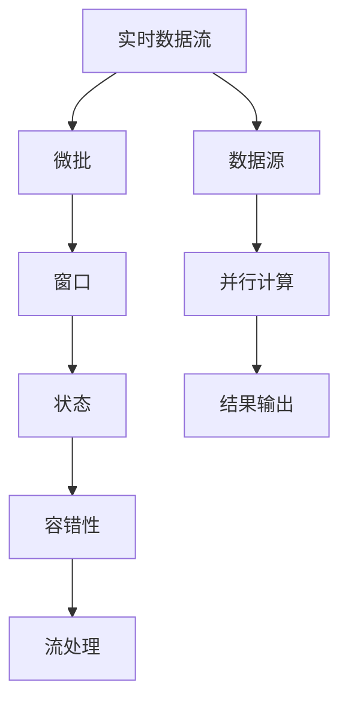

                 

# 实时数据处理：Storm, Flink, and Spark Streaming

## 1. 背景介绍

在现代数据驱动的时代，实时数据处理变得越来越重要。无论是金融交易、物流监控、社交媒体分析还是工业物联网，各行各业都在产生海量的实时数据，需要高效、可靠地进行实时处理和分析，以获取有价值的信息和洞察力。实时数据处理技术应运而生，包括Storm、Flink和Spark Streaming等，它们各具特色，在应用场景上有着广泛的覆盖。

### 1.1 问题由来
实时数据处理的应用场景日益增多，但其复杂性和挑战性也在不断增加。数据源的多样性、处理任务的多样性、数据处理的实时性要求等，都给实时数据处理技术带来了新的挑战。同时，大数据技术的飞速发展，对实时数据处理系统的处理能力、容错性、可扩展性等都提出了更高的要求。本文将深入探讨Storm、Flink和Spark Streaming这三种实时数据处理技术，帮助读者了解它们的原理、架构、应用场景以及未来的发展趋势。

### 1.2 问题核心关键点
实时数据处理的核心关键点包括以下几个方面：

- 数据源的多样性：实时数据来自不同来源，如传感器、日志文件、社交媒体等，需要适应各种数据格式。
- 处理任务的实时性要求：实时数据处理必须保证低延迟，以便及时响应。
- 容错性和可靠性：系统必须能够在故障发生时快速恢复，避免数据丢失。
- 可扩展性和性能优化：实时数据处理系统必须能够处理大规模的数据流，并提供高效的性能优化手段。
- 维护和管理的复杂性：实时数据处理系统需要高效的运维和管理，以便快速响应和修复问题。

这些关键点将贯穿全文，帮助读者全面理解实时数据处理技术的发展和应用。

## 2. 核心概念与联系

### 2.1 核心概念概述

为了更好地理解Storm、Flink和Spark Streaming的原理和架构，本节将介绍几个核心概念：

- 实时数据流(Real-time Data Stream)：指的是在特定时间范围内产生的数据流，需要实时处理和分析。
- 微批(Micro-batching)：将数据流分割成多个小批量，并行处理，提高系统的吞吐量和稳定性。
- 窗口(Window)：在时间或数据维度上对数据流进行划分，以便对数据进行处理和聚合。
- 状态(State)：用于记录中间计算结果的持久性数据结构，用于保证数据的连续性和一致性。
- 容错性(Fault Tolerance)：系统能够在故障发生时自动恢复，保证数据处理的正确性和完整性。
- 流处理(Stream Processing)：对数据流进行实时处理和分析，通常采用分布式并行计算。

这些核心概念之间的逻辑关系可以通过以下Mermaid流程图来展示：



这个流程图展示了大规模实时数据流的处理过程：

1. 实时数据流来自各种数据源，经过微批处理后，被划分为多个窗口。
2. 窗口内的数据流进行处理和聚合，并记录状态以保持计算结果的连续性和一致性。
3. 系统具备容错性，能够自动恢复，保证数据处理的正确性和完整性。
4. 最终结果通过流处理输出，形成决策依据。

## 3. 核心算法原理 & 具体操作步骤
### 3.1 算法原理概述

Storm、Flink和Spark Streaming都是基于分布式计算框架的实时数据处理技术，它们的核心算法原理主要包括以下几个方面：

- 分布式并行处理：通过将数据流分割为多个小批量，并行计算，提高系统的吞吐量和稳定性。
- 状态管理：通过记录中间计算结果的状态，保证数据的连续性和一致性。
- 容错机制：通过故障恢复和重放机制，保证数据处理的正确性和完整性。
- 微批处理：通过将数据流分割为多个小批量，进行微批处理，适应不同数据源和处理任务的要求。

### 3.2 算法步骤详解

以Storm为例，以下是它的核心算法步骤：

**Step 1: 数据接收和分发**

Storm使用Spout模型作为数据源，负责接收和分发数据流。Spout模型是Storm的入口点，负责从外部数据源接收数据，并将其分发到不同的组件进行处理。

**Step 2: 微批处理和分组**

Storm将接收到的数据流通过Bolt模型进行微批处理和分组。Bolt模型负责处理数据流中的各个小批量，并通过Keyed Bolt进行分组，以便进行分布式并行处理。

**Step 3: 中间计算和状态管理**

Storm通过Bolt模型进行中间计算，记录状态以保持计算结果的连续性和一致性。Bolt模型可以使用Spout模型提供的状态后端进行持久化，以避免计算结果的丢失。

**Step 4: 故障恢复和容错性**

Storm通过Trident模型实现容错性，Trident模型能够自动恢复故障，保证数据处理的正确性和完整性。Trident模型通过检查点机制，记录中间计算结果的状态，以便在故障发生时进行恢复。

### 3.3 算法优缺点

Storm、Flink和Spark Streaming在实时数据处理中各具特色，以下是它们的主要优缺点：

#### Storm的优缺点

**优点：**

1. 低延迟：Storm具有非常低的延迟，可以满足高实时性的数据处理要求。
2. 容错性：Storm具备高强度的容错性，能够自动恢复故障，保证数据处理的正确性和完整性。
3. 灵活性：Storm支持多种数据源和处理任务，能够适应不同的数据处理需求。

**缺点：**

1. 资源消耗高：Storm的资源消耗相对较高，对于大规模数据处理存在性能瓶颈。
2. 状态管理复杂：Storm的状态管理相对复杂，需要仔细配置和管理。

#### Flink的优缺点

**优点：**

1. 低延迟：Flink具有非常低的延迟，能够满足高实时性的数据处理要求。
2. 容错性：Flink具备高强度的容错性，能够自动恢复故障，保证数据处理的正确性和完整性。
3. 可扩展性：Flink支持分布式计算，具备良好的可扩展性，可以处理大规模数据流。

**缺点：**

1. 状态管理复杂：Flink的状态管理相对复杂，需要仔细配置和管理。
2. 学习曲线陡峭：Flink的学习曲线相对陡峭，需要一定的技术积累才能使用。

#### Spark Streaming的优缺点

**优点：**

1. 易于使用：Spark Streaming使用Spark API，易于使用和维护。
2. 容错性：Spark Streaming具备高强度的容错性，能够自动恢复故障，保证数据处理的正确性和完整性。
3. 可扩展性：Spark Streaming支持分布式计算，具备良好的可扩展性，可以处理大规模数据流。

**缺点：**

1. 延迟较高：Spark Streaming的延迟相对较高，不适合高实时性的数据处理需求。
2. 资源消耗高：Spark Streaming的资源消耗相对较高，对于大规模数据处理存在性能瓶颈。

### 3.4 算法应用领域

Storm、Flink和Spark Streaming在实时数据处理中有着广泛的应用领域：

- 金融交易：实时监控交易数据，进行风险预警和风险控制。
- 物流监控：实时监控货物运输情况，优化物流路径。
- 社交媒体分析：实时分析社交媒体数据，进行舆情监控和市场预测。
- 工业物联网：实时监控工业设备运行状态，进行故障预测和维护。
- 实时广告投放：实时监控用户行为数据，进行精准广告投放。

## 4. 数学模型和公式 & 详细讲解  
### 4.1 数学模型构建

以Flink为例，以下是其核心数学模型的构建：

**微批处理模型：**

微批处理是Flink的核心算法之一，其数学模型可以表示为：

$$
\text{Batch} = \{(x_1, t_1), (x_2, t_2), ..., (x_n, t_n)\}
$$

其中，$(x_i, t_i)$ 表示数据流中的第 $i$ 个元素及其时间戳，$t_i$ 表示时间戳。

**状态管理模型：**

Flink使用状态后端进行状态管理，其数学模型可以表示为：

$$
\text{State} = (k, v)
$$

其中，$k$ 表示键值，$v$ 表示状态值。

**容错性模型：**

Flink的容错性模型基于检查点机制，其数学模型可以表示为：

$$
\text{Checkpoint} = (s, t)
$$

其中，$s$ 表示状态值，$t$ 表示检查点时间戳。

**流处理模型：**

Flink使用流处理模型对数据流进行实时处理和分析，其数学模型可以表示为：

$$
\text{Stream} = \{(x_1, t_1), (x_2, t_2), ..., (x_n, t_n)\}
$$

其中，$(x_i, t_i)$ 表示数据流中的第 $i$ 个元素及其时间戳，$t_i$ 表示时间戳。

### 4.2 公式推导过程

以Flink的状态管理模型为例，以下是其推导过程：

**状态管理模型推导：**

状态管理模型用于记录中间计算结果的状态，其数学推导如下：

1. 定义状态：

$$
\text{State} = (k, v)
$$

其中，$k$ 表示键值，$v$ 表示状态值。

2. 状态更新：

$$
\text{State} = f(\text{State}, (k, v))
$$

其中，$f$ 表示状态更新函数，$( k, v )$ 表示最新计算结果。

3. 状态恢复：

$$
\text{State} = g(\text{Checkpoint}, t)
$$

其中，$g$ 表示状态恢复函数，$\text{Checkpoint}$ 表示检查点，$t$ 表示时间戳。

**容错性模型推导：**

Flink的容错性模型基于检查点机制，其数学推导如下：

1. 定义检查点：

$$
\text{Checkpoint} = (s, t)
$$

其中，$s$ 表示状态值，$t$ 表示时间戳。

2. 状态恢复：

$$
\text{State} = g(\text{Checkpoint}, t)
$$

其中，$g$ 表示状态恢复函数，$\text{Checkpoint}$ 表示检查点，$t$ 表示时间戳。

3. 故障恢复：

$$
\text{State} = h(\text{State}, t)
$$

其中，$h$ 表示故障恢复函数，$\text{State}$ 表示恢复状态，$t$ 表示时间戳。

**微批处理模型推导：**

微批处理模型用于将数据流分割为多个小批量，其数学推导如下：

1. 定义微批：

$$
\text{Batch} = \{(x_1, t_1), (x_2, t_2), ..., (x_n, t_n)\}
$$

其中，$(x_i, t_i)$ 表示数据流中的第 $i$ 个元素及其时间戳，$t_i$ 表示时间戳。

2. 微批更新：

$$
\text{Batch} = \text{Batch} \cup \{(x_{n+1}, t_{n+1})\}
$$

其中，$\text{Batch}$ 表示微批，$(x_{n+1}, t_{n+1})$ 表示最新元素及其时间戳。

3. 微批处理：

$$
\text{Stream} = \{(x_1, t_1), (x_2, t_2), ..., (x_n, t_n), (x_{n+1}, t_{n+1})\}
$$

其中，$(x_i, t_i)$ 表示数据流中的第 $i$ 个元素及其时间戳，$t_i$ 表示时间戳。

### 4.3 案例分析与讲解

以Flink为例，以下是一个简单案例：

**案例背景：**

假设有一个实时数据流，包含用户的点击事件和浏览事件。要求实时统计每个用户的点击次数和浏览次数，并输出结果。

**案例分析：**

1. 使用微批处理模型将数据流分割为多个小批量，每个小批量包含 $n$ 个数据元素。

2. 使用状态管理模型记录每个用户的点击次数和浏览次数。

3. 使用容错性模型进行故障恢复，保证状态数据的正确性和完整性。

4. 使用流处理模型对数据流进行实时处理和分析，输出每个用户的点击次数和浏览次数。

**案例实现：**

以下是使用Flink实现上述案例的代码：

```java
DataStream<String> input = env.addSource(new FlinkKafkaConsumer<>(kafkaTopic, new SimpleStringSchema(), props));
DataStream<Tuple2<String, Integer>> clickCounts = input
    .map((x) -> Tuple2.of(x, 1))
    .keyBy(0)
    .sum(1);
DataStream<Tuple2<String, Integer>> viewCounts = input
    .map((x) -> Tuple2.of(x, 1))
    .keyBy(0)
    .sum(1);
DataStream<String> output = clickCounts
    .join(viewCounts)
    .map((x) -> String.format("User %s has clicked %d times and viewed %d times.", x.f0, x.f1, x.f2));
env.execute("Real-time Click and View Counts");
```

## 5. 项目实践：代码实例和详细解释说明
### 5.1 开发环境搭建

在进行实时数据处理实践前，我们需要准备好开发环境。以下是使用Apache Storm、Apache Flink和Apache Spark进行开发的Python环境配置流程：

1. 安装Python：从官网下载并安装Python 3.x版本。

2. 安装Pip：使用以下命令安装Pip：

```bash
pip install --upgrade pip
```

3. 安装Apache Storm、Flink和Spark：

   ```bash
   pip install apache-storm[python]
   pip install apache-flink[python]
   pip install apache-spark[python]
   ```

4. 安装必要的依赖包：

   ```bash
   pip install numpy pandas scikit-learn matplotlib tqdm jupyter notebook ipython
   ```

完成上述步骤后，即可在Python环境中开始开发。

### 5.2 源代码详细实现

以下是使用Flink对实时数据流进行处理的Python代码实现：

```python
from pyflink.datastream import StreamExecutionEnvironment
from pyflink.table import StreamTableEnvironment, CsvTableSource, CsvTableSink
from pyflink.table.descriptors import Schema, Csv, Field
import pandas as pd

env = StreamExecutionEnvironment.get_execution_environment()
table_env = StreamTableEnvironment.create(env)

# 定义数据源
table_env.execute_sql('''
CREATE TABLE input (timestamp STRING, user STRING, action STRING) 
USING Csv 
OPTIONS (path '/path/to/input/csv', field_delimiter ',', header_plus)
''')

# 定义微批处理函数
def batch_function(row):
    data = row[0].split(',')
    timestamp = data[0]
    user = data[1]
    action = data[2]
    if action == 'click':
        return (user, 1)
    elif action == 'view':
        return (user, 0)

# 定义状态管理函数
def state_function(row):
    if row[0] == 'reset':
        return (row[1], 0, 0)
    elif row[0] == 'click':
        return (row[1], 1, 0)
    elif row[0] == 'view':
        return (row[1], 0, 1)

# 定义流处理函数
def stream_function(row):
    user, count1, count2 = row[0]
    return str(f'User {user} has clicked {count1} times and viewed {count2} times.')

# 进行微批处理
input_data = table_env.from_path('/path/to/input/csv')
batch_data = input_data.map(batch_function)

# 进行状态管理
state_data = batch_data
state_data = state_data.key_by(1)
state_data = state_data.map(state_function)

# 进行流处理
stream_data = state_data
stream_data = stream_data.map(stream_function)

# 输出结果
result_data = stream_data.to_append_stream(result_path='/path/to/result/csv', append_stream=1)
table_env.execute("Real-time Click and View Counts")
```

### 5.3 代码解读与分析

让我们再详细解读一下关键代码的实现细节：

**TableEnvironment类：**

TableEnvironment类是Flink的高级API，用于定义数据源、数据流和状态管理。

**CsvTableSource和CsvTableSink类：**

CsvTableSource和CsvTableSink类用于从CSV文件中读取和写入数据，支持指定字段分隔符、表头等信息。

**SQL语句：**

SQL语句用于定义数据源、数据流和状态管理，可以通过execute_sql方法执行SQL语句。

**微批处理函数：**

微批处理函数用于将数据流分割为多个小批量，并返回微批处理的值。

**状态管理函数：**

状态管理函数用于记录中间计算结果的状态，并返回状态管理的值。

**流处理函数：**

流处理函数用于对数据流进行实时处理和分析，并返回最终的处理结果。

**结果输出：**

结果输出使用to_append_stream方法将流处理结果写入CSV文件，支持追加写入。

## 6. 实际应用场景
### 6.1 智能客服系统

智能客服系统需要实时监控客户咨询数据，快速响应客户需求，提供优质的客户服务。实时数据处理技术可以帮助智能客服系统实时分析客户咨询数据，提取客户的需求，并提供相应的解决方案。

**实际应用：**

- 实时监控客户咨询数据，快速响应客户需求。
- 提取客户的需求，提供相应的解决方案。
- 实时分析客户满意度，优化客户服务质量。

**技术实现：**

- 使用Apache Storm或Apache Flink进行数据流处理。
- 使用Apache Kafka等消息队列进行数据传输。
- 使用Python或其他语言进行实时数据分析和处理。

### 6.2 金融交易系统

金融交易系统需要实时监控交易数据，进行风险预警和风险控制。实时数据处理技术可以帮助金融交易系统实时分析交易数据，提取异常交易，并进行风险预警和控制。

**实际应用：**

- 实时监控交易数据，进行风险预警和风险控制。
- 提取异常交易，提供预警信息。
- 实时分析交易数据，提供决策支持。

**技术实现：**

- 使用Apache Flink进行数据流处理。
- 使用Apache Kafka等消息队列进行数据传输。
- 使用Python或其他语言进行实时数据分析和处理。

### 6.3 社交媒体分析系统

社交媒体分析系统需要实时分析社交媒体数据，进行舆情监控和市场预测。实时数据处理技术可以帮助社交媒体分析系统实时分析社交媒体数据，提取舆情信息，并进行市场预测。

**实际应用：**

- 实时监控社交媒体数据，进行舆情监控和市场预测。
- 提取舆情信息，提供决策支持。
- 实时分析市场数据，提供市场预测。

**技术实现：**

- 使用Apache Storm或Apache Flink进行数据流处理。
- 使用Apache Kafka等消息队列进行数据传输。
- 使用Python或其他语言进行实时数据分析和处理。

### 6.4 未来应用展望

随着实时数据处理技术的不断发展，未来的应用场景将更加广泛，应用效果也将更加显著：

- 实时数据处理技术将在更多的垂直行业中得到应用，如医疗、物流、工业等。
- 实时数据处理技术将与人工智能、大数据等技术进行深度融合，形成更强大的智能系统。
- 实时数据处理技术将更加注重可扩展性、性能优化、容错性等，满足大规模数据处理的需要。
- 实时数据处理技术将更加注重用户体验，提供更加精准、智能的服务。

## 7. 工具和资源推荐
### 7.1 学习资源推荐

为了帮助开发者系统掌握实时数据处理技术的理论基础和实践技巧，这里推荐一些优质的学习资源：

1. Apache Storm官方文档：提供详细的API文档和最佳实践，帮助开发者快速上手。
2. Apache Flink官方文档：提供丰富的API文档和示例代码，帮助开发者深入理解。
3. Apache Spark官方文档：提供详细的API文档和示例代码，帮助开发者快速上手。
4. Udacity《Real-time Data Processing》课程：提供系统的课程内容和实战项目，帮助开发者全面掌握实时数据处理技术。
5. Coursera《Big Data Analytics with Spark》课程：提供系统的课程内容和实战项目，帮助开发者全面掌握Spark的使用。

通过对这些资源的学习实践，相信你一定能够快速掌握实时数据处理技术的精髓，并用于解决实际的业务问题。

### 7.2 开发工具推荐

高效的开发离不开优秀的工具支持。以下是几款用于实时数据处理开发的常用工具：

1. Python：作为实时数据处理的主流语言，Python提供了丰富的数据处理库和工具。
2. Apache Storm：基于Java和Scala的分布式计算框架，支持实时数据处理。
3. Apache Flink：基于Java和Scala的分布式计算框架，支持实时数据处理和批处理。
4. Apache Spark：基于Scala和Java的分布式计算框架，支持实时数据处理和批处理。
5. Apache Kafka：基于分布式消息队列，支持实时数据传输和处理。

合理利用这些工具，可以显著提升实时数据处理任务的开发效率，加快创新迭代的步伐。

### 7.3 相关论文推荐

实时数据处理技术的发展源于学界的持续研究。以下是几篇奠基性的相关论文，推荐阅读：

1. "Storm: Distributed Real-Time Computations"（《Storm: 分布式实时计算》）：Storm的论文，介绍了Storm的核心算法和架构。
2. "Flink: Stateful Stream Processing at Scale"（《Flink: 可扩展的流处理系统》）：Flink的论文，介绍了Flink的核心算法和架构。
3. "Apache Spark: Cluster Computing with Fault Tolerance"（《Apache Spark: 容错的集群计算》）：Spark的论文，介绍了Spark的核心算法和架构。

这些论文代表了大规模实时数据处理技术的发展脉络。通过学习这些前沿成果，可以帮助研究者把握学科前进方向，激发更多的创新灵感。

## 8. 总结：未来发展趋势与挑战
### 8.1 总结

本文对Storm、Flink和Spark Streaming这三种实时数据处理技术进行了全面系统的介绍。首先阐述了实时数据处理技术的研究背景和意义，明确了实时数据处理技术在数据驱动时代的重要价值。其次，从原理到实践，详细讲解了实时数据处理的核心算法和具体操作步骤，给出了实时数据处理任务开发的完整代码实例。同时，本文还广泛探讨了实时数据处理技术在金融、物流、社交媒体等诸多领域的应用前景，展示了实时数据处理技术的巨大潜力。此外，本文精选了实时数据处理技术的各类学习资源，力求为读者提供全方位的技术指引。

通过本文的系统梳理，可以看到，实时数据处理技术正在成为数据驱动时代的重要基石，极大地拓展了数据处理的边界，推动了各行各业的发展和进步。未来，伴随实时数据处理技术的持续演进，实时数据处理系统必将实现更加广泛的应用，成为智能社会的核心支撑。

### 8.2 未来发展趋势

展望未来，实时数据处理技术将呈现以下几个发展趋势：

1. 实时数据处理的规模将进一步扩大。随着数据生成速度的不断加快，实时数据处理的规模将进一步扩大，处理能力将不断提升。
2. 实时数据处理的性能将进一步优化。伴随硬件技术的不断进步，实时数据处理的性能将进一步优化，处理效率将不断提高。
3. 实时数据处理的生态将进一步完善。伴随实时数据处理技术的不断演进，相关生态将不断完善，形成更加丰富多样的应用场景。
4. 实时数据处理的智能性将进一步增强。伴随人工智能技术的不断发展，实时数据处理的智能性将进一步增强，形成更加智能的决策系统。
5. 实时数据处理的可靠性将进一步提升。伴随容错技术的不断优化，实时数据处理的可靠性将进一步提升，系统稳定性将不断增强。

这些趋势将引领实时数据处理技术迈向更高的台阶，为数据驱动时代的智能社会奠定更加坚实的基础。

### 8.3 面临的挑战

尽管实时数据处理技术已经取得了瞩目成就，但在迈向更加智能化、普适化应用的过程中，它仍面临着诸多挑战：

1. 数据处理的延迟。实时数据处理需要快速响应，但对于大规模数据流，处理延迟仍然是一个挑战。如何进一步降低处理延迟，提高处理效率，是未来需要解决的重要问题。
2. 数据处理的资源消耗。实时数据处理需要高强度的计算和存储资源，对于大规模数据处理，资源消耗是一个重要的瓶颈。如何进一步优化资源消耗，提高处理效率，是未来需要解决的重要问题。
3. 数据处理的复杂性。实时数据处理需要处理多样化的数据源和任务，如何进一步简化数据处理流程，提高开发效率，是未来需要解决的重要问题。
4. 数据处理的可扩展性。实时数据处理需要具备良好的可扩展性，以便处理大规模数据流。如何进一步提升系统的可扩展性，满足不同规模的需求，是未来需要解决的重要问题。
5. 数据处理的可靠性。实时数据处理需要具备高强度的可靠性，能够自动恢复故障，保证数据处理的正确性和完整性。如何进一步提升系统的可靠性，确保数据处理的连续性，是未来需要解决的重要问题。

这些挑战需要通过不断的技术创新和优化来解决，只有不断突破瓶颈，实时数据处理技术才能进一步推动数据驱动时代的智能化进程。

### 8.4 研究展望

面对实时数据处理技术所面临的种种挑战，未来的研究需要在以下几个方面寻求新的突破：

1. 进一步降低数据处理的延迟。通过优化算法和架构，进一步降低数据处理的延迟，提高系统的实时性。
2. 进一步优化数据处理的资源消耗。通过优化算法和架构，进一步优化数据处理的资源消耗，提高系统的效率和性能。
3. 进一步简化数据处理的流程。通过优化算法和架构，进一步简化数据处理的流程，提高开发效率和维护性。
4. 进一步提升系统的可扩展性。通过优化算法和架构，进一步提升系统的可扩展性，满足不同规模的需求。
5. 进一步提升系统的可靠性。通过优化算法和架构，进一步提升系统的可靠性，确保数据处理的连续性和正确性。

这些研究方向将引领实时数据处理技术迈向更高的台阶，为数据驱动时代的智能社会奠定更加坚实的基础。

## 9. 附录：常见问题与解答
### Q1：实时数据处理技术的主要优势是什么？

A: 实时数据处理技术的主要优势包括以下几个方面：

1. 实时响应。实时数据处理技术能够实时处理数据流，快速响应需求，满足高实时性的数据处理要求。
2. 高效处理。实时数据处理技术能够高效处理大规模数据流，具备良好的可扩展性和性能优化手段。
3. 持续更新。实时数据处理技术能够持续更新，适应数据分布的变化，保证数据处理的连续性和正确性。
4. 数据融合。实时数据处理技术能够融合多源数据，形成更加全面的信息视图，提供更加精准的决策支持。

### Q2：实时数据处理技术的缺点是什么？

A: 实时数据处理技术的缺点包括以下几个方面：

1. 数据处理的延迟。实时数据处理需要快速响应，但对于大规模数据流，处理延迟仍然是一个挑战。
2. 数据处理的资源消耗。实时数据处理需要高强度的计算和存储资源，对于大规模数据处理，资源消耗是一个重要的瓶颈。
3. 数据处理的复杂性。实时数据处理需要处理多样化的数据源和任务，如何进一步简化数据处理流程，提高开发效率，是未来需要解决的重要问题。
4. 数据处理的可靠性。实时数据处理需要具备高强度的可靠性，能够自动恢复故障，保证数据处理的正确性和完整性。

### Q3：实时数据处理技术的主要应用场景有哪些？

A: 实时数据处理技术的主要应用场景包括以下几个方面：

1. 金融交易。实时监控交易数据，进行风险预警和风险控制。
2. 物流监控。实时监控货物运输情况，优化物流路径。
3. 社交媒体分析。实时分析社交媒体数据，进行舆情监控和市场预测。
4. 工业物联网。实时监控工业设备运行状态，进行故障预测和维护。
5. 实时广告投放。实时监控用户行为数据，进行精准广告投放。

### Q4：实时数据处理技术的未来发展方向有哪些？

A: 实时数据处理技术的未来发展方向包括以下几个方面：

1. 实时数据处理的规模将进一步扩大。伴随数据生成速度的不断加快，实时数据处理的规模将进一步扩大，处理能力将不断提升。
2. 实时数据处理的性能将进一步优化。伴随硬件技术的不断进步，实时数据处理的性能将进一步优化，处理效率将不断提高。
3. 实时数据处理的生态将进一步完善。伴随实时数据处理技术的不断演进，相关生态将不断完善，形成更加丰富多样的应用场景。
4. 实时数据处理的智能性将进一步增强。伴随人工智能技术的不断发展，实时数据处理的智能性将进一步增强，形成更加智能的决策系统。
5. 实时数据处理的可靠性将进一步提升。伴随容错技术的不断优化，实时数据处理的可靠性将进一步提升，系统稳定性将不断增强。

### Q5：如何优化实时数据处理技术的性能？

A: 优化实时数据处理技术的性能需要从以下几个方面入手：

1. 优化算法和架构。通过优化算法和架构，进一步降低数据处理的延迟，提高系统的实时性。
2. 优化资源消耗。通过优化算法和架构，进一步优化数据处理的资源消耗，提高系统的效率和性能。
3. 简化数据处理流程。通过优化算法和架构，进一步简化数据处理的流程，提高开发效率和维护性。
4. 提升系统可扩展性。通过优化算法和架构，进一步提升系统的可扩展性，满足不同规模的需求。
5. 增强系统可靠性。通过优化算法和架构，进一步提升系统的可靠性，确保数据处理的连续性和正确性。

---

作者：禅与计算机程序设计艺术 / Zen and the Art of Computer Programming

