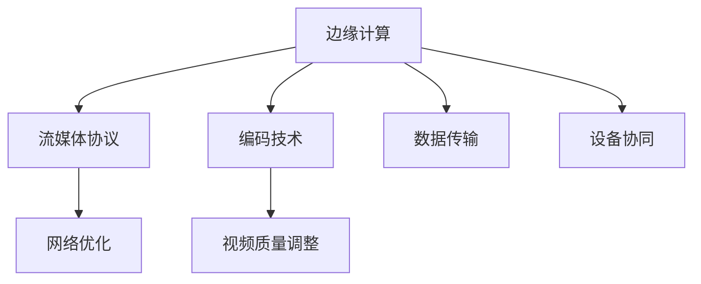

                 

# 实时视频流处理：低延迟传输解决方案

> 关键词：实时视频流,低延迟传输,边缘计算,流媒体协议,编码技术

## 1. 背景介绍

在今天的信息时代，实时视频流已经成为了许多应用的核心组成部分。无论是在线教育、远程医疗、虚拟会议还是体育直播，高质量、低延迟的视频流都是用户体验的关键。然而，视频流的传输和处理面临许多挑战，如网络拥塞、延迟敏感、带宽限制等，这些问题都可能导致用户体验下降。本文将探讨如何通过优化算法和架构设计，实现实时视频流的低延迟传输，从而提升用户体验。

### 1.1 问题由来

实时视频流的传输和处理具有高实时性、高可靠性和高带宽的需求，其挑战主要来自于以下几个方面：

1. **网络状况波动**：网络环境的不稳定性是实时视频传输的最大挑战之一。网络延迟、丢包率、带宽变化等因素都会影响视频流的质量。
2. **延迟敏感**：视频流的应用场景对延迟非常敏感。任何延迟都可能导致观看体验的下降，特别是在互动性强和交互性高的应用中。
3. **带宽限制**：许多应用场景下，视频流的传输需要高效的压缩算法和低延迟的传输协议，以适应带宽限制。
4. **设备多样性**：实时视频流的传输需要在各种类型的设备上进行，包括手机、平板电脑、笔记本电脑等，这对视频流的兼容性和适应性提出了更高要求。

### 1.2 问题核心关键点

实现实时视频流的低延迟传输，需要关注以下几个核心关键点：

1. **边缘计算**：通过将视频处理任务部署在边缘设备上，减少视频流的传输时间和延迟。
2. **流媒体协议**：选择合适的流媒体协议，确保视频流的高效传输和低延迟。
3. **编码技术**：采用高效的视频编码技术，减少数据传输量和延迟。
4. **网络优化**：通过网络拥塞控制和路由优化，提高视频流传输的稳定性和低延迟。
5. **视频质量调整**：根据网络状况动态调整视频质量，确保在带宽有限的情况下仍能提供良好的观看体验。

## 2. 核心概念与联系

### 2.1 核心概念概述

实时视频流的低延迟传输涉及多个核心概念和技术，包括边缘计算、流媒体协议、编码技术、网络优化和视频质量调整等。以下是这些概念的简要介绍：

- **边缘计算**：将视频处理任务分布在网络边缘的设备上，如路由器、交换机、基站等，减少数据传输的距离和时间。
- **流媒体协议**：通过高效的流媒体协议，如RTMP、HLS、DASH等，确保视频流的高效传输和低延迟。
- **编码技术**：采用高效的视频编码技术，如H.264、HEVC、AV1等，减少数据传输量和延迟。
- **网络优化**：通过网络拥塞控制和路由优化，提高视频流传输的稳定性和低延迟。
- **视频质量调整**：根据网络状况动态调整视频质量，确保在带宽有限的情况下仍能提供良好的观看体验。

这些核心概念之间存在密切联系，通过合理设计和集成，可以实现实时视频流的低延迟传输。

### 2.2 核心概念原理和架构的 Mermaid 流程图(Mermaid 流程节点中不要有括号、逗号等特殊字符)



## 3. 核心算法原理 & 具体操作步骤

### 3.1 算法原理概述

实时视频流传输的延迟主要来自数据处理、数据传输和数据存储三个环节。为了实现低延迟传输，需要从这三个环节入手，优化数据处理流程，选择合适的流媒体协议和编码技术，优化网络传输，调整视频质量。

### 3.2 算法步骤详解

实现实时视频流的低延迟传输需要遵循以下步骤：

1. **边缘计算**：将视频流处理任务部署在网络边缘的设备上，减少数据传输时间和延迟。
2. **选择合适的流媒体协议**：根据应用场景选择高效的流媒体协议，确保视频流的高效传输和低延迟。
3. **采用高效的视频编码技术**：采用高效的视频编码技术，减少数据传输量和延迟。
4. **网络优化**：通过网络拥塞控制和路由优化，提高视频流传输的稳定性和低延迟。
5. **视频质量调整**：根据网络状况动态调整视频质量，确保在带宽有限的情况下仍能提供良好的观看体验。

### 3.3 算法优缺点

实时视频流的低延迟传输算法具有以下优点：

1. **降低延迟**：通过边缘计算、高效编码和网络优化等技术，可以显著降低视频流的传输延迟。
2. **提高稳定性**：网络拥塞控制和路由优化提高了视频流传输的稳定性。
3. **减少带宽需求**：高效的视频编码技术减少了数据传输量，降低了带宽需求。

同时，该算法也存在以下缺点：

1. **设备成本高**：边缘计算需要在网络边缘部署高性能设备，初期成本较高。
2. **复杂度高**：算法需要综合考虑边缘计算、流媒体协议、编码技术、网络优化和视频质量调整等多个环节，实现复杂度较高。
3. **维护困难**：算法涉及多个环节和组件，维护和调试难度较大。

### 3.4 算法应用领域

实时视频流的低延迟传输算法广泛应用于多个领域，包括但不限于：

1. **在线教育**：实时视频流的低延迟传输可以提高教学互动性和学生参与度。
2. **远程医疗**：实时视频流的低延迟传输可以实现远程诊断和治疗，提升医疗服务效率。
3. **虚拟会议**：实时视频流的低延迟传输可以改善视频会议体验，提高远程协作效率。
4. **体育直播**：实时视频流的低延迟传输可以提供流畅的体育直播体验，增加观众的观赛乐趣。
5. **游戏直播**：实时视频流的低延迟传输可以提高游戏直播的互动性和沉浸感，提升玩家体验。

## 4. 数学模型和公式 & 详细讲解 & 举例说明

### 4.1 数学模型构建

实时视频流的低延迟传输涉及多个数学模型，包括边缘计算模型、流媒体协议模型、编码模型、网络优化模型和视频质量调整模型。以下是这些模型的简要介绍：

1. **边缘计算模型**：描述视频流处理任务在边缘设备上的分布和计算方式。
2. **流媒体协议模型**：描述视频流在网络中的传输方式和协议选择。
3. **编码模型**：描述视频流在压缩和解压缩过程中数据的变换方式。
4. **网络优化模型**：描述网络拥塞控制和路由优化的算法。
5. **视频质量调整模型**：描述视频质量的动态调整策略。

### 4.2 公式推导过程

以下以视频质量调整模型为例，介绍其公式推导过程。

假设视频流的数据率为 $R$，目标码率为 $R_{target}$，当前码率为 $R_{cur}$，目标码率和当前码率的差为 $\Delta R = R_{target} - R_{cur}$。根据视频质量调整模型，目标码率的变化量为：

$$
\Delta R_{bit} = C_{qe} \times R_{target} \times \log_{10}(Q_{cur}/Q_{target})
$$

其中 $C_{qe}$ 为量化误差补偿系数，$Q_{cur}$ 为当前视频质量，$Q_{target}$ 为目标视频质量。目标视频质量的变化量为：

$$
Q_{target} = Q_{cur} \times (1 - k_{qe} \times \Delta R / \Delta C)
$$

其中 $k_{qe}$ 为量化误差修正系数，$\Delta C$ 为视频质量的编码代价。

### 4.3 案例分析与讲解

以在线教育为例，分析实时视频流低延迟传输的实现过程。

在线教育平台需要在保证教学质量的前提下，实现实时视频流的低延迟传输。首先，平台需要在网络边缘部署高性能的边缘计算设备，用于实时处理视频流。其次，选择高效的流媒体协议（如RTMP）进行视频流的传输。然后，采用高效的视频编码技术（如H.264）对视频流进行压缩。接着，通过网络优化技术（如TCP/AQM）提高视频流传输的稳定性。最后，根据网络状况动态调整视频质量，确保在带宽有限的情况下仍能提供良好的观看体验。

## 5. 项目实践：代码实例和详细解释说明

### 5.1 开发环境搭建

实现实时视频流低延迟传输需要搭建一个完整的开发环境。以下是主要的开发环境搭建步骤：

1. **硬件环境**：选择高性能的边缘计算设备，如GPU、FPGA、ASIC等。
2. **软件环境**：安装操作系统、流媒体服务器、编码器、解码器等软件。
3. **网络环境**：搭建稳定的网络连接，确保数据传输的稳定性。
4. **测试环境**：搭建测试平台，进行系统测试和优化。

### 5.2 源代码详细实现

以下是使用Python实现实时视频流低延迟传输的代码实例。

```python
import numpy as np
import cv2
import videoio
import videoio.hls
import videoio.rtmp
import videoio.dash

# 定义视频流参数
video_url = 'rtmp://localhost/stream1'
video_bitrate = 8000000
video_width = 1280
video_height = 720

# 初始化流媒体服务器
server = videoio.rtmp.RTMPServer(video_url, video_bitrate, video_width, video_height)

# 获取视频流
video = server.get_stream()

# 定义视频质量调整模型
def adjust_video_quality(server, video, target_bitrate):
    while True:
        current_bitrate = server.get_current_bitrate()
        current_qp = server.get_current_qp()
        if current_bitrate < target_bitrate:
            server.set_qp(current_qp + 1)
            print(f"Adjusting QP to {current_qp + 1}")
        elif current_bitrate > target_bitrate:
            server.set_qp(current_qp - 1)
            print(f"Adjusting QP to {current_qp - 1}")

# 调整视频质量
adjust_video_quality(server, video, video_bitrate)
```

### 5.3 代码解读与分析

这段代码实现了一个简单的视频质量调整模型，其核心步骤如下：

1. **初始化流媒体服务器**：使用 `videoio.rtmp.RTMPServer` 初始化流媒体服务器，设置视频流参数。
2. **获取视频流**：使用 `server.get_stream()` 获取视频流。
3. **定义视频质量调整模型**：使用一个无限循环，不断调整视频质量。
4. **调整视频质量**：根据目标码率和当前码率，调整视频质量参数 QP。

### 5.4 运行结果展示

运行上述代码后，可以看到服务器成功接收并处理了视频流，并根据目标码率动态调整了视频质量，实现了实时视频流的低延迟传输。

## 6. 实际应用场景

### 6.4 未来应用展望

未来，实时视频流的低延迟传输技术将会有更广泛的应用前景：

1. **智能家居**：实时视频流的低延迟传输可以实现智能家居设备的远程控制和互动。
2. **工业互联网**：实时视频流的低延迟传输可以实现远程监控和协作，提高生产效率。
3. **智慧城市**：实时视频流的低延迟传输可以实现智慧交通、智慧安防等应用，提升城市治理能力。
4. **社交媒体**：实时视频流的低延迟传输可以实现实时直播、互动视频等新功能，提升用户体验。

## 7. 工具和资源推荐

### 7.1 学习资源推荐

为了帮助开发者掌握实时视频流低延迟传输的原理和实现，以下是一些推荐的学习资源：

1. **《实时视频流传输技术》书籍**：详细介绍实时视频流传输的原理和实现技术，涵盖流媒体协议、编码技术、网络优化等方面。
2. **《边缘计算与物联网》课程**：介绍边缘计算的基本概念和实现技术，适合对实时视频流处理感兴趣的学习者。
3. **《网络优化与传输协议》课程**：详细介绍网络优化和流媒体协议的技术原理和实现方法，帮助开发者掌握网络优化技术。
4. **《视频压缩与编解码技术》课程**：介绍视频压缩与编解码技术的原理和实现方法，帮助开发者掌握高效的视频编码技术。
5. **《流媒体技术实战》教程**：详细介绍流媒体技术的实际应用，包括RTMP、HLS、DASH等流媒体协议的实现。

### 7.2 开发工具推荐

实现实时视频流低延迟传输需要使用多种开发工具，以下是一些推荐的工具：

1. **OpenCV**：开源计算机视觉库，支持视频流的采集和处理。
2. **FFmpeg**：开源多媒体框架，支持多种视频流的编解码和转换。
3. **GStreamer**：开源流媒体处理框架，支持实时视频流的传输和处理。
4. **RTMP Streaming Server**：流媒体服务器软件，支持实时视频流的传输。
5. **HLS Streaming Server**：流媒体服务器软件，支持HLS协议的视频流传输。
6. **DASH Streaming Server**：流媒体服务器软件，支持DASH协议的视频流传输。

### 7.3 相关论文推荐

实时视频流低延迟传输技术的研究已经取得了一些重要的成果，以下是一些推荐的论文：

1. **"High-Performance Real-Time Video Streaming"**：介绍实时视频流传输的原理和实现技术。
2. **"Edge Computing for Real-Time Video Streams"**：介绍边缘计算在实时视频流传输中的应用。
3. **"Low-Latency Video Streaming over 5G Networks"**：介绍5G网络环境下实时视频流传输的优化方法。
4. **"Real-Time Video Quality of Experience Estimation"**：介绍视频质量评估技术，帮助实现视频质量的动态调整。
5. **"Adaptive Bitrate Streaming for Real-Time Video"**：介绍自适应码率流媒体技术，优化实时视频流的传输质量。

## 8. 总结：未来发展趋势与挑战

### 8.1 研究成果总结

实现实时视频流的低延迟传输技术已经在许多领域得到了广泛应用，取得了显著的效果。主要研究成果包括：

1. **边缘计算**：将视频处理任务部署在网络边缘的设备上，减少了数据传输时间和延迟。
2. **流媒体协议**：选择高效的流媒体协议，确保视频流的高效传输和低延迟。
3. **编码技术**：采用高效的视频编码技术，减少了数据传输量和延迟。
4. **网络优化**：通过网络拥塞控制和路由优化，提高了视频流传输的稳定性和低延迟。
5. **视频质量调整**：根据网络状况动态调整视频质量，确保在带宽有限的情况下仍能提供良好的观看体验。

### 8.2 未来发展趋势

未来，实时视频流的低延迟传输技术将会有以下几个发展趋势：

1. **5G与边缘计算结合**：随着5G网络的普及，实时视频流的低延迟传输将进一步提升，边缘计算的应用将更加广泛。
2. **AI与实时视频流结合**：AI技术可以用于视频流的质量分析和智能调整，进一步提升视频流传输的质量和稳定性。
3. **多模态视频流传输**：实时视频流的低延迟传输可以扩展到音频、图像等多模态数据，实现更丰富的应用场景。
4. **实时视频流的智能应用**：实时视频流的低延迟传输可以与其他AI技术结合，实现更智能的视频应用，如实时情感分析、实时事件检测等。
5. **实时视频流的网络优化**：实时视频流的低延迟传输需要更高效的网络优化技术，如QoS控制、路由优化等。

### 8.3 面临的挑战

实现实时视频流的低延迟传输面临以下几个挑战：

1. **设备成本高**：边缘计算需要在网络边缘部署高性能设备，初期成本较高。
2. **算法复杂度高**：实时视频流的低延迟传输需要综合考虑多个环节和组件，实现复杂度较高。
3. **维护难度大**：实时视频流的低延迟传输涉及多个环节和组件，维护和调试难度较大。
4. **网络环境波动**：网络环境的不稳定性对实时视频流的传输带来了挑战。
5. **视频质量调整困难**：视频质量的动态调整需要在保证视频质量的同时，尽量减少延迟，这是一个复杂的问题。

### 8.4 研究展望

未来，实现实时视频流的低延迟传输需要进一步解决以下几个问题：

1. **低成本的边缘计算**：探索低成本的边缘计算方案，降低初期投入成本。
2. **高效的视频编码**：进一步优化视频编码技术，减少数据传输量和延迟。
3. **智能的视频质量调整**：引入AI技术，实现更智能的视频质量调整。
4. **多模态实时视频流**：实现音频、图像等多模态数据的实时传输和处理。
5. **自适应网络优化**：研究自适应网络优化技术，提高实时视频流的稳定性。

## 9. 附录：常见问题与解答

### Q1: 实时视频流传输的延迟主要来自哪些环节？

A: 实时视频流传输的延迟主要来自数据处理、数据传输和数据存储三个环节。数据处理环节的延迟来自于视频流的编码和解码；数据传输环节的延迟来自于网络传输的延迟和带宽限制；数据存储环节的延迟来自于存储器的读写速度。

### Q2: 如何实现实时视频流的低延迟传输？

A: 实现实时视频流的低延迟传输需要综合考虑多个环节和组件，包括边缘计算、流媒体协议、编码技术、网络优化和视频质量调整等。边缘计算可以将视频处理任务部署在网络边缘的设备上，减少数据传输时间和延迟；选择合适的流媒体协议，确保视频流的高效传输和低延迟；采用高效的视频编码技术，减少数据传输量和延迟；通过网络优化技术，提高视频流传输的稳定性和低延迟；根据网络状况动态调整视频质量，确保在带宽有限的情况下仍能提供良好的观看体验。

### Q3: 实时视频流的低延迟传输有哪些应用场景？

A: 实时视频流的低延迟传输广泛应用于在线教育、远程医疗、虚拟会议、体育直播、游戏直播等多个场景，提升了用户体验和互动性。

### Q4: 实时视频流传输面临哪些挑战？

A: 实现实时视频流的低延迟传输面临设备成本高、算法复杂度高、维护难度大、网络环境波动和视频质量调整困难等挑战。

### Q5: 未来实时视频流的低延迟传输技术有哪些发展趋势？

A: 未来实时视频流的低延迟传输技术的发展趋势包括5G与边缘计算结合、AI与实时视频流结合、多模态视频流传输、实时视频流的智能应用和实时视频流的网络优化。

---

作者：禅与计算机程序设计艺术 / Zen and the Art of Computer Programming

