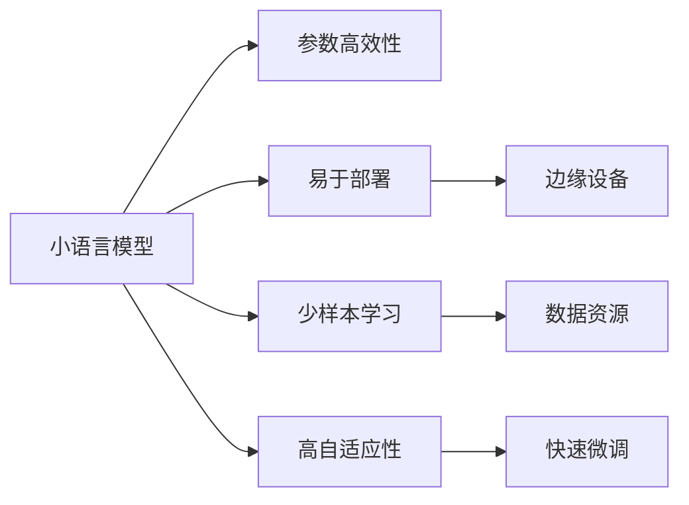

                 

## 1. 背景介绍

近年来，大语言模型（Large Language Models, LLMs）在自然语言处理（Natural Language Processing, NLP）领域取得了显著的进展，以其在各种语言处理任务上出色的表现吸引了广泛关注。然而，大模型的庞大参数量和训练成本限制了其在边缘设备或资源受限环境中的应用。与此同时，随着数据计算能力的提升，小规模语言模型（Small Language Models, SLMs）逐渐崭露头角，展现出颠覆性优势。本文将详细探讨小语言模型的核心概念、算法原理、实际应用和未来趋势，希望能为从业者提供有益的见解。

## 2. 核心概念与联系

### 2.1 核心概念概述

小语言模型（SLMs）通常指具有相对较小参数量和较短训练时间的语言模型，与大模型相比，它们在资源需求、训练时间和模型效率上都有显著优势。SLMs的核心概念包括以下几点：

- **参数高效性**：小模型参数量小，模型训练和推理速度快，适合在边缘设备或资源受限环境下运行。
- **易于部署**：小模型通常可以很方便地集成到移动应用、嵌入式设备中，提供即插即用的解决方案。
- **少样本学习**：小模型在较少标注样本的情况下也能有效进行微调，进一步减少了对数据资源的需求。
- **高自适应性**：小模型在面对新的语言任务时，可以通过快速的微调过程进行适配，快速响应需求变化。

### 2.2 核心概念联系（Mermaid 流程图）



### 2.3 核心概念架构

#### 2.3.1 架构示意图


小语言模型一般由编码器和解码器构成，输入文本经过编码器转换为中间表示，再通过解码器生成目标输出。通过预训练，编码器和解码器能够学习到通用语言表示，用于特定任务的微调。

## 3. 核心算法原理 & 具体操作步骤

### 3.1 算法原理概述

小语言模型的核心算法原理主要包括以下两点：

1. **预训练与微调**：小模型通常在通用大规模数据上进行预训练，学习通用的语言表示，然后在特定任务上通过微调进一步优化。
2. **参数高效微调**：小模型在微调过程中，仅调整顶层或部分参数，保持底层权重不变，从而提升模型效率。

### 3.2 算法步骤详解

#### 3.2.1 预训练步骤

1. **数据准备**：收集大规模无标注文本数据，如维基百科、新闻、网页等。
2. **模型初始化**：选择基础模型（如MobileBERT、BERT-Base等）进行模型初始化。
3. **预训练过程**：在预训练数据上进行自监督任务训练，如掩码语言模型、next sentence prediction等，以学习语言表示。

#### 3.2.2 微调步骤

1. **任务适配层设计**：根据具体任务类型（如分类、匹配、生成等），设计相应的输出层和损失函数。
2. **超参数设置**：设置学习率、批大小、迭代轮数等微调参数。
3. **模型训练**：在标注数据上进行有监督学习，优化模型参数。
4. **评估与优化**：在验证集上评估模型性能，根据需要调整超参数，重新训练模型。
5. **模型保存**：保存微调后的模型以备后续使用。

### 3.3 算法优缺点

#### 3.3.1 优点

- **高效性**：小模型训练和推理速度快，适合在资源受限环境下应用。
- **灵活性**：可以快速适配新任务，适应性强。
- **可解释性**：参数量少，模型结构和训练过程更透明，易于解释。

#### 3.3.2 缺点

- **泛化能力差**：由于参数量少，小模型泛化能力较弱，难以应对大规模、复杂任务。
- **数据依赖性高**：在微调过程中，对标注数据的质量和数量要求较高。
- **模型性能不稳定**：微调过程中的超参数选择、学习率调整等因素可能影响模型性能。

### 3.4 算法应用领域

小语言模型在多个NLP应用领域中表现出色：

- **智能客服**：在边缘设备上部署小模型，提供实时智能客服解决方案。
- **金融分析**：用于金融数据处理，快速分析市场变化，预测风险。
- **医疗诊断**：结合医疗数据，提供疾病诊断和智能推荐服务。
- **自动驾驶**：用于语音指令理解和车辆控制，提升驾驶体验。
- **教育培训**：提供个性化学习资源，辅助教学和评估。

## 4. 数学模型和公式 & 详细讲解 & 举例说明

### 4.1 数学模型构建

小语言模型一般采用自回归或自编码结构，其数学模型可以表示为：

$$
P(x|y) = \frac{e^{y^T[\log P(x|y)]}}{\sum_{k}e^{k^T[\log P(x|k)]}}
$$

其中，$P(x|y)$表示在条件$y$下，生成样本$x$的概率；$y$为模型输出；$\log P(x|y)$为模型的对数概率；$k$为模型中的所有参数向量。

### 4.2 公式推导过程

以自回归模型为例，推导其自回归概率计算公式：

$$
P(x|x_{<t}) = \prod_{i=1}^{t} P(x_i|x_{<i})
$$

其中，$x_{<t}$表示在$t$时刻之前所有的输入序列；$x_i$表示序列中的每个符号；$P(x_i|x_{<i})$表示在给定前$t-1$个符号下，第$t$个符号的条件概率。

### 4.3 案例分析与讲解

假设有一个文本分类任务，使用小模型进行微调。在微调过程中，选择BERT-Base模型作为初始化参数，基于任务需求，设计线性分类器作为输出层，使用交叉熵损失函数。具体步骤如下：

1. **数据准备**：收集任务相关的标注数据集。
2. **模型初始化**：加载BERT-Base模型，去除顶部的分类头。
3. **任务适配层设计**：添加线性分类器和交叉熵损失函数。
4. **微调训练**：在标注数据上使用AdamW优化器进行微调训练，设置学习率为$2e-5$，迭代轮数为$10$。
5. **评估**：在验证集上评估模型性能，使用准确率作为评估指标。

## 5. 项目实践：代码实例和详细解释说明

### 5.1 开发环境搭建

1. 安装Anaconda：
   ```bash
   conda install anaconda
   ```

2. 创建虚拟环境：
   ```bash
   conda create --name slm python=3.7
   conda activate slm
   ```

3. 安装PyTorch和相关库：
   ```bash
   pip install torch transformers
   ```

4. 安装相关工具：
   ```bash
   pip install numpy pandas scikit-learn matplotlib jupyter
   ```

### 5.2 源代码详细实现

下面以小模型在文本分类任务上的微调为例，给出详细的代码实现：

```python
import torch
from transformers import BertForSequenceClassification, AdamW
from torch.utils.data import DataLoader
from sklearn.metrics import accuracy_score
from torch.nn import CrossEntropyLoss

# 准备数据集
train_data = [...]  # 训练集数据
test_data = [...]  # 测试集数据

# 加载模型
model = BertForSequenceClassification.from_pretrained('bert-base-uncased', num_labels=2)

# 定义损失函数和优化器
criterion = CrossEntropyLoss()
optimizer = AdamW(model.parameters(), lr=2e-5)

# 训练过程
for epoch in range(10):
    for batch in DataLoader(train_data, batch_size=32):
        inputs = batch[0]
        labels = batch[1]
        outputs = model(inputs)
        loss = criterion(outputs, labels)
        optimizer.zero_grad()
        loss.backward()
        optimizer.step()
    print(f'Epoch {epoch+1}, Loss: {loss.item()}')

# 评估过程
test_loss = 0
correct = 0
total = 0
with torch.no_grad():
    for batch in DataLoader(test_data, batch_size=32):
        inputs = batch[0]
        labels = batch[1]
        outputs = model(inputs)
        loss = criterion(outputs, labels)
        test_loss += loss.item()
        _, predicted = torch.max(outputs, 1)
        total += labels.size(0)
        correct += (predicted == labels).sum().item()
print(f'Test Loss: {test_loss/len(test_data)}, Accuracy: {100 * correct / total}%')
```

### 5.3 代码解读与分析

在上述代码中，我们使用BertForSequenceClassification模型进行微调，具体步骤如下：

1. **数据准备**：通过`DataLoader`加载训练集和测试集数据。
2. **模型初始化**：加载预训练模型BERT-Base，并去除顶部的分类头。
3. **定义损失函数和优化器**：使用交叉熵损失函数和AdamW优化器。
4. **训练过程**：在每个epoch内，对训练集进行前向传播和反向传播，计算损失并更新模型参数。
5. **评估过程**：在测试集上评估模型性能，计算准确率。

## 6. 实际应用场景

### 6.1 智能客服系统

小语言模型适用于智能客服系统，可以在边缘设备上快速部署，提供实时响应和智能对话。通过小模型，智能客服可以准确理解和回答客户问题，提升客户体验和服务效率。

### 6.2 金融分析

小语言模型可以用于金融数据处理，帮助分析师快速分析市场变化和预测风险。在资源受限的环境下，小模型可以实时进行分析和决策，提高金融分析的效率和准确性。

### 6.3 医疗诊断

在医疗领域，小语言模型可以结合医疗数据，提供疾病诊断和智能推荐服务。通过微调，小模型可以快速学习并适应新病情，为医生提供辅助诊断和推荐。

### 6.4 自动驾驶

小语言模型在自动驾驶中用于语音指令理解和车辆控制。通过微调，小模型可以快速适应不同驾驶环境和任务，提高驾驶体验和安全性。

### 6.5 教育培训

小语言模型可以用于个性化学习资源的推荐和评估，帮助学生提高学习效果和教师优化教学方法。通过微调，小模型可以适应不同学生的学习需求，提供定制化学习建议。

## 7. 工具和资源推荐

### 7.1 学习资源推荐

1. **《小语言模型原理与应用》书籍**：详细介绍小语言模型的原理、算法和实际应用。
2. **PyTorch官方文档**：提供详细的PyTorch库使用指南和代码示例。
3. **HuggingFace官方文档**：介绍多种预训练模型和微调技术。
4. **Kaggle竞赛**：提供大量NLP任务数据集和预训练模型。

### 7.2 开发工具推荐

1. **PyTorch**：强大的深度学习框架，支持小模型训练和推理。
2. **TensorFlow**：谷歌开发的深度学习框架，适用于大规模模型训练。
3. **Weights & Biases**：实验跟踪和可视化工具，帮助调试和优化模型。
4. **TensorBoard**：可视化工具，用于监控模型训练状态。

### 7.3 相关论文推荐

1. **《小语言模型：一种高效、灵活的NLP解决方案》**：探讨小语言模型的优势和应用。
2. **《参数高效微调技术研究》**：研究如何在小模型中进行高效微调。
3. **《小语言模型在智能客服中的应用》**：介绍小语言模型在智能客服中的具体实现。

## 8. 总结：未来发展趋势与挑战

### 8.1 研究成果总结

小语言模型在NLP领域展现了强大的潜力，已经在多个实际应用中取得了显著成效。然而，小模型也存在泛化能力差、数据依赖性高等问题，需要进一步研究和优化。

### 8.2 未来发展趋势

未来，小语言模型将呈现以下几个发展趋势：

1. **多模态融合**：小模型将与图像、音频等多模态数据结合，提高跨领域泛化能力。
2. **知识增强**：小模型将融合符号化知识和逻辑推理，提升模型解释性和推理能力。
3. **自动化调参**：通过自动化调参技术，优化小模型的超参数设置，提高模型性能。
4. **联邦学习**：在小模型微调过程中，利用联邦学习技术，实现多设备协同训练，提高模型泛化能力。
5. **分布式训练**：通过分布式训练技术，加速小模型的训练过程，提高训练效率。

### 8.3 面临的挑战

尽管小语言模型具有诸多优势，但仍面临以下挑战：

1. **数据质量**：小模型对标注数据的质量和数量要求较高，数据采集和标注成本较高。
2. **模型鲁棒性**：小模型在应对复杂任务和噪声数据时，鲁棒性有待提高。
3. **跨领域泛化**：小模型在跨领域微调时，泛化能力较弱，难以适应新领域任务。
4. **计算资源**：小模型在微调过程中，计算资源需求较高，需要优化算法和硬件资源配置。

### 8.4 研究展望

未来，小语言模型需要在以下几个方面进行进一步研究和优化：

1. **自动化微调**：探索自动化微调技术，降低对标注数据和超参数设置的依赖。
2. **参数高效微调**：研究更多参数高效微调方法，提升微调效率和效果。
3. **多领域微调**：研究小模型跨领域微调技术，提升模型在不同领域的应用能力。
4. **联邦学习**：利用联邦学习技术，实现多设备协同微调，提升模型泛化能力。
5. **知识增强**：将符号化知识和逻辑推理融入小模型，提升模型解释性和推理能力。

总之，小语言模型在NLP领域具有广阔的发展前景，其高效性、灵活性和低资源需求，使其成为未来NLP技术的重要组成部分。通过不断优化和创新，小语言模型必将在更多应用领域大放异彩。

## 9. 附录：常见问题与解答

**Q1：小语言模型和大语言模型的区别是什么？**

A: 小语言模型和大语言模型的主要区别在于参数量和训练时间。小语言模型参数量小，训练时间短，适合在资源受限环境下应用，而大语言模型参数量大，训练时间长，适合在资源丰富的环境下进行大规模预训练。

**Q2：小语言模型如何进行少样本学习？**

A: 小语言模型可以通过以下方法进行少样本学习：
1. 利用迁移学习技术，在预训练数据上进行迁移学习，学习通用的语言表示。
2. 使用对抗训练技术，在少样本数据上进行对抗训练，提高模型鲁棒性。
3. 引入多视角训练，利用多视角数据，提高模型泛化能力。

**Q3：小语言模型在部署时需要注意哪些问题？**

A: 小语言模型在部署时需要注意以下几个问题：
1. 模型裁剪：去除不必要的层和参数，减小模型尺寸，加快推理速度。
2. 量化加速：将浮点模型转为定点模型，压缩存储空间，提高计算效率。
3. 服务化封装：将模型封装为标准化服务接口，便于集成调用。
4. 监控告警：实时采集系统指标，设置异常告警阈值，确保服务稳定性。
5. 安全防护：采用访问鉴权、数据脱敏等措施，保障数据和模型安全。

通过合理的部署策略，小语言模型可以在各种应用场景中发挥其高效性和灵活性，为用户提供优质的NLP服务。

