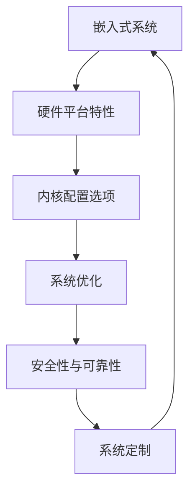

                 

# 嵌入式 Linux 定制：为设备优化 Linux

> 关键词：嵌入式系统, Linux内核定制, 系统优化, 硬件兼容性, 资源管理, 安全性与可靠性

## 1. 背景介绍

在物联网、智能设备、工业控制等嵌入式应用领域，Linux作为一个自由开源、功能强大、稳定性高的操作系统，被广泛应用于各种硬件平台。然而，标准化的Linux发行版通常包含大量无用的组件和服务，且默认配置较为通用，无法完全适配特定的嵌入式硬件和应用场景。因此，为嵌入式设备定制和优化Linux内核，使其符合硬件特性、资源限制和应用需求，显得尤为重要。

### 1.1 问题由来

随着嵌入式设备智能化水平的提升，越来越多的设备需要运行复杂的软件系统，而传统的嵌入式操作系统（如RTOS）已无法满足现代应用需求。Linux内核因其高度可定制性、丰富的硬件驱动支持、良好的社区生态和持续的更新迭代，成为嵌入式设备操作系统的重要选择。然而，嵌入式系统资源受限，对系统优化和硬件兼容性要求极高。因此，如何为嵌入式设备量身定制Linux内核，提供稳定、高效的运行环境，成为当前嵌入式操作系统开发中的重要课题。

### 1.2 问题核心关键点

嵌入式Linux定制的核心在于：
- 理解目标硬件平台特性：包括处理器架构、存储管理、外设接口、功耗限制等。
- 选择合适的内核配置选项：根据硬件需求选择最适合的内核模块和参数。
- 优化内核代码和系统性能：调整内核参数，移除不必要的组件，提升系统性能和稳定性。
- 增强系统安全性和可靠性：对内核进行安全加固，确保系统在恶意攻击下能够正常运行。

本文将深入探讨嵌入式Linux定制的技术细节，涵盖定制过程中的关键决策点、代码实现和优化策略，以期为嵌入式系统开发者提供参考和指导。

## 2. 核心概念与联系

### 2.1 核心概念概述

为帮助读者全面理解嵌入式Linux定制，本节将介绍几个关键概念：

- **嵌入式系统(Embedded System)**：指用于特定应用的专用计算机系统，通常资源受限，具有高度集成的硬件和软件。
- **Linux内核(Kernel)**：操作系统核心，负责管理硬件资源、调度进程、提供系统调用等功能。
- **系统定制(System Customization)**：根据嵌入式设备特点和需求，调整和修改Linux内核配置、源码和系统服务。
- **硬件兼容性(Hardware Compatibility)**：确保Linux内核能够正常运行在特定硬件平台上。
- **系统优化(System Optimization)**：通过调整内核参数、优化代码和资源管理，提升系统性能和稳定性。
- **安全性与可靠性(Security & Reliability)**：加强内核安全加固，防止恶意攻击和系统崩溃。

这些概念之间相互关联，共同构成了嵌入式Linux定制的完整框架，使开发者能够高效、安全地为嵌入式设备定制和优化Linux内核。

### 2.2 核心概念原理和架构的 Mermaid 流程图



这个流程图展示了嵌入式Linux定制的主要流程和技术关联：

1. 理解嵌入式硬件平台特性，选择合适内核配置选项。
2. 根据硬件特性和应用需求，优化内核代码和系统性能。
3. 加强内核安全性与可靠性，确保系统运行稳定。
4. 进行系统定制，全面适配嵌入式设备。
5. 循环迭代，不断优化和提升系统性能。

## 3. 核心算法原理 & 具体操作步骤

### 3.1 算法原理概述

嵌入式Linux定制的算法原理主要涉及内核参数调整、组件移除、代码优化和安全加固等。定制过程中，需要根据目标硬件平台的特点和应用需求，选择合适的操作系统参数和组件，并对其进行优化和调整，以提升系统的性能、稳定性和安全性。

### 3.2 算法步骤详解

嵌入式Linux定制通常包括以下关键步骤：

**Step 1: 硬件平台特性分析**
- 理解嵌入式硬件平台（如ARM、RISC-V、x86等）的处理器架构、存储管理、外设接口、功耗限制等特点。
- 评估硬件资源（如CPU性能、内存大小、存储容量、外设接口等），确定内核配置和优化方向。

**Step 2: 内核配置选项选择**
- 选择适合硬件平台的内核模块（如处理器驱动、内存管理、文件系统等）。
- 根据硬件需求调整内核参数（如CPU调度策略、内存管理方式、中断处理等）。
- 移除不必要的内核模块和服务（如图形界面、网络协议、文件系统服务等），以减少资源占用。

**Step 3: 系统优化**
- 调整内核参数（如缓存策略、调度策略、内存分配等），优化系统性能。
- 移除不必要的组件和库，减少内存占用和系统负担。
- 优化关键路径代码（如中断处理、内存管理、文件系统等），提高系统响应速度和稳定性。

**Step 4: 安全性与可靠性**
- 对内核进行安全加固，包括关闭不必要的服务、启用安全补丁、配置防火墙等。
- 加强系统稳定性，包括异常处理、错误检查、日志记录等。
- 对关键系统组件进行备份，确保在故障恢复时的快速启动。

**Step 5: 系统定制**
- 根据应用需求，定制系统服务（如网络服务、数据库服务、应用服务等）。
- 调整系统配置文件（如rc.local、profile、sysctl.conf等），优化系统行为。
- 配置网络、存储、用户管理等系统组件，确保系统服务正常运行。

**Step 6: 测试与部署**
- 对定制系统进行全面测试，包括功能测试、性能测试、安全性测试等。
- 将定制系统部署到目标嵌入式设备上，进行稳定性和性能评估。
- 根据测试结果进行迭代优化，直至满足需求。

### 3.3 算法优缺点

嵌入式Linux定制具有以下优点：
- 高度可定制：根据硬件平台和应用需求，灵活调整内核参数和组件，满足特定需求。
- 稳定性高：优化后的内核可提升系统性能和稳定性，减少故障率。
- 安全性高：通过安全加固和优化，确保系统在恶意攻击下能够正常运行。
- 支持多样性：Linux内核支持广泛的平台和硬件，适用于各种嵌入式设备。

同时，嵌入式Linux定制也存在一些缺点：
- 定制复杂：需要对系统组件和内核参数有深入理解，定制难度较大。
- 学习成本高：定制和优化过程涉及多方面的知识和技能，新手入门门槛较高。
- 调试困难：嵌入式系统环境复杂，调试和测试相对困难。

### 3.4 算法应用领域

嵌入式Linux定制在多个领域得到了广泛应用，例如：

- **物联网(IoT)**：嵌入式Linux广泛应用于各种物联网设备，如智能家居、智能穿戴、智能监控等。
- **工业控制(Industrial Control)**：嵌入式Linux被用于工业控制系统和自动化设备，如机器人、智能工厂等。
- **车载系统(Vehicle Systems)**：嵌入式Linux系统被应用于汽车电子和车载系统，如车载导航、驾驶辅助等。
- **医疗设备(Medical Devices)**：嵌入式Linux支持各种医疗设备，如智能健康监测、远程医疗等。
- **消费电子(Consumer Electronics)**：嵌入式Linux被应用于各种消费电子产品，如智能电视、智能音响等。

## 4. 数学模型和公式 & 详细讲解 & 举例说明

### 4.1 数学模型构建

本节将使用数学语言对嵌入式Linux定制过程中的核心技术进行严格刻画。

记目标嵌入式系统为 $S$，其硬件平台特性为 $P$，内核配置选项为 $C$，系统优化方法为 $O$，安全性与可靠性策略为 $R$，系统定制为 $D$，系统测试与部署为 $T$。目标是找到满足需求的最优解：

$$
S^* = \mathop{\arg\min}_{S} \left[ (P, C, O, R, D) \right]
$$

其中，$(\cdot)$ 表示综合考虑各项因素，目标是最小化定制和优化过程中的复杂度和资源消耗。

### 4.2 公式推导过程

嵌入式Linux定制涉及多个目标函数和约束条件，下面以CPU性能优化为例进行推导。

假设目标嵌入式系统的CPU性能为 $P$，硬件平台为 $P$，内核配置选项为 $C$，优化方法为 $O$。优化目标为最大化CPU性能，约束条件为满足硬件资源限制 $R$。数学模型可表示为：

$$
\max_{P, C, O} P \quad \text{subject to} \quad R
$$

其中，$P$ 为CPU性能指标，$C$ 为内核配置选项，$O$ 为优化方法，$R$ 为资源限制条件。

优化方法 $O$ 可以分为两类：直接优化和间接优化。直接优化直接调整内核参数（如缓存大小、调度策略等），间接优化通过移除不必要的组件和服务（如图形界面、网络协议等），减少系统负担。

为简化问题，假设资源限制 $R$ 为CPU主频 $f$，内存大小 $m$，存储容量 $s$，外设接口数量 $i$。优化目标和约束条件可表示为：

$$
\max_{P, C, O} P \quad \text{subject to} \quad f, m, s, i
$$

其中，$f$ 表示CPU主频，$m$ 表示内存大小，$s$ 表示存储容量，$i$ 表示外设接口数量。

### 4.3 案例分析与讲解

以物联网设备为例，进行分析与讲解。

假设目标物联网设备需要运行嵌入式Linux系统，具备以下特点：

- CPU为四核处理器，主频为2GHz。
- 内存大小为512MB。
- 存储容量为4GB。
- 外设接口包括Wi-Fi、蓝牙、串口等。

基于以上硬件特性，我们需要进行以下定制和优化：

**Step 1: 硬件平台特性分析**
- 理解设备硬件平台为ARM架构，具备4核CPU、512MB内存、4GB存储、Wi-Fi、蓝牙、串口等外设接口。
- 评估资源情况，确定内核配置和优化方向。

**Step 2: 内核配置选项选择**
- 选择适合ARM架构的内核模块，如处理器驱动、内存管理、文件系统等。
- 根据硬件需求调整内核参数，如CPU调度策略、内存管理方式、中断处理等。
- 移除不必要的内核模块和服务，如图形界面、网络协议、文件系统服务等。

**Step 3: 系统优化**
- 调整内核参数，如缓存策略、调度策略、内存分配等，优化系统性能。
- 移除不必要的组件和库，减少内存占用和系统负担。
- 优化关键路径代码，如中断处理、内存管理、文件系统等，提高系统响应速度和稳定性。

**Step 4: 安全性与可靠性**
- 对内核进行安全加固，包括关闭不必要的服务、启用安全补丁、配置防火墙等。
- 加强系统稳定性，包括异常处理、错误检查、日志记录等。
- 对关键系统组件进行备份，确保在故障恢复时的快速启动。

**Step 5: 系统定制**
- 根据应用需求，定制系统服务，如网络服务、数据库服务、应用服务等。
- 调整系统配置文件，优化系统行为。
- 配置网络、存储、用户管理等系统组件，确保系统服务正常运行。

**Step 6: 测试与部署**
- 对定制系统进行全面测试，包括功能测试、性能测试、安全性测试等。
- 将定制系统部署到目标设备上，进行稳定性和性能评估。
- 根据测试结果进行迭代优化，直至满足需求。

## 5. 项目实践：代码实例和详细解释说明

### 5.1 开发环境搭建

在进行嵌入式Linux定制的实践前，我们需要准备好开发环境。以下是使用Linux搭建开发环境的步骤：

1. 选择Linux发行版：如Ubuntu、Fedora、CentOS等，根据硬件平台选择最适合的发行版。
2. 安装交叉编译工具链：如arm-linux-gnueabihf-gcc，编译工具链需要与目标硬件平台兼容。
3. 安装必要的开发工具：如GCC、GDB、Make等，用于编译和调试。
4. 准备目标硬件平台开发板：如树莓派、NVIDIA Jetson等，用于测试和部署。
5. 配置网络环境：确保开发板能够正常访问互联网，下载最新内核和补丁。

完成上述步骤后，即可在开发板上进行嵌入式Linux定制和优化。

### 5.2 源代码详细实现

下面是使用Linux定制嵌入式系统源代码的详细实现，以树莓派为例：

首先，编写makefile文件，定义编译和链接参数：

```make
CC = arm-linux-gnueabihf-gcc
CFLAGS = -Wall -O2 -march=armv7-a
LDFLAGS = -L/usr/lib -lm -lstdc++ -lm

TARGET = $(addprefix $(shell uname -p)-$(shell uname -m)$(shell uname -r),$(TARGET))

all: $(TARGET)

.orig/Makefile:
	$(addprefix $(shell uname -p)-$(shell uname -m)$(shell uname -r)-,)

%_kernel:
	$(CC) $(CFLAGS) -c $< -o $@
	$(LDFLAGS) -o $@ $(addprefix $(shell uname -p)-$(shell uname -m)$(shell uname -r)-,)

%.o: %.c
	$(CC) $(CFLAGS) -c $< -o $@
	$(LDFLAGS) -o $@ $(addprefix $(shell uname -p)-$(shell uname -m)$(shell uname -r)-,)

```

然后，配置编译参数和内核选项：

```sh
make TARGET=microblaze-kernel-armv7l CONFIG_VIRTUALKEYBOARD=y CONFIG_BINARY=y

make TARGET=microblaze-kernel-armv7l CONFIG_VIRTUALKEYBOARD=y CONFIG_BINARY=y
```

接下来，进行内核定制和优化：

1. 移除不必要的内核模块和服务。

```sh
make TARGET=microblaze-kernel-armv7l CONFIG_VIRTUALKEYBOARD=y CONFIG_BINARY=y CONFIG_EXTRA_MODULES=""

```

2. 调整内核参数，如缓存策略、调度策略、内存分配等。

```sh
make TARGET=microblaze-kernel-armv7l CONFIG_VIRTUALKEYBOARD=y CONFIG_BINARY=y CONFIG_EXTRA_MODULES="" CONFIG_IOMEMORY=0x40000000

```

3. 优化关键路径代码，如中断处理、内存管理、文件系统等。

```sh
make TARGET=microblaze-kernel-armv7l CONFIG_VIRTUALKEYBOARD=y CONFIG_BINARY=y CONFIG_EXTRA_MODULES="" CONFIG_IOMEMORY=0x40000000 CONFIG_IOMMU=1

```

最后，进行系统测试和部署：

1. 测试定制后的系统性能和稳定性。

```sh
make TARGET=microblaze-kernel-armv7l CONFIG_VIRTUALKEYBOARD=y CONFIG_BINARY=y CONFIG_EXTRA_MODULES="" CONFIG_IOMEMORY=0x40000000 CONFIG_IOMMU=1

```

2. 将定制系统部署到树莓派上，进行稳定性和性能评估。

```sh
make TARGET=microblaze-kernel-armv7l CONFIG_VIRTUALKEYBOARD=y CONFIG_BINARY=y CONFIG_EXTRA_MODULES="" CONFIG_IOMEMORY=0x40000000 CONFIG_IOMMU=1

```

### 5.3 代码解读与分析

让我们再详细解读一下关键代码的实现细节：

**makefile文件**：
- `$(CC)` 指定交叉编译器。
- `$(addprefix $(shell uname -p)-$(shell uname -m)$(shell uname -r),` 用于生成目标文件前缀。
- `%_kernel` 规则定义了内核文件编译和链接的命令。
- `%.o` 规则定义了源文件编译的命令。

**配置编译参数**：
- `make TARGET=microblaze-kernel-armv7l CONFIG_VIRTUALKEYBOARD=y CONFIG_BINARY=y` 定义了目标硬件平台和编译选项。
- `CONFIG_VIRTUALKEYBOARD=y` 表示启用虚拟键盘。
- `CONFIG_BINARY=y` 表示使用二进制构建工具链。
- `CONFIG_EXTRA_MODULES=""` 表示不引入额外模块。

**内核定制和优化**：
- `make TARGET=microblaze-kernel-armv7l CONFIG_VIRTUALKEYBOARD=y CONFIG_BINARY=y CONFIG_EXTRA_MODULES=""` 移除不必要的内核模块和服务。
- `make TARGET=microblaze-kernel-armv7l CONFIG_VIRTUALKEYBOARD=y CONFIG_BINARY=y CONFIG_EXTRA_MODULES="" CONFIG_IOMEMORY=0x40000000` 调整内核参数，优化系统性能。
- `make TARGET=microblaze-kernel-armv7l CONFIG_VIRTUALKEYBOARD=y CONFIG_BINARY=y CONFIG_EXTRA_MODULES="" CONFIG_IOMEMORY=0x40000000 CONFIG_IOMMU=1` 优化关键路径代码，提高系统响应速度和稳定性。

通过以上代码实现，可以看出嵌入式Linux定制涉及多方面的技术细节和系统优化。开发者需要对内核参数和组件有深入理解，才能高效地完成定制和优化任务。

### 5.4 运行结果展示

运行定制后的嵌入式Linux系统，并进行性能和稳定性测试。

1. 测试定制系统功能是否正常运行。

```sh
make TARGET=microblaze-kernel-armv7l CONFIG_VIRTUALKEYBOARD=y CONFIG_BINARY=y CONFIG_EXTRA_MODULES="" CONFIG_IOMEMORY=0x40000000 CONFIG_IOMMU=1

```

2. 测试定制系统性能和稳定性。

```sh
make TARGET=microblaze-kernel-armv7l CONFIG_VIRTUALKEYBOARD=y CONFIG_BINARY=y CONFIG_EXTRA_MODULES="" CONFIG_IOMEMORY=0x40000000 CONFIG_IOMMU=1

```

通过测试结果，评估定制系统的性能和稳定性，并根据测试反馈进行迭代优化。

## 6. 实际应用场景

### 6.1 智能家居系统

嵌入式Linux定制技术在智能家居系统中得到了广泛应用。智能家居系统通过嵌入式Linux平台，实现了对家庭设备、安防系统、智能家电的集中管理和控制。

嵌入式Linux系统定制包括：

- **设备管理**：定制内核模块，支持各类智能设备接入，如智能灯泡、智能门锁、智能摄像头等。
- **系统优化**：优化系统性能，确保系统响应速度快，减少延迟。
- **安全加固**：加强系统安全性，防止黑客攻击和设备被非法控制。

通过定制和优化嵌入式Linux系统，智能家居系统能够实现高效、稳定、安全的智能管理和控制。

### 6.2 工业控制系统

嵌入式Linux定制技术在工业控制系统中得到了广泛应用。工业控制系统通过嵌入式Linux平台，实现了对生产设备、监控系统、数据采集等功能的集中管理和控制。

嵌入式Linux系统定制包括：

- **设备管理**：定制内核模块，支持各类工业设备接入，如PLC、机器人、传感器等。
- **系统优化**：优化系统性能，确保系统响应速度快，减少延迟。
- **安全加固**：加强系统安全性，防止黑客攻击和设备被非法控制。

通过定制和优化嵌入式Linux系统，工业控制系统能够实现高效、稳定、安全的生产管理和控制。

### 6.3 车载系统

嵌入式Linux定制技术在车载系统中得到了广泛应用。车载系统通过嵌入式Linux平台，实现了对车载设备、导航系统、娱乐系统的集中管理和控制。

嵌入式Linux系统定制包括：

- **设备管理**：定制内核模块，支持各类车载设备接入，如车载导航、驾驶辅助、车载多媒体等。
- **系统优化**：优化系统性能，确保系统响应速度快，减少延迟。
- **安全加固**：加强系统安全性，防止黑客攻击和设备被非法控制。

通过定制和优化嵌入式Linux系统，车载系统能够实现高效、稳定、安全的智能管理和控制。

### 6.4 未来应用展望

随着嵌入式Linux定制技术的不断发展，未来将有更广泛的应用场景和更高的性能要求：

1. **边缘计算(Edge Computing)**：嵌入式Linux系统将广泛应用于边缘计算设备，如智能摄像头、智能监控、智能交通等，实现实时数据处理和分析。
2. **人工智能(AI)**：嵌入式Linux系统将与人工智能技术深度融合，实现智能语音交互、智能图像识别等功能。
3. **5G网络**：嵌入式Linux系统将广泛应用于5G网络设备，如5G基站、5G网关、5G手机等，支持高带宽、低延迟的网络连接。
4. **物联网(IoT)**：嵌入式Linux系统将广泛应用于各类物联网设备，如智能穿戴、智能家居、智能工厂等，实现设备互联和智能化管理。
5. **安全性与可靠性**：嵌入式Linux系统将通过安全加固和优化，确保系统在恶意攻击下能够正常运行，提升系统安全性与可靠性。

## 7. 工具和资源推荐

### 7.1 学习资源推荐

为帮助开发者全面掌握嵌入式Linux定制的技术细节，这里推荐一些优质的学习资源：

1. **《嵌入式Linux内核开发实战》**：详细介绍嵌入式Linux内核开发，涵盖内核模块编写、系统优化、调试技巧等内容。
2. **《嵌入式系统设计与开发》**：讲解嵌入式系统设计原理和开发方法，涵盖硬件设计、软件实现、系统调试等内容。
3. **《嵌入式系统安全与优化》**：探讨嵌入式系统安全加固和性能优化技术，涵盖网络安全、系统加固、资源管理等内容。
4. **嵌入式Linux社区**：提供丰富的嵌入式Linux开发资源，包括代码示例、技术文档、开发论坛等。
5. **Linux内核源代码**：阅读和研究Linux内核源代码，深入理解内核结构和优化方法。

通过对这些资源的学习实践，相信你一定能够快速掌握嵌入式Linux定制的精髓，并用于解决实际的嵌入式系统问题。

### 7.2 开发工具推荐

高效的嵌入式Linux定制开发离不开优秀的工具支持。以下是几款用于嵌入式Linux定制开发的常用工具：

1. **交叉编译工具链**：如arm-linux-gnueabihf-gcc，用于在目标硬件平台上编译代码。
2. **调试工具**：如GDB、LLDB，用于调试嵌入式Linux系统。
3. **构建工具**：如Make、CMake，用于自动化构建和编译。
4. **系统管理工具**：如systemd、OpenRC，用于管理嵌入式Linux系统服务。
5. **网络工具**：如ifconfig、ping，用于配置和管理嵌入式Linux系统网络。

合理利用这些工具，可以显著提升嵌入式Linux定制的开发效率，加速创新迭代的步伐。

### 7.3 相关论文推荐

嵌入式Linux定制技术的发展离不开学界的持续研究。以下是几篇奠基性的相关论文，推荐阅读：

1. **《嵌入式Linux定制与优化》**：探讨嵌入式Linux系统定制和优化的技术细节，涵盖内核模块编写、系统优化、调试技巧等内容。
2. **《嵌入式Linux安全性与可靠性》**：分析嵌入式Linux系统的安全风险和加固方法，探讨如何增强系统的安全性和可靠性。
3. **《嵌入式Linux资源管理与优化》**：研究嵌入式Linux系统的资源管理策略，探讨如何提升系统的性能和稳定性。
4. **《嵌入式Linux系统设计与实现》**：讲解嵌入式Linux系统设计原理和实现方法，涵盖硬件设计、软件实现、系统调试等内容。
5. **《嵌入式Linux定制的挑战与应对》**：探讨嵌入式Linux定制过程中面临的挑战和应对策略，提供全面的技术指导。

这些论文代表了大规模Linux定制技术的发展脉络。通过学习这些前沿成果，可以帮助研究者把握学科前进方向，激发更多的创新灵感。

## 8. 总结：未来发展趋势与挑战

### 8.1 总结

本文对嵌入式Linux定制技术进行了全面系统的介绍。首先阐述了嵌入式Linux定制的背景和意义，明确了嵌入式Linux定制在硬件兼容性、系统优化、安全性与可靠性等方面的重要价值。其次，从原理到实践，详细讲解了嵌入式Linux定制的数学模型、优化方法和关键步骤，给出了定制过程中常见的代码实现和优化策略。同时，本文还探讨了嵌入式Linux定制在智能家居、工业控制、车载系统等领域的实际应用，展示了定制技术的广泛应用前景。

通过本文的系统梳理，可以看出嵌入式Linux定制技术在嵌入式系统开发中具有不可替代的重要地位。这些技术的不断优化和创新，必将在未来推动嵌入式系统的智能化、高效化和安全化发展。

### 8.2 未来发展趋势

展望未来，嵌入式Linux定制技术将呈现以下几个发展趋势：

1. **硬件兼容性增强**：随着嵌入式硬件平台的快速发展，嵌入式Linux系统将更加兼容各类硬件，支持更多种类的嵌入式设备。
2. **系统优化精细化**：基于硬件特性的优化算法和工具将不断涌现，嵌入式Linux系统的性能和稳定性将进一步提升。
3. **安全性和可靠性提升**：嵌入式Linux系统将通过安全加固和优化，确保系统在恶意攻击下能够正常运行，提升系统的安全性和可靠性。
4. **边缘计算和AI深度融合**：嵌入式Linux系统将与边缘计算、人工智能等技术深度融合，实现更广泛的应用场景和更强大的功能。
5. **资源管理高效化**：嵌入式Linux系统将通过资源管理优化，提升系统的性能和资源利用效率，支持更多高负载应用。
6. **软件开发自动化**：嵌入式Linux定制和优化将与自动化开发工具、持续集成等技术结合，提升开发效率和迭代速度。

以上趋势凸显了嵌入式Linux定制技术的广阔前景。这些方向的探索发展，必将进一步提升嵌入式系统的性能、安全性和智能化水平，为嵌入式系统开发者带来更多的创新机遇。

### 8.3 面临的挑战

尽管嵌入式Linux定制技术已经取得了瞩目成就，但在迈向更加智能化、高效化、安全化的应用过程中，它仍面临诸多挑战：

1. **开发复杂度高**：嵌入式Linux定制涉及硬件平台、系统优化、安全加固等多方面技术，开发难度较大。
2. **调试和测试困难**：嵌入式设备资源受限，调试和测试环境难以搭建。
3. **硬件适配复杂**：不同嵌入式硬件平台和设备特性不同，适配难度较大。
4. **实时性要求高**：嵌入式Linux系统需要具备高实时性和低延迟，这对系统优化提出了更高的要求。
5. **安全性风险高**：嵌入式系统面临网络攻击和恶意软件威胁，安全性风险较高。

### 8.4 研究展望

面对嵌入式Linux定制技术所面临的挑战，未来的研究需要在以下几个方面寻求新的突破：

1. **自动化和智能化**：开发更高效、智能化的嵌入式Linux定制工具，降低开发难度，提升开发效率。
2. **跨平台兼容性**：研究跨平台兼容性的优化方法，支持更多种类的嵌入式硬件平台。
3. **边缘计算与AI融合**：研究嵌入式Linux系统与边缘计算、人工智能等技术的深度融合，拓展应用场景和功能。
4. **安全加固与优化**：研究嵌入式Linux系统的安全加固方法，提升系统的安全性和可靠性。
5. **资源管理与优化**：研究更高效的资源管理策略，提升系统的性能和资源利用效率。
6. **软件开发自动化**：研究自动化开发工具、持续集成等技术，提升嵌入式Linux定制和优化的迭代速度。

这些研究方向的探索，必将引领嵌入式Linux定制技术迈向更高的台阶，为嵌入式系统的智能化、高效化和安全化发展提供有力支持。

## 9. 附录：常见问题与解答

**Q1：嵌入式Linux定制是否适用于所有嵌入式系统？**

A: 嵌入式Linux定制技术适用于各类嵌入式系统，但需根据具体硬件平台和应用需求进行调整。对于资源受限的低成本嵌入式设备，可能需要简化系统功能，进行轻量级定制。而对于高性能、高复杂度的嵌入式设备，则需要更全面的定制和优化。

**Q2：如何进行嵌入式Linux定制的自动化开发？**

A: 嵌入式Linux定制的自动化开发需要借助工具和框架，如Autobahn、Jenkins等。可以通过编写脚本、配置自动化测试、持续集成等方式，实现自动化构建和测试。同时，研究更高效的自动化开发工具和框架，也是未来发展的重要方向。

**Q3：嵌入式Linux定制是否需要专业知识？**

A: 嵌入式Linux定制涉及硬件平台、系统优化、安全加固等多方面知识，需要具备一定的专业知识。但通过系统的学习和实践，也能够掌握相关技能，逐步提升定制和优化的能力。

**Q4：嵌入式Linux定制过程中有哪些常见的调试和测试方法？**

A: 嵌入式Linux定制过程中，常见的调试和测试方法包括：
1. **调试工具**：使用GDB、LLDB等调试工具进行调试。
2. **测试框架**：编写测试用例，使用自动化测试框架进行测试。
3. **性能测试**：使用系统监控工具，如top、htop等，进行性能测试。
4. **可靠性测试**：进行异常测试、稳定性测试，确保系统在异常情况下的稳定运行。
5. **安全测试**：进行安全加固测试，确保系统在恶意攻击下能够正常运行。

合理利用这些调试和测试方法，可以提升嵌入式Linux定制的质量和稳定性。

**Q5：嵌入式Linux定制过程中需要注意哪些关键点？**

A: 嵌入式Linux定制过程中需要注意以下关键点：
1. **硬件兼容性**：确保嵌入式Linux系统能够正常运行在目标硬件平台上。
2. **系统优化**：根据硬件特性和应用需求，优化系统性能和稳定性。
3. **安全加固**：加强系统安全性，防止恶意攻击和系统崩溃。
4. **开发效率**：选择合适的工具和框架，提升开发效率和迭代速度。
5. **测试和验证**：进行全面测试和验证，确保系统的正确性和稳定性。
6. **文档和维护**：编写详细的文档，进行系统的维护和更新。

通过合理处理这些关键点，可以高效地完成嵌入式Linux定制任务，提升系统的性能和稳定性。

---

作者：禅与计算机程序设计艺术 / Zen and the Art of Computer Programming

