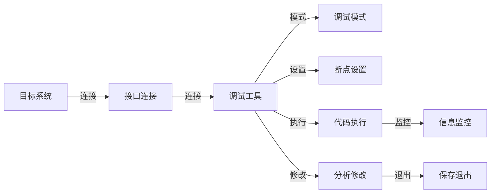

                 

# 嵌入式系统调试技巧：使用 JTAG 和 SWD

在嵌入式系统开发中，调试是一个不可或缺的步骤。如何高效、准确地定位问题，快速修复bug，是每个开发者都需掌握的关键技能。本文档将介绍两种常用的嵌入式系统调试手段：JTAG和SWD，并深入探讨其原理、应用和优化技巧。

## 1. 背景介绍

### 1.1 问题由来
在嵌入式系统开发过程中，硬件和软件的协同工作存在诸多复杂性。开发人员往往需要耗费大量时间和精力，进行设备调试和代码测试。特别是在一些复杂多任务、高性能的嵌入式系统中，如汽车电子、工业控制等，调试工作更是繁琐、耗时。

为解决这些问题，工程师们开发了多种调试工具和技术，其中以JTAG和SWD最为流行和高效。这两种技术通过嵌入式接口进行程序状态跟踪和数据捕获，使得调试过程更为直观和便捷。

### 1.2 问题核心关键点
JTAG和SWD的核心理念是利用硬件接口直接访问微控制器内部状态，包括寄存器、内存和存储器等。通过这种直接访问，可以实时监控系统运行状态，动态调试代码执行，定位错误。

这两种技术的主要区别在于传输协议、接口规格和应用场景。JTAG使用IEEE1149.1标准的调试接口，支持多种协议，如JTAG和IEEE1149.4。而SWD则基于ARM的CoreSight调试接口，支持ARM内核的调试，速度快、安全性高。

## 2. 核心概念与联系

### 2.1 核心概念概述

#### 2.1.1 JTAG
JTAG（Joint Test Action Group）是一种标准化的硬件调试接口。JTAG协议允许调试工具通过特定引脚访问CPU内部的寄存器和内存，实现非侵入式调试。

#### 2.1.2 SWD
SWD（Serial Wire Debug）是ARM公司的调试接口，用于调试ARM内核的嵌入式系统。SWD使用串行方式进行数据传输，速度比JTAG更快，安全性更高，且只支持ARM内核。

#### 2.1.3 连接方式
JTAG和SWD通过特殊的调试接口引脚与目标系统连接。典型的连接方式包括：

- **JTAG**：使用4个调试接口引脚：TDI、TMS、TCK、GND。
- **SWD**：使用3个调试接口引脚：SWDIO、GND、SWDCLK。

这些引脚的连接方式在目标系统电路板上通常有明确标注，开发者需按照官方文档进行连接。

#### 2.1.4 调试过程
JTAG和SWD调试过程包括：
- 配置目标系统的调试模式。
- 加载调试工具。
- 设置断点和监控条件。
- 执行程序，观察调试信息。
- 分析并修改代码。
- 保存和退出调试模式。

### 2.2 核心概念原理和架构的 Mermaid 流程图(Mermaid 流程节点中不要有括号、逗号等特殊字符)


## 3. 核心算法原理 & 具体操作步骤

### 3.1 算法原理概述
JTAG和SWD协议采用特定的传输格式和指令集，通过调试工具和目标系统间的交互，实现对目标系统的直接访问和调试。具体原理如下：

#### 3.1.1 传输协议
JTAG和SWD都基于串行传输协议，支持全双工通信。数据在调试工具和目标系统间双向传输，用于读写寄存器、内存等。

#### 3.1.2 传输指令
JTAG和SWD协议定义了特定的指令集，用于控制调试行为。包括：
- **读写寄存器指令**：用于读取和写入寄存器的值。
- **设置断点指令**：用于在指定地址设置断点。
- **执行指令**：用于启动程序的执行，直至断点或终止。
- **单步执行指令**：用于逐条执行程序，观察调试信息。
- **数据监控指令**：用于读取或写入内存，监控程序状态。

#### 3.1.3 调试模式
JTAG和SWD需要目标系统进入调试模式，才能进行操作。进入调试模式后，CPU进入低功耗状态，仅用于调试，不执行其他任务。

### 3.2 算法步骤详解

#### 3.2.1 硬件连接
1. 连接调试接口引脚：根据目标系统型号，将调试接口引脚连接至调试工具。
2. 配置调试模式：打开目标系统电源，通过调试工具进入调试模式。

#### 3.2.2 加载调试工具
1. 下载调试软件：选择适合的调试软件，如X-Trace、Lauterbach等。
2. 设置参数：根据目标系统型号和调试需求，配置调试软件参数。

#### 3.2.3 设置断点和监控条件
1. 设置断点：在目标系统的程序代码中设置断点，以便在执行时停止程序。
2. 监控变量：定义需要监控的变量或寄存器，实时观察其值的变化。

#### 3.2.4 执行程序
1. 开始调试：启动程序执行，观察调试工具的监控信息。
2. 单步执行：逐条执行程序，观察每条指令的执行结果。

#### 3.2.5 分析修改
1. 定位问题：根据调试信息，定位程序中的错误或异常。
2. 修改代码：修改出现问题的代码，重新执行调试。

#### 3.2.6 保存退出
1. 保存调试数据：保存调试过程中的关键数据和监控结果。
2. 退出调试模式：关闭调试工具，恢复正常模式。

### 3.3 算法优缺点

#### 3.3.1 JTAG优点
- **广泛适用**：支持多种架构的调试，如x86、ARM、MIPS等。
- **安全性高**：调试过程中不直接影响用户数据。
- **多功能**：支持多种调试功能，如下载代码、更新配置等。

#### 3.3.2 JTAG缺点
- **连接复杂**：需要物理连接，操作繁琐。
- **速度较慢**：由于是串行传输，速度较慢。
- **接口标准不统一**：不同厂家的JTAG接口标准不同，兼容性较差。

#### 3.3.3 SWD优点
- **速度快**：串行传输协议，速度快。
- **安全性高**：通过硬件加密保护调试信息。
- **接口简单**：仅需要3个调试接口引脚，操作简便。

#### 3.3.4 SWD缺点
- **应用局限**：仅支持ARM内核。
- **硬件要求高**：需要支持CoreSight接口的目标系统。
- **成本较高**：专用调试工具价格较高。

### 3.4 算法应用领域

#### 3.4.1 嵌入式开发
JTAG和SWD广泛应用于嵌入式系统的开发和调试过程中。通过调试工具实时监控程序状态，观察调试信息，快速定位问题。

#### 3.4.2 系统维护
对于已部署的嵌入式系统，调试工具可用于监控和调试运行中的程序。通过断点和变量监控，及时发现并解决系统问题。

#### 3.4.3 硬件测试
JTAG和SWD还可用于硬件测试和验证。通过控制目标系统的寄存器和内存，模拟不同工作状态，验证硬件设计的正确性。

## 4. 数学模型和公式 & 详细讲解 & 举例说明（备注：数学公式请使用latex格式，latex嵌入文中独立段落使用 $$，段落内使用 $)
### 4.1 数学模型构建
JTAG和SWD协议的数学模型建立在串行通信协议和指令集之上。以JTAG为例，其通信模型如下：

#### 4.1.1 数据帧格式
JTAG数据帧由起始位、指令位、地址位、数据位和停止位组成。指令位和地址位固定，数据位和长度可变。

#### 4.1.2 指令集
JTAG定义了多种调试指令，如读寄存器、写寄存器、设置断点、单步执行等。指令格式包括：
- 起始位：$0$。
- 指令长度：$4$位。
- 操作码：$8$位。
- 地址长度：$8$位。
- 数据长度：$8$位。
- 数据位：长度可变。
- 停止位：$1$位。

#### 4.1.3 数据传输
JTAG数据传输基于串行通信，使用时钟信号（TCK）和数据信号（TDI、TDI）完成。指令和数据帧在TCK时钟的上升沿和下降沿之间传输。

### 4.2 公式推导过程
以读寄存器指令为例，其数据帧格式如下：

| 起始位 | 指令长度 | 操作码 | 地址长度 | 数据长度 | 数据位 | 停止位 |
| ------ | -------- | ------ | -------- | -------- | ------ | ------ |

读取寄存器的数据帧格式为：
- 起始位：$0$。
- 指令长度：$4$。
- 操作码：$00000001$。
- 地址长度：$1$。
- 数据长度：$32$。
- 数据位：寄存器值（$32$位）。
- 停止位：$1$。

通过分析指令格式和数据帧结构，可以推导出JTAG协议的具体操作流程，如下：
1. 发送起始位。
2. 发送指令位，长度$4$位。
3. 发送地址位，长度$1$位。
4. 发送数据长度位，长度$8$位。
5. 发送数据位，长度$32$位。
6. 发送停止位。

### 4.3 案例分析与讲解
假设我们要通过JTAG读取目标系统寄存器$0x01234567$的值。具体步骤如下：
1. 发送起始位，长度$1$位。
2. 发送指令长度$4$位。
3. 发送操作码$00000001$（读寄存器）。
4. 发送地址长度$1$位，地址$0x01234567$。
5. 发送数据长度$8$位，长度$32$位。
6. 发送数据位$0x01234567$。
7. 发送停止位，长度$1$位。

通过上述操作，JTAG调试工具能够读取目标系统的寄存器值，用于监控和调试程序。

## 5. 项目实践：代码实例和详细解释说明
### 5.1 开发环境搭建

#### 5.1.1 硬件准备
- 目标系统：如STM32F407系列，包含JTAG调试接口。
- 调试工具：如X-Trace、Lauterbach等。

#### 5.1.2 软件安装
- 安装调试软件：如X-Trace，下载并安装。
- 配置调试参数：根据目标系统型号，设置调试参数。

### 5.2 源代码详细实现

#### 5.2.1 连接JTAG
1. 连接JTAG接口引脚：将TDI、TMS、TCK引脚连接至调试工具。
2. 打开目标系统电源，进入调试模式。

#### 5.2.2 配置调试工具
1. 打开X-Trace软件，选择目标系统型号。
2. 配置调试参数：如串口号、时钟频率、调试模式等。

#### 5.2.3 设置断点
1. 加载程序：将目标系统的程序加载到X-Trace中。
2. 设置断点：在程序代码中设置断点，如函数入口、关键变量等。
3. 单步执行：逐条执行程序，观察调试信息。

#### 5.2.4 监控变量
1. 定义变量：在X-Trace中定义需要监控的变量或寄存器。
2. 启动监控：启动变量监控，实时观察变量的变化。

#### 5.2.5 保存退出
1. 保存调试数据：保存调试过程中的关键数据和监控结果。
2. 退出调试模式：关闭X-Trace软件，恢复正常模式。

### 5.3 代码解读与分析
以X-Trace软件为例，以下是代码解读与分析：
```python
# 加载目标系统程序
program = xtrace.load_program('target_system.bin')

# 设置断点
xtrace.set_breakpoints(program, breakpoints=[0x12345678])

# 单步执行
while xtrace.step(program):
    # 输出当前状态
    xtrace.print_state(program)

# 监控变量
xtrace.watch('variable_1')
xtrace.watch('variable_2')
```

### 5.4 运行结果展示
运行上述代码，可以观察目标系统的程序状态、变量值和调试信息。通过分析这些信息，可以定位程序中的错误或异常，并进行相应的修改和优化。

## 6. 实际应用场景

### 6.4 未来应用展望
随着嵌入式系统复杂性的增加，调试工作变得更为关键。JTAG和SWD作为一种高效、可靠的调试手段，其应用场景将更加广泛。

#### 6.4.1 智能家居
智能家居系统中，嵌入式系统的调试需求复杂多样。通过JTAG和SWD调试工具，可以快速定位硬件和软件问题，提升系统的稳定性和可靠性。

#### 6.4.2 自动驾驶
自动驾驶系统中，嵌入式系统的调试工作繁琐且关键。通过JTAG和SWD，实时监控程序状态，快速定位错误，保证系统的安全性和可靠性。

#### 6.4.3 工业控制
工业控制系统中，嵌入式系统的调试工作量大且需求高。通过JTAG和SWD，提高调试效率，缩短故障排查时间，降低生产成本。

## 7. 工具和资源推荐

### 7.1 学习资源推荐
为了深入掌握JTAG和SWD调试技术，推荐以下学习资源：

#### 7.1.1 书籍
- 《嵌入式系统调试技术》：详细介绍JTAG和SWD的原理和应用。
- 《ARM调试技术》：详细介绍SWD的原理和应用。

#### 7.1.2 课程
- 《嵌入式系统调试技术》：系统讲解JTAG和SWD的原理和应用。
- 《ARM调试技术》：详细介绍SWD的原理和应用。

#### 7.1.3 在线教程
- 《JTAG调试技术》：详细介绍JTAG的原理和应用。
- 《SWD调试技术》：详细介绍SWD的原理和应用。

### 7.2 开发工具推荐
以下推荐的开发工具适用于JTAG和SWD的调试过程：

#### 7.2.1 调试软件
- X-Trace：功能强大的调试软件，支持多种调试协议和目标系统。
- Lauterbach：功能丰富的调试软件，支持多种调试协议和目标系统。

#### 7.2.2 硬件调试器
- ST-LINK/V2：支持多种目标系统，提供高性能的JTAG调试器。
- CoreSight：支持ARM内核，提供高性能的SWD调试器。

### 7.3 相关论文推荐
以下是几篇经典论文，推荐阅读：

#### 7.3.1 JTAG协议
- "JTAG Test and Debug Interface"（IEEE 1149.1标准）

#### 7.3.2 SWD协议
- "Serial Wire Debug Interface for ARM Cortex-M Cores"（CoreSight标准）

通过阅读这些论文，可以深入理解JTAG和SWD的原理和应用，进一步提升调试技术水平。

## 8. 总结：未来发展趋势与挑战

### 8.1 研究成果总结
JTAG和SWD作为嵌入式系统调试的关键手段，已经广泛应用于多个领域。其高效、可靠的调试能力，使得嵌入式系统的开发和维护工作更为便捷和可靠。

### 8.2 未来发展趋势
未来，JTAG和SWD技术将在以下几个方面进一步发展：

#### 8.2.1 更高效的数据传输
随着硬件和软件技术的发展，JTAG和SWD的数据传输速度将进一步提升。通过优化传输协议和时钟频率，实现更快的数据传输。

#### 8.2.2 更全面的调试功能
JTAG和SWD将进一步扩展其调试功能，支持更多复杂的操作，如动态内存分配、多线程调试等。

#### 8.2.3 更智能的调试界面
JTAG和SWD的调试工具将引入更多智能功能，如自动断点、自动变量监控、可视化调试等，提升用户体验。

#### 8.2.4 更广泛的应用场景
随着嵌入式系统复杂性的增加，JTAG和SWD将应用于更多领域，如智能家居、自动驾驶、工业控制等。

### 8.3 面临的挑战
尽管JTAG和SWD技术已经较为成熟，但在实际应用中，仍面临以下挑战：

#### 8.3.1 硬件兼容性
不同厂商的目标系统和调试器存在兼容性问题，需要开发者进行适配。

#### 8.3.2 调试复杂度
对于复杂多任务的嵌入式系统，调试工作更为繁琐，需要开发者具备较高的调试技能。

#### 8.3.3 设备成本
高精度、高性能的调试工具价格较高，增加了开发成本。

### 8.4 研究展望
为应对这些挑战，未来的研究将集中在以下几个方面：

#### 8.4.1 标准化
推动JTAG和SWD协议的统一和标准化，提高兼容性。

#### 8.4.2 工具开发
开发更智能、易用的调试工具，降低调试复杂度。

#### 8.4.3 硬件优化
提高目标系统的硬件性能，降低调试工具的成本。

#### 8.4.4 自动化
引入自动化调试技术，提高调试效率和准确性。

通过这些研究，JTAG和SWD技术将进一步成熟和普及，为嵌入式系统开发和维护提供更高效、可靠的支持。

## 9. 附录：常见问题与解答

**Q1: JTAG和SWD的主要区别是什么？**

A: JTAG和SWD的主要区别在于协议标准和应用场景。JTAG协议是IEEE1149.1标准，支持多种架构和调试功能；SWD协议是ARM标准，支持ARM内核，速度快、安全性高。

**Q2: JTAG和SWD的连接方式有哪些？**

A: JTAG和SWD的连接方式相对固定。JTAG需要连接4个调试接口引脚，SWD需要连接3个调试接口引脚。连接方式通常有明确标注，开发者需按照官方文档进行连接。

**Q3: 如何提高JTAG和SWD的调试效率？**

A: 提高JTAG和SWD的调试效率，可以从以下几个方面入手：
- 使用自动化调试工具，如X-Trace、Lauterbach等，减少手动操作。
- 优化调试协议，提高数据传输速度。
- 引入可视化调试界面，提升调试体验。

**Q4: 如何在调试过程中避免数据丢失？**

A: 在调试过程中，数据丢失是常见问题。可以通过以下措施避免数据丢失：
- 使用高性能的调试工具，如X-Trace、Lauterbach等。
- 使用稳定的电源和时钟信号，保证调试器稳定运行。
- 在调试过程中，定期保存调试数据，以备后续分析。

**Q5: 如何提升JTAG和SWD的安全性？**

A: 提升JTAG和SWD的安全性，可以从以下几个方面入手：
- 使用硬件加密技术，保护调试信息。
- 限制调试工具的使用权限，防止未授权访问。
- 定期更新调试工具的固件，修补安全漏洞。

以上是关于JTAG和SWD调试技术的详细讲解和实践指导。通过掌握这些技能，可以大幅提升嵌入式系统开发和维护的效率，保证系统稳定性和可靠性。

