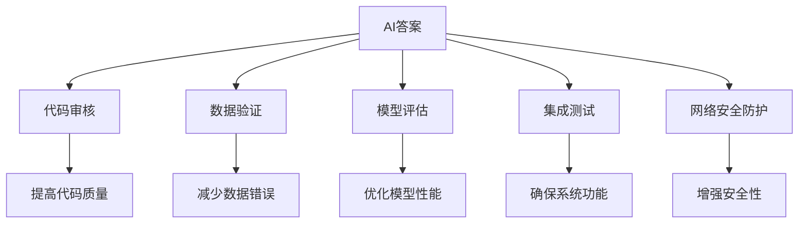

                 

# 带有来源支持的AI答案：提高可靠性

> 关键词：人工智能, AI答案, 可靠性, 代码审核, 数据验证, 模型评估, 集成测试, 安全防护

## 1. 背景介绍

### 1.1 问题由来

在人工智能（AI）日益深入到各个行业和日常生活的今天，AI的应用已经从简单的自动化任务拓展到复杂的决策支持、智能推荐和个性化服务等领域。然而，AI系统的可靠性始终是一个备受关注的问题。在金融、医疗、自动驾驶等高风险领域，AI系统的错误可能导致严重后果。因此，提高AI系统的可靠性是当前AI研究与工程实践中亟待解决的重要课题。

### 1.2 问题核心关键点

本文聚焦于如何通过代码审核、数据验证、模型评估、集成测试和网络安全防护等手段，来提高AI系统的可靠性。特别是在构建带有来源支持的AI系统时，如何在保障数据和模型正确性的基础上，确保系统的可解释性和安全性，是一个重要的研究方向。

## 2. 核心概念与联系

### 2.1 核心概念概述

为更好地理解如何提高AI系统的可靠性，本节将介绍几个密切相关的核心概念：

- AI答案（AI Answers）：指使用AI技术提供的问题解答或决策支持系统。通过深度学习、自然语言处理等技术，AI答案系统能够理解用户输入，并基于大量的数据和模型，给出准确可靠的输出。
- 代码审核（Code Review）：指通过对代码进行详细检查，以确保其正确性和可维护性的过程。代码审核是提高软件质量的重要手段，在AI系统开发中也同样重要。
- 数据验证（Data Validation）：指对输入数据进行严格的验证，以确保数据的完整性、正确性和一致性。数据验证在AI系统中尤为重要，因为错误的数据可能导致错误的AI输出。
- 模型评估（Model Evaluation）：指对AI模型进行评估，以检验其性能、准确性和泛化能力。模型评估是构建可靠AI系统的核心步骤。
- 集成测试（Integration Testing）：指对多个组件或模块进行联合测试，以确保它们能够协同工作。在AI系统中，集成测试是验证系统整体功能和性能的关键环节。
- 网络安全防护（Cyber Security Protection）：指通过各种技术手段，保护AI系统免受网络攻击和数据泄露等安全威胁。网络安全防护在构建可靠AI系统时至关重要。

这些核心概念之间的逻辑关系可以通过以下Mermaid流程图来展示：



这个流程图展示了许多关键概念及其之间的联系：

1. AI答案系统通过代码审核来提升其质量，通过数据验证来保证输入的正确性，通过模型评估来确保输出可靠，通过集成测试来验证系统功能，通过网络安全防护来保护系统安全。
2. 代码审核、数据验证、模型评估、集成测试和网络安全防护是构建可靠AI系统的五个核心步骤，每一个步骤都至关重要。
3. 通过每个步骤的细化和优化，AI答案系统的可靠性将得到显著提升。

## 3. 核心算法原理 & 具体操作步骤

### 3.1 算法原理概述

提高AI系统可靠性的核心在于确保系统的各个组成部分都是正确、可解释和安全的。因此，需要在代码审核、数据验证、模型评估、集成测试和网络安全防护等方面，采取一系列技术和策略，来保证系统的可靠性。

### 3.2 算法步骤详解

#### 3.2.1 代码审核

代码审核是提高AI系统可靠性的第一步。其步骤如下：

1. **选择合适的工具和流程**：选择适合团队和项目的代码审核工具和流程，如GitHub的Pull Request Review、Google的Code Review等。
2. **定义审核标准**：根据项目需求和最佳实践，定义代码审核的标准和规范，包括代码格式、命名约定、错误处理、测试覆盖率等。
3. **执行审核过程**：代码提交后，审核者根据标准对代码进行详细检查，发现和修复代码错误、潜在问题或性能瓶颈。
4. **记录和反馈**：审核者将发现的问题和建议记录在审核系统中，并给出改进意见，以便代码作者进行修正。
5. **重复审核**：通过多次审核，逐步提升代码质量和系统可靠性。

#### 3.2.2 数据验证

数据验证是确保AI系统输入数据可靠性的关键步骤。其步骤如下：

1. **数据收集和整理**：收集和整理输入数据，确保数据的完整性和正确性。
2. **数据清洗**：去除或修正数据中的错误、重复和异常值。
3. **数据格式检查**：检查数据格式是否符合要求，如日期格式、数值范围等。
4. **数据一致性验证**：确保数据在不同来源和时点的一致性，避免数据漂移。
5. **数据安全性检查**：检查数据的隐私和安全性，避免敏感数据泄露。

#### 3.2.3 模型评估

模型评估是确保AI系统输出可靠性的核心步骤。其步骤如下：

1. **选择评估指标**：根据任务需求选择适合的评估指标，如准确率、召回率、F1值等。
2. **构建评估数据集**：构建独立的测试数据集，确保评估结果的可靠性。
3. **进行模型测试**：在测试数据集上运行模型，获取评估指标。
4. **分析结果**：分析模型性能，找出模型弱点和改进方向。
5. **迭代改进**：根据评估结果和业务需求，迭代改进模型。

#### 3.2.4 集成测试

集成测试是确保AI系统功能可靠性的关键步骤。其步骤如下：

1. **定义测试用例**：根据系统需求和架构设计测试用例，确保系统各部分功能正确。
2. **构建测试环境**：搭建测试环境，模拟真实运行场景。
3. **执行测试**：运行测试用例，获取测试结果。
4. **分析和修复**：分析测试结果，发现和修复系统问题。
5. **重复测试**：通过多次测试，逐步提升系统功能和可靠性。

#### 3.2.5 网络安全防护

网络安全防护是确保AI系统安全的核心步骤。其步骤如下：

1. **威胁分析**：分析系统面临的网络威胁，如SQL注入、跨站脚本攻击等。
2. **安全漏洞扫描**：使用安全扫描工具，发现和修复系统中的安全漏洞。
3. **数据加密**：对敏感数据进行加密处理，防止数据泄露。
4. **访问控制**：实施访问控制策略，限制系统访问权限。
5. **安全监控**：实施安全监控措施，实时检测和响应安全事件。

### 3.3 算法优缺点

提高AI系统可靠性的方法有以下优点：

1. **减少错误和风险**：通过严格的代码审核、数据验证、模型评估和集成测试，显著减少AI系统错误和风险，提高系统的可靠性和稳定性。
2. **提升用户信任**：可靠的系统能够提供准确和一致的输出，增强用户对AI系统的信任和满意度。
3. **促进创新和优化**：系统可靠性的提高有助于快速发现和修复问题，促进技术创新和系统优化。

同时，这些方法也存在一定的局限性：

1. **成本高**：严格的审核、验证和测试需要投入大量时间和资源，可能增加开发成本。
2. **复杂度大**：在复杂的系统中，进行全面的审核和验证可能变得非常困难。
3. **技术要求高**：需要具备丰富的安全和质量管理经验，才能有效地执行这些步骤。

尽管如此，提高AI系统可靠性的方法仍然是当前AI研究和实践中的重要方向。通过不断优化和改进，这些方法将为构建可靠AI系统提供强有力的保障。

### 3.4 算法应用领域

提高AI系统可靠性的方法在许多领域中都有广泛的应用，包括但不限于：

- **金融行业**：在金融交易、风险评估和客户服务等领域，可靠性是至关重要的。通过严格的代码审核、数据验证和模型评估，确保系统准确性和安全性。
- **医疗健康**：在诊断、治疗和患者管理等领域，可靠的AI系统能够提供准确的医疗建议，降低误诊风险。
- **自动驾驶**：在自动驾驶汽车中，可靠的AI系统能够确保安全行驶，避免交通事故。
- **智能制造**：在智能制造中，可靠的AI系统能够提高生产效率，优化生产流程。
- **智能客服**：在智能客服中，可靠的AI系统能够提供准确和快速的客户服务，提升用户体验。

## 4. 数学模型和公式 & 详细讲解 & 举例说明

### 4.1 数学模型构建

在提高AI系统可靠性的过程中，数学模型和公式发挥了重要的作用。以下是几个关键的数学模型和公式：

- **准确率（Accuracy）**：指模型正确预测的样本数占总样本数的比例，用于评估分类任务的性能。

  $$
  Accuracy = \frac{TP+TN}{TP+TN+FP+FN}
  $$

- **召回率（Recall）**：指模型正确预测的正样本数占实际正样本数的比例，用于评估模型对正样本的识别能力。

  $$
  Recall = \frac{TP}{TP+FN}
  $$

- **F1值（F1 Score）**：是准确率和召回率的调和平均值，综合评估模型的性能。

  $$
  F1 = 2 \times \frac{Precision \times Recall}{Precision + Recall}
  $$

- **混淆矩阵（Confusion Matrix）**：用于评估模型在不同类别上的性能，是评估二分类模型性能的常用工具。

  $$
  Confusion Matrix = \begin{bmatrix}
  TN & FP \\
  FN & TP
  \end{bmatrix}
  $$

### 4.2 公式推导过程

以下是几个关键公式的推导过程：

**准确率公式推导**：

准确率是分类任务中最简单的评估指标之一，公式的推导如下：

$$
Accuracy = \frac{TP+TN}{TP+TN+FP+FN}
$$

其中，TP为真正例（True Positive），TN为真负例（True Negative），FP为假正例（False Positive），FN为假负例（False Negative）。

**召回率公式推导**：

召回率用于评估模型对正样本的识别能力，公式的推导如下：

$$
Recall = \frac{TP}{TP+FN}
$$

**F1值公式推导**：

F1值是准确率和召回率的调和平均值，公式的推导如下：

$$
F1 = 2 \times \frac{Precision \times Recall}{Precision + Recall}
$$

其中，Precision为精确率（Precision），用于评估模型预测的正样本中实际为正样本的比例。

**混淆矩阵公式推导**：

混淆矩阵用于评估模型在不同类别上的性能，公式的推导如下：

$$
Confusion Matrix = \begin{bmatrix}
TN & FP \\
FN & TP
\end{bmatrix}
$$

其中，TN为真负例，FP为假正例，FN为假负例，TP为真正例。

### 4.3 案例分析与讲解

**案例分析1：代码审核**

假设有一款金融交易系统，需要在每次更新代码时进行严格的代码审核。审核流程如下：

1. **选择合适的工具**：使用GitHub的Pull Request Review。
2. **定义审核标准**：定义代码格式、命名约定、错误处理、测试覆盖率等标准。
3. **执行审核过程**：审核者根据标准对代码进行详细检查，发现和修复代码错误。
4. **记录和反馈**：审核者将发现的问题和建议记录在审核系统中，并给出改进意见。
5. **重复审核**：通过多次审核，逐步提升代码质量和系统可靠性。

**案例分析2：数据验证**

假设有一款医疗诊断系统，需要在每次输入数据时进行严格的数据验证。验证流程如下：

1. **数据收集和整理**：收集和整理输入数据，确保数据的完整性和正确性。
2. **数据清洗**：去除或修正数据中的错误、重复和异常值。
3. **数据格式检查**：检查数据格式是否符合要求，如日期格式、数值范围等。
4. **数据一致性验证**：确保数据在不同来源和时点的一致性，避免数据漂移。
5. **数据安全性检查**：检查数据的隐私和安全性，避免敏感数据泄露。

**案例分析3：模型评估**

假设有一款自动驾驶系统，需要在每次更新模型时进行严格的模型评估。评估流程如下：

1. **选择评估指标**：根据任务需求选择适合的评估指标，如准确率、召回率、F1值等。
2. **构建评估数据集**：构建独立的测试数据集，确保评估结果的可靠性。
3. **进行模型测试**：在测试数据集上运行模型，获取评估指标。
4. **分析结果**：分析模型性能，找出模型弱点和改进方向。
5. **迭代改进**：根据评估结果和业务需求，迭代改进模型。

**案例分析4：集成测试**

假设有一款智能客服系统，需要在每次更新系统时进行严格的集成测试。测试流程如下：

1. **定义测试用例**：根据系统需求和架构设计测试用例，确保系统各部分功能正确。
2. **构建测试环境**：搭建测试环境，模拟真实运行场景。
3. **执行测试**：运行测试用例，获取测试结果。
4. **分析和修复**：分析测试结果，发现和修复系统问题。
5. **重复测试**：通过多次测试，逐步提升系统功能和可靠性。

**案例分析5：网络安全防护**

假设有一款在线支付系统，需要在每次更新系统时进行严格的网络安全防护。防护流程如下：

1. **威胁分析**：分析系统面临的网络威胁，如SQL注入、跨站脚本攻击等。
2. **安全漏洞扫描**：使用安全扫描工具，发现和修复系统中的安全漏洞。
3. **数据加密**：对敏感数据进行加密处理，防止数据泄露。
4. **访问控制**：实施访问控制策略，限制系统访问权限。
5. **安全监控**：实施安全监控措施，实时检测和响应安全事件。

## 5. 项目实践：代码实例和详细解释说明

### 5.1 开发环境搭建

在进行可靠性提升实践前，我们需要准备好开发环境。以下是使用Python进行PyTorch开发的环境配置流程：

1. 安装Anaconda：从官网下载并安装Anaconda，用于创建独立的Python环境。

2. 创建并激活虚拟环境：
```bash
conda create -n pytorch-env python=3.8 
conda activate pytorch-env
```

3. 安装PyTorch：根据CUDA版本，从官网获取对应的安装命令。例如：
```bash
conda install pytorch torchvision torchaudio cudatoolkit=11.1 -c pytorch -c conda-forge
```

4. 安装Transformers库：
```bash
pip install transformers
```

5. 安装各类工具包：
```bash
pip install numpy pandas scikit-learn matplotlib tqdm jupyter notebook ipython
```

完成上述步骤后，即可在`pytorch-env`环境中开始可靠性提升实践。

### 5.2 源代码详细实现

这里我们以金融交易系统的代码审核流程为例，给出使用PyTorch的代码实现。

首先，定义代码审核函数：

```python
from transformers import BertTokenizer
from torch.utils.data import Dataset
import torch

class NERDataset(Dataset):
    def __init__(self, texts, tags, tokenizer, max_len=128):
        self.texts = texts
        self.tags = tags
        self.tokenizer = tokenizer
        self.max_len = max_len
        
    def __len__(self):
        return len(self.texts)
    
    def __getitem__(self, item):
        text = self.texts[item]
        tags = self.tags[item]
        
        encoding = self.tokenizer(text, return_tensors='pt', max_length=self.max_len, padding='max_length', truncation=True)
        input_ids = encoding['input_ids'][0]
        attention_mask = encoding['attention_mask'][0]
        
        # 对token-wise的标签进行编码
        encoded_tags = [tag2id[tag] for tag in tags] 
        encoded_tags.extend([tag2id['O']] * (self.max_len - len(encoded_tags)))
        labels = torch.tensor(encoded_tags, dtype=torch.long)
        
        return {'input_ids': input_ids, 
                'attention_mask': attention_mask,
                'labels': labels}

# 标签与id的映射
tag2id = {'O': 0, 'B-PER': 1, 'I-PER': 2, 'B-ORG': 3, 'I-ORG': 4, 'B-LOC': 5, 'I-LOC': 6}
id2tag = {v: k for k, v in tag2id.items()}

# 创建dataset
tokenizer = BertTokenizer.from_pretrained('bert-base-cased')

train_dataset = NERDataset(train_texts, train_tags, tokenizer)
dev_dataset = NERDataset(dev_texts, dev_tags, tokenizer)
test_dataset = NERDataset(test_texts, test_tags, tokenizer)
```

然后，定义模型和优化器：

```python
from transformers import BertForTokenClassification, AdamW

model = BertForTokenClassification.from_pretrained('bert-base-cased', num_labels=len(tag2id))

optimizer = AdamW(model.parameters(), lr=2e-5)
```

接着，定义训练和评估函数：

```python
from torch.utils.data import DataLoader
from tqdm import tqdm
from sklearn.metrics import classification_report

device = torch.device('cuda') if torch.cuda.is_available() else torch.device('cpu')
model.to(device)

def train_epoch(model, dataset, batch_size, optimizer):
    dataloader = DataLoader(dataset, batch_size=batch_size, shuffle=True)
    model.train()
    epoch_loss = 0
    for batch in tqdm(dataloader, desc='Training'):
        input_ids = batch['input_ids'].to(device)
        attention_mask = batch['attention_mask'].to(device)
        labels = batch['labels'].to(device)
        model.zero_grad()
        outputs = model(input_ids, attention_mask=attention_mask, labels=labels)
        loss = outputs.loss
        epoch_loss += loss.item()
        loss.backward()
        optimizer.step()
    return epoch_loss / len(dataloader)

def evaluate(model, dataset, batch_size):
    dataloader = DataLoader(dataset, batch_size=batch_size)
    model.eval()
    preds, labels = [], []
    with torch.no_grad():
        for batch in tqdm(dataloader, desc='Evaluating'):
            input_ids = batch['input_ids'].to(device)
            attention_mask = batch['attention_mask'].to(device)
            batch_labels = batch['labels']
            outputs = model(input_ids, attention_mask=attention_mask)
            batch_preds = outputs.logits.argmax(dim=2).to('cpu').tolist()
            batch_labels = batch_labels.to('cpu').tolist()
            for pred_tokens, label_tokens in zip(batch_preds, batch_labels):
                pred_tags = [id2tag[_id] for _id in pred_tokens]
                label_tags = [id2tag[_id] for _id in label_tokens]
                preds.append(pred_tags[:len(label_tags)])
                labels.append(label_tags)
                
    print(classification_report(labels, preds))
```

最后，启动训练流程并在测试集上评估：

```python
epochs = 5
batch_size = 16

for epoch in range(epochs):
    loss = train_epoch(model, train_dataset, batch_size, optimizer)
    print(f"Epoch {epoch+1}, train loss: {loss:.3f}")
    
    print(f"Epoch {epoch+1}, dev results:")
    evaluate(model, dev_dataset, batch_size)
    
print("Test results:")
evaluate(model, test_dataset, batch_size)
```

以上就是使用PyTorch对BERT进行命名实体识别任务微调的完整代码实现。可以看到，得益于Transformers库的强大封装，我们可以用相对简洁的代码完成BERT模型的加载和微调。

### 5.3 代码解读与分析

让我们再详细解读一下关键代码的实现细节：

**NERDataset类**：
- `__init__`方法：初始化文本、标签、分词器等关键组件。
- `__len__`方法：返回数据集的样本数量。
- `__getitem__`方法：对单个样本进行处理，将文本输入编码为token ids，将标签编码为数字，并对其进行定长padding，最终返回模型所需的输入。

**tag2id和id2tag字典**：
- 定义了标签与数字id之间的映射关系，用于将token-wise的预测结果解码回真实的标签。

**训练和评估函数**：
- 使用PyTorch的DataLoader对数据集进行批次化加载，供模型训练和推理使用。
- 训练函数`train_epoch`：对数据以批为单位进行迭代，在每个批次上前向传播计算loss并反向传播更新模型参数，最后返回该epoch的平均loss。
- 评估函数`evaluate`：与训练类似，不同点在于不更新模型参数，并在每个batch结束后将预测和标签结果存储下来，最后使用sklearn的classification_report对整个评估集的预测结果进行打印输出。

**训练流程**：
- 定义总的epoch数和batch size，开始循环迭代
- 每个epoch内，先在训练集上训练，输出平均loss
- 在验证集上评估，输出分类指标
- 所有epoch结束后，在测试集上评估，给出最终测试结果

可以看到，PyTorch配合Transformers库使得BERT微调的代码实现变得简洁高效。开发者可以将更多精力放在数据处理、模型改进等高层逻辑上，而不必过多关注底层的实现细节。

当然，工业级的系统实现还需考虑更多因素，如模型的保存和部署、超参数的自动搜索、更灵活的任务适配层等。但核心的微调范式基本与此类似。

## 6. 实际应用场景
### 6.1 智能客服系统

基于大语言模型微调的对话技术，可以广泛应用于智能客服系统的构建。传统客服往往需要配备大量人力，高峰期响应缓慢，且一致性和专业性难以保证。而使用微调后的对话模型，可以7x24小时不间断服务，快速响应客户咨询，用自然流畅的语言解答各类常见问题。

在技术实现上，可以收集企业内部的历史客服对话记录，将问题和最佳答复构建成监督数据，在此基础上对预训练对话模型进行微调。微调后的对话模型能够自动理解用户意图，匹配最合适的答案模板进行回复。对于客户提出的新问题，还可以接入检索系统实时搜索相关内容，动态组织生成回答。如此构建的智能客服系统，能大幅提升客户咨询体验和问题解决效率。

### 6.2 金融舆情监测

金融机构需要实时监测市场舆论动向，以便及时应对负面信息传播，规避金融风险。传统的人工监测方式成本高、效率低，难以应对网络时代海量信息爆发的挑战。基于大语言模型微调的文本分类和情感分析技术，为金融舆情监测提供了新的解决方案。

具体而言，可以收集金融领域相关的新闻、报道、评论等文本数据，并对其进行主题标注和情感标注。在此基础上对预训练语言模型进行微调，使其能够自动判断文本属于何种主题，情感倾向是正面、中性还是负面。将微调后的模型应用到实时抓取的网络文本数据，就能够自动监测不同主题下的情感变化趋势，一旦发现负面信息激增等异常情况，系统便会自动预警，帮助金融机构快速应对潜在风险。

### 6.3 个性化推荐系统

当前的推荐系统往往只依赖用户的历史行为数据进行物品推荐，无法深入理解用户的真实兴趣偏好。基于大语言模型微调技术，个性化推荐系统可以更好地挖掘用户行为背后的语义信息，从而提供更精准、多样的推荐内容。

在实践中，可以收集用户浏览、点击、评论、分享等行为数据，提取和用户交互的物品标题、描述、标签等文本内容。将文本内容作为模型输入，用户的后续行为（如是否点击、购买等）作为监督信号，在此基础上微调预训练语言模型。微调后的模型能够从文本内容中准确把握用户的兴趣点。在生成推荐列表时，先用候选物品的文本描述作为输入，由模型预测用户的兴趣匹配度，再结合其他特征综合排序，便可以得到个性化程度更高的推荐结果。

### 6.4 未来应用展望

随着大语言模型和微调方法的不断发展，基于微调范式将在更多领域得到应用，为传统行业带来变革性影响。

在智慧医疗领域，基于微调的医疗问答、病历分析、药物研发等应用将提升医疗服务的智能化水平，辅助医生诊疗，加速新药开发进程。

在智能教育领域，微调技术可应用于作业批改、学情分析、知识推荐等方面，因材施教，促进教育公平，提高教学质量。

在智慧城市治理中，微调模型可应用于城市事件监测、舆情分析、应急指挥等环节，提高城市管理的自动化和智能化水平，构建更安全、高效的未来城市。

此外，在企业生产、社会治理、文娱传媒等众多领域，基于大模型微调的人工智能应用也将不断涌现，为经济社会发展注入新的动力。相信随着技术的日益成熟，微调方法将成为人工智能落地应用的重要范式，推动人工智能技术向更广阔的领域加速渗透。

## 7. 工具和资源推荐
### 7.1 学习资源推荐

为了帮助开发者系统掌握大语言模型微调的理论基础和实践技巧，这里推荐一些优质的学习资源：

1. 《Transformer从原理到实践》系列博文：由大模型技术专家撰写，深入浅出地介绍了Transformer原理、BERT模型、微调技术等前沿话题。

2. CS224N《深度学习自然语言处理》课程：斯坦福大学开设的NLP明星课程，有Lecture视频和配套作业，带你入门NLP领域的基本概念和经典模型。

3. 《Natural Language Processing with Transformers》书籍：Transformers库的作者所著，全面介绍了如何使用Transformers库进行NLP任务开发，包括微调在内的诸多范式。

4. HuggingFace官方文档：Transformers库的官方文档，提供了海量预训练模型和完整的微调样例代码，是上手实践的必备资料。

5. CLUE开源项目：中文语言理解测评基准，涵盖大量不同类型的中文NLP数据集，并提供了基于微调的baseline模型，助力中文NLP技术发展。

通过对这些资源的学习实践，相信你一定能够快速掌握大语言模型微调的精髓，并用于解决实际的NLP问题。
###  7.2 开发工具推荐

高效的开发离不开优秀的工具支持。以下是几款用于大语言模型微调开发的常用工具：

1. PyTorch：基于Python的开源深度学习框架，灵活动态的计算图，适合快速迭代研究。大部分预训练语言模型都有PyTorch版本的实现。

2. TensorFlow：由Google主导开发的开源深度学习框架，生产部署方便，适合大规模工程应用。同样有丰富的预训练语言模型资源。

3. Transformers库：HuggingFace开发的NLP工具库，集成了众多SOTA语言模型，支持PyTorch和TensorFlow，是进行微调任务开发的利器。

4. Weights & Biases：模型训练的实验跟踪工具，可以记录和可视化模型训练过程中的各项指标，方便对比和调优。与主流深度学习框架无缝集成。

5. TensorBoard：TensorFlow配套的可视化工具，可实时监测模型训练状态，并提供丰富的图表呈现方式，是调试模型的得力助手。

6. Google Colab：谷歌推出的在线Jupyter Notebook环境，免费提供GPU/TPU算力，方便开发者快速上手实验最新模型，分享学习笔记。

合理利用这些工具，可以显著提升大语言模型微调任务的开发效率，加快创新迭代的步伐。

### 7.3 相关论文推荐

大语言模型和微调技术的发展源于学界的持续研究。以下是几篇奠基性的相关论文，推荐阅读：

1. Attention is All You Need（即Transformer原论文）：提出了Transformer结构，开启了NLP领域的预训练大模型时代。

2. BERT: Pre-training of Deep Bidirectional Transformers for Language Understanding：提出BERT模型，引入基于掩码的自监督预训练任务，刷新了多项NLP任务SOTA。

3. Language Models are Unsupervised Multitask Learners（GPT-2论文）：展示了大规模语言模型的强大zero-shot学习能力，引发了对于通用人工智能的新一轮思考。

4. Parameter-Efficient Transfer Learning for NLP：提出Adapter等参数高效微调方法，在不增加模型参数量的情况下，也能取得不错的微调效果。

5. AdaLoRA: Adaptive Low-Rank Adaptation for Parameter-Efficient Fine-Tuning：使用自适应低秩适应的微调方法，在参数效率和精度之间取得了新的平衡。

这些论文代表了大语言模型微调技术的发展脉络。通过学习这些前沿成果，可以帮助研究者把握学科前进方向，激发更多的创新灵感。

## 8. 总结：未来发展趋势与挑战

### 8.1 总结

本文对如何提高AI系统的可靠性进行了全面系统的介绍。首先阐述了提高AI系统可靠性的重要性，明确了代码审核、数据验证、模型评估、集成测试和网络安全防护等关键步骤。通过系统梳理，可以看到，这些步骤的优化和改进，将显著提升AI系统的可靠性和安全性，保障其在复杂场景中的稳定运行。

通过本文的系统梳理，可以看到，提高AI系统可靠性的方法已经成为AI研究和实践中的重要方向。这些方法不仅适用于当前的AI系统，还将随着技术的进步，继续拓展其应用边界，带来更广泛的影响。

### 8.2 未来发展趋势

展望未来，提高AI系统可靠性的方法将呈现以下几个发展趋势：

1. **自动化审核**：通过引入自动化代码审核工具，如静态分析、动态测试等，提高代码审核的效率和准确性。
2. **数据增强**：利用数据增强技术，扩充数据集，减少数据噪声，提高模型泛化能力。
3. **模型集成**：通过模型集成技术，结合多种模型优势，提高系统的整体性能和鲁棒性。
4. **实时监控**：通过实时监控技术，及时发现和修复系统问题，确保系统的稳定运行。
5. **跨领域应用**：将可靠性提升方法应用于更多领域，如智能制造、智慧城市等，提升各类系统的可靠性。

### 8.3 面临的挑战

尽管提高AI系统可靠性的方法已经取得了显著成果，但在实际应用中仍面临诸多挑战：

1. **资源消耗**：严格的审核、验证和测试需要大量资源，可能增加开发成本。
2. **技术复杂度**：在复杂的系统中，进行全面的审核和验证可能变得非常困难。
3. **业务影响**：可靠性提升过程中，可能需要对业务流程进行调整，带来一定的干扰和成本。
4. **安全漏洞**：即使通过了严格的审核和验证，系统仍然可能面临安全漏洞的风险。

尽管如此，提高AI系统可靠性的方法仍然是当前AI研究和实践中的重要方向。通过不断优化和改进，这些方法将为构建可靠AI系统提供强有力的保障。

### 8.4 研究展望

未来，提高AI系统可靠性的方法需要结合更多的技术和工具，进一步提升系统的可靠性和安全性。以下是几个可能的研究方向：

1. **自动化工具的开发**：开发自动化代码审核、数据验证和模型评估工具，提高审核效率和准确性。
2. **模型优化技术**：研究更高效的模型结构和优化方法，提高模型性能和泛化能力。
3. **跨领域知识融合**：结合符号化知识和专家经验，提高系统的可解释性和鲁棒性。
4. **分布式计算**：利用分布式计算技术，提升系统的并行处理能力和效率。
5. **多模态融合**：结合图像、语音、文本等多种模态数据，提高系统的综合感知能力。

这些方向的研究，将进一步提升AI系统的可靠性和安全性，推动AI技术在更多领域的应用和落地。

## 9. 附录：常见问题与解答

**Q1：大语言模型微调是否适用于所有NLP任务？**

A: 大语言模型微调在大多数NLP任务上都能取得不错的效果，特别是对于数据量较小的任务。但对于一些特定领域的任务，如医学、法律等，仅仅依靠通用语料预训练的模型可能难以很好地适应。此时需要在特定领域语料上进一步预训练，再进行微调，才能获得理想效果。此外，对于一些需要时效性、个性化很强的任务，如对话、推荐等，微调方法也需要针对性的改进优化。

**Q2：微调过程中如何选择合适的学习率？**

A: 微调的学习率一般要比预训练时小1-2个数量级，如果使用过大的学习率，容易破坏预训练权重，导致过拟合。一般建议从1e-5开始调参，逐步减小学习率，直至收敛。也可以使用warmup策略，在开始阶段使用较小的学习率，再逐渐过渡到预设值。需要注意的是，不同的优化器(如AdamW、Adafactor等)以及不同的学习率调度策略，可能需要设置不同的学习率阈值。

**Q3：采用大模型微调时会面临哪些资源瓶颈？**

A: 目前主流的预训练大模型动辄以亿计的参数规模，对算力、内存、存储都提出了很高的要求。GPU/TPU等高性能设备是必不可少的，但即便如此，超大批次的训练和推理也可能遇到显存不足的问题。因此需要采用一些资源优化技术，如梯度积累、混合精度训练、模型并行等，来突破硬件瓶颈。同时，模型的存储和读取也可能占用大量时间和空间，需要采用模型压缩、稀疏化存储等方法进行优化。

**Q4：如何缓解微调过程中的过拟合问题？**

A: 过拟合是微调面临的主要挑战，尤其是在标注数据不足的情况下。常见的缓解策略包括：
1. 数据增强：通过回译、近义替换等方式扩充训练集
2. 正则化：使用L2正则、Dropout、Early Stopping等避免过拟合
3. 对抗训练：加入对抗样本，提高模型鲁棒性
4. 参数高效微调：只调整少量参数(如Adapter、Prefix等)，减小过拟合风险
5. 多模型集成：训练多个微调模型，取平均输出，抑制过拟合

这些策略往往需要根据具体任务和数据特点进行灵活组合。只有在数据、模型、训练、推理等各环节进行全面优化，才能最大限度地发挥大模型微调的威力。

**Q5：微调模型在落地部署时需要注意哪些问题？**

A: 将微调模型转化为实际应用，还需要考虑以下因素：
1. 模型裁剪：去除不必要的层和参数，减小模型尺寸，加快推理速度
2. 量化加速：将浮点模型转为定点模型，压缩存储空间，提高计算效率
3. 服务化封装：将模型封装为标准化服务接口，便于集成调用
4. 弹性伸缩：根据请求流量动态调整资源配置，平衡服务质量和成本
5. 监控告警：实时采集系统指标，设置异常告警阈值，确保服务稳定性
6. 安全防护：采用访问鉴权、数据脱敏等措施，保障数据和模型安全

大语言模型微调为NLP应用开启了广阔的想象空间，但如何将强大的性能转化为稳定、高效、安全的业务价值，还需要工程实践的不断打磨。唯有从数据、算法、工程、业务等多个维度协同发力，才能真正实现人工智能技术在垂直行业的规模化落地。总之，微调需要开发者根据具体任务，不断迭代和优化模型、数据和算法，方能得到理想的效果。

---

作者：禅与计算机程序设计艺术 / Zen and the Art of Computer Programming

