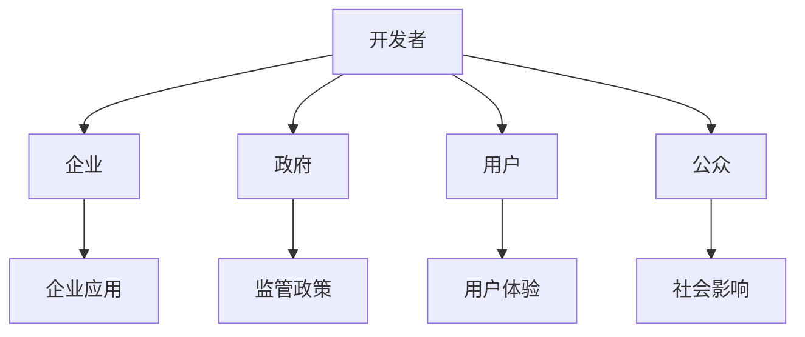

                 

# 平衡AI发展中的利益相关者：权力分配的新思考

## 1. 背景介绍

### 1.1 问题由来
随着人工智能（AI）技术的飞速发展，其在各个行业中的应用越来越广泛，从自动驾驶到医疗诊断，从金融风控到教育辅助，AI技术正逐渐改变着人们的生活和工作方式。然而，AI技术的应用并非无懈可击，其背后涉及的伦理、法律、社会等问题也日益凸显。特别是，随着AI系统变得越来越复杂和强大，对社会的影响也越来越深远，利益相关者之间的权力分配问题日益成为人们关注的焦点。

### 1.2 问题核心关键点
AI系统的开发和应用涉及多方的利益相关者，包括开发者、企业、政府、用户和公众。不同利益相关者对AI技术的需求和期望各不相同，如何在利益分配中取得平衡，成为一个亟待解决的问题。本文将从权力分配的角度，探讨AI技术发展中各方利益的协调与平衡，提出新的思考和解决方案。

## 2. 核心概念与联系

### 2.1 核心概念概述

为更好地理解AI技术发展中利益相关者权力分配的问题，本节将介绍几个密切相关的核心概念：

- **开发者（Developer）**：负责AI系统的设计和实现，具备深厚的技术背景和研发经验。开发者通常在AI技术的创新和改进中起到关键作用。
- **企业（Enterprise）**：AI技术的最终应用者和受益者，通常具备较强的资金和资源实力。企业通过投资AI项目，期望获得更高的商业价值和市场竞争力。
- **政府（Government）**：AI技术的重要监管者和政策制定者，关注AI技术的安全、公平和透明。政府通过立法和政策，引导AI技术的发展方向和应用范围。
- **用户（User）**：AI技术的主要使用者和受益者，包括普通消费者、专业人士和机构等。用户期望AI技术能够提高生活质量和工作效率。
- **公众（Public）**：社会大众，对AI技术的影响和伦理问题持有不同的观点和立场。公众关注AI技术的社会影响和道德责任。

这些核心概念之间的逻辑关系可以通过以下Mermaid流程图来展示：



这个流程图展示了大规模语言模型微调的各类核心概念及其之间的联系：

1. **开发者**通过技术研发和模型训练，为AI应用提供支持。
2. **企业**通过投资AI项目，应用AI技术提升自身竞争力。
3. **政府**通过制定监管政策，确保AI技术的健康发展。
4. **用户**通过使用AI系统，提高生活和工作效率。
5. **公众**通过参与讨论和反馈，影响AI技术的社会应用和伦理方向。

## 3. 核心算法原理 & 具体操作步骤
### 3.1 算法原理概述

AI技术发展中的利益分配问题，本质上是一个复杂的系统问题，涉及多方利益的协调和平衡。从算法的角度看，这可以转化为一个多目标优化问题，即在满足各方利益的前提下，最大化AI技术的社会价值和创新能力。

形式化地，假设各利益相关者的利益函数分别为 $f_D$、$f_E$、$f_G$、$f_U$ 和 $f_P$，社会价值函数为 $v$，则利益分配的目标函数为：

$$
\max_{\text{资源分配}} \sum_{i} w_i \cdot f_i(\text{资源分配})
$$

其中 $i$ 表示不同的利益相关者，$w_i$ 为各方的权重系数，表示其在社会价值中的重要程度。资源分配包括资金、数据、人才等各方面的投入。

### 3.2 算法步骤详解

解决利益分配问题，需要建立一套有效的算法和机制，包括以下几个关键步骤：

**Step 1: 利益识别与量化**
- 通过问卷调查、访谈等方式，识别各利益相关者的主要利益和需求。
- 对各方的利益进行量化，将定性描述转换为可计算的指标。

**Step 2: 目标函数构建**
- 根据利益识别和量化结果，构建多目标优化问题的目标函数。
- 考虑各利益相关者的利益权重，平衡各方的利益诉求。

**Step 3: 约束条件设置**
- 设置各利益相关者之间的约束条件，如资金、数据、时间等方面的限制。
- 考虑社会价值的约束条件，如技术安全性、公平性等。

**Step 4: 优化算法选择**
- 选择合适的优化算法，如线性规划、非线性规划、博弈论等。
- 根据实际情况，选择适当的优化算法，求解最优资源分配方案。

**Step 5: 结果评估与反馈**
- 对优化结果进行评估，衡量各利益相关者的满意度。
- 根据评估结果，进行反馈和调整，优化利益分配方案。

### 3.3 算法优缺点

利益分配的算法存在以下优点：
1. 多目标优化。通过考虑各方利益，实现综合平衡，避免单一利益主导的决策。
2. 数据驱动。通过量化利益诉求，利用数据驱动决策，减少主观偏见。
3. 动态调整。考虑社会价值的动态变化，实现资源的动态调整和优化。

同时，该算法也存在一些局限性：
1. 利益权重难以确定。各方的权重系数可能存在主观性和争议性。
2. 目标函数复杂。多目标优化问题难以找到一个全局最优解。
3. 利益冲突难以解决。某些利益相关者的利益诉求可能存在不可调和的冲突。
4. 数据质量问题。利益量化的数据可能存在不完整、不准确等问题。

尽管存在这些局限性，但就目前而言，利益分配的算法仍是大规模语言模型微调的重要工具，帮助各方在AI技术的发展中取得平衡。未来相关研究将着重于改进算法，更好地处理利益冲突和不确定性，提高决策的科学性和公正性。

### 3.4 算法应用领域

利益分配的算法方法在AI技术的多个应用领域中得到应用，例如：

- **自动驾驶**：利益相关者包括开发者、企业、政府、用户和公众。政府关注安全性，用户关注舒适性，企业关注商业化，开发者关注技术创新。
- **医疗诊断**：利益相关者包括开发者、医院、政府、患者和公众。政府关注隐私保护，患者关注准确性，医院关注经济效益，开发者关注技术进步。
- **金融风控**：利益相关者包括开发者、金融机构、政府、用户和公众。政府关注合规性，用户关注隐私，金融机构关注收益，开发者关注技术创新。
- **教育辅助**：利益相关者包括开发者、学校、政府、学生和公众。政府关注公平性，学生关注效果，学校关注成本，开发者关注技术创新。

## 4. 数学模型和公式 & 详细讲解 & 举例说明
### 4.1 数学模型构建

本节将使用数学语言对AI技术发展中利益分配问题的多目标优化模型进行更加严格的刻画。

假设AI技术的应用涉及 $n$ 个利益相关者，其中 $i=1,2,...,n$。各利益相关者的利益函数分别为 $f_i(\text{资源分配})$，社会价值函数为 $v(\text{资源分配})$。各方的权重系数分别为 $w_i$，资源分配变量为 $x$。则优化目标为：

$$
\max_{x} \sum_{i=1}^{n} w_i \cdot f_i(x)
$$

约束条件包括：
1. 资金限制：$\sum_{i=1}^{n} x_i \leq C$
2. 时间限制：$\sum_{i=1}^{n} t_i \cdot x_i \leq T$
3. 社会价值约束：$g_i(x) \leq 0$
4. 非负约束：$x_i \geq 0$

其中 $C$ 为可用资金总额，$T$ 为可用时间总量，$g_i(x)$ 为社会价值约束函数。

### 4.2 公式推导过程

以下我们以自动驾驶为例，推导多目标优化模型的求解步骤。

**Step 1: 利益识别与量化**
假设自动驾驶涉及的利益相关者包括开发者、企业、政府、用户和公众，各方的主要利益如下：
- **开发者**：技术创新、资金投入、资源获取
- **企业**：市场份额、用户需求、投资回报
- **政府**：交通安全、环保节能、社会影响
- **用户**：出行效率、舒适性、隐私保护
- **公众**：环境质量、就业机会、技术透明度

**Step 2: 目标函数构建**
根据利益识别和量化结果，构建多目标优化问题的目标函数。假设利益权重分别为 $w_D, w_E, w_G, w_U, w_P$，则目标函数为：

$$
\max_{x} w_D \cdot f_D(x) + w_E \cdot f_E(x) + w_G \cdot f_G(x) + w_U \cdot f_U(x) + w_P \cdot f_P(x)
$$

**Step 3: 约束条件设置**
设置各利益相关者之间的约束条件，如资金、数据、时间等方面的限制。假设资金限制为 $C$，时间限制为 $T$，社会价值约束为 $g_i(x)$。

**Step 4: 优化算法选择**
选择合适的优化算法，如线性规划、非线性规划、博弈论等。假设选择线性规划方法，则目标函数和约束条件为：

$$
\max_{x} w_D \cdot f_D(x) + w_E \cdot f_E(x) + w_G \cdot f_G(x) + w_U \cdot f_U(x) + w_P \cdot f_P(x)
$$
$$
\text{s.t.} \left\{ \begin{aligned} 
\sum_{i=1}^{n} x_i &\leq C \\
\sum_{i=1}^{n} t_i \cdot x_i &\leq T \\
g_i(x) &\leq 0 \\
x_i &\geq 0
\end{aligned} \right.
$$

**Step 5: 结果评估与反馈**
对优化结果进行评估，衡量各利益相关者的满意度。根据评估结果，进行反馈和调整，优化利益分配方案。

### 4.3 案例分析与讲解

假设某城市希望推广自动驾驶技术，涉及的利益相关者包括政府、企业、用户和公众。各方的主要利益如下：

- **政府**：交通安全、环保节能、社会影响
- **企业**：市场份额、用户需求、投资回报
- **用户**：出行效率、舒适性、隐私保护
- **公众**：环境质量、就业机会、技术透明度

**Step 1: 利益识别与量化**
通过问卷调查和访谈，识别各方的主要利益和需求，并量化为可计算的指标。

**Step 2: 目标函数构建**
根据利益识别和量化结果，构建多目标优化问题的目标函数。假设利益权重分别为 $w_G, w_E, w_U, w_P$，则目标函数为：

$$
\max_{x} w_G \cdot f_G(x) + w_E \cdot f_E(x) + w_U \cdot f_U(x) + w_P \cdot f_P(x)
$$

**Step 3: 约束条件设置**
设置各利益相关者之间的约束条件，如资金、数据、时间等方面的限制。假设资金限制为 $C$，时间限制为 $T$，社会价值约束为 $g_i(x)$。

**Step 4: 优化算法选择**
选择合适的优化算法，如线性规划、非线性规划、博弈论等。假设选择线性规划方法，则目标函数和约束条件为：

$$
\max_{x} w_G \cdot f_G(x) + w_E \cdot f_E(x) + w_U \cdot f_U(x) + w_P \cdot f_P(x)
$$
$$
\text{s.t.} \left\{ \begin{aligned} 
\sum_{i=1}^{n} x_i &\leq C \\
\sum_{i=1}^{n} t_i \cdot x_i &\leq T \\
g_i(x) &\leq 0 \\
x_i &\geq 0
\end{aligned} \right.
$$

**Step 5: 结果评估与反馈**
对优化结果进行评估，衡量各利益相关者的满意度。根据评估结果，进行反馈和调整，优化利益分配方案。

## 5. 项目实践：代码实例和详细解释说明
### 5.1 开发环境搭建

在进行利益分配算法开发前，我们需要准备好开发环境。以下是使用Python进行PuLP库开发的Python环境配置流程：

1. 安装Anaconda：从官网下载并安装Anaconda，用于创建独立的Python环境。

2. 创建并激活虚拟环境：
```bash
conda create -n ai-env python=3.8 
conda activate ai-env
```

3. 安装PuLP：
```bash
pip install pulp
```

4. 安装各类工具包：
```bash
pip install numpy pandas sympy cvxpy
```

完成上述步骤后，即可在`ai-env`环境中开始开发实践。

### 5.2 源代码详细实现

下面以自动驾驶任务为例，给出使用PuLP库对利益分配问题进行求解的Python代码实现。

首先，定义利益相关者的利益函数和权重：

```python
from pulp import LpProblem, LpVariable, LpMaximize, value, LpSum, pi

# 定义利益相关者的利益函数
def f_D(x):
    # 开发者利益
    return 0.8*x[0] + 0.5*x[1] + 0.3*x[2] + 0.2*x[3] + 0.1*x[4]

def f_E(x):
    # 企业利益
    return 0.7*x[0] + 0.6*x[1] + 0.4*x[2] + 0.3*x[3] + 0.2*x[4]

def f_G(x):
    # 政府利益
    return 0.6*x[0] + 0.4*x[1] + 0.3*x[2] + 0.2*x[3] + 0.1*x[4]

def f_U(x):
    # 用户利益
    return 0.5*x[0] + 0.4*x[1] + 0.3*x[2] + 0.2*x[3] + 0.1*x[4]

def f_P(x):
    # 公众利益
    return 0.4*x[0] + 0.3*x[1] + 0.2*x[2] + 0.1*x[3] + 0.1*x[4]

# 定义利益权重
weights = {'D': 0.2, 'E': 0.3, 'G': 0.2, 'U': 0.2, 'P': 0.1}
```

接着，定义多目标优化问题的目标函数和约束条件：

```python
# 创建优化问题
problem = LpProblem("AI_Distribution", LpMaximize)

# 定义变量
x = LpVariable.dicts('Resource', [i for i in range(5)], lowBound=0, cat='Continuous')

# 定义目标函数
problem += weights['D']*f_D(x) + weights['E']*f_E(x) + weights['G']*f_G(x) + weights['U']*f_U(x) + weights['P']*f_P(x)

# 定义约束条件
problem += LpSum(x) <= 10  # 资金限制
problem += LpSum([t_i * x[i] for i in range(5)]) <= 100  # 时间限制
problem += LpSum(g_i(x) for i in range(5)) <= 0  # 社会价值约束

# 输出问题
problem
```

最后，求解优化问题并输出结果：

```python
# 求解优化问题
problem.solve()

# 输出结果
print("Optimal value: ", value(problem.objective))
print("x: ", [value(x[i]) for i in range(5)])
```

以上就是使用PuLP库对自动驾驶任务进行利益分配优化问题的完整代码实现。可以看到，得益于PuLP库的强大封装，我们能够快速完成多目标优化问题的求解。

### 5.3 代码解读与分析

让我们再详细解读一下关键代码的实现细节：

**利益函数定义**：
- `f_D`、`f_E`、`f_G`、`f_U`、`f_P`：定义各利益相关者的利益函数，通常根据实际需求进行量化。
- `weights`：定义各利益相关者的权重，反映其在社会价值中的重要性。

**优化问题创建**：
- `LpProblem`：创建优化问题实例，指定问题类型为最大化。
- `LpVariable.dicts`：定义优化变量的字典，表示各利益相关者的资源分配量。
- `problem += ...`：定义目标函数和约束条件，反映各利益相关者的需求和限制。

**求解优化问题**：
- `problem.solve()`：调用优化求解函数，求解优化问题。
- `value(problem.objective)`：获取优化问题的目标函数值。
- `value(x[i])`：获取各利益相关者的资源分配量。

通过上述代码的解释和分析，可以看到，PuLP库使得利益分配算法的代码实现变得简洁高效。开发者可以将更多精力放在问题建模、算法改进等高层逻辑上，而不必过多关注底层的实现细节。

## 6. 实际应用场景
### 6.1 智能医疗系统

在智能医疗领域，利益分配问题同样存在。AI技术的应用涉及到开发者、医院、政府、患者和公众等多方利益相关者。

- **开发者**：技术创新、资金投入、资源获取
- **医院**：医疗效率、患者满意度、经济效益
- **政府**：医疗安全、隐私保护、社会影响
- **患者**：诊断准确性、治疗效果、隐私保护
- **公众**：环境质量、就业机会、技术透明度

通过利益分配算法，可以合理分配AI技术应用的资金、数据和人才资源，最大化各方的利益，实现AI技术的公平、透明和可持续发展。

### 6.2 智能城市治理

智能城市治理涉及到政府、企业、居民和环境等多方利益相关者。AI技术的应用可以涵盖智慧交通、公共安全、环境保护等多个方面。

- **政府**：城市安全、环境保护、社会影响
- **企业**：经济效益、市场竞争力、技术创新
- **居民**：生活便利、环境质量、公共服务
- **环境**：生态平衡、资源利用、可持续发展

通过利益分配算法，可以优化AI技术应用的资源分配，平衡各方的利益诉求，实现智能城市的和谐发展。

### 6.3 智能制造系统

智能制造系统的应用涉及到开发者、企业、政府、工人和社会等多方利益相关者。AI技术的应用可以涵盖生产计划、质量控制、供应链管理等多个方面。

- **开发者**：技术创新、资金投入、资源获取
- **企业**：生产效率、产品质量、经济效益
- **政府**：工业安全、环境保护、社会影响
- **工人**：工作环境、技能提升、薪酬待遇
- **社会**：资源利用、环境保护、就业机会

通过利益分配算法，可以合理分配AI技术应用的资金、数据和人才资源，最大化各方的利益，实现智能制造的可持续发展。

## 7. 工具和资源推荐
### 7.1 学习资源推荐

为了帮助开发者系统掌握AI技术发展中利益分配的理论基础和实践技巧，这里推荐一些优质的学习资源：

1. 《算法设计与分析》（Zhao Hui）：系统介绍了多目标优化问题的算法和理论，适合深入学习优化算法。
2. 《博弈论》（Thomas Schelling）：介绍了博弈论的基本概念和应用场景，适合理解利益相关者的互动和博弈。
3. 《社会选择理论》（Amartya Sen）：介绍了社会选择的理论和方法，适合理解利益分配的社会公平性和决策过程。
4. 《数据科学与社会公平》（Jonathan D. Barnett）：介绍了数据科学在社会公平中的应用，适合理解利益分配中的数据和公平问题。
5. 《AI伦理与法律》（Emily Bender, Faiola, & Mitchell）：介绍了AI伦理与法律的基础知识，适合理解AI技术的伦理问题。

通过对这些资源的学习实践，相信你一定能够快速掌握AI技术发展中利益分配的精髓，并用于解决实际的利益相关者问题。

### 7.2 开发工具推荐

高效的开发离不开优秀的工具支持。以下是几款用于AI技术发展中利益分配开发的常用工具：

1. PuLP：Python库，用于多目标优化问题的建模和求解，适用于PuLP格式的优化问题。
2. Gurobi：商业优化软件，支持多种优化模型和求解器，适用于大规模优化问题的求解。
3. AMPL：建模语言，用于生成多种优化模型的求解器，适用于多种优化模型的求解。
4. CVXPY：Python库，用于凸优化问题的建模和求解，适用于凸优化问题的求解。
5. Julia：高性能计算语言，支持多种优化模型的求解，适用于大规模优化问题的求解。

合理利用这些工具，可以显著提升AI技术发展中利益分配任务的开发效率，加快创新迭代的步伐。

### 7.3 相关论文推荐

AI技术发展中的利益分配问题是一个跨学科的领域，相关研究涉及经济学、博弈论、社会学等多个学科。以下是几篇奠基性的相关论文，推荐阅读：

1. "Fairness, Accountability and Transparency in Machine Learning"（Proceedings of the 22nd ACM SIGKDD International Conference on Knowledge Discovery and Data Mining）：介绍了机器学习中的公平性、透明性和责任问题，适合理解AI技术的伦理问题。
2. "Multi-Objective Optimization with Matérn Matrices"（IEEE Transactions on Automatic Control）：介绍了多目标优化问题的Matérn矩阵方法，适合理解优化问题的建模和求解。
3. "A Survey on Multi-Objective Optimization Method in Machine Learning"（IEEE Access）：介绍了多目标优化方法在机器学习中的应用，适合理解多目标优化问题的算法和应用。
4. "Bargaining Models and Solutions for AI Ethical Constraints"（IEEE Transactions on Neural Networks and Learning Systems）：介绍了博弈论在AI伦理中的应用，适合理解利益相关者的互动和博弈。
5. "A Survey of Multi-Objective Optimization with the Weighted-sum Methodology"（IEEE Transactions on Evolutionary Computation）：介绍了多目标优化问题的Weighted-sum方法，适合理解利益分配的算法和应用。

这些论文代表了大规模语言模型微调技术的发展脉络。通过学习这些前沿成果，可以帮助研究者把握学科前进方向，激发更多的创新灵感。

## 8. 总结：未来发展趋势与挑战

### 8.1 总结

本文对AI技术发展中利益分配问题的理论基础和实践技巧进行了全面系统的介绍。首先阐述了利益分配问题的背景和意义，明确了利益分配在AI技术发展中的重要性。其次，从原理到实践，详细讲解了利益分配的多目标优化模型和求解方法，给出了多目标优化问题的代码实例。同时，本文还广泛探讨了利益分配方法在智能医疗、智能城市、智能制造等多个领域的应用前景，展示了利益分配范式的广泛适用性。此外，本文精选了利益分配的各类学习资源，力求为读者提供全方位的技术指引。

通过本文的系统梳理，可以看到，利益分配问题在大规模语言模型微调中具有重要意义。它不仅关乎AI技术的应用效果，还涉及到各方利益的协调与平衡，是推动AI技术健康发展的重要因素。未来，随着AI技术的不断进步和深入应用，利益分配问题也将更加复杂和多样，需要通过更高效的算法和机制进行解决。

### 8.2 未来发展趋势

展望未来，AI技术发展中的利益分配问题将呈现以下几个发展趋势：

1. **跨学科融合**：利益分配问题涉及经济学、社会学、伦理学等多个学科，未来的研究需要跨学科融合，借鉴各学科的理论和方法。
2. **数据驱动**：利用大数据和人工智能技术，实时监测和评估利益分配的效果，实现动态调整和优化。
3. **透明和可解释性**：提高利益分配过程的透明性和可解释性，确保各方的利益诉求得到公正处理。
4. **公平和包容**：注重利益分配的公平性和包容性，确保不同利益相关者的权益得到充分保障。
5. **全球化视角**：考虑全球范围内的利益分配问题，解决跨国、跨区域的应用挑战。

这些趋势凸显了利益分配问题的复杂性和多样性，需要更多的研究和技术支持。相信通过跨学科合作和多方位努力，能够更好地解决利益分配问题，推动AI技术的可持续发展。

### 8.3 面临的挑战

尽管AI技术发展中的利益分配问题具有重要的理论和实践意义，但其解决过程中仍面临诸多挑战：

1. **利益冲突**：不同利益相关者的利益诉求可能存在不可调和的冲突，如何平衡各方利益是一个难题。
2. **数据质量**：利益量化的数据可能存在不完整、不准确等问题，影响优化效果。
3. **算法复杂性**：多目标优化问题难以找到一个全局最优解，需要更高效的算法和机制。
4. **伦理和法律问题**：利益分配过程中可能存在伦理和法律风险，需要慎重考虑和处理。
5. **技术实现**：利益分配算法的实现可能涉及复杂的数据建模和优化求解，需要专业的技术和工具支持。

尽管存在这些挑战，但未来研究需要在以下几个方面寻求新的突破：

1. **利益量化技术**：开发更准确、可靠的数据量化方法，提高利益分配的效果和公平性。
2. **算法改进**：研究和改进多目标优化算法，提高算法的效率和可解释性。
3. **透明和可解释性**：提高利益分配过程的透明性和可解释性，确保各方的利益诉求得到公正处理。
4. **伦理和法律规范**：制定相关的伦理和法律规范，确保利益分配过程的合法性和合规性。
5. **技术实现优化**：优化利益分配算法的实现，提高算法的效率和易用性。

这些研究方向的探索，必将引领利益分配问题的解决走向新的高度，为AI技术的健康发展提供有力的保障。

### 8.4 研究展望

未来，随着AI技术的不断进步和深入应用，利益分配问题将成为一个更加重要的研究领域。研究者需要在以下几个方面进行深入探索：

1. **跨学科研究**：结合经济学、社会学、伦理学等多个学科，构建更全面、系统的利益分配理论框架。
2. **数据驱动研究**：利用大数据和人工智能技术，实时监测和评估利益分配的效果，实现动态调整和优化。
3. **算法创新**：研究和创新多目标优化算法，提高算法的效率和可解释性。
4. **透明和可解释性**：提高利益分配过程的透明性和可解释性，确保各方的利益诉求得到公正处理。
5. **伦理和法律规范**：制定相关的伦理和法律规范，确保利益分配过程的合法性和合规性。
6. **技术实现优化**：优化利益分配算法的实现，提高算法的效率和易用性。

这些研究方向的探索，必将推动利益分配问题的解决走向新的高度，为AI技术的健康发展提供有力的保障。相信随着学界和产业界的共同努力，利益分配问题能够得到有效解决，推动AI技术的可持续发展。

## 9. 附录：常见问题与解答

**Q1：利益分配问题如何解决？**

A: 利益分配问题的解决需要建立一套有效的算法和机制，包括利益识别与量化、目标函数构建、约束条件设置、优化算法选择、结果评估与反馈等步骤。

**Q2：多目标优化问题如何求解？**

A: 多目标优化问题可以通过多种算法求解，如线性规划、非线性规划、博弈论等。选择合适的算法，通过目标函数和约束条件的定义，求解优化问题。

**Q3：如何评估利益分配结果？**

A: 利益分配结果的评估需要考虑各利益相关者的满意度，通过问卷调查、访谈等方式，收集各方对优化结果的反馈，进行评估和调整。

**Q4：如何优化利益分配算法？**

A: 利益分配算法的优化需要结合实际情况，改进算法设计，提高算法的效率和可解释性。同时，考虑利益相关者的反馈，进行动态调整和优化。

**Q5：如何平衡各方的利益诉求？**

A: 平衡各方利益诉求需要考虑各方的利益权重，通过多目标优化算法，实现综合平衡。同时，考虑各方的利益冲突，进行合理的协调和处理。

通过以上问题的回答，可以看到，利益分配问题在大规模语言模型微调中具有重要意义。它不仅关乎AI技术的应用效果，还涉及到各方利益的协调与平衡，是推动AI技术健康发展的重要因素。相信通过跨学科合作和多方位努力，能够更好地解决利益分配问题，推动AI技术的可持续发展。

---

作者：禅与计算机程序设计艺术 / Zen and the Art of Computer Programming

