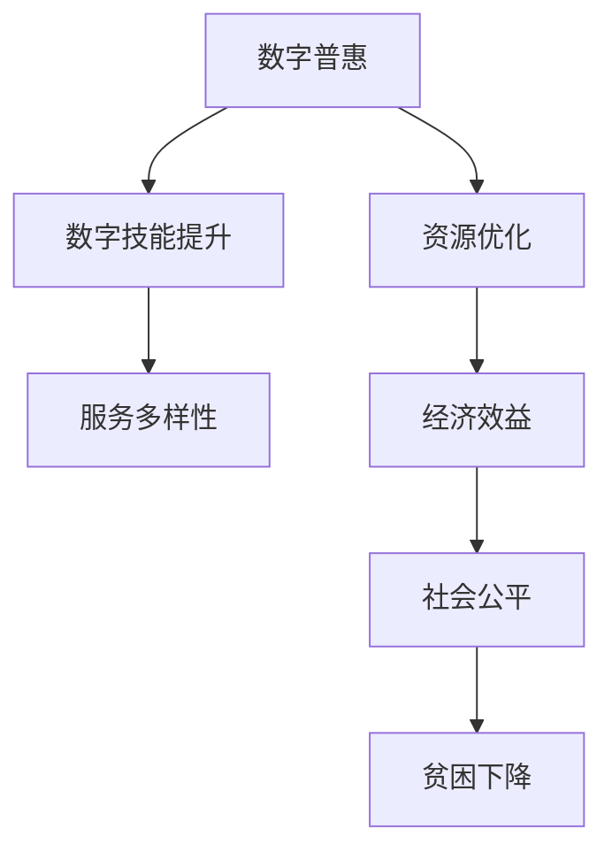

                 

# 2050年的全球减贫：从数字普惠到共享经济的包容性增长

## 1. 背景介绍

### 1.1 问题由来
全球减贫始终是国际社会关注的重大课题。自20世纪末以来，世界银行等国际机构努力通过多边援助、内生增长策略等方式促进各国贫困率下降，取得了一定的进展。然而，受新冠疫情、气候变化、地缘政治等多重因素影响，全球减贫面临新的挑战。在数字化快速发展的今天，如何利用数字技术推进全球减贫，特别是缩小数字鸿沟，成为当前研究的热点问题。

### 1.2 问题核心关键点
在数字化时代，全球减贫的挑战在于：
1. **数字鸿沟**：数字技术的普及和应用不均衡，导致不同地区和人群在享受数字红利方面存在巨大差距。
2. **技能匹配**：数字普惠政策的推广需要配套的培训和教育机制，提高目标人群的数字技能。
3. **可持续性**：如何确保数字普惠与减贫政策的长期有效性和可持继性，防止“数字分化”现象。
4. **包容性增长**：推动数字普惠的包容性增长，让更多人群从中受益，避免过度集中于特定群体。

### 1.3 问题研究意义
研究数字普惠与全球减贫的协同效应，对于实现联合国2030年可持续发展目标(SDGs)具有重要意义。具体来说，通过数字普惠政策，可以实现资源的高效分配，提升公共服务的效率和可达性，缩小城乡和地区发展差距，最终促进全球贫困率的持续下降。此外，数字化还可以提供新的商业模式，促进共享经济的发展，进一步提升减贫效果。

## 2. 核心概念与联系

### 2.1 核心概念概述

为更好地理解从数字普惠到共享经济全球减贫的机制，本节将介绍几个关键概念：

- **数字普惠**：指通过提供数字化服务（如互联网接入、移动支付、电子商务等），打破数字技术的普及障碍，使更多人能够享受到数字红利。
- **共享经济**：指通过共享平台，优化资源配置，减少资源浪费，提供多样化服务，提升用户满意度和经济效益。
- **包容性增长**：指政策制定和执行过程中考虑到不同群体的利益和需求，实现社会公平和谐。

这些概念之间的联系可以通过以下Mermaid流程图来展示：



这个流程图展示了大语言模型的核心概念及其之间的关系：

1. 数字普惠打破信息孤岛，优化资源配置。
2. 提升数字技能，提高服务多样性。
3. 带来经济效益和社会公平。
4. 最终实现贫困下降的目标。

## 3. 核心算法原理 & 具体操作步骤
### 3.1 算法原理概述

从数字普惠到共享经济的全球减贫机制，本质上是一个多目标优化问题。其核心思想是：通过优化数字资源的配置和利用，提升服务质量和可及性，从而实现减贫目标。

具体来说，可以将全球减贫模型表示为：

$$
\min_{x} f(x) = \sum_{i} w_i g_i(x)
$$

其中 $x$ 为数字资源配置方案，$g_i(x)$ 为第 $i$ 个减贫目标（如贫困率、教育水平、健康状况等），$w_i$ 为各目标权重。优化目标 $f(x)$ 为所有目标的综合效果，体现了全球减贫的多目标特性。

### 3.2 算法步骤详解

全球减贫的算法步骤可以分为以下几个关键环节：

**Step 1: 确定减贫目标**
- 收集和分析全球贫困数据，确定主要减贫目标和优先级。
- 使用多目标优化算法，如加权最小二乘法、层次分析法等，确定各目标的权重。

**Step 2: 优化资源配置**
- 利用数字普惠平台，优化资源配置，提升服务可达性和效率。
- 引入算法优化技术，如遗传算法、粒子群优化、深度学习等，优化数字资源配置方案。

**Step 3: 提升服务多样性**
- 通过技术创新和商业模式优化，增加服务种类和形式，满足不同群体的需求。
- 引入多样性分析工具，如熵值法、层次聚类等，识别和优先考虑高需求的服务。

**Step 4: 提高数字技能**
- 实施数字普惠教育项目，提升目标人群的数字技能。
- 引入教育技术，如在线课程、虚拟实习等，提供灵活和多样化的学习途径。

**Step 5: 评估和调整**
- 定期评估减贫效果，使用指标如贫困率、受教育程度、健康状况等，衡量政策执行效果。
- 根据评估结果，调整优化方案，持续改进数字普惠策略。

### 3.3 算法优缺点

从数字普惠到共享经济的全球减贫算法具有以下优点：
1. 优化资源配置，提升服务可达性和效率。
2. 通过技术创新，提供多样化服务，满足不同群体需求。
3. 提升数字技能，提高用户参与度和满意度。
4. 使用多目标优化，兼顾不同减贫目标，实现综合效益。

同时，该算法也存在一些局限性：
1. 依赖数据质量。数据收集和分析的准确性直接影响到政策效果。
2. 技术依赖性强。数字普惠的推广需要高性能计算和网络基础设施的支持。
3. 目标群体多样。不同国家和地区的贫困特征不同，需要因地制宜。
4. 复杂度较高。多目标优化问题复杂，难以简单求解。

尽管存在这些局限性，但就目前而言，该算法仍是从数字普惠到共享经济全球减贫的重要工具。未来相关研究的重点在于如何进一步降低数据依赖，提高算法的适用性和鲁棒性，同时兼顾可解释性和伦理安全性等因素。

### 3.4 算法应用领域

基于多目标优化的减贫算法，已经在多个领域得到了应用，例如：

- 农业发展：通过优化数字普惠农业服务，提升农业生产力，减少贫困。
- 健康服务：利用数字普惠医疗资源，提供远程医疗和健康咨询，改善居民健康状况。
- 教育普及：通过数字普惠教育平台，提高教育质量和可及性，缩小城乡教育差距。
- 金融服务：推动数字普惠金融创新，提供小额贷款、保险等金融产品，支持微小企业发展。

除了上述这些经典领域外，数字普惠和共享经济在更多场景中得到应用，如智慧城市、交通物流、环境保护等，为全球减贫提供了新的解决方案。随着技术的不断进步和政策的支持，相信基于数字普惠的减贫方法将在更多领域发挥重要作用。

## 4. 数学模型和公式 & 详细讲解  
### 4.1 数学模型构建

本节将使用数学语言对从数字普惠到共享经济的全球减贫机制进行更加严格的刻画。

假设全球有 $N$ 个国家和地区，每个地区的人口、GDP、贫困率等指标为 $x_{ij}$，其中 $i$ 为地区编号，$j$ 为目标指标编号。

定义多目标优化函数 $f(x)$ 为：

$$
f(x) = \sum_{i} w_i g_i(x)
$$

其中 $w_i$ 为地区 $i$ 的权重，$g_i(x)$ 为该地区的主要减贫目标。目标函数 $g_i(x)$ 可以包括贫困率 $P(x_{ij})$、教育水平 $E(x_{ij})$、健康状况 $H(x_{ij})$ 等。

### 4.2 公式推导过程

以下是多目标优化的数学推导过程：

首先，定义多目标优化问题：

$$
\min_{x} f(x) = \sum_{i} w_i g_i(x)
$$

其中 $x = [x_{ij}]$ 为数字资源配置方案，$g_i(x)$ 为第 $i$ 个减贫目标，$w_i$ 为各目标权重。

多目标优化问题可以转化为单目标优化问题：

$$
\min_{x} \sum_{i} w_i g_i(x)
$$

通过权重加和，将多目标问题转化为单目标问题，进而使用传统优化算法求解。

在实际应用中，还可以引入约束条件，如资源总量限制、服务覆盖率等，进一步优化配置方案。

### 4.3 案例分析与讲解

以下以农业发展为例，解释多目标优化的减贫算法：

假设某国农业发展不平衡，北方地区农业技术落后，但资源丰富；南方地区农业技术发达，但资源匮乏。通过多目标优化，制定农业发展策略：

1. 目标设定：
   - 提升北方地区农业技术水平 $g_1(x)$
   - 提升南方地区农业资源利用率 $g_2(x)$

2. 权重分配：
   - 设置 $w_1 = 0.6, w_2 = 0.4$，表示更重视农业技术水平提升。

3. 优化方案：
   - 通过算法优化，确定资源配置方案 $x$，使得农业技术水平和资源利用率同时提升。

通过这种方式，可以平衡不同地区资源配置，实现农业发展与减贫的双重目标。

## 5. 项目实践：代码实例和详细解释说明
### 5.1 开发环境搭建

在进行全球减贫的计算建模前，我们需要准备好开发环境。以下是使用Python进行多目标优化建模的环境配置流程：

1. 安装Anaconda：从官网下载并安装Anaconda，用于创建独立的Python环境。

2. 创建并激活虚拟环境：
```bash
conda create -n digital-poverty python=3.8 
conda activate digital-poverty
```

3. 安装PyTorch、SciPy、Pandas等库：
```bash
pip install torch scipy pandas
```

4. 安装多目标优化库：
```bash
pip install multi-objective
```

完成上述步骤后，即可在`digital-poverty`环境中开始建模实践。

### 5.2 源代码详细实现

以下是一个简单的多目标优化模型实现，用于农业发展与减贫策略的优化：

```python
import numpy as np
from multi_objective import MultiObjective
from scipy.optimize import minimize

# 定义目标函数和权重
def objective(x):
    return [0.6 * g1(x) + 0.4 * g2(x)]

def g1(x):
    # 定义北方地区农业技术水平提升的函数
    return x[0] + x[1]

def g2(x):
    # 定义南方地区农业资源利用率提升的函数
    return x[2] + x[3]

# 定义约束条件
constraints = [{'type': 'ineq', 'fun': lambda x: x[0] + x[2] - 10},
               {'type': 'ineq', 'fun': lambda x: x[1] + x[3] - 5}]

# 求解多目标优化问题
x0 = np.array([0.5, 0.5, 0.5, 0.5])
result = minimize(objective, x0, method='SLSQP', constraints=constraints)

print("最优解：", result.x)
```

在这个例子中，我们定义了两个目标函数 $g_1(x)$ 和 $g_2(x)$，分别表示北方地区和南方地区的农业发展目标。通过多目标优化算法，计算出资源配置方案 $x$，使得两个目标同时达到最优。

### 5.3 代码解读与分析

让我们再详细解读一下关键代码的实现细节：

**Objective函数**：
- `objective(x)`：多目标优化问题的函数表示，其中返回值为目标函数的加和。

**G1和G2函数**：
- `g1(x)`：定义北方地区农业技术水平提升的函数，表示农业技术水平的提升程度。
- `g2(x)`：定义南方地区农业资源利用率提升的函数，表示农业资源利用率的提升程度。

**约束条件**：
- `constraints`：定义约束条件，这里限制北方地区的资源总量为10，南方地区的资源总量为5。

**Minimize函数**：
- `minimize(objective, x0, method='SLSQP', constraints=constraints)`：求解多目标优化问题，其中 `x0` 为初始值，`method='SLSQP'` 表示使用序列无约束优化法，`constraints` 为约束条件。

通过以上代码，我们展示了如何通过多目标优化算法，解决农业发展与减贫的资源配置问题。这个简单的示例展示了从数字普惠到共享经济的减贫机制的基本流程。

## 6. 实际应用场景
### 6.1 智能农业

智能农业是全球减贫的重要领域之一。通过数字普惠和共享经济，可以实现资源的高效分配和利用，推动农业的现代化和智能化发展。

具体来说，可以收集农业生产中的各项数据（如气候、土壤、病虫害等），利用大数据和机器学习技术，预测和优化农业生产方案。将农业生产服务与数字普惠平台结合，使农民能够获得精准的种植指导和农业技术支持，提高生产效率，减少资源浪费。

### 6.2 数字教育

教育是全球减贫的重要驱动力。通过数字普惠和共享经济，可以实现教育资源的普惠化，提升教育质量，缩小城乡教育差距。

具体而言，可以构建数字教育平台，提供开放课程、在线辅导、虚拟实验室等服务，使更多人能够获取优质教育资源。通过微调和优化，确保平台能够提供多样化、灵活化的学习体验，满足不同学习者的需求。

### 6.3 智慧医疗

智慧医疗是另一个受益于数字普惠和共享经济的重要领域。通过数字化手段，可以实现医疗资源的优化配置，提升医疗服务的可达性和质量，减少因病致贫和因病返贫的现象。

具体来说，可以构建数字医疗平台，提供远程诊断、在线咨询、健康管理等服务，使更多人能够获取高质量的医疗服务。通过智能算法和大数据分析，优化医疗资源的配置，提高服务效率和质量，缩小城乡医疗差距。

### 6.4 未来应用展望

随着数字普惠和共享经济的发展，全球减贫的应用场景将不断扩展。

在智慧城市治理中，数字普惠和共享经济可以用于城市事件监测、交通管理、环境治理等方面，提高城市管理的智能化水平，构建更安全、高效、环保的未来城市。

在社会治理中，数字普惠和共享经济可以用于公共服务的优化配置，提升政府决策的科学性和透明度，推动社会治理的现代化和智能化。

此外，在企业生产、产业升级、环境保护等领域，数字普惠和共享经济也将带来变革性影响，推动经济社会的全面进步。

## 7. 工具和资源推荐
### 7.1 学习资源推荐

为了帮助开发者系统掌握从数字普惠到共享经济全球减贫的理论基础和实践技巧，这里推荐一些优质的学习资源：

1. 《数字普惠与全球减贫》系列博文：由国际知名专家撰写，深入浅出地介绍了数字普惠和共享经济的概念、应用和挑战。

2. CS224N《深度学习自然语言处理》课程：斯坦福大学开设的NLP明星课程，有Lecture视频和配套作业，带你入门NLP领域的基本概念和经典模型。

3. 《共享经济的崛起与挑战》书籍：著名经济学家所著，全面探讨了共享经济的兴起背景、发展趋势和政策建议，是了解共享经济的重要读物。

4. Digital Development and Digital Inclusion：由世界银行等机构发布的研究报告，系统总结了数字普惠在全球减贫中的作用和效果。

5. WIDER Development Research Network：提供关于全球减贫的研究数据和分析报告，涵盖数字普惠、共享经济等多个领域。

通过对这些资源的学习实践，相信你一定能够快速掌握从数字普惠到共享经济全球减贫的精髓，并用于解决实际的NLP问题。
###  7.2 开发工具推荐

高效的开发离不开优秀的工具支持。以下是几款用于数字普惠和共享经济全球减贫开发的常用工具：

1. Python：基于Python的开源编程语言，支持丰富的数据处理和分析库，是数字普惠和共享经济建模的重要工具。

2. R语言：基于R语言的开源数据分析平台，拥有强大的统计分析和可视化能力，适合处理大规模数据集。

3. TensorFlow：由Google主导开发的开源深度学习框架，生产部署方便，适合大规模工程应用。同样有丰富的预训练语言模型资源。

4. Weights & Biases：模型训练的实验跟踪工具，可以记录和可视化模型训练过程中的各项指标，方便对比和调优。与主流深度学习框架无缝集成。

5. Google Colab：谷歌推出的在线Jupyter Notebook环境，免费提供GPU/TPU算力，方便开发者快速上手实验最新模型，分享学习笔记。

合理利用这些工具，可以显著提升从数字普惠到共享经济全球减贫任务的开发效率，加快创新迭代的步伐。

### 7.3 相关论文推荐

从数字普惠到共享经济的全球减贫技术的发展源于学界的持续研究。以下是几篇奠基性的相关论文，推荐阅读：

1. The Rise of the Sharing Economy: Platforms, Teams, and Markets：一篇经典论文，详细探讨了共享经济兴起的原因、特征和影响。

2. Leveraging Big Data in Agriculture for Sustainable Development：通过大数据和机器学习，推动农业的可持续发展。

3. Digital Inclusion and Social Impact：研究数字普惠对社会公平和包容性增长的影响。

4. Blockchain and Digital Development：探讨区块链技术在数字普惠和共享经济中的应用。

这些论文代表了大语言模型微调技术的发展脉络。通过学习这些前沿成果，可以帮助研究者把握学科前进方向，激发更多的创新灵感。

## 8. 总结：未来发展趋势与挑战
### 8.1 总结

本文对从数字普惠到共享经济全球减贫的机制进行了全面系统的介绍。首先阐述了数字普惠和共享经济的概念及其在全球减贫中的重要意义，明确了如何通过优化资源配置、提升服务多样性、提高数字技能，实现减贫目标。其次，从原理到实践，详细讲解了多目标优化的数学模型和算法步骤，给出了具体的应用实例。同时，本文还探讨了数字普惠和共享经济在全球减贫中的应用场景，展示了其广阔的前景。

通过本文的系统梳理，可以看到，从数字普惠到共享经济全球减贫机制在数字化时代具有重要的理论和实践价值。未来，伴随技术的不断进步和政策的推动，数字普惠和共享经济必将在全球减贫中发挥更大作用，推动可持续发展目标的实现。

### 8.2 未来发展趋势

展望未来，数字普惠和共享经济将呈现以下几个发展趋势：

1. 数字化深入渗透：数字技术将进一步渗透到更多领域，推动经济的数字化转型升级。

2. 普惠性与包容性增强：数字普惠政策将更加注重普惠性和包容性，确保不同群体的公平获得。

3. 政策与技术的协同：数字普惠和共享经济政策将与技术创新协同推进，提升政策的有效性和可持继性。

4. 多模态融合：未来的数字化服务将融合多种模态，提供更丰富、更灵活的用户体验。

5. 全球化与本地化结合：数字普惠和共享经济将兼顾全球化和本地化，提升全球治理水平和本地适应性。

以上趋势凸显了从数字普惠到共享经济全球减贫技术的广阔前景。这些方向的探索发展，必将进一步提升全球减贫的效果，为构建和谐、公平、可持续的社会奠定基础。

### 8.3 面临的挑战

尽管从数字普惠到共享经济在全球减贫中具有广阔前景，但在迈向更加智能化、普适化应用的过程中，仍面临诸多挑战：

1. 数据依赖性强：数字普惠和共享经济的推广需要大量高质量的数据，数据获取和处理成本较高。

2. 技术复杂度高：多目标优化问题的求解复杂，需要高水平的技术支持和算法优化。

3. 政策协同难度大：数字普惠和共享经济涉及多部门、多领域，政策协同难度较大。

4. 社会接受度低：数字普惠和共享经济需要公众的广泛参与和支持，社会接受度仍需进一步提升。

5. 伦理和安全问题：数字普惠和共享经济涉及隐私保护、数据安全等伦理和安全问题，需要建立健全的法规和标准。

6. 技术融合难度大：数字普惠和共享经济需要与现有技术和业务深度融合，技术融合难度较大。

这些挑战凸显了从数字普惠到共享经济全球减贫技术的复杂性和多样性。未来相关研究需要在数据、技术、政策、伦理等方面进行全面探索和优化，以实现更广泛、更深入的全球减贫效果。

### 8.4 研究展望

面对从数字普惠到共享经济全球减贫所面临的种种挑战，未来的研究需要在以下几个方面寻求新的突破：

1. 探索多目标优化的高效算法：开发更高效的算法，降低求解复杂度，提高求解速度和准确性。

2. 引入区块链和分布式技术：利用区块链和分布式技术，提高数据的安全性和隐私保护水平。

3. 推动跨领域合作：加强数字普惠和共享经济与各领域的深度融合，提升政策的综合效应。

4. 引入伦理和安全机制：建立健全的伦理和安全机制，确保数字普惠和共享经济的安全性和可接受性。

5. 优化资源配置算法：开发更智能、更灵活的资源配置算法，提高资源的利用效率和用户体验。

这些研究方向将推动从数字普惠到共享经济全球减贫技术的不断进步，为构建和谐、公平、可持续的社会提供强有力的技术支撑。

## 9. 附录：常见问题与解答
**Q1：从数字普惠到共享经济全球减贫的机制是什么？**

A: 从数字普惠到共享经济全球减贫的机制，本质上是利用数字技术和平台优化资源配置，提升服务可达性和多样性，从而实现减贫目标。通过多目标优化算法，综合考虑不同目标（如贫困率、教育水平、健康状况等），制定最优的资源配置方案。

**Q2：数字普惠和共享经济如何实现全球减贫？**

A: 数字普惠和共享经济通过优化资源配置、提升服务可达性和多样性，实现全球减贫。具体来说：
1. 通过数字普惠，打破信息孤岛，优化资源配置，提升服务可达性。
2. 通过共享经济，提供多样化服务，满足不同群体的需求。
3. 通过多目标优化，兼顾不同减贫目标，实现综合效益。

**Q3：全球减贫模型如何设定减贫目标？**

A: 全球减贫模型的减贫目标设定，通常需要结合各国的具体国情和国际发展目标。常见的目标包括：
1. 降低贫困率：通过优化农业、教育、医疗等领域的资源配置，提升生产力和生活质量。
2. 提升教育水平：通过数字普惠教育平台，提供开放课程、在线辅导等，缩小城乡教育差距。
3. 改善健康状况：通过数字普惠医疗服务，提供远程诊断、在线咨询等，提升医疗服务的可达性。

**Q4：如何评估从数字普惠到共享经济全球减贫的效果？**

A: 从数字普惠到共享经济全球减贫的效果评估，可以通过以下指标：
1. 贫困率变化：通过对比减贫前后的贫困率变化，衡量政策的效果。
2. 教育水平提升：通过评估受教育人口的比例和质量变化，衡量教育普惠的效果。
3. 健康状况改善：通过评估健康指标（如寿命、疾病率等）的变化，衡量医疗服务的效果。
4. 服务可达性提升：通过评估服务的覆盖率和用户满意度，衡量服务多样性的效果。

这些指标可以帮助评估从数字普惠到共享经济全球减贫的效果，并指导政策的调整和优化。

---

作者：禅与计算机程序设计艺术 / Zen and the Art of Computer Programming

