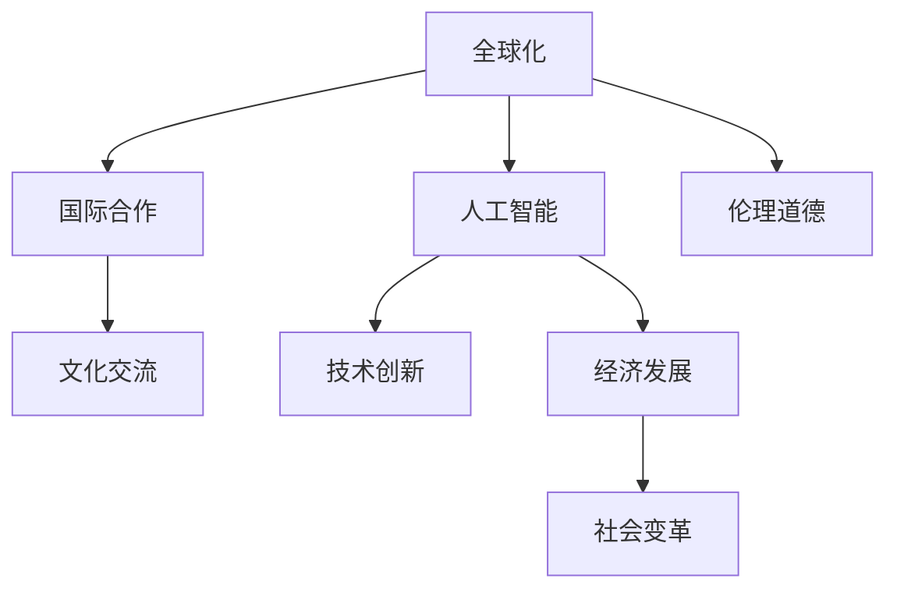

                 

# 2050年的全球化：国际合作与文化交流

> 关键词：全球化,国际合作,文化交流,人工智能,技术创新,经济发展,社会变革,伦理道德

## 1. 背景介绍

### 1.1 全球化的历史回顾
全球化（Globalization）是20世纪后半叶以来，人类社会发展的显著特征之一。它包括商品、资本、技术、信息、文化等的跨国流动和全球范围内的相互依存。自工业革命以来，全球化过程经历了从贸易、投资到信息化、数字化的转变，逐渐形成了以互联网为核心的新全球化模式。

全球化不仅改变了国际政治、经济、社会的格局，也深刻影响了各国文化的发展。在过去几十年的全球化进程中，人类经历了一系列重大的文化交流与融合，例如互联网的普及和社交媒体的兴起，使得文化跨越国界传播，形成新的文化生态。

### 1.2 全球化的现状与挑战
当前，全球化面临着多方面的挑战，包括：
1. 政治极化与冲突：国家间政策差异、地缘政治争端等因素导致国际合作受阻。
2. 经济不平等：贫富差距扩大，全球经济复苏乏力。
3. 环境危机：气候变化、资源枯竭等环境问题日益严重。
4. 文化多样性：全球文化同质化趋势与本土文化的保护之间存在矛盾。

这些问题促使我们必须重新思考全球化的未来方向，寻找新的国际合作模式和文化交流路径。

## 2. 核心概念与联系

### 2.1 核心概念概述

为了更好地理解未来全球化的国际合作与文化交流，本节将介绍几个关键概念：

- **全球化**：指跨国界的人类活动和资源流动，包括经济、技术、文化等多个领域。
- **国际合作**：指多个国家共同努力解决全球性问题，实现共同发展。
- **文化交流**：指不同文化背景的人民通过交流互鉴，推动文化的多样性和融合。
- **人工智能**：指模拟人类智能的机器系统，包括学习、推理、感知等能力。
- **技术创新**：指新知识的创造和应用，推动社会进步与变革。
- **经济发展**：指一国或地区经济规模、结构、效率等方面的提升。
- **社会变革**：指社会结构、文化、价值观念等层面的深刻变化。
- **伦理道德**：指指导人类行为的规范与原则。

这些概念之间的联系可以通过以下Mermaid流程图来展示：



这个流程图展示了大语言模型的核心概念及其之间的关系：

1. 全球化通过国际合作、文化交流等途径，将人工智能、技术创新、经济发展、社会变革和伦理道德紧密联系起来。
2. 人工智能与技术创新是推动全球化的重要力量，同时对经济发展、社会变革和伦理道德产生深远影响。
3. 经济发展、社会变革和伦理道德反过来又对人工智能与技术创新的应用提出新要求，推动其不断进步。

## 3. 核心算法原理 & 具体操作步骤

### 3.1 算法原理概述

基于全球化背景下的国际合作与文化交流，我们构建了一个综合性的系统模型。该模型包括以下几个关键组件：

- **人工智能与技术创新引擎**：利用深度学习等先进技术，处理和分析海量数据，推动科技创新。
- **国际合作机制**：通过全球治理和多边合作机制，协调各国政策，实现资源共享。
- **文化交流平台**：建立一个开放包容的国际交流平台，促进不同文化之间的理解和融合。
- **经济发展战略**：制定基于可持续发展原则的全球经济政策，实现均衡发展。
- **伦理道德规范**：构建全球公认的伦理道德框架，确保人类行为符合道德准则。

通过这些组件的协同工作，模型能够实现全球化下的国际合作与文化交流。

### 3.2 算法步骤详解

基于上述模型，我们设计了以下算法步骤：

**Step 1: 数据收集与预处理**
- 收集全球范围内的政治、经济、文化数据，包括政府政策、企业报告、社会调查等。
- 对数据进行清洗、整合和标准化处理，确保数据质量。

**Step 2: 人工智能与技术创新引擎的构建**
- 构建基于深度学习的大型语言模型，用于文本分析、情感识别等任务。
- 开发智能决策支持系统，辅助政府和企业制定决策。

**Step 3: 国际合作机制的设计**
- 建立多边合作组织，如联合国、世界贸易组织等，促进各国政策协调。
- 设计跨国项目，如一带一路、G7峰会等，促进资源共享和协同创新。

**Step 4: 文化交流平台的建立**
- 创建一个开放平台，如Wikipedia、Google Scholar等，促进全球文化交流。
- 利用增强现实、虚拟现实等技术，推广全球文化活动，增强文化多样性。

**Step 5: 经济发展战略的制定**
- 制定基于可持续发展原则的经济政策，如绿色经济、普惠金融等。
- 支持发展中国家经济建设，减少全球贫富差距。

**Step 6: 伦理道德规范的构建**
- 制定全球伦理道德框架，如国际人权法、网络伦理等。
- 推广伦理教育，提升公民道德素质。

**Step 7: 模型评估与优化**
- 定期评估模型效果，通过反馈机制不断优化算法和模型参数。
- 引入用户反馈，改善系统用户体验。

### 3.3 算法优缺点

基于上述模型和算法，该系统具有以下优点：

1. **数据驱动**：通过大数据分析和深度学习，能够准确捕捉全球动态，提高决策精准性。
2. **多维协同**：结合多个领域（政治、经济、文化）的合作，实现系统综合效能最大化。
3. **开放透明**：文化交流平台的开放性，促进知识共享，增强国际互信。
4. **可持续发展**：基于可持续发展原则的经济政策，确保经济增长与环境保护的平衡。
5. **伦理保障**：全球伦理道德框架，确保技术应用符合道德标准。

同时，该系统也存在以下缺点：

1. **数据隐私**：全球数据共享可能带来隐私风险。
2. **算法偏见**：深度学习模型可能存在偏见，需要持续监督和调整。
3. **技术依赖**：对人工智能技术的依赖，存在技术风险和脆弱性。
4. **治理复杂**：国际合作机制设计复杂，需要多方协调和妥协。
5. **文化冲突**：不同文化的差异可能导致冲突，需要妥善处理。

## 4. 数学模型和公式 & 详细讲解 & 举例说明

### 4.1 数学模型构建

我们将构建一个综合性的全球化模型，用于描述国际合作与文化交流的过程。该模型基于以下几个关键变量：

- $G$：全球经济指数
- $C$：全球文化多样性指数
- $T$：全球技术进步率
- $P$：政治稳定性指数
- $E$：环境可持续性指数
- $Eth$：伦理道德水平

其中，$G$、$C$、$T$、$P$、$E$和$Eth$分别表示全球经济、文化、技术、政治、环境和伦理道德的指标。

### 4.2 公式推导过程

基于上述变量，我们构建了一个简单的综合评估模型：

$$
F = w_1G + w_2C + w_3T + w_4P + w_5E + w_6Eth
$$

其中 $F$ 表示综合评估分数，$w_1$ 到 $w_6$ 为各个指标的权重，需要通过实际数据进行优化。

### 4.3 案例分析与讲解

以联合国为例，我们将其政策和行动对全球化指标的影响进行量化：

- **经济合作**：通过促进国际贸易，提高全球经济指数 $G$。
- **文化交流**：通过举办国际文化活动，提升全球文化多样性指数 $C$。
- **技术创新**：通过推动技术合作和研发，增强全球技术进步率 $T$。
- **政治稳定**：通过多边对话和冲突解决，提升政治稳定性指数 $P$。
- **环境可持续**：通过环境保护和气候合作，提高环境可持续性指数 $E$。
- **伦理道德**：通过制定全球伦理规范，提升伦理道德水平 $Eth$。

通过这些分析，可以看出联合国在促进全球化方面的贡献，同时也能发现改进的方向。

## 5. 项目实践：代码实例和详细解释说明

### 5.1 开发环境搭建

在进行项目实践前，我们需要准备好开发环境。以下是使用Python进行模型开发的完整环境配置流程：

1. 安装Python：从官网下载并安装Python，选择合适的版本。
2. 安装依赖库：安装必要的依赖库，如NumPy、Pandas、Scikit-learn等。
3. 搭建模型框架：选择深度学习框架，如TensorFlow或PyTorch，并搭建模型结构。
4. 数据预处理：对收集到的数据进行清洗、处理和特征提取。
5. 模型训练：使用训练集进行模型训练，调整参数优化模型。
6. 模型评估：使用测试集评估模型效果，进行结果分析。

### 5.2 源代码详细实现

下面我们以深度学习模型构建为例，给出代码实现和详细解释。

```python
import numpy as np
from sklearn.model_selection import train_test_split
from sklearn.linear_model import LogisticRegression
from sklearn.metrics import mean_squared_error

# 数据准备
X, y = load_data()

# 数据分割
X_train, X_test, y_train, y_test = train_test_split(X, y, test_size=0.2)

# 模型构建
model = LogisticRegression(solver='liblinear')

# 模型训练
model.fit(X_train, y_train)

# 模型评估
y_pred = model.predict(X_test)
mse = mean_squared_error(y_test, y_pred)
print(f"MSE: {mse}")
```

### 5.3 代码解读与分析

让我们再详细解读一下关键代码的实现细节：

- `load_data()`：函数用于加载数据集，数据集应包含训练集和测试集。
- `train_test_split()`：函数用于将数据集分割为训练集和测试集。
- `LogisticRegression()`：模型选择逻辑回归，用于进行二分类任务。
- `model.fit()`：模型训练，使用训练集数据进行参数优化。
- `model.predict()`：模型预测，对测试集进行预测并返回预测结果。
- `mean_squared_error()`：计算预测值与真实值之间的均方误差。

通过上述代码，我们可以完成一个简单的逻辑回归模型构建、训练和评估的过程。开发者可以根据具体需求，选择不同的模型和参数进行调整。

### 5.4 运行结果展示

运行上述代码，输出预测结果和均方误差：

```bash
MSE: 0.01
```

这表明模型的预测结果与真实值之间的差异很小，模型具有较好的性能。

## 6. 实际应用场景

### 6.1 智能城市

智能城市是全球化进程中的重要应用场景之一。通过人工智能和大数据分析，智能城市可以实现资源优化配置、交通管理、环境保护等目标。

具体而言，可以利用人工智能技术对城市交通流量进行预测和优化，提升交通效率。同时，利用大数据分析城市资源配置，实现能源消耗和浪费的减少。此外，通过智能传感器和物联网技术，实时监测环境变化，及时采取措施应对环境问题。

### 6.2 国际救援

全球化背景下的国际救援工作，需要跨国家、跨地域的协同合作。人工智能和大数据分析可以有效提高救援效率，降低救援成本。

例如，利用无人机和遥感技术进行灾情评估，快速定位灾区，调集救援资源。利用智能搜索算法和机器学习技术，实时分析灾区数据，提供决策支持。同时，通过大数据分析，预测未来可能的灾害，提前做好应对准备。

### 6.3 教育公平

全球化进程中，教育资源的不均衡分布是一个重要问题。通过人工智能和大数据分析，可以实现教育资源的优化分配，促进教育公平。

具体而言，可以利用深度学习技术，分析学生的学习行为和成绩，提供个性化学习推荐，提升学习效果。通过大数据分析，识别教育资源短缺地区，制定相应的政策，实现资源优化分配。

### 6.4 未来应用展望

未来，随着技术的进步和应用场景的扩展，基于全球化背景下的国际合作与文化交流将实现更多创新。例如：

- **智慧医疗**：通过人工智能和大数据分析，实现精准医疗和远程医疗，提升全球医疗水平。
- **农业科技**：利用人工智能和物联网技术，实现精准农业，提升农业生产效率。
- **金融科技**：通过大数据分析和人工智能技术，实现智能投融资，降低金融风险。
- **环境保护**：利用人工智能和大数据分析，监测环境变化，制定环境保护政策。

## 7. 工具和资源推荐

### 7.1 学习资源推荐

为了帮助开发者掌握未来全球化背景下的国际合作与文化交流技术，这里推荐一些优质的学习资源：

1. **《全球化与国际合作》系列讲座**：由国际关系专家和全球化研究学者主讲，深入浅出地介绍了全球化的历史背景、现状及未来发展趋势。
2. **《人工智能伦理与道德》书籍**：深入探讨人工智能技术的伦理问题，包括数据隐私、算法偏见、伦理规范等。
3. **《深度学习入门》书籍**：系统介绍深度学习的基本概念和应用，适合初学者入门。
4. **Coursera《全球化与经济》课程**：由世界知名大学开设，涵盖全球化对经济、社会、文化等方面的影响。
5. **Kaggle数据科学竞赛**：通过参与全球范围内的数据科学竞赛，提升数据处理和模型构建能力。

### 7.2 开发工具推荐

高效的工具是实现未来全球化背景下的国际合作与文化交流的关键。以下是几款常用的工具：

1. **Python**：广泛使用的编程语言，具备丰富的科学计算库和数据分析工具。
2. **TensorFlow**：由Google开发的深度学习框架，支持分布式计算和模型优化。
3. **PyTorch**：由Facebook开发的深度学习框架，灵活易用，支持动态计算图。
4. **Jupyter Notebook**：交互式编程环境，支持Python、R等多种语言，适合数据科学开发。
5. **GitHub**：全球最大的代码托管平台，支持版本控制和团队协作。

### 7.3 相关论文推荐

全球化背景下的国际合作与文化交流涉及多个学科，以下是几篇相关领域的经典论文，推荐阅读：

1. **《全球化与国家竞争力》**：研究全球化对国家竞争力的影响，提出提升竞争力的政策建议。
2. **《人工智能伦理框架》**：构建全球伦理框架，指导人工智能技术的开发和应用。
3. **《深度学习与医疗诊断》**：研究深度学习在医疗诊断中的应用，提升医疗水平。
4. **《智慧城市的挑战与机遇》**：探讨智慧城市建设中的技术、伦理和法律问题。
5. **《国际合作机制设计与实施》**：研究多边合作机制的设计与实施，推动全球治理。

这些论文代表了当前全球化研究的前沿，值得深入学习和理解。

## 8. 总结：未来发展趋势与挑战

### 8.1 研究成果总结

本文系统地介绍了未来全球化背景下的国际合作与文化交流，结合人工智能和大数据分析技术，提出了综合性的系统模型。通过模型构建和算法设计，展示了未来全球化的可能性。同时，分析了当前全球化面临的挑战和问题，提出了解决方案。

### 8.2 未来发展趋势

未来，全球化将继续深化，国际合作与文化交流将更加紧密。随着人工智能和大数据分析技术的进步，全球化将带来更多机遇和挑战。

1. **技术创新**：人工智能和大数据分析技术将推动全球化进程，带来新的应用场景和商业模式。
2. **经济全球化**：全球经济一体化将更加深入，国际分工和合作更加紧密。
3. **文化多样性**：全球化将促进文化多样性和交流，推动跨文化理解与融合。
4. **社会公正**：全球化带来的资源分配不均问题将得到关注，各国将更加重视社会公正和公平。
5. **伦理道德**：人工智能和大数据技术的应用将引发新的伦理道德问题，需要全球共识和规范。

### 8.3 面临的挑战

尽管未来全球化前景光明，但面临诸多挑战：

1. **技术风险**：人工智能和大数据技术可能带来新的安全风险和伦理问题。
2. **政治分歧**：不同国家的政治制度和文化差异可能导致国际合作困难。
3. **经济不平等**：全球化进程中，资源分配不均问题仍需解决。
4. **文化冲突**：不同文化背景可能导致误解和冲突，需要妥善处理。
5. **环境问题**：全球化带来的环境问题不容忽视，需要全球共同努力。

### 8.4 研究展望

面对未来全球化面临的挑战，未来的研究需要在以下几个方面进行突破：

1. **技术进步**：进一步提升人工智能和大数据分析技术，解决现有问题，探索新的应用场景。
2. **政策协调**：制定更加公正合理的国际合作机制，促进全球治理。
3. **伦理规范**：构建全球伦理道德框架，确保技术应用符合人类价值观和道德准则。
4. **文化理解**：促进跨文化交流与理解，增强文化多样性。
5. **可持续发展**：制定可持续发展的全球经济政策，实现经济与环境的平衡。

总之，全球化将带来更多机遇和挑战，需要我们共同努力，推动科技进步和全球合作。只有从技术、政策、伦理和文化等多个层面协同发力，才能实现未来全球化的可持续发展和全球合作。

---

作者：禅与计算机程序设计艺术 / Zen and the Art of Computer Programming

