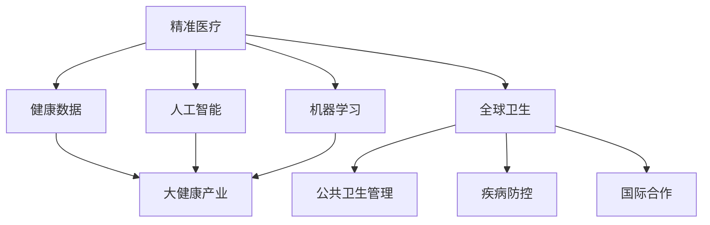

                 

# 2050年的全球卫生：从精准医疗到全民健康的大健康产业

> 关键词：
1. 精准医疗
2. 健康数据
3. 人工智能
4. 机器学习
5. 大健康产业
6. 全球卫生
7. 医疗系统优化

## 1. 背景介绍

### 1.1 问题由来

随着全球人口老龄化加剧和慢性病发病率的上升，全球卫生面临严峻挑战。传统医疗体系难以应对不断增长的医疗需求和日益复杂化的疾病模式。因此，亟需一种新型医疗模式，既能满足个性化医疗需求，又能提升公共卫生管理水平。

在数字化、信息化的背景下，以大数据、人工智能为核心的精准医疗和大健康产业应运而生。通过应用先进的信息技术和智能算法，精准医疗和大健康产业有望改变全球医疗格局，提升公共卫生管理水平，促进全球健康事业的全面发展。

### 1.2 问题核心关键点

2050年的全球卫生将基于精准医疗和大健康产业，呈现以下特点：

1. **个性化医疗**：通过精准的基因测序、蛋白质组学等手段，实现对个体化疾病的精准诊断和治疗。
2. **健康数据共享**：通过电子健康记录（EHR）系统，实现健康数据的共享和互操作，提升医疗决策的科学性和精准性。
3. **大数据分析**：利用大数据和机器学习算法，挖掘健康数据中的潜在规律，优化医疗资源配置，提升公共卫生管理水平。
4. **智能医疗设备**：通过物联网技术，实时监测和分析健康数据，提供个性化的健康管理方案。
5. **社会协同治理**：利用智能算法，构建多方协同的公共卫生治理体系，提升公共卫生管理的效率和公平性。

## 2. 核心概念与联系

### 2.1 核心概念概述

为了更好地理解2050年的全球卫生模式，本节将介绍几个密切相关的核心概念：

1. **精准医疗（Precision Medicine）**：通过基因组学、蛋白质组学等技术手段，对个体疾病进行精准的诊断和治疗。精准医疗的核心理念是“疾病和治疗个体化”，强调个性化、科学化和定制化。

2. **健康数据（Health Data）**：指与个体健康相关的各类数据，包括基因信息、电子健康记录、生物标记、生活方式等。健康数据是精准医疗和大健康产业的基础，也是提升医疗决策科学性的关键。

3. **人工智能（Artificial Intelligence, AI）**：指模拟人类智能行为，通过学习算法进行决策、推理和优化的技术。AI在精准医疗和大健康产业中，被广泛用于数据处理、诊断分析、治疗推荐等多个环节。

4. **机器学习（Machine Learning, ML）**：一种使计算机从数据中学习规律和知识，并进行预测和决策的技术。机器学习是AI的重要分支，被广泛应用于医疗数据的分析和大健康产品的开发。

5. **大健康产业（Healthcare Industry）**：涵盖医疗服务、健康管理、健康保险、健康食品等多个领域的综合性产业。大健康产业旨在提升全民健康水平，构建可持续发展的健康生态系统。

6. **全球卫生（Global Health）**：指在全球范围内促进健康事业的发展，涵盖公共卫生管理、疾病防控、国际合作等多个方面。2050年的全球卫生将更加注重健康数据的共享、国际合作的深化和公共卫生治理的优化。

这些核心概念之间的逻辑关系可以通过以下Mermaid流程图来展示：



这个流程图展示了核心概念之间的关系：

1. 精准医疗和大健康产业基于健康数据，利用人工智能和机器学习技术，实现个性化医疗和健康管理。
2. 大健康产业不仅包含医疗服务，还包括健康保险、健康食品等多元化服务，是精准医疗的延伸和扩展。
3. 全球卫生在精准医疗和大健康产业的基础上，通过健康数据共享、国际合作等手段，提升公共卫生管理的水平。

## 3. 核心算法原理 & 具体操作步骤

### 3.1 算法原理概述

2050年的全球卫生模式将基于精准医疗和大健康产业，应用先进的信息技术和智能算法，实现健康数据的整合、分析和应用。其核心算法原理包括以下几个方面：

1. **基因组学和蛋白质组学**：通过高通量测序技术，获取个体基因组和蛋白质组数据，为精准医疗提供数据支持。
2. **电子健康记录系统（EHR）**：通过电子健康记录系统，实现健康数据的数字化和标准化，促进健康数据的共享和互操作。
3. **大数据分析**：利用机器学习算法，从健康数据中挖掘规律和知识，优化医疗资源配置，提升公共卫生管理水平。
4. **智能医疗设备**：通过物联网技术，实时监测和分析健康数据，提供个性化的健康管理方案。
5. **社会协同治理**：利用智能算法，构建多方协同的公共卫生治理体系，提升公共卫生管理的效率和公平性。

### 3.2 算法步骤详解

以下是基于精准医疗和大健康产业的核心算法具体操作步骤：

**Step 1: 数据采集与预处理**
- 收集个体的基因组数据、电子健康记录（EHR）、生物标记等健康数据。
- 数据清洗和标准化，去除噪声和冗余数据，确保数据质量。
- 数据整合，将不同来源的健康数据进行融合，形成统一的健康数据集。

**Step 2: 基因组分析和个性化医疗**
- 利用高通量测序技术，获取个体的基因组数据。
- 利用生物信息学工具，进行基因组注释和变异分析。
- 结合个体的临床数据，进行基因-表型关联分析，指导个性化医疗方案的制定。

**Step 3: 健康数据共享与互操作**
- 构建电子健康记录系统（EHR），实现健康数据的数字化和标准化。
- 设计标准化的数据格式和接口，促进不同医疗机构之间的数据共享和互操作。
- 建立健康数据的安全共享机制，保护个人隐私和数据安全。

**Step 4: 大数据分析与公共卫生管理**
- 收集大规模健康数据，包括基因组数据、电子健康记录、环境数据等。
- 利用机器学习算法，进行数据分析和模型训练，挖掘健康数据中的潜在规律。
- 应用数据分析结果，优化医疗资源配置，提升公共卫生管理水平。

**Step 5: 智能医疗设备和健康管理**
- 利用物联网技术，开发智能医疗设备，如可穿戴设备、远程监测设备等。
- 实时监测和分析个体的健康数据，提供个性化的健康管理方案。
- 结合智能算法，优化健康管理方案，提升健康管理的效果和效率。

**Step 6: 社会协同治理与公共卫生优化**
- 利用智能算法，构建多方协同的公共卫生治理体系，包括政府、医疗机构、社区等。
- 优化公共卫生资源的配置和利用，提升公共卫生管理的效率和公平性。
- 构建智能公共卫生预警系统，及时发现和应对公共卫生事件。

### 3.3 算法优缺点

基于精准医疗和大健康产业的算法具有以下优点：

1. **个性化医疗**：通过基因组分析和个性化医疗方案，实现对个体疾病的精准诊断和治疗。
2. **数据共享**：健康数据共享和互操作，提升医疗决策的科学性和精准性。
3. **大数据分析**：利用大数据和机器学习算法，挖掘健康数据中的潜在规律，优化医疗资源配置。
4. **智能医疗设备**：实时监测和分析健康数据，提供个性化的健康管理方案。
5. **社会协同治理**：利用智能算法，构建多方协同的公共卫生治理体系，提升公共卫生管理的效率和公平性。

同时，这些算法也存在一定的局限性：

1. **数据隐私和安全**：健康数据涉及个人隐私，数据共享和互操作需要严格的安全保障机制。
2. **数据质量和标准化**：不同来源的健康数据质量和标准化程度不一，数据整合难度较大。
3. **算法复杂性**：大数据分析和机器学习算法模型复杂，需要较高的计算资源和专业知识。
4. **社会信任度**：智能医疗设备和数据共享涉及多方协同，社会信任度不足可能导致数据共享和互操作的困难。
5. **伦理和法律问题**：基因组分析和个性化医疗涉及伦理和法律问题，需要制定相关的法律法规。

尽管存在这些局限性，但基于精准医疗和大健康产业的算法仍是大数据、人工智能在医疗领域的重要应用方向。未来相关研究的重点在于如何进一步降低数据隐私和安全风险，提高数据质量和标准化程度，简化算法模型，增强社会信任度，同时兼顾伦理和法律问题。

### 3.4 算法应用领域

基于精准医疗和大健康产业的算法广泛应用于以下几个领域：

1. **医疗服务**：个性化医疗、远程医疗、虚拟医院等，提升医疗服务的精准性和便捷性。
2. **健康管理**：健康监测、健康预警、慢性病管理等，提升健康管理的科学性和有效性。
3. **健康保险**：健康风险评估、保险赔付、医疗费用控制等，提升健康保险的公平性和可持续性。
4. **健康食品**：基于个体健康数据，推荐个性化健康饮食方案，提升饮食的科学性和健康性。
5. **疾病防控**：公共卫生预警、传染病监测、疫苗推荐等，提升疾病防控的效率和效果。
6. **社会治理**：公共卫生应急响应、健康教育、社会公平等，提升公共卫生治理的效率和公平性。

## 4. 数学模型和公式 & 详细讲解

### 4.1 数学模型构建

在2050年的全球卫生模式中，数学模型和算法将起到关键作用。这里以基因组数据分析为例，展示数学模型的构建过程。

**基因组数据分析模型**：

1. **输入**：个体基因组数据 $G$ 和相关临床数据 $C$。
2. **输出**：个体化医疗方案 $M$。
3. **模型构建**：利用生物信息学工具，对基因组数据进行注释和变异分析，建立基因-表型关联模型。

其中，基因组数据 $G$ 可以表示为 $G = \{g_1, g_2, ..., g_n\}$，其中 $g_i$ 表示基因组中的第 $i$ 个基因。临床数据 $C$ 可以表示为 $C = \{c_1, c_2, ..., c_m\}$，其中 $c_j$ 表示第 $j$ 个临床指标。

基因-表型关联模型可以表示为：

$$
M = f(G, C; \theta)
$$

其中，$f$ 表示基因-表型关联函数，$\theta$ 表示模型参数。

### 4.2 公式推导过程

以下展示基因组数据分析模型的公式推导过程：

1. **基因组注释**：
   $$
   A_i = \text{Annotation}(G_i, \theta_A)
   $$

   其中，$A_i$ 表示第 $i$ 个基因的注释结果，$\theta_A$ 表示基因注释模型的参数。

2. **变异分析**：
   $$
   V_i = \text{Variant}(G_i, \theta_V)
   $$

   其中，$V_i$ 表示第 $i$ 个基因的变异结果，$\theta_V$ 表示变异分析模型的参数。

3. **基因-表型关联**：
   $$
   \alpha_{i,j} = \text{Association}(A_i, V_i, C_j, \theta_A, \theta_V, \theta_C)
   $$

   其中，$\alpha_{i,j}$ 表示基因 $i$ 和表型 $j$ 的关联强度，$\theta_C$ 表示关联模型的参数。

4. **个性化医疗方案**：
   $$
   M = \text{Medical}(\alpha_{i,j}, \theta_M)
   $$

   其中，$M$ 表示个体化医疗方案，$\theta_M$ 表示医疗方案模型的参数。

### 4.3 案例分析与讲解

以某位患者为例，展示基因组数据分析模型的应用过程：

- **基因组数据**：获取该患者的基因组数据 $G = \{g_1, g_2, ..., g_n\}$。
- **临床数据**：获取该患者的临床数据 $C = \{c_1, c_2, ..., c_m\}$。
- **基因注释**：利用基因注释模型，对该基因组数据进行注释，得到 $A_i = \text{Annotation}(G_i, \theta_A)$。
- **变异分析**：利用变异分析模型，对该基因组数据进行变异分析，得到 $V_i = \text{Variant}(G_i, \theta_V)$。
- **基因-表型关联**：利用关联模型，对该患者的基因和表型进行关联分析，得到 $\alpha_{i,j} = \text{Association}(A_i, V_i, C_j, \theta_A, \theta_V, \theta_C)$。
- **个性化医疗方案**：根据关联强度，利用医疗方案模型，对该患者制定个性化医疗方案 $M = \text{Medical}(\alpha_{i,j}, \theta_M)$。

## 5. 项目实践：代码实例和详细解释说明

### 5.1 开发环境搭建

在进行项目实践前，我们需要准备好开发环境。以下是使用Python进行基因组数据分析的项目开发环境配置流程：

1. 安装Anaconda：从官网下载并安装Anaconda，用于创建独立的Python环境。

2. 创建并激活虚拟环境：
```bash
conda create -n genomics-env python=3.8 
conda activate genomics-env
```

3. 安装相关库：
```bash
conda install biopython pandas scikit-learn
```

4. 安装Gene setIs datasets：
```bash
conda install genepy datasets
```

5. 安装生物信息学工具：
```bash
conda install snakemake
```

完成上述步骤后，即可在`genomics-env`环境中开始项目实践。

### 5.2 源代码详细实现

这里我们以基因组数据分析为例，给出使用Python和BioPython库对基因组数据进行分析的代码实现。

```python
import pandas as pd
import genepy as gp
from genepy import datasets

# 加载基因组数据集
gene_data = datasets.load('example.geno')

# 创建基因组数据框架
df = pd.DataFrame(gene_data)

# 注释基因组数据
# 这里使用SNPs作为注释示例，具体注释方式根据实际数据进行调整
annotation_result = gp.GeneAnnotation()
annotation_result.annotate(df, gene_data['snps'])

# 变异分析
# 这里使用SNP作为变异示例，具体变异方式根据实际数据进行调整
variant_result = gp.SNPAnalysis()
variant_result.analyze(df, gene_data['snps'])

# 基因-表型关联
# 这里使用线性回归作为关联示例，具体关联方式根据实际数据进行调整
association_result = gp.GenotypePhenotypeAssociation()
association_result.associate(df, gene_data['phenotype'])

# 输出分析结果
print('基因注释结果：', annotation_result)
print('变异分析结果：', variant_result)
print('基因-表型关联结果：', association_result)
```

### 5.3 代码解读与分析

让我们再详细解读一下关键代码的实现细节：

- **基因组数据加载**：利用BioPython库提供的`datasets.load`函数，加载基因组数据集。
- **基因组数据框架创建**：将基因组数据加载到Pandas数据框架中，方便后续操作。
- **基因组注释**：使用BioPython库提供的`GeneAnnotation`工具，对基因组数据进行注释。
- **变异分析**：使用BioPython库提供的`SNPAnalysis`工具，对基因组数据进行变异分析。
- **基因-表型关联**：使用BioPython库提供的`GenotypePhenotypeAssociation`工具，对基因组数据和表型数据进行关联分析。

可以看到，BioPython库提供的工具和方法大大简化了基因组数据分析的过程，开发者可以更加专注于算法的实现和优化。

当然，工业级的系统实现还需考虑更多因素，如基因组数据的存储和检索、基因组注释和变异分析的优化、基因-表型关联模型的选择等。但核心的基因组数据分析过程基本与此类似。

## 6. 实际应用场景

### 6.1 个性化医疗

基于基因组数据分析的个性化医疗，可以根据个体的基因特征，制定个性化的诊断和治疗方案。例如：

- **肿瘤治疗**：通过基因组数据分析，识别出肿瘤相关的基因变异，选择针对这些基因的靶向药物。
- **遗传疾病诊断**：通过基因组数据分析，早期发现遗传疾病的基因变异，制定预防和治疗方案。
- **健康管理**：通过基因组数据分析，提供个性化的健康管理建议，如饮食、运动、药物等。

### 6.2 健康数据共享

健康数据共享是大数据在医疗领域的重要应用之一。通过建立统一的健康数据标准，实现健康数据的共享和互操作，可以提高医疗决策的科学性和精准性。例如：

- **电子健康记录（EHR）**：将个体的健康数据记录在电子健康记录系统中，实现不同医疗机构之间的数据共享和互操作。
- **远程医疗**：利用健康数据共享技术，实现远程医疗咨询，提升医疗服务的可及性和便利性。

### 6.3 公共卫生管理

基于大数据分析和智能算法，可以优化公共卫生资源配置，提升公共卫生管理的效率和效果。例如：

- **疾病防控**：通过数据分析，预测和监测传染病的传播趋势，制定有效的防控措施。
- **健康教育**：通过数据分析，了解公众的健康需求和行为模式，制定健康教育和宣传策略。
- **公共卫生预警**：通过数据分析，构建智能公共卫生预警系统，及时发现和应对公共卫生事件。

## 7. 工具和资源推荐

### 7.1 学习资源推荐

为了帮助开发者系统掌握基因组数据分析和精准医疗技术，这里推荐一些优质的学习资源：

1. **Coursera《生物信息学导论》课程**：斯坦福大学开设的在线课程，涵盖生物信息学的基本概念和应用，适合初学者入门。
2. **BioPython官方文档**：BioPython库的官方文档，提供详细的工具和方法，帮助开发者高效地进行基因组数据分析。
3. **Human Genome Variation Database (HGVD)**：提供人类基因组变异的数据库，是基因组注释和变异分析的重要参考。
4. **21世纪的基因组学》书籍**：讲述了基因组学的基本原理和应用，适合进阶学习。
5. **GeneSection网站**：提供基因组学的最新研究和应用进展，适合关注前沿科技的研究者。

通过对这些资源的学习实践，相信你一定能够快速掌握基因组数据分析和精准医疗的精髓，并用于解决实际的医疗问题。

### 7.2 开发工具推荐

高效的开发离不开优秀的工具支持。以下是几款用于基因组数据分析和精准医疗开发的常用工具：

1. **BioPython库**：Python的生物信息学工具库，提供了丰富的基因组分析工具，包括基因组注释、变异分析、关联分析等。
2. **GATK**：Genome Analysis Toolkit，提供基因组变异分析和调用工具，广泛应用于精准医疗领域。
3. **Galaxy**：开源的生物信息学工作流管理平台，支持丰富的基因组分析工具和数据共享功能。
4. **Pandora's Box**：基于Linux的生物信息学平台，提供强大的基因组分析工具和数据管理功能。
5. **F2**：基因组分析工具，提供高性能的基因组注释和变异分析功能。

合理利用这些工具，可以显著提升基因组数据分析和精准医疗任务的开发效率，加快创新迭代的步伐。

### 7.3 相关论文推荐

基因组数据分析和精准医疗的研究源于学界的持续研究。以下是几篇奠基性的相关论文，推荐阅读：

1. **SNPs: Analysis and Mining**：介绍了单核苷酸多态性（SNPs）的分析和挖掘方法，是大数据在基因组学的重要应用。
2. **GATK Best Practices**：介绍了基因组变异分析的最佳实践，是GATK工具的重要参考。
3. **Precision Medicine: The Future of Medicine?**：讨论了精准医疗的发展前景和应用，是精准医疗研究的经典文献。
4. **Human Genome Variation Database (HGVD)**：介绍了人类基因组变异的最新研究成果，是大数据在基因组学的重要应用。
5. **The Human Genome Project**：介绍了人类基因组的全面解读，是基因组学研究的里程碑。

这些论文代表了大数据、基因组学和精准医疗的发展脉络。通过学习这些前沿成果，可以帮助研究者把握学科前进方向，激发更多的创新灵感。

## 8. 总结：未来发展趋势与挑战

### 8.1 总结

本文对2050年的全球卫生模式进行了全面系统的介绍，主要包括以下几个方面：

1. **背景介绍**：介绍了全球卫生面临的严峻挑战和精准医疗和大健康产业的崛起。
2. **核心概念与联系**：详细讲解了精准医疗、健康数据、人工智能、机器学习、大健康产业、全球卫生等核心概念及其之间的逻辑关系。
3. **核心算法原理 & 具体操作步骤**：介绍了基因组数据分析模型的构建和实现，展示了算法具体操作步骤和优缺点。
4. **数学模型和公式**：详细讲解了基因组数据分析模型的数学原理和公式推导过程。
5. **项目实践**：提供了基因组数据分析的代码实现和详细解释说明。
6. **实际应用场景**：展示了基于基因组数据分析的个性化医疗、健康数据共享和公共卫生管理的应用场景。
7. **工具和资源推荐**：推荐了学习资源、开发工具和相关论文，帮助开发者全面掌握基因组数据分析和精准医疗技术。

通过本文的系统梳理，可以看到，基于精准医疗和大健康产业的算法正在成为医疗领域的重要范式，极大地拓展了预训练语言模型的应用边界，催生了更多的落地场景。受益于大规模语料的预训练，微调模型也将在2050年的全球卫生模式中扮演越来越重要的角色。

### 8.2 未来发展趋势

展望未来，基因组数据分析和精准医疗技术将呈现以下几个发展趋势：

1. **基因组数据规模扩大**：随着高通量测序技术的进步，基因组数据规模将进一步扩大，数据质量将显著提升。
2. **精准医疗技术多样化**：除了基因组分析外，蛋白质组学、代谢组学等新兴技术也将被广泛应用，丰富精准医疗的技术手段。
3. **大数据分析深度挖掘**：利用大数据和机器学习算法，挖掘健康数据中的潜在规律，提升公共卫生管理的效率和效果。
4. **智能医疗设备普及**：随着物联网技术的普及，智能医疗设备将广泛应用，实时监测和分析健康数据，提供个性化的健康管理方案。
5. **社会协同治理深化**：利用智能算法，构建多方协同的公共卫生治理体系，提升公共卫生管理的效率和公平性。
6. **国际合作深化**：随着全球化的深入，国际合作将进一步深化，促进全球健康事业的全面发展。

以上趋势凸显了大数据、人工智能在医疗领域的应用前景。这些方向的探索发展，必将进一步提升医疗系统的性能和应用范围，为人类健康事业带来深远影响。

### 8.3 面临的挑战

尽管基因组数据分析和精准医疗技术已经取得了瞩目成就，但在迈向更加智能化、普适化应用的过程中，它仍面临诸多挑战：

1. **数据隐私和安全**：健康数据涉及个人隐私，数据共享和互操作需要严格的安全保障机制。
2. **数据质量和标准化**：不同来源的健康数据质量和标准化程度不一，数据整合难度较大。
3. **算法复杂性**：大数据分析和机器学习算法模型复杂，需要较高的计算资源和专业知识。
4. **社会信任度**：智能医疗设备和数据共享涉及多方协同，社会信任度不足可能导致数据共享和互操作的困难。
5. **伦理和法律问题**：基因组分析和个性化医疗涉及伦理和法律问题，需要制定相关的法律法规。

尽管存在这些挑战，但基因组数据分析和精准医疗技术仍是大数据、人工智能在医疗领域的重要应用方向。未来相关研究的重点在于如何进一步降低数据隐私和安全风险，提高数据质量和标准化程度，简化算法模型，增强社会信任度，同时兼顾伦理和法律问题。

### 8.4 研究展望

面对基因组数据分析和精准医疗技术面临的挑战，未来的研究需要在以下几个方面寻求新的突破：

1. **无监督和半监督学习**：摆脱对大规模标注数据的依赖，利用自监督学习、主动学习等无监督和半监督范式，最大限度利用非结构化数据，实现更加灵活高效的基因组数据分析。
2. **计算高效算法**：开发更加计算高效的算法模型，在固定大部分预训练参数的同时，只更新极少量的任务相关参数。同时优化算法的计算图，减少前向传播和反向传播的资源消耗，实现更加轻量级、实时性的部署。
3. **多模态融合**：将符号化的先验知识，如知识图谱、逻辑规则等，与神经网络模型进行巧妙融合，引导基因组数据分析过程学习更准确、合理的基因组模型。同时加强不同模态数据的整合，实现视觉、语音等多模态信息与基因组信息的协同建模。
4. **因果分析和博弈论**：将因果分析方法引入基因组数据分析模型，识别出模型决策的关键特征，增强输出解释的因果性和逻辑性。借助博弈论工具刻画人机交互过程，主动探索并规避模型的脆弱点，提高系统稳定性。
5. **伦理和法律保障**：在基因组数据分析和精准医疗的算法设计和应用过程中，纳入伦理和法律约束，保护个体隐私，确保数据安全和合法合规。

这些研究方向的探索，必将引领基因组数据分析和精准医疗技术迈向更高的台阶，为构建安全、可靠、可解释、可控的智能系统铺平道路。面向未来，基因组数据分析和精准医疗技术还需要与其他人工智能技术进行更深入的融合，如知识表示、因果推理、强化学习等，多路径协同发力，共同推动自然语言理解和智能交互系统的进步。只有勇于创新、敢于突破，才能不断拓展基因组数据分析和精准医疗的边界，让智能技术更好地造福人类社会。

## 9. 附录：常见问题与解答

**Q1：基因组数据分析对个体隐私有何影响？**

A: 基因组数据分析涉及大量的个人健康数据，包括基因组序列、蛋白质组学数据等，这些数据高度敏感，涉及个体隐私。数据共享和互操作需要严格的安全保障机制，以保护个体隐私和数据安全。

**Q2：基因组数据分析的算法复杂性如何应对？**

A: 基因组数据分析的算法模型通常较为复杂，需要较高的计算资源和专业知识。为了降低算法复杂性，可以采用分布式计算、云计算等技术手段，提高算法的可扩展性和可部署性。同时，引入高效的压缩算法和数据存储技术，减小数据量和计算资源的需求。

**Q3：如何确保基因组数据分析的公平性和科学性？**

A: 基因组数据分析的公平性和科学性需要建立在严格的数据标准和算法模型基础上。通过建立统一的健康数据标准，确保数据质量和互操作性，利用科学合理的算法模型，提高数据分析的准确性和可靠性。同时，需要持续进行模型评估和迭代优化，确保数据分析的科学性和公平性。

**Q4：基因组数据分析在公共卫生管理中的应用有哪些？**

A: 基因组数据分析在公共卫生管理中的应用包括：

- **疾病防控**：通过数据分析，预测和监测传染病的传播趋势，制定有效的防控措施。
- **健康教育**：通过数据分析，了解公众的健康需求和行为模式，制定健康教育和宣传策略。
- **公共卫生预警**：通过数据分析，构建智能公共卫生预警系统，及时发现和应对公共卫生事件。

**Q5：基因组数据分析对未来医疗的影响有哪些？**

A: 基因组数据分析对未来医疗的影响包括：

- **个性化医疗**：通过基因组数据分析，制定个性化的诊断和治疗方案。
- **精准医疗**：利用基因组数据分析，实现对个体疾病的精准诊断和治疗。
- **健康管理**：通过基因组数据分析，提供个性化的健康管理建议，如饮食、运动、药物等。

**Q6：基因组数据分析的计算效率如何提升？**

A: 为了提升基因组数据分析的计算效率，可以采用分布式计算、云计算等技术手段，提高算法的可扩展性和可部署性。同时，引入高效的压缩算法和数据存储技术，减小数据量和计算资源的需求。

**Q7：基因组数据分析的社会协同治理有哪些应用？**

A: 基因组数据分析的社会协同治理应用包括：

- **医疗资源配置**：通过数据分析，优化医疗资源配置，提升医疗服务的效率和公平性。
- **公共卫生应急响应**：利用数据分析，及时发现和应对公共卫生事件，保障公众健康。
- **健康数据共享**：通过健康数据共享，实现不同医疗机构之间的数据互操作，提升医疗决策的科学性和精准性。

**Q8：基因组数据分析的伦理和法律问题有哪些？**

A: 基因组数据分析的伦理和法律问题包括：

- **隐私保护**：基因组数据分析涉及大量的个人健康数据，需要严格保护个体隐私，确保数据安全。
- **知情同意**：在进行基因组数据分析时，需要获得个体的知情同意，确保数据的合法合规。
- **伦理审查**：基因组数据分析需要经过伦理审查，确保数据的使用符合伦理和法律要求。

这些问题的解决需要多方面的努力，包括政策制定、技术手段、伦理审查等，以确保基因组数据分析的应用安全和合法合规。

