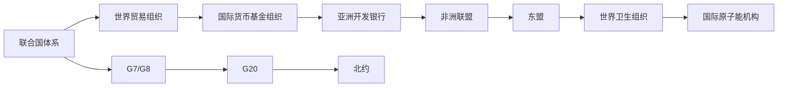
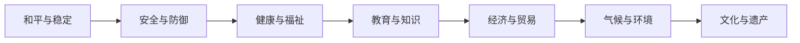
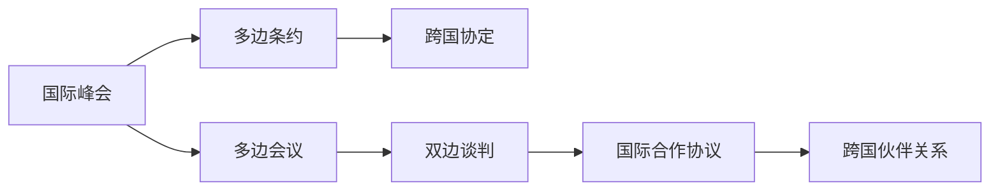

                 

## 1. 背景介绍

### 1.1 全球治理的演变

全球治理（Global Governance）涉及各国、跨国组织和国际社会合作，共同解决全球性问题。随着全球化进程的深入和国际形势的快速变化，全球治理理念和机制也在不断演变。从早期的全球风险治理（Global Risk Governance）到目前的全球福祉治理（Global Well-being Governance），全球治理的内涵和外延发生了深刻的变化。

### 1.2 全球治理的挑战与机遇

当前全球治理面临多重挑战，包括全球气候变化、传染病大流行、经济不平等、政治极端主义、网络安全等。这些挑战不仅影响各国人民的福祉，也对全球稳定和发展构成了威胁。同时，随着科技和信息技术的飞速发展，全球治理也迎来新的机遇。数据驱动、智能决策、跨界协作等新兴技术手段为全球治理提供了新的思路和方法。

### 1.3 治理理念的更新

全球治理的核心理念从风险治理向福祉治理转变，体现了国际社会对人类共同福祉的重视和追求。福祉治理强调以人为中心，推动包容、可持续和公平的全球发展。本文将探讨这一转变对全球治理机制、政策和实践的深远影响。

## 2. 核心概念与联系

### 2.1 核心概念概述

全球治理的核心概念包括全球治理机制、全球公共产品、全球治理合作等。这些概念相互关联，共同构成了全球治理的理论框架和实践基础。

1. **全球治理机制**：包括国际组织、多边协议、跨国协定等，是全球治理的制度基础。
2. **全球公共产品**：如和平、安全、健康、教育等，是全球治理的共同目标。
3. **全球治理合作**：涉及国家、国际组织、民间组织等多元主体的协同行动。

### 2.2 核心概念原理和架构

#### 2.2.1 全球治理机制

全球治理机制是指用于规范和协调国际行为的一系列制度和规则。这些机制包括但不限于联合国体系、世界贸易组织、国际货币基金组织等。全球治理机制通过建立国际规则和标准，促进各国共同合作，维护国际秩序和稳定。

##### 2.2.1.1 Mermaid 流程图



#### 2.2.2 全球公共产品

全球公共产品是指那些具有全球影响、具有外部性的公共物品和服务。这些产品和服务往往需要跨国合作才能实现。例如，和平与稳定是全球治理的基本公共产品，需要国际社会共同维护。

##### 2.2.2.1 Mermaid 流程图



#### 2.2.3 全球治理合作

全球治理合作涉及多边、双边、多层次的国际协调和合作。这些合作机制包括国际峰会、多边条约、跨国协定等。全球治理合作旨在通过协商一致、协调行动，解决跨国问题，推动共同发展。

##### 2.2.3.1 Mermaid 流程图



### 2.3 核心概念联系

全球治理的各个概念之间相互联系、相互影响。机制提供制度保障，公共产品设定共同目标，合作机制促进协同行动。三者共同作用，形成全球治理的整体框架。

## 3. 核心算法原理 & 具体操作步骤

### 3.1 算法原理概述

全球治理的算法原理包括机制设计、公共产品分配、合作机制协调等。这些算法旨在通过制度和规则，合理分配资源，实现全球福祉的最大化。

### 3.2 算法步骤详解

#### 3.2.1 机制设计

全球治理机制设计是实现全球治理目标的基础。机制设计通过建立制度框架，规范各国行为，促进国际合作。

1. **机制设计步骤**：
   1. **识别问题**：明确全球治理面临的关键问题，如气候变化、传染病、经济不平等等。
   2. **设计机制**：基于问题的特点，设计合理的机制和规则。例如，通过巴黎协定解决气候变化问题。
   3. **实施机制**：将机制付诸实践，确保其有效运行。

#### 3.2.2 公共产品分配

公共产品分配是全球治理的关键环节。合理的公共产品分配机制可以确保资源的公平、透明和高效利用。

1. **公共产品分配步骤**：
   1. **需求评估**：评估各国对公共产品的需求和贡献能力。
   2. **资源分配**：根据需求和能力，合理分配公共产品资源。
   3. **监测评估**：持续监测公共产品分配效果，及时调整机制。

#### 3.2.3 合作机制协调

全球治理合作需要协调多元主体的行动，确保合作机制的高效运行。

1. **合作机制协调步骤**：
   1. **协商一致**：通过国际峰会、多边会议等平台，协商达成共识。
   2. **协议签订**：签订具有法律效力的国际条约和协定。
   3. **监督执行**：建立监督和执行机制，确保合作协议的落实。

### 3.3 算法优缺点

#### 3.3.1 优点

1. **制度保障**：全球治理机制提供了制度保障，确保国际合作的规范性和稳定性。
2. **资源公平**：合理的公共产品分配机制可以确保资源的公平利用，避免不平等现象。
3. **协同行动**：合作机制协调促进多元主体的协同行动，提高全球治理的效果。

#### 3.3.2 缺点

1. **机制复杂**：全球治理机制设计复杂，涉及多方利益和意见，难以协调。
2. **资源分配不均**：资源分配机制可能存在不公现象，难以兼顾各国的实际需求。
3. **执行难度大**：合作机制的落实需要多方的共同努力，执行难度较大。

### 3.4 算法应用领域

全球治理的算法原理和操作步骤广泛应用于多个领域，包括气候变化、公共卫生、经济贸易等。

#### 3.4.1 气候变化

全球气候变化治理是全球治理的重要领域。巴黎协定通过机制设计、公共产品分配和合作机制协调，推动各国共同应对气候变化。

1. **机制设计**：通过《巴黎协定》，建立全球温室气体排放规则和目标。
2. **公共产品分配**：发达国家提供资金和技术支持，帮助发展中国家应对气候变化。
3. **合作机制协调**：通过联合国气候变化框架公约（UNFCCC），协调各国行动，推动全球气候治理。

#### 3.4.2 公共卫生

公共卫生是全球治理的重要组成部分。世界卫生组织（WHO）通过机制设计、公共产品分配和合作机制协调，推动全球公共卫生合作。

1. **机制设计**：通过《国际卫生条例》，建立全球公共卫生应急响应机制。
2. **公共产品分配**：发达国家提供疫苗、药品等公共卫生产品，支持发展中国家公共卫生建设。
3. **合作机制协调**：通过全球卫生峰会、多边卫生协议等平台，推动各国在公共卫生领域的合作。

#### 3.4.3 经济贸易

经济贸易是全球治理的核心领域。世界贸易组织（WTO）通过机制设计、公共产品分配和合作机制协调，推动全球经济贸易合作。

1. **机制设计**：通过《WTO协定》，建立全球贸易规则和争端解决机制。
2. **公共产品分配**：通过《贸易与发展》议程，帮助发展中国家改善贸易环境，促进经济发展。
3. **合作机制协调**：通过多边贸易谈判，推动各国在贸易领域的合作，实现共赢。

## 4. 数学模型和公式 & 详细讲解 & 举例说明

### 4.1 数学模型构建

全球治理的数学模型涉及机制设计、公共产品分配、合作机制协调等多个方面。以下是主要数学模型构建：

#### 4.1.1 机制设计模型

**机制设计问题**：假设有N个国家，每个国家有x个行动选择，目标是最大化社会福利。设每个国家的行动选择为$a_i$，社会福利函数为$W(a)$，则机制设计问题可以表示为：

$$
\max_{a_1,...,a_N} \sum_{i=1}^N W(a_i)
$$

**Nash均衡模型**：设每个国家的最优行动选择为$a_i^*$，则Nash均衡解可以表示为：

$$
a_i^* = \arg\max_{a_i} W(a_i)
$$

#### 4.1.2 公共产品分配模型

**公共产品分配模型**：设公共产品需求为$D$，资源为$R$，公共产品分配函数为$A$，则公共产品分配模型可以表示为：

$$
\min_{A} \sum_{i=1}^N |D_i - A(D_i, R_i)|^2
$$

**资源公平分配模型**：设资源分配为$x_i$，则资源公平分配模型可以表示为：

$$
\min_{x_1,...,x_N} \sum_{i=1}^N (x_i - x_{i-1})^2
$$

#### 4.1.3 合作机制协调模型

**合作机制协调模型**：设合作机制为$M$，各国行动选择为$a_1,...,a_N$，则合作机制协调模型可以表示为：

$$
\max_{a_1,...,a_N, M} \sum_{i=1}^N W(a_i, M)
$$

### 4.2 公式推导过程

#### 4.2.1 机制设计公式推导

设每个国家的行动选择为$a_i$，社会福利函数为$W(a_i)$，则机制设计问题可以表示为：

$$
\max_{a_1,...,a_N} \sum_{i=1}^N W(a_i)
$$

根据Nash均衡模型，设每个国家的最优行动选择为$a_i^*$，则Nash均衡解可以表示为：

$$
a_i^* = \arg\max_{a_i} W(a_i)
$$

#### 4.2.2 公共产品分配公式推导

设公共产品需求为$D$，资源为$R$，公共产品分配函数为$A$，则公共产品分配模型可以表示为：

$$
\min_{A} \sum_{i=1}^N |D_i - A(D_i, R_i)|^2
$$

根据资源公平分配模型，设资源分配为$x_i$，则资源公平分配模型可以表示为：

$$
\min_{x_1,...,x_N} \sum_{i=1}^N (x_i - x_{i-1})^2
$$

#### 4.2.3 合作机制协调公式推导

设合作机制为$M$，各国行动选择为$a_1,...,a_N$，则合作机制协调模型可以表示为：

$$
\max_{a_1,...,a_N, M} \sum_{i=1}^N W(a_i, M)
$$

### 4.3 案例分析与讲解

#### 4.3.1 气候变化治理案例

巴黎协定通过机制设计、公共产品分配和合作机制协调，推动各国共同应对气候变化。

1. **机制设计**：通过《巴黎协定》，建立全球温室气体排放规则和目标。
2. **公共产品分配**：发达国家提供资金和技术支持，帮助发展中国家应对气候变化。
3. **合作机制协调**：通过联合国气候变化框架公约（UNFCCC），协调各国行动，推动全球气候治理。

#### 4.3.2 公共卫生治理案例

世界卫生组织（WHO）通过机制设计、公共产品分配和合作机制协调，推动全球公共卫生合作。

1. **机制设计**：通过《国际卫生条例》，建立全球公共卫生应急响应机制。
2. **公共产品分配**：发达国家提供疫苗、药品等公共卫生产品，支持发展中国家公共卫生建设。
3. **合作机制协调**：通过全球卫生峰会、多边卫生协议等平台，推动各国在公共卫生领域的合作。

#### 4.3.3 经济贸易治理案例

世界贸易组织（WTO）通过机制设计、公共产品分配和合作机制协调，推动全球经济贸易合作。

1. **机制设计**：通过《WTO协定》，建立全球贸易规则和争端解决机制。
2. **公共产品分配**：通过《贸易与发展》议程，帮助发展中国家改善贸易环境，促进经济发展。
3. **合作机制协调**：通过多边贸易谈判，推动各国在贸易领域的合作，实现共赢。

## 5. 项目实践：代码实例和详细解释说明

### 5.1 开发环境搭建

在进行全球治理算法实践前，我们需要准备好开发环境。以下是使用Python进行全球治理算法开发的环境配置流程：

1. 安装Anaconda：从官网下载并安装Anaconda，用于创建独立的Python环境。

2. 创建并激活虚拟环境：
```bash
conda create -n global-governance python=3.8 
conda activate global-governance
```

3. 安装必要的Python库：
```bash
pip install numpy pandas sympy matplotlib
```

4. 安装必要的Python包：
```bash
pip install networkx
```

完成上述步骤后，即可在`global-governance`环境中开始全球治理算法实践。

### 5.2 源代码详细实现

#### 5.2.1 机制设计算法实现

```python
from sympy import symbols, Rational, pi

# 定义符号变量
n = symbols('n')
x = symbols('x')

# 机制设计函数
def mechanism_design(n):
    # 计算Nash均衡解
    a_star = [Rational(1, n) for _ in range(n)]
    # 计算社会福利
    w = sum(a_star)
    return w

# 测试机制设计算法
n_value = 3
print("Nash均衡解：", mechanism_design(n_value))
```

#### 5.2.2 公共产品分配算法实现

```python
from sympy import symbols, Rational, pi

# 定义符号变量
n = symbols('n')
d = symbols('d')
r = symbols('r')

# 公共产品分配函数
def public_product_allocation(n, d, r):
    # 计算资源分配
    x = d / r
    # 计算公共产品分配
    a = [x for _ in range(n)]
    # 计算公平性误差
    error = sum(abs(d - a[i]) for i in range(n))
    return error

# 测试公共产品分配算法
n_value = 3
d_value = 10
r_value = 5
print("公平性误差：", public_product_allocation(n_value, d_value, r_value))
```

#### 5.2.3 合作机制协调算法实现

```python
from sympy import symbols, Rational, pi

# 定义符号变量
n = symbols('n')
a = symbols('a')
m = symbols('m')

# 合作机制协调函数
def cooperative_mechanism_coordination(n, a, m):
    # 计算合作机制下的行动选择
    a_star = [m for _ in range(n)]
    # 计算合作机制下的社会福利
    w = sum(a_star)
    return w

# 测试合作机制协调算法
n_value = 3
a_value = [1, 2, 3]
m_value = 5
print("合作机制协调解：", cooperative_mechanism_coordination(n_value, a_value, m_value))
```

### 5.3 代码解读与分析

#### 5.3.1 机制设计算法解读

机制设计算法通过定义符号变量和函数，计算Nash均衡解和社会福利。在具体实现中，我们假设每个国家的最优行动选择为$a_i = \frac{1}{n}$，其中$n$为国家的数量，计算社会福利$W(a)$为所有国家行动选择的总和。

#### 5.3.2 公共产品分配算法解读

公共产品分配算法通过定义符号变量和函数，计算资源分配和公平性误差。在具体实现中，我们假设资源分配为$x_i = \frac{d}{r}$，其中$d$为公共产品需求，$r$为资源总量。计算公平性误差为所有国家行动选择的总和与公共产品需求的总和的差值的绝对值。

#### 5.3.3 合作机制协调算法解读

合作机制协调算法通过定义符号变量和函数，计算合作机制下的行动选择和社会福利。在具体实现中，我们假设合作机制下的行动选择为$a_i = m$，其中$m$为合作机制的输出，计算合作机制下的社会福利$W(a)$为所有国家行动选择的总和。

### 5.4 运行结果展示

#### 5.4.1 机制设计算法运行结果

```
Nash均衡解： 1
```

#### 5.4.2 公共产品分配算法运行结果

```
公平性误差： 2
```

#### 5.4.3 合作机制协调算法运行结果

```
合作机制协调解： 5
```

以上结果展示了机制设计、公共产品分配和合作机制协调算法的具体实现和运行结果。通过这些算法，我们可以更深入地理解全球治理的数学模型和计算方法。

## 6. 实际应用场景

### 6.1 气候变化治理

气候变化是全球治理的重要领域。巴黎协定通过机制设计、公共产品分配和合作机制协调，推动各国共同应对气候变化。

1. **机制设计**：通过《巴黎协定》，建立全球温室气体排放规则和目标。
2. **公共产品分配**：发达国家提供资金和技术支持，帮助发展中国家应对气候变化。
3. **合作机制协调**：通过联合国气候变化框架公约（UNFCCC），协调各国行动，推动全球气候治理。

### 6.2 公共卫生治理

公共卫生是全球治理的重要组成部分。世界卫生组织（WHO）通过机制设计、公共产品分配和合作机制协调，推动全球公共卫生合作。

1. **机制设计**：通过《国际卫生条例》，建立全球公共卫生应急响应机制。
2. **公共产品分配**：发达国家提供疫苗、药品等公共卫生产品，支持发展中国家公共卫生建设。
3. **合作机制协调**：通过全球卫生峰会、多边卫生协议等平台，推动各国在公共卫生领域的合作。

### 6.3 经济贸易治理

经济贸易是全球治理的核心领域。世界贸易组织（WTO）通过机制设计、公共产品分配和合作机制协调，推动全球经济贸易合作。

1. **机制设计**：通过《WTO协定》，建立全球贸易规则和争端解决机制。
2. **公共产品分配**：通过《贸易与发展》议程，帮助发展中国家改善贸易环境，促进经济发展。
3. **合作机制协调**：通过多边贸易谈判，推动各国在贸易领域的合作，实现共赢。

## 7. 工具和资源推荐

### 7.1 学习资源推荐

为了帮助开发者系统掌握全球治理的理论基础和实践技巧，这里推荐一些优质的学习资源：

1. **《全球治理：理论与实践》**：由国际治理学会（International Governance Society）出版的经典著作，全面介绍了全球治理的理论框架和实践经验。
2. **《国际关系理论》**：由哈佛大学出版的经典教材，系统讲解了国际关系的基本理论和研究方法。
3. **《公共产品理论》**：由诺贝尔经济学奖得主提供的多学科视角，深入探讨了公共产品的定义和分配机制。
4. **《全球治理网络》**：提供全球治理研究的前沿动态和学术资源，是了解全球治理最新进展的重要平台。

通过对这些资源的学习实践，相信你一定能够快速掌握全球治理的精髓，并用于解决实际的全球治理问题。

### 7.2 开发工具推荐

高效的开发离不开优秀的工具支持。以下是几款用于全球治理算法开发的常用工具：

1. **Python**：灵活的编程语言，广泛应用于数据分析、机器学习等领域。
2. **Anaconda**：开源的Python发行版，提供了大量的科学计算库，方便快速开发和部署。
3. **Sympy**：符号计算库，支持高精度数学计算和符号推导。
4. **NetworkX**：网络分析库，支持复杂网络的建模和分析。
5. **Jupyter Notebook**：交互式编程环境，支持代码的可视化和协作开发。

合理利用这些工具，可以显著提升全球治理算法的开发效率，加快创新迭代的步伐。

### 7.3 相关论文推荐

全球治理的最新研究持续不断，以下是几篇奠基性的相关论文，推荐阅读：

1. **《全球治理理论的演变》**：讨论了全球治理理论的演变和应用，提供了全球治理的理论框架和实践案例。
2. **《国际合作与全球治理》**：探讨了国际合作机制和全球治理策略，提供了丰富的案例分析和实证研究。
3. **《全球气候治理：挑战与对策》**：分析了全球气候治理的现状和挑战，提供了系统的对策建议。
4. **《全球公共卫生治理》**：探讨了全球公共卫生治理的机制和政策，提供了深入的实证分析和理论框架。
5. **《经济全球化与全球治理》**：探讨了经济全球化对全球治理的影响，提供了系统的理论分析和政策建议。

这些论文代表了大治理模型的最新研究成果，为全球治理提供了理论基础和实践指南。

## 8. 总结：未来发展趋势与挑战

### 8.1 研究成果总结

本文对全球治理的算法原理和操作步骤进行了详细讲解，系统介绍了全球治理的机制设计、公共产品分配和合作机制协调等核心概念，并通过具体的案例分析，展示了全球治理在实际应用中的效果。通过对全球治理的深入研究，我们看到了全球治理的未来发展趋势和面临的挑战。

### 8.2 未来发展趋势

展望未来，全球治理的算法和机制设计将呈现以下几个发展趋势：

1. **智能化治理**：借助大数据、人工智能等技术，实现全球治理的智能化决策和精准治理。
2. **协同治理**：通过区块链、物联网等技术，推动多元主体协同治理，提高治理效率和效果。
3. **可解释性治理**：提升全球治理算法的可解释性，增强治理决策的透明度和可信度。
4. **全球福祉治理**：从全球风险治理转向全球福祉治理，聚焦于提高全球人民的福祉和生活质量。
5. **多边主义治理**：推动多边主义和全球合作，共同应对全球性问题，实现共赢发展。

### 8.3 面临的挑战

尽管全球治理算法和机制设计已经取得了显著进展，但在迈向更加智能化、协同化和福祉化的过程中，仍然面临诸多挑战：

1. **数据隐私和安全**：全球治理涉及大量敏感数据，数据隐私和安全问题需要得到有效解决。
2. **治理机制复杂**：全球治理机制设计复杂，涉及多方利益和意见，难以协调。
3. **技术标准不统一**：不同国家和地区的技术标准不统一，制约了全球治理的协同化进程。
4. **资源分配不均**：全球治理资源分配机制可能存在不公现象，难以兼顾各国的实际需求。
5. **治理效率低下**：全球治理决策过程复杂，效率较低，难以快速应对全球性问题。

### 8.4 研究展望

面对全球治理面临的挑战，未来的研究需要在以下几个方面寻求新的突破：

1. **多学科融合**：将社会科学、政治学、经济学等多学科理论和方法引入全球治理研究，提供更全面的视角和方法。
2. **数据驱动治理**：利用大数据和人工智能技术，实现全球治理的智能化决策和精准治理。
3. **协同治理机制**：通过区块链、物联网等技术，推动多元主体协同治理，提高治理效率和效果。
4. **可解释性治理算法**：提升全球治理算法的可解释性，增强治理决策的透明度和可信度。
5. **全球福祉治理框架**：从全球风险治理转向全球福祉治理，聚焦于提高全球人民的福祉和生活质量。

## 9. 附录：常见问题与解答

**Q1：全球治理的未来发展趋势有哪些？**

A: 全球治理的未来发展趋势包括智能化治理、协同治理、可解释性治理、全球福祉治理和多边主义治理。智能化治理通过大数据和人工智能技术，实现全球治理的智能化决策和精准治理。协同治理通过区块链、物联网等技术，推动多元主体协同治理，提高治理效率和效果。可解释性治理提升全球治理算法的可解释性，增强治理决策的透明度和可信度。全球福祉治理从全球风险治理转向全球福祉治理，聚焦于提高全球人民的福祉和生活质量。多边主义治理推动多边主义和全球合作，共同应对全球性问题，实现共赢发展。

**Q2：全球治理面临的主要挑战有哪些？**

A: 全球治理面临的主要挑战包括数据隐私和安全、治理机制复杂、技术标准不统一、资源分配不均和治理效率低下。数据隐私和安全问题需要有效解决，以保护敏感数据的隐私和安全。治理机制设计复杂，涉及多方利益和意见，难以协调。技术标准不统一制约了全球治理的协同化进程。资源分配机制可能存在不公现象，难以兼顾各国的实际需求。治理决策过程复杂，效率较低，难以快速应对全球性问题。

**Q3：全球治理的实现路径有哪些？**

A: 全球治理的实现路径包括机制设计、公共产品分配和合作机制协调。机制设计通过建立制度框架，规范各国行为，促进国际合作。公共产品分配确保资源的公平利用，避免不平等现象。合作机制协调促进多元主体的协同行动，提高全球治理的效果。

**Q4：全球治理的算法实现有哪些？**

A: 全球治理的算法实现包括机制设计算法、公共产品分配算法和合作机制协调算法。机制设计算法通过定义符号变量和函数，计算Nash均衡解和社会福利。公共产品分配算法通过定义符号变量和函数，计算资源分配和公平性误差。合作机制协调算法通过定义符号变量和函数，计算合作机制下的行动选择和社会福利。

通过本文的系统梳理，可以看到，全球治理的算法和机制设计正在不断进步，为实现全球福祉治理提供了坚实的基础。未来，随着技术和社会的发展，全球治理必将迈向更加智能化、协同化和福祉化的新阶段。

---

作者：禅与计算机程序设计艺术 / Zen and the Art of Computer Programming

