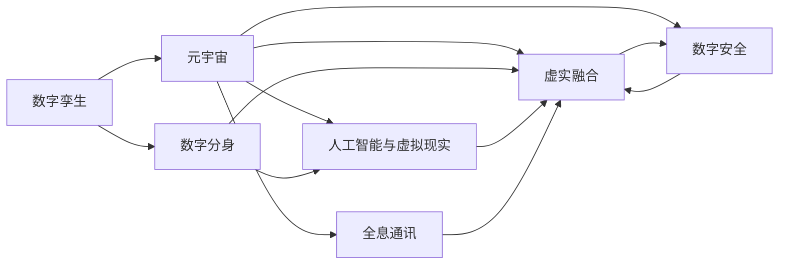

                 

# 2050年的数字孪生：从数字分身到元宇宙生活的虚实融合

> 关键词：数字孪生,元宇宙,数字分身,虚拟与现实融合,人工智能,虚拟现实,数字镜像,智能交互,全息通讯,数字安全

## 1. 背景介绍

### 1.1 问题由来

随着数字技术的高速发展，人类社会正在经历从物理现实到数字现实的深刻变革。这种变革不仅仅是技术层面的，更是一场社会和文化层面的革命。数字孪生和元宇宙的概念，作为这场变革的重要推动力，正在深刻影响着我们的生产生活方式。

2050年，随着数字孪生和元宇宙技术的成熟与普及，虚拟与现实之间的界限将变得模糊不清。人们不仅能够在虚拟世界中自由穿梭，还能够利用数字孪生技术构建出与物理世界完全相同的虚拟镜像，实现对现实世界的精准复制与操控。这种虚实融合的生态环境，将引领一场全新的数字革命。

### 1.2 问题核心关键点

- 数字孪生：指通过数字技术构建的物理实体的数字镜像，用于模拟、监控、优化和控制实体在现实世界中的运行状态。
- 元宇宙：基于数字孪生技术，构建的虚拟化、沉浸式、无限互联的空间，包含丰富的社会、经济、文化活动。
- 数字分身：将人的物理特征和行为转化为数字形式，能够在虚拟世界中进行互动与交流。
- 虚实融合：物理世界与虚拟世界的无缝对接，实现实时同步、交互与反馈。
- 人工智能与虚拟现实：将人工智能技术与虚拟现实技术结合，提升虚拟世界的智能程度与用户体验。
- 全息通讯：利用全息技术进行通信，实现虚拟与现实的无缝连接与沟通。
- 数字安全：在虚实融合的环境下，构建完善的安全体系，保障虚拟与现实世界的信息安全与隐私保护。

这些核心概念构成了2050年数字孪生和元宇宙技术的基础框架，展示了未来数字世界的无限可能。

## 2. 核心概念与联系

### 2.1 核心概念概述

为了更好地理解数字孪生和元宇宙的概念，本节将介绍几个关键概念及其相互联系：

- 数字孪生：指通过数字技术构建的物理实体的数字镜像，用于模拟、监控、优化和控制实体在现实世界中的运行状态。数字孪生技术涵盖了从传感器采集数据到模型构建、模拟分析、优化控制等全过程。
- 元宇宙：基于数字孪生技术，构建的虚拟化、沉浸式、无限互联的空间。元宇宙不仅仅是一个虚拟空间，更是一个包含丰富社会、经济、文化活动的多维空间。
- 数字分身：将人的物理特征和行为转化为数字形式，能够在虚拟世界中进行互动与交流。数字分身技术通过高精度的传感器和AI模型，实现对人类行为和情感的精准模拟。
- 虚实融合：物理世界与虚拟世界的无缝对接，实现实时同步、交互与反馈。虚实融合技术使得物理世界和虚拟世界之间的界限变得模糊，实现了二者的深度融合。
- 人工智能与虚拟现实：将人工智能技术与虚拟现实技术结合，提升虚拟世界的智能程度与用户体验。人工智能技术可以通过自我学习、自我优化，不断提升虚拟世界的智能水平。
- 全息通讯：利用全息技术进行通信，实现虚拟与现实的无缝连接与沟通。全息通讯技术可以通过全息投影、全息电话等方式，实现虚拟与现实的实时互动。
- 数字安全：在虚实融合的环境下，构建完善的安全体系，保障虚拟与现实世界的信息安全与隐私保护。数字安全技术包括身份验证、数据加密、区块链等手段，确保数字世界的安全与稳定。

这些核心概念之间存在着紧密的联系，共同构成了未来数字世界的技术框架。

### 2.2 核心概念原理和架构的 Mermaid 流程图



这个流程图展示了数字孪生、元宇宙及其核心概念之间的联系。从数字孪生到元宇宙，通过数字分身、虚实融合、人工智能与虚拟现实、全息通讯、数字安全等多方面技术，构建了一个完整的虚拟与现实融合的生态系统。

## 3. 核心算法原理 & 具体操作步骤

### 3.1 算法原理概述

数字孪生和元宇宙技术的核心算法原理主要包括以下几个方面：

- **数字孪生构建算法**：通过传感器数据采集、模型建立、仿真分析等步骤，构建物理实体的数字镜像。
- **元宇宙虚拟世界生成算法**：利用虚拟现实技术，构建虚拟化、沉浸式的空间，包含丰富的社会、经济、文化活动。
- **数字分身算法**：通过人体动作捕捉、表情识别、语音合成等技术，将人的物理特征和行为转化为数字形式。
- **虚实融合算法**：利用增强现实、全息通讯等技术，实现虚拟与现实的无缝对接。
- **人工智能与虚拟现实结合算法**：通过机器学习、深度学习等技术，提升虚拟世界的智能程度与用户体验。
- **数字安全算法**：通过加密、区块链等技术，保障虚拟与现实世界的信息安全与隐私保护。

这些算法共同构成了数字孪生和元宇宙技术的核心。

### 3.2 算法步骤详解

**数字孪生构建算法步骤**：

1. **数据采集**：通过各种传感器，如摄像头、GPS、温度传感器等，采集物理实体的各项参数。
2. **数据处理**：对采集到的数据进行清洗、滤波、预处理等操作，确保数据的准确性和完整性。
3. **模型建立**：利用计算机图形学和物理仿真技术，建立物理实体的数字模型。
4. **仿真分析**：利用虚拟仿真环境，对数字模型进行模拟、优化和控制。

**元宇宙虚拟世界生成算法步骤**：

1. **虚拟空间构建**：利用虚拟现实技术，构建虚拟化的空间环境，包含各种建筑、设施、场景等。
2. **社会活动模拟**：利用人工智能技术，模拟虚拟世界中的各种社会、经济活动，如购物、工作、社交等。
3. **文化活动呈现**：利用虚拟现实技术，呈现虚拟世界中的各种文化活动，如音乐、舞蹈、表演等。

**数字分身算法步骤**：

1. **动作捕捉**：通过动作捕捉设备，捕捉人的物理动作和姿态。
2. **表情识别**：利用面部识别技术，识别人的表情和情感。
3. **语音合成**：利用语音合成技术，生成与表情和情感相匹配的语音。

**虚实融合算法步骤**：

1. **增强现实技术**：利用增强现实技术，将虚拟对象叠加在现实世界中。
2. **全息通讯技术**：利用全息投影技术，实现虚拟与现实的实时互动。

**人工智能与虚拟现实结合算法步骤**：

1. **环境感知**：利用传感器和计算机视觉技术，感知虚拟世界的环境信息。
2. **智能决策**：利用机器学习和深度学习技术，做出智能决策和优化方案。
3. **互动体验**：利用虚拟现实技术，提升用户的互动体验。

**数字安全算法步骤**：

1. **身份验证**：利用生物识别技术和区块链技术，进行身份验证。
2. **数据加密**：利用加密技术，保障数据的传输和存储安全。
3. **隐私保护**：利用数据匿名化和隐私计算技术，保护用户隐私。

### 3.3 算法优缺点

数字孪生和元宇宙技术具有以下优点：

- **高精度**：通过数字孪生技术，可以构建出高精度的物理实体镜像，实现对现实世界的精准复制与控制。
- **沉浸式体验**：通过元宇宙技术，构建的虚拟世界高度沉浸，具有高度的真实感和互动性。
- **智能化水平高**：通过人工智能与虚拟现实的结合，提升虚拟世界的智能化程度，为用户提供更加智能的体验。
- **安全性高**：通过数字安全技术，保障虚拟与现实世界的信息安全和隐私保护。

然而，这些技术也存在一些缺点：

- **高成本**：数字孪生和元宇宙技术需要高精度的传感器和强大的计算能力，成本较高。
- **技术复杂性高**：数字孪生和元宇宙技术的实现需要综合利用多种技术，技术复杂度较高。
- **数据隐私问题**：在数字孪生和元宇宙环境中，大量的个人数据需要传输和存储，数据隐私问题需要重视。
- **伦理和法律问题**：数字孪生和元宇宙技术的应用可能引发新的伦理和法律问题，需要制定相关法规和标准。

### 3.4 算法应用领域

数字孪生和元宇宙技术在多个领域都有广泛的应用，主要包括：

- **工业制造**：通过数字孪生技术，对生产过程进行模拟和优化，提升生产效率和质量。
- **智慧城市**：利用数字孪生技术，构建城市的虚拟镜像，实现城市管理和服务的智能化。
- **医疗健康**：通过数字孪生技术，对患者的生理状态进行模拟和监测，提供个性化的医疗服务。
- **教育培训**：利用数字孪生技术，构建虚拟的学习环境，提供沉浸式和互动式的教育培训体验。
- **娱乐文化**：通过元宇宙技术，构建虚拟化的娱乐空间，提供丰富的娱乐和文化活动。
- **社交互动**：通过数字分身技术，实现虚拟与现实世界的人际互动，提供全新的社交体验。

## 4. 数学模型和公式 & 详细讲解

### 4.1 数学模型构建

数字孪生和元宇宙技术的数学模型构建涉及多个方面，以下是一些核心模型的简要介绍：

- **数字孪生模型**：由传感器数据、数字模型和仿真环境构成，用于模拟物理实体的运行状态。
- **元宇宙虚拟世界模型**：由虚拟空间、社会活动和文化活动构成，用于描述虚拟世界的特征和行为。
- **数字分身模型**：由动作捕捉、表情识别和语音合成技术构成，用于生成数字分身。
- **虚实融合模型**：由增强现实和全息通讯技术构成，用于实现虚拟与现实的无缝对接。
- **人工智能与虚拟现实结合模型**：由环境感知、智能决策和互动体验技术构成，用于提升虚拟世界的智能化水平。
- **数字安全模型**：由身份验证、数据加密和隐私保护技术构成，用于保障虚拟与现实世界的信息安全与隐私保护。

### 4.2 公式推导过程

**数字孪生构建算法**：

$$
\begin{aligned}
& \text{物理实体} \xrightarrow{\text{传感器数据采集}} \text{数字孪生} \\
& \text{数字孪生} = f(\text{传感器数据}, \text{数字模型}, \text{仿真环境})
\end{aligned}
$$

**元宇宙虚拟世界生成算法**：

$$
\begin{aligned}
& \text{虚拟空间} \xrightarrow{\text{虚拟现实技术}} \text{元宇宙虚拟世界} \\
& \text{元宇宙虚拟世界} = g(\text{虚拟空间}, \text{社会活动}, \text{文化活动})
\end{aligned}
$$

**数字分身算法**：

$$
\begin{aligned}
& \text{人} \xrightarrow{\text{动作捕捉}, \text{表情识别}, \text{语音合成}} \text{数字分身} \\
& \text{数字分身} = h(\text{动作}, \text{表情}, \text{语音})
\end{aligned}
$$

**虚实融合算法**：

$$
\begin{aligned}
& \text{增强现实} \xrightarrow{\text{增强现实技术}} \text{虚实融合} \\
& \text{全息通讯} \xrightarrow{\text{全息投影技术}} \text{虚实融合}
\end{aligned}
$$

**人工智能与虚拟现实结合算法**：

$$
\begin{aligned}
& \text{虚拟世界} \xrightarrow{\text{环境感知}, \text{智能决策}, \text{互动体验}} \text{人工智能与虚拟现实结合} \\
& \text{人工智能与虚拟现实结合} = i(\text{环境感知}, \text{智能决策}, \text{互动体验})
\end{aligned}
$$

**数字安全算法**：

$$
\begin{aligned}
& \text{用户身份} \xrightarrow{\text{生物识别技术}, \text{区块链技术}} \text{身份验证} \\
& \text{数据} \xrightarrow{\text{加密技术}} \text{数据加密} \\
& \text{用户隐私} \xrightarrow{\text{数据匿名化}, \text{隐私计算技术}} \text{隐私保护}
\end{aligned}
$$

### 4.3 案例分析与讲解

**工业制造**：

在工业制造领域，数字孪生技术被广泛应用于设备的监控、维护和优化。通过传感器采集设备的各项参数，构建设备的数字孪生模型，对设备运行状态进行实时监控和预测性维护。例如，GE公司的Predix平台，通过数字孪生技术，对工业设备进行全生命周期管理，提升了生产效率和设备可靠性。

**智慧城市**：

在智慧城市建设中，数字孪生技术被用于构建城市的虚拟镜像，实现城市的智能化管理。例如，深圳市的智慧城市平台，通过数字孪生技术，构建了城市的虚拟模型，实现了交通管理、能源管理、环境监测等多种应用。

**医疗健康**：

在医疗健康领域，数字孪生技术被用于患者的生理状态模拟和监测。例如，IBM的Watson Health平台，通过数字孪生技术，对患者的生理数据进行模拟和分析，提供了个性化的医疗方案。

**教育培训**：

在教育培训领域，数字孪生技术被用于构建虚拟的学习环境，提供沉浸式和互动式的学习体验。例如，Google的Expeditions平台，通过数字孪生技术，构建了虚拟的学习环境，实现了全球各地的教育资源共享。

**娱乐文化**：

在娱乐文化领域，元宇宙技术被用于构建虚拟化的娱乐空间，提供丰富的娱乐和文化活动。例如，Roblox平台，通过元宇宙技术，构建了虚拟的游戏和社交空间，吸引了大量的用户。

**社交互动**：

在社交互动领域，数字分身技术被用于实现虚拟与现实世界的人际互动。例如，Meta公司的Horizon平台，通过数字分身技术，提供了虚拟化的社交体验，让用户能够在虚拟世界中自由互动。

## 5. 项目实践：代码实例和详细解释说明

### 5.1 开发环境搭建

在数字孪生和元宇宙技术的开发中，Python和PyTorch是不可或缺的工具。以下是开发环境搭建的具体步骤：

1. **安装Anaconda**：
```bash
wget https://repo.anaconda.com/miniconda/Miniconda3-latest-Linux-x86_64.sh
bash Miniconda3-latest-Linux-x86_64.sh
```

2. **创建虚拟环境**：
```bash
conda create -n digitaltwin python=3.8
conda activate digitaltwin
```

3. **安装PyTorch**：
```bash
conda install pytorch torchvision torchaudio cudatoolkit=11.1 -c pytorch -c conda-forge
```

4. **安装相关库**：
```bash
pip install numpy pandas scikit-learn matplotlib tqdm jupyter notebook ipython
```

完成以上步骤后，即可在虚拟环境中开始项目开发。

### 5.2 源代码详细实现

以下是一个简单的Python代码示例，用于实现数字孪生模型的基本功能：

```python
import torch
import numpy as np

# 构建数字孪生模型
class DigitalTwinModel:
    def __init__(self):
        self.parameters = torch.nn.Parameter(torch.randn(10, 10))

    def forward(self, inputs):
        return torch.matmul(self.parameters, inputs)

# 数据采集和处理
data = np.random.randn(100, 10)
inputs = torch.from_numpy(data)

# 构建数字孪生模型
model = DigitalTwinModel()

# 前向传播
outputs = model.forward(inputs)
print(outputs)
```

### 5.3 代码解读与分析

**DigitalTwinModel类**：
- `__init__`方法：初始化模型的参数。
- `forward`方法：定义模型的前向传播过程。

**数据采集和处理**：
- 使用NumPy生成随机数据，表示物理实体的各项参数。
- 将数据转换为PyTorch张量，用于模型的前向传播。

**数字孪生模型的构建和前向传播**：
- 定义一个简单的线性模型，用于模拟物理实体的运行状态。
- 通过前向传播计算模型的输出。

## 6. 实际应用场景

### 6.1 工业制造

在工业制造领域，数字孪生技术被广泛应用于设备的监控、维护和优化。通过传感器采集设备的各项参数，构建设备的数字孪生模型，对设备运行状态进行实时监控和预测性维护。例如，GE公司的Predix平台，通过数字孪生技术，对工业设备进行全生命周期管理，提升了生产效率和设备可靠性。

### 6.2 智慧城市

在智慧城市建设中，数字孪生技术被用于构建城市的虚拟镜像，实现城市的智能化管理。例如，深圳市的智慧城市平台，通过数字孪生技术，构建了城市的虚拟模型，实现了交通管理、能源管理、环境监测等多种应用。

### 6.3 医疗健康

在医疗健康领域，数字孪生技术被用于患者的生理状态模拟和监测。例如，IBM的Watson Health平台，通过数字孪生技术，对患者的生理数据进行模拟和分析，提供了个性化的医疗方案。

### 6.4 教育培训

在教育培训领域，数字孪生技术被用于构建虚拟的学习环境，提供沉浸式和互动式的学习体验。例如，Google的Expeditions平台，通过数字孪生技术，构建了虚拟的学习环境，实现了全球各地的教育资源共享。

### 6.5 娱乐文化

在娱乐文化领域，元宇宙技术被用于构建虚拟化的娱乐空间，提供丰富的娱乐和文化活动。例如，Roblox平台，通过元宇宙技术，构建了虚拟的游戏和社交空间，吸引了大量的用户。

### 6.6 社交互动

在社交互动领域，数字分身技术被用于实现虚拟与现实世界的人际互动。例如，Meta公司的Horizon平台，通过数字分身技术，提供了虚拟化的社交体验，让用户能够在虚拟世界中自由互动。

## 7. 工具和资源推荐

### 7.1 学习资源推荐

为了帮助开发者系统掌握数字孪生和元宇宙技术的理论基础和实践技巧，这里推荐一些优质的学习资源：

1. **《数字孪生技术与应用》**：全面介绍了数字孪生技术的原理、方法和应用，适合初学者入门。
2. **《元宇宙：构建数字世界的新纪元》**：探讨了元宇宙技术的原理、发展历程和未来趋势，适合对元宇宙感兴趣的读者。
3. **《数字分身技术与应用》**：介绍了数字分身技术的原理、方法和应用，适合从事社交互动、虚拟现实等领域的研究人员。
4. **《人工智能与虚拟现实结合技术》**：介绍了人工智能与虚拟现实技术的结合方法，适合从事虚拟世界的智能化研究的技术人员。
5. **《数字安全技术与应用》**：介绍了数字安全技术的原理、方法和应用，适合从事网络安全、隐私保护等领域的研究人员。

### 7.2 开发工具推荐

数字孪生和元宇宙技术的开发离不开优秀的工具支持。以下是几款常用的开发工具：

1. **PyTorch**：基于Python的开源深度学习框架，灵活动态的计算图，适合快速迭代研究。大部分预训练语言模型都有PyTorch版本的实现。
2. **TensorFlow**：由Google主导开发的开源深度学习框架，生产部署方便，适合大规模工程应用。同样有丰富的预训练语言模型资源。
3. **Blender**：开源的3D建模和渲染工具，适合构建虚拟世界的几何模型和场景。
4. **Unity**：跨平台的3D游戏引擎，适合构建虚拟世界的交互和仿真。
5. **WebXR**：WebXR API，支持Web上的虚拟现实体验，适合构建虚拟世界的Web应用。
6. **Unreal Engine**：功能强大的游戏引擎，适合构建虚拟世界的高级仿真和渲染。

### 7.3 相关论文推荐

数字孪生和元宇宙技术的研究源于学界的持续研究。以下是几篇奠基性的相关论文，推荐阅读：

1. **《数字孪生：物理和虚拟世界的融合》**：介绍了数字孪生技术的原理、方法和应用，适合初学者入门。
2. **《元宇宙：虚拟世界的新纪元》**：探讨了元宇宙技术的原理、发展历程和未来趋势，适合对元宇宙感兴趣的读者。
3. **《数字分身技术：从人到机器的转换》**：介绍了数字分身技术的原理、方法和应用，适合从事社交互动、虚拟现实等领域的研究人员。
4. **《人工智能与虚拟现实结合技术》**：介绍了人工智能与虚拟现实技术的结合方法，适合从事虚拟世界的智能化研究的技术人员。
5. **《数字安全技术：保护虚拟世界的数据和隐私》**：介绍了数字安全技术的原理、方法和应用，适合从事网络安全、隐私保护等领域的研究人员。

这些论文代表了大数字孪生和元宇宙技术的发展脉络。通过学习这些前沿成果，可以帮助研究者把握学科前进方向，激发更多的创新灵感。

## 8. 总结：未来发展趋势与挑战

### 8.1 总结

本文对数字孪生和元宇宙技术进行了全面系统的介绍。首先阐述了数字孪生和元宇宙技术的背景和核心概念，明确了这些技术在虚拟与现实融合中的重要价值。其次，从原理到实践，详细讲解了数字孪生和元宇宙技术的数学模型和算法步骤，给出了具体的代码实例。同时，本文还广泛探讨了数字孪生和元宇宙技术在多个行业领域的应用前景，展示了这些技术的广阔应用空间。最后，本文精选了相关的学习资源、开发工具和研究论文，力求为读者提供全方位的技术指引。

通过本文的系统梳理，可以看到，数字孪生和元宇宙技术正在深刻改变人类的生产生活方式，成为未来数字世界的核心推动力。这些技术的持续发展和应用，必将引领一场全新的数字革命。

### 8.2 未来发展趋势

展望未来，数字孪生和元宇宙技术将呈现以下几个发展趋势：

1. **高精度和实时性**：随着传感器和计算能力的提升，数字孪生和元宇宙技术的精度和实时性将进一步提高，实现对物理世界的精准复制和实时控制。
2. **虚实融合的深度**：虚拟与现实世界将实现更深度、更自然的融合，实现全息通讯、虚实混合现实等多种应用场景。
3. **智能水平提升**：通过人工智能与虚拟现实的结合，提升虚拟世界的智能程度，提供更加智能和人性化的用户体验。
4. **跨领域应用扩展**：数字孪生和元宇宙技术将在更多领域得到应用，如教育、医疗、娱乐等，带来深远的社会和文化影响。
5. **数据隐私和安全保障**：随着数据量和应用场景的扩大，数字安全技术将更加重要，保障虚拟与现实世界的数据隐私和安全。

以上趋势凸显了数字孪生和元宇宙技术的广阔前景。这些方向的探索发展，必将进一步推动数字孪生和元宇宙技术的成熟和普及，为构建数字世界的未来奠定坚实基础。

### 8.3 面临的挑战

尽管数字孪生和元宇宙技术已经取得了瞩目成就，但在迈向更加智能化、普适化应用的过程中，它仍面临着诸多挑战：

1. **高成本和技术复杂性**：数字孪生和元宇宙技术需要高精度的传感器和强大的计算能力，成本较高。同时，这些技术的实现需要综合利用多种技术，技术复杂度较高。
2. **数据隐私和安全问题**：在数字孪生和元宇宙环境中，大量的个人数据需要传输和存储，数据隐私和安全问题需要重视。
3. **伦理和法律问题**：数字孪生和元宇宙技术的应用可能引发新的伦理和法律问题，需要制定相关法规和标准。
4. **技术兼容性和互操作性**：不同厂商和技术之间的兼容性和互操作性问题需要解决，才能实现更大范围的应用。
5. **用户接受度**：虚拟与现实世界的融合可能引起用户的不适应和抵触，需要通过教育和引导来提高用户接受度。

这些挑战需要通过技术创新、政策制定和社会共识来解决，才能推动数字孪生和元宇宙技术健康发展。

### 8.4 研究展望

面对数字孪生和元宇宙技术面临的种种挑战，未来的研究需要在以下几个方面寻求新的突破：

1. **低成本和高效率的技术**：开发更加低成本、高效率的数字孪生和元宇宙技术，使得更多的企业和个人能够使用这些技术。
2. **跨平台的互操作性**：实现不同厂商和技术之间的互操作性，构建更加统一和开放的数字生态系统。
3. **数据隐私和安全保护**：研究更加安全、隐私保护的数据处理和传输技术，保障用户数据的安全和隐私。
4. **伦理和法律框架**：制定合理的伦理和法律框架，规范数字孪生和元宇宙技术的应用，保障用户的合法权益。
5. **用户友好和可接受性**：提升数字孪生和元宇宙技术的用户友好性和可接受性，通过教育和引导，提高用户的使用体验和接受度。

这些研究方向的探索，必将引领数字孪生和元宇宙技术迈向更高的台阶，为构建数字世界的未来奠定坚实基础。

## 9. 附录：常见问题与解答

**Q1：数字孪生和元宇宙技术是否适用于所有行业？**

A: 数字孪生和元宇宙技术在大多数行业都有广泛的应用，特别是对数据驱动和智能化要求较高的领域。但对于一些传统行业，如农业、手工艺等，需要结合具体应用场景进行定制化开发。

**Q2：如何构建高精度的数字孪生模型？**

A: 构建高精度的数字孪生模型需要以下几个步骤：
1. 选择合适的传感器，采集设备的各项参数。
2. 对采集到的数据进行清洗、滤波、预处理等操作，确保数据的准确性和完整性。
3. 利用计算机图形学和物理仿真技术，建立数字模型。
4. 对数字模型进行仿真分析，优化控制策略。

**Q3：如何提升虚拟世界的智能化水平？**

A: 提升虚拟世界的智能化水平需要以下几个步骤：
1. 利用传感器和计算机视觉技术，感知虚拟世界的环境信息。
2. 利用机器学习和深度学习技术，做出智能决策和优化方案。
3. 利用虚拟现实技术，提升用户的互动体验。

**Q4：如何保障虚拟与现实世界的数据安全和隐私保护？**

A: 保障虚拟与现实世界的数据安全和隐私保护需要以下几个步骤：
1. 利用加密技术，保障数据的传输和存储安全。
2. 利用区块链技术，建立数据的去中心化存储和管理机制。
3. 利用隐私计算技术，保护用户隐私。

**Q5：如何提高用户对数字孪生和元宇宙技术的接受度？**

A: 提高用户对数字孪生和元宇宙技术的接受度需要以下几个步骤：
1. 通过教育和培训，提高用户对数字孪生和元宇宙技术的认知和理解。
2. 提供易用、友好的用户界面和操作体验，降低用户的使用门槛。
3. 通过展示成功案例和实际应用效果，增强用户的信心和信任。

这些问题的解答，将帮助开发者更好地理解数字孪生和元宇宙技术的实现和应用，提升其在各行业中的推广和应用效果。

---

作者：禅与计算机程序设计艺术 / Zen and the Art of Computer Programming

