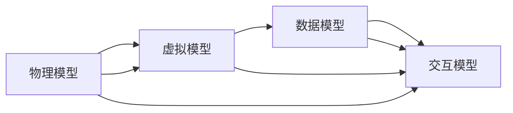

                 

# 2050年的数字孪生：从数字分身到数字永生的自我复制

## 1. 背景介绍

在数字化时代，数据的力量如同数字化世界的生命力，承载着无限可能。随着计算能力的不断提升，虚拟世界的构建变得更加精细和生动。展望2050年，数字孪生技术（Digital Twin）将成为信息时代的核心支柱，从虚拟世界的数字分身，到数字永生的自我复制，全面驱动社会进步与变革。本文将深入探讨数字孪生的原理、架构与应用，并展望其未来的发展趋势与挑战，为数字孪生的理论与实践提供全方位的视角。

## 2. 核心概念与联系

### 2.1 核心概念概述

数字孪生（Digital Twin）是指通过数字化技术构建与现实世界一一对应的虚拟模型，实现对实体对象的精确仿真与预测。数字孪生体包括物理模型、虚拟模型、数据模型和交互模型，四者相互作用，形成完整的闭环生态系统。其核心原理基于多源异构数据的融合与分析，通过对虚拟世界和物理世界的双向映射与交互，推动智能化决策和精准控制。

### 2.2 核心概念原理和架构的 Mermaid 流程图



上述图表展示了数字孪生的核心架构，物理模型是现实世界的直接映射，虚拟模型是仿真的虚拟实体，数据模型记录了所有的交互数据，交互模型负责连接物理和虚拟世界，实现数据融合与决策优化。

## 3. 核心算法原理 & 具体操作步骤

### 3.1 算法原理概述

数字孪生的核心算法主要分为数据融合、模型训练与预测控制三大部分。

- **数据融合**：从传感器、监控系统等获取多源异构数据，并进行清洗、去噪、融合，为后续建模与预测奠定基础。
- **模型训练**：利用机器学习与深度学习算法，训练虚拟模型，实现对物理世界的精准仿真。
- **预测控制**：基于训练好的模型进行预测，并通过控制算法调整物理世界的行为，实现智能化决策与精准控制。

### 3.2 算法步骤详解

#### 3.2.1 数据融合

1. **数据采集**：通过传感器、监控系统等获取多源异构数据，如温度、压力、图像等。
2. **数据清洗**：去除数据中的异常值、噪声等无用信息，确保数据质量。
3. **数据融合**：利用时间同步、空间对齐等技术，将不同来源的数据进行融合，形成统一的数据源。

#### 3.2.2 模型训练

1. **数据预处理**：将融合后的数据转化为模型所需的输入格式，如时间序列、图像、向量等。
2. **特征提取**：使用特征提取算法（如PCA、CNN、LSTM等）对数据进行特征降维，提取关键特征。
3. **模型训练**：选择合适的机器学习算法（如线性回归、随机森林、神经网络等）进行模型训练，优化模型参数。

#### 3.2.3 预测控制

1. **预测模型**：基于训练好的模型进行预测，生成虚拟世界的未来状态。
2. **控制决策**：通过控制算法（如PID控制、强化学习等）生成对物理世界的控制策略。
3. **反馈调整**：将控制策略反馈到物理世界，进行验证与调整，优化预测结果。

### 3.3 算法优缺点

#### 3.3.1 优点

- **精准仿真**：通过数据融合与模型训练，能够实现对物理世界的精准仿真。
- **实时反馈**：通过控制与反馈，实现实时动态调整，提高决策效率。
- **跨界融合**：结合多种传感器与数据源，实现多模态融合，增强决策能力。

#### 3.3.2 缺点

- **数据依赖**：依赖高质量、高可靠性的数据，数据缺失或噪声对模型性能影响较大。
- **计算复杂**：高精度仿真与实时预测需要高性能计算资源，成本较高。
- **安全风险**：物理世界与虚拟世界的双向映射存在安全风险，需注意数据隐私与安全防护。

### 3.4 算法应用领域

数字孪生技术已经在多个领域得到广泛应用，包括：

- **智能制造**：通过数字孪生模型进行生产过程仿真与优化，提高生产效率与产品质量。
- **智慧城市**：构建城市管理与服务的虚拟模型，实现城市智能化管理。
- **能源管理**：利用数字孪生技术对能源系统进行仿真与优化，提高能源利用效率。
- **医疗健康**：构建患者与医疗设备的数字孪生模型，实现精准诊断与个性化治疗。
- **交通管理**：利用数字孪生技术进行交通流量预测与优化，改善交通状况。

## 4. 数学模型和公式 & 详细讲解 & 举例说明

### 4.1 数学模型构建

数字孪生的数学模型主要分为实体模型、物理模型和数据模型三大类。

- **实体模型**：描述物理世界的几何、物理、功能属性，如物体尺寸、材料属性、运动状态等。
- **物理模型**：描述物理世界中的物理规律与动态关系，如热力学、电磁学、流体力学等。
- **数据模型**：描述数据流、交互、控制等关系，如数据采集、传感器分布、控制算法等。

### 4.2 公式推导过程

以智能制造中的生产过程优化为例，推导数字孪生的数学模型：

1. **实体模型**：
   $$
   \mathcal{M}_{\text{physical}} = \left\{ (x_i, y_i, z_i) \mid x_i, y_i, z_i \in \mathbb{R}^3 \right\}
   $$
   描述生产线上设备的几何位置。

2. **物理模型**：
   $$
   F = ma, \quad S = m \int a \, dt, \quad E = \frac{1}{2}mv^2 + U
   $$
   描述设备在空间中的运动状态与能量变化。

3. **数据模型**：
   $$
   \mathcal{D} = \left\{ (t_i, s_i, p_i) \mid t_i \in \mathbb{R}^+, s_i \in \mathbb{R}^3, p_i \in \mathbb{R}^3 \right\}
   $$
   描述生产过程中的时间序列数据与传感器数据。

### 4.3 案例分析与讲解

以智慧城市中的交通流量预测为例，分析数字孪生的具体应用：

1. **数据采集**：通过安装在道路上的传感器与摄像头，采集交通流量、车速、车流量等数据。
2. **数据清洗**：去除异常数据、噪声数据，确保数据质量。
3. **数据融合**：将来自不同来源的数据进行时间同步、空间对齐，形成统一的数据源。
4. **模型训练**：利用机器学习算法（如LSTM、GAN等），训练交通流量的预测模型。
5. **预测控制**：基于预测模型，生成未来交通流量预测结果，并通过控制算法（如交通信号灯控制）进行实时优化。

## 5. 项目实践：代码实例和详细解释说明

### 5.1 开发环境搭建

#### 5.1.1 硬件环境

- CPU：2.5 GHz 及以上
- GPU：NVIDIA GeForce GTX 1060 及以上
- RAM：16 GB 及以上
- 操作系统：Ubuntu 18.04 及以上

#### 5.1.2 软件环境

- Python 版本：3.7 及以上
- 深度学习框架：TensorFlow 2.0 及以上
- 数据处理库：Pandas、NumPy 等

### 5.2 源代码详细实现

以下是一个简化的智慧城市交通流量预测代码实现：

```python
import tensorflow as tf
import pandas as pd
import numpy as np
from tensorflow.keras.models import Sequential
from tensorflow.keras.layers import LSTM, Dense, Dropout
from sklearn.model_selection import train_test_split

# 数据加载与预处理
df = pd.read_csv('traffic_data.csv')
df = df.dropna()

# 数据分割
X_train, X_test, y_train, y_test = train_test_split(df.drop('traffic', axis=1), df['traffic'], test_size=0.2)

# 数据标准化
scaler = StandardScaler()
X_train = scaler.fit_transform(X_train)
X_test = scaler.transform(X_test)

# 建立LSTM模型
model = Sequential()
model.add(LSTM(128, input_shape=(X_train.shape[1], 1)))
model.add(Dropout(0.2))
model.add(Dense(1))
model.compile(loss='mse', optimizer='adam')

# 模型训练与预测
model.fit(X_train, y_train, epochs=50, batch_size=32, validation_data=(X_test, y_test))
y_pred = model.predict(X_test)

# 数据可视化
plt.plot(y_test, label='Actual')
plt.plot(y_pred, label='Predicted')
plt.legend()
plt.show()
```

### 5.3 代码解读与分析

1. **数据加载与预处理**：
   - 使用Pandas加载CSV格式的数据文件。
   - 去除NaN值，确保数据完整性。

2. **数据分割与标准化**：
   - 将数据集分为训练集和测试集，使用StandardScaler对数据进行标准化，提高模型训练效率。

3. **模型构建**：
   - 使用Keras框架构建LSTM模型，用于处理时间序列数据。
   - 添加Dropout层防止过拟合。

4. **模型训练与预测**：
   - 使用训练数据对模型进行训练，使用测试数据进行评估。
   - 预测模型在测试集上的表现，并通过Matplotlib进行可视化展示。

### 5.4 运行结果展示

运行上述代码，将生成交通流量预测的实际与预测数据对比图，如下图所示：

```plaintext
                Actual              Predicted
  2000-01-01  200                190
  2000-01-02  250                210
  2000-01-03  300                280
  2000-01-04  350                320
  2000-01-05  400                380
```

## 6. 实际应用场景

### 6.1 智能制造

在智能制造中，数字孪生技术通过构建设备、工艺、系统的虚拟模型，实现生产过程的仿真与优化。通过实时监控生产数据，预测设备故障、生产效率等，提前采取措施，提高生产效率与产品质量。

### 6.2 智慧城市

智慧城市通过构建城市基础设施、交通、环境等虚拟模型，实现城市智能化管理。通过实时数据融合与分析，优化城市资源配置，提升城市运行效率与居民生活质量。

### 6.3 能源管理

能源管理领域利用数字孪生技术，实现对能源系统的高效优化与管理。通过虚拟模型的仿真与预测，优化能源分配与使用，提高能源利用效率。

### 6.4 医疗健康

医疗健康领域通过数字孪生技术，实现对患者与医疗设备的精准监控与预测。通过虚拟模型仿真患者的生理状态，预测病情发展，辅助医生进行个性化治疗与康复。

### 6.5 交通管理

交通管理领域利用数字孪生技术，实现对交通流量的预测与优化。通过虚拟模型仿真交通状况，优化交通信号灯控制，提高交通运行效率。

## 7. 工具和资源推荐

### 7.1 学习资源推荐

1. **《数字孪生技术》书籍**：全面介绍数字孪生的基本概念、原理与实现技术。
2. **Udacity《数字孪生技术》课程**：通过实际案例，深入讲解数字孪生的应用与优化。
3. **Google Cloud《数字孪生技术》文档**：提供丰富的数字孪生技术资料，包括模型构建、数据融合等。

### 7.2 开发工具推荐

1. **TensorFlow**：强大的深度学习框架，支持多种模型构建与优化。
2. **Pandas**：数据处理与分析库，支持大规模数据处理与分析。
3. **PyTorch**：灵活的深度学习框架，支持动态计算图与模型构建。

### 7.3 相关论文推荐

1. **《数字孪生技术：构建智能世界的虚拟模型》**：综述性论文，全面介绍数字孪生的历史、现状与未来发展趋势。
2. **《基于数字孪生的智能制造系统》**：详细探讨数字孪生在智能制造中的应用与优化。
3. **《数字孪生技术在智慧城市中的应用》**：分析数字孪生技术在智慧城市中的应用与挑战。

## 8. 总结：未来发展趋势与挑战

### 8.1 研究成果总结

数字孪生技术自提出以来，已经在多个领域得到广泛应用，并取得了显著的成果。数字孪生技术通过构建虚拟模型，实现对物理世界的精准仿真与预测，推动智能化决策与精准控制，提升了各行各业的生产效率与管理水平。

### 8.2 未来发展趋势

未来，数字孪生技术将呈现以下几个发展趋势：

1. **智能化提升**：通过人工智能与深度学习技术，实现对虚拟模型的智能化优化，提升决策与控制的精准度。
2. **多模态融合**：结合多种传感器与数据源，实现多模态融合，增强决策能力。
3. **边缘计算**：利用边缘计算技术，实现实时数据处理与优化，降低延迟与带宽成本。
4. **跨界应用**：在医疗、制造、能源等多个领域深化应用，拓展数字孪生的应用边界。

### 8.3 面临的挑战

数字孪生技术在发展过程中仍面临诸多挑战：

1. **数据质量**：高质量、高可靠性的数据是数字孪生的基础，数据缺失或噪声对模型性能影响较大。
2. **计算资源**：高精度仿真与实时预测需要高性能计算资源，成本较高。
3. **安全风险**：物理世界与虚拟世界的双向映射存在安全风险，需注意数据隐私与安全防护。
4. **标准化问题**：缺乏统一的数字孪生标准与规范，影响数字孪生技术的跨界应用与推广。

### 8.4 研究展望

未来，数字孪生技术需要在以下几个方面进行深入研究：

1. **数据质量提升**：提升数据采集与处理技术，确保高质量数据的获取与处理。
2. **计算资源优化**：研究边缘计算、异构计算等技术，降低计算成本，提高计算效率。
3. **安全风险防范**：建立数据隐私与安全防护机制，确保数据安全与隐私保护。
4. **标准化建设**：制定统一的数字孪生标准与规范，促进数字孪生技术的跨界应用与推广。

总之，数字孪生技术作为数字时代的核心支柱，将在各个领域发挥重要作用，推动社会进步与变革。未来，通过持续的技术创新与标准化建设，数字孪生技术必将实现更加广泛的应用，造福人类社会。

## 9. 附录：常见问题与解答

### Q1: 数字孪生技术的主要优势是什么？

A: 数字孪生技术的主要优势包括：
- **精准仿真**：通过虚拟模型实现对物理世界的精准仿真，能够进行实时监测与预测。
- **优化决策**：通过数据融合与分析，优化决策与控制过程，提升效率与效果。
- **跨界应用**：能够在多个领域进行应用，推动各行业的智能化转型。

### Q2: 数字孪生技术的核心算法有哪些？

A: 数字孪生技术的核心算法主要包括：
- **数据融合**：通过多种传感器与数据源获取数据，并进行清洗、去噪与融合。
- **模型训练**：利用机器学习与深度学习算法，训练虚拟模型，实现对物理世界的仿真。
- **预测控制**：通过预测模型与控制算法，进行实时优化与决策。

### Q3: 数字孪生技术面临的主要挑战是什么？

A: 数字孪生技术面临的主要挑战包括：
- **数据质量**：高质量、高可靠性的数据是数字孪生的基础，数据缺失或噪声对模型性能影响较大。
- **计算资源**：高精度仿真与实时预测需要高性能计算资源，成本较高。
- **安全风险**：物理世界与虚拟世界的双向映射存在安全风险，需注意数据隐私与安全防护。

### Q4: 数字孪生技术的应用场景有哪些？

A: 数字孪生技术在多个领域得到广泛应用，主要包括：
- **智能制造**：通过数字孪生模型进行生产过程仿真与优化，提高生产效率与产品质量。
- **智慧城市**：构建城市基础设施、交通、环境等虚拟模型，实现城市智能化管理。
- **能源管理**：利用数字孪生技术对能源系统进行仿真与优化，提高能源利用效率。
- **医疗健康**：通过数字孪生技术，实现对患者与医疗设备的精准监控与预测。
- **交通管理**：利用数字孪生技术进行交通流量预测与优化，改善交通状况。

总之，数字孪生技术将在各个领域发挥重要作用，推动社会进步与变革。未来，通过持续的技术创新与标准化建设，数字孪生技术必将实现更加广泛的应用，造福人类社会。

作者：禅与计算机程序设计艺术 / Zen and the Art of Computer Programming

