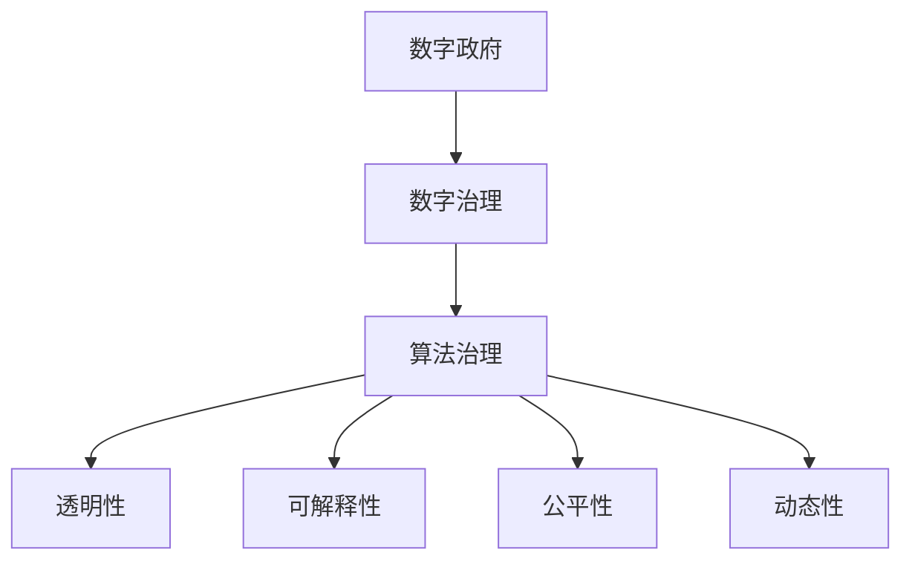

                 

# 2050年的数字治理：从数字政府到算法治理的政务智能化

## 1. 背景介绍

### 1.1 问题由来
进入21世纪，数字治理以其高效便捷、精准透明等优点，在政务智能化中逐步取代了传统的数字政府模式。它利用先进的信息技术和人工智能技术，实现了政务数据的整合与共享、政务流程的优化与简化、政务服务的个性化与智能化，极大地提升了政府治理的效率与质量。

然而，数字治理也面临一些挑战：数据孤岛、隐私保护、算法偏见等。这些问题的存在限制了数字治理的全面推进，亟需新的治理理念和技术手段。

### 1.2 问题核心关键点
为应对数字治理中的挑战，算法治理成为一种新兴的政务智能化模式。算法治理强调通过算法模型来驱动政务决策和治理，以提升政府治理的智能化、自动化和透明度。

算法治理的核心在于：
- **透明性**：通过算法模型建立公开透明的决策过程，确保政策的科学性和公正性。
- **可解释性**：通过可解释的算法模型，让政策制定者和公众理解算法的决策依据。
- **公平性**：通过公平性算法，确保算法模型的决策不带有偏见，覆盖各个社会群体。
- **动态性**：通过持续学习算法，使算法模型能够随着数据和环境的变化不断更新和优化。

## 2. 核心概念与联系

### 2.1 核心概念概述

为更好地理解算法治理的核心概念，本节将介绍几个密切相关的核心概念：

- **数字政府**：利用现代信息技术，优化政府治理流程，提升治理效率和公众服务质量的政务模式。
- **数字治理**：通过信息技术和算法模型，实现政务数据的整合与共享、政务流程的优化与简化、政务服务的个性化与智能化的治理模式。
- **算法治理**：利用算法模型进行政务决策和治理，提升政府治理的智能化、自动化和透明度的治理模式。
- **透明性**：政策制定和执行过程的公开透明，确保政策的科学性和公正性。
- **可解释性**：算法模型的决策过程可以被理解、解释和验证。
- **公平性**：算法模型的决策过程不带有偏见，覆盖各个社会群体。
- **动态性**：算法模型能够随着数据和环境的变化不断更新和优化。

这些核心概念之间的逻辑关系可以通过以下Mermaid流程图来展示：



这个流程图展示了大语言模型的核心概念及其之间的关系：

1. 数字政府通过信息技术和数据驱动，实现了政务的数字化和智能化。
2. 数字治理进一步优化了数字政府模式，提升了政务服务的质量和效率。
3. 算法治理在大数据和人工智能的支撑下，实现了政务决策的智能化和自动化。
4. 透明性、可解释性、公平性和动态性是算法治理追求的关键目标。

## 3. 核心算法原理 & 具体操作步骤

### 3.1 算法原理概述

算法治理的核心理论基础是：利用机器学习、深度学习等算法模型，对政务数据进行分析和处理，从而辅助政务决策和执行。具体来说，算法治理过程包括以下几个步骤：

1. **数据采集与预处理**：收集政务数据，包括文本、图像、视频等各类数据，并进行清洗和预处理。
2. **模型训练与优化**：选择合适的算法模型，如决策树、随机森林、神经网络等，在政务数据上训练模型，并通过交叉验证、调参等技术优化模型性能。
3. **模型部署与监控**：将训练好的模型部署到实际政务系统中，并实时监控模型性能，及时调整和优化。
4. **效果评估与改进**：通过评估模型在实际政务中的表现，如准确率、召回率、F1分数等，收集反馈信息，持续改进模型。

### 3.2 算法步骤详解

算法治理的具体操作步骤如下：

**Step 1: 数据采集与预处理**

- **数据来源**：政务数据的采集可以通过公开接口、API、数据库等方式进行。
- **数据清洗**：清洗数据，去除噪声、冗余和不完整的数据。
- **数据标注**：对数据进行标注，如标签分类、情感分析等。
- **数据集划分**：将数据集划分为训练集、验证集和测试集。

**Step 2: 模型训练与优化**

- **算法选择**：选择合适的算法模型，如决策树、随机森林、神经网络等。
- **模型训练**：在政务数据上训练模型，设置合适的超参数。
- **模型评估**：在验证集上评估模型性能，使用交叉验证、网格搜索等技术调优。
- **模型保存**：保存最优的模型参数，以便后续部署和使用。

**Step 3: 模型部署与监控**

- **模型集成**：将训练好的模型集成到政务系统中，如决策支持系统、智能客服系统等。
- **实时监控**：实时监控模型性能，收集运行日志、误差报告等。
- **异常检测**：对异常情况进行检测和报警，确保系统稳定运行。

**Step 4: 效果评估与改进**

- **效果评估**：使用测试集评估模型性能，计算准确率、召回率、F1分数等指标。
- **改进策略**：根据评估结果，收集用户反馈，调整模型参数和算法。
- **持续优化**：定期更新模型，保持模型的动态性和准确性。

### 3.3 算法优缺点

算法治理具有以下优点：
- **高效性**：通过算法模型进行自动化决策，大幅提升政务处理效率。
- **精准性**：算法模型能够精确处理大量数据，减少人为误差。
- **透明度**：算法模型的工作过程和决策依据公开透明，便于监督和解释。

同时，算法治理也存在以下局限性：
- **数据依赖**：模型性能依赖于数据质量，数据不足或偏见可能导致模型失效。
- **算法偏见**：算法模型可能学习数据中的偏见，导致决策不公平。
- **模型复杂性**：复杂的算法模型难以解释，可能降低模型的可解释性。
- **资源消耗**：大规模模型的训练和部署需要大量计算资源。

尽管存在这些局限性，但就目前而言，算法治理仍是大数据时代政务智能化的主流范式。未来相关研究的重点在于如何进一步降低数据依赖，提高模型的公平性和可解释性，同时兼顾资源消耗和模型性能。

### 3.4 算法应用领域

算法治理在大数据时代得到了广泛的应用，覆盖了政务服务的各个方面，例如：

- **智能客服系统**：利用算法模型实现自动化的客户咨询和问题解答，提升服务效率和用户体验。
- **决策支持系统**：通过算法模型辅助政府决策，实现精准的政策制定和执行。
- **医疗健康管理**：利用算法模型进行疾病预测、风险评估等，提升公共卫生管理水平。
- **教育资源分配**：通过算法模型优化教育资源的分配，实现公平而有质量的教育。
- **交通流量控制**：利用算法模型进行交通流量的预测和优化，提升城市交通管理效率。
- **环境保护监管**：通过算法模型监测环境污染，进行科学决策和治理。

除了上述这些经典应用外，算法治理还被创新性地应用到更多场景中，如公共安全预警、灾害响应、社会治理等，为社会治理提供了新的技术手段。

## 4. 数学模型和公式 & 详细讲解  
### 4.1 数学模型构建

本节将使用数学语言对算法治理的数学原理进行更加严格的刻画。

记政务数据集为 $D=\{(x_i,y_i)\}_{i=1}^N$，其中 $x_i$ 为输入数据， $y_i$ 为标签。假设选择算法模型 $M_{\theta}$，其中 $\theta$ 为模型参数。

定义模型 $M_{\theta}$ 在数据样本 $(x,y)$ 上的损失函数为 $\ell(M_{\theta}(x),y)$，则在数据集 $D$ 上的经验风险为：

$$
\mathcal{L}(\theta) = \frac{1}{N} \sum_{i=1}^N \ell(M_{\theta}(x_i),y_i)
$$

算法治理的优化目标是最小化经验风险，即找到最优参数：

$$
\theta^* = \mathop{\arg\min}_{\theta} \mathcal{L}(\theta)
$$

在实践中，我们通常使用基于梯度的优化算法（如SGD、Adam等）来近似求解上述最优化问题。设 $\eta$ 为学习率，则参数的更新公式为：

$$
\theta \leftarrow \theta - \eta \nabla_{\theta}\mathcal{L}(\theta)
$$

其中 $\nabla_{\theta}\mathcal{L}(\theta)$ 为损失函数对参数 $\theta$ 的梯度，可通过反向传播算法高效计算。

### 4.2 公式推导过程

以下我们以分类任务为例，推导分类算法模型的损失函数及其梯度的计算公式。

假设模型 $M_{\theta}$ 在输入 $x$ 上的输出为 $\hat{y}=M_{\theta}(x) \in [0,1]$，表示样本属于正类的概率。真实标签 $y \in \{0,1\}$。则二分类交叉熵损失函数定义为：

$$
\ell(M_{\theta}(x),y) = -[y\log \hat{y} + (1-y)\log (1-\hat{y})]
$$

将其代入经验风险公式，得：

$$
\mathcal{L}(\theta) = -\frac{1}{N}\sum_{i=1}^N [y_i\log M_{\theta}(x_i)+(1-y_i)\log(1-M_{\theta}(x_i))]
$$

根据链式法则，损失函数对参数 $\theta_k$ 的梯度为：

$$
\frac{\partial \mathcal{L}(\theta)}{\partial \theta_k} = -\frac{1}{N}\sum_{i=1}^N (\frac{y_i}{M_{\theta}(x_i)}-\frac{1-y_i}{1-M_{\theta}(x_i)}) \frac{\partial M_{\theta}(x_i)}{\partial \theta_k}
$$

其中 $\frac{\partial M_{\theta}(x_i)}{\partial \theta_k}$ 可进一步递归展开，利用自动微分技术完成计算。

在得到损失函数的梯度后，即可带入参数更新公式，完成模型的迭代优化。重复上述过程直至收敛，最终得到适应政务任务的最优模型参数 $\theta^*$。

## 5. 项目实践：代码实例和详细解释说明
### 5.1 开发环境搭建

在进行算法治理项目实践前，我们需要准备好开发环境。以下是使用Python进行Scikit-Learn开发的环境配置流程：

1. 安装Anaconda：从官网下载并安装Anaconda，用于创建独立的Python环境。

2. 创建并激活虚拟环境：
```bash
conda create -n algorithmic-governance python=3.8 
conda activate algorithmic-governance
```

3. 安装Scikit-Learn：
```bash
pip install scikit-learn
```

4. 安装各类工具包：
```bash
pip install numpy pandas scikit-learn matplotlib tqdm jupyter notebook ipython
```

完成上述步骤后，即可在`algorithmic-governance`环境中开始算法治理实践。

### 5.2 源代码详细实现

下面我以分类算法治理项目为例，给出使用Scikit-Learn库对决策树模型进行算法治理的Python代码实现。

首先，定义分类数据处理函数：

```python
from sklearn.datasets import load_breast_cancer
from sklearn.model_selection import train_test_split
from sklearn.tree import DecisionTreeClassifier

def load_data():
    cancer_data = load_breast_cancer()
    features = cancer_data.data
    labels = cancer_data.target
    return features, labels

def split_data(features, labels, test_size=0.2, random_state=42):
    features_train, features_test, labels_train, labels_test = train_test_split(features, labels, test_size=test_size, random_state=random_state)
    return features_train, features_test, labels_train, labels_test
```

然后，定义模型训练和评估函数：

```python
from sklearn.metrics import accuracy_score, precision_score, recall_score, f1_score
from sklearn.model_selection import GridSearchCV
from sklearn.tree import DecisionTreeClassifier

def train_model(features_train, labels_train, features_test, labels_test, params):
    model = DecisionTreeClassifier(**params)
    model.fit(features_train, labels_train)
    y_pred = model.predict(features_test)
    print(f"Accuracy: {accuracy_score(labels_test, y_pred)}")
    print(f"Precision: {precision_score(labels_test, y_pred)}")
    print(f"Recall: {recall_score(labels_test, y_pred)}")
    print(f"F1 Score: {f1_score(labels_test, y_pred)}")

def evaluate_model(features_test, labels_test, model):
    y_pred = model.predict(features_test)
    print(f"Accuracy: {accuracy_score(labels_test, y_pred)}")
    print(f"Precision: {precision_score(labels_test, y_pred)}")
    print(f"Recall: {recall_score(labels_test, y_pred)}")
    print(f"F1 Score: {f1_score(labels_test, y_pred)}")

def hyperparameter_tuning(features_train, labels_train, features_test, labels_test):
    param_grid = {
        'max_depth': [3, 5, 7],
        'min_samples_split': [2, 5, 10],
        'min_samples_leaf': [1, 2, 4]
    }
    grid_search = GridSearchCV(DecisionTreeClassifier(), param_grid, cv=5, scoring='f1_macro')
    grid_search.fit(features_train, labels_train)
    best_model = grid_search.best_estimator_
    evaluate_model(features_test, labels_test, best_model)
```

接着，启动模型训练和调参流程：

```python
from sklearn.model_selection import train_test_split

features, labels = load_data()
features_train, features_test, labels_train, labels_test = split_data(features, labels)

params = {
    'max_depth': 5,
    'min_samples_split': 2,
    'min_samples_leaf': 1
}
train_model(features_train, labels_train, features_test, labels_test, params)
hyperparameter_tuning(features_train, labels_train, features_test, labels_test)
```

以上就是使用Scikit-Learn库对决策树模型进行算法治理的完整代码实现。可以看到，通过Scikit-Learn，我们能够快速构建和优化决策树模型，用于处理政务分类任务。

### 5.3 代码解读与分析

让我们再详细解读一下关键代码的实现细节：

**load_data和split_data函数**：
- `load_data`函数：从Scikit-Learn的乳腺癌数据集中加载训练和测试数据。
- `split_data`函数：将数据集划分为训练集和测试集，并采用交叉验证的方式进行超参数调优。

**train_model和evaluate_model函数**：
- `train_model`函数：使用Scikit-Learn的决策树模型训练和评估分类任务，输出分类准确率、精确率、召回率和F1分数。
- `evaluate_model`函数：对模型在测试集上的性能进行评估，输出分类指标。

**hyperparameter_tuning函数**：
- `hyperparameter_tuning`函数：使用Scikit-Learn的GridSearchCV进行超参数调优，通过交叉验证寻找最优的超参数组合，并评估最优模型的性能。

**训练流程**：
- 加载数据集
- 划分训练集和测试集
- 初始化模型参数
- 训练模型并评估性能
- 进行超参数调优并重新评估

可以看到，Scikit-Learn使得算法治理模型的构建和优化变得简单高效，开发者可以专注于算法模型的设计和调优，而不必过多关注底层实现细节。

当然，工业级的系统实现还需考虑更多因素，如模型的保存和部署、超参数的自动搜索、更灵活的政务任务适配等。但核心的算法治理范式基本与此类似。

## 6. 实际应用场景
### 6.1 智能客服系统

算法治理技术在智能客服系统中得到广泛应用。传统客服往往依赖人工处理，响应速度慢，效率低。通过算法治理，可以实现自动化的客户咨询和问题解答，提升服务效率和用户体验。

在技术实现上，可以收集历史客服记录和常见问题，构建监督数据集。使用决策树、随机森林等算法模型，对预训练语言模型进行微调，使模型能够自动理解客户意图，匹配最合适的答案模板进行回复。对于客户提出的新问题，还可以接入检索系统实时搜索相关内容，动态组织生成回答。如此构建的智能客服系统，能大幅提升客户咨询体验和问题解决效率。

### 6.2 医疗健康管理

算法治理在医疗健康管理中也得到了广泛应用。通过算法治理，可以实现疾病预测、风险评估、治疗方案推荐等功能。

在技术实现上，可以收集医疗数据和病人信息，构建监督数据集。使用算法模型对医疗数据进行分析和处理，从而辅助医生诊断和治疗。例如，使用决策树模型对病人的病历数据进行分类，预测其患病的概率和类型。使用随机森林模型对病人的检查结果进行分析，评估其疾病的风险。使用神经网络模型对病人的治疗方案进行推荐，根据病情和病史给出最佳治疗建议。

### 6.3 教育资源分配

算法治理在教育资源分配中也得到了广泛应用。通过算法治理，可以实现教育资源的优化分配，提升教育质量和公平性。

在技术实现上，可以收集学生和教师的反馈数据，构建监督数据集。使用算法模型对教育数据进行分析，优化教育资源的分配。例如，使用聚类算法对学生进行分类，了解不同学生的学习情况和需求。使用决策树模型对课程和教材进行评估，推荐最适合学生的学习材料。使用神经网络模型对教师的教学效果进行评估，优化教师资源分配。

### 6.4 未来应用展望

随着算法治理技术的不断演进，未来其在政务智能化中的应用将更加广泛和深入：

1. **智慧城市治理**：通过算法治理实现城市事件监测、舆情分析、应急指挥等，提升城市管理的自动化和智能化水平。
2. **金融监管**：通过算法治理实现市场风险监测、反洗钱、信用评估等，保障金融系统的稳定和安全。
3. **环境保护**：通过算法治理实现环境污染监测、气候预测、资源管理等，提升环境保护的效果和效率。
4. **教育公平**：通过算法治理实现教育资源的优化分配，提升教育公平性和质量。
5. **社会治理**：通过算法治理实现公共安全预警、舆情监测、社会治理等，提升社会治理的效果和效率。

未来，随着数据和算力的不断进步，算法治理技术将在大数据时代政务智能化的各个领域发挥更大的作用，为政府治理带来新的变革。

## 7. 工具和资源推荐
### 7.1 学习资源推荐

为了帮助开发者系统掌握算法治理的理论基础和实践技巧，这里推荐一些优质的学习资源：

1. 《算法治理：政务智能化的前沿探索》系列博文：由算法治理专家撰写，深入浅出地介绍了算法治理的理论基础和实践技巧。
2. 《数字治理与算法治理》课程：清华大学开设的在线课程，涵盖算法治理的各个方面，适合系统学习和掌握。
3. 《算法治理实践指南》书籍：介绍算法治理的原理、算法选择、数据处理、模型评估等各个环节的实践指南，助力政务智能化建设。
4. GitHub上的算法治理项目：众多算法治理项目开源，提供了丰富的实现样例和代码，可供学习借鉴。

通过对这些资源的学习实践，相信你一定能够快速掌握算法治理的精髓，并用于解决实际的政务智能化问题。
### 7.2 开发工具推荐

高效的开发离不开优秀的工具支持。以下是几款用于算法治理开发的常用工具：

1. Scikit-Learn：Python的机器学习库，封装了多种算法模型，支持超参数调优和模型评估，是算法治理的首选工具。
2. TensorFlow：由Google主导开发的深度学习框架，支持大规模模型的训练和部署，适合复杂算法的实现。
3. PyTorch：由Facebook主导开发的深度学习框架，灵活易用，适合研究和原型开发。
4. H2O.ai：一个集成了多种算法的机器学习平台，支持自动调参和模型优化，适用于工业级系统开发。
5. Keras：一个高层神经网络API，支持快速搭建和训练深度学习模型，易于上手。

合理利用这些工具，可以显著提升算法治理任务的开发效率，加快创新迭代的步伐。

### 7.3 相关论文推荐

算法治理的研究始于学界的持续研究。以下是几篇奠基性的相关论文，推荐阅读：

1. "Towards a principled foundation for deep learning"：提出深度学习的可解释性问题，探讨如何建立可解释的算法模型。
2. "Interpretable Machine Learning with Tree-based Models"：介绍决策树和随机森林等可解释的算法模型，并探讨其在政务智能化中的应用。
3. "Fairness in Machine Learning"：探讨机器学习中的公平性问题，提出公平算法和公平指标，确保模型决策的公正性。
4. "Data-Driven Decision-Making"：介绍数据驱动的决策过程，探讨如何通过算法治理实现政务决策的科学化和智能化。
5. "Automated Machine Learning: Methods, Systems, Challenges"：介绍自动化机器学习的方法和挑战，探讨如何自动构建和优化算法模型。

这些论文代表了大数据时代政务智能化的发展脉络。通过学习这些前沿成果，可以帮助研究者把握学科前进方向，激发更多的创新灵感。

## 8. 总结：未来发展趋势与挑战

### 8.1 总结

本文对算法治理进行了全面系统的介绍。首先阐述了算法治理的研究背景和意义，明确了算法治理在提升政府治理智能化、自动化和透明度方面的独特价值。其次，从原理到实践，详细讲解了算法治理的数学原理和关键步骤，给出了算法治理任务开发的完整代码实例。同时，本文还广泛探讨了算法治理在智能客服、医疗健康、教育资源分配等多个行业领域的应用前景，展示了算法治理范式的巨大潜力。此外，本文精选了算法治理技术的各类学习资源，力求为读者提供全方位的技术指引。

通过本文的系统梳理，可以看到，算法治理是大数据时代政务智能化的重要范式，通过算法模型驱动政务决策和执行，实现了政务处理的自动化和智能化。未来，随着算法治理技术的不断演进，其应用领域将更加广泛和深入，为政府治理带来新的变革。

### 8.2 未来发展趋势

展望未来，算法治理技术将呈现以下几个发展趋势：

1. **算法模型多样化**：随着机器学习和深度学习技术的进步，更多的算法模型将引入政务治理中，如深度神经网络、强化学习、生成对抗网络等，提升政务决策的准确性和智能化水平。
2. **数据融合与共享**：数据融合技术将促进政务数据的共享和利用，实现跨部门、跨区域的数据协同，提升政务决策的全面性和科学性。
3. **模型动态优化**：随着政务数据的动态变化，算法模型需要实时更新和优化，实现持续学习和动态调整。
4. **模型解释与透明**：模型解释技术将使得政务决策过程公开透明，确保政务决策的公正性和科学性。
5. **模型公平性**：公平算法将确保算法模型在决策过程中不带有偏见，覆盖各个社会群体，保障公共决策的公平性。

以上趋势凸显了算法治理技术在政务智能化中的广泛应用前景。这些方向的探索发展，必将进一步提升政务治理的效率和质量，为构建高效、透明、公正的政务系统铺平道路。

### 8.3 面临的挑战

尽管算法治理在政务智能化中已经取得了一定的进展，但仍面临诸多挑战：

1. **数据质量与隐私保护**：政务数据的质量和隐私保护问题是算法治理的基础。如何保障数据的准确性和完整性，防止数据泄露和滥用，是一个重要课题。
2. **模型鲁棒性**：算法模型面对不同来源和不同格式的数据时，鲁棒性问题尤为突出。如何保证模型在各种数据分布下的稳定性和可靠性，是一个亟待解决的难题。
3. **模型可解释性**：算法模型的决策过程往往难以解释，导致政务决策的透明度和可信度下降。如何提高模型可解释性，确保政务决策的公正性和科学性，是一个重要课题。
4. **公平性问题**：算法模型可能学习数据中的偏见，导致决策不公平。如何消除模型偏见，确保决策公平性，是一个亟待解决的问题。
5. **资源消耗**：大规模模型的训练和部署需要大量计算资源。如何降低资源消耗，提高模型部署效率，是一个重要课题。

尽管存在这些挑战，但随着学界和产业界的共同努力，算法治理技术必将不断改进和完善，在政务智能化中发挥更大的作用。

### 8.4 研究展望

面向未来，算法治理技术需要在以下几个方面寻求新的突破：

1. **自动化模型构建**：自动化机器学习技术将使模型构建和优化更加高效，降低人工干预的复杂度。
2. **数据融合与共享**：数据融合技术将促进政务数据的共享和利用，实现跨部门、跨区域的数据协同，提升政务决策的全面性和科学性。
3. **模型动态优化**：持续学习和动态优化算法模型，确保模型能够随着政务数据的变化不断更新和优化。
4. **模型公平性**：公平算法将确保算法模型在决策过程中不带有偏见，覆盖各个社会群体，保障公共决策的公平性。
5. **模型解释与透明**：模型解释技术将使得政务决策过程公开透明，确保政务决策的公正性和科学性。

这些研究方向的探索，必将引领算法治理技术迈向更高的台阶，为构建高效、透明、公正的政务系统铺平道路。面向未来，算法治理技术还需要与其他人工智能技术进行更深入的融合，如知识表示、因果推理、强化学习等，多路径协同发力，共同推动政务智能化系统的进步。只有勇于创新、敢于突破，才能不断拓展政务治理的边界，让智能技术更好地造福人类社会。

## 9. 附录：常见问题与解答

**Q1：算法治理是否适用于所有政务场景？**

A: 算法治理在大多数政务场景中都具备良好的适用性。尤其是在数据量较大的政务任务中，如数据分析、风险评估等，算法治理能够显著提升决策效率和准确性。但对于一些需要高精度、高透明度的政务任务，如司法审判、行政决策等，需要结合专家经验和专业知识进行决策，算法治理需要与其他技术手段协同使用。

**Q2：如何选择算法模型？**

A: 选择合适的算法模型是算法治理成功的关键。应根据具体政务任务的特点和数据特性，综合考虑模型的准确性、可解释性、公平性、计算效率等指标。例如，对于分类任务，决策树、随机森林等传统算法模型表现良好，而对于生成任务，神经网络模型则更为适合。

**Q3：如何确保算法模型的公平性？**

A: 确保算法模型的公平性是算法治理的重要目标。可以采用公平性算法，如Adversarial De-biasing、Fair-ML等，消除数据中的偏见。同时，应建立公平指标，如Equal Opportunity、Demographic Parity等，评估模型的公平性，并进行持续优化。

**Q4：如何提高算法的可解释性？**

A: 提高算法的可解释性是算法治理的关键。可以采用可解释算法，如决策树、LIME、SHAP等，将模型的决策过程进行可视化展示。同时，应建立透明的数据共享和公开机制，确保政务决策过程公开透明。

**Q5：如何优化算法的资源消耗？**

A: 优化算法的资源消耗是算法治理的重要挑战。可以采用模型压缩、稀疏化存储、混合精度训练等技术，降低模型的计算资源消耗。同时，应选择高效的算法模型，如神经网络、深度学习等，提升模型的计算效率。

这些问题的解答，将有助于开发者更好地理解算法治理的技术细节，并在实际政务场景中灵活应用。

---

作者：禅与计算机程序设计艺术 / Zen and the Art of Computer Programming

