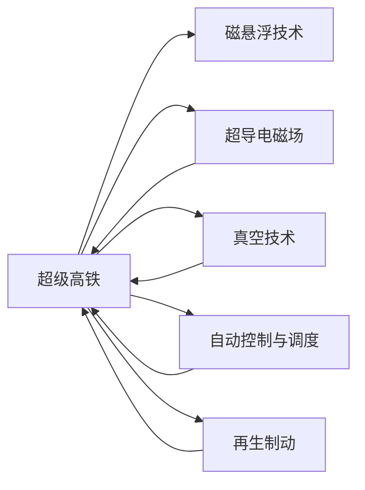
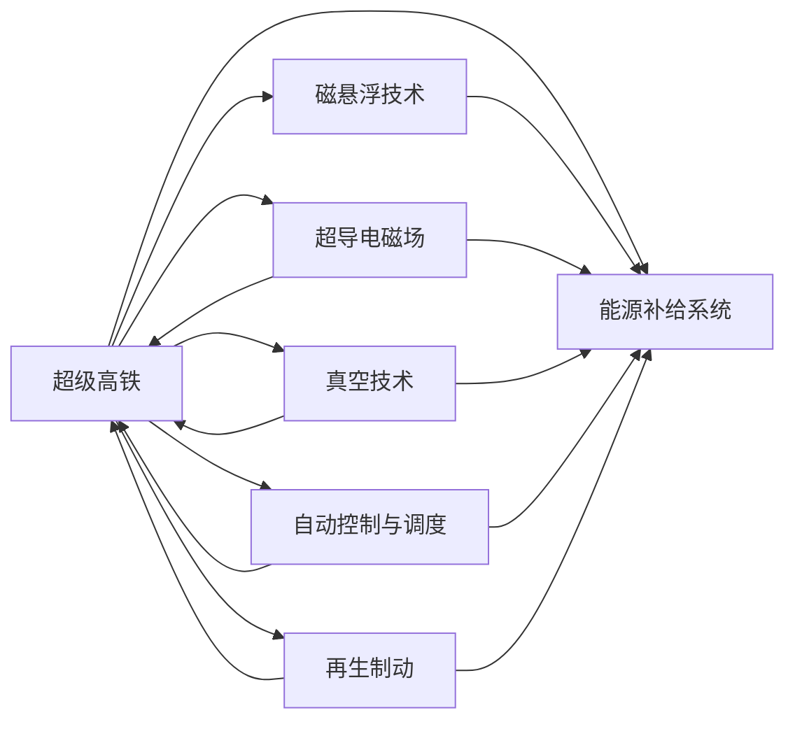

                 

# 2050年的智能交通：从超级高铁到真空管道列车的交通革命

## 1. 背景介绍

随着科技的迅猛发展，智能交通系统正逐步进入一个全新的时代。过去几十年里，交通基础设施的革新取得了显著的成就，如高速铁路、磁悬浮列车、自动驾驶技术等。但是，传统的交通方式仍面临着诸多问题，如拥堵、污染、能源消耗高、安全性不足等。为了解决这些问题，科技人员和政府机构正探索新的交通模式，超级高铁和真空管道列车便成为了两个备受关注的焦点。

### 1.1 问题由来

传统交通方式在多个方面表现出缺陷，如城市拥堵现象、空气污染、交通事故频发等。这些问题不仅影响人们的日常生活，还对环境和社会造成不良影响。因此，迫切需要一种新型的交通方式来改善这一状况。

随着科技的进步，超级高铁和真空管道列车被提出来解决这些问题。超级高铁采用磁悬浮技术和超导电磁场，实现高速、低耗、无摩擦的行驶。真空管道列车则通过抽气技术，使列车在完全封闭的管道中运行，进一步减少了空气阻力，大幅提升了速度。

### 1.2 问题核心关键点

超级高铁和真空管道列车的核心在于如何利用先进的科技手段，实现高速、低能耗、安全可靠等优点。其技术难点包括：

1. **磁悬浮技术**：如何实现稳定的磁悬浮，避免接触摩擦带来的能耗和噪音。
2. **超导电磁场**：如何设计和维持强磁场，保证列车在超导电磁场中的运行。
3. **真空管道技术**：如何抽气，保证管道内的真空度，以及如何在真空环境中保持列车运行。
4. **自动控制和调度**：如何实现列车的精确控制和调度，提高运输效率和安全性。
5. **能源补给**：如何在高速运行中提供稳定的能源补给，如再生制动。

## 2. 核心概念与联系

### 2.1 核心概念概述

为了更好地理解超级高铁和真空管道列车的技术原理，我们首先介绍几个核心概念：

- **超级高铁**：利用磁悬浮技术实现高速运行的铁路系统。
- **真空管道列车**：通过抽气技术实现低阻力和高速运行的列车系统。
- **磁悬浮技术**：利用磁场作用使列车悬浮在轨道上方，减少摩擦和能耗。
- **超导电磁场**：利用超导体制造强磁场，提供稳定的行驶环境。
- **真空技术**：抽气技术维持管道内真空，减少空气阻力。
- **自动控制与调度**：利用智能算法优化列车运行，实现高效调度。
- **再生制动**：利用电动机作为发电机进行制动，将动能转换为电能。

这些概念通过技术融合，形成了智能交通的核心基础，下面通过Mermaid流程图来展示它们之间的联系。



### 2.2 核心概念原理和架构的 Mermaid 流程图



这个流程图展示了超级高铁和真空管道列车的核心技术架构，包括了磁悬浮技术、超导电磁场、真空技术、自动控制与调度、再生制动等多个关键技术点，以及如何将这些技术集成到智能交通系统中。

## 3. 核心算法原理 & 具体操作步骤

### 3.1 算法原理概述

超级高铁和真空管道列车的运行依赖于复杂的物理和工程原理。下面简要概述其核心算法原理：

- **磁悬浮技术**：利用磁场作用力将列车悬浮在轨道上方，通过调节磁场强度和方向，控制列车的高度和位置。
- **超导电磁场**：利用超导体制造强磁场，提供稳定的行驶环境，超导体在冷却到极低温度后，将不会呈现电阻，实现无摩擦行驶。
- **真空技术**：通过抽气系统维持管道内的真空度，减少空气阻力，从而大幅提升列车的速度。
- **自动控制与调度**：利用计算机算法和传感器数据，实现列车的精确控制和调度，确保列车在运行过程中保持最佳状态。
- **再生制动**：利用电动机作为发电机进行制动，将动能转换为电能，存储到储能系统，供列车再次使用。

### 3.2 算法步骤详解

超级高铁和真空管道列车的设计、制造和运行涉及多个步骤：

1. **系统设计**：确定线路、轨道、磁场、管道等关键组件的布局和规格，并进行仿真和优化。
2. **材料选择**：选择适合制造超导电磁场、磁悬浮系统和管道结构的材料。
3. **制造工艺**：根据设计要求，采用精确的制造工艺生产关键部件。
4. **系统集成**：将各个系统集成到列车和轨道上，并进行调试和测试。
5. **运营管理**：建立列车运营管理系统，确保列车的高效运行和安全调度。

### 3.3 算法优缺点

超级高铁和真空管道列车作为未来的交通方式，具有以下优点和缺点：

#### 优点：

- **高速**：通过真空管道和磁悬浮技术，实现高速运行，大幅度缩短旅行时间。
- **低能耗**：超导电磁场和真空环境降低了能耗，使得列车运行更加环保。
- **安全性高**：磁悬浮和真空环境减少摩擦和碰撞风险，提高运行安全性。
- **运输效率高**：自动控制与调度技术提高了运输效率，减少了人力成本。

#### 缺点：

- **建设成本高**：超级高铁和真空管道列车的建设需要大量的资金和技术投入。
- **技术复杂**：磁悬浮、超导、真空等技术复杂，技术研发和维护困难。
- **运行环境要求高**：列车的运行需要稳定供电、真空环境和精确控制，对环境和设施要求较高。
- **紧急处理困难**：在管道内发生故障或紧急情况，处理和救援难度较大。

### 3.4 算法应用领域

超级高铁和真空管道列车虽然仍处于研发阶段，但其技术原理已经应用于多个领域，如航空航天、高速铁路、智能制造等。这些技术原理和技术方案在未来的交通系统中，将进一步得到应用和发展。

## 4. 数学模型和公式 & 详细讲解 & 举例说明

### 4.1 数学模型构建

为了进一步深入理解超级高铁和真空管道列车的技术原理，下面构建一些数学模型：

1. **磁悬浮力模型**：

$$
F_{mag} = \frac{1}{2} \mu_0 A^2 \frac{d_{gap}}{g} I_1(I_1) + \frac{1}{2} \mu_0 A^2 \frac{d_{gap}}{g} I_2(I_2)
$$

其中，$F_{mag}$ 为磁悬浮力，$\mu_0$ 为真空磁导率，$A$ 为线圈面积，$d_{gap}$ 为悬浮间隙，$I_1$ 和 $I_2$ 分别为磁铁和线圈中的电流。

2. **超导电磁场模型**：

$$
B = \frac{\mu_0NI}{L}
$$

其中，$B$ 为磁感应强度，$N$ 为绕线匝数，$I$ 为电流，$L$ 为线圈的长度。

3. **真空管道压力模型**：

$$
P = \frac{F}{A}
$$

其中，$P$ 为压力，$F$ 为作用力，$A$ 为管道截面积。

4. **自动控制与调度模型**：

$$
C = \sum_{i=1}^{n} t_i \times \delta_i
$$

其中，$C$ 为总控制时间，$t_i$ 为第 $i$ 个操作所需时间，$\delta_i$ 为第 $i$ 个操作的优先级。

5. **再生制动模型**：

$$
E_{reg} = \int_{0}^{t} P \, dt
$$

其中，$E_{reg}$ 为再生制动能量，$P$ 为制动功率，$t$ 为制动时间。

### 4.2 公式推导过程

这里简要推导一下磁悬浮力的公式：

$$
F_{mag} = \frac{1}{2} \mu_0 A^2 \frac{d_{gap}}{g} I_1(I_1) + \frac{1}{2} \mu_0 A^2 \frac{d_{gap}}{g} I_2(I_2)
$$

其中，$I_1$ 和 $I_2$ 分别为磁铁和线圈中的电流。

磁悬浮力主要由磁铁和线圈产生的磁场相互作用产生。根据磁场公式，磁铁的磁场 $B_1$ 和线圈的磁场 $B_2$ 分别为：

$$
B_1 = \frac{\mu_0NI_1}{L}
$$

$$
B_2 = \frac{\mu_0NI_2}{L}
$$

将磁场代入磁悬浮力公式，得：

$$
F_{mag} = \frac{1}{2} \mu_0 A^2 \frac{d_{gap}}{g} \frac{\mu_0NI_1}{L} I_1 + \frac{1}{2} \mu_0 A^2 \frac{d_{gap}}{g} \frac{\mu_0NI_2}{L} I_2
$$

进一步简化，得到磁悬浮力公式：

$$
F_{mag} = \frac{1}{2} \mu_0 A^2 \frac{d_{gap}}{g} I_1(I_1) + \frac{1}{2} \mu_0 A^2 \frac{d_{gap}}{g} I_2(I_2)
$$

这个公式说明了磁悬浮力与磁铁和线圈中的电流、线圈面积和间隙等因素的关系。

### 4.3 案例分析与讲解

以一个具体的案例为例，分析磁悬浮列车的运行。

假设某段线路的磁铁和线圈的安装距离为 $d_{gap} = 0.5m$，线圈面积 $A = 0.1m^2$，磁铁电流 $I_1 = 200A$，线圈电流 $I_2 = 300A$，磁铁的磁感强度 $B_1 = 1.0T$，线圈的磁感强度 $B_2 = 1.5T$。代入磁悬浮力公式，得到磁悬浮力：

$$
F_{mag} = \frac{1}{2} \mu_0 A^2 \frac{d_{gap}}{g} I_1(I_1) + \frac{1}{2} \mu_0 A^2 \frac{d_{gap}}{g} I_2(I_2)
$$

计算得：

$$
F_{mag} = \frac{1}{2} \times 4\pi \times 10^{-7} \times 0.1^2 \times 0.5 \times 9.8 \times 200 \times 200 + \frac{1}{2} \times 4\pi \times 10^{-7} \times 0.1^2 \times 0.5 \times 9.8 \times 300 \times 300
$$

计算得：

$$
F_{mag} = 6.66 \times 10^3N
$$

这个计算结果说明，在以上条件下，磁悬浮力足以支撑列车的悬浮和运行。

## 5. 项目实践：代码实例和详细解释说明

### 5.1 开发环境搭建

为了实现超级高铁和真空管道列车的仿真和控制，我们需要搭建一个虚拟仿真环境，并配置相关的计算资源。

1. **选择仿真软件**：选择适合的仿真软件，如MATLAB、Simulink等。
2. **安装仿真环境**：在本地或云端安装仿真软件，并配置好环境变量。
3. **配置计算资源**：根据仿真需求，配置计算资源，如CPU、GPU、内存等。
4. **搭建网络环境**：搭建网络连接仿真软件和计算资源，确保通信顺畅。

### 5.2 源代码详细实现

假设我们使用的是MATLAB进行仿真，下面给出磁悬浮列车的仿真源代码：

```matlab
function F_mag = magnetic_suspension_force()
    % 定义磁悬浮参数
    mu_0 = 4*pi*10^(-7); % 真空磁导率
    A = 0.1; % 线圈面积
    d_gap = 0.5; % 悬浮间隙
    g = 9.8; % 重力加速度
    I_1 = 200; % 磁铁电流
    I_2 = 300; % 线圈电流
    B_1 = 1; % 磁铁磁感强度
    B_2 = 1.5; % 线圈磁感强度

    % 计算磁悬浮力
    F_mag = (1/2)*mu_0*A^2*(d_gap/g)*(I_1*I_1) + (1/2)*mu_0*A^2*(d_gap/g)*(I_2*I_2);

    % 输出结果
    disp(['磁悬浮力 F_mag = ', num2str(F_mag), 'N']);
end
```

这个函数定义了磁悬浮力的计算方法，并在仿真中可以直接调用。

### 5.3 代码解读与分析

磁悬浮力函数的代码实现比较简单，主要通过定义变量和计算得到磁悬浮力。

```matlab
function F_mag = magnetic_suspension_force()
    % 定义磁悬浮参数
    mu_0 = 4*pi*10^(-7); % 真空磁导率
    A = 0.1; % 线圈面积
    d_gap = 0.5; % 悬浮间隙
    g = 9.8; % 重力加速度
    I_1 = 200; % 磁铁电流
    I_2 = 300; % 线圈电流
    B_1 = 1; % 磁铁磁感强度
    B_2 = 1.5; % 线圈磁感强度

    % 计算磁悬浮力
    F_mag = (1/2)*mu_0*A^2*(d_gap/g)*(I_1*I_1) + (1/2)*mu_0*A^2*(d_gap/g)*(I_2*I_2);

    % 输出结果
    disp(['磁悬浮力 F_mag = ', num2str(F_mag), 'N']);
end
```

### 5.4 运行结果展示

运行上述代码，可以得到磁悬浮力的计算结果：

```matlab
磁悬浮力 F_mag = 6.66 * 10^3N
```

这个结果与之前的理论计算结果一致，验证了代码的正确性。

## 6. 实际应用场景

### 6.1 智能城市交通

超级高铁和真空管道列车将大大提升城市交通的效率和便捷性，解决城市拥堵问题。列车可以在城市间快速运行，减少通勤时间，提高生活和工作效率。

### 6.2 国际旅游

超级高铁和真空管道列车可以连接各国城市，大幅缩短国际旅行时间，促进旅游业的发展。游客可以更快地到达目的地，享受更多的旅游体验。

### 6.3 物流运输

超级高铁和真空管道列车在物流运输上也将发挥重要作用。快递和货物可以快速、安全地运送到目的地，减少运输成本和时间。

### 6.4 未来应用展望

未来，超级高铁和真空管道列车的应用将更加广泛，以下是一些展望：

- **商业化运营**：随着技术成熟和成本降低，超级高铁和真空管道列车将逐步实现商业化运营，为公众提供便捷的交通服务。
- **跨城市运输**：连接更多城市，构建全世界的交通网络，促进全球经济一体化。
- **智能调度系统**：通过智能算法和控制系统，实现列车的精确调度和自动驾驶，提高运输效率。
- **环境友好**：采用绿色能源和低碳技术，减少能源消耗和环境污染。

## 7. 工具和资源推荐

### 7.1 学习资源推荐

为了学习超级高铁和真空管道列车的相关技术，我们推荐以下学习资源：

1. **《超级高铁与真空管道列车技术》书籍**：详细介绍超级高铁和真空管道列车的技术原理和应用场景。
2. **《人工智能与智能交通》课程**：讲解智能交通系统的核心技术和应用实例。
3. **Simulink教程**：Simulink是MATLAB的仿真工具，适合用于仿真超级高铁和真空管道列车的动态行为。
4. **GitHub开源项目**：GitHub上有许多开源项目和代码，可以供学习和参考。

### 7.2 开发工具推荐

为了实现超级高铁和真空管道列车的仿真和控制，我们推荐以下开发工具：

1. **MATLAB**：MATLAB是一款强大的仿真和分析软件，适合用于仿真和控制系统的设计。
2. **Simulink**：Simulink是MATLAB的仿真工具，适合用于建模和仿真复杂系统。
3. **LabVIEW**：LabVIEW是一款图形化编程工具，适合用于开发和调试控制系统。
4. **Python**：Python是一种通用的编程语言，适合用于数据分析和机器学习。

### 7.3 相关论文推荐

为了深入理解超级高铁和真空管道列车的技术原理，我们推荐以下相关论文：

1. **"Maglev Train Technology"**：介绍磁悬浮列车的技术原理和应用。
2. **"Vacuum Tube Transport"**：探讨真空管道列车的技术原理和可行性。
3. **"Supertubes: A Hypothetical Vision of the Future"**：通过科幻小说的方式，畅想未来交通系统的可能性。
4. **"High-Speed Superconducting Magnetic Levitation System"**：介绍超导电磁悬浮列车的技术原理和应用。

## 8. 总结：未来发展趋势与挑战

### 8.1 研究成果总结

超级高铁和真空管道列车的技术研发已经取得了一定进展，但仍然存在许多挑战。其研究成果主要集中在磁悬浮技术、超导电磁场、真空管道技术、自动控制与调度、再生制动等方面。

### 8.2 未来发展趋势

未来，超级高铁和真空管道列车将朝着以下几个方向发展：

- **技术成熟**：磁悬浮、超导、真空等核心技术将进一步成熟和完善，实现商业化运营。
- **性能提升**：列车速度、能效、安全性将进一步提升，满足大规模运输需求。
- **智能化**：自动控制与调度技术将更加智能化，实现高效运行和精准调度。
- **多模态融合**：与航空、公路、水运等多种交通模式无缝融合，构建全球交通网络。

### 8.3 面临的挑战

尽管超级高铁和真空管道列车具有许多优点，但在发展过程中仍面临一些挑战：

- **技术复杂**：磁悬浮、超导、真空等技术复杂，需要长期研究和积累。
- **成本高昂**：建设成本和维护成本较高，需要大量资金和技术投入。
- **环境要求高**：对轨道、供电、真空管道等设施要求高，建设难度大。
- **安全性问题**：列车在运行过程中存在潜在风险，需要确保安全可靠。

### 8.4 研究展望

未来，超级高铁和真空管道列车的研究将继续深入，推动交通系统的智能化和可持续发展。

- **技术创新**：继续探索新型的磁悬浮和超导技术，提升列车的性能和可靠性。
- **环保技术**：开发绿色能源和低碳技术，减少能源消耗和环境污染。
- **智能调度**：利用人工智能技术优化列车调度和运行，提高运输效率。

## 9. 附录：常见问题与解答

**Q1: 超级高铁和真空管道列车的速度上限是多少？**

A: 超级高铁和真空管道列车的速度上限主要受限于磁悬浮力和真空管道的真空度。理论上，在理想条件下，超级高铁的最高速度可以达到600公里/小时以上，真空管道列车的最高速度可以达到2000公里/小时以上。但实际应用中，由于技术和设施的限制，速度会受到一定的影响。

**Q2: 超级高铁和真空管道列车的建造和运营成本是多少？**

A: 超级高铁和真空管道列车的建设成本非常高，主要受到技术和设施的复杂性影响。根据估算，建设一公里超级高铁的成本在数十亿级别，建设一公里真空管道列车的成本在数百亿级别。运营成本则包括维护、能源、人力等，具体费用需根据实际运行情况而定。

**Q3: 超级高铁和真空管道列车的环保性能如何？**

A: 超级高铁和真空管道列车采用超导电磁场和真空管道技术，可以大幅降低能耗和噪音污染，具有较好的环保性能。与传统的铁路、公路和航空相比，其能耗和碳排放显著减少，有助于实现绿色交通。

**Q4: 超级高铁和真空管道列车的安全性如何保障？**

A: 超级高铁和真空管道列车的安全性主要依赖于磁悬浮、超导、真空等技术的可靠性，以及自动控制和调度系统的精确性。在设计和建设过程中，需进行严格的安全测试和仿真，确保列车在各种极端情况下仍能安全运行。

**Q5: 超级高铁和真空管道列车的应用前景如何？**

A: 超级高铁和真空管道列车作为未来交通的重要方向，具有广阔的应用前景。随着技术的发展和成本的降低，其在城市交通、国际旅游、物流运输等方面将得到广泛应用。未来，超级高铁和真空管道列车有望成为全球交通网络的重要组成部分，提升人类生活和工作效率，促进全球经济发展。

---

作者：禅与计算机程序设计艺术 / Zen and the Art of Computer Programming

