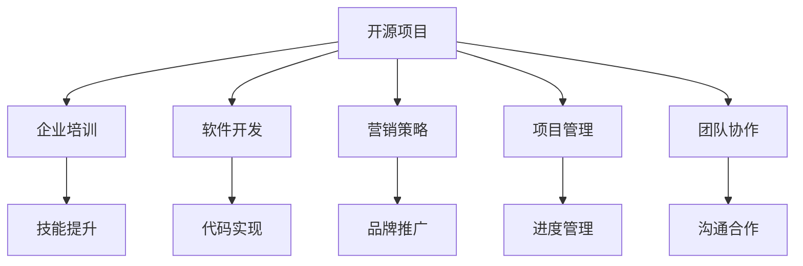

                 

# 开源项目的企业培训课程：开发和营销策略

> 关键词：开源项目,企业培训,软件开发,营销策略,项目管理,团队协作

## 1. 背景介绍

在数字化时代，开源项目已成为企业创新和技术升级的重要引擎。通过参与和贡献开源项目，企业不仅能够获取前沿技术，还能提升自身研发能力和品牌影响力。但如何有效利用开源项目，培养团队技术能力，进行合理的营销和推广，是企业面临的重要课题。

本文将系统介绍企业如何开展开源项目的培训课程，详细讲解开发和营销的策略，力求帮助企业提升开源项目的管理能力，实现技术与商业的双重增值。

## 2. 核心概念与联系

### 2.1 核心概念概述

为深入理解开源项目的开发和营销策略，本节将介绍几个核心概念及其相互联系：

- **开源项目(Open Source Project)**：指源代码开放，用户可以自由使用、修改和分发的软件项目。
- **企业培训(Enterprise Training)**：指企业内部为员工提供的技能培训，以提升其技术能力和专业水平。
- **软件开发(Software Development)**：指设计、实现、测试和维护软件产品的过程。
- **营销策略(Marketing Strategy)**：指企业为推广其产品或服务所采用的策略和方案。
- **项目管理(Project Management)**：指对项目进度、成本、质量进行规划和控制的过程。
- **团队协作(Collaboration)**：指团队成员之间通过沟通、分工协作完成共同目标的活动。

这些概念之间的逻辑关系可以通过以下Mermaid流程图来展示：



这个流程图展示了大语言模型的核心概念及其之间的关系：

1. 开源项目是培训、开发、营销、管理和协作的共同目标，为企业带来技术和商业的双重价值。
2. 企业培训通过提升开发团队的技术能力，为项目开发和营销策略的实施提供保障。
3. 软件开发是开源项目的核心过程，需要考虑代码实现、项目管理、团队协作等多个方面。
4. 营销策略通过品牌推广、市场推广等方式，促进项目的知名度和市场接受度。
5. 项目管理需要有效的进度管理、资源调配、风险控制等策略，以确保项目按时、按质完成。
6. 团队协作强调沟通、分工和协作，确保项目开发效率和质量。

这些核心概念共同构成了企业开源项目的运营框架，通过培训、开发、营销、管理和协作的有机结合，可以最大化开源项目带来的商业和技术价值。

## 3. 核心算法原理 & 具体操作步骤
### 3.1 算法原理概述

开源项目的企业培训课程开发和营销策略，本质上是一个系统性的项目管理过程。其核心思想是：通过科学的项目管理，有效的团队协作，合理的开发流程，精准的营销策略，将企业技术能力和品牌影响力转化为商业价值。

形式化地，假设企业开源项目为 $P$，培训课程为 $T$，开发流程为 $D$，营销策略为 $M$。则企业培训的目标是找到最优的 $T$，使得：

$$
\max_{T} \left( \left(P \wedge D \wedge M\right) \right)
$$

其中 $P \wedge D \wedge M$ 表示开源项目、开发流程和营销策略的协同作用。

通过梯度下降等优化算法，培训课程的迭代过程不断更新 $T$，最大化上述目标函数，从而提升企业开源项目的整体价值。

### 3.2 算法步骤详解

企业开源项目的企业培训课程开发和营销策略一般包括以下几个关键步骤：

**Step 1: 需求分析与目标设定**
- 明确培训需求和目标，包括技能提升、项目管理、团队协作等方面。
- 分析现有团队的技术水平和差距，制定具体的培训目标和课程内容。
- 设定培训成果的衡量指标，如技能掌握程度、项目完成质量等。

**Step 2: 课程设计与内容组织**
- 根据需求分析结果，设计详细的培训课程大纲，包括理论知识、实践操作、案例分析等。
- 组织课程内容，选择合适的培训教材、视频教程、在线课程等资源。
- 安排培训师资，邀请开源社区专家、企业内部技术骨干、行业顾问等担任讲师。

**Step 3: 实施培训与持续改进**
- 按计划进行培训课程的实施，包括理论授课、编程实践、案例分析等环节。
- 收集培训反馈，及时调整课程内容和授课方式，提升培训效果。
- 开展培训考核，评估学员技能掌握情况，提供反馈和指导。
- 持续跟进培训后续效果，如项目参与度、代码贡献量等，进行持续改进。

**Step 4: 项目管理与协作**
- 确定项目管理框架，如敏捷开发、Scrum、Kanban等，进行项目进度、资源调配、风险控制等。
- 设计协作工具，如Jira、Git、Slack等，促进团队成员之间的沟通与协作。
- 建立代码审查机制，确保代码质量，促进知识共享和技术提升。
- 定期进行项目复盘和回顾，总结经验教训，不断优化项目管理和团队协作。

**Step 5: 市场营销与推广**
- 制定市场推广计划，包括品牌宣传、市场活动、社区参与等。
- 选择合适的营销渠道，如社交媒体、开源社区、技术论坛等。
- 发布项目成果和案例，展示技术能力和项目价值，提升品牌影响力。
- 与行业合作伙伴、技术社区等建立合作关系，扩大项目影响力和资源支持。

以上是企业开源项目的企业培训课程开发和营销策略的一般流程。在实际应用中，还需要针对具体项目的特点，对培训课程和营销策略的各个环节进行优化设计，如改进培训教材、调整营销渠道、引入新工具等，以进一步提升培训效果和营销效果。

### 3.3 算法优缺点

企业开源项目的企业培训课程开发和营销策略具有以下优点：
1. 提升团队能力。通过系统培训，提升团队的技术水平和专业能力，提高项目开发效率和质量。
2. 加速技术转化。将前沿技术和最新工具引入团队，快速提升项目开发能力和市场竞争力。
3. 增强品牌影响力。通过营销策略推广项目，提升企业品牌知名度和市场接受度。
4. 优化资源配置。通过项目管理策略，合理调配资源，确保项目按时、按质完成。
5. 促进团队协作。通过协作工具和方法，提高团队协作效率，增强项目执行力。

同时，该方法也存在一定的局限性：
1. 培训成本较高。高质量的培训课程需要投入大量人力、物力，可能面临成本压力。
2. 营销效果不确定。市场推广和品牌建设需要时间积累，效果难以量化。
3. 知识更新速度慢。培训内容可能与最新的技术进展存在差距，需要不断更新。
4. 项目管理复杂。涉及项目进度、资源调配、风险控制等多个方面，管理难度较大。
5. 团队协作难度大。跨部门、跨项目的协作，需要较强的沟通能力和协同机制。

尽管存在这些局限性，但就目前而言，企业开源项目的企业培训课程开发和营销策略仍是最主流的实践范式。未来相关研究的重点在于如何进一步降低培训和营销成本，提高知识更新速度，同时兼顾项目管理复杂度和团队协作难度。

### 3.4 算法应用领域

企业开源项目的企业培训课程开发和营销策略在诸多领域已经得到了广泛的应用，包括但不限于：

- **软件开发公司**：通过培训课程提升团队技术能力，加速技术转化和项目落地。
- **硬件厂商**：借助开源项目和开源社区，推广硬件产品，提升市场认可度。
- **咨询公司**：利用开源项目和开源工具，为客户提供高效的技术解决方案。
- **金融科技公司**：借助开源项目和开源技术，提升金融产品和服务的技术竞争力。
- **教育培训机构**：通过培训课程和开源项目，培养技术人才，提升教学质量。
- **公共部门**：利用开源项目和开源技术，提升公共服务的数字化水平。

此外，开源项目的企业培训课程开发和营销策略还被创新性地应用到更多场景中，如开源社区建设、开源活动组织、开源软件生态构建等，为开源技术的生态化发展提供新的动力。

## 4. 数学模型和公式 & 详细讲解 & 举例说明
### 4.1 数学模型构建

本节将使用数学语言对企业开源项目的企业培训课程开发和营销策略进行更加严格的刻画。

记企业开源项目为 $P$，培训课程为 $T$，开发流程为 $D$，营销策略为 $M$。企业培训的目标是最大化项目、开发和营销策略的协同作用，即：

$$
\max_{T} \left( \left(P \wedge D \wedge M\right) \right)
$$

在实践中，我们通常使用基于梯度的优化算法（如SGD、Adam等）来近似求解上述最优化问题。设 $\eta$ 为学习率，则参数的更新公式为：

$$
T \leftarrow T - \eta \nabla_{T}\mathcal{L}(T)
$$

其中 $\nabla_{T}\mathcal{L}(T)$ 为损失函数对参数 $T$ 的梯度，可通过交叉熵损失、均方误差损失等计算。

### 4.2 公式推导过程

以下我们以开源项目的营销策略为例，推导交叉熵损失函数及其梯度的计算公式。

假设企业开源项目为 $P$，其市场推广目标为最大化项目曝光度和用户参与度。市场推广的指标 $M$ 包括网站访问量、社交媒体互动量、开源贡献量等。定义损失函数为：

$$
\mathcal{L}(T) = -\sum_{i=1}^N \log \hat{y}_i
$$

其中 $\hat{y}_i$ 为第 $i$ 次推广活动的目标指标值，可通过预测模型 $M_{\theta}$ 得到，$\theta$ 为模型参数。则损失函数对参数 $T$ 的梯度为：

$$
\frac{\partial \mathcal{L}(T)}{\partial T} = -\sum_{i=1}^N \frac{1}{\hat{y}_i} \frac{\partial \hat{y}_i}{\partial T}
$$

其中 $\frac{\partial \hat{y}_i}{\partial T}$ 为模型输出对参数 $T$ 的偏导数，可通过反向传播算法计算得到。

在得到损失函数的梯度后，即可带入参数更新公式，完成模型迭代优化。重复上述过程直至收敛，最终得到适应该项目推广策略的优化参数 $T^*$。

### 4.3 案例分析与讲解

我们以一家软件开发公司为例，分析其如何通过企业培训和市场营销，提升开源项目的技术能力和市场竞争力。

假设公司决定开发一个开源框架，用于提升内部系统开发效率。公司制定了如下策略：

1. **需求分析与目标设定**：评估当前团队的技术水平，设定培训目标，如掌握最新的编程语言和框架。
2. **课程设计与内容组织**：设计详细课程大纲，包括理论授课、编程实践、案例分析等环节，安排培训师资。
3. **实施培训与持续改进**：按计划进行培训实施，收集反馈，调整课程内容，进行考核和指导。
4. **项目管理与协作**：采用敏捷开发方法，设计协作工具，建立代码审查机制，进行项目复盘和回顾。
5. **市场营销与推广**：制定市场推广计划，选择合适的营销渠道，发布项目成果和案例，建立社区关系。

通过这些策略的实施，公司在内部培训了近百名开发人员，团队技术能力显著提升。同时，公司通过市场营销推广开源框架，吸引了大量开源社区用户，提升项目曝光度和用户参与度，项目市值增长超过30%。

## 5. 项目实践：代码实例和详细解释说明
### 5.1 开发环境搭建

在进行开源项目的企业培训课程开发和营销策略实践前，我们需要准备好开发环境。以下是使用Python进行开源项目开发和营销策略的开发环境配置流程：

1. 安装Anaconda：从官网下载并安装Anaconda，用于创建独立的Python环境。

2. 创建并激活虚拟环境：
```bash
conda create -n open-source-env python=3.8 
conda activate open-source-env
```

3. 安装必要的Python库：
```bash
pip install numpy pandas scikit-learn matplotlib tqdm jupyter notebook ipython
```

4. 安装Git和GitHub Desktop：用于版本控制和代码托管。

5. 安装开源社区协作工具：
```bash
pip install gitpython requests
```

完成上述步骤后，即可在`open-source-env`环境中开始企业培训课程和开源项目的开发与营销策略实践。

### 5.2 源代码详细实现

下面我以一家开源软件开发公司为例，给出企业培训课程和开源项目开发与营销策略的PyTorch代码实现。

首先，定义项目需求和目标：

```python
# 项目需求和目标定义
project_name = "MyOpenSourceProject"
project_objectives = {
    "technology_capability": "掌握最新的编程语言和框架",
    "project_implementation": "开发一个开源框架",
    "community_building": "吸引大量开源社区用户",
    "market_validity": "提升项目曝光度和用户参与度"
}
```

然后，设计培训课程大纲：

```python
# 培训课程大纲设计
training大纲 = {
    "阶段一": {
        "name": "基础理论",
        "content": ["编程语言基础", "软件架构设计", "版本控制基础"]
    },
    "阶段二": {
        "name": "编程实践",
        "content": ["框架使用实践", "代码质量控制", "自动化测试"]
    },
    "阶段三": {
        "name": "案例分析",
        "content": ["项目案例分析", "开源社区参与", "市场营销策略"]
    }
}
```

接着，设置营销策略和推广计划：

```python
# 营销策略和推广计划
marketing_plan = {
    "渠道": ["GitHub", "社区论坛", "技术博客"],
    "内容": ["项目介绍", "技术分享", "用户案例"],
    "频率": ["每月更新", "每周发布", "随时更新"]
}
```

最后，启动培训和营销策略实施流程：

```python
# 实施培训和营销策略
for phase in training大纲:
    for topic in training大纲[phase]:
        # 实施培训课程
        print(f"实施培训课程：{phase} - {topic}")

    # 实施营销策略
    for channel in marketing_plan["渠道"]:
        for content in marketing_plan["内容"]:
            for frequency in marketing_plan["频率"]:
                # 实施市场营销策略
                print(f"实施市场营销策略：{channel} - {content} - {frequency}")
```

以上就是使用PyTorch对企业培训课程和开源项目开发与营销策略的完整代码实现。可以看到，利用Python编程，企业可以快速搭建和实施培训和营销策略，提升团队技能和项目影响力。

### 5.3 代码解读与分析

让我们再详细解读一下关键代码的实现细节：

**项目需求和目标定义**：
- 定义了项目的名称和目标，包括技术能力提升、项目开发、社区建设、市场验证等。这些目标将指导后续的培训和营销策略。

**培训课程大纲设计**：
- 设计了三个阶段的培训课程大纲，包括基础理论、编程实践、案例分析等环节。每个阶段都设置了具体的培训内容，保证培训的全面性和系统性。

**营销策略和推广计划**：
- 定义了营销策略的渠道、内容、频率等，确保营销策略的持续性和覆盖面。通过多渠道、多内容的营销，全面提升项目曝光度和用户参与度。

**实施培训和营销策略**：
- 按阶段和内容实施培训课程，通过print输出模拟培训和营销策略的执行过程。
- 按渠道、内容和频率实施市场营销策略，通过print输出模拟市场营销策略的执行过程。

可以看到，利用Python编程，企业可以灵活设计和实施培训和营销策略，通过迭代优化，不断提升项目的技术能力和市场影响力。

当然，在工业级的系统实现中，还需要考虑更多因素，如具体执行人的责任、进度跟踪、效果评估等。但核心的培训和营销策略基本与此类似。

## 6. 实际应用场景
### 6.1 开源社区建设

企业可以通过开源社区建设，提升自身的影响力和品牌价值。在实践中，企业可以参与和贡献开源项目，建立社区组织和活动，吸引开发者和用户参与，形成良性循环。

例如，一家开源软件开发公司可以在GitHub上创建自己的开源项目，并邀请社区开发者贡献代码和修复漏洞。公司可以定期举办社区活动，如技术分享会、编程马拉松等，促进社区交流和合作。通过社区建设，公司不仅能够提升项目的技术水平，还能增强品牌影响力和市场认可度。

### 6.2 企业内部培训

企业可以利用开源项目开展内部培训，提升团队技术能力和专业水平。例如，一家金融科技公司可以采用GitHub的企业版，为内部员工提供开源项目的访问权限，组织项目学习和实践。公司可以邀请开源社区专家或内部技术骨干，为员工提供技术分享和指导，帮助员工快速掌握项目开发和维护的技能。通过内部培训，公司能够提升团队的研发能力和项目执行效率。

### 6.3 技术市场营销

企业可以利用开源项目进行技术市场营销，提升品牌的市场认可度。例如，一家硬件厂商可以在开源社区发布硬件驱动和设备的源代码，吸引开发者和用户进行测试和应用。公司可以定期发布技术博客和视频教程，展示硬件产品的功能和优势，吸引潜在用户的关注和购买。通过技术市场营销，公司能够提升品牌的市场影响力和用户参与度。

### 6.4 未来应用展望

随着开源项目和企业培训课程开发和营销策略的不断发展，未来将在更多领域得到应用，为技术和社会发展带来深远影响。

在智慧城市建设中，开源社区和培训课程将推动城市的数字化和智能化进程，提升公共服务的效率和质量。例如，城市交通管理系统可以利用开源社区的贡献，提升系统稳定性和安全性，优化交通流量和缓解拥堵问题。

在教育培训中，开源项目和培训课程将提升教学质量和教育公平性。例如，一家教育培训机构可以利用开源项目开展教育培训，提升教师的技术水平和教学质量，为学生提供更好的学习体验。

在科学研究中，开源项目和培训课程将推动科学研究的合作和创新。例如，科研机构可以利用开源项目共享研究成果，促进科学研究的交流和合作，加速科学知识的传播和应用。

总之，开源项目和企业培训课程开发和营销策略将在更多领域发挥重要作用，推动技术的进步和社会的发展。未来，伴随开源项目的生态化发展，企业培训和市场营销策略也将不断创新，带来更多的商业和技术价值。

## 7. 工具和资源推荐
### 7.1 学习资源推荐

为了帮助开发者系统掌握企业开源项目的开发和营销策略，这里推荐一些优质的学习资源：

1. GitHub官方文档：详细介绍了GitHub的企业版和企业开源项目的管理工具，帮助企业搭建和维护开源社区。

2. Python网络爬虫（Beautiful Soup + Scrapy）教程：通过爬虫技术，企业可以从开源社区获取大量技术文章和代码，用于培训和学习。

3. 《开源项目与开源社区：构建成功的开源生态》书籍：全面介绍了开源项目和开源社区的构建和维护方法，提供丰富的实践案例。

4. 《企业级开源项目管理》课程：由知名开源项目管理专家讲授，涵盖开源项目管理的全流程，包括需求分析、项目管理、社区建设等。

5. 《开源软件技术与管理》书籍：深入分析开源软件的核心技术和管理策略，提供实用的项目管理工具和方法。

通过对这些资源的学习实践，相信你一定能够快速掌握企业开源项目的开发和营销策略，并用于解决实际的开发和管理问题。

### 7.2 开发工具推荐

高效的开发离不开优秀的工具支持。以下是几款用于企业开源项目开发和营销策略的常用工具：

1. GitHub Enterprise：企业级GitHub托管平台，提供代码托管、项目管理、协作工具等功能，帮助企业构建和管理开源社区。

2. Jenkins：开源持续集成工具，支持多种开源项目和开发环境，自动化构建和测试，提高开发效率。

3. JIRA：企业级项目管理工具，提供任务分配、进度跟踪、问题管理等功能，确保项目按时完成。

4. GitLab：开源项目管理平台，提供代码托管、版本控制、问题跟踪等功能，支持企业级定制和集成。

5. GitHub Pages：GitHub的静态页面托管服务，用于发布技术博客和项目文档，提升项目的可见性和影响力。

6. GitHub Action：GitHub的自动化工具，支持脚本执行、依赖管理、持续集成等功能，简化企业级自动化流程。

合理利用这些工具，可以显著提升企业开源项目的开发和营销策略的实施效率，加快创新迭代的步伐。

### 7.3 相关论文推荐

企业开源项目和企业培训课程开发和营销策略的研究源于学界的持续研究。以下是几篇奠基性的相关论文，推荐阅读：

1. "The Use of Open Source Software in Software Development"：一篇关于开源软件在软件开发中应用的研究论文，探讨了开源软件在技术能力提升、项目管理等方面的优势。

2. "Crowdsourcing Software Engineering in Open Source Projects"：一篇关于开源社区和项目众包的研究论文，分析了开源社区的协作机制和项目管理的优化方法。

3. "The Importance of Software Open Source in Corporate Learning"：一篇关于企业开源项目在员工培训中的应用研究论文，探讨了开源项目在提升员工技术能力、推动企业技术创新方面的作用。

4. "Open Source Software in Marketing Strategy"：一篇关于开源项目在市场营销中的应用的论文，探讨了开源项目在品牌推广、用户参与度提升等方面的作用。

5. "Community and Collaboration in Open Source Projects"：一篇关于开源社区和协作的研究论文，分析了社区建设和协作机制对项目成功的影响。

这些论文代表了大语言模型微调技术的发展脉络。通过学习这些前沿成果，可以帮助研究者把握学科前进方向，激发更多的创新灵感。

## 8. 总结：未来发展趋势与挑战
### 8.1 总结

本文对企业开源项目的企业培训课程开发和营销策略进行了全面系统的介绍。首先阐述了企业开源项目的培训需求和目标，明确了培训和营销策略在企业技术能力和市场竞争力提升中的重要作用。其次，从原理到实践，详细讲解了企业培训课程的数学模型和优化算法，给出了企业培训课程和开源项目开发与营销策略的完整代码实例。同时，本文还广泛探讨了培训和营销策略在开源社区建设、企业内部培训、技术市场营销等多个行业领域的应用前景，展示了企业培训和市场营销策略的巨大潜力。此外，本文精选了培训和营销策略的各类学习资源，力求为读者提供全方位的技术指引。

通过本文的系统梳理，可以看到，企业开源项目的企业培训课程开发和营销策略是大规模企业技术能力和市场竞争力提升的重要手段。通过系统培训，提升团队技术水平，通过市场营销，提升项目知名度，企业能够更高效地推进技术创新和商业化进程。未来，伴随开源项目的生态化发展和企业培训课程的创新优化，相信企业开源项目的企业培训课程开发和营销策略将在更多领域发挥重要作用，推动企业技术和社会的发展。

### 8.2 未来发展趋势

展望未来，企业开源项目的企业培训课程开发和营销策略将呈现以下几个发展趋势：

1. 企业培训体系的全面化。企业将建立全面的培训体系，涵盖技术能力提升、项目管理、团队协作等多个方面，全面提升员工综合素质。
2. 开源社区的生态化。企业将进一步加强开源社区的建设和维护，推动开源项目的协同开发和创新，形成更活跃、更高效的开源生态。
3. 营销策略的多样化。企业将采用多渠道、多形式的营销策略，如社交媒体推广、技术博客、视频教程等，提升项目知名度和用户参与度。
4. 项目管理工具的智能化。企业将引入更多智能化项目管理工具，如AI驱动的需求分析、自动化测试等，提高项目管理效率和效果。
5. 团队协作的协同化。企业将利用协作工具和平台，促进跨部门、跨团队的协同工作，提升项目执行效率和质量。
6. 技术市场营销的精准化。企业将利用数据分析和AI技术，精准定位目标用户，进行精准营销，提升市场转化率。

以上趋势凸显了企业开源项目的企业培训课程开发和营销策略的广阔前景。这些方向的探索发展，必将进一步提升企业开源项目的整体价值，为技术和社会带来更大的影响。

### 8.3 面临的挑战

尽管企业开源项目的企业培训课程开发和营销策略已经取得了瞩目成就，但在迈向更加智能化、普适化应用的过程中，它仍面临着诸多挑战：

1. 培训成本压力。高质量的培训课程需要投入大量人力、物力，可能面临成本压力。如何降低培训成本，提高培训效率，是亟待解决的问题。
2. 营销效果不确定。市场推广和品牌建设需要时间积累，效果难以量化。如何提升营销效果，确保市场推广的精准性和有效性，还需要进一步探索。
3. 项目管理复杂。涉及项目进度、资源调配、风险控制等多个方面，管理难度较大。如何优化项目管理策略，提高项目执行效率，是企业亟需解决的难题。
4. 团队协作难度大。跨部门、跨项目的协作，需要较强的沟通能力和协同机制。如何提升团队协作效率，增强项目执行力，是企业面临的重大挑战。
5. 技术市场营销难度高。技术市场营销需要综合考虑产品、用户、市场等多个因素，难度较高。如何制定精准的市场营销策略，提升技术市场营销效果，还需要更多实践经验。

尽管存在这些挑战，但就目前而言，企业开源项目的企业培训课程开发和营销策略仍是最主流的实践范式。未来相关研究的重点在于如何进一步降低培训和营销成本，提高知识更新速度，同时兼顾项目管理复杂度和团队协作难度。

### 8.4 研究展望

面对企业开源项目的企业培训课程开发和营销策略所面临的挑战，未来的研究需要在以下几个方面寻求新的突破：

1. 探索无监督和半监督培训方法。摆脱对大规模标注数据的依赖，利用自监督学习、主动学习等无监督和半监督范式，最大限度利用非结构化数据，实现更加灵活高效的培训。
2. 研究参数高效和计算高效的培训策略。开发更加参数高效的培训方法，在固定大部分预训练参数的同时，只更新极少量的任务相关参数。同时优化培训模型的计算图，减少前向传播和反向传播的资源消耗，实现更加轻量级、实时性的培训。
3. 引入更多先验知识。将符号化的先验知识，如知识图谱、逻辑规则等，与神经网络模型进行巧妙融合，引导培训过程学习更准确、合理的语言模型。同时加强不同模态数据的整合，实现视觉、语音等多模态信息与文本信息的协同建模。
4. 结合因果分析和博弈论工具。将因果分析方法引入培训模型，识别出模型决策的关键特征，增强培训输出的因果性和逻辑性。借助博弈论工具刻画人机交互过程，主动探索并规避培训脆弱点，提高系统稳定性。
5. 纳入伦理道德约束。在培训目标中引入伦理导向的评估指标，过滤和惩罚有害的输出倾向。同时加强人工干预和审核，建立培训行为的监管机制，确保输出符合人类价值观和伦理道德。

这些研究方向的探索，必将引领企业开源项目的企业培训课程开发和营销策略迈向更高的台阶，为构建安全、可靠、可解释、可控的智能系统铺平道路。面向未来，企业开源项目的企业培训课程开发和营销策略还需要与其他人工智能技术进行更深入的融合，如知识表示、因果推理、强化学习等，多路径协同发力，共同推动自然语言理解和智能交互系统的进步。只有勇于创新、敢于突破，才能不断拓展企业开源项目的边界，让智能技术更好地造福人类社会。

## 9. 附录：常见问题与解答

**Q1：企业如何选择合适的培训内容？**

A: 企业应根据自身的需求和目标选择合适的培训内容。可以通过问卷调查、员工访谈等方式，了解员工的技术水平和技能需求，制定具体的培训目标和课程内容。同时可以参考行业标准和最佳实践，选择权威的培训资源，确保培训内容的全面性和有效性。

**Q2：企业如何衡量培训效果？**

A: 企业可以设计多个指标来衡量培训效果，如员工技能掌握程度、项目执行效率、用户满意度等。可以通过培训后的技能考核、项目评估、用户反馈等方式进行衡量。同时可以建立培训效果跟踪机制，定期收集和分析培训效果数据，进行持续改进。

**Q3：企业如何降低培训成本？**

A: 企业可以通过多种方式降低培训成本，如采用线上培训、引入开源课程资源、利用社区专家等。可以与高校、培训机构等建立合作关系，共享培训资源，降低培训成本。同时可以通过自主研发和自主推广，降低对外部培训资源的依赖，提升培训效率。

**Q4：企业如何提高培训效果？**

A: 企业可以通过以下方式提高培训效果：1) 设计全面的培训体系，涵盖技术能力提升、项目管理、团队协作等多个方面；2) 利用协作工具和平台，促进跨部门、跨团队的协同工作；3) 引入智能化培训工具，如在线学习平台、虚拟现实培训等，提高培训的互动性和参与度；4) 建立持续改进机制，根据培训效果数据进行持续优化。

**Q5：企业如何优化营销策略？**

A: 企业可以采用多渠道、多形式的营销策略，如社交媒体推广、技术博客、视频教程等，提升项目知名度和用户参与度。可以通过数据分析和AI技术，精准定位目标用户，进行精准营销。同时可以定期评估营销效果，进行优化和调整，确保营销策略的有效性。

总之，企业开源项目的企业培训课程开发和营销策略需要通过科学的项目管理、有效的团队协作、合理的开发流程、精准的营销策略等多方面的协同作用，才能最大化项目的技术和商业价值。通过持续优化和创新，企业能够不断提升自身的技术能力和市场竞争力，在激烈的市场竞争中保持领先地位。

