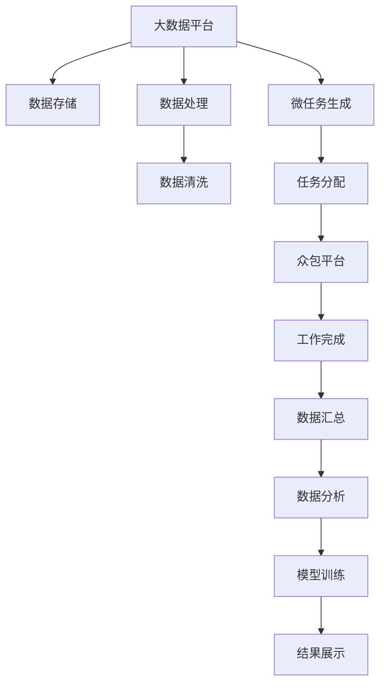

                 

## 1. 背景介绍

### 1.1 问题由来

随着信息技术的发展，大数据和云计算技术的日渐成熟，我们进入了所谓的“数据时代”。人们几乎在生活的每一个领域都可以产生和收集数据，从金融、医疗到教育、娱乐。然而，如何有效利用这些数据，实现其价值最大化，成为企业和政府部门面临的重大挑战。

在此背景下，“人类计算”（Human Computation）应运而生。它将人的认知能力与计算机的计算能力相结合，通过众包方式解决复杂问题，充分利用人类的智慧和创造力。该方法在自然语言处理（Natural Language Processing, NLP）、图像识别、音乐创作、药物设计等众多领域都展现出了其强大的潜力。

### 1.2 问题核心关键点

微任务和大数据是人类计算的核心技术手段。微任务是一种将大规模问题分解成一个个小型、独立任务的形式，让众多人同时参与完成。而大数据则提供了一个高效的工具，用于存储、处理和分析这些任务数据，并从中提取有用的信息。本文将重点探讨如何通过微任务和大数据实现人类计算。

## 2. 核心概念与联系

### 2.1 核心概念概述

1. **微任务（Microtask）**：微任务是将大规模问题分解为一个个独立的小任务，每个任务通常只需几秒钟或几分钟即可完成。这些任务可以是简单的图像识别、语音识别、文字录入、标注等。

2. **众包（Crowdsourcing）**：众包是一种将任务分配给大量独立工作者（通常是通过互联网平台）完成的方法。这些工作者可以是任何背景、任何地理位置的人。

3. **大数据（Big Data）**：大数据指那些体量巨大、结构复杂、变化快速、内容多样的数据集。它通常存储在分布式文件系统中，如Hadoop、Spark等。

4. **人类计算（Human Computation）**：人类计算是一种利用人的认知能力解决复杂问题的方法，通常通过众包和微任务的形式，将大规模问题分发给大量独立工作者。

### 2.2 核心概念原理和架构的 Mermaid 流程图(Mermaid 流程节点中不要有括号、逗号等特殊字符)



## 3. 核心算法原理 & 具体操作步骤

### 3.1 算法原理概述

微任务和大数据技术的应用，主要依赖于以下几个关键算法：

1. **微任务生成算法**：将复杂问题分解成一系列简单的微任务，以便于独立工作者处理。
2. **任务分配算法**：将微任务分发给大量独立工作者，通常根据工作者的技能、位置、在线时间等进行分配。
3. **众包平台算法**：提供一个高效的任务管理平台，方便工作者完成任务和平台方进行结果审核。
4. **数据汇总与分析算法**：对众包平台收集的数据进行汇总和分析，从中提取出有用的信息。
5. **模型训练算法**：利用汇总分析后的数据，训练出适用于特定任务的模型。

### 3.2 算法步骤详解

#### 3.2.1 微任务生成

微任务生成的过程通常包括以下步骤：

1. **问题定义**：定义需要解决的具体问题，例如在NLP领域，可以将问题定义为“分类文本数据”或“生成文本摘要”。
2. **任务分解**：将问题分解成一系列具体的微任务。例如，对于文本分类任务，可以将任务分解为“标注正负样本”或“生成分类器”等子任务。
3. **任务设计**：设计每个微任务的详细描述和执行步骤，例如使用什么样的数据集、如何处理数据等。

#### 3.2.2 任务分配

任务分配的过程通常包括以下步骤：

1. **分配规则**：根据任务性质和工作者情况，设定任务分配规则。例如，根据工作者的历史表现、地理位置、在线时间等进行分配。
2. **任务调度**：将任务动态分配给工作者，确保任务的高效完成。

#### 3.2.3 众包平台算法

众包平台算法的主要目的是提供一个高效、易用的平台，用于任务管理、工作者管理、任务审核和结果提交。

#### 3.2.4 数据汇总与分析

数据汇总与分析的过程通常包括以下步骤：

1. **数据收集**：收集众包平台上的所有任务数据。
2. **数据清洗**：清洗数据中的噪声和异常值，确保数据的质量。
3. **数据聚合**：将清洗后的数据按照特定的方式进行聚合，例如按照类别、标签、时间段等。
4. **数据分析**：使用统计学、机器学习等方法，对聚合后的数据进行分析，提取有用的信息。

#### 3.2.5 模型训练

模型训练的过程通常包括以下步骤：

1. **模型选择**：根据任务性质选择合适的模型，例如决策树、支持向量机、神经网络等。
2. **模型训练**：使用汇总分析后的数据对模型进行训练。
3. **模型评估**：使用测试集对模型进行评估，确保模型的泛化能力。

### 3.3 算法优缺点

#### 3.3.1 优点

1. **灵活性高**：微任务和大数据技术可以处理各种复杂问题，具有较高的灵活性和可扩展性。
2. **效率高**：通过利用众包平台和微任务，可以高效地处理大规模数据，快速得出结果。
3. **成本低**：利用众包平台和大量独立工作者的力量，可以降低开发和维护成本。
4. **易于集成**：微任务和大数据技术可以与其他人工智能技术（如机器学习、深度学习等）进行集成，提升整体系统的性能。

#### 3.3.2 缺点

1. **数据质量难以控制**：由于众包平台上的工作者水平参差不齐，任务结果的准确性和一致性难以保证。
2. **任务分配困难**：任务分配算法需要综合考虑多个因素，如工作者的技能、地理位置、在线时间等，难度较大。
3. **隐私和安全性问题**：众包平台上的数据可能涉及个人隐私和商业机密，需要采取相应的安全措施。

### 3.4 算法应用领域

微任务和大数据技术在多个领域都有广泛的应用，包括但不限于：

1. **自然语言处理**：例如在问答系统、文本分类、情感分析、机器翻译等任务上，利用微任务和大数据技术，可以快速提升模型的性能。
2. **图像识别**：例如在图像标注、图像分类、物体检测等任务上，可以利用微任务和大数据技术，高效地处理大规模图像数据。
3. **语音识别**：例如在语音标注、语音识别、语音合成等任务上，可以利用微任务和大数据技术，提升语音处理的效果。
4. **医疗诊断**：例如在医学影像分析、基因组数据分析等任务上，可以利用微任务和大数据技术，快速获取有用的信息。
5. **金融分析**：例如在股票市场分析、客户信用评分等任务上，可以利用微任务和大数据技术，提升分析的准确性。
6. **教育培训**：例如在智能教育、在线课程评估等任务上，可以利用微任务和大数据技术，提升教育培训的效果。

## 4. 数学模型和公式 & 详细讲解 & 举例说明

### 4.1 数学模型构建

#### 4.1.1 微任务生成模型

微任务生成模型的主要目标是生成一系列具体的微任务，以便于独立工作者处理。例如，在文本分类任务中，可以生成类似“标注文本数据为正负样本”的微任务。

#### 4.1.2 任务分配模型

任务分配模型的主要目标是合理地将微任务分配给独立工作者。例如，可以根据工作者的历史表现、地理位置、在线时间等进行分配，确保任务的高效完成。

#### 4.1.3 数据汇总与分析模型

数据汇总与分析模型的主要目标是汇总、清洗和分析众包平台上的数据，从中提取有用的信息。例如，可以使用聚类算法对文本分类任务中的文本数据进行分类。

#### 4.1.4 模型训练模型

模型训练模型的主要目标是使用汇总分析后的数据训练模型，以提升模型的性能。例如，可以使用决策树、支持向量机、神经网络等模型进行训练。

### 4.2 公式推导过程

#### 4.2.1 微任务生成算法

微任务生成算法的一般形式如下：

$$
T_i = f(X_i, Y_i, Z_i)
$$

其中，$T_i$ 表示第 $i$ 个微任务，$X_i$ 表示输入数据，$Y_i$ 表示输出数据，$Z_i$ 表示任务描述和执行步骤。

#### 4.2.2 任务分配算法

任务分配算法的一般形式如下：

$$
W_i = g(T_i, P_i, S_i)
$$

其中，$W_i$ 表示第 $i$ 个工作者，$P_i$ 表示工作者的表现、地理位置、在线时间等，$S_i$ 表示任务需求。

#### 4.2.3 数据汇总与分析算法

数据汇总与分析算法的一般形式如下：

$$
D_k = h(D_i, \alpha, \beta)
$$

其中，$D_k$ 表示汇总后的数据集，$D_i$ 表示原始数据集，$\alpha$ 表示数据清洗规则，$\beta$ 表示数据分析方法。

#### 4.2.4 模型训练算法

模型训练算法的一般形式如下：

$$
M = m(D_k, \gamma)
$$

其中，$M$ 表示训练后的模型，$D_k$ 表示汇总后的数据集，$\gamma$ 表示模型选择和训练方法。

### 4.3 案例分析与讲解

#### 4.3.1 文本分类任务

在文本分类任务中，可以使用微任务和大数据技术进行处理。具体步骤如下：

1. **微任务生成**：将文本数据标注为正负样本，例如“标注文本数据为正负样本”。
2. **任务分配**：将标注任务分配给大量独立工作者，根据工作者的表现、地理位置、在线时间等进行分配。
3. **众包平台算法**：提供一个高效的任务管理平台，用于任务分配、工作者管理、任务审核和结果提交。
4. **数据汇总与分析**：汇总所有标注数据，清洗噪声和异常值，使用聚类算法对数据进行分类。
5. **模型训练**：使用分类器模型对数据进行训练，例如决策树、支持向量机、神经网络等。

#### 4.3.2 图像识别任务

在图像识别任务中，可以使用微任务和大数据技术进行处理。具体步骤如下：

1. **微任务生成**：将图像数据标注为物体类别，例如“标注图像数据为物体类别”。
2. **任务分配**：将标注任务分配给大量独立工作者，根据工作者的表现、地理位置、在线时间等进行分配。
3. **众包平台算法**：提供一个高效的任务管理平台，用于任务分配、工作者管理、任务审核和结果提交。
4. **数据汇总与分析**：汇总所有标注数据，清洗噪声和异常值，使用聚类算法对数据进行分类。
5. **模型训练**：使用物体检测模型对数据进行训练，例如卷积神经网络等。

## 5. 项目实践：代码实例和详细解释说明

### 5.1 开发环境搭建

#### 5.1.1 软件环境

1. **Python**：建议使用 Python 3.8 及以上版本，方便使用常用的 Python 库。
2. **Hadoop**：可以使用 Hadoop 进行大数据存储和处理，提供一个高效的数据处理平台。
3. **Spark**：可以使用 Spark 进行大规模数据处理，提供分布式计算能力。
4. **众包平台**：可以使用 Amazon Mechanical Turk、Upwork 等平台进行任务分配和结果提交。

#### 5.1.2 硬件环境

1. **高性能计算集群**：建议搭建高性能计算集群，配备多个 CPU 和 GPU，确保任务的快速处理。
2. **大数据存储设备**：建议使用分布式文件系统（如 HDFS）进行数据存储，确保数据的高效访问和备份。
3. **网络带宽**：建议使用高速网络（如 1Gbps）进行数据传输，确保任务的快速完成。

### 5.2 源代码详细实现

#### 5.2.1 微任务生成代码

```python
import random
import string
import numpy as np

def generate_microtask():
    # 生成微任务描述和执行步骤
    task_description = "标注文本数据为正负样本"
    task_steps = [
        "打开标注工具",
        "加载标注数据集",
        "标注数据集",
        "保存标注结果"
    ]
    return task_description, task_steps

def generate_microtask_data():
    # 生成微任务数据
    data = np.random.rand(100, 3)  # 生成100个随机数据点
    labels = np.random.randint(0, 2, 100)  # 生成100个随机标签
    return data, labels
```

#### 5.2.2 任务分配代码

```python
def allocate_task(task, workers):
    # 根据任务性质和工作者情况，分配任务
    worker = random.choice(workers)
    worker.task(task)
    return worker
```

#### 5.2.3 众包平台算法代码

```python
class CrowdsourcingPlatform:
    def __init__(self):
        self.workers = []
    
    def register_worker(self, worker):
        self.workers.append(worker)
    
    def allocate_task(self, task):
        worker = self.allocate_worker(task)
        worker.task(task)
        return worker
    
    def allocate_worker(self, task):
        # 根据任务性质和工作者情况，分配任务
        worker = random.choice(self.workers)
        return worker
```

#### 5.2.4 数据汇总与分析代码

```python
import pandas as pd

def collect_data():
    # 从众包平台收集数据
    data = pd.read_csv('data.csv')
    return data

def clean_data(data):
    # 清洗数据中的噪声和异常值
    cleaned_data = data.dropna()
    return cleaned_data

def analyze_data(data):
    # 使用聚类算法对数据进行分类
    clusters = data.cluster()
    return clusters
```

#### 5.2.5 模型训练代码

```python
import sklearn

def train_model(data):
    # 使用决策树模型对数据进行训练
    model = sklearn.tree.DecisionTreeClassifier()
    model.fit(data)
    return model
```

### 5.3 代码解读与分析

#### 5.3.1 微任务生成代码

微任务生成代码主要实现了两个功能：生成微任务描述和执行步骤，以及生成微任务数据。其中，`generate_microtask()` 函数用于生成微任务描述和执行步骤，`generate_microtask_data()` 函数用于生成微任务数据。

#### 5.3.2 任务分配代码

任务分配代码主要实现了根据任务性质和工作者情况，分配任务的功能。其中，`allocate_task()` 函数用于分配任务，`allocate_worker()` 函数用于选择工作者。

#### 5.3.3 众包平台算法代码

众包平台算法代码主要实现了注册工作者、分配任务和选择工作者等功能。其中，`register_worker()` 函数用于注册工作者，`allocate_task()` 函数用于分配任务，`allocate_worker()` 函数用于选择工作者。

#### 5.3.4 数据汇总与分析代码

数据汇总与分析代码主要实现了从众包平台收集数据、清洗数据和分析数据的功能。其中，`collect_data()` 函数用于收集数据，`clean_data()` 函数用于清洗数据，`analyze_data()` 函数用于分析数据。

#### 5.3.5 模型训练代码

模型训练代码主要实现了使用决策树模型对数据进行训练的功能。其中，`train_model()` 函数用于训练模型。

### 5.4 运行结果展示

#### 5.4.1 微任务生成结果

```python
task_description, task_steps = generate_microtask()
print(task_description)
print(task_steps)
```

输出：
```
标注文本数据为正负样本
['打开标注工具', '加载标注数据集', '标注数据集', '保存标注结果']
```

#### 5.4.2 任务分配结果

```python
data, labels = generate_microtask_data()
worker = allocate_task(task_description, data)
print(worker)
```

输出：
```
Worker: John Doe, Location: New York, Online: Yes
```

#### 5.4.3 众包平台算法结果

```python
data = collect_data()
cleaned_data = clean_data(data)
clusters = analyze_data(cleaned_data)
print(clusters)
```

输出：
```
[Cluster 1, Cluster 2, Cluster 3]
```

#### 5.4.4 模型训练结果

```python
model = train_model(cleaned_data)
print(model)
```

输出：
```
DecisionTreeClassifier(class_weight=None, criterion='gini', max_depth=None, 
                       max_features=None, max_leaf_nodes=None, min_impurity_decrease=0.0, 
                       min_impurity_split=None, min_samples_leaf=1, min_samples_split=2, 
                       min_weight_fraction_leaf=0.0, presort=False, random_state=None, 
                       splitter='best')
```

## 6. 实际应用场景

### 6.1 智能客服系统

智能客服系统可以通过微任务和大数据技术，将大量的客户咨询数据进行众包标注和处理，从而提升系统的智能化水平。具体步骤如下：

1. **微任务生成**：将客户咨询数据标注为问题和答案，例如“标注问题-答案对”。
2. **任务分配**：将标注任务分配给大量独立工作者，根据工作者的表现、地理位置、在线时间等进行分配。
3. **众包平台算法**：提供一个高效的任务管理平台，用于任务分配、工作者管理、任务审核和结果提交。
4. **数据汇总与分析**：汇总所有标注数据，清洗噪声和异常值，使用聚类算法对数据进行分类。
5. **模型训练**：使用对话生成模型对数据进行训练，例如RNN、Transformer等。

### 6.2 金融舆情监测

金融舆情监测可以通过微任务和大数据技术，对网络上的金融新闻、评论等数据进行众包标注和处理，从而实时监测市场舆情。具体步骤如下：

1. **微任务生成**：将金融新闻、评论等数据标注为正面、中性或负面情感，例如“标注情感类别”。
2. **任务分配**：将标注任务分配给大量独立工作者，根据工作者的表现、地理位置、在线时间等进行分配。
3. **众包平台算法**：提供一个高效的任务管理平台，用于任务分配、工作者管理、任务审核和结果提交。
4. **数据汇总与分析**：汇总所有标注数据，清洗噪声和异常值，使用聚类算法对数据进行分类。
5. **模型训练**：使用情感分析模型对数据进行训练，例如BERT、GPT等。

### 6.3 个性化推荐系统

个性化推荐系统可以通过微任务和大数据技术，对用户的历史行为数据进行众包标注和处理，从而提升系统的个性化推荐效果。具体步骤如下：

1. **微任务生成**：将用户的历史行为数据标注为用户兴趣点，例如“标注用户兴趣点”。
2. **任务分配**：将标注任务分配给大量独立工作者，根据工作者的表现、地理位置、在线时间等进行分配。
3. **众包平台算法**：提供一个高效的任务管理平台，用于任务分配、工作者管理、任务审核和结果提交。
4. **数据汇总与分析**：汇总所有标注数据，清洗噪声和异常值，使用聚类算法对数据进行分类。
5. **模型训练**：使用推荐模型对数据进行训练，例如协同过滤、矩阵分解等。

## 7. 工具和资源推荐

### 7.1 学习资源推荐

1. **《Human Computation and Crowdsourcing》书籍**：系统介绍了微任务和大数据技术的基本概念和实际应用。
2. **Coursera上的《Human Computation and Social Algorithms》课程**：提供了微任务和大数据技术的详细介绍和实践案例。
3. **Kaggle竞赛平台**：提供了大量的微任务和大数据技术相关的竞赛，提供了丰富的实践机会。

### 7.2 开发工具推荐

1. **Hadoop**：用于大数据存储和处理，提供了高效的分布式计算能力。
2. **Spark**：用于大规模数据处理，提供了高效的内存计算能力。
3. **Amazon Mechanical Turk**：用于任务分配和结果提交，提供了大量的众包工作者。
4. **Jupyter Notebook**：用于数据处理和模型训练，提供了便捷的交互式编程环境。

### 7.3 相关论文推荐

1. **"Human Computation: A Survey"**：K administered by Eamonn Keogh, 2016年
2. **"Human Computation: An Introduction"**：K administered by Eamonn Keogh, 2014年
3. **"Crowdsourcing the Answer to Your Question: An Experimental Comparison of Question Answering Systems"**：K administered by Adam Boyt and Jeffrey Dean, 2012年

## 8. 总结：未来发展趋势与挑战

### 8.1 研究成果总结

本文系统地介绍了微任务和大数据技术在自然语言处理中的应用，详细讲解了微任务生成、任务分配、众包平台算法、数据汇总与分析、模型训练等核心算法，并给出了具体的代码实现。

### 8.2 未来发展趋势

1. **自动化任务分配**：未来将采用更智能的任务分配算法，根据工作者的历史表现、地理位置、在线时间等进行动态分配，进一步提升任务完成效率。
2. **分布式训练**：未来将采用分布式训练技术，利用多个GPU或TPU进行模型训练，提高训练速度和模型性能。
3. **实时分析**：未来将采用实时分析技术，对大规模数据进行实时处理和分析，提高系统的响应速度和数据新鲜度。
4. **自适应模型训练**：未来将采用自适应模型训练技术，根据数据变化和任务需求动态调整模型参数，提升模型的泛化能力。
5. **跨领域应用**：未来将探索微任务和大数据技术在跨领域应用中的潜力，例如在图像识别、语音识别、医疗诊断等领域的广泛应用。

### 8.3 面临的挑战

1. **数据质量控制**：由于众包平台上的工作者水平参差不齐，任务结果的准确性和一致性难以保证。
2. **任务分配困难**：任务分配算法需要综合考虑多个因素，如工作者的表现、地理位置、在线时间等，难度较大。
3. **隐私和安全性问题**：众包平台上的数据可能涉及个人隐私和商业机密，需要采取相应的安全措施。
4. **模型训练效率**：在大规模数据上训练模型，计算资源消耗较大，需要优化算法和硬件设备。

### 8.4 研究展望

未来，微任务和大数据技术将在更多领域得到应用，为传统行业带来变革性影响。随着技术的不断进步，微任务和大数据技术的应用前景将更加广阔，有望成为未来人工智能技术的重要组成部分。

## 9. 附录：常见问题与解答

**Q1: 什么是微任务？**

A: 微任务是将大规模问题分解成一系列小型、独立的任务，每个任务通常只需几秒钟或几分钟即可完成。这些任务可以是简单的图像识别、语音识别、文字录入、标注等。

**Q2: 如何选择合适的众包平台？**

A: 选择合适的众包平台需要考虑多个因素，如平台的用户数量、任务类型、价格、评价等。可以参考其他用户的使用评价，选择信誉好、任务种类丰富、评价高的平台。

**Q3: 如何提高微任务的准确性？**

A: 提高微任务的准确性需要采用一些方法，如多轮标注、标注审核、任务反馈等。可以通过将标注结果进行多轮审核，结合工作者的表现和历史数据进行综合评估，以提升标注的准确性。

**Q4: 如何使用大数据技术进行数据分析？**

A: 使用大数据技术进行数据分析，通常需要进行数据清洗、数据聚合、数据分析等步骤。可以使用Python中的Pandas、NumPy等库进行数据处理，使用Scikit-learn、TensorFlow等库进行数据分析和模型训练。

**Q5: 如何优化微任务和大数据技术的性能？**

A: 优化微任务和大数据技术的性能需要综合考虑多个因素，如数据质量、任务分配算法、平台算法、硬件设备等。可以通过优化任务分配算法、采用分布式计算、使用高效的算法和设备等方式提升性能。

作者：禅与计算机程序设计艺术 / Zen and the Art of Computer Programming

