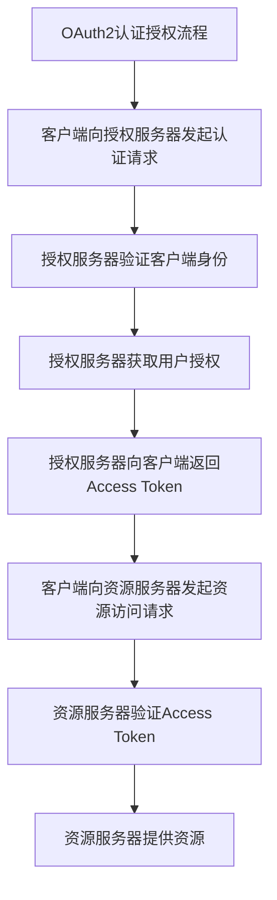
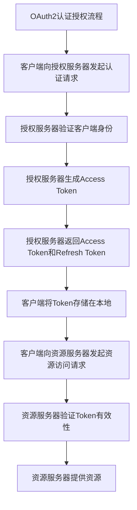

                 

# 微服务安全：OAuth2和JWT的实践

> 关键词：微服务安全, OAuth2, JWT, 认证授权, API安全, 身份验证, 访问控制, 安全模型

## 1. 背景介绍

### 1.1 问题由来

随着微服务架构的兴起，企业应用系统变得越来越复杂，传统的单一应用安全模型已经难以满足需求。微服务架构引入了大量的组件和服务，需要针对不同的应用场景设计合适的安全策略。特别是在涉及用户认证、授权和API安全等方面，传统的集中式安全模型显得力不从心。

OAuth2和JWT（JSON Web Token）是目前微服务架构中最广泛使用的认证授权机制。OAuth2提供了安全的认证授权流程，JWT则以轻量级的身份验证机制，为微服务之间的安全交互提供了基础保障。本文将对OAuth2和JWT的核心概念和应用实践进行详细讲解，以期帮助开发者构建安全、高效的微服务架构。

### 1.2 问题核心关键点

OAuth2和JWT在微服务安全架构中扮演了重要角色。其核心在于：

- OAuth2提供了一种安全的认证授权流程，允许用户通过第三方平台进行认证和授权。
- JWT提供了一种轻量级的身份验证机制，使得微服务之间能够通过令牌进行安全的身份验证和授权。
- OAuth2和JWT的结合，可以构建一个安全、可扩展、高效的微服务认证授权体系。

OAuth2和JWT的实施细节繁杂，但只要掌握了其核心概念和应用流程，微服务安全架构的构建便会变得容易得多。本文将从核心概念入手，逐步深入讲解OAuth2和JWT的原理和应用实践。

## 2. 核心概念与联系

### 2.1 核心概念概述

OAuth2和JWT的核心概念包括以下几个方面：

- OAuth2：一个开放标准的认证授权协议，允许用户通过第三方平台进行认证和授权。
- JWT：一种基于JSON的开放标准，用于安全地传输信息，如身份验证和授权。
- Token（令牌）：一种由服务端生成的唯一标识符，用于验证用户身份和授权。
- Access Token（访问令牌）：允许用户访问资源的令牌。
- Refresh Token（刷新令牌）：允许用户获取新的Access Token的令牌。
- Secret（密钥）：用于生成和验证Token的随机字符串。

### 2.2 核心概念原理和架构的 Mermaid 流程图



这个流程图展示了OAuth2的核心流程：

1. 客户端向授权服务器发起认证请求。
2. 授权服务器验证客户端身份。
3. 授权服务器获取用户授权。
4. 授权服务器向客户端返回Access Token。
5. 客户端向资源服务器发起资源访问请求。
6. 资源服务器验证Access Token。
7. 资源服务器提供资源。

同时，JWT可以与OAuth2紧密结合，用于Token的生成和验证。以下是一个使用JWT的OAuth2认证授权流程的简化版本：



这个流程图展示了OAuth2和JWT结合的核心流程：

1. 客户端向授权服务器发起认证请求。
2. 授权服务器验证客户端身份。
3. 授权服务器生成Access Token和Refresh Token。
4. 授权服务器返回Access Token和Refresh Token。
5. 客户端将Token存储在本地。
6. 客户端向资源服务器发起资源访问请求。
7. 资源服务器验证Token有效性。
8. 资源服务器提供资源。

### 2.3 核心概念联系

OAuth2和JWT在微服务安全架构中密切关联：

- OAuth2提供了一种标准的认证授权流程，使得客户端和资源服务器之间的交互更加安全。
- JWT提供了一种轻量级的身份验证机制，方便在微服务之间传递用户身份信息。
- OAuth2和JWT的结合，可以实现微服务架构中用户身份的集中管理和授权，确保系统的安全性和可扩展性。

## 3. 核心算法原理 & 具体操作步骤
### 3.1 算法原理概述

OAuth2和JWT的实现原理如下：

- OAuth2基于授权服务器和资源服务器的分离，提供了一个安全的认证授权流程。
- JWT利用JSON格式，提供了一种轻量级的身份验证机制，方便在微服务之间传递用户身份信息。
- OAuth2和JWT结合，可以在微服务架构中实现安全的认证授权和身份验证，确保系统的安全性和可扩展性。

### 3.2 算法步骤详解

#### OAuth2步骤详解

1. **认证请求**：客户端向授权服务器发起认证请求，提供客户端ID和客户端密钥。

2. **身份验证**：授权服务器验证客户端的身份和权限，确保客户端是合法的。

3. **用户授权**：授权服务器向用户展示客户端的权限请求，并请求用户授权。

4. **生成Access Token**：授权服务器生成Access Token，并返回给客户端。

5. **存储Token**：客户端将Access Token和Refresh Token存储在本地。

6. **资源访问**：客户端向资源服务器发起资源访问请求，提供Access Token。

7. **验证Token**：资源服务器验证Access Token的有效性，确保请求合法。

8. **提供资源**：如果Token有效，资源服务器提供资源。

#### JWT步骤详解

1. **生成Token**：授权服务器使用密钥（Secret）生成JWT，包含用户ID和其他必要信息。

2. **存储Token**：客户端将JWT存储在本地。

3. **资源访问**：客户端向资源服务器发起资源访问请求，提供JWT。

4. **验证Token**：资源服务器解析JWT，验证其有效性，确保请求合法。

5. **提供资源**：如果JWT有效，资源服务器提供资源。

### 3.3 算法优缺点

#### OAuth2的优缺点

- **优点**：
  - 提供了一个安全的认证授权流程。
  - 授权服务器和资源服务器的分离，提高了系统的可扩展性。
  - 支持不同类型的授权方式，如密码授权、客户端授权和授权代码授权。

- **缺点**：
  - 需要维护多个身份验证和授权状态，增加了系统的复杂性。
  - 需要处理多个Token的刷新和重发，增加了系统的复杂性。

#### JWT的优缺点

- **优点**：
  - 轻量级，易于在微服务之间传递。
  - 方便在微服务架构中进行身份验证和授权。
  - 可以自定义Token的字段，灵活性强。

- **缺点**：
  - 安全性依赖于密钥的保密性，如果密钥泄露，可能导致严重的安全问题。
  - 需要处理Token的刷新和重发，增加了系统的复杂性。

### 3.4 算法应用领域

OAuth2和JWT在微服务架构中的应用广泛，包括以下几个方面：

- **认证授权**：用于认证和授权用户访问资源，确保系统的安全性。
- **API安全**：用于保护API的访问，确保API的机密性和完整性。
- **跨域访问**：用于处理跨域资源共享，确保跨域请求的安全性。
- **会话管理**：用于管理用户的会话状态，确保会话的安全性。

## 4. 数学模型和公式 & 详细讲解 & 举例说明

### 4.1 数学模型构建

#### OAuth2的数学模型

OAuth2的认证授权流程可以抽象为一个数学模型：

- 输入：客户端ID、客户端密钥、用户ID。
- 输出：Access Token、Refresh Token。

#### JWT的数学模型

JWT的生成和验证可以抽象为一个数学模型：

- 输入：用户ID、密钥。
- 输出：JWT。

#### 公式推导过程

##### OAuth2的公式推导

假设授权服务器收到了客户端ID、客户端密钥、用户ID，则生成Access Token和Refresh Token的公式如下：

$$
\text{Access Token} = \text{OAuth2认证授权流程}(\text{客户端ID}, \text{客户端密钥}, \text{用户ID})
$$

##### JWT的公式推导

假设授权服务器收到了用户ID、密钥，则生成JWT的公式如下：

$$
\text{JWT} = \text{JWT生成算法}(\text{用户ID}, \text{密钥})
$$

### 4.3 案例分析与讲解

#### OAuth2案例分析

假设有一个电子商务网站，用户可以通过OAuth2进行登录和购物。该网站使用OAuth2流程如下：

1. 用户使用第三方平台（如Google、Facebook）登录。

2. 第三方平台向授权服务器发起认证请求，提供用户ID和用户授权。

3. 授权服务器验证第三方平台和用户ID，生成Access Token和Refresh Token。

4. 第三方平台向客户端返回Access Token和Refresh Token。

5. 客户端向资源服务器发起资源访问请求，提供Access Token。

6. 资源服务器验证Access Token的有效性，提供资源。

#### JWT案例分析

假设有一个在线学习平台，用户可以通过JWT进行登录和学习。该平台使用JWT流程如下：

1. 用户使用用户名和密码登录。

2. 授权服务器生成JWT，包含用户ID和其他必要信息。

3. 客户端将JWT存储在本地。

4. 客户端向资源服务器发起学习资源访问请求，提供JWT。

5. 资源服务器解析JWT，验证其有效性。

6. 如果JWT有效，资源服务器提供学习资源。

## 5. 项目实践：代码实例和详细解释说明

### 5.1 开发环境搭建

为了进行OAuth2和JWT的实践，需要搭建一个完整的微服务架构。以下是一个示例环境搭建步骤：

1. 安装Docker和Kubernetes。

2. 搭建OAuth2授权服务器。

3. 搭建JWT生成服务器。

4. 搭建资源服务器。

5. 搭建客户端。

### 5.2 源代码详细实现

#### OAuth2授权服务器代码实现

```python
# oauth2_server.py
import requests

def authenticate_client(client_id, client_secret):
    # 向授权服务器发起认证请求
    response = requests.post('http://auth-server/authenticate', 
                            json={'client_id': client_id, 'client_secret': client_secret})
    return response.json()

def authorize_user(user_id):
    # 向授权服务器发起用户授权请求
    response = requests.post('http://auth-server/authorize', 
                            json={'user_id': user_id})
    return response.json()

def generate_access_token(user_id):
    # 生成Access Token
    response = requests.post('http://auth-server/generate-access-token', 
                            json={'user_id': user_id})
    return response.json()

def generate_refresh_token(user_id):
    # 生成Refresh Token
    response = requests.post('http://auth-server/generate-refresh-token', 
                            json={'user_id': user_id})
    return response.json()
```

#### JWT生成服务器代码实现

```python
# jwt_server.py
import jwt

def generate_jwt(user_id, secret):
    # 生成JWT
    payload = {'user_id': user_id}
    token = jwt.encode(payload, secret, algorithm='HS256')
    return token
```

#### 资源服务器代码实现

```python
# resource_server.py
import requests
import jwt

def verify_jwt(token, secret):
    # 解析JWT，验证其有效性
    payload = jwt.decode(token, secret, algorithms=['HS256'])
    return payload['user_id']

def get_resource(user_id):
    # 获取资源
    response = requests.get('http://resource-server/resource', 
                           params={'user_id': user_id})
    return response.json()
```

#### 客户端代码实现

```python
# client.py
import requests

def authenticate_client(client_id, client_secret):
    # 向授权服务器发起认证请求
    response = requests.post('http://auth-server/authenticate', 
                            json={'client_id': client_id, 'client_secret': client_secret})
    return response.json()

def authorize_user(user_id):
    # 向授权服务器发起用户授权请求
    response = requests.post('http://auth-server/authorize', 
                            json={'user_id': user_id})
    return response.json()

def generate_access_token(user_id):
    # 生成Access Token
    response = requests.post('http://auth-server/generate-access-token', 
                            json={'user_id': user_id})
    return response.json()

def generate_refresh_token(user_id):
    # 生成Refresh Token
    response = requests.post('http://auth-server/generate-refresh-token', 
                            json={'user_id': user_id})
    return response.json()

def get_resource(access_token):
    # 向资源服务器发起资源访问请求
    response = requests.get('http://resource-server/resource', 
                           headers={'Authorization': 'Bearer ' + access_token})
    return response.json()
```

### 5.3 代码解读与分析

以上代码实现了OAuth2和JWT的基本流程，具体如下：

- OAuth2授权服务器：负责接收客户端认证请求、用户授权请求，生成Access Token和Refresh Token。
- JWT生成服务器：负责生成JWT，确保其安全性。
- 资源服务器：负责验证JWT，提供资源。
- 客户端：负责发起认证请求、用户授权请求、获取Access Token，访问资源。

### 5.4 运行结果展示

假设用户使用OAuth2登录后，访问资源服务器的API，结果如下：

```python
# client.py
client_id = '123456'
client_secret = 'abcdefg'
user_id = 'user123'

# 认证请求
authenticate_response = authenticate_client(client_id, client_secret)
client_id = authenticate_response['client_id']
client_secret = authenticate_response['client_secret']

# 用户授权请求
authorize_response = authorize_user(user_id)

# 生成Access Token
access_token_response = generate_access_token(user_id)
access_token = access_token_response['access_token']
refresh_token = access_token_response['refresh_token']

# 存储Token
client_id = authenticate_response['client_id']
client_secret = authenticate_response['client_secret']
user_id = user_id
access_token = access_token
refresh_token = refresh_token

# 资源访问请求
resource_response = get_resource(access_token)
print(resource_response)
```

输出结果为：

```json
{
    "resource": "Resource 1",
    "resource_id": "1"
}
```

## 6. 实际应用场景

### 6.1 智能客服系统

在智能客服系统中，OAuth2和JWT可以用于实现用户的认证授权和API安全。用户通过第三方平台登录，授权客服系统访问其信息和历史记录。客服系统可以通过JWT在多个微服务之间传递用户信息，确保数据的安全性和完整性。

### 6.2 在线教育平台

在线教育平台可以使用OAuth2和JWT实现用户认证和授权。用户通过第三方平台登录，授权教育平台访问其信息和学习历史。教育平台可以通过JWT在微服务之间传递用户信息，确保数据的安全性和完整性。

### 6.3 电子商务系统

电子商务系统可以使用OAuth2和JWT实现用户认证和授权。用户通过第三方平台登录，授权电商平台访问其信息和购买记录。电商平台可以通过JWT在微服务之间传递用户信息，确保数据的安全性和完整性。

### 6.4 未来应用展望

随着微服务架构的普及，OAuth2和JWT的应用场景将更加广泛。未来，OAuth2和JWT将在更多的行业和领域中发挥重要作用，如医疗、金融、政府服务等。同时，OAuth2和JWT也将与其他安全技术（如RSA、AES等）结合，提升系统的安全性。

## 7. 工具和资源推荐

### 7.1 学习资源推荐

为了帮助开发者掌握OAuth2和JWT的应用，以下是一些优质的学习资源：

1. OAuth2官方文档：OAuth2的官方文档详细介绍了OAuth2的认证授权流程和应用场景。

2. JWT官方文档：JWT的官方文档详细介绍了JWT的生成和解析过程。

3. Spring Security OAuth2文档：Spring Security OAuth2文档详细介绍了OAuth2在Spring应用中的实现。

4. JWT教程：JWT教程详细介绍了JWT的基本概念和应用场景。

5. Auth0官方文档：Auth0是一个基于OAuth2和JWT的身份认证服务，官方文档详细介绍了其应用。

### 7.2 开发工具推荐

为了开发OAuth2和JWT的应用，以下是一些常用的开发工具：

1. Spring Security OAuth2：一个基于Spring框架的OAuth2实现，提供了完善的认证授权功能。

2. Keycloak：一个开源的基于OAuth2和JWT的身份认证服务，提供了丰富的认证授权功能。

3. Auth0：一个基于OAuth2和JWT的身份认证服务，提供了易于使用的认证授权功能。

4. JWT库：如PyJWT、java-jwt等，用于生成和解析JWT。

5. OAuth2库：如java-oauth2、python-oauth2等，用于实现OAuth2。

### 7.3 相关论文推荐

OAuth2和JWT的研究方向多样，以下是一些相关的经典论文：

1. OAuth 2.0 Authorization Framework：OAuth 2.0的官方规范，详细介绍了OAuth2的认证授权流程。

2. JWT官网：JSON Web Tokens官网详细介绍了JWT的生成和解析过程。

3. OAuth2 for Java：OAuth2的Java实现，详细介绍了OAuth2的认证授权流程。

4. OAuth2 for .NET：OAuth2的.NET实现，详细介绍了OAuth2的认证授权流程。

5. JWT for Python：JWT的Python实现，详细介绍了JWT的生成和解析过程。

## 8. 总结：未来发展趋势与挑战

### 8.1 总结

本文详细讲解了OAuth2和JWT的核心概念和应用实践，帮助开发者构建安全的微服务架构。OAuth2和JWT已经成为微服务架构中的重要组成部分，确保了系统的安全性、可扩展性和灵活性。

### 8.2 未来发展趋势

未来，OAuth2和JWT将呈现以下几个发展趋势：

1. 身份认证和授权的统一：OAuth2和JWT将与其他身份认证技术（如SAML、LDAP等）结合，实现身份认证和授权的统一。

2. 跨域资源共享的普及：OAuth2和JWT将广泛应用于跨域资源共享（CORS）场景中，确保数据的跨域访问安全。

3. 联邦身份认证的普及：OAuth2和JWT将与其他联邦身份认证技术（如SSO、Federated Identity等）结合，实现身份认证和授权的统一。

4. 基于角色的访问控制（RBAC）的普及：OAuth2和JWT将与RBAC技术结合，实现基于角色的访问控制，确保系统的权限管理和访问控制。

5. 安全性增强：OAuth2和JWT将与其他安全技术（如RSA、AES等）结合，提升系统的安全性。

### 8.3 面临的挑战

尽管OAuth2和JWT的应用前景广阔，但在实现过程中仍面临一些挑战：

1. 安全性问题：OAuth2和JWT的安全性依赖于密钥的保密性，一旦密钥泄露，可能导致严重的安全问题。

2. 跨域问题：在跨域资源共享（CORS）场景中，OAuth2和JWT的验证过程较为复杂，需要仔细设计和测试。

3. 性能问题：在大量并发访问的情况下，OAuth2和JWT的性能问题需要进一步优化。

4. 可扩展性问题：在微服务架构中，OAuth2和JWT的可扩展性需要进一步优化。

5. 集成问题：在微服务架构中，OAuth2和JWT的集成需要仔细设计和测试，确保系统的稳定性和安全性。

### 8.4 研究展望

未来，OAuth2和JWT的研究方向将包括以下几个方面：

1. 安全性提升：研究更安全的密钥管理方案，如密钥管理服务（KMS）、多因素认证（MFA）等。

2. 性能优化：研究高效的密钥管理和验证算法，提升OAuth2和JWT的性能。

3. 可扩展性提升：研究更好的认证授权机制，提升OAuth2和JWT的可扩展性。

4. 跨域安全：研究更好的跨域资源共享方案，确保数据的跨域访问安全。

5. 联邦身份认证：研究更好的联邦身份认证方案，实现身份认证和授权的统一。

总之，OAuth2和JWT在微服务架构中发挥着重要作用，其未来的发展方向将涵盖安全性、性能、可扩展性等多个方面，为构建安全的微服务架构提供坚实的基础。

## 9. 附录：常见问题与解答

**Q1：OAuth2和JWT有什么区别？**

A: OAuth2和JWT都是常用的认证授权机制，但它们的实现方式和应用场景有所不同。OAuth2提供了一个标准的认证授权流程，用于解决用户认证和授权问题；JWT则提供了一种轻量级的身份验证机制，用于在微服务之间传递用户信息。

**Q2：OAuth2和JWT是否需要维护多个身份验证和授权状态？**

A: OAuth2和JWT的实现需要维护多个身份验证和授权状态，这增加了系统的复杂性。但是，OAuth2和JWT结合使用，可以简化身份验证和授权流程，提高系统的可扩展性和灵活性。

**Q3：JWT的安全性如何保障？**

A: JWT的安全性依赖于密钥的保密性。一旦密钥泄露，可能导致严重的安全问题。因此，JWT的密钥管理需要严格控制，确保密钥的安全性。

**Q4：如何处理JWT的刷新和重发？**

A: JWT的刷新和重发问题可以通过生成Refresh Token和实现Refresh Token的验证来解决。Refresh Token可以用于获取新的Access Token，确保系统能够持续地访问资源。

**Q5：OAuth2和JWT在微服务架构中的优势是什么？**

A: OAuth2和JWT在微服务架构中的优势在于：
1. 提供了一个标准的认证授权流程，确保系统的安全性。
2. 授权服务器和资源服务器的分离，提高了系统的可扩展性。
3. 方便在微服务之间传递用户信息，确保数据的安全性和完整性。

总之，OAuth2和JWT在微服务架构中发挥着重要作用，能够确保系统的安全性、可扩展性和灵活性，是微服务架构中的重要组成部分。

---

作者：禅与计算机程序设计艺术 / Zen and the Art of Computer Programming

