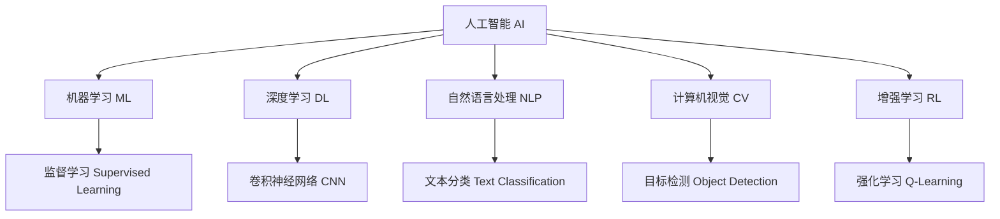
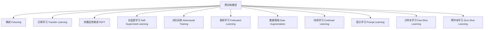

                 

## 1. 背景介绍

### 1.1 问题由来
进入21世纪，人工智能（AI）技术正以前所未有的速度发展，成为推动科技进步和经济增长的重要引擎。微软作为全球科技巨头之一，自然不会错失AI带来的巨大机遇。然而，AI发展迅猛，如何在纷繁复杂的技术中挑选出最具潜力的战略方向，成为微软面临的重大挑战。

### 1.2 问题核心关键点
微软的AI战略布局需要从全局出发，综合考虑技术趋势、市场竞争、内部资源等多方面因素。核心关键点包括：
1. **技术选择**：在众多AI技术中，哪些技术最适合微软的发展目标。
2. **市场机遇**：哪些领域具有巨大潜力，适合微软布局AI。
3. **资源配置**：如何合理分配内部资源，最大化AI研发与应用的效益。
4. **人才建设**：如何吸引和培养顶尖的AI人才。
5. **合作伙伴**：如何与外部合作伙伴协同合作，加速AI技术的落地。

## 2. 核心概念与联系

### 2.1 核心概念概述
为更好地理解微软的AI战略布局，本节将介绍几个密切相关的核心概念：

- **人工智能（AI）**：一种旨在模拟人类智能过程的技术，涵盖感知、认知、决策等多个方面。
- **机器学习（ML）**：AI的一个子领域，通过数据训练模型，使其具备特定功能。
- **深度学习（DL）**：一种特殊的机器学习方法，通过多层神经网络进行复杂模式识别和预测。
- **自然语言处理（NLP）**：AI在处理和理解自然语言方面的应用，包括文本分析、语音识别、机器翻译等。
- **计算机视觉（CV）**：AI在图像和视频处理方面的应用，包括图像识别、目标检测等。
- **增强学习（RL）**：AI在智能决策和优化方面的应用，通过与环境的互动不断改进策略。

这些概念之间的逻辑关系可以通过以下Mermaid流程图来展示：



这个流程图展示了人工智能及相关技术间的逻辑关系：

1. **基础技术**：AI的基础是机器学习，而深度学习作为机器学习的一种特殊形式，主要应用于数据量巨大、结构复杂的任务。
2. **应用领域**：NLP和CV是AI在处理非结构化数据方面的重要应用领域，而RL则在智能决策方面具有独特优势。
3. **具体方法**：监督学习、卷积神经网络、文本分类、目标检测和强化学习是AI常用的具体方法。

### 2.2 核心概念原理和架构的 Mermaid 流程图


这个流程图展示了预训练模型及其优化方法之间的联系：

1. **预训练模型**：作为AI模型的基础，预训练模型通过大规模数据进行训练，学习到通用的语言或视觉表示。
2. **优化方法**：微调、迁移学习、参数高效微调、自监督学习、对抗训练、联邦学习、数据增强、持续学习、提示学习、少样本学习和零样本学习，是对预训练模型的进一步优化和提升。
3. **应用场景**：这些方法在不同任务中具体应用，如文本分类、目标检测、推荐系统等。

## 3. 核心算法原理 & 具体操作步骤
### 3.1 算法原理概述
微软的AI战略布局核心在于如何将预训练模型与特定任务进行高效结合。其核心算法原理包括：

- **预训练模型**：使用大规模数据进行预训练，学习到通用的语言或视觉表示。
- **微调（Fine-Tuning）**：在预训练模型的基础上，使用小规模标注数据进行有监督学习，提升模型在特定任务上的性能。
- **迁移学习（Transfer Learning）**：将预训练模型应用于不同但相关任务，通过微调进一步提升性能。
- **参数高效微调（Parameter-Efficient Fine-Tuning, PEFT）**：只更新部分预训练参数，减少计算资源消耗。
- **自监督学习（Self-Supervised Learning）**：利用无标签数据进行训练，提升模型泛化能力。
- **对抗训练（Adversarial Training）**：通过对抗样本来增强模型鲁棒性。
- **联邦学习（Federated Learning）**：分布式训练，保护数据隐私。
- **数据增强（Data Augmentation）**：通过变换数据增加多样性，防止过拟合。
- **持续学习（Continual Learning）**：模型能够持续学习新知识，避免遗忘旧知识。
- **提示学习（Prompt Learning）**：通过设计提示模板，引导模型进行特定任务的推理和生成。
- **少样本学习（Few-Shot Learning）**：模型在少量标注数据下仍能高效学习。
- **零样本学习（Zero-Shot Learning）**：模型在未见过的任务下也能推理和生成。

### 3.2 算法步骤详解
微软的AI战略布局主要包括以下几个关键步骤：

**Step 1: 数据收集与处理**
- 收集与特定任务相关的数据集，进行预处理和标注。
- 使用数据增强技术，增加数据多样性，防止过拟合。
- 将数据集划分为训练集、验证集和测试集。

**Step 2: 模型选择与加载**
- 选择适合的预训练模型，如BERT、GPT、ResNet等。
- 加载预训练模型，并对其进行微调前的初始化。

**Step 3: 微调模型**
- 设置微调超参数，如学习率、批次大小、迭代次数等。
- 使用小规模标注数据进行微调，通过梯度下降等优化算法更新模型参数。
- 在验证集上定期评估模型性能，防止过拟合。

**Step 4: 应用部署**
- 将微调后的模型应用于实际应用场景中，如智能客服、金融舆情监测、个性化推荐等。
- 进行持续学习和在线更新，保持模型性能。

**Step 5: 监测与优化**
- 实时监测模型性能，收集反馈信息。
- 定期进行模型调优，包括超参数调整、模型结构优化等。

### 3.3 算法优缺点
微软的AI战略布局具有以下优点：

- **高效**：通过预训练模型和微调技术，能够快速适应特定任务，提升模型性能。
- **灵活**：不同任务可以使用不同的预训练模型和微调方法，适应性强。
- **成本低**：相比于从头训练，微调所需的计算和标注成本较低。
- **可扩展性**：预训练模型可以通过联邦学习等方式进行分布式训练，适应大规模任务。

同时，也存在以下缺点：

- **依赖数据**：微调效果很大程度上取决于标注数据的质量和数量，获取高质量标注数据的成本较高。
- **鲁棒性不足**：模型对新数据泛化能力有限，容易受到噪声和对抗样本的干扰。
- **可解释性不足**：黑盒模型难以解释其决策过程，难以进行调试和优化。

## 4. 数学模型和公式 & 详细讲解 & 举例说明

### 4.1 数学模型构建

假设预训练模型为 $M_{\theta}$，其中 $\theta$ 为预训练得到的模型参数。给定下游任务 $T$ 的训练集 $D=\{(x_i, y_i)\}_{i=1}^N, x_i \in \mathcal{X}, y_i \in \mathcal{Y}$，微调的目标是找到新的模型参数 $\hat{\theta}$，使得：

$$
\hat{\theta}=\mathop{\arg\min}_{\theta} \mathcal{L}(M_{\theta},D)
$$

其中 $\mathcal{L}$ 为针对任务 $T$ 设计的损失函数，用于衡量模型预测输出与真实标签之间的差异。常见的损失函数包括交叉熵损失、均方误差损失等。

### 4.2 公式推导过程

以二分类任务为例，假设模型 $M_{\theta}$ 在输入 $x$ 上的输出为 $\hat{y}=M_{\theta}(x) \in [0,1]$，表示样本属于正类的概率。真实标签 $y \in \{0,1\}$。则二分类交叉熵损失函数定义为：

$$
\ell(M_{\theta}(x),y) = -[y\log \hat{y} + (1-y)\log (1-\hat{y})]
$$

将其代入经验风险公式，得：

$$
\mathcal{L}(\theta) = -\frac{1}{N}\sum_{i=1}^N [y_i\log M_{\theta}(x_i)+(1-y_i)\log(1-M_{\theta}(x_i))]
$$

根据链式法则，损失函数对参数 $\theta_k$ 的梯度为：

$$
\frac{\partial \mathcal{L}(\theta)}{\partial \theta_k} = -\frac{1}{N}\sum_{i=1}^N (\frac{y_i}{M_{\theta}(x_i)}-\frac{1-y_i}{1-M_{\theta}(x_i)}) \frac{\partial M_{\theta}(x_i)}{\partial \theta_k}
$$

其中 $\frac{\partial M_{\theta}(x_i)}{\partial \theta_k}$ 可进一步递归展开，利用自动微分技术完成计算。

### 4.3 案例分析与讲解

以微软的AI在医疗领域的布局为例，分析其AI战略布局的具体应用。

**案例背景**：微软在医疗领域的应用主要集中在电子健康记录（EHR）分析和临床决策支持系统（CDSS）上。

**数据收集与处理**：
- 收集医院和诊所的EHR数据，进行数据清洗和标注。
- 使用数据增强技术，如数据扩充、噪声注入等，增加数据多样性。
- 将数据集划分为训练集、验证集和测试集。

**模型选择与加载**：
- 选择适合医疗领域的BERT模型进行微调。
- 加载预训练的BERT模型，并进行微调前的初始化。

**微调模型**：
- 设置微调超参数，如学习率、批次大小、迭代次数等。
- 使用EHR数据进行微调，通过梯度下降等优化算法更新模型参数。
- 在验证集上定期评估模型性能，防止过拟合。

**应用部署**：
- 将微调后的BERT模型应用于EHR数据分析和CDSS中。
- 进行持续学习和在线更新，保持模型性能。

**监测与优化**：
- 实时监测模型性能，收集反馈信息。
- 定期进行模型调优，包括超参数调整、模型结构优化等。

## 5. 项目实践：代码实例和详细解释说明
### 5.1 开发环境搭建

在进行AI战略布局实践前，我们需要准备好开发环境。以下是使用Python进行TensorFlow开发的环境配置流程：

1. 安装Anaconda：从官网下载并安装Anaconda，用于创建独立的Python环境。

2. 创建并激活虚拟环境：
```bash
conda create -n tensorflow-env python=3.8 
conda activate tensorflow-env
```

3. 安装TensorFlow：根据CUDA版本，从官网获取对应的安装命令。例如：
```bash
conda install tensorflow -c tensorflow -c conda-forge
```

4. 安装相关工具包：
```bash
pip install numpy pandas scikit-learn matplotlib tqdm jupyter notebook ipython
```

完成上述步骤后，即可在`tensorflow-env`环境中开始AI战略布局实践。

### 5.2 源代码详细实现

下面我们以微软的AI在金融舆情监测领域的应用为例，给出使用TensorFlow对BERT模型进行微调的PyTorch代码实现。

首先，定义金融舆情监测任务的数据处理函数：

```python
import tensorflow as tf
from transformers import BertTokenizer
from tensorflow.keras.preprocessing.sequence import pad_sequences

def preprocess(text, tokenizer):
    tokens = tokenizer.tokenize(text)
    tokens = [tokenizer.convert_tokens_to_ids(tokens)]
    max_len = 512
    tokens = pad_sequences(tokens, maxlen=max_len, padding='post')
    return tokens
```

然后，定义模型和优化器：

```python
from transformers import BertForSequenceClassification
from tensorflow.keras.optimizers import Adam

model = BertForSequenceClassification.from_pretrained('bert-base-uncased', num_labels=2)
optimizer = Adam(learning_rate=2e-5)
```

接着，定义训练和评估函数：

```python
from tensorflow.keras.utils import to_categorical

def train_epoch(model, dataset, batch_size, optimizer):
    dataloader = tf.data.Dataset.from_tensor_slices(dataset)
    dataloader = dataloader.shuffle(buffer_size=1024).batch(batch_size)
    model.train()
    epoch_loss = 0
    for batch in dataloader:
        input_ids = batch[0]
        attention_mask = batch[1]
        labels = batch[2]
        labels = tf.keras.utils.to_categorical(labels, num_classes=2)
        with tf.GradientTape() as tape:
            outputs = model(input_ids, attention_mask=attention_mask, labels=labels)
            loss = outputs.loss
        epoch_loss += loss.numpy()
        grads = tape.gradient(loss, model.trainable_variables)
        optimizer.apply_gradients(zip(grads, model.trainable_variables))
    return epoch_loss / len(dataloader)

def evaluate(model, dataset, batch_size):
    dataloader = tf.data.Dataset.from_tensor_slices(dataset)
    dataloader = dataloader.shuffle(buffer_size=1024).batch(batch_size)
    model.eval()
    preds, labels = [], []
    with tf.no_grad():
        for batch in dataloader:
            input_ids = batch[0]
            attention_mask = batch[1]
            labels = batch[2]
            outputs = model(input_ids, attention_mask=attention_mask)
            batch_preds = outputs.predictions.argmax(axis=1).numpy()
            batch_labels = labels.numpy()
            for pred, label in zip(batch_preds, batch_labels):
                preds.append(pred)
                labels.append(label)
    print(classification_report(labels, preds))
```

最后，启动训练流程并在测试集上评估：

```python
epochs = 5
batch_size = 16

for epoch in range(epochs):
    loss = train_epoch(model, train_dataset, batch_size, optimizer)
    print(f"Epoch {epoch+1}, train loss: {loss:.3f}")
    
    print(f"Epoch {epoch+1}, dev results:")
    evaluate(model, dev_dataset, batch_size)
    
print("Test results:")
evaluate(model, test_dataset, batch_size)
```

以上就是使用TensorFlow对BERT进行金融舆情监测任务微调的完整代码实现。可以看到，得益于TensorFlow的强大封装，我们可以用相对简洁的代码完成BERT模型的加载和微调。

### 5.3 代码解读与分析

让我们再详细解读一下关键代码的实现细节：

**preprocess函数**：
- 将文本输入进行分词，转换成数字序列。
- 使用pad_sequences将序列填充到固定长度，并添加padding。

**BertForSequenceClassification类**：
- 从预训练的BERT模型加载构建分类器，指定输出层的类别数。

**Adam优化器**：
- 使用Adam优化器进行梯度下降，调整模型参数。

**train_epoch函数**：
- 使用TensorFlow的数据集API，从TensorSlice中读取数据。
- 定义模型训练过程，计算损失并反向传播更新模型参数。

**evaluate函数**：
- 使用TensorFlow的数据集API，从TensorSlice中读取数据。
- 定义模型评估过程，计算预测标签并输出分类报告。

**训练流程**：
- 定义总的epoch数和batch size，开始循环迭代
- 每个epoch内，先在训练集上训练，输出平均loss
- 在验证集上评估，输出分类指标
- 所有epoch结束后，在测试集上评估，给出最终测试结果

可以看到，TensorFlow配合Transformers库使得BERT微调的代码实现变得简洁高效。开发者可以将更多精力放在数据处理、模型改进等高层逻辑上，而不必过多关注底层的实现细节。

当然，工业级的系统实现还需考虑更多因素，如模型的保存和部署、超参数的自动搜索、更灵活的任务适配层等。但核心的微调范式基本与此类似。

## 6. 实际应用场景
### 6.1 智能客服系统

基于大语言模型微调的对话技术，可以广泛应用于智能客服系统的构建。传统客服往往需要配备大量人力，高峰期响应缓慢，且一致性和专业性难以保证。而使用微调后的对话模型，可以7x24小时不间断服务，快速响应客户咨询，用自然流畅的语言解答各类常见问题。

在技术实现上，可以收集企业内部的历史客服对话记录，将问题和最佳答复构建成监督数据，在此基础上对预训练对话模型进行微调。微调后的对话模型能够自动理解用户意图，匹配最合适的答案模板进行回复。对于客户提出的新问题，还可以接入检索系统实时搜索相关内容，动态组织生成回答。如此构建的智能客服系统，能大幅提升客户咨询体验和问题解决效率。

### 6.2 金融舆情监测

金融机构需要实时监测市场舆论动向，以便及时应对负面信息传播，规避金融风险。传统的人工监测方式成本高、效率低，难以应对网络时代海量信息爆发的挑战。基于大语言模型微调的文本分类和情感分析技术，为金融舆情监测提供了新的解决方案。

具体而言，可以收集金融领域相关的新闻、报道、评论等文本数据，并对其进行主题标注和情感标注。在此基础上对预训练语言模型进行微调，使其能够自动判断文本属于何种主题，情感倾向是正面、中性还是负面。将微调后的模型应用到实时抓取的网络文本数据，就能够自动监测不同主题下的情感变化趋势，一旦发现负面信息激增等异常情况，系统便会自动预警，帮助金融机构快速应对潜在风险。

### 6.3 个性化推荐系统

当前的推荐系统往往只依赖用户的历史行为数据进行物品推荐，无法深入理解用户的真实兴趣偏好。基于大语言模型微调技术，个性化推荐系统可以更好地挖掘用户行为背后的语义信息，从而提供更精准、多样的推荐内容。

在实践中，可以收集用户浏览、点击、评论、分享等行为数据，提取和用户交互的物品标题、描述、标签等文本内容。将文本内容作为模型输入，用户的后续行为（如是否点击、购买等）作为监督信号，在此基础上微调预训练语言模型。微调后的模型能够从文本内容中准确把握用户的兴趣点。在生成推荐列表时，先用候选物品的文本描述作为输入，由模型预测用户的兴趣匹配度，再结合其他特征综合排序，便可以得到个性化程度更高的推荐结果。

### 6.4 未来应用展望

随着大语言模型和微调方法的不断发展，基于微调范式将在更多领域得到应用，为传统行业带来变革性影响。

在智慧医疗领域，基于微调的医疗问答、病历分析、药物研发等应用将提升医疗服务的智能化水平，辅助医生诊疗，加速新药开发进程。

在智能教育领域，微调技术可应用于作业批改、学情分析、知识推荐等方面，因材施教，促进教育公平，提高教学质量。

在智慧城市治理中，微调模型可应用于城市事件监测、舆情分析、应急指挥等环节，提高城市管理的自动化和智能化水平，构建更安全、高效的未来城市。

此外，在企业生产、社会治理、文娱传媒等众多领域，基于大模型微调的人工智能应用也将不断涌现，为NLP技术带来新的突破。相信随着预训练语言模型和微调方法的持续演进，大语言模型微调必将在构建人机协同的智能时代中扮演越来越重要的角色。

## 7. 工具和资源推荐
### 7.1 学习资源推荐

为了帮助开发者系统掌握大语言模型微调的理论基础和实践技巧，这里推荐一些优质的学习资源：

1. 《Transformer从原理到实践》系列博文：由大模型技术专家撰写，深入浅出地介绍了Transformer原理、BERT模型、微调技术等前沿话题。

2. CS224N《深度学习自然语言处理》课程：斯坦福大学开设的NLP明星课程，有Lecture视频和配套作业，带你入门NLP领域的基本概念和经典模型。

3. 《Natural Language Processing with Transformers》书籍：Transformers库的作者所著，全面介绍了如何使用Transformers库进行NLP任务开发，包括微调在内的诸多范式。

4. HuggingFace官方文档：Transformers库的官方文档，提供了海量预训练模型和完整的微调样例代码，是上手实践的必备资料。

5. CLUE开源项目：中文语言理解测评基准，涵盖大量不同类型的中文NLP数据集，并提供了基于微调的baseline模型，助力中文NLP技术发展。

通过对这些资源的学习实践，相信你一定能够快速掌握大语言模型微调的精髓，并用于解决实际的NLP问题。
###  7.2 开发工具推荐

高效的开发离不开优秀的工具支持。以下是几款用于大语言模型微调开发的常用工具：

1. TensorFlow：基于Python的开源深度学习框架，灵活动态的计算图，适合快速迭代研究。大部分预训练语言模型都有TensorFlow版本的实现。

2. PyTorch：基于Python的开源深度学习框架，灵活性高，适合研究人员使用。

3. Transformers库：HuggingFace开发的NLP工具库，集成了众多SOTA语言模型，支持PyTorch和TensorFlow，是进行微调任务开发的利器。

4. Weights & Biases：模型训练的实验跟踪工具，可以记录和可视化模型训练过程中的各项指标，方便对比和调优。与主流深度学习框架无缝集成。

5. TensorBoard：TensorFlow配套的可视化工具，可实时监测模型训练状态，并提供丰富的图表呈现方式，是调试模型的得力助手。

6. Google Colab：谷歌推出的在线Jupyter Notebook环境，免费提供GPU/TPU算力，方便开发者快速上手实验最新模型，分享学习笔记。

合理利用这些工具，可以显著提升大语言模型微调任务的开发效率，加快创新迭代的步伐。

### 7.3 相关论文推荐

大语言模型和微调技术的发展源于学界的持续研究。以下是几篇奠基性的相关论文，推荐阅读：

1. Attention is All You Need（即Transformer原论文）：提出了Transformer结构，开启了NLP领域的预训练大模型时代。

2. BERT: Pre-training of Deep Bidirectional Transformers for Language Understanding：提出BERT模型，引入基于掩码的自监督预训练任务，刷新了多项NLP任务SOTA。

3. Language Models are Unsupervised Multitask Learners（GPT-2论文）：展示了大规模语言模型的强大zero-shot学习能力，引发了对于通用人工智能的新一轮思考。

4. Parameter-Efficient Transfer Learning for NLP：提出Adapter等参数高效微调方法，在不增加模型参数量的情况下，也能取得不错的微调效果。

5. Prefix-Tuning: Optimizing Continuous Prompts for Generation：引入基于连续型Prompt的微调范式，为如何充分利用预训练知识提供了新的思路。

6. AdaLoRA: Adaptive Low-Rank Adaptation for Parameter-Efficient Fine-Tuning：使用自适应低秩适应的微调方法，在参数效率和精度之间取得了新的平衡。

这些论文代表了大语言模型微调技术的发展脉络。通过学习这些前沿成果，可以帮助研究者把握学科前进方向，激发更多的创新灵感。

## 8. 总结：未来发展趋势与挑战
### 8.1 总结

本文对微软的AI战略布局进行了全面系统的介绍。首先阐述了AI战略布局的核心关键点和技术选择，明确了微软在AI领域的战略方向。其次，从原理到实践，详细讲解了微软在金融舆情监测、智能客服、个性化推荐等具体应用场景中的微调方法。最后，从学习资源、开发工具和相关论文等方面，提供了全面的技术指引。

通过本文的系统梳理，可以看到，微软的AI战略布局依托于强大的技术积累和广泛的行业应用，在各个领域都取得了显著的成果。这些成果不仅提升了微软的市场竞争力，也为AI技术在更多领域的应用提供了新的范例。

### 8.2 未来发展趋势

展望未来，微软的AI战略布局将呈现以下几个发展趋势：

1. **多模态AI**：未来的AI将不仅仅局限于单一模态（如文本、图像、语音），而是能够融合多模态信息，构建更加全面、准确的信息表示。

2. **联邦学习**：通过分布式训练，保护数据隐私，同时提升模型的泛化能力。

3. **个性化AI**：通过深入理解用户行为和偏好，提供更加精准、个性化的服务，提升用户体验。

4. **可持续AI**：结合环境和社会因素，开发更加环保、可持续的AI技术，减少对资源和环境的影响。

5. **伦理AI**：在AI开发和应用过程中，充分考虑伦理和法律问题，确保AI技术的公平性和安全性。

这些趋势凸显了微软在AI领域的持续创新和前瞻性，为未来AI技术的演进奠定了坚实基础。

### 8.3 面临的挑战

尽管微软的AI战略布局取得了显著成果，但在迈向更加智能化、普适化应用的过程中，仍面临诸多挑战：

1. **数据隐私和安全**：在收集和处理用户数据时，如何保护用户隐私和安全，防止数据泄露和滥用。

2. **模型透明性和可解释性**：如何赋予AI模型更强的可解释性，让用户能够理解模型的决策过程，提升信任度。

3. **伦理和法律问题**：如何确保AI技术的公平性和安全性，避免偏见和歧视，遵守相关法律法规。

4. **技术迭代速度**：如何跟上技术发展潮流，快速响应市场需求，保持技术领先优势。

5. **资源消耗**：如何优化AI模型的计算和存储资源消耗，提升算力效率，降低成本。

这些挑战需要微软在技术、伦理、法律、商业等多个方面进行综合应对，才能确保AI战略布局的成功。

### 8.4 研究展望

面对这些挑战，微软需要在以下几个方面进行深入研究：

1. **隐私保护技术**：开发更加高效的隐私保护和数据加密技术，确保数据安全和隐私保护。

2. **可解释性AI**：研究和开发更可解释的AI模型，提升模型的透明性和可信度。

3. **伦理AI框架**：建立完善的伦理AI框架，确保AI技术的公平性、透明性和安全性。

4. **可持续AI**：开发更加环保、可持续的AI技术，减少对环境的影响。

5. **跨学科合作**：与心理学、社会学、法律等多个学科合作，提升AI技术的社会接受度和应用前景。

这些研究方向的探索，必将引领微软的AI战略布局迈向更高的台阶，为AI技术的发展和应用带来新的突破。

## 9. 附录：常见问题与解答

**Q1：微软的AI战略布局主要基于哪些技术？**

A: 微软的AI战略布局主要基于以下技术：
1. 预训练模型：使用大规模数据进行预训练，学习到通用的语言或视觉表示。
2. 微调（Fine-Tuning）：在预训练模型的基础上，使用小规模标注数据进行有监督学习，提升模型在特定任务上的性能。
3. 迁移学习（Transfer Learning）：将预训练模型应用于不同但相关任务，通过微调进一步提升性能。
4. 参数高效微调（Parameter-Efficient Fine-Tuning, PEFT）：只更新部分预训练参数，减少计算资源消耗。
5. 自监督学习（Self-Supervised Learning）：利用无标签数据进行训练，提升模型泛化能力。
6. 对抗训练（Adversarial Training）：通过对抗样本来增强模型鲁棒性。
7. 联邦学习（Federated Learning）：分布式训练，保护数据隐私。
8. 数据增强（Data Augmentation）：通过变换数据增加多样性，防止过拟合。
9. 持续学习（Continual Learning）：模型能够持续学习新知识，避免遗忘旧知识。
10. 提示学习（Prompt Learning）：通过设计提示模板，引导模型进行特定任务的推理和生成。
11. 少样本学习（Few-Shot Learning）：模型在少量标注数据下仍能高效学习。
12. 零样本学习（Zero-Shot Learning）：模型在未见过的任务下也能推理和生成。

这些技术共同构成了微软AI战略布局的核心技术体系，使其能够高效、灵活地应对各种AI任务。

**Q2：微软的AI战略布局是如何选择优先发展领域的？**

A: 微软的AI战略布局在选择优先发展领域时，主要考虑以下因素：
1. **市场潜力**：选择市场需求大、潜在用户多的领域，如智能客服、金融舆情监测、个性化推荐等。
2. **技术可行性**：选择技术成熟、落地难度低的领域，如自然语言处理、计算机视觉等。
3. **战略匹配**：选择与微软业务战略相匹配的领域，如医疗、教育、城市治理等，以实现协同效应。
4. **资源适配**：选择微软内部资源充足、人才优势明显的领域，以确保项目的顺利实施。

通过综合考虑这些因素，微软能够准确把握优先发展领域，实现技术和业务的深度融合。

**Q3：微软的AI战略布局如何平衡资源投入和效益产出？**

A: 微软的AI战略布局在资源投入和效益产出之间寻求平衡，主要通过以下方式：
1. **优先级排序**：根据市场需求和技术成熟度，对AI项目进行优先级排序，优先投入资源到高价值项目。
2. **分阶段推进**：将AI项目分为研究、开发、应用等多个阶段，逐步推进，确保每个阶段的投入产出比最大化。
3. **内部协作**：通过跨部门协作，充分利用微软内部资源，提高项目的综合效益。
4. **外部合作**：与外部合作伙伴协同合作，共享资源和技术，加速AI技术的落地应用。
5. **持续优化**：通过定期评估和反馈，及时调整资源分配策略，确保资源投入的效率和效果。

通过这些方式，微软能够有效平衡资源投入和效益产出，实现AI战略布局的高效实施。

**Q4：微软的AI战略布局在市场竞争中面临哪些挑战？**

A: 微软的AI战略布局在市场竞争中面临以下挑战：
1. **技术竞争**：与其他AI技术提供商（如Google、Amazon、IBM等）展开激烈的技术竞争，确保技术领先优势。
2. **市场变化**：应对市场需求和行业动态的变化，保持灵活应对能力。
3. **用户信任**：建立和维护用户对AI技术的信任，提升用户粘性和满意度。
4. **伦理问题**：处理AI技术应用中的伦理和法律问题，确保技术的公平性和安全性。
5. **资源消耗**：优化AI模型的计算和存储资源消耗，降低成本，提升算力效率。

这些挑战需要微软在技术、市场、伦理、法律等多个方面进行全面应对，才能确保AI战略布局的成功。

**Q5：微软的AI战略布局在未来有哪些新的研究方向？**

A: 微软的AI战略布局在未来有以下新的研究方向：
1. **多模态AI**：开发融合多种信息模态的AI模型，提升模型的综合表现。
2. **联邦学习**：利用分布式训练技术，提升模型的泛化能力和数据隐私保护。
3. **个性化AI**：深入理解用户行为和偏好，提供更加精准、个性化的服务。
4. **可持续AI**：开发更加环保、可持续的AI技术，减少对环境的影响。
5. **伦理AI**：建立完善的伦理AI框架，确保AI技术的公平性、透明性和安全性。
6. **跨学科合作**：与心理学、社会学、法律等多个学科合作，提升AI技术的社会接受度和应用前景。

这些研究方向将引领微软的AI战略布局迈向新的高度，为未来AI技术的发展和应用提供新的方向和动力。

---

作者：禅与计算机程序设计艺术 / Zen and the Art of Computer Programming

