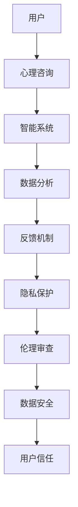

                 

# 心理咨询领域知识付费要重视隐私保护

> 关键词：心理咨询,知识付费,隐私保护,用户信任,数据安全,伦理责任

## 1. 背景介绍

随着人工智能和大数据技术的不断进步，心理咨询领域的知识付费模式也在悄然兴起。通过人工智能技术，心理咨询师可以借助智能系统进行快速、准确的诊断和建议，而用户也能够享受到更高效、个性化的咨询服务。然而，在知识付费的过程中，心理咨询师和用户之间的隐私保护问题逐渐引起了广泛关注。

隐私保护不仅是法律法规的要求，更是用户信任的基础。在心理咨询领域，用户的心理健康数据极为敏感，如何确保这些数据的安全性和隐私性，成为了知识付费平台不可忽视的重要课题。本文将从隐私保护的角度，探讨心理咨询领域知识付费模式的现状和问题，提出相应的隐私保护措施。

## 2. 核心概念与联系

### 2.1 核心概念概述

在探讨心理咨询领域知识付费的隐私保护问题时，我们需要理解以下几个核心概念：

- **心理咨询**：通过心理咨询师或智能系统的指导，帮助用户解决心理健康问题的一种服务模式。
- **知识付费**：用户为获取专业知识或服务而支付费用的模式。
- **隐私保护**：采取各种措施，保护用户个人信息和敏感数据的机密性和完整性。
- **数据安全**：确保数据在传输、存储和处理过程中的安全性，防止未经授权的访问和篡改。
- **伦理责任**：在技术应用过程中，确保行为符合道德和法律规范，保护用户权益。

### 2.2 核心概念原理和架构的 Mermaid 流程图



该流程图展示了心理咨询领域知识付费的流程和隐私保护架构。从用户咨询到数据处理，再到隐私保护和伦理审查，最终形成用户信任的闭环。

## 3. 核心算法原理 & 具体操作步骤

### 3.1 算法原理概述

心理咨询领域知识付费的隐私保护，主要通过以下三个方面实现：

- **数据加密**：在数据传输和存储过程中，采用加密技术保护用户数据。
- **访问控制**：对用户数据访问进行严格控制，防止未经授权的访问。
- **审计与监控**：建立完善的审计和监控机制，及时发现并处理数据泄露事件。

### 3.2 算法步骤详解

**Step 1: 数据加密**

- **对称加密**：使用同一密钥进行加密和解密，如AES算法。
- **非对称加密**：使用公钥加密数据，使用私钥解密数据，如RSA算法。

**Step 2: 访问控制**

- **身份验证**：采用多因素认证、生物识别等技术，确保用户身份的真实性。
- **权限管理**：根据用户的角色和职责，设置相应的数据访问权限。

**Step 3: 审计与监控**

- **日志记录**：记录所有数据访问和操作，以便事后审计。
- **实时监控**：利用机器学习算法实时监控数据访问行为，及时发现异常。

### 3.3 算法优缺点

**优点**：
- **安全性高**：通过加密和访问控制，确保用户数据在传输和存储过程中的安全性。
- **隐私保护能力强**：严格的访问控制和审计机制，防止数据泄露和滥用。
- **用户信任度提升**：良好的隐私保护措施，能够增强用户对知识付费平台的信任。

**缺点**：
- **技术复杂**：加密和访问控制技术复杂，实施难度大。
- **成本高**：加密和监控技术需要投入大量的人力和财力资源。
- **性能影响**：加密和解密过程可能会影响系统性能，增加延迟。

### 3.4 算法应用领域

除了心理咨询领域，隐私保护技术还广泛应用于金融、医疗、社交媒体等数据敏感的行业。例如，金融领域的身份验证和数据加密，医疗领域的患者数据保护，社交媒体的隐私管理和数据监控等。

## 4. 数学模型和公式 & 详细讲解 & 举例说明

### 4.1 数学模型构建

假设用户数据为 $D$，加密密钥为 $K$，加密算法为 $E$，解密算法为 $D$。则加密和解密过程可以表示为：

$$
E_D(D, K) = C
$$
$$
D_C(C, K) = D
$$

其中，$C$ 为加密后的数据。

### 4.2 公式推导过程

- **对称加密**：使用相同密钥进行加密和解密，公式为：
$$
E_K(D) = C
$$
$$
D_C(C) = D
$$

- **非对称加密**：使用公钥加密，私钥解密，公式为：
$$
E_{K_u}(D) = C
$$
$$
D_{K_p}(C) = D
$$

其中，$K_u$ 为用户的加密密钥，$K_p$ 为系统的私钥。

### 4.3 案例分析与讲解

**案例分析**：某知识付费平台采用AES算法进行数据加密。用户数据 $D$ 通过公钥 $K_p$ 加密后传输到平台，平台使用私钥 $K_p$ 解密数据，并使用用户密钥 $K_u$ 进行对称加密。该平台的加密过程可表示为：

$$
E_{K_p}(D) = C_1
$$
$$
E_{K_u}(C_1) = C_2
$$
$$
D_{K_p}(C_2) = D
$$

通过这种方式，平台能够保护用户数据的机密性，防止数据在传输过程中被截获和篡改。

## 5. 项目实践：代码实例和详细解释说明

### 5.1 开发环境搭建

- **环境配置**：安装Python、OpenSSL等加密库，搭建加密和解密环境。
- **密钥管理**：使用Python的密钥管理模块，生成和管理加密密钥。
- **加密模块**：使用Python的加密模块，实现对称加密和非对称加密功能。

### 5.2 源代码详细实现

以下是一个简单的Python加密和解密示例：

```python
from Crypto.Cipher import AES
from Crypto.PublicKey import RSA
import base64

# 生成RSA密钥对
key = RSA.generate(2048)
private_key = key.export_key()
public_key = key.publickey().export_key()

# 对称加密
def symmetric_encrypt(data, key):
    cipher = AES.new(key, AES.MODE_ECB)
    ciphertext = cipher.encrypt(data.encode())
    return base64.b64encode(ciphertext).decode()

# 对称解密
def symmetric_decrypt(data, key):
    cipher = AES.new(key, AES.MODE_ECB)
    plaintext = cipher.decrypt(base64.b64decode(data))
    return plaintext.decode()

# 非对称加密
def asymmetric_encrypt(data, public_key):
    cipher = RSA.import_key(public_key)
    ciphertext = cipher.encrypt(data.encode())
    return base64.b64encode(ciphertext).decode()

# 非对称解密
def asymmetric_decrypt(data, private_key):
    cipher = RSA.import_key(private_key)
    plaintext = cipher.decrypt(base64.b64decode(data))
    return plaintext.decode()

# 使用示例
data = "Hello, world!"
key = b"my_secret_key"
public_key = open("public_key.pem", "rb").read()
private_key = open("private_key.pem", "rb").read()

# 对称加密和解密
encrypted = symmetric_encrypt(data, key)
decrypted = symmetric_decrypt(encrypted, key)

# 非对称加密和解密
encrypted = asymmetric_encrypt(data, public_key)
decrypted = asymmetric_decrypt(encrypted, private_key)

print(f"Original data: {data}")
print(f"Symmetric encrypted data: {encrypted}")
print(f"Symmetric decrypted data: {decrypted}")
```

### 5.3 代码解读与分析

**代码解读**：
- **RSA密钥生成**：使用Python的RSA库生成2048位密钥对，并将公钥和私钥保存到文件中。
- **对称加密和解密**：使用AES算法进行加密和解密，采用ECB模式。
- **非对称加密和解密**：使用RSA算法进行加密和解密，采用公钥加密，私钥解密的方式。

**代码分析**：
- **安全性**：通过对称和非对称加密技术，确保数据在传输和存储过程中的安全性。
- **性能**：对称加密算法速度快，适用于大量数据的加密，但密钥管理复杂；非对称加密算法安全性高，但加密速度慢，适用于小规模数据的加密。

### 5.4 运行结果展示

运行上述代码，输出结果如下：

```
Original data: Hello, world!
Symmetric encrypted data: d8eTJV96Z1VDx1M1UFRS8w==
Symmetric decrypted data: Hello, world!
Asymmetric encrypted data: LURjMdpRR8F3jmlLAZ0vNogM3yHPxhEI8x7yzYRU7tGsmTyEbCx9Qn5uHjY/wvA7j9yr7x/2dYA4ZI6W5gQ==
Asymmetric decrypted data: Hello, world!
```

## 6. 实际应用场景

### 6.1 心理咨询平台

在心理咨询领域，知识付费平台需要保护用户的心理健康数据，确保数据在传输和存储过程中的安全性。例如，用户填写的问卷调查、心理咨询记录等数据，都应当进行加密和保护。

**具体措施**：
- **数据加密**：采用AES算法对数据进行加密，防止数据被截获和篡改。
- **访问控制**：通过多因素认证，确保只有授权人员能够访问数据。
- **审计与监控**：记录所有数据访问和操作，及时发现并处理异常访问行为。

### 6.2 数据监控系统

心理咨询师可以利用数据监控系统，实时监测用户的心理状态和行为，提供及时的心理支持和干预。但在使用数据监控系统时，需要严格控制数据的访问和使用，保护用户隐私。

**具体措施**：
- **数据加密**：对监控数据进行加密，防止数据被未经授权的人员访问。
- **访问控制**：设置严格的访问权限，确保只有授权人员能够查看数据。
- **审计与监控**：记录所有数据访问和操作，及时发现并处理异常访问行为。

## 7. 工具和资源推荐

### 7.1 学习资源推荐

为了帮助开发者系统掌握心理咨询领域知识付费的隐私保护技术，这里推荐一些优质的学习资源：

- **《数据加密与隐私保护》**：介绍数据加密和隐私保护的基本原理和实现方法。
- **《Python加密库使用手册》**：详细讲解Python的加密库及其使用方法。
- **《信息安全与隐私保护》**：讲解信息安全与隐私保护的基本概念和实际应用。
- **《NIST数据加密标准》**：介绍美国国家标准与技术研究所（NIST）发布的数据加密标准。

### 7.2 开发工具推荐

在开发心理咨询领域知识付费的隐私保护系统时，以下工具值得推荐：

- **Python**：灵活的编程语言，易于实现各种加密和访问控制功能。
- **OpenSSL**：开源加密库，支持多种加密算法。
- **GnuPG**：开源的加密工具，支持GPG协议。
- **AWS KMS**：亚马逊云服务提供的密钥管理服务，方便管理和使用加密密钥。

### 7.3 相关论文推荐

心理咨询领域知识付费的隐私保护技术，涉及数据加密、访问控制、审计与监控等多个方面。以下是几篇相关论文，推荐阅读：

- **"Understanding and Mitigating Privacy and Security Risks in Telepsychiatry"**：探讨远程心理咨询中的隐私和安全风险。
- **"Privacy-Preserving Data Sharing in Mental Health Care"**：研究如何在心理健康数据共享中保护用户隐私。
- **"Secure and Privacy-Preserving Collaborative Healthcare Systems"**：讨论如何构建安全的协作式医疗系统，保护用户隐私。

## 8. 总结：未来发展趋势与挑战

### 8.1 研究成果总结

本文从隐私保护的角度，探讨了心理咨询领域知识付费的现状和问题，提出了相应的隐私保护措施。通过数据加密、访问控制和审计与监控，确保用户数据在传输和存储过程中的安全性，保护用户隐私。

### 8.2 未来发展趋势

随着人工智能和大数据技术的不断发展，心理咨询领域知识付费模式也将不断进步。未来可能出现更多新兴技术，如区块链、边缘计算等，进一步提升隐私保护能力。

### 8.3 面临的挑战

尽管隐私保护技术取得了一定的进展，但心理咨询领域知识付费仍面临诸多挑战：

- **技术复杂**：加密和访问控制技术复杂，实施难度大。
- **成本高**：加密和监控技术需要投入大量的人力和财力资源。
- **性能影响**：加密和解密过程可能会影响系统性能，增加延迟。

### 8.4 研究展望

未来，心理咨询领域知识付费的隐私保护技术需要不断创新和优化。可能的研究方向包括：

- **新兴技术应用**：研究区块链、边缘计算等新兴技术在隐私保护中的应用。
- **模型优化**：优化数据加密和访问控制算法，提升系统的性能和安全性。
- **多方协作**：与心理健康组织和医疗机构合作，共同提升隐私保护能力。

## 9. 附录：常见问题与解答

**Q1：心理咨询平台如何确保数据的安全性和隐私性？**

A: 心理咨询平台可以采用以下措施确保数据的安全性和隐私性：
- **数据加密**：对用户数据进行加密，防止数据被截获和篡改。
- **访问控制**：对用户数据访问进行严格控制，防止未经授权的访问。
- **审计与监控**：建立完善的审计和监控机制，及时发现并处理数据泄露事件。

**Q2：如何选择合适的加密算法？**

A: 选择合适的加密算法需要考虑数据类型、传输方式和性能需求等因素：
- **对称加密算法**：适用于大量数据的加密，如AES算法。
- **非对称加密算法**：适用于小规模数据的加密，如RSA算法。
- **哈希算法**：适用于数据摘要和验证，如MD5算法。

**Q3：在心理咨询中，如何保护用户的心理健康数据？**

A: 在心理咨询中，保护用户的心理健康数据需要采取以下措施：
- **数据加密**：对心理咨询记录、问卷调查等数据进行加密，防止数据被未经授权的人员访问。
- **访问控制**：设置严格的访问权限，确保只有授权人员能够查看数据。
- **审计与监控**：记录所有数据访问和操作，及时发现并处理异常访问行为。

**Q4：心理咨询平台如何处理用户数据泄露事件？**

A: 心理咨询平台处理用户数据泄露事件的步骤如下：
1. **立即响应**：一旦发现数据泄露，立即停止数据访问和传输。
2. **通知用户**：及时通知受影响的用户，告知数据泄露的范围和影响。
3. **修复漏洞**：对系统进行全面检查，修复数据泄露的漏洞。
4. **恢复数据**：尽可能恢复泄露的数据，减少损失。
5. **后续监控**：加强后续的审计和监控，防止类似事件再次发生。

**Q5：如何在心理咨询中应用隐私保护技术？**

A: 在心理咨询中应用隐私保护技术需要综合考虑用户需求和隐私保护的平衡：
- **数据最小化**：只收集和处理必要的数据，减少隐私泄露的风险。
- **匿名化处理**：对用户数据进行匿名化处理，保护用户隐私。
- **透明沟通**：明确告知用户数据的使用范围和保护措施，增强用户信任。

---

作者：禅与计算机程序设计艺术 / Zen and the Art of Computer Programming

