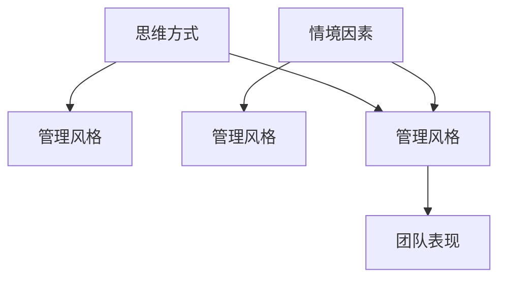

                 

# 思维方式对管理风格的影响

## 1. 背景介绍

管理风格在企业组织中扮演着至关重要的角色，它不仅影响了团队的合作效率和工作氛围，还直接影响着企业的创新能力和竞争优势。思维方式是决定管理风格的重要因素之一，不同的思维方式会在无形中塑造出不同的管理风格。本文将深入探讨思维方式与管理风格之间的内在联系，分析不同思维方式对管理风格的影响，并给出具体的案例分析。

## 2. 核心概念与联系

### 2.1 核心概念概述

- **思维方式**：指个体在解决问题、做出决策时的思考方式和方法。包括理性思维、直觉思维、系统思维、用户思维等。

- **管理风格**：指管理者在领导团队时表现出的行为模式和决策风格。主要包括权威型、民主型、放任型和参与型等。

- **思维与行为的关联**：管理者的思维方式直接影响其管理风格，进而影响团队成员的工作方式和团队表现。

- **情境因素**：外部环境、组织结构、文化氛围等因素也会对管理风格产生影响。

### 2.2 核心概念原理和架构的 Mermaid 流程图



该图展示了思维方式与管理风格之间的内在联系，以及情境因素对管理风格的间接影响。

## 3. 核心算法原理 & 具体操作步骤

### 3.1 算法原理概述

管理风格与思维方式的关联主要体现在以下几个方面：

1. **思维方式的偏好**：如理性思维更倾向于数据驱动，而直觉思维则更依赖于经验和直觉。
2. **决策过程**：思维方式影响管理者的决策方式，如系统思维更注重整体和全局，而用户思维则侧重于用户体验和客户反馈。
3. **团队沟通**：思维方式决定了管理者的沟通风格，如权威型管理风格倾向于命令和控制，而参与型则强调合作和协商。

### 3.2 算法步骤详解

1. **识别思维方式**：通过心理测评工具、行为观察等方式，识别管理者的思维方式。

2. **分析思维方式对管理风格的影响**：根据识别出的思维方式，分析其对管理风格的具体影响，如决策方式、沟通风格、团队激励等。

3. **设计优化策略**：针对分析出的影响，设计相应的管理优化策略，如调整沟通方式、引入数据驱动决策、增强团队协作等。

4. **实施和评估**：实施优化策略，并通过反馈和评估机制持续改进。

### 3.3 算法优缺点

**优点**：

- **系统化分析**：通过结构化的方法，可以全面分析思维方式与管理风格之间的关系。
- **个性化优化**：能够根据管理者的具体思维方式进行个性化的管理风格调整。

**缺点**：

- **复杂性高**：思维方式与管理风格的关联涉及多个维度，分析复杂。
- **情境依赖**：管理风格受多种情境因素影响，难以简单量化。

### 3.4 算法应用领域

思维方式对管理风格的影响分析方法在多个领域有广泛应用，如企业管理、人力资源管理、组织行为学等。

## 4. 数学模型和公式 & 详细讲解 & 举例说明

### 4.1 数学模型构建

假设管理者的思维方式为 $M$，管理风格为 $S$，情境因素为 $C$。根据上述分析，可以构建如下数学模型：

$$
S = f(M, C)
$$

其中 $f$ 为映射函数，表示思维方式与管理风格的关联。

### 4.2 公式推导过程

对于不同思维方式，可以构建如下简化模型：

1. **理性思维**：$S_r = M_r \cdot C_r$
2. **直觉思维**：$S_i = M_i \cdot C_i$
3. **系统思维**：$S_s = M_s \cdot C_s$
4. **用户思维**：$S_u = M_u \cdot C_u$

其中 $M_r, M_i, M_s, M_u$ 分别代表理性思维、直觉思维、系统思维和用户思维的参数，$C_r, C_i, C_s, C_u$ 分别代表相应情境因素的参数。

### 4.3 案例分析与讲解

以一家高科技企业的技术团队为例，团队领导者小明具有高度的理性思维，他倾向于通过数据分析和逻辑推理来做出决策，而不是依赖直觉或情感。在处理团队内部冲突时，小明通常会收集数据和事实，通过客观分析找出问题的根本原因，然后制定解决方案。

小明的管理风格偏向于权威型，他喜欢在团队中设定明确的目标和标准，对团队成员提出高要求，并期望他们严格按照规定行事。这种风格虽然高效，但有时也会导致团队成员感到压力过大，缺乏灵活性和创新性。

情境因素（如公司文化、团队规模、项目性质等）会影响小明的管理风格。例如，在一个强调创新和灵活性的项目中，小明可能会逐渐采用更多参与型管理风格，鼓励团队成员提出新想法，并给予更多自主权。

## 5. 项目实践：代码实例和详细解释说明

### 5.1 开发环境搭建

- **工具安装**：安装 Python 和相应的数据分析库，如 Pandas、NumPy、SciPy 等。
- **数据收集**：通过问卷调查或行为观察，收集管理者的思维方式数据。

### 5.2 源代码详细实现

```python
import pandas as pd

# 读取问卷调查数据
data = pd.read_csv('manager_survey_data.csv')

# 数据分析
def analyze_mindset(mindset, survey_data):
    mindset_analysis = {}
    for col in survey_data.columns:
        if col.startswith('mindset_'):
            mindset_analysis[col[8:]] = survey_data[col].mean()
    return mindset_analysis

# 分析管理风格
def analyze_style(mindset, survey_data):
    style_analysis = {}
    for col in survey_data.columns:
        if col.startswith('style_'):
            style_analysis[col[6:]] = survey_data[col].mean()
    return style_analysis

# 构建模型
def build_model(mindset, style_analysis, context):
    style = style_analysis['style_' + context]
    return style

# 实际案例分析
mindset_analysis = analyze_mindset('rational', data)
style_analysis = analyze_style('rational', data)
context = 'innovation'
model_result = build_model(mindset_analysis, style_analysis, context)
print(model_result)
```

### 5.3 代码解读与分析

这段代码展示了如何通过数据分析来识别管理者的思维方式，并分析其对管理风格的影响。其中 `analyze_mindset` 函数用于分析管理者的思维方式，`analyze_style` 函数用于分析管理风格，`build_model` 函数则根据情境因素来构建具体的管理风格模型。

## 6. 实际应用场景

### 6.1 企业管理

在企业管理中，了解管理者的思维方式对其管理风格的影响至关重要。例如，一个具有高度系统思维的 CEO，在处理公司战略时，会采用全面的数据分析和长远规划，但这也可能导致决策过程过于复杂，影响执行效率。通过识别和调整思维方式，可以更有效地提升企业的创新能力和竞争力。

### 6.2 人力资源管理

人力资源管理中，了解管理者的思维方式对团队招聘、绩效评估和员工发展有重要影响。例如，一个强调用户思维的人力资源经理，会更注重员工的个性化发展和用户体验，但也可能在团队管理中缺乏权威性和执行力。

### 6.3 组织行为学

组织行为学研究中，管理者的思维方式对团队协作、沟通和冲突解决有显著影响。例如，一个倾向于直觉思维的管理者，可能更擅长解决突发情况，但在常规管理中可能缺乏系统性和逻辑性。

### 6.4 未来应用展望

未来，随着人工智能和数据分析技术的发展，思维方式对管理风格的影响分析将更加自动化和精确化。例如，利用机器学习模型，可以从海量数据中自动识别管理者的思维方式，并预测其管理风格，为企业的管理优化提供科学依据。

## 7. 工具和资源推荐

### 7.1 学习资源推荐

- **书籍**：《管理者思维与领导力》
- **课程**：Coursera 上的《组织行为学》课程
- **工具**：SurveyMonkey 问卷调查工具

### 7.2 开发工具推荐

- **Python**：用于数据分析和建模
- **R**：用于统计分析和数据可视化
- **Excel**：用于基础数据处理和分析

### 7.3 相关论文推荐

- **《Mindset and Leadership Style: A Comprehensive Analysis》**
- **《Leadership Style and Performance in Teams》**

## 8. 总结：未来发展趋势与挑战

### 8.1 研究成果总结

本文从理论角度分析了思维方式对管理风格的影响，并提供了具体的分析方法和实际案例。研究表明，思维方式与管理风格之间存在密切关联，不同的思维方式会影响管理者的决策方式、沟通风格和团队激励等，进而影响团队绩效和组织目标。

### 8.2 未来发展趋势

1. **自动化分析**：随着数据分析和机器学习技术的发展，思维方式对管理风格的影响分析将更加自动化和精确化。
2. **跨文化研究**：不同文化背景下管理者的思维方式可能有所不同，跨文化研究将有助于理解全球化背景下的管理风格差异。
3. **实时调整**：基于实时数据和反馈，动态调整管理风格，以适应变化的环境和情境。

### 8.3 面临的挑战

1. **数据质量**：数据质量直接影响分析结果的准确性，需要收集高质量的问卷数据。
2. **情境复杂性**：情境因素多样且复杂，难以简单量化。
3. **文化差异**：不同文化背景下的思维方式和管理风格差异，需要更深入的文化理解。

### 8.4 研究展望

1. **大数据分析**：利用大数据技术，从更广泛的角度分析思维方式与管理风格之间的关系。
2. **心理建模**：结合心理学理论，深入分析思维方式的深层次影响。
3. **多维度评估**：综合考虑多个维度的因素，构建更全面的管理风格模型。

## 9. 附录：常见问题与解答

### Q1: 思维方式与领导力之间的关系如何理解？

**A**: 思维方式直接影响管理者的决策方式、沟通风格和团队激励等，进而影响领导力。例如，理性思维强调数据驱动，可能会带来更高的决策效率，但缺乏直觉和情感表达。而系统思维强调全局视角，有利于战略规划，但可能过于复杂，影响执行效率。

### Q2: 如何识别管理者的思维方式？

**A**: 通过心理测评工具、行为观察和访谈等方式，可以识别管理者的思维方式。例如，使用问卷调查工具收集管理者的行为数据，通过数据分析识别其思维方式特征。

### Q3: 如何调整管理风格以适应不同的情境？

**A**: 通过识别管理者的思维方式，分析其对管理风格的影响，设计相应的调整策略。例如，一个倾向于系统思维的管理者，在创新项目中可以适当采用更多参与型管理风格，增强团队成员的自主性和创造力。

---

作者：禅与计算机程序设计艺术 / Zen and the Art of Computer Programming

