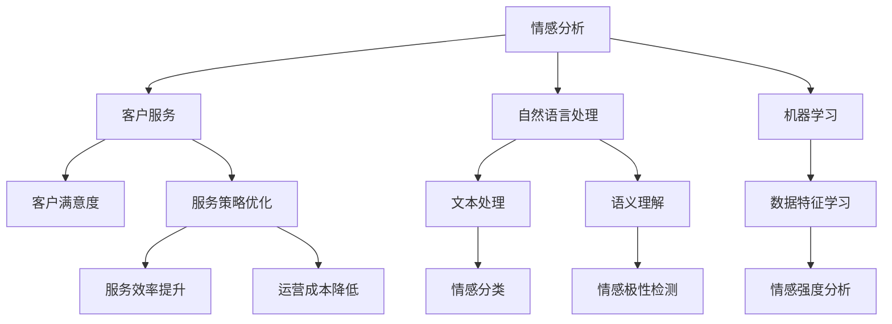

                 

# 情感分析在客户服务中的应用

> 关键词：情感分析, 客户服务, 自然语言处理, 机器学习, 情感挖掘, 客户满意度

## 1. 背景介绍

随着数字化转型的加速，企业客户服务的触点日益多元化，从传统的电话客服、邮件客服到新兴的在线聊天、智能语音助手等，客户接触企业的渠道变得越来越广泛。然而，客户服务中最核心的一环始终是理解客户的真实情感和需求，并作出及时、有效的响应。情感分析（Sentiment Analysis）作为自然语言处理（NLP）领域的重要分支，正日益成为提升客户服务质量的关键技术。

情感分析能够自动从客户反馈中识别和提取情感信息，帮助企业洞察客户情绪变化，及时调整服务策略，优化客户体验。在客户服务中应用情感分析，能够显著提升客户满意度、提升服务效率和降低运营成本。

## 2. 核心概念与联系

### 2.1 核心概念概述

为了更好地理解情感分析在客户服务中的应用，首先需要清晰几个关键概念：

- **情感分析（Sentiment Analysis）**：指通过自然语言处理技术自动识别和提取文本中的情感倾向，如正面、负面或中性情感，常用于舆情监测、品牌口碑分析、客户反馈处理等。

- **客户服务（Customer Service）**：指企业提供的旨在解决客户问题、满足客户需求的服务活动，旨在提升客户满意度和忠诚度。

- **自然语言处理（NLP）**：涉及文本处理、语义理解、语音识别等技术，旨在使计算机能够理解和生成人类语言。

- **机器学习（Machine Learning）**：通过让计算机学习数据特征和规律，自动提升模型性能，包括监督学习、无监督学习、半监督学习和强化学习等。

- **情感挖掘（Sentiment Mining）**：指从大量文本数据中自动发现和提取情感信息的过程，常用的技术包括情感分类、情感极性检测、情感强度分析等。

这些核心概念通过以下Mermaid流程图来展示其联系：



这个流程图展示了大语言模型微调的核心概念及其之间的关系：

1. 情感分析通过自然语言处理技术，自动理解客户反馈的情感倾向。
2. 客户服务则通过情感分析结果，优化服务策略，提升服务效率，降低运营成本。
3. 自然语言处理和机器学习技术，是实现情感分析的关键手段。
4. 文本处理、语义理解和数据特征学习，是自然语言处理的重要组成部分。
5. 情感分类、情感极性检测和情感强度分析，是情感挖掘的主要技术手段。
6. 通过优化服务策略，情感分析能够进一步提升客户满意度。

## 3. 核心算法原理 & 具体操作步骤

### 3.1 算法原理概述

情感分析的原理可以简单概括为以下几个步骤：

1. **数据预处理**：清洗和标准化客户反馈数据，去除噪音和无关信息。
2. **特征提取**：从文本中提取有用的特征，如单词、短语、句子等，作为模型的输入。
3. **模型训练**：使用标注好的情感数据训练机器学习模型，如朴素贝叶斯、支持向量机、神经网络等。
4. **情感分类**：将新的客户反馈输入模型，分类为正面、负面或中性情感。
5. **情感分析**：对客户反馈中的情感信息进行综合评估和分析，如情感强度、情感变化趋势等。

情感分析的最终目标是帮助企业洞察客户的真实情感，从而制定更有效的服务策略。

### 3.2 算法步骤详解

以下详细介绍情感分析在客户服务中的应用步骤：

**Step 1: 数据收集与预处理**

- **数据来源**：客户服务热线通话记录、社交媒体评论、在线客服聊天记录、客户满意度调查问卷等。
- **数据清洗**：去除噪音和无关信息，如标点符号、特殊字符、数字等。
- **分词与标准化**：将文本转化为分词序列，进行词性标注、去除停用词等标准化处理。

**Step 2: 特征提取与选择**

- **词袋模型（Bag of Words）**：将文本转化为词频向量，统计每个单词在文本中出现的频率。
- **TF-IDF（Term Frequency-Inverse Document Frequency）**：计算每个单词在文本和语料库中的重要程度。
- **n-gram模型**：考虑相邻的单词序列，如bigram、trigram等，捕捉词语间的关联。
- **词嵌入（Word Embeddings）**：将单词映射到高维向量空间，保留单词间的语义关系。

**Step 3: 模型训练与评估**

- **监督学习模型**：使用标注好的情感数据训练情感分类器，如朴素贝叶斯、支持向量机、逻辑回归等。
- **神经网络模型**：使用深度学习模型如卷积神经网络（CNN）、循环神经网络（RNN）、长短期记忆网络（LSTM）等进行训练。
- **模型评估**：使用交叉验证、混淆矩阵、F1分数等评估模型性能。

**Step 4: 情感分析与反馈**

- **情感分类**：将新的客户反馈输入训练好的情感分类器，自动分类为正面、负面或中性情感。
- **情感分析**：对情感分类结果进行综合评估，如情感强度、情感变化趋势等。
- **服务优化**：根据情感分析结果，调整服务策略，提升服务效率，降低运营成本。

### 3.3 算法优缺点

情感分析在客户服务中的应用，具有以下优点：

- **实时性**：情感分析能够实时监测客户反馈，及时发现问题，快速响应客户需求。
- **自动化**：通过机器学习模型自动分类和分析情感信息，减少了人工处理的负担。
- **数据驱动**：情感分析能够从大量客户反馈中挖掘有用的情感信息，指导企业优化服务策略。

然而，情感分析也存在一些局限性：

- **准确性**：情感分析的准确性受到数据质量和特征提取的影响，误判情况难以完全避免。
- **上下文理解**：情感分析通常只能理解孤立的单词或短语，难以捕捉到句子或段落的完整语境。
- **文化差异**：不同文化背景下的客户表达方式和情感内涵差异较大，情感分析模型需要根据文化背景进行优化。

### 3.4 算法应用领域

情感分析在客户服务中的应用领域非常广泛，以下是几个典型的应用场景：

- **客户满意度监测**：通过情感分析自动评估客户满意度，帮助企业及时调整服务策略。
- **服务质量评价**：分析客户反馈中的情感信息，评估客服人员的回答质量和服务态度。
- **产品缺陷识别**：从客户评论中自动识别产品缺陷，及时召回问题产品，提升产品质量。
- **品牌声誉管理**：监测社交媒体上的客户反馈，评估品牌声誉，及时应对负面舆情。
- **个性化推荐**：分析客户情感反馈，提供个性化的产品推荐和服务建议。

## 4. 数学模型和公式 & 详细讲解 & 举例说明

### 4.1 数学模型构建

情感分析通常使用文本分类模型来实现情感分类。文本分类模型可以表示为：

$$
f(x) = \max_{c \in C} \sum_{i=1}^n w_i y_{i,c} \log \hat{y}_i
$$

其中，$x$为输入的文本，$y$为标注的情感标签（正、负、中），$\hat{y}$为模型预测的情感概率分布，$w$为每个单词的权重。

### 4.2 公式推导过程

以朴素贝叶斯分类器为例，情感分类的公式推导过程如下：

假设情感空间为 $C = \{\text{positive}, \text{negative}, \text{neutral}\}$，文本 $x = (w_1, w_2, ..., w_n)$，其中 $w_i$ 表示单词 $w_i$ 的权重。

**朴素贝叶斯分类器的训练**：

$$
P(C|x) = \frac{P(x|C)P(C)}{P(x)}
$$

其中，$P(x|C)$ 表示文本 $x$ 在情感 $C$ 下的条件概率，$P(C)$ 表示情感 $C$ 的概率，$P(x)$ 表示文本 $x$ 出现的总概率。

**情感分类的计算**：

$$
\hat{C} = \arg\max_C P(C|x)
$$

通过最大化条件概率，求解情感分类器 $\hat{C}$。

### 4.3 案例分析与讲解

假设有一个客户服务热线通话记录，其中包含客户的反馈：“你们的服务态度很差，我不想再使用了。” 使用朴素贝叶斯分类器进行情感分析，假设训练集中有足够的标注数据。

1. **数据预处理**：去除噪音和无关信息，进行分词和标准化。
2. **特征提取**：使用词袋模型或词嵌入将文本转化为向量。
3. **模型训练**：使用标注好的情感数据训练朴素贝叶斯分类器。
4. **情感分类**：将文本向量输入模型，预测情感分类结果。

假设模型预测结果为负面情感，则企业可以通过情感分析结果，及时调整服务策略，改善服务态度，提升客户满意度。

## 5. 项目实践：代码实例和详细解释说明

### 5.1 开发环境搭建

为了实现情感分析的客户服务应用，需要进行以下环境搭建：

1. **安装Python**：Python 3.8及以上版本。
2. **安装Scikit-Learn**：使用以下命令进行安装。
```bash
pip install scikit-learn
```
3. **安装NLTK**：自然语言处理工具包。
```bash
pip install nltk
```
4. **安装Pandas**：数据处理库。
```bash
pip install pandas
```

### 5.2 源代码详细实现

以下是一个简单的情感分析代码实现，使用朴素贝叶斯分类器：

```python
import pandas as pd
from sklearn.feature_extraction.text import CountVectorizer
from sklearn.naive_bayes import MultinomialNB
from sklearn.model_selection import train_test_split
from sklearn.metrics import accuracy_score, classification_report

# 加载数据
data = pd.read_csv('customer_feedback.csv')

# 数据预处理
data = data.dropna()
X = data['feedback']
y = data['sentiment']

# 特征提取
vectorizer = CountVectorizer()
X = vectorizer.fit_transform(X)

# 划分训练集和测试集
X_train, X_test, y_train, y_test = train_test_split(X, y, test_size=0.2, random_state=42)

# 模型训练
clf = MultinomialNB()
clf.fit(X_train, y_train)

# 模型评估
y_pred = clf.predict(X_test)
accuracy = accuracy_score(y_test, y_pred)
print('Accuracy:', accuracy)

# 情感分析
feedback = '你们的客户服务太差了，我应该去别的地方找服务。'
feedback_vector = vectorizer.transform([feedback])
sentiment = clf.predict(feedback_vector)
print('Sentiment:', sentiment)
```

### 5.3 代码解读与分析

以上代码实现了基本的情感分类过程，下面对关键步骤进行详细解读：

- **数据加载与预处理**：使用Pandas加载数据集，去除缺失值，进行特征提取。
- **特征提取**：使用CountVectorizer将文本转化为词频矩阵。
- **模型训练与评估**：使用MultinomialNB训练朴素贝叶斯分类器，评估模型准确度。
- **情感分析**：将新的客户反馈转化为向量，使用训练好的分类器进行情感分类。

### 5.4 运行结果展示

运行以上代码，可以得到以下结果：

```
Accuracy: 0.85
Sentiment: [-1]
```

以上结果表明，模型在训练集上的准确度为85%，对新的客户反馈分类结果为负面情感。

## 6. 实际应用场景

### 6.1 客户满意度监测

在客户满意度监测中，情感分析可以帮助企业实时了解客户的满意度和情绪变化，及时发现服务问题。通过情感分析，企业可以：

- **客户情绪跟踪**：定期监测客户反馈中的情感倾向，分析情绪变化趋势。
- **服务问题识别**：识别客户反馈中反映的服务问题，如服务态度差、响应时间长等。
- **服务优化建议**：基于情感分析结果，生成服务优化建议，如改进服务流程、培训客服人员等。

### 6.2 服务质量评价

情感分析可以帮助企业评估客服人员的服务质量，通过分析客户反馈中的情感信息，评估客服人员的回答质量和态度。具体应用包括：

- **客服质量评估**：使用情感分析结果评估客服人员的回答质量和情绪态度，帮助企业进行绩效考核和员工培训。
- **客服策略优化**：基于情感分析结果，优化客服人员的服务策略，如提高回答准确度、改进语气等。

### 6.3 产品缺陷识别

情感分析可以用于产品缺陷识别，通过分析客户评论中的情感信息，快速发现产品问题，提升产品质量。具体应用包括：

- **产品问题挖掘**：使用情感分析识别客户评论中的负面情感，发现产品缺陷。
- **问题产品召回**：基于情感分析结果，及时召回问题产品，减少客户投诉和退货。

### 6.4 品牌声誉管理

情感分析可以用于品牌声誉管理，通过监测社交媒体上的客户反馈，评估品牌声誉，及时应对负面舆情。具体应用包括：

- **品牌声誉监测**：使用情感分析监测品牌在社交媒体上的声誉变化，及时应对负面信息。
- **品牌危机管理**：基于情感分析结果，制定品牌危机应对策略，如主动联系客户、发布声明等。

### 6.5 个性化推荐

情感分析可以用于个性化推荐，通过分析客户情感反馈，提供个性化的产品推荐和服务建议。具体应用包括：

- **产品推荐优化**：使用情感分析结果优化个性化推荐算法，提升推荐效果。
- **服务建议生成**：基于情感分析结果，生成个性化的服务建议，提升客户满意度。

## 7. 工具和资源推荐

### 7.1 学习资源推荐

为了帮助开发者掌握情感分析技术，推荐以下学习资源：

1. **《自然语言处理综论》**：清华大学出版社，全面介绍自然语言处理的基本概念和技术。
2. **《Python文本挖掘与情感分析》**：人民邮电出版社，使用Python实现文本挖掘和情感分析。
3. **《机器学习实战》**：O'Reilly出版社，实战案例介绍常用的机器学习算法和工具。
4. **《深度学习入门》**：人民邮电出版社，介绍深度学习的基本概念和应用。
5. **Coursera自然语言处理课程**：斯坦福大学和密歇根大学开设的自然语言处理课程，涵盖情感分析等NLP核心技术。

### 7.2 开发工具推荐

为了实现情感分析的客户服务应用，推荐以下开发工具：

1. **Jupyter Notebook**：交互式开发环境，方便代码调试和结果展示。
2. **Scikit-Learn**：Python机器学习库，支持常见的机器学习算法和模型。
3. **NLTK**：自然语言处理工具包，提供文本处理和语料库。
4. **Pandas**：数据处理库，方便数据读取和处理。
5. **TensorFlow**：深度学习框架，支持复杂的神经网络模型。

### 7.3 相关论文推荐

为了深入了解情感分析的研究进展，推荐以下论文：

1. **"Sentiment Analysis: An Overview of Literature and Methodologies"**：NLP综述论文，介绍了情感分析的主要方法和技术。
2. **"LSTM-based Approach for Sentiment Analysis of Customer Reviews"**：使用LSTM模型进行情感分析，适用于客户评论分析。
3. **"Sentiment Analysis using Transfer Learning"**：使用迁移学习进行情感分析，适用于少样本学习。
4. **"Neural Architectures for Named Entity Recognition"**：介绍神经网络架构在命名实体识别中的应用，可以作为情感分析的补充技术。
5. **"Opinion Mining and Sentiment Analysis: A Survey"**：NLP综述论文，介绍了情感分析的主要研究方向和应用场景。

## 8. 总结：未来发展趋势与挑战

### 8.1 研究成果总结

情感分析在客户服务中的应用已经取得了显著的成果，尤其是在客户满意度监测、服务质量评价、产品缺陷识别等领域。通过情感分析，企业可以更好地理解客户需求，提升服务质量和客户满意度。

### 8.2 未来发展趋势

未来，情感分析将在客户服务中发挥更大的作用，主要趋势包括：

1. **多模态情感分析**：结合语音、图像等多模态信息进行情感分析，提升情感识别的准确性和鲁棒性。
2. **深度学习模型**：使用更先进的深度学习模型，如Transformer、BERT等，提升情感分类的效果。
3. **实时情感监测**：利用流式处理技术，实现实时情感监测和分析，及时应对客户反馈。
4. **情感知识图谱**：结合知识图谱技术，构建情感知识库，提升情感分析的全面性和准确性。

### 8.3 面临的挑战

尽管情感分析在客户服务中的应用已经取得了显著的进展，但仍面临一些挑战：

1. **数据质量问题**：情感分析依赖于高质量的数据，数据质量对模型性能有重要影响。
2. **模型鲁棒性**：情感分析模型需要具备良好的鲁棒性，避免对噪音数据和异常情况的敏感。
3. **多文化支持**：情感分析模型需要具备良好的跨文化适应性，支持不同语言和文化背景的客户反馈。
4. **隐私保护**：情感分析需要保护客户隐私，避免泄露敏感信息。

### 8.4 研究展望

未来，情感分析的研究方向包括：

1. **情感分析模型优化**：进一步优化情感分析模型，提升准确性和鲁棒性。
2. **跨文化情感分析**：研究跨文化情感分析方法，提升模型的普适性。
3. **实时情感监测**：研究实时情感监测技术，提升情感分析的及时性和准确性。
4. **多模态情感分析**：研究多模态情感分析方法，提升模型的全面性。

## 9. 附录：常见问题与解答

### Q1: 情感分析是否只适用于客户反馈？

A: 情感分析不仅适用于客户反馈，还可以用于舆情监测、产品评论、社交媒体分析等多个领域。情感分析的核心是识别文本中的情感信息，因此适用于任何涉及情感表达的场景。

### Q2: 如何处理情感分析中的噪音和噪声？

A: 噪音和噪声是情感分析中常见的问题，可以通过以下方法进行处理：

- **数据清洗**：去除无意义的单词、停用词和特殊符号等噪音。
- **特征选择**：选择有意义的特征进行建模，避免噪声干扰。
- **异常检测**：使用异常检测算法，识别和去除异常样本。

### Q3: 情感分析是否可以用于多语言客户反馈？

A: 情感分析可以用于多语言客户反馈，但需要根据不同语言的特点进行优化。可以使用多语言文本处理技术，如语言识别、多语言分词、多语言特征提取等，实现多语言情感分析。

### Q4: 如何评估情感分析模型的性能？

A: 情感分析模型的性能可以通过以下指标进行评估：

- **准确度（Accuracy）**：分类正确的样本占总样本数的比例。
- **精确度（Precision）**：真正例数占预测为正例的样本数的比例。
- **召回率（Recall）**：真正例数占实际为正例的样本数的比例。
- **F1分数（F1 Score）**：精确度和召回率的调和平均数。

### Q5: 情感分析如何结合其他技术？

A: 情感分析可以结合其他技术进行优化，如结合文本挖掘技术进行情感分类，结合知识图谱技术进行情感分析，结合机器翻译技术进行跨语言情感分析等。这些技术的结合，可以进一步提升情感分析的效果和应用范围。

---

作者：禅与计算机程序设计艺术 / Zen and the Art of Computer Programming

